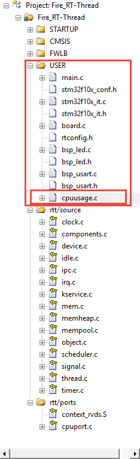
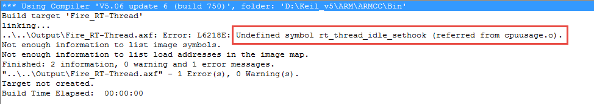
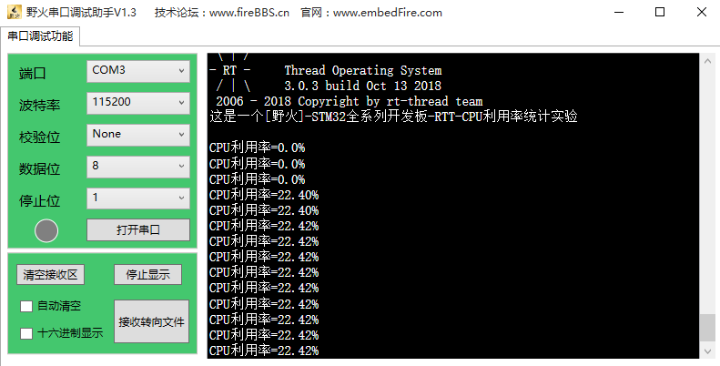

.. vim: syntax=rst

CPU利用率统计
===============

CPU利用率的基本概念
~~~~~~~~~~~~~~~~~~~~~~

CPU使用率其实就是系统运行的程序占用的CPU资源，表示机器在某段时间程序运行的情况，如果这段时间中，程序一
直在占用CPU的使用权，那么可以人为CPU的利用率是100%。CPU的利用率越高，说明机器在这个时间上运行了很多程
序，反之较少。利用率的高低与CPU强弱有直接关系，就像一段一模一样的程序，如果使用运算速度很慢的CPU，它
可能要运行1000ms，而使用很运算速度很快的CPU可能只需要10ms，那么在1000ms这段时间中，前者的CPU利用率就
是100%，而后者的CPU利用率只有1%，因为1000ms内前者都在使用CPU做运算，而后者只使用10ms的时间做运算，
剩下的时间CPU可以做其他事情。

RT-Thread是多线程操作系统，对 CPU 都是分时使用的：比如A进程占用10ms，然后B进程占用30ms，然后空
闲60ms，再又是A进程占10ms，B进程占30ms，空闲60ms;如果在一段时间内都是如此，那么这段时间内的利
用率为40%，因为整个系统中只有40%的时间是CPU处理数据的时间。

CPU利用率的作用
~~~~~~~~~~~~~~~~~~

一个系统设计的好坏，可以使用CPU使用率来衡量，一个好的系统必然是能完美响应急需的处理，并且系统的资源不会过于浪费（性价比高）。举个例子，假设一个系统的CPU利用率经常在90%~100%徘徊，那么系统就很少有空闲的时候，这时候突然有一些事情急需CPU的处理，但是此时CPU都很可能被其他线程在占用了，
那么这个紧急事件就有可能无法被相应，即使能被相应，那么占用CPU的线程又处于等待状态，这种系统就是不够完美的，因为资源处理得太过于紧迫；反过来，假如CPU的利用率在1%以下，那么我们就可以认为这种产品的资源过于浪费，搞一个那么好的CPU去干着没啥意义的活（大部分时间处于空闲状态），使用，作为产品的设
计，既不能让资源过于浪费，也不能让资源过于紧迫，这种设计才是完美的，在需要的时候能及时处理完突发事件，而且资源也不会过剩，性价比更高。

.. _cpu利用率统计-1:

CPU利用率统计
~~~~~~~~~~~~~~~~

RT-Thread给我们提供一个CPU统计的代码文件，该代码并非RT-Thread内核资源，只是利用RT-Thread中空闲线程来统计CPU的利用率，实现的算法原理很简单，在RT-
Thread的空闲线程计算出在一段时间内处于空闲线程的时间，就知道CPU在有效干活的时间，从而得到CPU的利用率。下面来看看CPU利用率统计的源码文件，该文件在rt-thread--master\examples\kernel路径下，名字叫cpuusage.c。

如果需要使用它来统计CPU利用率，那么需要先将该文件添加到我们的工程中，我们首先将cpuusage.c文件复制到我们模板工程的User文件夹下面，然后添加到我们的工程分组中，具体见图27‑1。

图27‑1将cpuusage.c文件添加到工程

添加到工程文件中的时候我们可以进行编译一次工程，会发现有错误，发现提示无法识别rt_thread_idle_sethook()函数，该函数在cpuusage.c文件中被调用，具体见图27‑2。

图27‑2编译时发生错误

原来，rt_thread_idle_sethook()函数是一个钩子函数，看函数的名字就知道函数的作用了，该函数是系统定义的函数，只有启用空闲钩子函数的时候编译器才会将空闲钩子函数相关的代码编译进来，我们就在rtconfig.h中将RT_USING_IDLE_HOOK宏定义打开，再次编译的时候就会发
现错误已经消失了，这样子我们就能使用cpuusage.c文件提供的函数来统计我们的CPU利用率了。

为了使用方便，我们再创建一个与cpuusage.c源码文件对应的头文件cpuusage.h，目的是为了声明cpuusage.c文件中对外提供的函数接口，方便调用这些函数，具体见代码清单27‑1，cpuusage.c源码文件具体见代码清单27‑2。

.. code-block:: c
    :caption: 代码清单27‑1cpuusage.h文件（自己创建的）
    :linenos:

    #ifndef __CPUUSAGE_H__
    #define __CPUUSAGE_H__

    #include <rtthread.h>
    #include <rthw.h>

    /* 获取cpu利用率 */
    void cpu_usage_init(void);
    void cpu_usage_get(rt_uint8_t *major, rt_uint8_t *minor);

    #endif

.. code-block:: c
    :caption: 代码清单27‑2cpuusage.c文件（文件路径：rt-thread\examples\kernel）
    :emphasize-lines: 52-65
    :linenos:

    #include <rtthread.h>
    #include <rthw.h>
    #include"cpuusage.h"

    #define CPU_USAGE_CALC_TICK    1000
    #define CPU_USAGE_LOOP        100

    static rt_uint8_t  cpu_usage_major = 0, cpu_usage_minor= 0;
    static rt_uint32_t total_count = 0;

    static void cpu_usage_idle_hook()
    {
        rt_tick_t tick;
        rt_uint32_t count;
    volatile rt_uint32_t loop;

    if (total_count == 0) {				(1)
    /* get total count */
            rt_enter_critical();				(2)
            tick = rt_tick_get();				(3)
    while (rt_tick_get() - tick < CPU_USAGE_CALC_TICK) {
                total_count ++;				(4)
                loop = 0;
    while (loop < CPU_USAGE_LOOP) loop ++;
            }
            rt_exit_critical();
        }

        count = 0;
    /* get CPU usage */
        tick = rt_tick_get();				(5)
    while (rt_tick_get() - tick < CPU_USAGE_CALC_TICK) {
            count ++;					(6)
            loop  = 0;
    while (loop < CPU_USAGE_LOOP) loop ++;
        }

    /* calculate major and minor */
    if (count < total_count) {				(7)
            count = total_count - count;
            cpu_usage_major = (count * 100) / total_count;
            cpu_usage_minor = ((count * 100) % total_count) * 100 / total_count;
        } else {
            total_count = count;				(8)

    /* no CPU usage */
            cpu_usage_major = 0;
            cpu_usage_minor = 0;
        }
    }

    void cpu_usage_get(rt_uint8_t *major, rt_uint8_t *minor)
    {
        RT_ASSERT(major != RT_NULL);
        RT_ASSERT(minor != RT_NULL);

        *major = cpu_usage_major;				(9)
        *minor = cpu_usage_minor;
    }

    void cpu_usage_init()
    {
    /* 设置空闲线程钩子函数 */
        rt_thread_idle_sethook(cpu_usage_idle_hook);	(10)
    }

代码清单27‑2\ **(1)**\ ：在第一次进入该函数的时候，total_count 为0，那么就在指定的时间段中CPU全速运
算，看看能将total_count加一运算加到多大，并以total_count的值作为CPU利用率100%的运算标准。

代码清单27‑2\ **(2)**\ ：进入临界段，不响应中断，CPU全速运行。，

代码清单27‑2\ **(3)**\ ：获取当前时间tick，也就是作为运算起始的时间点。

代码清单27‑2\ **(4)**\ ：在一个相对时间 rt_tick_get() - tick <
CPU_USAGE_CALC_TICK 里面，循环将total_count自加，CPU_USAGE_CALC_TICK的大小由宏定义指定，用户可以修改其值，我们以1000个tick作为计算。时间到达之后，退出循环，我们也得到一个CPU全速运算的值total_count。

代码清单27‑2\ **(5)**\ ：获取当前时间tick，也就是作为运算起始的时间点，这个获取当前系统时间是为了
计算在指定的CPU_USAGE_CALC_TICK相对时间内，计算空闲任务占到的相对时间。

代码清单27‑2\ **(6)**\ ：不进入临界段的count自加，可能count的运算会被系统其它任务或中断打断，这
样子的运算我称之为空闲的CPU运算，只在空闲时间占用CPU，因为空闲线程是永远处于运行的，而空闲任务是可
以被我们粗略认为是做无用功的，CPU没有被利用上。

代码清单27‑2\ **(7)**\ ：假设在CPU全速运行的时候，total_count自加到100，而在有线程运行的时候，空
闲线程是不能获得CPU的使用权，那么自然count也无法一直自加，所以count的值往往是比total_count要小
的，假设某段时间count的值为80，那么我们可以认为空闲线程占了系统的80%CPU所使用权，其他线程占用了
20%，而这20%是有用的，所以可以看做CPU的利用率是20%，按照这个思想，将得到某个相对时间段中CPU的利
用率，CPU利用率的结果将保留两位小数，cpu_usage_major是CPU利用率的整数部分，cpu_usage\_minor是
CPU利用率的小数部分。

代码清单27‑2\ **(8)**\ ：如果count的值大于等于total_count的值，那么就说明了这段时间CPU没有处理
其他事情，基本都在空闲线程中做运算。

代码清单27‑2\ **(9)**\ ：获取CPU利用率，并保存在传入的参数中。

代码清单27‑2\ **(10)**\ ：CPU利用率统计的初始化函数，设置空闲线程钩子函数，让空闲线程能调用到空闲钩子函数，从而能进行CPU利用率的统计。

注意，在使用CPU利用率统计之前必须先调用cpu_usage_init()函数，我们已经在board.c中进行初始化了。

CPU利用率实验
~~~~~~~~~~~~~~~~

CPU利用率实验是是在RT-Thread中创建了两个线程，其中一个线程是模拟占用CPU，另一个线程用于获取CPU利用率并通过串口打印出来。具体见加粗部分。

.. code-block:: c
    :caption: 代码清单27‑3CPU利用率实验
    :emphasize-lines: 31-33,39-40,97-125
    :linenos:

    /**
    *********************************************************************
    * @file    main.c
    * @author  fire
    * @version V1.0
    * @date    2018-xx-xx
    * @brief   RT-Thread 3.0 + STM32 CPU利用率统计
    *********************************************************************
    * @attention
    *
    * 实验平台:野火  STM32 开发板
    * 论坛    :http://www.firebbs.cn
    * 淘宝    :https://fire-stm32.taobao.com
    *
    **********************************************************************
    */

    /*
    *************************************************************************
    *                             包含的头文件
    *************************************************************************
    */
    #include"board.h"
    #include"rtthread.h"

    /*
    *************************************************************************
    *                               变量
    *************************************************************************
    */
    /* 定义线程控制块 */
    static rt_thread_t led1_thread = RT_NULL;
    static rt_thread_t get_cpu_use_thread = RT_NULL;
    /*
    *************************************************************************
    *                             函数声明
    *************************************************************************
    */
    static void led1_thread_entry(void* parameter);
    static void get_cpu_use_thread_entry(void* parameter);

    /*
    *************************************************************************
    *                             main 函数
    *************************************************************************
    */
    /**
    * @brief  主函数
    * @param  无
    * @retval 无
    */
    int main(void)
    {
    /*
        * 开发板硬件初始化，RTT系统初始化已经在main函数之前完成，
        * 即在component.c文件中的rtthread_startup()函数中完成了。
        * 所以在main函数中，只需要创建线程和启动线程即可。
        */

        rt_kprintf("这是一个[野火]-STM32全系列开发板-RTT-CPU利用率统计实验\r\n");

        led1_thread =                          /* 线程控制块指针 */
            rt_thread_create( "led1",              /* 线程名字 */
                            led1_thread_entry,   /* 线程入口函数 */
                            RT_NULL,             /* 线程入口函数参数 */
                            512,                 /* 线程栈大小 */
                            3,                   /* 线程的优先级 */
                            20);                 /* 线程时间片 */

    /* 启动线程，开启调度 */
    if (led1_thread != RT_NULL)
            rt_thread_startup(led1_thread);
    else
    return -1;

        get_cpu_use_thread =                          /* 线程控制块指针 */
            rt_thread_create( "get_cpu_use",              /* 线程名字 */
                            get_cpu_use_thread_entry,   /* 线程入口函数 */
                            RT_NULL,             /* 线程入口函数参数 */
                            512,                 /* 线程栈大小 */
                            5,                   /* 线程的优先级 */
                            20);                 /* 线程时间片 */

    /* 启动线程，开启调度 */
    if (get_cpu_use_thread != RT_NULL)
            rt_thread_startup(get_cpu_use_thread);
    else
    return -1;
    }

    /*
    *************************************************************************
    *                             线程定义
    *************************************************************************
    */

    static void led1_thread_entry(void* parameter)
    {
        rt_uint16_t i;

    while (1) {
            LED1_TOGGLE;

    /* 模拟占用CPU资源，修改数值作为模拟测试 */
    for (i = 0; i < 10000; i++);

            rt_thread_delay(5);   /* 延时5个tick */
        }
    }

    static void get_cpu_use_thread_entry(void* parameter)
    {
        rt_uint8_t major,minor;

    while (1) {
    /* 获取CPU利用率数据 */
            cpu_usage_get(&major,&minor);

    /* 打印CPU利用率 */
            rt_kprintf("CPU利用率 = %d.%d%\r\n",major,minor);

            rt_thread_delay(1000);   /* 延时1000个tick */

        }
    }

    /*******************************END OF FILE****************************/

CPU利用率实验现象
~~~~~~~~~~~~~~~~~~~~

程序编译好，用USB线连接电脑和开发板的USB接口（对应丝印为USB转串口），用DAP仿
真器把配套程序下载到野火STM32开发板（具体型号根据你买的板子而定，每个型号的板
子都配套有对应的程序），在电脑上打开串口调试助手，然后复位开发板就可以在调试助
手中看到rt_kprintf的打印信息，具体见图27‑3。

注意：在开始的时候调用获取CPU利用率函数cpu_usage_get()是会进行一个计算参考值的，所以刚开始的时候CPU利用率为0，后面的就是统计后的真正数据。

图27‑3CPU利用率实验现象

