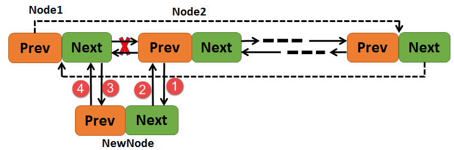
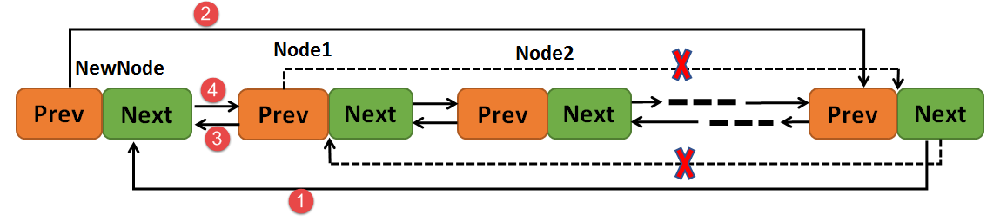
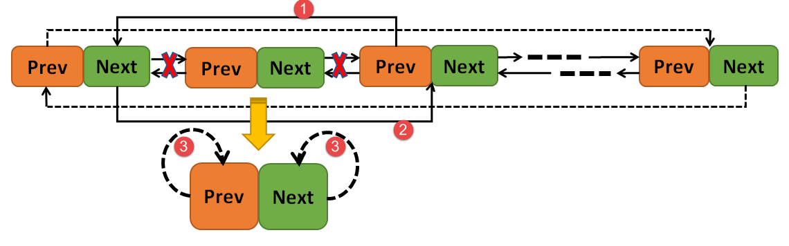
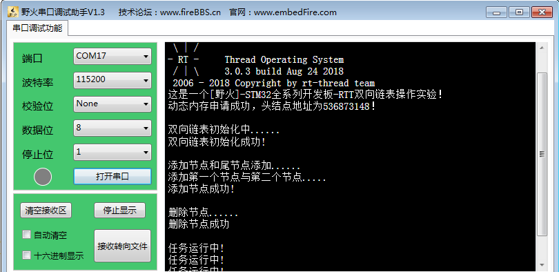

.. vim: syntax=rst

双向链表
-------------

双向链表的基本概念
~~~~~~~~~~~~~~~~

双向链表也叫双链表，是链表的一种，是在操作系统中常用的数据结构，它的每个数据结点中都有两个指针，分别指向直接后继和直接前驱，其头指针head是唯一确定的。所以，从双向链表中的任意一个结点开始，都可以很方便地访问它的前驱结点和后继结点，这种数据结构形式使得双向链表在查找时更加方便，特别是大量数据的遍历
。由于双向链表具有对称性，能方便地完成各种插入、删除等操作，但需要注意前后方向的操作。

双向链表的函数接口讲解
~~~~~~~~~~~

RT-Thread为我们提供了很多操作链表的函数，如链表的初始化、添加节点、删除节点等。

RT-Thread的链表节点结构体中只有两个指针，一个是指向上一个节点的指针，另一个是指向下一个节点的指针，具体见

代码清单 26‑1链表节点结构体

1 struct rt_list_node {

2 struct rt_list_node \*next; /**< 指向下一个节点的指针.
\*/

3 struct rt_list_node \*prev; /**< 指向上一个节点的指针.
\*/

4 };

5 typedef struct rt_list_node rt_list_t;

链表初始化函数rt_list_init()
^^^^^^^^^^^^^^^^^^^^^

在使用链表的时候必须要进行初始化，将链表的指针指向自己，为以后添加节点做准备 ，链表的数据结构也是需要内存空间的，所以也需要进行内存的申请，链表初始化函数rt_list_init()的源码具体见代码清单 26‑2，其结果具体见图 26‑1。

代码清单 26‑2链表初始化函数rt_list_init()源码

1 /*\*

2 \* @brief 初始化一个链表

3 \*

4 \* @param

5 \*/

6 rt_inline void rt_list_init(rt_list_t \*l)

7 {

8 l->next = l->prev = l;

9 }

|double002|

图 26‑1链表初始化示意图

其初始化完成后可以检查一下链表初始化是否成功，判断链表是不是空的就行了，因为初始化完成的时候，链表肯定是空的，注意，在初始化链表的时候其实链表就是链表头，需要申请内存，链表的初始化实例具体见代码清单 26‑3。

代码清单 26‑3链表初始化函数rt_list_init()实例

1 head = rt_malloc(sizeof(rt_list_t));/\* 申请动态内存 \*/

2 if (RT_NULL == head) /\* 没有申请成功 \*/

3 rt_kprintf("动态内存申请失败！\n");

4 else

5 rt_kprintf("动态内存申请成功，头结点地址为%d！\n",head);

6

7 rt_kprintf("\n双向链表初始化中......\n");

8 rt_list_init(head);

9 if (rt_list_isempty(head))

10 rt_kprintf("双向链表初始化成功!\n\n");

向链表中插入节点
^^^^^^^^

向链表指定节点后面插入节点rt_list_insert_after()
'''''''''''''''''''''''''''''''''''

插入节点需要先申请节点大小的内存，然后根据插入的位置（在某个节点（rt_list_t \*l）后面）进行插入操作，具体见代码清单 26‑4。

代码清单 26‑4向链表指定节点后面插入节点rt_list_insert_after()源码

1 rt_inline void rt_list_insert_after(rt_list_t \*l, rt_list_t \*n)

2 {

3 l->next->prev = n; **(1)**

4 n->next = l->next; **(2)**

5

6 l->next = n; **(3)**

7 n->prev = l; **(4)**

8 }

这是数据结构的基本使用方法，其过程具体见图 26‑2。

|double003|

图 26‑2插入节点的过程示意图

向链表指定节点前面插入节点rt_list_insert_before()
''''''''''''''''''''''''''''''''''''

插入节点需要先申请节点大小的内存，然后根据插入的位置（在某个节点（rt_list_t \*l）前面）进行插入操作，具体见代码清单 26‑5。

代码清单 26‑5向链表指定节点前面插入节点rt_list_insert_before()源码

1 rt_inline void rt_list_insert_before(rt_list_t \*l, rt_list_t \*n)

2 {

3 l->prev->next = n; **(1)**

4 n->prev = l->prev; **(2)**

5

6 l->prev = n; **(3)**

7 n->next = l; **(4)**

8 }

9

这是数据结构的基本使用方法，其过程具体见图 26‑3。

|double004|

图 26‑3插入节点的过程示意图

插入节点的实例也很简单，但是要注意的是要申请内存，具体见代码清单 26‑6加粗部分。

代码清单 26‑6向链表插入节点函数实例

1 /\* 插入节点：顺序插入与从末尾插入 \*/

2

3 rt_kprintf("添加节点和尾节点添加......\n");

4

**5 /\* 动态申请第一个结点的内存 \*/**

**6 node1 = rt_malloc(sizeof(rt_list_t));**

**7**

**8 /\* 动态申请第二个结点的内存 \*/**

**9 node2 = rt_malloc(sizeof(rt_list_t));**

10

11 rt_kprintf("添加第一个节点与第二个节点.....\n");

12

13 /\* 因为这是在某个节点后面添加一个节点函数

14 为后面的rt_list_insert_before（某个节点之前）

15 添加节点做铺垫,两个函数添加完之后的顺序是

16 head -> node1 -> node2 \*/

17

**18 rt_list_insert_after(head,node2);**

**19**

**20 rt_list_insert_before(node2,node1);**

21

22 if ((node1->prev == head) && (node2->prev == node1))

23 rt_kprintf("添加节点成功!\n\n");

24 else

25 rt_kprintf("添加节点失败!\n\n");

26

从链表删除节点函数rt_list_remove()
^^^^^^^^^^^^^^^^^^^^^^^^^

删除节点与添加节点一样，其实删除节点更简单，只需要知道删除哪个节点即可，把该节点前后的节点链接起来，那它就删除了，然后该节点的指针指向节点本身即可，不过要注意的是也要讲该节点的内存释放掉，因为该节点是动态分配内存的，否则会导致内存泄漏，源码具体见代码清单 26‑7，其实现过程具体见图 26‑4。

代码清单 26‑7从链表删除节点函数rt_list_remove()源码

1 rt_inline void rt_list_remove(rt_list_t \*n)

2 {

3 n->next->prev = n->prev; **(1)**

4 n->prev->next = n->next; **(2)**

5

6 n->next = n->prev = n; **(3)**

7 }

|double005|

图 26‑4节点删除过程示意图

删除节点的用法也是简单，具体见

代码清单 26‑8从链表删除节点函数rt_list_remove()实例

1 rt_kprintf("删除节点......\n"); /\* 删除已有节点 \*/

2 rt_list_remove(node1);

3 rt_free(node1);/\* 释放第一个节点的内存 \*/

4 if (node2->prev == head)

5 rt_kprintf("删除节点成功\n\n");

双向链表的实验
~~~~~~~

双向链表实验实现如下功能：

-  调用rt_list_init初始双向链表。

-  调用rt_list_insert_after与rt_list_insert\_ before向链表中增加节点。

-  调用rt_list_remove删除指定节点。

-  调用rt_list_isempty判断链表是否为空。

-  测试操作是否成功。

删除节点的时候要注意释放掉内存，具体见代码清单 26‑9加粗部分。

代码清单 26‑9双向链表实验

1 /*\*

2 \\*

3 \* @file main.c

4 \* @author fire

5 \* @version V1.0

6 \* @date 2018-xx-xx

7 \* @brief RT-Thread 3.0 + STM32 双向链表实验

8 \\*

9 \* @attention

10 \*

11 \* 实验平台:基于野火STM32全系列（M3/4/7）开发板

12 \* 论坛 :http://www.firebbs.cn

13 \* 淘宝 :https://fire-stm32.taobao.com

14 \*

15 \\*

16 \*/

17

18 /\*

19 \\*

20 \* 包含的头文件

21 \\*

22 \*/

23 #include "board.h"

24 #include "rtthread.h"

25

26

27 /\*

28 \\*

29 \* 变量

30 \\*

31 \*/

32 /\* 定义线程控制块 \*/

33 static rt_thread_t test1_thread = RT_NULL;

34 static rt_thread_t test2_thread = RT_NULL;

35

36 /\* 全局变量声明 \/

37 /\*

38 \* 当我们在写应用程序的时候，可能需要用到一些全局变量。

39 \*/

40

41 /\*

42 \\*

43 \* 函数声明

44 \\*

45 \*/

46 static void test1_thread_entry(void\* parameter);

47 static void test2_thread_entry(void\* parameter);

48

49 /\*

50 \\*

51 \* main 函数

52 \\*

53 \*/

54 /*\*

55 \* @brief 主函数

56 \* @param 无

57 \* @retval 无

58 \*/

59 int main(void)

60 {

61 /\*

62 \* 开发板硬件初始化，RTT系统初始化已经在main函数之前完成，

63 \* 即在component.c文件中的rtthread_startup()函数中完成了。

64 \* 所以在main函数中，只需要创建线程和启动线程即可。

65 \*/

66 rt_kprintf("这是一个[野火]- STM32全系列开发板-RTT双向链表操作实验！\n");

67

68 test1_thread = /\* 线程控制块指针 \*/

69 rt_thread_create( "test1", /\* 线程名字 \*/

70 test1_thread_entry, /\* 线程入口函数 \*/

71 RT_NULL, /\* 线程入口函数参数 \*/

72 512, /\* 线程栈大小 \*/

73 2, /\* 线程的优先级 \*/

74 20); /\* 线程时间片 \*/

75

76 /\* 启动线程，开启调度 \*/

77 if (test1_thread != RT_NULL)

78 rt_thread_startup(test1_thread);

79 else

80 return -1;

81

82 test2_thread = /\* 线程控制块指针 \*/

83 rt_thread_create( "test2", /\* 线程名字 \*/

84 test2_thread_entry, /\* 线程入口函数 \*/

85 RT_NULL, /\* 线程入口函数参数 \*/

86 512, /\* 线程栈大小 \*/

87 3, /\* 线程的优先级 \*/

88 20); /\* 线程时间片 \*/

89

90 /\* 启动线程，开启调度 \*/

91 if (test2_thread != RT_NULL)

92 rt_thread_startup(test2_thread);

93 else

94 return -1;

95 }

96

97 /\*

98 \\*

99 \* 线程定义

100 \\*

101 \*/

102

103 static void test1_thread_entry(void\* parameter)

104 {

**105 rt_list_t \*head; /\* 定义一个双向链表的头节点 \*/**

**106 rt_list_t \*node1; /\* 定义一个双向链表的头节点 \*/**

**107 rt_list_t \*node2; /\* 定义一个双向链表的头节点 \*/**

**108**

**109 head = rt_malloc(sizeof(rt_list_t));/\* 申请动态内存 \*/**

**110 if (RT_NULL == head) /\* 没有申请成功 \*/**

**111 rt_kprintf("动态内存申请失败！\n");**

**112 else**

**113 rt_kprintf("动态内存申请成功，头结点地址为%d！\n",head);**

**114**

**115 rt_kprintf("\n双向链表初始化中......\n");**

**116 rt_list_init(head);**

**117 if (rt_list_isempty(head))**

**118 rt_kprintf("双向链表初始化成功!\n\n");**

**119**

**120 /\* 插入节点：顺序插入与从末尾插入 \*/**

**121 rt_kprintf("添加节点和尾节点添加......\n");**

**122**

**123 /\* 动态申请第一个结点的内存 \*/**

**124 node1 = rt_malloc(sizeof(rt_list_t));**

**125**

**126 /\* 动态申请第二个结点的内存 \*/**

**127 node2 = rt_malloc(sizeof(rt_list_t));**

**128**

**129 rt_kprintf("添加第一个节点与第二个节点.....\n");**

**130**

**131 /\* 因为这是在某个节点后面添加一个节点函数**

**132 为后面的rt_list_insert_before（某个节点之前）**

**133 添加节点做铺垫,两个函数添加完之后的顺序是**

**134 head -> node1 -> node2 \*/**

**135**

**136 rt_list_insert_after(head,node2);**

**137**

**138 rt_list_insert_before(node2,node1);**

**139**

**140 if ((node1->prev == head) && (node2->prev == node1))**

**141 rt_kprintf("添加节点成功!\n\n");**

**142 else**

**143 rt_kprintf("添加节点失败!\n\n");**

**144**

**145 rt_kprintf("删除节点......\n"); /\* 删除已有节点 \*/**

**146 rt_list_remove(node1);**

**147 rt_free(node1);/\* 释放第一个节点的内存 \*/**

**148 if (node2->prev == head)**

**149 rt_kprintf("删除节点成功\n\n");**

150

151 /\* 线程都是一个无限循环，不能返回 \*/

152 while (1) {

153 LED1_TOGGLE;

154 rt_thread_delay(500); //每500ms扫描一次

155 }

156 }

157

158 static void test2_thread_entry(void\* parameter)

159 {

160

161 /\* 线程都是一个无限循环，不能返回 \*/

162 while (1) {

163 rt_kprintf("线程运行中!\n");

164 LED2_TOGGLE;

165 rt_thread_delay(1000); //每1000ms扫描一次

166 }

167 }

168 /END OF FILE/

169

双向链表的实验现象
~~~~~~~~~

打开配RT-Thread套例程的第13个例程“13，Fire-F103霸道-RT-Thread-
双向链表”，本次实验以野火STM32F103霸道开发板来进行实验，其它开发板都有对应的例程，都是一样的。点击编译，然后下载到开发板上，打开我们野火的串口调试助手，它里面输出了信息表明双向链表的操作已经全部完成，开发板上的LED也在闪烁，具体见图 26‑5。

|double006|

图 26‑5双向链表的实验现象

