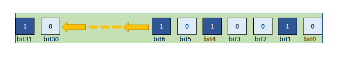
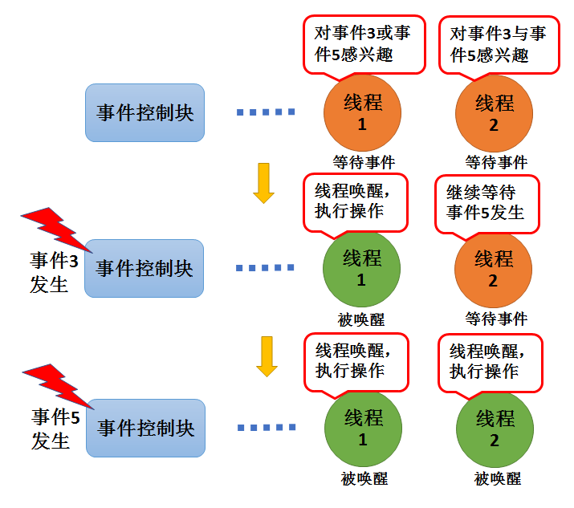
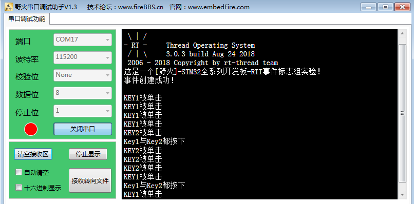

.. vim: syntax=rst

事件
------------------------

事件的基本概念
~~~~~~~~~~~~~~~~~~~~~~~~~~~~

事件是一种实现线程间通信的机制，主要用于实现线程间的同步，但事件通信只能是事件类型的通信，无数据传输。
与信号量不同的是，它可以实现一对多，多对多的同步。即一个线程可以等待多个事件的发生：可以是任意一个事
件发生时唤醒线程进行事件处理；也可以是几个事件都发生后才唤醒线程进行事件处理。同样，事件也可以是多个
线程同步多个事件。

事件集合用32位无符号整型变量来表示，每一位代表一个事件，线程通过“逻辑与”或“逻辑或”与一个或多个事件建
立关联，形成一个事件集。事件的“逻辑或”也称作是独立型同步，指的是线程感兴趣的所有事件任一件发生即可被
唤醒；事件“逻辑与”也称为是关联型同步，指的是线程感兴趣的若干事件都发生时才被唤醒。

多线程环境下，线程之间往往需要同步操作，一个事件发生即是一个同步。事件可以提供一对多、多对多的同步操
作。一对多同步模型：一个线程等待多个事件的触发；多对多同步模型：多个线程等待多个事件的触发。

线程可以通过创建事件来实现事件的触发和等待操作。RT-Thread的事件仅用于同步，不提供数据传输功能。

RT-Thread提供的事件具有如下特点：

-  事件只与线程相关联，事件相互独立，一个32位的事件集合（set变量），用于标识该线程发生的事件类型，
   其中每一位表示一种事件类型（0表示该事件类型未发生、1表示该事件类型已经发生），一共32种事件类型。

-  事件仅用于同步，不提供数据传输功能。

-  事件无排队性，即多次向线程发送同一事件(如果线程还未来得及读走)，等效于只发送一次。

-  允许多个线程对同一事件进行读写操作。

-  支持事件等待超时机制。

在RT-Thread实现中，每个线程都拥有一个事件信息标记，它有三个属性，分别是RT_EVENT_FLAG_AND(逻辑与)，
RT_EVENT_FLAG_OR(逻辑或）以及RT_EVENT_FLAG_CLEAR(清除标记）。当线程等待事件同步时，可以通过32个事
件标志和这个事件信息标记来判断当前接收的事件是否满足同步条件。

事件的应用场景
~~~~~~~~~~~~~~~~~~~~~

RT-Thread的事件用于事件类型的通讯，无数据传输，也就是说，我们可以用事件来做标志位，判断某些事件是否
发生了，然后根据结果做处理，那很多人又会问了，为什么我不直接用变量做标志呢，岂不是更好更有效率？非也
非也，若是在裸机编程中，用全局变量是最为有效的方法，这点我不否认，但是在操作系统中，使用全局变量就要
考虑以下问题了：

-  如何对全局变量进行保护呢，防止多线程同时对它进行访问？

-  如何让内核对事件进行有效管理呢？使用全局变量的话，就需要在线程中轮询查看事件是否发送，这简直就是
   在浪费CPU资源啊，还有等待超时机制，使用全局变量的话需要用户自己去实现。

所以，在操作系统中，还是使用操作系统给我们提供的通信机制就好了，简单方便还实用。

在某些场合，可能需要多个时间发生了才能进行下一步操作，比如一些危险机器的启动，需要检查各项指标，当指标
不达标的时候，无法启动，但是检查各个指标的时候，不能一下子检测完毕啊，所以，需要事件来做统一的等待，当
所有的事件都完成了，那么机器才允许启动，这只是事件的其中一个应用。

事件可使用于多种场合，它能够在一定程度上替代信号量，用于线程间同步。一个线程或中断服务例程发送一个事件
给事件对象，而后等待的线程被唤醒并对相应的事件进行处理。但是它与信号量不同的是，事件的发送操作是不可累
计的，而信号量的释放动作是可累计的。事件另外一个特性是，接收线程可等待多种事件，即多个事件对应一个线程
或多个线程。同时按照线程等待的参数，可选择是“逻辑或”触发还是“逻辑与”触发。这个特性也是信号量等所不具备
的，信号量只能识别单一同步动作，而不能同时等待多个事件的同步。

各个事件可分别发送或一起发送给事件对象，而线程可以等待多个事件，线程仅对感兴趣的事件进行关注。当有它们
感兴趣的事件发生时并且符合感兴趣的条件，线程将被唤醒并进行后续的处理动作。

事件的运作机制
~~~~~~~~~~~~~~~

接收事件时，可以根据入感兴趣的参事件类型接收事件的单个或者多个事件类型。事件接收成功后，必须使用
RT_EVENT_FLAG_CLEA选项来清除已接收到的事件类型，否则不会清除已接收到的事件。用户可以自定义通过传入
参数选择读取模式option，是等待所有感兴趣的事件还是等待感兴趣的任意一个事件。

发送事件时，对指定事件写入指定的事件类型，设置事件集合set的对应事件位为1，可以一次同时写多个事件类型，
发送事件会触发线程调度。

清除事件时，根据入参数事件句柄和待清除的事件类型，对事件对应位进行清0操作。事件不与线程相关联，事件相
互独立，一个32位的变量（事件集合set），用于标识该线程发生的事件类型，其中每一位表示一种事件类型
（0表示该事件类型未发生、1表示该事件类型已经发生），一共32种事件类型具体见图 事件集合set_。

事件唤醒机制，当线程因为等待某个或者多个事件发生而进入阻塞态，当事件发生的时候会被唤醒，其过程具体见 事件唤醒线程示意图_。

线程1对事件3或事件5感兴趣（逻辑或RT_EVENT_FLAG_OR），当发生其中的某一个事件都会被唤醒，并且执行相应操作。
而线程2对事件3与事件5感兴趣（逻辑与RT_EVENT_FLAG_AND），当且仅当事件3与事件5都发生的时候，线程2才会被唤
醒，如果只有一个其中一个事件发生，那么线程还是会继续等待事件发生。如果接在收事件函数中option设置了清除事
件位，那么当线程唤醒后将把事件3和事件5的事件标志清零，否则事件标志将依然存在。

事件控制块
~~~~~~~~~~~~~

事件的使用很简单，每个对事件的操作的函数都是根据事件控制块来进行操作的，事件控制块包含了一个32位的set变
量，其变量的各个位表示一个事件，每一位代表一个事件的发生，利用逻辑或、逻辑与等实现不同事件的不同唤醒处理，
具体见 代码清单:事件-1_。

.. code-block:: c
    :caption: 代码清单:事件-1事件控制块
    :name: 代码清单:事件-1
    :linenos:

    struct rt_event {
        struct rt_ipc_object parent;

        rt_uint32_t          set;                  /* 事件标志位 */
    };
    typedef struct rt_event *rt_event_t; /* rt_event_t是指向事件结构体的指针 */

事件属于内核对象，也会在自身结构体里面包含一个内核对象类型的成员，通过这个成员可以将事件挂到系统对象容器里
面。rt_event对象从rt_ipc_object中派生，由IPC容器管理。

事件函数接口讲解
~~~~~~~~~~~~~~~~~~~~~~

事件创建函数rt_event_create()
^^^^^^^^^^^^^^^^^^^^^^^^^^^^^^^^^^^^

事件创建函数，顾名思义，就是创建一个事件，与其他内核对象一样，都是需要先创建才能使用的资源，RT-Thread给我们
提供了一个创建事件的函数rt_event_create()，当创建一个事件时，内核首先创建一个事件控制块，然后对该事件控制块
进行基本的初始化，创建成功返回事件句柄；创建失败返回RT_NULL。所以，在使用创建函数之前，我们需要先定义有个事
件的句柄，事件创建的源码具体见 代码清单:事件-2_。

.. code-block:: c
    :caption: 代码清单:事件-2事件创建函数rt_event_create()源码
    :name: 代码清单:事件-2
    :linenos:

    rt_event_t rt_event_create(const char *name, rt_uint8_t flag)	(1)
    {
        rt_event_t event;						(2)

        RT_DEBUG_NOT_IN_INTERRUPT;

        /* 分配对象 */
        event = (rt_event_t)rt_object_allocate(RT_Object_Class_Event, name);
        if (event == RT_NULL)				        	(3)
            return event;

        /* 设置阻塞唤醒的模式 */
        event->parent.parent.flag = flag;				(4)

        /* 初始化事件对象 */
        rt_ipc_object_init(&(event->parent));			        (5)

        /* 事件集合清零 */
        event->set = 0;						        (6)

        return event;						        (7)
    }
    RTM_EXPORT(rt_event_create);

-   代码清单:事件-2_  **(1)**\ ：name ：事件的名称，由用户自己定义。flag ：事件阻塞唤醒模式。

-   代码清单:事件-2_  **(2)** ： 创建一个事件控制块。

-   代码清单:事件-2_  **(3)**\ ：分配事件对象，调用rt_object_allocate()函数将从对象系统分配
    对象，为创建的事件分配一个事件的对象，并且命名对象名称，在系统中，对象的名称必须是唯一的。

-   代码清单:事件-2_  **(4)**\ ：设置事件的阻塞唤醒模式，创建的事件由于指定的flag不同，而有不
    同的意义：使用RT_IPC_FLAG_PRIO优先级flag创建的IPC对象，在多个线程等待资源时，将由优先级高
    的线程优先获得资源。而使用RT_IPC_FLAG_FIFO先进先出flag创建的IPC对象，在多个线程等待资源时，
    将按照先来先得的顺序获得资源。RT_IPC_FLAG_PRIO与RT_IPC_FLAG_FIFO均在rtdef.h中有定义。

-   代码清单:事件-2_  **(5)**\ ：初始化事件内核对象。调用rt_ipc_object_init()函数会初始化一
    个链表用于记录访问此事件而阻塞的线程。

-   代码清单:事件-2_  **(6)**\ ：事件集合清零，因为现在是创建事件，还没有事件发生，所以事件集合
    中所有位都为0。

-   代码清单:事件-2_  **(7)**\ ：创建成功返回事件对象的句柄，创建失败返回RT_NULL。。

事件创建函数的源码都那么简单，其使用更为简单，不过需要我们在使用前定义一个指向事件控制块的指针，也
就是常说的事件句柄，当事件创建成功，我们就可以根据我们定义的事件句柄来调用RT-Thread的事件函数进行
操作，具体见 代码清单:事件-3_ 高亮部分。

.. code-block:: c
    :caption: 代码清单:事件-3事件创建函数rt_event_create()实例
    :emphasize-lines: 4-5
    :name: 代码清单:事件-3
    :linenos:

    /* 定义事件控制块(句柄) */
    static rt_event_t test_event = RT_NULL;
    /* 创建一个事件 */
    test_event = rt_event_create("test_event",/* 事件标志组名字 */
                                RT_IPC_FLAG_PRIO); /* 事件模式 FIFO(0x00)*/
    if (test_event != RT_NULL)
        rt_kprintf("事件创建成功！\n\n");

事件删除函数rt_event_delete()
^^^^^^^^^^^^^^^^^^^^^^^^^^^^^^^^^^

在很多场合，某些事件只用一次的，就好比在事件应用场景说的危险机器的启动，假如各项指标都达到了，并且
机器启动成功了，那这个事件之后可能就没用了，那就可以进行销毁了。想要删除事件怎么办呢？RT-Thread给
我们提供了一个删除事件的函数——rt_event_delete()，使用它就能将事件进行删除了。当系统不再使用事件对
象时，可以通过删除事件对象控制块来释放系统资源，具体见 代码清单:事件-4_。

.. code-block:: c
    :caption: 代码清单:事件-4事件删除函数rt_event_delete()源码
    :name: 代码清单:事件-4
    :linenos:

    rt_err_t rt_event_delete(rt_event_t event)		        	(1)
    {
        /* 事件句柄检查 */
        RT_ASSERT(event != RT_NULL);			        	(2)

        RT_DEBUG_NOT_IN_INTERRUPT;

        /* 恢复所有阻塞在此事件的线程 */
        rt_ipc_list_resume_all(&(event->parent.suspend_thread));	(3)

        /* 删除事件对象 */
        rt_object_delete(&(event->parent.parent));			(4)

        return RT_EOK;					        	(5)
    }
    RTM_EXPORT(rt_event_delete);

-   代码清单:事件-4_  **(1)**\ ：event是我们自己定义的事件句柄，根据事件句柄进行删除操作。

-   代码清单:事件-4_  **(2)**\ ：检查事件句柄event是否有效，如果它是未定义或者未创建的事件句
    柄，那么是无法进行删除操作的。

-   代码清单:事件-4_  **(3)**\ ：调用rt_ipc_list_resume_all()函数将所有因为访问此事件的而
    阻塞的线程从阻塞态中唤醒，所有被唤醒的线程的返回值是-RT_ERROR，一般不这样子使用，所以在删
    除的时候，应先确认所有的线程都无需再次使用这个事件，并且所有线程都没被此事件阻塞时候才进行
    删除，否则删除之后线程需要再次使用此事件的话那也会发生错误。

-   代码清单:事件-4_  **(4)**\ ：删除事件对象，释放事件对象占用的内存资源。

-   代码清单:事件-4_  **(5)**\ ：删除成功返回RT_EOK。

事件的删除函数使用是很简单的，只需要传递进我们创建的事件对象句柄，其使用方法具体见 代码清单:事件-5_ 高亮部分。

.. code-block:: c
    :caption: 代码清单:事件-5事件删除函数rt_event_delete()使用实例
    :emphasize-lines: 4-5
    :name: 代码清单:事件-5
    :linenos:

    /* 定义事件控制块(句柄) */
    static rt_event_t test_event = RT_NULL;
    rt_err_t uwRet = RT_EOK;
    /* 删除一个事件 */
    uwRet = rt_event_delete(test_event);
    if (RT_EOK == uwRet)
        rt_kprintf("事件删除成功！\n\n");

事件发送函数rt_event_send()
^^^^^^^^^^^^^^^^^^^^^^^^^^^^^^^

使用该函数接口时，通过参数set指定的事件标志来设定事件的标志位，然后遍历等待在event事件对象上的
等待线程链表，判断是否有线程的事件激活要求与当前事件对象标志值匹配，如果有，则唤醒该线程。简单
来说，就是设置我们自己定义的事件标志位为1，并且看看有没有线程在等待这个事件，有的话就唤醒它，其
源码具体见 代码清单:事件-6_。

.. code-block:: c
    :caption: 代码清单:事件-6事件发送函数rt_event_send()源码
    :name: 代码清单:事件-6
    :linenos:

    rt_err_t rt_event_send(rt_event_t event,				(1)
                        rt_uint32_t set)				(2)
    {
        struct rt_list_node *n;
        struct rt_thread *thread;
        register rt_ubase_t level;
        register rt_base_t status;
        rt_bool_t need_schedule;

        /* 事件对象检查 */
        RT_ASSERT(event != RT_NULL);			        	(3)
        if (set == 0)
            return -RT_ERROR;

        need_schedule = RT_FALSE;					(4)
        RT_OBJECT_HOOK_CALL(rt_object_put_hook, (&(event->parent.parent)));

        /* 关中断 */
        level = rt_hw_interrupt_disable();

        /* 设置事件 */
        event->set |= set;						(5)

        if (!rt_list_isempty(&event->parent.suspend_thread)) {      	(6)
            /* 搜索线程列表以恢复线程 */
            n = event->parent.suspend_thread.next;
            while (n != &(event->parent.suspend_thread)) {
                /* 找到要恢复的线程 */
                thread = rt_list_entry(n, struct rt_thread, tlist);     (7)

                status = -RT_ERROR;
                if (thread->event_info & RT_EVENT_FLAG_AND) {	        (8)
                    if ((thread->event_set & event->set)
                        == thread->event_set) {			        (9)
                        /* 收到了一个AND */
                        status = RT_EOK;				(10)
                    }
                } else if (thread->event_info & RT_EVENT_FLAG_OR) {	(11)
                    if (thread->event_set & event->set) {
                        /* 保存收到的事件集 */
                    thread->event_set = thread->event_set & event->set; (12)

                        /* 收到一个OR */
                        status = RT_EOK;				(13)
                    }
                }

                /* 将节点移动到下一个节点 */
                n = n->next;					        (14)

                /* 条件满足，恢复线程 */
                if (status == RT_EOK) {			        	(15)
                    /* 清除事件标志位 */
                    if (thread->event_info & RT_EVENT_FLAG_CLEAR)	(16)
                        event->set &= ~thread->event_set;

                    /* 恢复线程 */
                    rt_thread_resume(thread);		        	(17)

                    /* 需要进行线程调度 */
                    need_schedule = RT_TRUE;			        (18)
                }
            }
        }

        /* 开中断 */
        rt_hw_interrupt_enable(level);

        /* 发起一次线程调度 */
        if (need_schedule == RT_TRUE)
            rt_schedule();						(19)

        return RT_EOK;
    }
    RTM_EXPORT(rt_event_send);

-   代码清单:事件-6_  **(1)**\ ：event：事件发送操作的事件句柄，由用户自己定义，并且需要在创建后使用。

-   代码清单:事件-6_  **(2)**\ ：set：设置事件集合中的具体事件，也就是设置set中的某些位。

-   代码清单:事件-6_  **(3)**\ ：检查事件句柄event是否有效，如果它是未定义或者未创建的事件句柄，那么是无法进行发送事件操作的。

-   代码清单:事件-6_  **(4)**\ ：need_schedule用于记录是否进行线程调度，默认不进行线程调度。

-   代码清单:事件-6_  **(5)**\ ：设置事件发生的标志位，利用‘|’操作即保证不干扰其他事件位又能同事对多
    个事件位一次性标记，即使是多次向线程发送同一事件(如果线程还未来得及读走)，也等效于只发送一次。

-   代码清单:事件-6_  **(6)**\ ：如果当前有线程因为等待某个事件进入阻塞态，则在阻塞列表中搜索线程，并且执行\ **(7)-(18)**\ ，

-   代码清单:事件-6_  **(7)**\ ：从等待的线程中获取对应的线程控制块。

-   代码清单:事件-6_  **(8)**\ ：如果线程等待事件的模式是RT_EVENT_FLAG_AND（逻辑与），那么需要等待的事件都发生时才动作。

-   代码清单:事件-6_  **(9)**\ ：判断线程等待的事件是否都发生了，如果事件激活要求与事件标志值匹配，则唤醒事件。

-   代码清单:事件-6_  **(10)**\ ：当等待的事件都发生的时候，进行标记status动作，表示事件已经等待到了。

-   代码清单:事件-6_  **(11)**\ ：如果线程等待事件的模式是RT_EVENT_FLAG_OR（逻辑或），那么线程等待的所
    有事件标记中只要有一个或多个事件发生了就表示事件已发生，可以唤醒线程。

-   代码清单:事件-6_  **(12)**\：保存收到的事件，这个很重要，因为在接收事件函数的时候，这个值是要用
    来进行判断的，假设有一个线程等待接收3个事件，采用RT_EVENT_FLAG_OR（逻辑或）的方式等待接收，那么
    有其中一个事件发生，该线程就会解除阻塞，但是我们假如没保存收到的事件的话，我们怎么知道是哪个事件发生呢?

-   代码清单:事件-6_  **(13)**\ ：当等待的事件发生的时候，进行标记status动作，表示事件已经等待到了

-   代码清单:事件-6_  **(14)**\ ：将节点移动到下一个节点，因为这是搜索所有等待的线程。

-   代码清单:事件-6_  **(15)**\ ：当等待的事件发生的时候，条件满足，需要恢复线程。

-   代码清单:事件-6_  **(16)**\ ：如果在接收中设置了RT_EVENT_FLAG_CLEAR，那么在线程被唤醒的时候，系统会
    进行事件标志位的清除操作，防止一直响应事件。采用event->set &= ~thread->event_set操作仅仅是清
    除对应事件标志位，不影响其他事件标志位。

-   代码清单:事件-6_  **(17)**\ ：恢复阻塞的线程。

-   代码清单:事件-6_  **(18)**\ ：标记一下need_schedule表示需要进行线程调度。

-   代码清单:事件-6_  **(19)**\ ：发起一次线程调度。

举个例子，比如我们要记录一个事件的发生，这个事件在事件集合的位置是bit0，当它还未发生的时候，那么事件
集合bit0的值也是0，当它发生的时候，我们往事件集合bit0中写入这个事件，也就是0x01，那这就表示事件已经
发生了，为了便于理解，一般操作我们都是用宏定义来实现 #define EVENT(0x01 << x)， “<< x”表示写入事件
集合的bit x ，具体见 代码清单:事件-7_ 高亮部分。

.. code-block:: c
    :caption: 代码清单:事件-7事件发送函数rt_event_send()实例
    :emphasize-lines: 1-2,9-10,15-16
    :name: 代码清单:事件-7
    :linenos:

    #define KEY1_EVENT  (0x01 << 0)//设置事件掩码的位0
    #define KEY2_EVENT  (0x01 << 1)//设置事件掩码的位1
    static void send_thread_entry(void* parameter)
    {
        /* 线程都是一个无限循环，不能返回 */
        while (1) {//如果KEY2被单击
            if ( Key_Scan(KEY1_GPIO_PORT,KEY1_GPIO_PIN) == KEY_ON ) {
                rt_kprintf ( "KEY1被单击\n" );
                /* 发送一个事件1 */
                rt_event_send(test_event,KEY1_EVENT);
            }
            //如果KEY2被单击
            if ( Key_Scan(KEY2_GPIO_PORT,KEY2_GPIO_PIN) == KEY_ON ) {
                rt_kprintf ( "KEY2被单击\n" );
                /* 发送一个事件2 */
                rt_event_send(test_event,KEY2_EVENT);
            }
            rt_thread_delay(20);     //每20ms扫描一次
        }
    }

事件接受函数rt_event_recv()
^^^^^^^^^^^^^^^^^^^^^^^^^^^^^^^

既然标记了事件的发生，那么我怎么知道他到底有没有发生，这也是需要一个函数来获取事件发生的标
记， RT-Thread提供了一个接收指定事件的函数——rt_event_recv()，通过这个函数，我们知道事件集合中
的哪一位，哪一个事件发生了，我们可以通过“逻辑与”、“逻辑或”等操作对感兴趣的事件进行接收，并且这个
函数实现了等待超时机制，如果此刻该事件没有发生，那么线程可以进入阻塞态进行等待，等到事件发生了就
会被唤醒，很有效的体现了操作系统的实时性，如果事件正确接收则返回RT_EOK，事件接收超时则返
回-RT_ETIMEOUT，其他情况返回-RT_ERROR，事件接受函数rt_event_recv()源码具体见 代码清单:事件-8_。

.. code-block:: c
    :caption: 代码清单:事件-8事件接受函数rt_event_recv()源码
    :name: 代码清单:事件-8
    :linenos:

    rt_err_t rt_event_recv(rt_event_t   event,			(1)
                        rt_uint32_t  set,			(2)
                        rt_uint8_t   option,			(3)
                        rt_int32_t   timeout,			(4)
                        rt_uint32_t *recved)			(5)
    {
        struct rt_thread *thread;
        register rt_ubase_t level;
        register rt_base_t status;

        RT_DEBUG_IN_THREAD_CONTEXT;

        /* 检查事件句柄 */
        RT_ASSERT(event != RT_NULL);				(6)
        if (set == 0)
            return -RT_ERROR;

        /* 初始化状态 */
        status = -RT_ERROR;
        /* 获取当前线程 */
        thread = rt_thread_self();		        	(7)
        /* 重置线程错误码 */
        thread->error = RT_EOK;

        RT_OBJECT_HOOK_CALL(rt_object_trytake_hook, (&(event->parent.parent)));

        /* 关中断 */
        level = rt_hw_interrupt_disable();

        /* 检查事件接收选项&检查事件集合 */
        if (option & RT_EVENT_FLAG_AND) {		        (8)
            if ((event->set & set) == set)
                status = RT_EOK;
        } else if (option & RT_EVENT_FLAG_OR) {			(9)
            if (event->set & set)
                status = RT_EOK;
        } else {
            /* 应设置RT_EVENT_FLAG_AND或RT_EVENT_FLAG_OR */
            RT_ASSERT(0);				        (10)
        }

        if (status == RT_EOK) {
            /* 返回接收的事件 */
            if (recved)
                *recved = (event->set & set);			(11)

            /* 接收事件清除 */
            if (option & RT_EVENT_FLAG_CLEAR)			(12)
                event->set &= ~set;
        } else if (timeout == 0) {			        (13)
            /* 不等待 */
            thread->error = -RT_ETIMEOUT;
        } else {
            /* 设置线程事件信息 */
            thread->event_set  = set;				(14)
            thread->event_info = option;

            /* 将线程添加到阻塞列表中 */
            rt_ipc_list_suspend(&(event->parent.suspend_thread),(15)
                                thread,
                                event->parent.parent.flag);

            /* 如果有等待超时，则启动线程计时器 */
            if (timeout > 0) {
                /* 重置线程超时时间并且启动定时器 */
                rt_timer_control(&(thread->thread_timer),	(16)
                                RT_TIMER_CTRL_SET_TIME,
                                &timeout);
                rt_timer_start(&(thread->thread_timer));	(17)
            }

            /* 开中断 */
            rt_hw_interrupt_enable(level);

            /* 发起一次线程调度 */
            rt_schedule();					(18)

            if (thread->error != RT_EOK) {
                /* 返回错误代码 */
                return thread->error;				(19)
            }

            /* 接收一个事件，失能中断 */
            level = rt_hw_interrupt_disable();

            /* 返回接收到的事件 */
            if (recved)
                *recved = thread->event_set;			(20)
        }

        /* 开中断 */
        rt_hw_interrupt_enable(level);

        RT_OBJECT_HOOK_CALL(rt_object_take_hook, (&(event->parent.parent)));

        return thread->error;					(21)
    }
    RTM_EXPORT(rt_event_recv);

-   代码清单:事件-8_  **(1)**\ ：event：事件发送操作的事件句柄，由用户自己定义，并且需要在创建事件后使用。

-   代码清单:事件-8_  **(2)**\ ：set：事件集合中的事件标志，在这里是指线程对哪些事件标志感兴趣。

-   代码清单:事件-8_  **(3)**\ ：option ：接收选项，有RT_EVENT_FLAG_AND、RT_EVENT_FLAG_OR，可以与
    RT_EVENT_FLAG_CLEAR通过“|”按位或操作符连接使用。

-   代码清单:事件-8_  **(4)**\ ：timeout是设置等待的超时时间。

-   代码清单:事件-8_  **(5)**\ ：recved用于保存接收到的事件标志结果，用户通过它的值判断是否成功接收到事件。

-   代码清单:事件-8_  **(6)**\ ：检查事件句柄event是否有效，如果它是未定义或者未创建的事件句柄，那么是无法接收事件的。

-   代码清单:事件-8_  **(7)**\ ：获取当前线程信息，即获取调用接收事件的线程。

-   代码清单:事件-8_  **(8)**\ ：如果指定的option接收选项是RT_EVENT_FLAG_AND，那么判断事件集合里面的信
    息与线程感兴趣的信息是否全部吻合，如果满足条件则标记接收成功。

-   代码清单:事件-8_  **(9)**\ ：如果指定的option接收选项是RT_EVENT_FLAG_OR，那么判断事件集合里面的信息
    与线程感兴趣的信息是否有吻合的部分（有其中一个满足即可），如果满足条件则标记接收成功。

-   代码清单:事件-8_  **(10)**\ ：其他情况，接收选项应设置RT_EVENT_FLAG_AND或RT_EVENT_FLAG_OR，他们无
    法同时使用，也不能不使用。

-   代码清单:事件-8_  **(11)**\ ：满足接收事件的条件，则返回接收的事件，读取recved即可知道接收到了哪个事件。

-   代码清单:事件-8_  **(12)**\ ：如果指定的option接收选项选择了RT_EVENT_FLAG_CLEAR，在接收完成的时候会
    清除对应的事件集合的标志位。

-   代码清单:事件-8_  **(13)**\ ：如果timeout= 0，那么接收不到事件就不等待，直接返回-RT_ETIMEOUT错误码。

-   代码清单:事件-8_  **(14)**\ ：timeout不为0，需要等待，那么需要配置线程接收事件的信息，event_set与
    event_info在线程控制块中有定义，event_set表示当前线程等待哪些感兴趣的事件，event_info表示事件接收选项option。

-   代码清单:事件-8_  **(15)**\ ：将等待的线程添加到阻塞列表中。

-   代码清单:事件-8_  **(16)**\ ：根据timeout的值重置线程超时时间。

-   代码清单:事件-8_  **(17)**\ ：启动定时器开始计时。

-   代码清单:事件-8_  **(18)**\ ：发起一次线程调度。

-   代码清单:事件-8_  **(19)**\ ：返回错误代码。

-   代码清单:事件-8_  **(20)**\ ：返回接收到的事件

-   代码清单:事件-8_  **(21)**\ ：返回接收成功结果。

当用户调用这个接口时，系统首先根据set参数和接收选项来判断它要接收的事件是否发生，如果已经发生，则根据参数
option上是否设置有RT_EVENT_FLAG_CLEAR来决定是否清除事件的相应标志位，其中recved参数用于保存收到的事件；
如果事件没有发生，则把线程感兴趣的事件和接收选项填写到线程控制块中，然后把线程挂起在此事件对象的阻塞列表上，
直到事件发生或等待时间超时，事件接受函数rt_event_recv()具体用法见 代码清单:事件-9_ 高亮部分。

.. code-block:: c
    :caption: 代码清单:事件-9事件接受函数rt_event_recv()实例
    :emphasize-lines: 6-12
    :name: 代码清单:事件-9
    :linenos:

    static void receive_thread_entry(void* parameter)
    {
        rt_uint32_t recved;
        /* 线程都是一个无限循环，不能返回 */
        while (1) {
            /* 等待接收事件标志 */
            rt_event_recv(test_event,  		/* 事件对象句柄 */
                        KEY1_EVENT|KEY2_EVENT,	/* 接收线程感兴趣的事件 */
                        RT_EVENT_FLAG_AND|RT_EVENT_FLAG_CLEAR,/* 接收选项 */
                        RT_WAITING_FOREVER,	/* 指定超时事件,一直等 */
                        &recved);    		/* 指向接收到的事件 */
            if (recved == (KEY1_EVENT|KEY2_EVENT)) { /* 如果接收完成并且正确 */
                rt_kprintf ( "Key1与Key2都按下\n");
                LED1_TOGGLE;       //LED1	反转
            } else
                rt_kprintf ( "事件错误！\n");
        }
    }

事件实验
~~~~~~~~~~

事件标志组实验是在RT-Thread中创建了两个线程，一个是发送事件线程，一个是接收事件线程，两个线程
独立运行，发送事件线程通过检测按键的按下情况发送不同的事件，接收事件线程则接收这两个事件，并
且判断两个事件是否都发生，如果是
则输出相应信息，LED进行翻转。接收线程的等待时间
是RT_WAITING_FOREVER，一直在等待事件的发生，接收事件之后进行清除事件标记，具体见 代码清单:事件-10_ 高亮部分。

.. code-block:: c
    :caption: 代码清单:事件-10事件实验
    :emphasize-lines: 32-35,41-42,69-73,110-146
    :name: 代码清单:事件-10
    :linenos:

    /**
    *********************************************************************
    * @file    main.c
    * @author  fire
    * @version V1.0
    * @date    2018-xx-xx
    * @brief   RT-Thread 3.0 + STM32 事件标志组
    *********************************************************************
    * @attention
    *
    * 实验平台:基于野火STM32全系列（M3/4/7）开发板
    * 论坛    :http://www.firebbs.cn
    * 淘宝    :https://fire-stm32.taobao.com
    *
    **********************************************************************
    */

    /*
    *************************************************************************
    *                             包含的头文件
    *************************************************************************
    */
    #include "board.h"
    #include "rtthread.h"

    /*
    ******************************************************************
    *                               变量
    ******************************************************************
    */
    /* 定义线程控制块 */
    static rt_thread_t receive_thread = RT_NULL;
    static rt_thread_t send_thread = RT_NULL;
    /* 定义事件控制块(句柄) */
    static rt_event_t test_event = RT_NULL;

    /************************* 全局变量声明 ****************************/
    /*
    * 当我们在写应用程序的时候，可能需要用到一些全局变量。
    */
    #define KEY1_EVENT  (0x01 << 0)//设置事件掩码的位0
    #define KEY2_EVENT  (0x01 << 1)//设置事件掩码的位1
    /*
    *************************************************************************
    *                             函数声明
    *************************************************************************
    */
    static void receive_thread_entry(void* parameter);
    static void send_thread_entry(void* parameter);

    /*
    *************************************************************************
    *                             main 函数
    *************************************************************************
    */
    /**
    * @brief  主函数
    * @param  无
    * @retval 无
    */
    int main(void)
    {
        /*
        * 开发板硬件初始化，RTT系统初始化已经在main函数之前完成，
        * 即在component.c文件中的rtthread_startup()函数中完成了。
        * 所以在main函数中，只需要创建线程和启动线程即可。
        */
        rt_kprintf("这是一个[野火]- STM32全系列开发板-RTT事件标志组实验！\n");
        /* 创建一个事件 */
        test_event = rt_event_create("test_event",/* 事件标志组名字 */
                            RT_IPC_FLAG_PRIO); /* 事件模式 FIFO(0x00)*/
        if (test_event != RT_NULL)
            rt_kprintf("事件创建成功！\n\n");

        receive_thread =                          /* 线程控制块指针 */
            rt_thread_create( "receive",              /* 线程名字 */
                            receive_thread_entry,   /* 线程入口函数 */
                            RT_NULL,             /* 线程入口函数参数 */
                            512,                 /* 线程栈大小 */
                            3,                   /* 线程的优先级 */
                            20);                 /* 线程时间片 */

        /* 启动线程，开启调度 */
        if (receive_thread != RT_NULL)
            rt_thread_startup(receive_thread);
        else
            return -1;

        send_thread =                          /* 线程控制块指针 */
            rt_thread_create( "send",              /* 线程名字 */
                            send_thread_entry,   /* 线程入口函数 */
                            RT_NULL,             /* 线程入口函数参数 */
                            512,                 /* 线程栈大小 */
                            2,                   /* 线程的优先级 */
                            20);                 /* 线程时间片 */

        /* 启动线程，开启调度 */
        if (send_thread != RT_NULL)
            rt_thread_startup(send_thread);
        else
            return -1;
    }

    /*
    ***************************************************************
    *                             线程定义
    ***************************************************************
    */

    static void receive_thread_entry(void* parameter)
    {
        rt_uint32_t recved;
        /* 线程都是一个无限循环，不能返回 */
        while (1) {
            /* 等待接收事件标志 */
            rt_event_recv(test_event,  /* 事件对象句柄 */
                        KEY1_EVENT|KEY2_EVENT,/* 接收线程感兴趣的事件 */
                        RT_EVENT_FLAG_AND|RT_EVENT_FLAG_CLEAR,/* 接收选项 */
                        RT_WAITING_FOREVER,/* 指定超时事件,一直等 */
                        &recved);    /* 指向接收到的事件 */
            if (recved == (KEY1_EVENT|KEY2_EVENT)) { /* 如果接收完成并且正确 */
                rt_kprintf ( "Key1与Key2都按下\n");
                LED1_TOGGLE;       //LED1	反转
            } else
                rt_kprintf ( "事件错误！\n");
        }
    }

    static void send_thread_entry(void* parameter)
    {
        /* 线程都是一个无限循环，不能返回 */
        while (1) { //如果KEY2被单击
            if ( Key_Scan(KEY1_GPIO_PORT,KEY1_GPIO_PIN) == KEY_ON ) {
                rt_kprintf ( "KEY1被单击\n" );
                /* 发送一个事件1 */
                rt_event_send(test_event,KEY1_EVENT);
            }
            //如果KEY2被单击
            if ( Key_Scan(KEY2_GPIO_PORT,KEY2_GPIO_PIN) == KEY_ON ) {
                rt_kprintf ( "KEY2被单击\n" );
                /* 发送一个事件2 */
                rt_event_send(test_event,KEY2_EVENT);
            }
            rt_thread_delay(20);     //每20ms扫描一次
        }
    }
    /**********************END OF FILE****************************/

实验现象
~~~~~~~~~~~~

程序编译好，用USB线连接电脑和开发板的USB接口（对应丝印为USB转串口），用DAP仿真器把配套程序下载
到野火STM32开发板（具体型号根据你买的板子而定，每个型号的板子都配套有对应的程序），在电脑上打开
串口调试助手，然后复位开发板就可以在调试助手中看到rt_kprintf的打印信息，按下开发版的K1按键发送
事件1，按下K2按键发送事件2；我们按下K1与K2试试，在串口调试助手中可以看到运行结果，并且当事件1与
事件2都发生的时候，开发板的LED会进行翻转，具体见图 事件标志组实验现象_。

