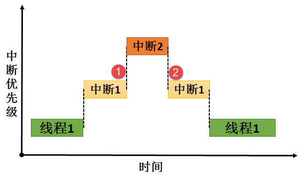

.. vim: syntax=rst

中断管理
=================

异常与中断的基本概念
~~~~~~~~~~~~~~~~~~~~~~~~~~

异常是导致处理器脱离正常运行转向执行特殊代码的任何事件，如果不及时进行处理，轻则系统出错，重则会导致系统毁灭性瘫痪。所以正确地处理异常，避免错误的发生是提高软件鲁棒性（稳定性）非常重要的一环，对于实时系统更是如此。

异常是指任何打断处理器正常执行，并且迫使处理器进入一个由有特权的特殊指令执行的事件。异常通常可以分成两类：同步异常和异步异常。由内部事件（像处理器指令运行产生的事件）引起的异常称为同步异常，例如造成被零除的算术运算引发一个异常，又如在某些处理器体系结构中，对于确定的数据尺寸必须从内存的偶数地址进行读
和写操作。从一个奇数内存地址的读或写操作将引起存储器存取一个错误事件并引起一个异常，（称为校准异常）。

异步异常主要是指由于外部异常源产生的异常，是一个由外部硬件装置产生的事件引起的异步异常。同步异常不同于异步异常的地方是事件的来源，同步异常事件是由于执行某些指令而从处理器内部产生的，而异步异常事件的来源是外部硬件装置。例如按下设备某个按钮产生的事件。同步异常与异步异常的区别还在于，同步异常触发后，系
统必须立刻进行处理而不能够依然执行原有的程序指令步骤；而异步异常则可以延缓处理甚至是忽略，例如按键中断异常，虽然中断异常触发了，但是系统可以忽略它继续运行（同样也忽略了相应的按键事件）。

中断，中断属于异步异常。所谓中断是指中央处理器CPU正在处理某件事的时候，外部发生了某一事件，请求CPU迅速处理，CPU暂时中断当前的工作，转入处理所发生的事件，处理完后，再回到原来被中断的地方，继续原来的工作，这样的过程称为中断。

中断能打断线程的运行，无论该线程具有什么样的优先级，因此中断一般用于处理比较紧急的事件，而且只做简
单处理，例如标记该事件，在使用 RT-Thread系统时，一般建议使用信号量、消息或事件标志组等标志中断的发
生，将这些内核对象发布给处理线程，处理线程再做具体处理。

通过中断机制，在外设不需要CPU介入时，CPU可以执行其它线程，而当外设需要CPU时通过产生中断信号使CPU立即停止当前线程转而来响应中断请求。这样可以使CPU避免把大量时间耗费在等待、查询外设状态的操作上，因此将大大提高系统实时性以及执行效率。

此处读者要知道一点，RT-Thread源码中有许多处临界段的地方， 临界段虽然保护了关键代码的执行不被打断，
但也会影响系统的实时，任何使用了操作系统的中断响应都不会比裸机快。比如，某个时候有一个线程在运行中，并且该线程部分程序将中断屏蔽掉，也就是进入临界段中，这个时候如果有一个紧急的中断事件被触发，这个中断就会被挂起，不能得到及时响应，必须等到中断开启才可以得到响应，
如果屏蔽中断时间超过了紧急中断能够容忍的限度，危害是可想而知的。所以，操作系统的中断在某些时候会有适当的中断延迟，因此调用中断屏蔽函数进入临界段的时候，也需快进快出。

RT-Thread的中断管理支持：

-  开/关中断。

-  恢复中断。

-  中断使能。

-  中断屏蔽。

中断的介绍
^^^^^^^^^^^^^^^

与中断相关的硬件可以划分为三类：外设、中断控制器、CPU本身。

外设：当外设需要请求CPU时，产生一个中断信号，该信号连接至中断控制器。

中断控制器：中断控制器是CPU众多外设中的一个，它一方面接收其它外设中断信号的输入，另一方面，它会发出中断信号给CPU。可以通过对中断控制器编程实现对中断源的优先级、触发方式、打开和关闭源等设置操作。在Cortex-M系列控制器中常用的中断控制器是NVIC（内嵌向量中断控制器Nested
Vectored Interrupt Controller）。

CPU：CPU会响应中断源的请求，中断当前正在执行的线程，转而执行中断处理程序。NVIC最多支持240个中断，每个中断最多256个优先级。

和中断相关的名词解释
^^^^^^^^^^^^^^^^^^^^^^^^^^

中断号：每个中断请求信号都会有特定的标志，使得计算机能够判断是哪个设备提出的中断请求，这个标志就是中断号。

中断请求：“紧急事件”需向CPU提出申请，要求CPU暂停当前执行的线程，转而处理该“紧急事件”，这一申请过程称为中断请求。

中断优先级：为使系统能够及时响应并处理所有中断，系统根据中断时间的重要性和紧迫程度，将中断源分为若干个级别，称作中断优先级。

中断处理程序：当外设产生中断请求后，CPU暂停当前的线程，转而响应中断申请，即执行中断处理程序。

中断触发：中断源发出并送给CPU控制信号，将中断触发器置“1”，表明该中断源产生了中断，要求CPU去响应该中断，CPU暂停当前线程，执行相应的中断处理程序。

中断触发类型：外部中断申请通过一个物理信号发送到NVIC，可以是电平触发或边沿触发。

中断向量：中断服务程序的入口地址。

中断向量表：存储中断向量的存储区，中断向量与中断号对应，中断向量在中断向量表中按照中断号顺序存储。

临界段：代码的临界段也称为临界区，一旦这部分代码开始执行，则不允许任何中断打断。为确保临界段代码的执行不被中断，在进入临界段之前须关中断，而临界段代码执行完毕后，要立即开中断。RT-Thread支持中断屏蔽和中断使能。

中断管理的运作机制
~~~~~~~~~~~~~~~~~~~~~~~~~~~

当中断产生时，处理机将按如下的顺序执行：

1. 保存当前处理机状态信息

2. 载入异常或中断处理函数到PC寄存器

3. 把控制权转交给处理函数并开始执行

4. 当处理函数执行完成时，恢复处理器状态信息

5. 从异常或中断中返回到前一个程序执行点

中断使得CPU可以在事件发生时才给予处理，而不必让CPU连续不断地查询是否有相应的事件发生。通过两条特殊指令：关中断和开中断可以让处理器不响应或响应中断，在关闭中断期间，通常处理器会把新产生的中断挂起，当中断打开时立刻进行响应，所以会有适当的延时响应中断，故用户在进入临界区的时候应快进快出。

中断发生的环境有两种情况：在线程的上下文中，在中断服务函数处理上下文中。

-  线程在工作的时候，如果此时发生了一个中断，无论中断的优先级是多大，都会打断当前线程的执行，从而转到对应的中断服务函数中执行，其过程具体见图 25‑1。

图 25‑1\ **(1)、(3)**\ ：在线程运行的时候发生了中断，那么中断会打断线程的运行，那么操作系统将先保存
当前线程的上下文环境，转而去处理中断服务函数。

图 25‑1\ **(2)、(4)**\ ：当且仅当中断服务函数处理完的时候才恢复线程的上下文环境，继续运行线程。

-  在执行中断服务例程的过程中，如果有更高优先级别的中断源触发中断，由于当前处于中断处理上下文环境中，
   根据不同的处理器构架可能有不同的处理方式，比如新的中断等待挂起直到当前中断处理离开后再行响应；或新的
   高优先级中断打断当前中断处理过程，而去直接响应这个更高优先级的新中断源。后面这种情况，称之为中断嵌套
   。在硬实时环境中，前一种情况是不允许发生的，不能使响应中断的时间尽量的短。而在软件处理（软实时环境）
   上，RT-Thread允许中断嵌套，即在一个中断服务例程期间，处理器可以响应另外一个优先级更高的中断，过程如图 25‑2所示。

图 25‑2\ **(1)** ：当中断1的服务函数在处理的时候发生了中断2，由于中断2的优先级比中断1更高，所以发生
了中断嵌套，那么操作系统将先保存当前中断服务函数的上下文环境，并且转向处理中断2，当且仅当中断2执行完
的时候图 25‑2\ **(2)** ，才能继续执行中断1。

中断延迟的概念
~~~~~~~~~~~~~~~~~~~~~

即使操作系统的响应很快了，但对于中断的处理仍然存在着中断延迟响应的问题，我们称之为中断延迟(Interrupt Latency) 。

中断延迟是指从硬件中断发生到开始执行中断处理程序第一条指令之间的这段时间。也就是：系统接收到中断信号到操作系统作出响应，并完成换到转入中断服务程序的时间。也可以简单地理解为：（外部）硬件（设备）发生中断，到系统执行中断服务子程序（ISR）的第一条指令的时间。

中断的处理过程是：外界硬件发生了中断后，CPU到中断处理器读取中断向量，并且查找中断向量表，找到对应的中断服务子程序（ISR）的首地址，然后跳转到对应的ISR去做相应处理。这部分时间，我称之为：识别中断时间。

在允许中断嵌套的实时操作系统中，中断也是基于优先级的，允许高优先级中断抢断正在处理的低优先级中断，所以，如果当前正在处理更高优先级的中断，即使此时有低优先级的中断，也系统不会立刻响应，而是等到高优先级的中断处理完之后，才会响应。而即使在不支持中断嵌套，即中断是没有优先级的，中断是不允许被中断的，所以
，如果当前系统正在处理一个中断，而此时另一个中断到来了，系统也是不会立即响应的，而只是等处理完当前的中断之后，才会处理后来的中断。此部分时间，我称其为：等待中断打开时间。

在操作系统中，很多时候我们会主动进入临界段，系统不允许当前状态被中断打断，故而在临界区发生的中断会被挂起，直到退出临界段时候打开中断。此部分时间，我称其为：关闭中断时间。

中断延迟可以定义为，从中断开始的时刻到中断服务例程开始执行的时刻之间的时间段。中断延迟 = 识别中断时间 + [等待中断打开时间] + [关闭中断时间]。

注意：“[ ]”的时间是不一定都存在的，此处为最大可能的中断延迟时间。

中断管理的应用场景
~~~~~~~~~~~~~~~~~~~~~~~~~

中断在嵌入式处理器中应用非常之多，没有中断的系统不是一个好系统，因为有中断，才能启动或者停止某件事情，从而转去做另一间事情。我们可以举一个日常生活中的例子来说明，假如你正在给朋友写信，电话铃响了，这时你放下手中的笔去接电话，通话完毕再继续写信。这个例子就表现了中断及其处理的过程：电话铃声使你暂时中止
当前的工作，而去处理更为急需处理的事情——接电话，当把急需处理的事情处理完毕之后，再回过头来继续原来的事情。在这个例子中，电话铃声就可以称为“中断请求”，而你暂停写信去接电话就叫作“中断响应”，那么接电话的过程就是“中断处理”。由此我们可以看出，在计算机执行程序的过程中，由于出现某个特殊情况(或称为
“特殊事件”)，使得系统暂时中止现行程序，而转去执行处理这一特殊事件的程序，处理完毕之后再回到原来程序的中断点继续向下执行。

为什么说吗没有中断的系统不是好系统呢？我们可以再举一个例子来说明中断的作用。假设有一个朋友来拜访你，但是由于不知何时到达，你只能在门口等待，于是什么事情也干不了；但如果在门口装一个门铃，你就不必在门口等待而可以在家里去做其他的工作，朋友来了按门铃通知你，这时你才中断手中的工作去开门，这就避免了不必要
的等待。CPU也是一样，如果时间都浪费在查询的事情上，那这个CPU啥也干不了，要他何用。在嵌入式系统中合理利用中断，能更好利用CPU的资源。

中断管理讲解
~~~~~~~~~~~~~~~~~~

ARM Cortex-M内核的中断是不受RT-Thread管理的，所以RT-
Thread中的中断使用其实跟裸机差不多的，需要我们自己配置中断，并且使能中断，编写中断服务函数，在中断服务函数中使用内核IPC通信机制，一般建议使用信号量、消息或事件标志组等标志事件的发生，将事件发布给处理线程，等退出中断后再由相关处理线程具体处理中断。由于中断不受RT-
Thread管理，所以不需要使用RT-Thread提供的函数（中断屏蔽与使能除外）。

ARM Cortex-M NVIC支持中断嵌套功能：当一个中断触发并且系统进行响应时，处理器硬件会将当前运行的部
分上下文寄存器自动压入中断栈中，这部分的寄存器包括PSR，R0，R1，R2，R3以及R12寄存器。当系统正在
服务一个中断时，如果有一个更高优先级的中断触发，那么处理器同样的会打断当前运行的中断服务例程，然
后把老的中断服务例程上下文的PSR，R0，R1，R2，R3和R12寄存器自动保存到中断栈中。这些部分上下文寄存
器保存到中断栈的行为完全是硬件行为，这一点是与其他ARM处理器最大的区别（以往都需要依赖于软件保存上下文）。

另外，在ARM Cortex-M系列处理器上，所有中断都采用中断向量表的方式进行处理，即当一个中断触发时，处理
器将直接判定是哪个中断源，然后直接跳转到相应的固定位置进行处理。而在ARM7、ARM9中，一般是先跳转进
入IRQ入口，然后再由软件进行判断是哪个中断源触发，获得了相对应的中断服务例程入口地址后，再进行后续的
中断处理。ARM7、ARM9的好处在于，所有中断它们都有统一的入口地址，便于OS的统一管理。而ARM Cortex-M系列
处理器则恰恰相反，每个中断服务例程必须排列在一起放在统一的地址上（这个地址必须要设置到NVIC的中断向
量偏移寄存器中）。中断向量表一般由一个数组定义（或在起始代码中给出），在STM32上，默认采用起始代码
给出：具体见代码清单 25‑1。

.. code-block::
    :caption: 代码清单 25‑1中断向量表（部分）
    :linenos:

    __Vectors       DCD     __initial_sp               ; Top of Stack
                    DCD     Reset_Handler              ; Reset Handler
                    DCD     NMI_Handler                ; NMI Handler
                    DCD     HardFault_Handler          ; Hard Fault Handler
                    DCD     MemManage_Handler          ; MPU Fault Handler
                    DCD     BusFault_Handler           ; Bus Fault Handler
                    DCD     UsageFault_Handler         ; Usage Fault Handler
                    DCD     0                          ; Reserved
                    DCD     0                          ; Reserved
                    DCD     0                          ; Reserved
                    DCD     0                          ; Reserved
                    DCD     SVC_Handler                ; SVCall Handler
                    DCD     DebugMon_Handler           ; Debug Monitor Handler
                    DCD     0                          ; Reserved
                    DCD     PendSV_Handler             ; PendSV Handler
                    DCD     SysTick_Handler            ; SysTick Handler

                    ; External Interrupts
                    DCD     WWDG_IRQHandler            ; Window Watchdog
                    DCD     PVD_IRQHandler             ; PVD through EXTI Line detect
                    DCD     TAMPER_IRQHandler          ; Tamper
                    DCD     RTC_IRQHandler             ; RTC
                    DCD     FLASH_IRQHandler           ; Flash
                    DCD     RCC_IRQHandler             ; RCC
                    DCD     EXTI0_IRQHandler           ; EXTI Line 0
                    DCD     EXTI1_IRQHandler           ; EXTI Line 1
                    DCD     EXTI2_IRQHandler           ; EXTI Line 2
                    DCD     EXTI3_IRQHandler           ; EXTI Line 3
                    DCD     EXTI4_IRQHandler           ; EXTI Line 4
                    DCD     DMA1_Channel1_IRQHandler   ; DMA1 Channel 1
                    DCD     DMA1_Channel2_IRQHandler   ; DMA1 Channel 2
                    DCD     DMA1_Channel3_IRQHandler   ; DMA1 Channel 3
                    DCD     DMA1_Channel4_IRQHandler   ; DMA1 Channel 4
                    DCD     DMA1_Channel5_IRQHandler   ; DMA1 Channel 5
                    DCD     DMA1_Channel6_IRQHandler   ; DMA1 Channel 6
                    DCD     DMA1_Channel7_IRQHandler   ; DMA1 Channel 7

                    ………

RT-Thread在Cortex-M系列处理器上也遵循与裸机中断一致的方法，当用户需要使用自定义的中断服务例程时，只需要定义相同名称的函数覆盖弱化符号即可。所以，RT-Thread在Cortex-M系列处理器的中断控制其实与裸机没什么差别。

中断管理的实验
~~~~~~~~~~~~~~

中断管理实验是在RT-Thread中创建了两个线程分别获取信号量与消息队列，并且定义了两个按键KEY1与KEY2的触发方式为中断触发，其触发的中断服务函数则跟裸机一样，在中断触发的时候通过消息队列将消息传递给线程，线程接收到消息就将信息通过串口调试助手显示出来。而且中断管理实验也实现了一个串口的DM
A传输+空闲中断功能，当串口接收完不定长的数据之后产生一个空闲中断，在中断中将信号量传递给线
程，线程在收到信号量的时候将串口的数据读取出来并且在串口调试助手中回显，具体见代码清单 25‑2高亮部分。

.. code-block:: c
    :caption: 代码清单 25‑2中断管理的实验
    :emphasize-lines: 32-38,45-46,76-89,127-159
    :linenos:

    /**
    *********************************************************************
    * @file    main.c
    * @author  fire
    * @version V1.0
    * @date    2018-xx-xx
    * @brief   RT-Thread 3.0 + STM32 中断管理
    *********************************************************************
    * @attention
    *
    * 实验平台:基于野火STM32全系列（M3/4/7）开发板
    * 论坛    :http://www.firebbs.cn
    * 淘宝    :https://fire-stm32.taobao.com
    *
    **********************************************************************
    */

    /*
    *************************************************************************
    *                             包含的头文件
    *************************************************************************
    */
    #include "board.h"
    #include "rtthread.h"
    #include <string.h>

    /*
    ******************************************************************
    *                               变量
    ******************************************************************
    */
    /* 定义线程控制块 */
    static rt_thread_t key_thread = RT_NULL;
    static rt_thread_t usart_thread = RT_NULL;
    /* 定义消息队列控制块 */
    rt_mq_t test_mq = RT_NULL;
    /* 定义信号量控制块 */
    rt_sem_t test_sem = RT_NULL;

    /************************* 全局变量声明 ****************************/
    /*
    * 当我们在写应用程序的时候，可能需要用到一些全局变量。
    */

    /* 相关宏定义 */
    extern char Usart_Rx_Buf[USART_RBUFF_SIZE];

    /*
    *************************************************************************
    *                             函数声明
    *************************************************************************
    */
    static void key_thread_entry(void* parameter);
    static void usart_thread_entry(void* parameter);

    /*
    *************************************************************************
    *                             main 函数
    *************************************************************************
    */
    /**
    * @brief  主函数
    * @param  无
    * @retval 无
    */
    int main(void)
    {
        /*
        * 开发板硬件初始化，RTT系统初始化已经在main函数之前完成，
        * 即在component.c文件中的rtthread_startup()函数中完成了。
        * 所以在main函数中，只需要创建线程和启动线程即可。
        */
        rt_kprintf("这是一个[野火]- STM32全系列开发板-RTT中断管理实验！\n");
        rt_kprintf("按下KEY1 | KEY2触发中断！\n");
        rt_kprintf("串口发送数据触发中断,线程处理数据!\n");
        /* 创建一个消息队列 */
        test_mq = rt_mq_create("test_mq",/* 消息队列名字 */
                            4,     /* 消息的最大长度 */
                            2,    /* 消息队列的最大容量 */
                            RT_IPC_FLAG_FIFO);/* 队列模式 FIFO(0x00)*/
        if (test_mq != RT_NULL)
            rt_kprintf("消息队列创建成功！\n\n");

        /* 创建一个信号量 */
        test_sem = rt_sem_create("test_sem",/* 消息队列名字 */
                                0,     /* 信号量初始值，默认有一个信号量 */
                                RT_IPC_FLAG_FIFO); /* 信号量模式 FIFO(0x00)*/
        if (test_sem != RT_NULL)
            rt_kprintf("信号量创建成功！\n\n");

        /* 创建一个线程 */
        key_thread =                          /* 线程控制块指针 */
            rt_thread_create( "key",              /* 线程名字 */
                            key_thread_entry,   /* 线程入口函数 */
                            RT_NULL,             /* 线程入口函数参数 */
                            512,                 /* 线程栈大小 */
                            1,                   /* 线程的优先级 */
                            20);                 /* 线程时间片 */

        /* 启动线程，开启调度 */
        if (key_thread != RT_NULL)
            rt_thread_startup(key_thread);
        else
            return -1;

        usart_thread =                          /* 线程控制块指针 */
            rt_thread_create( "usart",              /* 线程名字 */
                            usart_thread_entry,   /* 线程入口函数 */
                            RT_NULL,             /* 线程入口函数参数 */
                            512,                 /* 线程栈大小 */
                            2,                   /* 线程的优先级 */
                            20);                 /* 线程时间片 */

        /* 启动线程，开启调度 */
        if (usart_thread != RT_NULL)
            rt_thread_startup(usart_thread);
        else
            return -1;
    }

    /*
    *******************************************************************
    *                             线程定义
    **********************************************************************
    */

    static void key_thread_entry(void* parameter)
    {
        rt_err_t uwRet = RT_EOK;
        uint32_t r_queue;
        /* 线程都是一个无限循环，不能返回 */
        while (1) {
            /* 队列读取（接收），等待时间为一直等待 */
            uwRet = rt_mq_recv(test_mq,	/* 读取（接收）队列的ID(句柄) */
                            &r_queue,	/* 读取（接收）的数据保存位置 */
                            sizeof(r_queue), /* 读取（接收）的数据的长度 */
                            RT_WAITING_FOREVER); /* 等待时间：一直等 */
            if (RT_EOK == uwRet) {
                rt_kprintf("触发中断的是KEY%d!\n",r_queue);
            } else {
                rt_kprintf("数据接收出错,错误代码: 0x%lx\n",uwRet);
            }
            LED1_TOGGLE;
        }
    }

    static void usart_thread_entry(void* parameter)
    {
        rt_err_t uwRet = RT_EOK;
        /* 线程都是一个无限循环，不能返回 */
        while (1) {
            uwRet = rt_sem_take(test_sem,	/* 获取串口中断的信号量 */
                                0); 	  /* 等待时间：0 */
            if (RT_EOK == uwRet) {
                rt_kprintf("收到数据:%s\n",Usart_Rx_Buf);
                memset(Usart_Rx_Buf,0,USART_RBUFF_SIZE);/* 清零 */
            }
        }
    }
    /****************************END OF FILE****************************/

而中断服务函数则需要我们自己编写，并且通过信号量告知线程，具体见代码清单 25‑3。

.. code-block:: c
    :caption: 代码清单 25‑3中断管理——中断服务函数
    :emphasize-lines: 6-10,17-28,35-55
    :linenos:

    /* 该文件统一用于存放中断服务函数 */
    #include "stm32f10x_it.h"
    #include "board.h"
    #include "rtthread.h"

    /* 外部定义消息队列控制块 */
    extern rt_mq_t test_mq;

    uint32_t send_data1 = 1;
    uint32_t send_data2 = 2;
    /************************************************************************
    * @ 函数名  ： KEY1_IRQHandler
    * @ 功能说明： 中断服务函数
    * @ 参数    ： 无
    * @ 返回值  ： 无
    ********************************************************************/
    void KEY1_IRQHandler(void)
    {
        //确保是否产生了EXTI Line中断
        if (EXTI_GetITStatus(KEY1_INT_EXTI_LINE) != RESET) {
            /* 将数据写入（发送）到队列中，等待时间为 0  */
            rt_mq_send(	test_mq,	/* 写入（发送）队列的ID(句柄) */
                        &send_data1, /* 写入（发送）的数据 */
                        sizeof(send_data1)); /* 数据的长度 */
            //清除中断标志位
            EXTI_ClearITPendingBit(KEY1_INT_EXTI_LINE);
        }
    }
    /*******************************************************************
    * @ 函数名  ： KEY1_IRQHandler
    * @ 功能说明： 中断服务函数
    * @ 参数    ： 无
    * @ 返回值  ： 无
    **********************************************************************/
    void KEY2_IRQHandler(void)
    {
        //确保是否产生了EXTI Line中断
        if (EXTI_GetITStatus(KEY2_INT_EXTI_LINE) != RESET) {
            /* 将数据写入（发送）到队列中，等待时间为 0  */
            rt_mq_send(	test_mq,		/* 写入（发送）队列的ID(句柄) */
                        &send_data2,	/* 写入（发送）的数据 */
                        sizeof(send_data2)); /* 数据的长度 */
            //清除中断标志位
            EXTI_ClearITPendingBit(KEY2_INT_EXTI_LINE);
        }
    }

    // 串口中断服务函数
    void DEBUG_USART_IRQHandler(void)
    {
        if (USART_GetITStatus(DEBUG_USARTx,USART_IT_IDLE)!=RESET) {
            Uart_DMA_Rx_Data();       /* 释放一个信号量，表示数据已接收 */
            USART_ReceiveData(DEBUG_USARTx); /* 清除标志位 */
        }
    }

中断管理的实验现象
~~~~~~~~~~~~~~~~~~

程序编译好，用USB线连接电脑和开发板的USB接口（对应丝印为USB转串口），用DAP仿真器把配套程序下载到野火STM32开发板（具体型号根据你买的板子而定，每个型号的板子都配套有对应的程序），在电脑上打开串口调试助手，然后复位开发板就可以在调试助手中看到rt_kprintf的打印信息，按下开发版的
K1按键触发中断发送消息1，按下K2按键发送消息2；我们按下K1与K2试试，在串口调试助手中可以看到运行结果，然后通过串口调试助手发
送一段不定长信息，触发中断会在中断服务函数发送信号量通知线程，线程接收到信号量的时候将串口信息打印出来，具体见图 25‑3。

图 25‑3中断管理的实验现象
