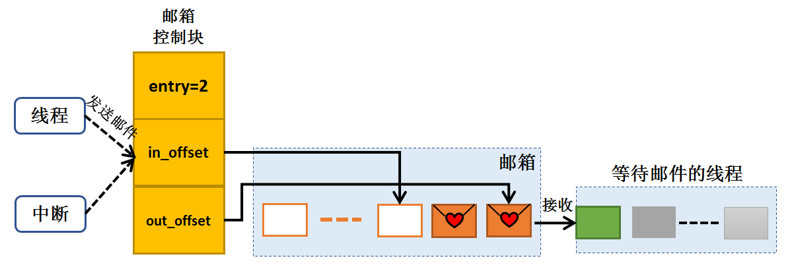
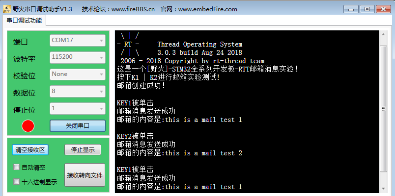

.. vim: syntax=rst

邮箱
-----------------

邮箱的基本概念
~~~~~~~~~~~~~~

邮箱在操作系统中是一种常用的IPC通信方式，邮箱可以在线程与线程之间。中断与线程之间进行消息的传递，此外，邮箱相比于信号量与消息队列来说，其开销更低，效率更高，所以常用来做线程与线程、中断与线程间的通信。邮箱中的每一封邮件只能容纳固定的4字节内容（STM32是32位处理系统，一个指针的大小即为4个字
节，所以一封邮件恰好能够容纳一个指针），当需要在线程间传递比较大的消息时，可以把指向一个缓冲区的指针作为邮件发送到邮箱中。

线程能够从邮箱里面读取邮件消息，当邮箱中的邮件是空时，根据用户自定义的阻塞时间决定是否挂起读取线程；当邮箱中有新邮件时，挂起的读取线程被唤醒，邮箱也是一种异步的通信方式。

通过邮箱，线程或中断服务函数可以将一个或多个邮件放入邮箱中。同样，一个或多个线程可以从邮箱中获得邮件消息。当有多个邮件发送到邮箱时，通常应将先进入邮箱的邮件先传给线程，也就是说，线程先得到的是最先进入邮箱的消息，即先进先出原则(FIFO)，同时RT-
Thread中的邮箱支持优先级，也就是说在所有等待邮件的线程中优先级最高的会先获得邮件。

RT-Thread中使用邮箱实现线程异步通信工作，具有如下特性：

-  邮件支持先进先出方式排队与优先级排队方式，支持异步读写工作方式。

-  发送与接收邮件均支持超时机制。

-  一个线程能够从任意一个消息队列接收和发送邮件。

-  多个线程能够向同一个邮箱发送邮件和从中接收邮件。

-  邮箱中的每一封邮件只能容纳固定的4字节内容（可以存放地址）。

-  当队列使用结束后，需要通过删除邮箱以释放内存。

邮箱与消息队列很相似，消息队列中消息的长度是可以由用户配置的，但邮箱中邮件的大小却只能是固定容纳4字节的内容，所以，使用邮箱的开销是很小的，因为传递的只能是4字节以内的内容，那么其效率会更高。

邮箱的运作机制
~~~~~~~

创建邮箱对象时会先创建一个邮箱对象控制块，然后给邮箱分配一块内存空间用来存放邮件，这块内存的大小等于邮件大小（4字节）与邮箱容量的乘积，接着初始化接收邮件和发送邮件在邮箱中的偏移量，接着再初始化消息队列，此时消息队列为空。

RT-Thread操作系统的邮箱对象由多个元素组成，当邮箱被创建时，它就被分配了邮箱控制块：邮箱名称、邮箱缓冲区起始地址、邮箱大小等。同时每个邮箱对象中包含着多个邮件框，每个邮件框可以存放一封邮件；所有邮箱中的邮件框总数即是邮箱的大小，这个大小可在邮箱创建时指定。

线程或者中断服务程序都可以给邮箱发送邮件，非阻塞方式的邮件发送过程能够安全的应用于中断服务中，中断服务函数、定时器向线程发送消息的有效手段，而阻塞方式的邮件发送只能应用于线程中。当发送邮件时，当且仅当邮箱还没满邮件的时候才能进行发送，如果邮箱已满，可以根据用户设定的等待时间进行等待，当邮箱中的邮件被
收取而空出空间来时，等待挂起的发送线程将被唤醒继续发送的过程，当等待时间到了还未完成发送邮件，或者未设置等待时间，此时发送邮件失败，发送邮件的线程或者中断程序会收到一个错误码（-RT_EFULL）。线程发送邮件可以带阻塞，但在中断中不能采用任何带阻塞的方式发送邮件。

接收邮件时，根据邮箱控制块中的entry判断队列是否有邮件，如果邮箱的邮件非空，那么可以根据out_offset找到最先发送到邮箱中的邮件进行接收。在接收时如果邮箱为空，如果用户设置了等待超时时间，系统会将当前线程挂起，当达到设置的超时时间，邮箱依然未收到邮件时，那么线程将被唤醒并返回-
RT_ETIMEOUT。如果邮箱中存在邮件，那么接收线程将复制邮箱中的4个字节邮件到接收线程中。通常来说，邮件收取过程可能是阻塞的，这取决于邮箱中是否有邮件，以及收取邮件时设置的超时时间。

当消邮箱不再被使用时，应该删除它以释放系统资源，一旦操作完成，邮箱将被永久性的删除。

邮箱的运作机制具体见图 23‑1。

|mailbo002|

图 23‑1邮箱的发送接收示意图

邮箱的应用场景
~~~~~~~

RT-Thread操作系统的邮箱中可存放固定条数的邮件，邮箱容量在创建/初始化邮箱时设定，每个邮件大小为4字节。当需要在线程间传递比较大的消息时，可以把指向一个缓冲区的指针作为邮件发送到邮箱中。

与系统其它通信方式相比，邮箱的通信开销更低，效率更高，无论是什么消息，传递的都是4个字节的邮件，所以经常应用在众多领域，另外其实现的发送/接收阻塞机制，能很好应用于线程与线程，中断与线程之间的通讯。

其实邮箱中每封邮件的大小为4个字节，在32位系统中，刚好能存放一个指针，所以，邮箱也特别适合那种仅传递地址情况。

邮箱的应用技巧
~~~~~~~

可能很多人会问，在实际应用中，有很多结构体，那怎么用邮箱进行传递呢？其实这个很简单的，只是一个指针的传递，具体见代码清单 23‑1。

代码清单 23‑1例子—邮箱传递的结构体

1 struct msg {

2 rt_uint8_t \*data_ptr;

3 rt_uint32_t data_size;

4 };

对于这样一个消息结构体，其中包含了指向数据的指针data_ptr和数据块长度的变量data_size。当一个线程需要把这个消息发送给另外一个线程时，可以采用如下的操作，具体见代码清单 23‑2。

代码清单 23‑2对结构体进行发送操作

1 struct msg\* msg_ptr;

2 msg_ptr = (struct msg*)rt_malloc(sizeof(struct msg));

3 msg_ptr->data_ptr = ...; /\* 指向相应的数据块地址*/

4 msg_ptr->data_size = len; /\* 数据块的长度*/

5 /\* 发送这个消息指针给mb邮箱*/

6 rt_mb_send(mb, (rt_uint32_t)msg_ptr);

申请结构体大小的内存空间，返回的指针指向了结构体，当结构体中的信息处理完，那么可以将指向结构体的指针作为邮件发送到邮箱中，而在接收邮件的线程中完成对结构体信息的读取操作，在完成操作后应当释放内存，因为收取过来的是指针，而msg_ptr是一个新分配出来的内存块，所以在接收线程处理完毕后，需要释放相应的
内存块，具体见代码清单 23‑3。

代码清单 23‑3对结构体进行接收操作

1 struct msg\* msg_ptr;

2 if (rt_mb_recv(mb, (rt_uint32_t*)&msg_ptr) == RT_EOK)

3 {

4 /\* 在接收线程处理完毕后，需要释放相应的内存块*/

5 rt_free(msg_ptr);

6 }

邮箱控制块
~~~~~

邮箱控制块包含了每个使用中邮箱的所有信息，如邮箱名称、内存缓冲区、邮箱大小以及队邮箱中邮件的数量等，是邮箱的很重要的控制块，具体见代码清单 23‑4。

代码清单 23‑4邮箱控制块

1 struct rt_mailbox {

2 struct rt_ipc_object parent; **(1)**

3

4 rt_uint32_t \*msg_pool; **(2)**

5

6 rt_uint16_t size; **(3)**

7

8 rt_uint16_t entry; **(4)**

9 rt_uint16_t in_offset; **(5)**

10 rt_uint16_t out_offset; **(6)**

11

12 rt_list_t suspend_sender_thread; **(7)**

13 };

14 typedef struct rt_mailbox \*rt_mailbox_t;

代码清单 23‑4\ **(1)**\ ：邮箱属于内核对象，也会在自身结构体里面包含一个内核对象类型的成员，通过这个成员可以将邮箱挂到系统对象容器里面。

代码清单 23‑4\ **(2)**\ ：邮箱缓冲区的开始地址。

代码清单 23‑4\ **(3)**\ ：邮箱缓冲区的大小，也就是邮箱的大小，它的大小决定了能存放多少封4字节大小的邮件。

代码清单 23‑4\ **(4)**\ ：邮箱中当前邮件的数目。

代码清单 23‑4\ **(5)**\ ：邮箱邮件的进偏移指针，指向空的邮件。

代码清单 23‑4\ **(6)**\ ：邮箱邮件的出偏移指针，如果邮箱中有邮件，则指向先进来的邮件。

代码清单 23‑4\ **(7)**\ ：发送线程的挂起等待链表。

邮箱的函数接口讲解
~~~~~~~~~

邮箱创建函数rt_mb_create()
^^^^^^^^^^^^^^^^^^^^

邮箱创建函数，顾名思义，就是创建一个邮箱，与消息队列一样，都是需要先创建才能使用的内核资源，我们需要怎么样的邮箱我们就自己创建就行了，邮箱的大小，邮箱的名称这些信息都是我们自己定义的，RT-Thread提供给我们这个创建函数，爱怎么搞都是我们自己来决定的。

创建邮箱对象时会先创建一个邮箱对象控制块，然后给邮箱分配一块内存空间用来存放邮件，这块内存的大小等于邮件大小（4字节）与邮箱容量的乘积，接着初始化接收邮件和发送邮件在邮箱中的偏移量。创建邮箱的函数源码具体见代码清单 23‑5。

代码清单 23‑5邮箱创建函数rt_mb_create()源码

1 rt_mailbox_t rt_mb_create(const char \*name, **(1)**

2 rt_size_t size, **(2)**

3 rt_uint8_t flag) **(3)**

4 {

5 rt_mailbox_t mb;

6

7 RT_DEBUG_NOT_IN_INTERRUPT;

8

9 /\* 分配邮箱对象 \*/

10 mb = (rt_mailbox_t)rt_object_allocate(RT_Object_Class_MailBox, name);

11 if (mb == RT_NULL) **(4)**

12 return mb;

13

14 /\* 设置接收线程等待模式 \*/

15 mb->parent.parent.flag = flag; **(5)**

16

17 /\* 初始化邮箱对象 \*/

18 rt_ipc_object_init(&(mb->parent)); **(6)**

19

20 /\* 初始化邮箱 \*/

21 mb->size = size; **(7)**

22 mb->msg_pool = RT_KERNEL_MALLOC(mb->size \* sizeof(rt_uint32_t));

23 if (mb->msg_pool == RT_NULL) { **(8)**

24 /\* 删除邮箱对象 \*/

25 rt_object_delete(&(mb->parent.parent)); **(9)**

26

27 return RT_NULL;

28 }

29 mb->entry = 0; **(10)**

30 mb->in_offset = 0;

31 mb->out_offset = 0;

32

33 /\* 初始化发送邮件挂起线程的链表 \*/

34 rt_list_init(&(mb->suspend_sender_thread)); **(11)**

35

36 return mb;

37 }

38 RTM_EXPORT(rt_mb_create);

代码清单 23‑5\ **(1)**\ ：name 邮箱名称。

代码清单 23‑5\ **(2)**\ ：size 邮箱容量，这个邮箱能存放多少封邮件。

代码清单 23‑5\ **(3)**\ ：flag用于设置邮箱的阻塞唤醒模式。

代码清单 23‑5\ **(4)**\ ：分配邮箱对象，调用rt_object_allocate此函数将从对象系统分配对象，为创建的邮箱分配一个邮箱的对象，并且命名对象名称，在系统中，对象的名称必须是唯一的。

代码清单 23‑5\ **(5)**\ ：设置邮箱的阻塞唤醒模式，创建的邮箱由于指定的flag不同，而有不同的意义： 使用RT_IPC_FLAG_PRIO优先级flag创建的IPC对象，在多个线程等待资源时，将由优先级高的线程优先获得资源。而使用RT_IPC_FLAG_FIFO先进先出flag创建的
IPC对象，在多个线程等待资源时，将按照先来先得的顺序获得资源。RT_IPC_FLAG_PRIO与RT_IPC_FLAG_FIFO均在rtdef.h中有定义。

代码清单 23‑5\ **(6)**\ ：初始化邮箱内核对象。调用rt_ipc_object_init会初始化一个链表用于记录访问此事件而阻塞的线程。

代码清单 23‑5\ **(7)**\ ：初始化邮箱，设置邮箱的大小。

代码清单 23‑5\ **(8)**\ ：申请邮箱内存，其内存大小为邮箱容量乘以4个字节，因为每封邮件的大小为4个字节。

代码清单 23‑5\ **(9)**\ ：如果内存申请失败，则需要删除邮箱对象。

代码清单 23‑5\ **(10)**\ ：申请内存成功，则初始化相关信息，将当前邮件的数量清零，邮件的进出偏移指针也为0。

代码清单 23‑5\ **(11)**\ ：初始化发送邮件挂起线程的链表。

在创建邮箱的时候，是需要用户自己定义邮箱的句柄的，但是注意了，定义了邮箱的句柄并不等于创建了邮箱，创建邮箱必须是调用rt_mb_create()函数进行创建，否则，以后根据邮箱句柄使用邮箱的其它函数的时候都会发生错误，在创建邮箱的时候是会返回创建的情况的，如果创建成功则返回创建的邮箱句柄，如果是返回
RT_NULL，则表示失败，邮箱创建函数rt_mb_create()使用实例具体见代码清单 23‑6加粗部分。

代码清单 23‑6邮箱创建函数rt_mb_create()实例

1 /\* 定义邮箱控制块 \*/

**2 static rt_mailbox_t test_mail = RT_NULL;**

3

4 /\* 创建一个邮箱 \*/

**5 test_mail = rt_mb_create("test_mail", /\* 消息队列名字 \*/**

**6 10, /\* 邮箱大小 \*/**

**7 RT_IPC_FLAG_FIFO);/\* 信号量模式 FIFO(0x00)*/**

8 if (test_mail != RT_NULL)

9 rt_kprintf("邮箱创建成功！\n\n");

邮箱删除函数rt_mb_delete()
^^^^^^^^^^^^^^^^^^^^

在不想用邮箱的时候，想要删除邮箱怎么办呢？RT-Thread给我们提供了一个删除邮箱的函数——rt_mb_delete()，使用它就能将邮箱进行删除了。当系统不再使用邮箱对象时，可以通过删除邮箱对象控制块来释放系统资源，一旦操作完成，邮箱将被永久性的删除，具体见代码清单 23‑7。

代码清单 23‑7邮箱删除函数rt_mb_delete()源码

1 rt_err_t rt_mb_delete(rt_mailbox_t mb) **(1)**

2 {

3 RT_DEBUG_NOT_IN_INTERRUPT;

4

5 /\* 邮箱句柄检查 \*/

6 RT_ASSERT(mb != RT_NULL); **(2)**

7

8 /\* 恢复所有阻塞在接收邮件的线程 \*/

9 rt_ipc_list_resume_all(&(mb->parent.suspend_thread)); **(3)**

10

11 /\* 也恢复所有阻塞在发送邮件的线程 \*/

12 rt_ipc_list_resume_all(&(mb->suspend_sender_thread)); **(4)**

13

14 #if defined(RT_USING_MODULE) && defined(RT_USING_SLAB) **(5)**

15 /\* 邮箱对象属于应用程序模块*/

16 if (mb->parent.parent.flag & RT_OBJECT_FLAG_MODULE)

17 rt_module_free(mb->parent.parent.module_id, mb->msg_pool);

18 else

19 #endif

20

21 /\* 释放邮箱内存 \*/

22 RT_KERNEL_FREE(mb->msg_pool); **(6)**

23

24 /\* 删除邮箱对象 \*/

25 rt_object_delete(&(mb->parent.parent)); **(7)**

26

27 return RT_EOK;

28 }

29 RTM_EXPORT(rt_mb_delete);

代码清单 23‑7\ **(1)**\ ：mb是我们自己定义的邮箱句柄，删除哪个邮箱就把该邮箱句柄传进来即可。

代码清单 23‑7\ **(2)**\ ：检查邮箱句柄mb是否有效，如果它是未定义或者未创建的邮箱句柄，那么是无法进行删除操作的。

代码清单 23‑7\ **(3)**\ ：调用rt_ipc_list_resume_all()函数将所有因为接收不到邮件的而阻塞的线程从阻塞态中唤醒，所有被唤醒的线程的返回值是-
RT_ERROR。与所有对象资源的删除函数一样，我们一般不会直接就删除一个邮箱，所以在删除邮箱的时候，应先确认所有的线程都无需接收邮件，并且都没被此邮箱阻塞时候才进行删除，否则删除之后线程需要发送/接收此邮箱邮件的话那也会发生错误。

代码清单 23‑7\ **(4)**\ ：同理，也应该调用rt_ipc_list_resume_all()函数将所有因为邮箱满了发送不到邮件的而阻塞的线程从阻塞态中恢复过来，所有被唤醒的线程的返回值是-RT_ERROR。

代码清单 23‑7\ **(5)**\ ：如果使能了RT_USING_SLAB这个宏定义，表示使用slab分配内存机制，那么需要使用rt_module_free函数进行释放内存，在这里我们并未使用slab。

代码清单 23‑7\ **(6)**\ ：释放邮箱内存，一旦释放，将永久性被删除。

代码清单 23‑7\ **(7)**\ ：删除邮箱对象。

邮箱的删除函数使用是很简单的，只需要传递进我们创建的邮箱对象句柄，其使用方法具体见代码清单 23‑8加粗部分。

代码清单 23‑8邮箱删除函数rt_mb_delete()实例

1 /\* 定义邮箱控制块 \*/

**2 static rt_mailbox_t test_mail = RT_NULL;**

3 rt_err_t uwRet = RT_EOK;

4

**5 /\* 删除一个邮箱 \*/**

**6 uwRet = rt_mbt_delete(test_mail);**

7 if (RT_EOK == uwRet)

8 rt_kprintf("邮箱创建成功！\n\n");

邮箱邮件发送函数rt_mb_send_wait()（阻塞）
^^^^^^^^^^^^^^^^^^^^^^^^^^^^^

邮箱的邮件发送可以从线程发送到线程，当发送邮件时候，邮箱发送的邮件可以是4字节以内任意格式的数据或者是一个指向缓冲区的指针。当且仅当邮箱还未满时，发送者才能成功发送邮件；当邮箱中的邮件已经满时，用户可以设置阻塞时间，进行发送邮件等待，当邮箱为满的时候将发送邮件线程挂起指定时间，当发送超时的时候，发送
邮件的线程会收到一个错误代码-RT_EFULL ，表示发送邮件失败，邮箱发送邮件函数rt_mb_send_wait()源码具体见代码清单 23‑9。

代码清单 23‑9邮箱邮件发送函数rt_mb_send_wait()（阻塞）源码

1 /*\*

2 \* 如果这个邮箱对象是空的话,这个函数会发送一个邮件到邮箱对象.

3 \* 如果这个邮箱对象是满的话，将会挂起当前线程

4 \*

5 \* @param邮箱对象

6 \* @param 邮箱大小

7 \* @param 等待时间

8 \*

9 \* @return 错误代码

10 \*/

11 rt_err_t rt_mb_send_wait(rt_mailbox_t mb, **(1)**

12 rt_uint32_t value, **(2)**

13 rt_int32_t timeout) **(3)**

14 {

15 struct rt_thread \*thread;

16 register rt_ubase_t temp;

17 rt_uint32_t tick_delta;

18

19 /\* 检查邮箱对象 \*/

20 RT_ASSERT(mb != RT_NULL); **(4)**

21

22 /\* 初始化系统时间差 \*/

23 tick_delta = 0;

24 /\* 获取当前线程 \*/

25 thread = rt_thread_self(); **(5)**

26

27 RT_OBJECT_HOOK_CALL(rt_object_put_hook, (&(mb->parent.parent)));

28

29 /\* 关中断 \*/

30 temp = rt_hw_interrupt_disable();

31

32 /\* 无阻塞调用 \*/

33 if (mb->entry == mb->size && timeout == 0) { **(6)**

34 rt_hw_interrupt_enable(temp);

35

36 return -RT_EFULL;

37 }

38

39 /\* 邮箱满了 \*/

40 while (mb->entry == mb->size) { **(7)**

41 /\* 重置线程错误代码 \*/

42 thread->error = RT_EOK;

43

44 /\* 不等待，返回错误 \*/

45 if (timeout == 0) { **(8)**

46 /\* 开中断 \*/

47 rt_hw_interrupt_enable(temp);

48

49 return -RT_EFULL;

50 }

51

52 RT_DEBUG_IN_THREAD_CONTEXT;

53 /\* 挂起当前线程 \*/

54 rt_ipc_list_suspend(&(mb->suspend_sender_thread), **(9)**

55 thread,

56 mb->parent.parent.flag);

57

58 /\* 有等待时间 \*/

59 if (timeout > 0) { **(10)**

60 /\* 获取当前系统时间 \*/

61 tick_delta = rt_tick_get();

62

63 RT_DEBUG_LOG(RT_DEBUG_IPC, ("mb_send_wait: start timer of thread:%s\n",

64 thread->name));

65

66 /\* 重置线程超时时间并开始定时 \*/

67 rt_timer_control(&(thread->thread_timer), **(11)**

68 RT_TIMER_CTRL_SET_TIME,

69 &timeout);

70 rt_timer_start(&(thread->thread_timer)); **(12)**

71 }

72

73 /\* 开中断 \*/

74 rt_hw_interrupt_enable(temp);

75

76 /\* 进行线程调度 \*/

77 rt_schedule(); **(13)**

78

79 /\* 从挂起状态恢复 \*/

80 if (thread->error != RT_EOK) { **(14)**

81 /\* 返回错误代码 \*/

82 return thread->error;

83 }

84

85 /\* 关中断 \*/

86 temp = rt_hw_interrupt_disable();

87

88 /\* 如果它不是永远等待 \*/

89 if (timeout > 0) {

90 tick_delta = rt_tick_get() - tick_delta;

91 timeout -= tick_delta;

92 if (timeout < 0)

93 timeout = 0;

94 }

95 }

96

97 /\* 将要发送的信息放入邮件中 \*/

98 mb->msg_pool[mb->in_offset] = value; **(15)**

99 /\* 邮件进指针偏移 \*/

100 ++ mb->in_offset; **(16)**

101 if (mb->in_offset >= mb->size) **(17)**

102 mb->in_offset = 0;

103 /\* 记录邮箱中邮件的数量 \*/

104 mb->entry ++; **(18)**

105

106 /\* 恢复线程 \*/

107 if (!rt_list_isempty(&mb->parent.suspend_thread)) { **(19)**

108 rt_ipc_list_resume(&(mb->parent.suspend_thread));

109

110 /\* 开中断 \*/

111 rt_hw_interrupt_enable(temp);

112

113 rt_schedule(); **(20)**

114

115 return RT_EOK;

116 }

117

118 /\* 开中断 \*/

119 rt_hw_interrupt_enable(temp);

120

121 return RT_EOK; **(21)**

122 }

123 RTM_EXPORT(rt_mb_send_wait);

代码清单 23‑9\ **(1)**\ ：mb 邮箱对象的句柄。

代码清单 23‑9\ **(2)**\ ：value 邮件内容，可以是4字节大小以内的任意内容，也可以是一个指针。

代码清单 23‑9\ **(3)**\ ：timeout 超时时间。

代码清单 23‑9\ **(4)**\ ：检查邮箱句柄mb是否有效，如果它是未定义或者未创建的邮箱句柄，那么是无法进行发送邮件操作的。

代码清单 23‑9\ **(5)**\ ：先获取当前线程，在后面需要用到当前线程的信息。

代码清单 23‑9\ **(6)**\ ：如果邮箱已满，并且是无阻塞调用（timeout=0），那么发送失败，直接退出发送。

代码清单 23‑9\ **(7)**\ ：如果邮箱满了，进入死循环中。

代码清单 23‑9\ **(8)**\ ：timeout=0，用户不等待，返回错误码。

代码清单 23‑9\ **(9)**\ ：\ **(9)-(17)**\ 的内容都是邮箱满了并且timeout不为0的情况。因为用户设置了阻塞时间，不管三七二十一直接先将当前线程挂起。

代码清单 23‑9\ **(10)**\ ：有等待时间（并非一直等待的情况，因为RT_WAITING_FOREVER的值为（-1），在rtdef.h中有定义），现在是设置了某个等待的时间。

代码清单 23‑9\ **(11)**\ ：重置线程定时器的超时时间，调用rt_timer_control()函数改变当前线程阻塞时间thread_timer。

代码清单 23‑9\ **(12)**\ ：启动定时器，开始计时。

代码清单 23‑9\ **(13)**\ ：因为现在线程是等待着了，要进行线程切换，所以需要进行一次线程调度。

代码清单 23‑9\ **(14)**\ ：超时时间到了，线程被唤醒，但此时还没发送邮件完成，那么将返回错误码。

代码清单 23‑9\ **(15)**\ ：如果邮箱还未满，那么可以将要发送的邮件放入邮箱。

代码清单 23‑9\ **(16)**\ ：更新发送邮件指针的进偏移地址，因为邮箱是一个内存池，其存放邮件的地址在32位机器中指针下标加1偏移刚好是4个字节，指向了下一个空闲邮件地址。

代码清单 23‑9\ **(17)**\ ：判断邮箱是否满了，若它满了，将in_offset设置为0。

代码清单 23‑9\ **(18)**\ ：记录邮箱中邮件的数量，邮箱控制块需要知道邮箱中邮件的实时数量。

代码清单 23‑9\ **(19)**\ ：如果有线程因为接收不到邮件进入阻塞的话，那么需要恢复该线程，调用rt_ipc_list_resume函数将该线程恢复。

代码清单 23‑9\ **(20)**\ ：恢复线程后进行一次线程调度。

代码清单 23‑9\ **(21)**\ ：返回发送邮件结果。

发送邮件时，发送者需指定发送到的邮箱的对象句柄（即指向邮箱控制块的指针），并且指定发送的邮件内容，如果内容大于4个字节，可以将内容的地址作为邮件发送出去，邮箱发送邮件函数rt_mb_send_wait()的实例具体见代码清单 23‑10加粗内容。

代码清单 23‑10邮箱邮件发送函数rt_mb_send_wait()（阻塞）实例

1 /\* 定义邮箱控制块 \*/

**2 static rt_mailbox_t test_mail = RT_NULL;**

3 /\* 全局变量声明 \/

4 /\*

5 \* 当我们在写应用程序的时候，可能需要用到一些全局变量。

6 \*/

**7 char test_str1[] = "this is a mail test 1";/\* 邮箱消息test1 \*/**

**8 char test_str2[] = "this is a mail test 2";/\* 邮箱消息test2 \*/**

9

10 static void send_thread_entry(void\* parameter)

11 {

12 rt_err_t uwRet = RT_EOK;

13 /\* 线程都是一个无限循环，不能返回 \*/

14 while (1) {

15 //如果KEY1被单击

16 if ( Key_Scan(KEY1_GPIO_PORT,KEY1_GPIO_PIN) == KEY_ON ) {

17 rt_kprintf ( "KEY1被单击\n" );

**18 /\* 发送一个邮箱消息1 \*/**

**19 uwRet = rt_mb_send_wait(test_mail,/\* 邮箱对象句柄 \*/**

**20 (rt_uint32_t)&test_str1,/*邮件内容(地址) \*/**

**21 10); /\* 超时时间 \*/**

22 if (RT_EOK == uwRet)

23 rt_kprintf ( "邮箱消息发送成功\n" );

24 else

25 rt_kprintf ( "邮箱消息发送失败\n" );

26 }

27 //如果KEY2被单击

28 if ( Key_Scan(KEY2_GPIO_PORT,KEY2_GPIO_PIN) == KEY_ON ) {

29 rt_kprintf ( "KEY2被单击\n" );

**30 /\* 发送一个邮箱消息2 \*/**

**31 uwRet = rt_mb_send_wait(test_mail,/\* 邮箱对象句柄 \*/**

**32 (rt_uint32_t)&test_str1,/\* 邮件内容(地址) \*/**

**33 10); /\* 超时时间 \*/**

34 if (RT_EOK == uwRet)

35 rt_kprintf ( "邮箱消息发送成功\n" );

36 else

37 rt_kprintf ( "邮箱消息发送失败\n" );

38 }

39 rt_thread_delay(20); //每20ms扫描一次

40 }

41 }

发送的邮件可以是4字节任意格式的数据，当邮箱中的邮件已经满时，发送邮件的线程或者中断程序会收到-RT_EFULL 的返回值。

邮箱邮件发送函数rt_mb_send ()（非阻塞）
^^^^^^^^^^^^^^^^^^^^^^^^^^

RT-Thread给我们提供了两个邮箱发送函数，一个是带阻塞的rt_mb_send_wait()，另一个是非阻塞的rt_mb_send()，那么这两个函数有什么不一样呢？其实，看了源码你就会知道，原来没啥差别，下面一起来看看rt_mb_send ()（非阻塞）的源码，具体见代码清单 23‑11。

代码清单 23‑11 邮箱邮件发送函数rt_mb_send ()（非阻塞）源码

1 /*\*

2 \* 此函数将邮件发送到邮箱对象，

3 \* 如果有邮件对象挂起，则会被唤醒。

4 \* 此函数将立即返回，如果要阻塞发送，请改用rt_mb_send_wait。

5 \*

6 \* @param 邮箱对象

7 \* @param 要发送的邮件内容

8 \*

9 \* @return 返回的错误码

10 \*/

11 rt_err_t rt_mb_send(rt_mailbox_t mb, rt_uint32_t value)

12 {

13 return rt_mb_send_wait(mb, value, 0);

14 }

15 RTM_EXPORT(rt_mb_send);

其实rt_mb_send真正调用的函数是rt_mb_send_wait，但是它却是不等待的（因为timeout=0），这个函数多用于中断与线程的通信，因为中断中不允许阻塞。而rt_mb_send_wait()却比较灵活，多用于线程与线程的通信。

既然rt_mb_send()函数源码实际上就是调用rt_mb_send_wai()，连实现都是一样的，那么使用当然也是一样啦，只不过rt_mb_send()传递的参数少了一个timeout而已，具体实例见代码清单 23‑12加粗部分。

代码清单 23‑12邮箱邮件发送函数rt_mb_send ()（非阻塞）实例

**1 /\* 定义邮箱控制块 \*/**

**2 static rt_mailbox_t test_mail = RT_NULL;**

3 /\* 全局变量声明 \/

4 /\*

5 \* 当我们在写应用程序的时候，可能需要用到一些全局变量。

6 \*/

**7 char test_str1[] = "this is a mail test 1";/\* 邮箱消息test1 \*/**

**8 char test_str2[] = "this is a mail test 2";/\* 邮箱消息test2 \*/**

9

10 static void send_thread_entry(void\* parameter)

11 {

12 rt_err_t uwRet = RT_EOK;

13 /\* 线程都是一个无限循环，不能返回 \*/

14 while (1) {

15 //如果KEY1被单击

16 if ( Key_Scan(KEY1_GPIO_PORT,KEY1_GPIO_PIN) == KEY_ON ) {

17 rt_kprintf ( "KEY1被单击\n" );

**18 /\* 发送一个邮箱消息1 \*/**

**19 uwRet = rt_mb_send(test_mail,/\* 邮箱对象句柄 \*/**

**20 (rt_uint32_t)&test_str1)/\* 邮件内容(地址) \*/**

21 if (RT_EOK == uwRet)

22 rt_kprintf ( "邮箱消息发送成功\n" );

23 else

24 rt_kprintf ( "邮箱消息发送失败\n" );

25 }

26 //如果KEY2被单击

27 if ( Key_Scan(KEY2_GPIO_PORT,KEY2_GPIO_PIN) == KEY_ON ) {

28 rt_kprintf ( "KEY2被单击\n" );

**29 /\* 发送一个邮箱消息2 \*/**

**30 uwRet = rt_mb_send(test_mail,/\* 邮箱对象句柄 \*/**

**31 (rt_uint32_t)&test_str1)/\* 邮件内容(地址) \*/**

32 if (RT_EOK == uwRet)

33 rt_kprintf ( "邮箱消息发送成功\n" );

34 else

35 rt_kprintf ( "邮箱消息发送失败\n" );

36 }

37 rt_thread_delay(20); //每20ms扫描一次

38 }

39 }

邮箱邮件接收函数rt_mb_recv()
^^^^^^^^^^^^^^^^^^^^

邮件的收发与我们现实生活中的邮件收发其实是一样的道理，既然别人给我们发了一份邮件，那么我们肯定要看看有什么事情发生，然后进行处理。在RT-
Thread中，官方给我们提供了一个函数接口——邮箱的邮件接收函数rt_mb_recv()，我们可以使用该函数访问指定的邮箱，看看是否有邮件发送过来，接收到邮件就去处理信息，如果还没有邮件发送过来，那我们可以不等这个邮件或者指定等待时间去接收这个邮件，如果超时了还是没有收到邮件，就返回错误代码。

只有当接收者接收的邮箱中有邮件时，接收线程才能立即取到邮件，否则接收线程会根据指定超时时间将线程挂起，直到接收完成或者超时，下面一起来看看邮件的接收函数，具体见代码清单 23‑13。

代码清单 23‑13邮箱邮件接收函数rt_mb_recv()源码

1 rt_err_t rt_mb_recv(rt_mailbox_t mb, **(1)**

2 rt_uint32_t \*value, **(2)**

3 rt_int32_t timeout) **(3)**

4 {

5 struct rt_thread \*thread;

6 register rt_ubase_t temp;

7 rt_uint32_t tick_delta;

8

9 /\* 邮箱检查 \*/

10 RT_ASSERT(mb != RT_NULL); **(4)**

11

12 /\* 初始化系统时间差变量 \*/

13 tick_delta = 0;

14 /\* 获取当前线程 \*/

15 thread = rt_thread_self(); **(5)**

16

17 RT_OBJECT_HOOK_CALL(rt_object_trytake_hook, (&(mb->parent.parent)));

18

19 /\* 关中断 \*/

20 temp = rt_hw_interrupt_disable();

21

22 /\* 非阻塞调用 \*/

23 if (mb->entry == 0 && timeout == 0) { **(6)**

24 rt_hw_interrupt_enable(temp);

25

26 return -RT_ETIMEOUT;

27 }

28

29 /\* 邮箱是空的 \*/

30 while (mb->entry == 0) { **(7)**

31 /\* 重置线程错误 \*/

32 thread->error = RT_EOK;

33

34 /\* 不等待，返回错误码-RT_ETIMEOUT \*/

35 if (timeout == 0) {

36 /\* 开中断 \*/

37 rt_hw_interrupt_enable(temp);

38

39 thread->error = -RT_ETIMEOUT;

40

41 return -RT_ETIMEOUT;

42 }

43

44 RT_DEBUG_IN_THREAD_CONTEXT;

45 /\* 挂起当前线程 \*/

46 rt_ipc_list_suspend(&(mb->parent.suspend_thread), **(8)**

47 thread,

48 mb->parent.parent.flag);

49

50 /\* 有等待时间，开始等待 \*/

51 if (timeout > 0) {

52 /\* 获取开始时候的系统时间 \*/

53 tick_delta = rt_tick_get(); **(9)**

54

55 RT_DEBUG_LOG(RT_DEBUG_IPC, ("mb_recv: start timer of thread:%s\n",

56 thread->name));

57

58 /\* 重置线程超时时间，并且开始定时器 \*/

59 rt_timer_control(&(thread->thread_timer), **(10)**

60 RT_TIMER_CTRL_SET_TIME,

61 &timeout);

62 rt_timer_start(&(thread->thread_timer)); **(11)**

63 }

64

65 /\* 开中断 \*/

66 rt_hw_interrupt_enable(temp);

67

68 /\* 发起线程调度 \*/

69 rt_schedule(); **(12)**

70

71 /\* 解除阻塞了 \*/

72 if (thread->error != RT_EOK) {

73 /\* 返回错误代码 \*/

74 return thread->error;

75 }

76

77 /\* 关中断 \*/

78 temp = rt_hw_interrupt_disable();

79

80 /\* 如果它不是永远等待 \*/

81 if (timeout > 0) {

82 tick_delta = rt_tick_get() - tick_delta;

83 timeout -= tick_delta;

84 if (timeout < 0)

85 timeout = 0;

86 }

87 }

88

89 /\* 将邮件内容放到接收邮件的地址中 \*/

90 \*value = mb->msg_pool[mb->out_offset]; **(13)**

91

92 /\* 接收邮件偏移指针自加 \*/

93 ++ mb->out_offset; **(14)**

94 if (mb->out_offset >= mb->size) **(15)**

95 mb->out_offset = 0;

96 /\* 记录当前邮件数量 \*/

97 mb->entry --; **(16)**

98

99 /\* 恢复挂起的线程 \*/

100 if (!rt_list_isempty(&(mb->suspend_sender_thread))) { **(17)**

101 rt_ipc_list_resume(&(mb->suspend_sender_thread));

102

103 /\* 开中断 \*/

104 rt_hw_interrupt_enable(temp);

105

106 RT_OBJECT_HOOK_CALL(rt_object_take_hook, (&(mb->parent.parent)));

107

108 rt_schedule(); **(18)**

109

110 return RT_EOK;

111 }

112

113 /\* 关中断 \*/

114 rt_hw_interrupt_enable(temp);

115

116 RT_OBJECT_HOOK_CALL(rt_object_take_hook, (&(mb->parent.parent)));

117

118 return RT_EOK; **(19)**

119 }

120 RTM_EXPORT(rt_mb_recv);

代码清单 23‑13\ **(1)**\ ：mb 邮箱对象的句柄。

代码清单 23‑13\ **(2)**\ ：value 用于存放邮件内容的地址，在调用接收函数前需要用户自己定义一个用于保存数据的变量，并且将该变量的地址作为参数传递进来。

代码清单 23‑13\ **(3)**\ ：timeout 超时时间。

代码清单 23‑13\ **(4)**\ ：检查邮箱句柄mb是否有效，如果它是未定义或者未创建的邮箱句柄，那么是无法进行接收邮件操作的。

代码清单 23‑13\ **(5)**\ ：先获取当前线程，在后面需要用到当前线程的信息。

代码清单 23‑13\ **(6)**\ ：如果邮箱是空的，并且是无阻塞调用（timeout=0）接收函数，那么接收邮件失败。

代码清单 23‑13\ **(7)**\ ：如果邮箱是空的，进入死循环中。

代码清单 23‑13\ **(8)**\ ：\ **(8)-(12)**\ 的内容都是邮箱是空的并且timeout不为0的情况。因为用户设置了阻塞时间，不管三七二十一直接先将当前线程挂起。

代码清单 23‑13\ **(9)**\ ：获取阻塞开始时候的系统时间。

代码清单 23‑13\ **(10)**\ ：重置线程计时器的超时时间，调用rt_timer_control()函数改变当前线程阻塞时间thread_timer。

代码清单 23‑13\ **(11)**\ ：启动定时器，开始计时。

代码清单 23‑13\ **(12)**\ ：因为现在线程是等待着了，要进行线程切换，所以进行一次线程调度。

代码清单 23‑13\ **(13)**\ ：将接收到的邮件内容放到接收地址中，在接收线程中用户可以自己定义接收的类型，可以是4字节内的任意内容，也可以是指针。

代码清单 23‑13\ **(14)**\ ：更新接收邮件指针的偏移地址，因为邮箱是一个内存池，其存放邮件的地址在32位机器中指针下标自加1偏移刚好是4个字节，如果有邮件的话指向下一个邮件的地址（如果没有邮件，那么就是空闲地址）。

代码清单 23‑13\ **(15)**\ ：判断接收邮件指针的偏移地址是否到达邮箱最大容量，如果是，则重置为0。

代码清单 23‑13\ **(16)**\ ：记录当前邮件数量，每接收一封邮件就要减少一封邮件。

代码清单 23‑13\ **(17)**\ ：如果有线程因为发送邮件不成功而被阻塞的话，那么需要恢复该线程，调用rt_ipc_list_resume()函数将该线程恢复。

代码清单 23‑13\ **(18)**\ ：进行一次线程调度。

代码清单 23‑13\ **(19)**\ ：返回接收邮件结果。

接收邮件时，接收者需指定接收邮件的邮箱句柄，并指定接收到的邮件存放位置以及设置指定超时时间，成功收到邮件则返回RT_EOK；当指定的时间内依然未收到邮件时，将返回-RT_ETIMEOUT。接收是允许带阻塞的，所以仅在线程中接收邮件，邮件接收函数rt_mb_recv()实例具体见代码清单
23‑14加粗部分。

代码清单 23‑14邮箱邮件接收函数rt_mb_recv()实例

**1 /\* 定义邮箱控制块 \*/**

**2 static rt_mailbox_t test_mail = RT_NULL;**

3

4 static void receive_thread_entry(void\* parameter)

5 {

6 rt_err_t uwRet = RT_EOK;

7 char \*r_str;

8 /\* 线程都是一个无限循环，不能返回 \*/

9 while (1) {

**10 /\* 等待接邮箱消息 \*/**

**11 uwRet = rt_mb_recv(test_mail, /\* 邮箱对象句柄 \*/**

**12 (rt_uint32_t*)&r_str, /\* 接收邮箱消息 \*/**

**13 RT_WAITING_FOREVER); /\* 指定超时**\ 事件,一直等 \*/

14

15 if (RT_EOK == uwRet) { /\* 如果接收完成并且正确 \*/

16 rt_kprintf ( "邮箱的内容是:%s\n\n",r_str);

17 LED1_TOGGLE; //LED1 反转

18 } else

19 rt_kprintf ( "邮箱接收错误！错误码是0x%x\n",uwRet);

20 }

21 }

22

邮箱的实验
~~~~~

邮箱实验是在RT-Thread中创建了两个线程，一个是发送邮件线程，一个是接收邮件线程，两个线程独立运行，发送邮件线程是通过检测按键的按下情况来发送邮件，假如发送邮件错误，就把发送邮件错误情况在串口打印出来，另一个线程是接收邮件线程，在没有接收到邮件之前一直等待邮件，一旦接收到邮件就通过串口调试助手
把邮件里面的数据信息打印出来，具体见代码清单 23‑15加粗部分。

注意：在使用邮箱时候请确保在rtconfig.h中打开RT_USING_MAILBOX这个宏定义。

代码清单 23‑15邮箱的实验

1 /*\*

2 \\*

3 \* @file main.c

4 \* @author fire

5 \* @version V1.0

6 \* @date 2018-xx-xx

7 \* @brief RT-Thread 3.0 + STM32 邮箱

8 \\*

9 \* @attention

10 \*

11 \* 实验平台:基于野火STM32全系列（M3/4/7）开发板

12 \* 论坛 :http://www.firebbs.cn

13 \* 淘宝 :https://fire-stm32.taobao.com

14 \*

15 \\*

16 \*/

17

18 /\*

19 \\*

20 \* 包含的头文件

21 \\*

22 \*/

23 #include "board.h"

24 #include "rtthread.h"

25

26

27 /\*

28 \\*

29 \* 变量

30 \\*

31 \*/

**32 /\* 定义线程控制块 \*/**

**33 static rt_thread_t receive_thread = RT_NULL;**

**34 static rt_thread_t send_thread = RT_NULL;**

**35 /\* 定义邮箱控制块 \*/**

**36 static rt_mailbox_t test_mail = RT_NULL;**

37

38 /\* 全局变量声明 \/

39 /\*

40 \* 当我们在写应用程序的时候，可能需要用到一些全局变量。

41 \*/

**42 char test_str1[] = "this is a mail test 1";/\* 邮箱消息test1 \*/**

**43 char test_str2[] = "this is a mail test 2";/\* 邮箱消息test2 \*/**

**44 /\**

**45 \\**

**46 \* 函数声明**

**47 \\**

**48 \*/**

**49 static void receive_thread_entry(void\* parameter);**

**50 static void send_thread_entry(void\* parameter);**

51

52 /\*

53 \\*

54 \* main 函数

55 \\*

56 \*/

57 /*\*

58 \* @brief 主函数

59 \* @param 无

60 \* @retval 无

61 \*/

62 int main(void)

63 {

64 /\*

65 \* 开发板硬件初始化，RTT系统初始化已经在main函数之前完成，

66 \* 即在component.c文件中的rtthread_startup()函数中完成了。

67 \* 所以在main函数中，只需要创建线程和启动线程即可。

68 \*/

69 rt_kprintf("这是一个[野火]-STM32全系列开发板-RTT邮箱消息实验！\n");

70 rt_kprintf("按下K1 \| K2进行邮箱实验测试!\n");

**71 /\* 创建一个邮箱 \*/**

**72 test_mail = rt_mb_create("test_mail", /\* 邮箱名字 \*/**

**73 10, /\* 邮箱大小 \*/**

**74 RT_IPC_FLAG_FIFO);/\* 信号量模式 FIFO(0x00)*/**

**75 if (test_mail != RT_NULL)**

**76 rt_kprintf("邮箱创建成功！\n\n");**

77

78 receive_thread = /\* 线程控制块指针 \*/

79 rt_thread_create( "receive", /\* 线程名字 \*/

80 receive_thread_entry, /\* 线程入口函数 \*/

81 RT_NULL, /\* 线程入口函数参数 \*/

82 512, /\* 线程栈大小 \*/

83 3, /\* 线程的优先级 \*/

84 20); /\* 线程时间片 \*/

85

86 /\* 启动线程，开启调度 \*/

87 if (receive_thread != RT_NULL)

88 rt_thread_startup(receive_thread);

89 else

90 return -1;

91

92 send_thread = /\* 线程控制块指针 \*/

93 rt_thread_create( "send", /\* 线程名字 \*/

94 send_thread_entry, /\* 线程入口函数 \*/

95 RT_NULL, /\* 线程入口函数参数 \*/

96 512, /\* 线程栈大小 \*/

97 2, /\* 线程的优先级 \*/

98 20); /\* 线程时间片 \*/

99

100 /\* 启动线程，开启调度 \*/

101 if (send_thread != RT_NULL)

102 rt_thread_startup(send_thread);

103 else

104 return -1;

105 }

106

107 /\*

108 \\*

109 \* 线程定义

110 \\*

111 \*/

112

**113 static void receive_thread_entry(void\* parameter)**

**114 {**

**115 rt_err_t uwRet = RT_EOK;**

**116 char \*r_str;**

**117 /\* 线程都是一个无限循环，不能返回 \*/**

**118 while (1) {**

**119 /\* 等待接邮箱消息 \*/**

**120 uwRet = rt_mb_recv(test_mail, /\* 邮箱对象句柄 \*/**

**121 (rt_uint32_t*)&r_str, /\* 接收邮箱消息 \*/**

**122 RT_WAITING_FOREVER);/\* 指定超时事件,一直等 \*/**

**123**

**124 if (RT_EOK == uwRet) { /\* 如果接收完成并且正确 \*/**

**125 rt_kprintf ( "邮箱的内容是:%s\n\n",r_str);**

**126 LED1_TOGGLE; //LED1 反转**

**127 } else**

**128 rt_kprintf ( "邮箱接收错误！错误码是0x%x\n",uwRet);**

**129 }**

**130 }**

131

**132 static void send_thread_entry(void\* parameter)**

**133 {**

**134 rt_err_t uwRet = RT_EOK;**

**135 /\* 线程都是一个无限循环，不能返回 \*/**

**136 while (1) {**

**137 //如果KEY1被单击**

**138 if ( Key_Scan(KEY1_GPIO_PORT,KEY1_GPIO_PIN) == KEY_ON ) {**

**139 rt_kprintf ( "KEY1被单击\n" );**

**140 /\* 发送一个邮箱消息1 \*/**

**141 uwRet = rt_mb_send(test_mail,(rt_uint32_t)&test_str1);**

**142 if (RT_EOK == uwRet)**

**143 rt_kprintf ( "邮箱消息发送成功\n" );**

**144 else**

**145 rt_kprintf ( "邮箱消息发送失败\n" );**

**146 }**

**147 //如果KEY2被单击**

**148 if ( Key_Scan(KEY2_GPIO_PORT,KEY2_GPIO_PIN) == KEY_ON ) {**

**149 rt_kprintf ( "KEY2被单击\n" );**

**150 /\* 发送一个邮箱2 \*/**

**151 uwRet = rt_mb_send(test_mail,(rt_uint32_t)&test_str2);**

**152 if (RT_EOK == uwRet)**

**153 rt_kprintf ( "邮箱消息发送成功\n" );**

**154 else**

**155 rt_kprintf ( "邮箱消息发送失败\n" );**

**156 }**

**157 rt_thread_delay(20); //每20ms扫描一次**

**158 }**

**159 }**

160

161

162

163

164 /END OF FILE/

165

邮箱的实验现象
~~~~~~~

程序编译好，用USB线连接电脑和开发板的USB接口（对应丝印为USB转串口），用DAP仿真器把配套程序下载到野火STM32开发板（具体型号根据你买的板子而定，每个型号的板子都配套有对应的程序），在电脑上打开串口调试助手，然后复位开发板就可以在调试助手中看到rt_kprintf的打印信息，按下开发版的
K1按键发送邮件1，按下K2按键发送邮件2；我们按下K1与K2试试，在串口调试助手中可以看到运行结果，具体见图 23‑2。

|mailbo003|

图 23‑2邮箱实验现象

