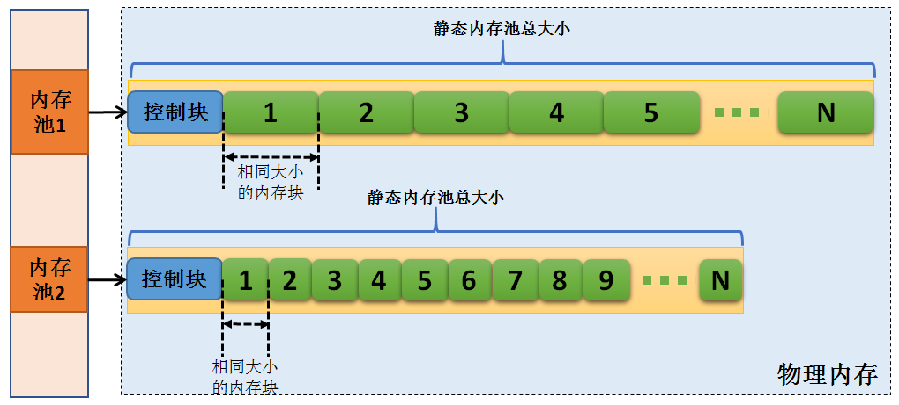
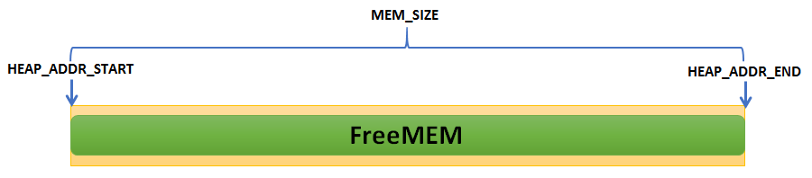
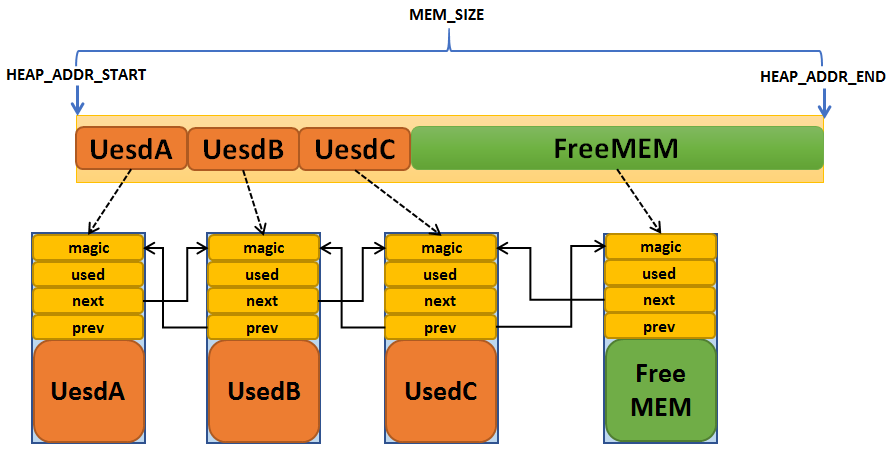
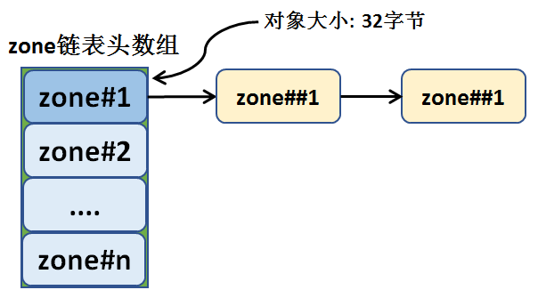
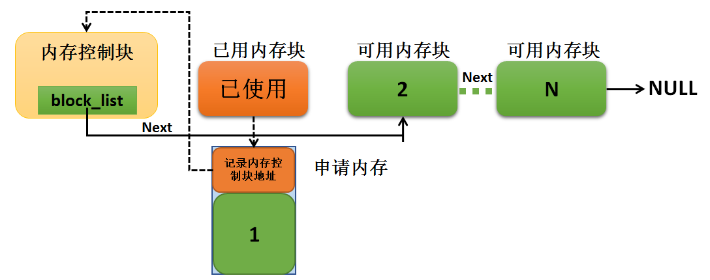
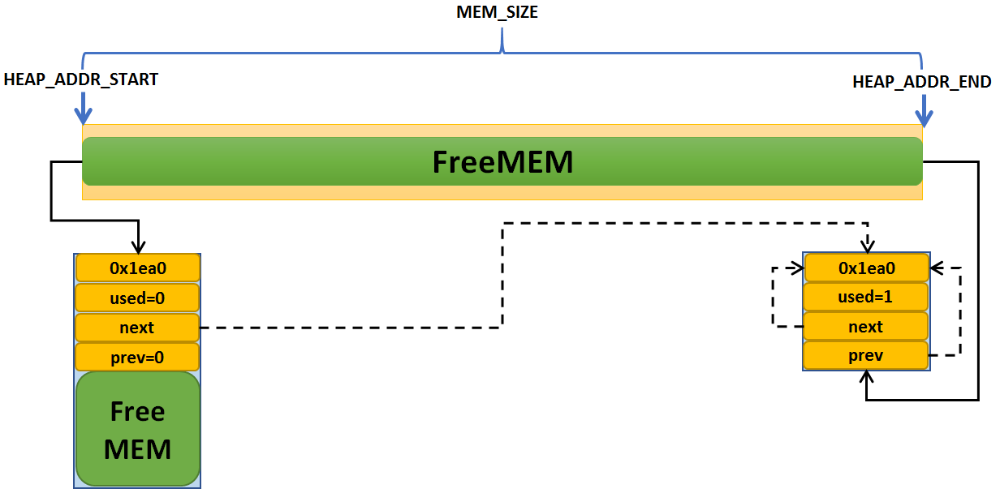
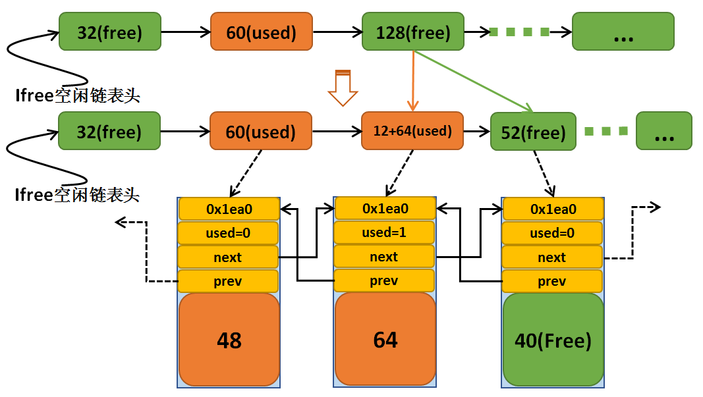
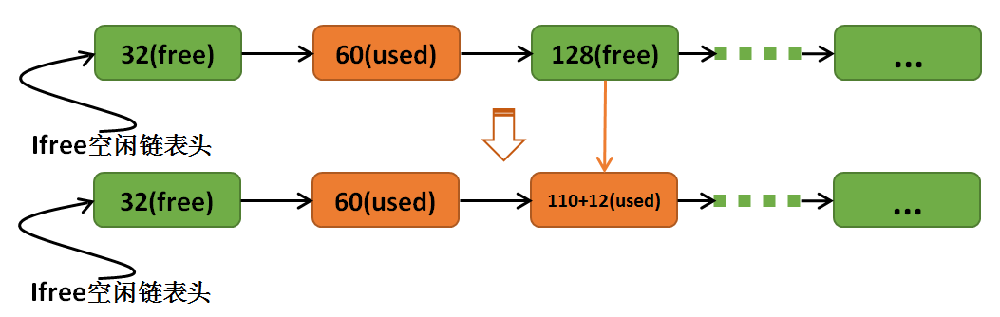
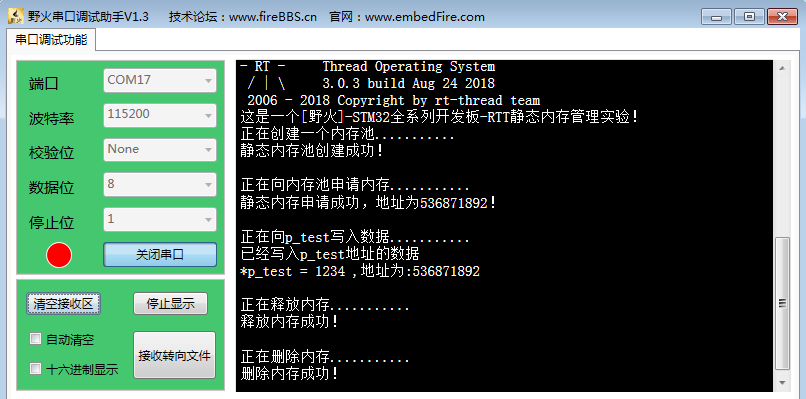
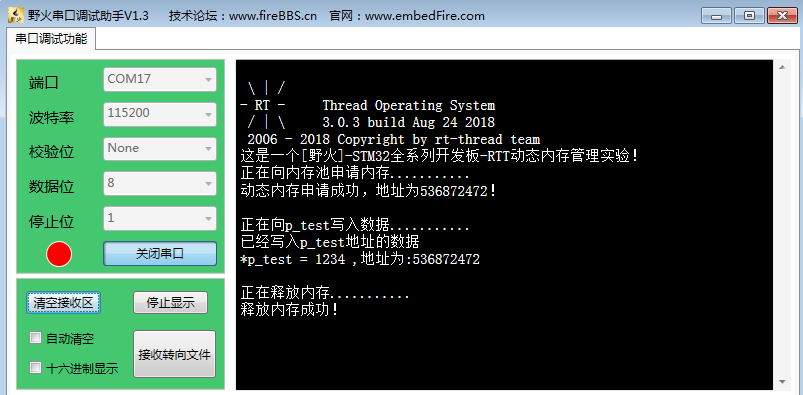

.. vim: syntax=rst

内存管理
================

内存管理的基本概念
~~~~~~~~~~~~~~~~~~

在计算系统中，变量、中间数据一般存放在系统存储空间中，只有在实际使用时才将它们从存储空间调入到中央处理
器内部进行运算。通常存储空间可以分为两种：内部存储空间和外部存储空间。内部存储空间访问速度比较快，能够
按照变量地址随机地访问，也就是我们通常所说的RAM（随机存储器），或电脑的内存；而外部存储空间内所保存的内
容相对来说比较固定，即使掉电后数据也不会丢失，可以把它理解为电脑的硬盘。在这一章中我们主要讨论内部存储
空间（RAM）的管理——内存管理。

RT-Thread操作系统将内核与内存管理分开实现，操作系统内核仅规定了必要的内存管理函数原型，而不关心这些
内存管理函数是如何实现的，所以在RT-Thread中提供了多种内存分配算法（分配策略），但是上层接口（API）却
是统一的。这样做可以增加系统的灵活性：用户可以选择对自己更有利的内存管理策略，在不同的应用场合使用不
同的内存分配策略。

在嵌入式程序设计中内存分配应该是根据所设计系统的特点来决定选择使用动态内存分配还是静态内存分配算
法，一些可靠性要求非常高的系统应选择使用静态的，而普通的业务系统可以使用动态来提高内存使用效率。静
态可以保证设备的可靠性但是需要考虑内存上限，内存使用效率低，而动态则是相反。

RT-Thread的内存管理模块管理系统的内存资源，它是操作系统的核心模块之一。主要包括内存的初始化、分配以及释放。

很多人会有疑问，什么不直接使用C标准库中的内存管理函数呢？在电脑中我们可以
用 malloc()和 free()这两个函数动态的分配内存和释放内存。但是，在嵌入式实
时操作系统中，调用 malloc()和 free()却是危险的，原因有以下几点：

-  这些函数在小型嵌入式系统中并不总是可用的，小型嵌入式设备中的RAM不足。

-  它们的实现可能非常的大，占据了相当大的一块代码空间。

-  他们几乎都不是线程安全的。

-  它们并不是确定的，每次调用这些函数执行的时间可能都不一样。

-  它们有可能产生碎片。

-  这两个函数会使得链接器配置得复杂。

-  如果允许堆空间的生长方向覆盖其他变量占据的内存，它们会成为debug的灾难 。

在一般的实时嵌入式系统中，由于实时性的要求，很少使用虚拟内存机制。所有的内存都需要用户参与分配，直
接操作物理内存，所分配的内存不能超过系统的物理内存，所有的系统堆栈的管理，都由用户自己管理。

同时，在嵌入式实时操作系统中，对内存的分配时间要求更为苛刻，分配内存的时间必须是确定的。一般内存管
理算法是根据需要存储的数据的长度在内存中去寻找一个与这段数据相适应的空闲内存块，然后将数据存储在里
面。而寻找这样一个空闲内存块所耗费的时间是不确定的，因此对于实时系统来说，这就是不可接受的，实时系
统必须要保证内存块的分配过程在可预测的确定时间内完成，否则实时线程对外部事件的响应也将变得不可确定。

而在嵌入式系统中，内存是十分有限而且是十分珍贵的，用一块内存就少了一块内存，而在分配中随着内存不断
被分配和释放，整个系统内存区域会产生越来越多的碎片，因为在使用过程中，申请了一些内存，其中一些释放
了，导致内存空间中存在一些小的内存块，它们地址不连续，不能够作为一整块的大内存分配出去，所以一定会
在某个时间，系统已经无法分配到合适的内存了，导致系统瘫痪。其实系统中实际是还有内存的，但是因为小块
的内存的地址不连续，导致无法分配成功，所以我们需要一个优良的内存分配算法来避免这种情况的出现。

不同的嵌入式系统具有不同的内存配置和时间要求。所以单一的内存分配算法只可能适合部分应用程序。因此，
RT-Thread将内存分配作为可移植层面（相对于基本的内核代码部分而言），RT-Thread有针对性的提供了不同
的内存分配管理算法，这使得应用于不同场景的设备可以选择适合自身内存算法。

RT-Thread的内存管理模块的算法总体上可分为两类：静态内存管理与动态内存管理，而动态内存管理又根据可
用内存的多少划分为两种情况：一种是针对小内存块的分配管理（小内存管理算法），另一种是针对大内存块的
分配管理（SLAB管理算法），需要使用的时候开启其对应的宏定义即可。

RT-Thread的内存管理模块通过对内存的申请、释放操作，来管理用户和系统对内存的使用，使内存的利用率和
使用效率达到最优，同时最大限度地解决系统的内存碎片问题。

RT-Thread的内存管理分为静态内存管理和动态内存管理，提供内存初始化、分配、释放等功能但是各有优缺点。

动态内存：在动态内存池中分配用户指定大小的内存块。

-  优点：按需分配，在设备中灵活使用。

-  缺点：内存池中可能出现碎片。

静态内存：在静态内存池中分配用户初始化时预设（固定）大小的内存块。

-  优点：分配和释放效率高，静态内存池中无碎片。

-  缺点：只能申请到初始化预设大小的内存块，不能按需申请。

内存管理的运作机制
~~~~~~~~~~~~~~~~~~~~~~~

首先，在使用内存分配前，必须明白自己在做什么，这样做与其它的方法有什么不同，特别是会产生哪些负面影
响，在自己的产品面前，应当选择哪种分配策略。

动态分配内存与静态分配内存的区别：静态内存一旦创建就指定了内存块的大小，分配只能以内存块大小粒度进
行分配；动态内存分配则根据运行时环境确定需要的内存块大小，按照需要分配内存。

静态分配内存适合于可以确定需要占用内存多少的情况，静态分配内存的效率比动态分配内存的效率要高，但静
态内存的利用率却比动态内存低，因为只能按照已经定义的内存块粒度大小进行分配，而动态内存则可以按需分配。

静态内存管理
^^^^^^^^^^^^^^^^

内存池（Memory Pool）是一种用于分配大量大小相同的小内存对象的技术。它可以极大加快内存分配/释放的速度。

内存池在创建时先向系统申请一大块内存，然后分成大小相等的多个小内存块，小内存块直接通过链表连接起
来（此链表也称为空闲内存链表）。每次分配的时候，从空闲内存链表中取出表头上第一个内存块，提供给申
请者。物理内存中允许存在多个大小不同的内存池，每一个内存池又由多个大小相同的空闲内存块组成。当一
个内存池对象被创建时，内存池对象就被分配给了一个内存池控制块，内存控制块的参数包括内存池名，内存
缓冲区，内存块大小，块数以及一个等待线程列表。

内核负责给内存池分配内存池对象控制块，它同时也接收用户线程的分配内存块申请，当获得申请信息后，内核
就可以从内存池中为线程分配内存块。内存池一旦初始化完成，内部的内存块大小将不能再做调整，具体见 静态内存示意图_。

动态内存管理
^^^^^^^^^^^^^^^^^^

动态内存管理是一个真实的堆（Heap）内存管理模块。动态内存管理，即在内存资源充足的情况下，从系统配置
的一块比较大的连续内存，根据用户需求，在这块内存中分配任意大小的内存块。当用户不需要该内存块时，又
可以释放回系统供下一次使用。与静态内存相比，动态内存管理的好处是按需分配，缺点是内存池中容易出现碎
片（在申请与释放的时候由于内存不对齐会导致内存碎片）。RT-Thread系统为了满足不同的需求，提供了两套
不同的动态内存管理算法，分别是小堆内存管理算法和SLAB内存管理算法。

小堆内存管理模块主要针对系统资源比较少，一般用于小于2M内存空间的系统；而SLAB内存管理模块则主要是在
系统资源比较丰富时，提供了一种近似多内存池管理算法的快速算法。两种内存管理模块在系统运行时只能选择
其中之一或者完全不使用动态堆内存管理器，这两种内存管理模块提供的API接口完全相同。

警告：因为动态内存管理器要满足多线程情况下的安全分配，会考虑多线程间的互斥问题，所以请不要在中断服
务例程中分配或释放动态内存块。因为它可能会引起当前上下文被挂起等待。

小内存管理模块
''''''''''''''

小内存管理算法是一个简单的内存分配算法。初始时，它是一块大的内存，其大小为（MEM_SIZE），当需要分配
内存块时，将从这个大的内存块上分割出相匹配的内存块，然后把分割出来的空闲内存块还回给堆管理系统中。每
个内存块都包含一个管理用的数据头，通过这个头把使用块与空闲块用双向链表的方式链接起来（内存块链表），
具体见图 初始时的内存_ 和图 内存块链表_。

每个内存块（不管是已分配的内存块还是空闲的内存块）都包含一个数据头，其中包括：

-  magic – 变数（或称为幻数），它会被初始化成0x1ea0（即英文单词heap），用于标记这个内存块是一个内
   存管理用的内存数据块；

-  used - 指示出当前内存块是否已经分配。

magic变数不仅仅用于标识这个数据块是一个内存管理用的内存数据块，实质也是一个内存保护字：如果这个区域
被改写，那么也就意味着这块内存块被非法改写（正常情况下只有内存管理器才会去碰这块内存）。

内存管理的在表现主要体现在内存的分配与释放上，小型内存管理算法可以用以下例子体现出来。

如 小内存管理算法链表结构示意图_ 所示的内存分配情况，空闲链表指针lfree初始指向32字节的内存块。当用户线程要再分配一个64字
节的内存块时，但此lfree指针指向的内存块只有32字节并不能满足要求，内存管理器会继续寻找下一内存块，
当找到再下一块内存块，128字节时，它满足分配的要求。因为这个内存块比较大，分配器将把
此内存块进行拆分，余下的内存块（52字节）继续留在lfree链表中，具体见图 分配64字节后的链表结构_。

另外，在每次分配内存块前，都会留出12字节数据头用于magic，used信息及链表节
点使用。返回给应用的地址实际上是这块内存块12字节以后的地址，而数据头部分是用
户永远不应该改变的部分。（注：12字节数据头长度会与系统对齐差异而有所不同）。

释放时则是相反的过程，分配器会查看前后相邻的内存块是否空闲，如果空闲则合并
成一个大的空闲内存块。

SLAB内存管理模块
''''''''''''''''''''

RT-Thread的SLAB分配器是在DragonFly BSD创始人Matthew Dillon实现的SLAB分配器基础上，针对嵌入式系
统优化的内存分配算法。最原始的SLAB算法是Jeff Bonwick为Solaris操作系统而引入的一种高效内核内存分配算法。

RT-Thread的SLAB分配器实现主要是去掉了其中的对象构造及析构过程，只保留了纯粹的缓冲型的内存池算法。
SLAB分配器会根据对象的类型（主要是大小）分成多个区（zone），也可以看成每类对象有一个内存池，具体见图 SLAB内存分配器结构_。

一个zone的大小在32k ～ 128k字节之间，分配器会在堆初始化时根据堆的大小自动调整。系统中最多包括72种对
象的zone，最大能够分配16k的内存空间，如果超出了16k那么直接从页分配器中分配。每个zone上分配的内存
块大小是固定的，能够分配相同大小内存块的zone会链接在一个链表中，而72种
对象的zone链表则放在一个数组（zone array）中统一管理。

下面是动态内存分配器主要的两种操作：

-  内存分配： 假设分配一个32字节的内存，SLAB内存分配器会先按照32字节的值，从zone array链表表头数
   组中找到相应的zone链表。如果这个链表是空的，则向页分配器分配一个新的zone，然后从zone中返回第一个
   空闲内存块。如果链表非空，则这个zone链表中的第一个zone节点必然有空闲块
   存在（否则它就不应该放在这个链表中），那么就取相应的空闲块。如果分配完成后，zone中所有空闲内存块
   都使用完毕，那么分配器需要把这个zone节点从链表中删除。

-  内存释放：分配器需要找到内存块所在的zone节点，然后把内存块链接到zone的空闲内存块链表中。如果此
   时zone的空闲链表指示出zone的所有内存块都已经释放，即zone是完全空闲的，那么当zone链表中全空闲zone
   达到一定数目后，系统就会把这个全空闲的zone释放到页面分配器中去。

内存管理的应用场景
~~~~~~~~~~~~~~~~~~

RT-Threadd操作系统将内核与内存管理分开实现，操作系统内核仅规定了必要的内存管理函数原型，而不关心这
些内存管理函数是如何实现的。这样做大有好处，可以增加系统的灵活性：不同的应用场合可以使用不同的内存
分配实现，用户也能自己通过API接口进行对内存的管理，选择对自己更有利的内存管理策略。

内存管理的主要工作是动态划分并管理用户分配好的内存区间，主要是在用户需要使用大小不等的内存块的场景
中使用，当用户需要分配内存时，可以通过操作系统的动态内存申请函数索取指定大小内存块，一旦使用完毕，
通过动态内存释放函数归还所占用内存，使之可以重复使用。

静态内存管理是当用户需要使用固定长度的内存时，可以使用静态内存分配的方式获取内存，一旦使用完毕，通
过静态内存释放函数归还所占用内存，使之可以重复使用。

例如我们需要定义一个float型数组：float Arr[];但是，在使用数组的时候，总有一个问题困扰着我们：数组
应该有多大？在很多的情况下，你并不能确定要使用多大的数组，可能为了避免发生错误你就需要把数组定义得
足够大。即使你知道想利用的空间大小，但是如果因为某种特殊原因空间利用的大小有增加或者减少，你又必须
重新去修改程序，扩大数组的存储范围。这种分配固定大小的内存分配方法称之为静态内存分配。这种内存分配
的方法存在比较严重的缺陷，在大多数情况下会浪费大量的内存空间，在少数情况下，当你定义的数组不够大时，
可能引起下标越界错误，甚至导致严重后果。

我们用动态内存分配就可以解决上面的问题。所谓动态内存分配就是指在程序执行的过程中动态地分配或者回收
存储空间的分配内存的方法。动态内存分配不象数组等静态内存分配方法那样需要预先分配存储空间，而是由系
统根据程序的需要即时分配，且分配的大小就是程序要求的大小。

静态内存管理的函数接口讲解
~~~~~~~~~~~~~~~~~~~~~~~~~~~~~~

对于一些安全型的嵌入式系统，通常不允许动态内存分配，那么可以采用非常简单的内存管理策略，一经申请的
内存，甚至不允许被释放，在满足设计要求的前提下，系统越简单越容易做的更安全。RT-Threadd也提供了静
态内存管理的函数，下面一起来看看静态内存管理函数的使用。

静态内存的典型场景开发流程：

1. 规划一片内存区域作为静态内存池。

2. 调用rt_mp_create()函数。进行静态内存使用前的创建。

3. 调用rt_mp_alloc()函数。系统内部将会从空闲链表中获取第一个空闲块，并返回该块的用户空间地址。

4. 调用rt_mp_free()函数。将该块内存加入空闲块链表，进行内存的释放。

静态内存控制块
^^^^^^^^^^^^^^

RT-Threadd对内存的控制很严格，哪个线程哪个模块用了哪些内存都要知道，我们知道控制块常用于保存使用
信息，所以，静态内存的管理也一样离不开控制块。每一个静态内存池都有一个内存控制块保存信息，下面一起
来看看内存池控制块吧，具体见 代码清单:内存管理-1_。

.. code-block:: c
    :caption: 代码清单:内存管理-1静态内存控制块
    :name: 代码清单:内存管理-1
    :linenos:

    struct rt_mempool {
        struct rt_object parent;     /**<继承自rt_object */		(1)

        void            *start_address;  /**< 内存池起始地址 */	     (2)
        rt_size_t        size;   		/**< 内存池大小 */	      (3)

        rt_size_t        block_size; /**< 内存块大小 */		      (4)
        rt_uint8_t      *block_list;  /**< 内存块链表 */	              (5)

        rt_size_t        block_total_count; /**< 内存块总数量 */	     (6)
        rt_size_t        block_free_count; /**< 空闲内存块数量 */	    (7)

        rt_list_t        suspend_thread; 			 	 (8)
        rt_size_t        suspend_thread_count; 			          (9)
    };
    typedef struct rt_mempool *rt_mp_t;

-   代码清单:内存管理-1_ **(1)**\ ：静态内存会在自身结构体里面包含一个对象类型的成员，通过这个成员可以将内存
    挂到系统对象容器里面。

-   代码清单:内存管理-1_ **(2)**\ ：内存池开始地址。

-   代码清单:内存管理-1_ **(3)**\ ：内存池大小。

-   代码清单:内存管理-1_ **(4)**\ ：内存块大小，也就是我们实际申请内存块的大小，单位为字节。

-   代码清单:内存管理-1_ **(5)**\ ：内存块链表，所有可用的内存块都挂载在此链表上。

-   代码清单:内存管理-1_ **(6)**\ ：内存池数据区域中能够容纳的最大内存块数。

-   代码清单:内存管理-1_ **(7)**\ ：内存池中空闲的内存块数。

-   代码清单:内存管理-1_ **(8)**\ ：挂起在内存池的线程列表。

-   代码清单:内存管理-1_ **(9)**\ ：挂起在内存池的线程数量。

静态内存创建函数rt_mp_create()
^^^^^^^^^^^^^^^^^^^^^^^^^^^^^^^^^

在使用静态内存的时候首先要创建一个内存池，从堆上分配划分一块连续的区域作为静态内存池。创建内存池
后，线程才可以从内存池中申请、释放内存，RT-Thread提供静态内存池创建函数rt_mp_create()，该函数
返回一个已创建的内存池对象，内存池创建函数rt_mp_create()源码具体见 代码清单:内存管理-2_。

.. code-block:: c
    :caption: 代码清单:内存管理-2静态内存创建函数rt_mp_create()源码
    :name: 代码清单:内存管理-2
    :linenos:

    /**
    * 此函数将创建一个mempool对象并从堆中分配内存池。
    *
    *
    * @param name 内存池名称
    * @param block_count 内存块数量
    * @param block_size 内存块大小
    *
    * @return 已创建的内存池对象
    */
    rt_mp_t rt_mp_create(const char *name,			(1)
                        rt_size_t   block_count,		(2)
                        rt_size_t   block_size)		        (3)
    {
        rt_uint8_t *block_ptr;
        struct rt_mempool *mp;
        register rt_base_t offset;

        RT_DEBUG_NOT_IN_INTERRUPT;

        /* 分配对象 */
        mp = (struct rt_mempool *)rt_object_allocate(RT_Object_Class_MemPool, name);
        /* 分配对象失败 */
        if (mp == RT_NULL)					(4)
            return RT_NULL;

        /* 初始化内存池信息 */
        block_size     = RT_ALIGN(block_size, RT_ALIGN_SIZE);	(5)
        mp->block_size = block_size;				(6)
        mp->size  = (block_size + sizeof(rt_uint8_t *)) * block_count; (7)

        /* 分配内存 */
        mp->start_address = rt_malloc((block_size + sizeof(rt_uint8_t *)) *
                                    block_count);	        (8)
        if (mp->start_address == RT_NULL) {
            /* 没有足够内存，删除内存池对象句柄 */
            rt_object_delete(&(mp->parent));			(9)

            return RT_NULL;
        }

        mp->block_total_count = block_count;			(10)
        mp->block_free_count  = mp->block_total_count;		(11)

        /* 初始化阻塞链表 */
        rt_list_init(&(mp->suspend_thread));			(12)
        mp->suspend_thread_count = 0;

        /* 初始化空闲内存块链表 */
        block_ptr = (rt_uint8_t *)mp->start_address;		(13)
        for (offset = 0; offset < mp->block_total_count; offset ++) { (14)
            *(rt_uint8_t **)(block_ptr + offset * (block_size + sizeof(rt_uint8_t *)))
            = block_ptr + (offset + 1) * (block_size + sizeof(rt_uint8_t *));
        }						        (15)

        *(rt_uint8_t **)(block_ptr + (offset - 1) * (block_size + sizeof(rt_uint8_t *)))
            = RT_NULL;						(16)

        mp->block_list = block_ptr;				(17)

        return mp;						(18)
    }
    RTM_EXPORT(rt_mp_create);

-   代码清单:内存管理-2_  **(1)**\ ：name 内存池名称。

-   代码清单:内存管理-2_  **(2)**\ ：block_count 初始化内存池中可分配内存块最大数量。

-   代码清单:内存管理-2_  **(3)**\ ：block_size 初始化内存块的大小，单位为字节。

-   代码清单:内存管理-2_  **(4)**\ ：分配内存池对象，调用rt_object_allocate()函数将从对象系统分配内存池
    对象，并且命名内存池对象名称，在系统中，对象的名称必须是唯一的。

-   代码清单:内存管理-2_  **(5)**\ ：初始化内存池信息，初始化内存块大小，使其对齐方式与系统内存对齐方式一
    致，配置block_size以4字节对齐，如果不满足对齐倍数将返回其最小的对齐倍数，如想要对齐13字节大小
    的内存块， RT_ALIGN（13,4） ，将返回16（字节）。

-   代码清单:内存管理-2_  **(6)**\ ：内存块大小按传递进来的block_size来进行初始化配置。

-   代码清单:内存管理-2_  **(7)**\ ：计算得出内存池需要的内存大小，其大小
    为(block_size + sizeof(rt_uint8_t \*)) \* block_count，也就
    是[内存块大小 +4个字节大小（指向内存池控制块）]乘以内存块的数量。

-   代码清单:内存管理-2_  **(8)**\ ：分配内存池，调用rt_malloc ()函数将从系统管理的堆中划分一块连续的内
    存，作为静态内存池，分配的内存大小为内存池大小。很多人会问了，都没创建，怎么分配内存？此处分配
    的内存是调用rt_malloc()进行动态内存分配，因为RT-Thread必须采用动态内存分配的方式，所以此处只
    是划分一块堆内存区域给我们当做静态内存池使用，初始化内存池之后，这块区域的内存就是静态的，只能
    使用静态内存管理接口访问。

-   代码清单:内存管理-2_  **(9)**\ ：系统已经没有足够的内存了，分配失败，需要删除内存池对象句柄，所以在静
    态内存池创建的时候一定要考虑到系统的内存大小。

-   代码清单:内存管理-2_  **(10)**\ ：分配成功，静态内存控制块的block_total_count（内存块总数量）就是创建
    时候由用户定义的block _count。

-   代码清单:内存管理-2_  **(11)**\ ：初始化空闲内存块数量。

-   代码清单:内存管理-2_  **(12)**\ ：初始化线程的阻塞列表和在此列表上线程的数量。

-   代码清单:内存管理-2_  **(13)**\ ：初始化第一个内存块的起始地址。

-   代码清单:内存管理-2_  **(14)**\ ：在for循环中初始化空闲内存块列表，循环执行次数为空闲内存块的数量值。

-   代码清单:内存管理-2_  **(15)**\ ：将所有的内存块都连接起来，在分配的时候更容易管理，其初始化结果具体见图 静态内存池初始化完成示意_ 。

.. image:: media/memory_management/memory008.png
    :align: center
    :name: 静态内存池初始化完成示意
    :alt: 静态内存池初始化完成示意

-   代码清单:内存管理-2_  **(16)**\ ：最后一块内存块的下一个内存是没有了，就是NULL。

-   代码清单:内存管理-2_  **(17)**\ ：内存块列表指向第一块可用内存块。

-   代码清单:内存管理-2_  **(18)**\ ：创建成功返回内存池对象句柄。

使用该函数接口可以创建一个静态内存池，前提是在系统资源允许的情况下（最主要的是动态堆内存资源）才能创
建成功。创建内存池时，需要给内存池指定一个名称，从系统中申请一个内存池对象，然后从堆内存中划分一块连
续的内存区域作为静态内存池，并将内存区域组织成用于静态分配的空闲块列表，创建内存池成功将返回内存池的
句柄，否则返回RT_NULL。静态内存创建函数rt_mp_create()使用实例具体见 代码清单:内存管理-3_ 高亮部分。

.. code-block:: c
    :caption: 代码清单:内存管理-3静态内存创建函数rt_mp_create()实例
    :emphasize-lines: 8-11
    :name: 代码清单:内存管理-3
    :linenos:

    /* 定义内存池控制块 */
    static rt_mp_t test_mp = RT_NULL;
    /* 定义申请内存的指针 */
    static rt_uint32_t *p_test = RT_NULL;
    /* 相关宏定义 */
    #define  BLOCK_COUNT   20		//内存块数量
    #define  BLOCK_SIZE   3		  //内存块大小
    /* 创建一个静态内存池 */
    test_mp = rt_mp_create("test_mp",
                        BLOCK_COUNT,
                        BLOCK_SIZE);
    if (test_mp != RT_NULL)
        rt_kprintf("静态内存池创建成功！\n\n");

静态内存删除函数rt_mp_delete()
^^^^^^^^^^^^^^^^^^^^^^^^^^^^^^^^

删除内存池时，会首先唤醒等待在该内存池对象上的所有线程（返回-RT_ERROR），然后再释放已从内存堆上分
配的内存池数据存放区域，然后删除内存池对象。删除内存池后将无法向内存池申请内存块，静态内存删除
函数rt_mp_delete()源码具体见 代码清单:内存管理-4_。

.. code-block:: c
    :caption: 代码清单:内存管理-4静态内存删除函数rt_mp_delete()源码
    :name: 代码清单:内存管理-4
    :linenos:

    /**
    * 这个函数会删除内存池对象并且释放内存池对象的内存
    *
    * @param mp 内存池对象句柄
    *
    * @return 删除成功返回RT_EOK
    */
    rt_err_t rt_mp_delete(rt_mp_t mp)		        	(1)
    {
        struct rt_thread *thread;
        register rt_ubase_t temp;

        RT_DEBUG_NOT_IN_INTERRUPT;

        /* 检查内存池对象 */
        RT_ASSERT(mp != RT_NULL);				(2)

        /* 唤醒所有在阻塞中的线程 */
        while (!rt_list_isempty(&(mp->suspend_thread))) {	(3)
            /* 关中断 */
            temp = rt_hw_interrupt_disable();

            /* 获取阻塞线程 */				    (4)
            thread = rt_list_entry(mp->suspend_thread.next, struct rt_thread, tlist);
            /* 返回线程错误 */
            thread->error = -RT_ERROR;

            /*
            * 恢复线程
            * 在rt_thread_resume函数中，它将从挂起列表中删除当前线程
            *
            */
            rt_thread_resume(thread);			        (5)

            /* 挂起线程数减一 */
            mp->suspend_thread_count --;			(6)

            /* 开中断 */
            rt_hw_interrupt_enable(temp);
        }

    #if defined(RT_USING_MODULE) && defined(RT_USING_SLAB)	(7)

        if (mp->parent.flag & RT_OBJECT_FLAG_MODULE)
            rt_module_free(mp->parent.module_id, mp->start_address);
        else
    #endif

            /* 释放申请的内存池 */
            rt_free(mp->start_address);		        	(8)

        /* 删除内存池对象 */
        rt_object_delete(&(mp->parent));			(9)

        return RT_EOK;				        	(10)
    }
    RTM_EXPORT(rt_mp_delete);

-   代码清单:内存管理-4_  **(1)**\ ：mp 内存池对象句柄，根据内存池对象句柄决定要删除的是哪个内存池。

-   代码清单:内存管理-4_  **(2)**\ ：检查内存池对象句柄mp是否有效。

-   代码清单:内存管理-4_  **(3)**\ ：如果当前有线程挂在内存池的阻塞列表中，需要将该线程唤醒，直到没有线程阻
    塞的时候才退出while循环。

-   代码清单:内存管理-4_  **(4)**\ ：获取阻塞的线程。

-   代码清单:内存管理-4_  **(5)**\ ：调用rt_thread_resume线程恢复函数，将该线程恢复，该函数会将线程从阻塞
    链表中删除。

-   代码清单:内存管理-4_  **(6)**\ ：将内存池控制块中记录线程挂起数量的suspend_thread_count变量减一。

-   代码清单:内存管理-4_  **(7)**\ ：在这里我们并没有使用slab分配机制，未使能RT_USING_SLAB这个宏定义，所以
    还不需要使用rt_module_free释放内存函数。

-   代码清单:内存管理-4_  **(8)**\ ：释放内存池的内存，因为这个内存池是从系统堆内存动态划分的，删除后要进行释放。

-   代码清单:内存管理-4_  **(9)**\ ：调用rt_object_delete()函数删除内存池对象。

-   代码清单:内存管理-4_  **(10)**\ ：返回删除结果RT_EOK。

内存池的删除函数实现过程我们都已经了解了，用rt_mp_delete()来删除我们需要删除的内存池，那岂不
是手到擒来，但是需要注意的是：删除的时候会将所有因为申请不到内存块而进入阻塞的线程恢复，被恢复
的线程会得到一个-RT_ERROR，所以，建议在删除内存池之前我们应确保所有的线程没有阻塞，并且以后也
不会再向这个内存池申请内存块，才进行删除操作，这样子才是最稳妥的办法，rt_mp_delete()的使用实
例具体见 代码清单:内存管理-5_ 高亮部分。

.. code-block:: c
    :caption: 代码清单:内存管理-5静态内存删除函数rt_mp_delete()实例
    :emphasize-lines: 6-7
    :name: 代码清单:内存管理-5
    :linenos:

    /* 定义内存池控制块 */
    static rt_mp_t test_mp = RT_NULL;

    rt_err_t uwRet = RT_EOK;

    /* 删除一个静态内存池 */
    uwRet = rt_mp_delete(test_mp);
    if (RT_EOK == uwRet)
        rt_kprintf("静态内存池删除成功！\n\n");

静态内存初始化函数rt_mp_init()
^^^^^^^^^^^^^^^^^^^^^^^^^^^^^^

初始化内存池跟创建内存池类似，只是初始化内存池用于静态内存管理模式，内存池控制块来源于用户在系统
中申请的静态对象。另外与创建内存池不同的是，此处内存池对象所使用的内存空间是由用户指定的一个缓冲
区空间，用户把缓冲区的指针传递给内存池对象控制块，其余的初始化工作与创建内存池相同，具体见 代码清单:内存管理-6_。

.. code-block:: c
    :caption: 代码清单:内存管理-6静态内存初始化函数rt_mp_init()源码
    :name: 代码清单:内存管理-6
    :linenos:

    /**
    *
    * 此函数将初始化内存池对象，通常用于静态对象。
    *
    * @param mp 内存池对象
    * @param name 内存池名称
    * @param start 内存池起始地址
    * @param size 内存池总大小
    * @param block_size每个内存块的大小
    *
    * @return RT_EOK
    */
    rt_err_t rt_mp_init(struct rt_mempool *mp,			        (1)
                        const char        *name,			(2)
                        void              *start,			(3)
                        rt_size_t          size,			(4)
                        rt_size_t          block_size)		        (5)
    {
        rt_uint8_t *block_ptr;
        register rt_base_t offset;

        /* 检查内存池 */
        RT_ASSERT(mp != RT_NULL);					(6)

        /* 初始化内存池对象 */
        rt_object_init(&(mp->parent), RT_Object_Class_MemPool, name);   (7)

        /* 初始化内存池 */
        mp->start_address = start;					(8)
        mp->size = RT_ALIGN_DOWN(size, RT_ALIGN_SIZE);	        	(9)

        /* 内存块大小对齐 */
        block_size = RT_ALIGN(block_size, RT_ALIGN_SIZE);		(10)
        mp->block_size = block_size;

    mp->block_total_count = mp->size / (mp->block_size + sizeof(rt_uint8_t *));
        mp->block_free_count  = mp->block_total_count;	    	        (11)

        /* 初始化阻塞链表 */
        rt_list_init(&(mp->suspend_thread));		    	        (12)
        mp->suspend_thread_count = 0;

        /* 初始化内存块空闲链表 */
        block_ptr = (rt_uint8_t *)mp->start_address;		        (13)
        for (offset = 0; offset < mp->block_total_count; offset ++) {   (14)
        *(rt_uint8_t **)(block_ptr + offset * (block_size + sizeof(rt_uint8_t *))) =
        (rt_uint8_t *)(block_ptr + (offset + 1) * (block_size + sizeof(rt_uint8_t *)));
        }								(15)

    *(rt_uint8_t **)(block_ptr + (offset - 1) * (block_size + sizeof(rt_uint8_t *))) =
            RT_NULL;						        (16)

        mp->block_list = block_ptr;				        (17)

        return RT_EOK;						        (18)
    }
    RTM_EXPORT(rt_mp_init);

-   代码清单:内存管理-6_  **(1)**\ ：mp 内存池对象句柄。

-   代码清单:内存管理-6_  **(2)**\ ：name 内存池名称，是字符串常量类型。

-   代码清单:内存管理-6_  **(3)**\ ：start 内存池起始地址，由用户自己定义的具体的起始地址。

-   代码清单:内存管理-6_  **(4)**\ ：size初始化内存池总容量大小。

-   代码清单:内存管理-6_  **(5)**\ ：block_size每个内存块的大小。

-   代码清单:内存管理-6_  **(6)**\ ：检查内存池对象句柄mp是否有效。

-   代码清单:内存管理-6_  **(7)**\ ：初始化内存池内核对象。调用rt_object_init()此函数将初始化内存池对
    象并将其添加到对象管理系统，在系统中，对象的名称必须是唯一的。

-   代码清单:内存管理-6_  **(8)**\ ：初始化内存池，内存池的地址是由用户传递进来的地址。

-   代码清单:内存管理-6_  **(9)**\ ：初始化内存池容量size，使其以4字节对齐方式对齐，如果不满足对齐倍数将
    返回其最小的对齐倍数，如想要对齐13字节大小的内存块， RT_ALIGN（13,4） ，将返回16（字节）。

-   代码清单:内存管理-6_  **(10)**\ ：初始化内存块大小block_size，使其对齐方式与系统内存对齐方式一致，配
    置block_size以4字节对齐。

-   代码清单:内存管理-6_  **(11)**\ ：通过计算得出内存池中最大内存块数量，例如内存池大小为200个字节，内存块
    的大小为16个字节，但是需要再加上4个字节大小的内存头（指向内存池控制），很显然，内存块的数量最大
    为5=200/(16+4)，并且初始化可用空闲内存块个数。

-   代码清单:内存管理-6_  **(12)**\ ：初始化线程的阻塞列表和线程阻塞的数量。

-   代码清单:内存管理-6_  **(13)**\ ：初始化第一个内存块的起始地址。

-   代码清单:内存管理-6_  **(14)**\ ：在for循环中初始化空闲内存块链表，循环执行次数为空闲内存块的数量值。

-   代码清单:内存管理-6_  **(15)**\ ：将所有的空闲内存块都连接起来，在分配的时候更容易管理，其初始化结果
    具体见 静态内存池初始化完成示意图_。

.. image:: media/memory_management/memory008.png
    :align: center
    :name: 静态内存池初始化完成示意图
    :alt: 静态内存池初始化完成示意图

-   代码清单:内存管理-6_  **(16)**\ ：最后一块内存块的下一个内存是没有了，就是NULL。

-   代码清单:内存管理-6_  **(17)**\ ：内存控制块的block_list内存块链表指向第一块可用内存块。

-   代码清单:内存管理-6_  **(18)**\ ：创建成功返回内存池对象句柄。

其实静态内存初始化函数rt_mp_init()与静态内存创建函数rt_mp_create()的过程差不多，初始化内存池
时，调用rt_mp_init()函数一般需要我们定义一个区域作为静态内存池，这个区域一般为一个大数组，这
样，系统就可以对该内存池进行初始化，将内存池用到的内存空间组织成可用于分配的空闲块列表，其具体使
用方法见 代码清单:内存管理-7_ 高亮部分。

.. code-block:: c
    :caption: 代码清单:内存管理-7静态内存初始化函数rt_mp_init()实例
    :emphasize-lines: 7-12
    :name: 代码清单:内存管理-7
    :linenos:

    /* 定义内存池控制块 */
    static rt_mp_t test_mp = RT_NULL;
    static rt_uint8_t mempool[4096];

    rt_err_t uwRet = RT_EOK;

    /* 初始化内存池对象 */
    uwRet = rt_mp_init(&test_mp, 		/**内存池对象**/
                    "test_mp", 		/**内存池名称**/
                    &mempool[0], 	/**内存池起始地址**/
                    sizeof(mempool), 	/**内存池总大小**/
                    80);		/**每个内存块的大小**/
    if (RT_EOK == uwRet)
        rt_kprintf("初始化内存成功！\n");

静态内存申请函数rt_mp_alloc()
^^^^^^^^^^^^^^^^^^^^^^^^^^^^^^^^

这个函数用于申请固定大小的内存块，从指定的内存池中分配一个内存块给用户使用，该内存块的大小在内
存池初始化的时候就已经决定的。如果内存池中有可用的内存块，则从内存池的内存块列表上取下一个内存
块；如果内存池中已经没有可用内存块，则根据用户设定的超时时间把当前线程挂在内存池的阻塞列表中，直
到内存池中有可用内存块，其源码具体见 代码清单:内存管理-8_。

.. code-block:: c
    :caption: 代码清单:内存管理-8静态内存申请函数rt_mp_alloc()
    :name: 代码清单:内存管理-8
    :linenos:

    /**
    * 这个函数用于从指定内存池分配内存块
    *
    * @param mp 内存池对象
    * @param time 超时时间
    *
    * @return分配成功的内存块地址或RT_NULL表示分配失败
    */
    void *rt_mp_alloc(rt_mp_t mp, rt_int32_t time)		(1)
    {
        rt_uint8_t *block_ptr;
        register rt_base_t level;
        struct rt_thread *thread;
        rt_uint32_t before_sleep = 0;

        /* 获取当前线程 */
        thread = rt_thread_self();				(2)

        /* 关中断 */
        level = rt_hw_interrupt_disable();

        while (mp->block_free_count == 0) {			(3)
            /* 无内存块可用 */
            if (time == 0) {				        (4)
                /* 开中断 */
                rt_hw_interrupt_enable(level);

                rt_set_errno(-RT_ETIMEOUT);

                return RT_NULL;
            }

            RT_DEBUG_NOT_IN_INTERRUPT;

            thread->error = RT_EOK;

            /* 需要挂起当前线程 */
            rt_thread_suspend(thread);			        (5)
            rt_list_insert_after(&(mp->suspend_thread), &(thread->tlist));
            mp->suspend_thread_count++;			        6)

            if (time > 0) {
                /* 获取当前系统时间 */
                before_sleep = rt_tick_get();		        (7)

                /* 重置线程超时时间并且启动定时器 */
                rt_timer_control(&(thread->thread_timer),	(8)
                                RT_TIMER_CTRL_SET_TIME,
                                &time);
                rt_timer_start(&(thread->thread_timer));	(9)
            }

            /* 开中断 */
            rt_hw_interrupt_enable(level);

            /* 发起线程调度 */
            rt_schedule();					(10)

            if (thread->error != RT_EOK)
                return RT_NULL;

            if (time > 0) {
                time -= rt_tick_get() - before_sleep;
                if (time < 0)
                    time = 0;
            }
            /* 关中断 */
            level = rt_hw_interrupt_disable();
        }

        /* 内存块可用，记录当前可用内存块个数，申请之后空闲内存块数量减一 */
        mp->block_free_count--;				        (11)

        /* 获取内存块指针 */
        block_ptr = mp->block_list;			        (12)
        RT_ASSERT(block_ptr != RT_NULL);

        /* 设置下一个空闲内存块为可用内存块 */
        mp->block_list = *(rt_uint8_t **)block_ptr;		(13)

        *(rt_uint8_t **)block_ptr = (rt_uint8_t *)mp;	        (14)

        /* 开中断 */
        rt_hw_interrupt_enable(level);

        RT_OBJECT_HOOK_CALL(rt_mp_alloc_hook,
                            (mp, (rt_uint8_t *)(block_ptr + sizeof(rt_uint8_t *))));

        return (rt_uint8_t *)(block_ptr + sizeof(rt_uint8_t *));(15)
    }
    RTM_EXPORT(rt_mp_alloc);

-   代码清单:内存管理-8_  **(1)**\ ：mp 内存池对象，time 超时时间。

-   代码清单:内存管理-8_  **(2)**\ ：获取当前线程。

-   代码清单:内存管理-8_  **(3)**\ ：如果无内存块可用，进入while循环。

-   代码清单:内存管理-8_  **(4)**\ ：如果用户不设置等待时间，则直接返回错误码。

-   代码清单:内存管理-8_  **(5)**\ ：因为能到这一步，用户肯定设置了等待时间的，那么，不管三七二十一将当前线程挂起。

-   代码清单:内存管理-8_  **(6)**\ ：记录因为挂起的线程数量。

-   代码清单:内存管理-8_  **(7)**\ ：获取当前系统时间。

-   代码清单:内存管理-8_  **(8)**\ ：重置线程计时器的超时时间，调用rt_timer_control()函数改变当前线程阻塞时间thread_timer。

-   代码清单:内存管理-8_  **(9)**\ ：启动定时器开始计时。

-   代码清单:内存管理-8_  **(10)**\ ：因为现在线程是等待着了，要进行线程切换，所以进行一次线程调度。

-   代码清单:内存管理-8_  **(11)**\ ：当前内存池中还有内存块可用，记录当前可用内存块个数，申请之后可用内存块数量减一。

-   代码清单:内存管理-8_  **(12)**\ ：获取内存块指针，指向空闲的内存块。

-   代码清单:内存管理-8_  **(13)**\ ：设置当前申请内存块的下一个内存块为可用内存块，将mp->block_list的
    指针指向下一个内存块，具体见 申请内存成功示意图_。

-   代码清单:内存管理-8_  **(14)**\ ：如 申请内存成功示意图_ 所示，每一个内存块的前4个字节是指向内存池控制块的指针，为
的是让我们在释放内存的时候能找到内存控制块。为什么要记录内存控制块指针呢？因为block_list是单链
表，在申请成功内存的时候，已使用的内存块相当于脱离了内存块列表，那么在释放内存块
的时候就没办法正常释放，所以需要保存内存控制块的指针。

-   代码清单:内存管理-8_  **(15)**\ ：返回用户真正能读写操作的内存地址，其地址向下偏移了4个字节。

静态内存申请函数rt_mp_alloc()的使用是很简单的，仅需配置申请静态内存池句柄与超时时间即可，申请成功
后返回指向用户可以操作的内存块地址，所以我们需要定义一个可以对内存块地址进行读写的指针，对申请的
内存块进行访问，具体见 代码清单:内存管理-9_ 高亮部分。

.. code-block:: c
    :caption: 代码清单:内存管理-9静态内存申请函数rt_mp_alloc()的使用实例
    :emphasize-lines: 2,5
    :name: 代码清单:内存管理-9
    :linenos:

    /* 定义申请内存的指针 */
    static rt_uint32_t *p_test = RT_NULL;
    rt_kprintf("正在向内存池申请内存...........\n");

    p_test = rt_mp_alloc(test_mp,0);
    if (RT_NULL == p_test) /* 没有申请成功 */
        rt_kprintf("静态内存申请失败！\n");
    else
        rt_kprintf("静态内存申请成功，地址为%d！\n\n",p_test);

    rt_kprintf("正在向p_test写入数据...........\n");
    *p_test = 1234;
    rt_kprintf("已经写入p_test地址的数据\n");
    rt_kprintf("*p_test = %.4d ,地址为:%d \n\n", *p_test,p_test);

静态内存释放函数rt_mp_free()
^^^^^^^^^^^^^^^^^^^^^^^^^^^^^^

入式系统的内存对我们来说是十分珍贵的，任何内存块使用完后都必须被释放，否则会造成内存泄露，导致系统发
生致命错误。RT-Thread提供了rt_mp_free()函数进行静态内存的释放管理，使用该函数接口时，根据内存块得
到该内存块所在的（或所属于的）内存池对象，然后增加该内存池的可用内存块数目，并把该被释放的内存块加
入内存块列表，接着判断该内存池对象上是否有挂起的线程，如果有，则唤醒线程，其源码具体见 代码清单:内存管理-10_。

.. code-block:: c
    :caption: 代码清单:内存管理-10静态内存释放函数rt_mp_free()源码
    :name: 代码清单:内存管理-10
    :linenos:

    /**
    * 这个函数会释放一个内存块
    *
    * @param block要释放的内存块的地址
    */
    void rt_mp_free(void *block) 				 (1)
    {
        rt_uint8_t **block_ptr;
        struct rt_mempool *mp;
        struct rt_thread *thread;
        register rt_base_t level;

        /* 获取块所属的池的控制块 */
        block_ptr = (rt_uint8_t **)((rt_uint8_t *)block - sizeof(rt_uint8_t *));(2)
        mp    = (struct rt_mempool *)*block_ptr;		(3)

        RT_OBJECT_HOOK_CALL(rt_mp_free_hook, (mp, block));

        /* 关中断t */
        level = rt_hw_interrupt_disable();

        /* 增加可以的内存块数量 */
        mp->block_free_count ++;				(4)

        /* 将释放的内存块添加到block_list链表中 */
        *block_ptr = mp->block_list;			        (5)
        mp->block_list = (rt_uint8_t *)block_ptr;		(6)

        if (mp->suspend_thread_count > 0) {			(7)
            /* 获取阻塞的线程 */
            thread = rt_list_entry(mp->suspend_thread.next,	(8)
                                struct rt_thread,
                                tlist);

            /* 重置线程错误为RT_EOK */
            thread->error = RT_EOK;

            /* 恢复线程 */
            rt_thread_resume(thread);			        (9)

            /* 记录阻塞线程数量，减一 */
            mp->suspend_thread_count --;			(10)

            /* 开中断 */
            rt_hw_interrupt_enable(level);

            /* 发起线程调度 */
            rt_schedule();					(11)

            return;
        }

        /* 开中断 */
        rt_hw_interrupt_enable(level);
    }
    RTM_EXPORT(rt_mp_free);

-   代码清单:内存管理-10_  **(1)**\ ：block要释放的内存块的地址。

-   代码清单:内存管理-10_  **(2)**\ ：每个内存块中前4个字节保存的信息就是指向内存池控制块指针，所以，需要进
    行指针的偏移，为了获得内存池控制块的地址。

-   代码清单:内存管理-10_  **(3)**\ ：获取内存块所属的内存池对象mp。

-   代码清单:内存管理-10_  **(4)**\ ：记录当前可用内存块数量。

-   代码清单:内存管理-10_  **(5)**\ ：将释放的内存块添加到block_list链表中，内存控制块的指向当前可用内存
    链表头具体过程见 内存释放完成示意图_ **(1)**\ 。

-   代码清单:内存管理-10_  **(6)**\ ： 内存控制块的block_list指向刚释放的内存块，具体见 内存释放完成示意图_**(2)**\ 。

-   代码清单:内存管理-10_  **(7)**\ ：如果当前有线程因为无法申请内存进入阻塞的话，会执行while循环中的代码。

-   代码清单:内存管理-10_  **(8)**\ ：获取阻塞的线程。

-   代码清单:内存管理-10_  **(9)**\ ：调用rt_ipc_list_resume函数将该线程恢复。

-   代码清单:内存管理-10_  **(10)**\ ：记录阻塞线程数量，suspend_thread_count减一。

-   代码清单:内存管理-10_  **(11)**\ ：恢复挂起的线程，需要发起一次线程调度。

内存释放的使用是非常很简单的，仅将需要释放的内存块地址传递进去即可，系统会根据内存块前4字节的内
容自动找到对应的内存池控制块，然后根据内存池控制块来进行释放内存操作，具体见 代码清单:内存管理-11_。

.. code-block:: c
    :caption: 代码清单:内存管理-11静态内存释放函数rt_mp_free()实例
    :emphasize-lines: 4-5
    :name: 代码清单:内存管理-11
    :linenos:

    /* 定义申请内存的指针 */
    static rt_uint32_t *p_test = RT_NULL;

    rt_kprintf("正在释放内存...........\n");
    rt_mp_free(p_test);

动态内存管理的函数接口讲解
~~~~~~~~~~~~~~~~~~~~~~~~~~

动态内存使用，在RT-Thread运用极多，为了尽可能让RT-Thread易于使用，信号量、队列、互斥量、软件定时
器、线程这些内核对象并不是在编译时静态分配的，而是在运行时动态分配的。内核对象创建时RT-Thread分配
内存空间，在内核对象删除时释放内存。这样的策略减少了设计和计划上的努力，简化了API，并且减少了RAM的
占用，提高内存的利用率，更能灵活运用内存。

动态内存的典型场景开发流程：

1. 初始化系统堆内存空间：rt_system_heap_init()。

2. 申请任意大小的动态内存：rt_malloc()。

3. 释放动态内存rt_free()。回收系统内存，供下一次使用。

系统堆内存初始化rt_system_heap_init()
^^^^^^^^^^^^^^^^^^^^^^^^^^^^^^^^^^^^^^^

在使用堆内存时，必须要在系统初始化的时候进行堆内存的初始化，一般在系统初始化的时候就分配一大块内存
作为堆内存，然后调用rt_system_heap_init()函数进行系统堆内存初始化，之后我们才能去申请内存，在初
始化的时候需要用户自己知道初始化的是哪段内存，所以必须知道内存的起始地址与结束地址，这个函数会把参
数begin_addr，end_addr区域的内存空间作为内存堆来使用，系统堆内存初始化rt_system_heap_init()源
码具体见 代码清单:内存管理-12_。

.. code-block:: c
    :caption: 代码清单:内存管理-12系统堆内存初始化rt_system_heap_init()源码
    :name: 代码清单:内存管理-12
    :linenos:

    void rt_system_heap_init(void *begin_addr, void *end_addr) 	        (1)
    {
        struct heap_mem *mem;
        rt_uint32_t begin_align = RT_ALIGN((rt_uint32_t)begin_addr, RT_ALIGN_SIZE); (2)
        rt_uint32_t end_align = RT_ALIGN_DOWN((rt_uint32_t)end_addr, RT_ALIGN_SIZE); (3)

        RT_DEBUG_NOT_IN_INTERRUPT;

        /* 对齐地址 */
        if ((end_align > (2 * SIZEOF_STRUCT_MEM)) &&
            ((end_align - 2 * SIZEOF_STRUCT_MEM) >= begin_align)) {	(4)
            /* 计算对齐的内存大小 */
            mem_size_aligned = end_align - begin_align - 2 * SIZEOF_STRUCT_MEM;
        } else {
            rt_kprintf("mem init, error begin address 0x%x, and end address 0x%x\n",
                    (rt_uint32_t)begin_addr, (rt_uint32_t)end_addr);

            return;
        }

        /* 指向堆的起始地址 */
        heap_ptr = (rt_uint8_t *)begin_align;		        	(5)

        RT_DEBUG_LOG(RT_DEBUG_MEM, ("mem init, heap begin address 0x%x, size %d\n",
                                    (rt_uint32_t)heap_ptr, mem_size_aligned));

        /* 初始化起始地址 */
        mem        = (struct heap_mem *)heap_ptr;			(6)
        mem->magic = HEAP_MAGIC;
        mem->next  = mem_size_aligned + SIZEOF_STRUCT_MEM;
        mem->prev  = 0;
        mem->used  = 0;
    #ifdef RT_USING_MEMTRACE
        rt_mem_setname(mem, "INIT");
    #endif

        /* 初始化结束地址 */
        heap_end        = (struct heap_mem *)&heap_ptr[mem->next];	(7)
        heap_end->magic = HEAP_MAGIC;
        heap_end->used  = 1;
        heap_end->next  = mem_size_aligned + SIZEOF_STRUCT_MEM;
        heap_end->prev  = mem_size_aligned + SIZEOF_STRUCT_MEM;
    #ifdef RT_USING_MEMTRACE
        rt_mem_setname(heap_end, "INIT");
    #endif

        rt_sem_init(&heap_sem, "heap", 1, RT_IPC_FLAG_FIFO);		(8)

        /* 初始化指向堆起始的最低空闲指针 */
        lfree = (struct heap_mem *)heap_ptr;			        (8)
    }

-   代码清单:内存管理-12_  **(1)**\ ：begin_addr内存的起始地址，end_addr结束地址，这个函数会把参
    数begin_addr，end_addr区域的内存空间作为堆内存来使用。

-   代码清单:内存管理-12_  **(2)**\ ：起始地址对齐，按4字节对齐，其地址要能被4整除，如果不对齐会向下进行
    对齐，例如RT_ALIGN（13，4）会将其地址改为16。

-   代码清单:内存管理-12_  **(3)**\ ：：结束地址对齐，按4字节对齐，其地址要能被4整除，如果不对齐会向上进
    行对齐，例如RT_ALIGN_DOWN（13，4）会将其地址改为12。

-   代码清单:内存管理-12_  **(4)**\ ：如果对齐后的内存大于两个数据头，则此内存是有效的，可以进行初始化
    内存，数据头是每个动态分配的内存块都包含的一个结构体，与静态内存的前4字节内容一样，用于保存内存
    块的信息，内存管理器能根据数据头进行内存的释放与回收，其数据类型具体见代码清单:内存管理-13。

.. code-block:: c
    :caption: 代码清单:内存管理-13内存管理的数据头heap_mem
    :name: 代码清单:内存管理-13
    :linenos:

    struct heap_mem {

        rt_uint16_t magic; 		(1)
        rt_uint16_t used;			(2)

        rt_size_t next, prev;		(3)

    #ifdef RT_USING_MEMTRACE
        rt_uint8_t thread[4];   /* thread name */
    #endif
    };

-   代码清单:内存管理-13_  **(1)**\ ：magic变数（或称为幻数），它会被初始化成0x1ea0（即英文单词heap），用
    于标记这个内存块是一个内存管理用的内存数据块。

-   代码清单:内存管理-13_  **(2)**\ ：used 指示出当前内存块是否已经分配，1代表内存已经分配了，0代表内存可用。

-   代码清单:内存管理-13_  **(3)**\ ：两个指针，用于将内存块形成双线链表，便于管理，具体见图 24‑3。

-   代码清单:内存管理-12_  **(5)**\ ：获取地址heap_ptr，指向堆内存的起始地址。

-   代码清单:内存管理-12_  **(6)**\ ：初始化起始地址数据头，magic初始化成0x1ea0（即英文单词heap），mem->next
    下一个内存块指向结束地址的数据头，当前内存没有被分割，只有从起始地址到结束地址的一整块内存。

-   代码清单:内存管理-12_  **(7)**\ ：同理一样初始化结束地址数据头，因为结束地址之后没有内存了，所以used的
    值要为1，表示在这个地址之后没有内存空间可以分配了，具体见 初始化内存完成示意图_。

-   代码清单:内存管理-12_  **(8)**\ ：初始化一个二值信号量，因为申请内存需要进行资源保护，总不能这个线程
在申请内存的时候被另一个线程打断，这样子就乱套了。

初始化系统内存的使用是很简单的，一般系统在初始化的时候就已经将内存初始化完成了，并不需要我们再次
初始化，在rt_hw_board_init函数中（board.c文件）已经进行初始化了，当然我们也能从新将内存初始化
一次。具体见 代码清单:内存管理-14_ 高亮部分。

.. literalinclude::
    :caption: 代码清单:内存管理-14系统堆内存初始化rt_system_heap_init()实例
    :emphasize-lines: 14
    :name: 代码清单:内存管理-14
    :linenos:

    #define RT_HEAP_SIZE 1024
    /* 从内部SRAM里面分配一部分静态内存来作为rtt的堆空间，这里配置为4KB */
    static uint32_t rt_heap[RT_HEAP_SIZE];
    RT_WEAK void *rt_heap_begin_get(void)
    {
        return rt_heap;
    }

    RT_WEAK void *rt_heap_end_get(void)
    {
        return rt_heap + RT_HEAP_SIZE;
    }

    rt_system_heap_init(rt_heap_begin_get(),rt_heap_end_get());

系统堆内存申请函数rt_malloc()
^^^^^^^^^^^^^^^^^^^^^^^^^^^^^^^

rt_malloc函数会从系统堆空间中找到合适用户指定大小的内存块，然后把该内存块可用地址返回给
用户，rt_malloc函数的源码实现具体见 代码清单:内存管理-15_。

.. code-block:: c
    :caption: 代码清单:内存管理-15系统堆内存申请函数rt_malloc()源码
    :name: 代码清单:内存管理-15
    :linenos:

    void *rt_malloc(rt_size_t size)			                (1)
    {
        rt_size_t ptr, ptr2;
        struct heap_mem *mem, *mem2;

        RT_DEBUG_NOT_IN_INTERRUPT;

        if (size == 0)
            return RT_NULL;

        if (size != RT_ALIGN(size, RT_ALIGN_SIZE))
            RT_DEBUG_LOG(RT_DEBUG_MEM, ("malloc size %d, but align to %d\n",
                                        size, RT_ALIGN(size, RT_ALIGN_SIZE)));
        else
            RT_DEBUG_LOG(RT_DEBUG_MEM, ("malloc size %d\n", size));

        /* 对齐内存 */
        size = RT_ALIGN(size, RT_ALIGN_SIZE);			        (2)

        if (size > mem_size_aligned) {				        (3)
            RT_DEBUG_LOG(RT_DEBUG_MEM, ("no memory\n"));

            return RT_NULL;
        }

        /* 每个数据块的长度必须至少为MIN_SIZE_ALIGNED  */
        if (size < MIN_SIZE_ALIGNED)				        (4)
            size = MIN_SIZE_ALIGNED;

        /* 获取信号量 */
        rt_sem_take(&heap_sem, RT_WAITING_FOREVER);	                (5)

        for (ptr = (rt_uint8_t *)lfree - heap_ptr;
            ptr < mem_size_aligned - size;
            ptr = ((struct heap_mem *)&heap_ptr[ptr])->next) {	        (6)
            mem = (struct heap_mem *)&heap_ptr[ptr];

            if ((!mem->used) && (mem->next - (ptr + SIZEOF_STRUCT_MEM)) >= size) {(7)
                /*该内存没有被使用并且可以满足用户的需要申请的内存大小
                * */

                if (mem->next - (ptr + SIZEOF_STRUCT_MEM) >=
                    (size + SIZEOF_STRUCT_MEM + MIN_SIZE_ALIGNED)) {	(8)

        / *（除了上面的内容，我们测试是否包含另一个struct heap_mem
            （SIZEOF_STRUCT_MEM）
            *至少MIN_SIZE_ALIGNED数据也适合'用户数据空间mem的大小 ）
            *拆分大块，创建空余数，余数必须足够大才能包含MIN_SIZE_ALIGNED数据：
            * if mem-> next - （ptr +（2 * SIZEOF_STRUCT_MEM））== size，
            * struct heap_mem适合但mem2和mem2-> next之间没有数据
            * 我们可以省略MIN_SIZE_ALIGNED。 我们会创建一个空的内存块
            * 虽然无法保存数据的区域，但是当mem-> next被释放时，两个区域将合并，
            从而产生更多的可用内存
                    ptr2 = ptr + SIZEOF_STRUCT_MEM + size;		(9)

                    /* 创建一个数据头结构体 */
                    mem2       = (struct heap_mem *)&heap_ptr[ptr2];	(10)
                    mem2->magic = HEAP_MAGIC;
                    mem2->used = 0;
                    mem2->next = mem->next;				(11)
                    mem2->prev = ptr;				        (12)
    #ifdef RT_USING_MEMTRACE
                    rt_mem_setname(mem2, "    ");
    #endif

                    /* 并将其插入mem和mem-> next之间 */
                    mem->next = ptr2;
                    mem->used = 1;					(13)

            if (mem2->next != mem_size_aligned + SIZEOF_STRUCT_MEM) {
                ((struct heap_mem *)&heap_ptr[mem2->next])->prev = ptr2;
                    }
    #ifdef RT_MEM_STATS
                    used_mem += (size + SIZEOF_STRUCT_MEM);		(14)
                    if (max_mem < used_mem)
                        max_mem = used_mem;
    #endif
                } else {
                /*（mem2结构不适合下次用户申请的数据空间大小，此时将始终使用：
                * 如果不是，我们连续有2个未使用的结构，在之前就处理了这种情况
                * 当前内存块是最适合用户申请的内存的，直接分配即可。
                *
                * 不进行分裂，没有mem2创建也无法移动mem
                * 接下来直接在mem后面，因为mem-> next将始终用于此点！
                */
                    mem->used = 1;					(15)
    #ifdef RT_MEM_STATS
                used_mem += mem->next - ((rt_uint8_t *)mem - heap_ptr); (16)
                if (max_mem < used_mem)
                    max_mem = used_mem;
    #endif
                }
                /* 设置内存块数据头的变幻数 */
                mem->magic = HEAP_MAGIC;				(17)
    #ifdef RT_USING_MEMTRACE
                if (rt_thread_self())
                    rt_mem_setname(mem, rt_thread_self()->name);
                else
                    rt_mem_setname(mem, "NONE");
    #endif

                if (mem == lfree) {				        (18)
                    /* 在mem之后找到下一个空闲块并更新最低空闲指针 */
                    while (lfree->used && lfree != heap_end)	        (19)
                        lfree = (struct heap_mem *)&heap_ptr[lfree->next];

                    RT_ASSERT(((lfree == heap_end) || (!lfree->used)));
                }

                rt_sem_release(&heap_sem);
        RT_ASSERT((rt_uint32_t)mem + SIZEOF_STRUCT_MEM + size <= (rt_uint32_t)heap_end);
                RT_ASSERT((rt_uint32_t)((rt_uint8_t *)mem +
                SIZEOF_STRUCT_MEM) % RT_ALIGN_SIZE == 0);
        RT_ASSERT((((rt_uint32_t)mem) & (RT_ALIGN_SIZE - 1)) == 0);
                RT_DEBUG_LOG(RT_DEBUG_MEM,
                    ("allocate memory at 0x%x, size: %d\n",
                    (rt_uint32_t)((rt_uint8_t *)mem + SIZEOF_STRUCT_MEM),
                    (rt_uint32_t)(mem->next - ((rt_uint8_t *)mem - heap_ptr))));

                RT_OBJECT_HOOK_CALL(rt_malloc_hook,
                (((void *)((rt_uint8_t *)mem + SIZEOF_STRUCT_MEM)), size));

                /*  返回除内存块数据头结构之外的内存数据 */
                return (rt_uint8_t *)mem + SIZEOF_STRUCT_MEM;	        (20)
            }
        }

        rt_sem_release(&heap_sem);				        (21)

        return RT_NULL;
    }
    RTM_EXPORT(rt_malloc);

-   代码清单:内存管理-15_  **(1)**\ ：size表示申请多大的内存块，单位为字节。

-   代码清单:内存管理-15_  **(2)**\ ：初始化size，配置size以4字节对齐，使其对齐方式与系统内存对齐方式一致。

-   代码清单:内存管理-15_  **(3)**\ ：如果size大于当前系统管理的最大空闲内存，内存不足，返回错误。

-   代码清单:内存管理-15_  **(4)**\ ：每个内存块的大小必须至少为MIN_SIZE_ALIGNED，否则连内存块的数据
    头部分都放不下，更别谈放下我们的数据了。

-   代码清单:内存管理-15_  **(5)**\ ：获取信号量，此信号量是一个二值信号量，用于对内存资源的保护，当一
    个线程申请内存的时候，其他线程就不能申请，否则内存就会变得很混乱。

-   代码清单:内存管理-15_  **(6)**\ ：在for循环中遍历寻找合适的内存资源。

-   代码清单:内存管理-15_  **(7)**\ ：该内存没有被使用并且可以满足用户的需要申请的内存大小，表示已经找到了合
    适用户申请的大小的内存。

-   代码清单:内存管理-15_  **(8)**\ ：当内存满足用户需要并且在分割后剩下的内存块也适合存放数据，那么则进行内
    存块分割。说白了就是找到的这块内存很大，给用户申请了一部分，剩下的内存块也能存放数据，那就把剩下的
    内存也利用起来，进行内存分割。

-   代码清单:内存管理-15_  **(9)**\ ：获取分割后的空闲内存块地址ptr2。它的起始地址就是当前内存块
    地址ptr+12字节的内存块数据头+用户申请的内存块大小size。

-   代码清单:内存管理-15_  **(10)**\ ：为分割后的空闲内存块创建一个数据头。在RT-Thread中，不管是已使用还
    是空闲的内存块都要有数据头，因为这样子便于管理、申请与释放，其过程见内存切割示意图_。

-   代码清单:内存管理-15_  **(11)**\ ：ptr2是空闲内存块，used为0，它的next指针指向下一个内存块，也就是本
    内存块没分割之前的下一个的内存块，其过程见内存切割示意图_。

-   代码清单:内存管理-15_  **(12)**\ ： 很显然ptr2的上一个内存块就是当前申请的内存块，利用双向链表将内存块
    连接起来。

-   代码清单:内存管理-15_  **(13)**\ ：申请的内存块 used设置1表示已使用，具体见 内存切割示意图_。

-   代码清单:内存管理-15_  **(14)**\ ：计算得出当前内存块大小为用户要申请的内存大小size+内存块中数据头大小（12字节）。

-   代码清单:内存管理-15_  **(15)**\ ：else里面的内容是不进行内存块分割，因为剩下的内存块太小，都无法
    保存数据，没必要进行内存块分割了，直接将当前内存块作为已使用的内存块即可，具体见 不进行内存分割过程示意图_。

-   代码清单:内存管理-15_  **(16)**\ ：计算得到使用的内存块大小。

-   代码清单:内存管理-15_  **(17)**\ ：设置内存块数据头的变幻数为0x1ea0（即英文单词heap）。

-   代码清单:内存管理-15_  **(18)**\ ： 如果当前申请的内存块是lfree指向的内存块，那么现在申请成功了，内存
    块肯定不是空闲的内存块，需要重新更新一下lfree的指针。

-   代码清单:内存管理-15_  **(19)**\ ：找到下一个空闲块并更新最小空闲内存块指针。

-   代码清单:内存管理-15_  **(20)**\ ：返回用户需要的内存地址，因为数据头是内存管理器处理的地方，无需用户理
    会的，同时用户也不应该去修改数据头的内容。

-   代码清单:内存管理-15_  **(21)**\ ：申请完成，释放二值信号量，让别的线程也能申请内存。

申请内存的源码其实不要求用户很清楚，因为这是内存管理器要做的事情，我们需要注意的是在用户用完内存的
时候将内存释放掉即可，别看内存申请过程那么复杂，其实使用起来是很简单的，用户需要定义一个指针，因为
申请内存返回的是内存块的地址，系统堆内存申请函数rt_malloc()实例具体见 代码清单:内存管理-16_ 高亮部分。

.. code-block:: c
    :caption: 代码清单:内存管理-16系统堆内存申请函数rt_malloc()实例
    :emphasize-lines: 1,2,5
    :name: 代码清单:内存管理-16
    :linenos:

    /* 定义申请内存的指针 */
    static rt_uint32_t *p_test = RT_NULL;

    rt_kprintf("正在向内存池申请内存...........\n");
    p_test = rt_malloc(TEST_SIZE);    /* 申请动态内存 */
    if (RT_NULL == p_test) /* 没有申请成功 */
        rt_kprintf("动态内存申请失败！\n");
    else
        rt_kprintf("动态内存申请成功，地址为%d！\n\n",p_test);

    rt_kprintf("正在向p_test写入数据...........\n");
    *p_test = 1234;
    rt_kprintf("已经写入p_test地址的数据\n");
    rt_kprintf("*p_test = %.4d ,地址为:%d \n\n", *p_test,p_test);

系统堆内存释放函数rt_free()
^^^^^^^^^^^^^^^^^^^^^^^^^^^^

嵌入式系统的内存对我们来说是十分珍贵的，当不使用的时候就应该把内存释放出来，不然很容易造成内存不
足的问题，导致系统发生致命错误。RT-Thread提供了rt_free()函数进行动态内存的释放管理，rt_free()函
数会把待释放的内存还回给堆管理器中。在调用这个函数时用户需传递待释放的内存块指针，如果是空指针直
接返回，其源码具体见 代码清单:内存管理-17_。

.. code-block:: c
    :caption: 代码清单:内存管理-17系统堆内存释放函数rt_free()源码
    :name: 代码清单:内存管理-17
    :linenos:

    /**
    *	此函数将释放先前利用rt_malloc分配的内存块
    * 释放的内存块将被恢复到系统堆。
    *
    * @param rmem即将释放的内存块指针
    */
    void rt_free(void *rmem)			                	(1)
    {
        struct heap_mem *mem;

        RT_DEBUG_NOT_IN_INTERRUPT;

        if (rmem == RT_NULL)			                	(2)
            return;
        RT_ASSERT((((rt_uint32_t)rmem) & (RT_ALIGN_SIZE - 1)) == 0);
        RT_ASSERT((rt_uint8_t *)rmem >= (rt_uint8_t *)heap_ptr &&
                (rt_uint8_t *)rmem < (rt_uint8_t *)heap_end);

        RT_OBJECT_HOOK_CALL(rt_free_hook, (rmem));

        if ((rt_uint8_t *)rmem < (rt_uint8_t *)heap_ptr ||
            (rt_uint8_t *)rmem >= (rt_uint8_t *)heap_end) {		(3)
            RT_DEBUG_LOG(RT_DEBUG_MEM, ("illegal memory\n"));

            return;
        }

        /* 获取相应的heap_mem 结构体... */
        mem = (struct heap_mem *)((rt_uint8_t *)rmem - SIZEOF_STRUCT_MEM); (4)

        RT_DEBUG_LOG(RT_DEBUG_MEM,
                    ("release memory 0x%x, size: %d\n",
                    (rt_uint32_t)rmem,
                (rt_uint32_t)(mem->next - ((rt_uint8_t *)mem - heap_ptr))));

        /* 获取信号量，保护堆免受并发访问 */
        rt_sem_take(&heap_sem, RT_WAITING_FOREVER);			(5)

        /* ......必须处于使用状态...... */
        if (!mem->used || mem->magic != HEAP_MAGIC) {		        (6)
            rt_kprintf("to free a bad data block:\n");
            rt_kprintf("mem: 0x%08x, used flag: %d, magic code: 0x%04x\n",
                    mem, mem->used, mem->magic);
        }
        RT_ASSERT(mem->used);
        RT_ASSERT(mem->magic == HEAP_MAGIC);

        mem->used  = 0;						        (7)
        mem->magic = HEAP_MAGIC;
    #ifdef RT_USING_MEMTRACE
        rt_mem_setname(mem, "    ");
    #endif

        if (mem < lfree) {						(8)
            /* 新释放的内存大小现在是最小的 */
            lfree = mem;
        }

    #ifdef RT_MEM_STATS
        used_mem -= (mem->next - ((rt_uint8_t *)mem - heap_ptr));
    #endif

        /* 最后，看看prev与next也是不是空闲的，看看是否能合并 */
        plug_holes(mem);						(9)
        rt_sem_release(&heap_sem);					(10)
    }
    RTM_EXPORT(rt_free);

-   代码清单:内存管理-17_  **(1)**\ ：rmem即将释放的内存块指针，由用户传递进来。

-   代码清单:内存管理-17_  **(2)**\ ：检查内存块指针是否有效，如果无效，直接退出释放函数。

-   代码清单:内存管理-17_  **(3)**\ ：检查rmem的地址是否属于系统管理的内存范围，如果rmem地址比系统管理的
    起始地址还小或者比系统管理的结束地址还大，那么肯定是地址非法了，打印出错误信息，退出释放函数。

-   代码清单:内存管理-17_  **(4)**\ ：根据rmem偏移，获取内存块中数据头信息，这样子做的好处是可用知道要释
    放的内存是不是由内存管理器管理的，所以用户一般不允许改变数据头的内容。

-   代码清单:内存管理-17_  **(5)**\ ：获取信号量，保护堆免受并发访问。

-   代码清单:内存管理-17_  **(6)**\ ：如果需要释放的内存块还不是使用的状态，那么无需释放，或者内存块中变
    幻数magic 不是 HEAP_MAGIC，那么也不能释放该内存。

-   代码清单:内存管理-17_  **(7)**\ ：释放内存，将used变为0，表明内存未使用，但是注意了，该内存的真正数据
    是没有释放的，used为0只是表明该内存块能被申请而已。

-   代码清单:内存管理-17_  **(8)**\ ：新释放的内存大小现在是最小的，那么lfree必须要指向刚释放的内存块。

-   代码清单:内存管理-17_  **(9)**\ ：最后，调用plug_holes()函数看看释放的内存块相邻的两个内存块也是不是空
    闲的，看看是否能合并成一个大的内存块。

-   代码清单:内存管理-17_  **(10)**\ ：释放信号量，保证别的线程能释放内存。

内存释放函数的使用是很简单，一般来说，只要用户传递正确的内存块指针即可，而且，在使用完内存的时候一
定要及时释放内存，提高内存的利用，系统堆内存释放函数rt_free()实例具体见 代码清单:内存管理-18_ 高亮部分。

.. code-block:: c
    :caption: 代码清单:内存管理-18系统堆内存释放函数rt_free()实例
    :emphasize-lines: 16-18
    :name: 代码清单:内存管理-18
    :linenos:

    /* 定义申请内存的指针 */
    static rt_uint32_t *p_test = RT_NULL;

    rt_kprintf("正在向内存池申请内存...........\n");
    p_test = rt_malloc(TEST_SIZE);    /* 申请动态内存 */
    if (RT_NULL == p_test) /* 没有申请成功 */
        rt_kprintf("动态内存申请失败！\n");
    else
        rt_kprintf("动态内存申请成功，地址为%d！\n\n",p_test);

    rt_kprintf("正在向p_test写入数据...........\n");
    *p_test = 1234;
    rt_kprintf("已经写入p_test地址的数据\n");
    rt_kprintf("*p_test = %.4d ,地址为:%d \n\n", *p_test,p_test);

    rt_kprintf("正在释放内存...........\n");
    rt_free(p_test);
    rt_kprintf("释放内存成功！\n\n");

动态内存的使用有几点要注意的地方：

-  由于系统中动态内存管理需要消耗管理控制块结构的内存，故实际用户可使用空间总量小于堆内存的实际
   大小，假设以堆内存的begin_addr作为起始地址，end_addr作为结束地址，那么实际内存大小应
   为（end_addr - begin_addr），而用户不可能完全利用到那么多内存的，因为内存管理器也是要用内存的。

-  系统中地址为了对齐可能会丢弃部分空间，故存在一些内存碎片。

-  系统中进行内存释放时调用rt_free()函数，只有在内存还没释放的时候才能进行释放并且返回成功，当内存
   已经被释放掉了还继续调用rt_free()会提示出错。

内存管理的实验
~~~~~~~~~~~~~~

静态内存管理实验
^^^^^^^^^^^^^^^^

静态内存管理实验是在RT-Thread中创建了两个线程，其中一个线程是申请内存，另一个线程是清除内存块中
的内容以及释放内存。划分静态内存池区域可以通过定义全局数组或调用动态内存分配接口方式获取。在不
需内存时，注意要及时释放该段内存，避免内存泄露。具体见 代码清单:内存管理-19_ 高亮部分。

.. code-block:: c
    :caption: 代码清单:内存管理-19静态内存管理实验
    :emphasize-lines: 34-37,45-46,75-80,118-155
    :name: 代码清单:内存管理-19
    :linenos:

    /**
    *********************************************************************
    * @file    main.c
    * @author  fire
    * @version V1.0
    * @date    2018-xx-xx
    * @brief   RT-Thread 3.0 + STM32 静态内存管理
    *********************************************************************
    * @attention
    *
    * 实验平台:基于野火STM32全系列（M3/4/7）开发板
    * 论坛    :http://www.firebbs.cn
    * 淘宝    :https://fire-stm32.taobao.com
    *
    **********************************************************************
    */

    /*
    *************************************************************************
    *                             包含的头文件
    *************************************************************************
    */
    #include "board.h"
    #include "rtthread.h"

    /*
    ******************************************************************
    *                               变量
    ******************************************************************
    */
    /* 定义线程控制块 */
    static rt_thread_t alloc_thread = RT_NULL;
    static rt_thread_t free_thread = RT_NULL;
    /* 定义内存池控制块 */
    static rt_mp_t test_mp = RT_NULL;
    /* 定义申请内存的指针 */
    static rt_uint32_t *p_test = RT_NULL;

    /************************* 全局变量声明 ****************************/
    /*
    * 当我们在写应用程序的时候，可能需要用到一些全局变量。
    */

    /* 相关宏定义 */
    #define  BLOCK_COUNT   20		//内存块数量
    #define  BLOCK_SIZE   3		  //内存块大小

    /*
    *************************************************************************
    *                             函数声明
    *************************************************************************
    */
    static void alloc_thread_entry(void* parameter);
    static void free_thread_entry(void* parameter);

    /*
    *************************************************************************
    *                             main 函数
    *************************************************************************
    */
    /**
    * @brief  主函数
    * @param  无
    * @retval 无
    */
    int main(void)
    {
        /*
        * 开发板硬件初始化，RTT系统初始化已经在main函数之前完成，
        * 即在component.c文件中的rtthread_startup()函数中完成了。
        * 所以在main函数中，只需要创建线程和启动线程即可。
        */
        rt_kprintf("这是一个[野火]- STM32全系列开发板-RTT静态内存管理实验！\n");
        rt_kprintf("正在创建一个内存池...........\n");
        /* 创建一个静态内存池 */
        test_mp = rt_mp_create("test_mp",
                            BLOCK_COUNT,
                            BLOCK_SIZE);
        if (test_mp != RT_NULL)
            rt_kprintf("静态内存池创建成功！\n\n");

        /* 创建一个线程 */
        alloc_thread =                          /* 线程控制块指针 */
            rt_thread_create( "alloc",              /* 线程名字 */
                            alloc_thread_entry,   /* 线程入口函数 */
                            RT_NULL,             /* 线程入口函数参数 */
                            512,                 /* 线程栈大小 */
                            1,                   /* 线程的优先级 */
                            20);                 /* 线程时间片 */

        /* 启动线程，开启调度 */
        if (alloc_thread != RT_NULL)
            rt_thread_startup(alloc_thread);
        else
            return -1;

        free_thread =                          /* 线程控制块指针 */
            rt_thread_create( "free",              /* 线程名字 */
                            free_thread_entry,   /* 线程入口函数 */
                            RT_NULL,             /* 线程入口函数参数 */
                            512,                 /* 线程栈大小 */
                            2,                   /* 线程的优先级 */
                            20);                 /* 线程时间片 */

        /* 启动线程，开启调度 */
        if (free_thread != RT_NULL)
            rt_thread_startup(free_thread);
        else
            return -1;
    }

    /*
    ******************************************************************
    *                             线程定义
    ******************************************************************
    */

    static void alloc_thread_entry(void* parameter)
    {
        rt_kprintf("正在向内存池申请内存...........\n");

        p_test = rt_mp_alloc(test_mp,0);
        if (RT_NULL == p_test) /* 没有申请成功 */
            rt_kprintf("静态内存申请失败！\n");
        else
            rt_kprintf("静态内存申请成功，地址为%d！\n\n",p_test);

        rt_kprintf("正在向p_test写入数据...........\n");
        *p_test = 1234;
        rt_kprintf("已经写入p_test地址的数据\n");
        rt_kprintf("*p_test = %.4d ,地址为:%d \n\n", *p_test,p_test);

        /* 线程都是一个无限循环，不能返回 */
        while (1) {
            LED2_TOGGLE;
            rt_thread_delay(1000);     //每1000ms扫描一次
        }
    }

    static void free_thread_entry(void* parameter)
    {
        rt_err_t uwRet = RT_EOK;
        rt_kprintf("正在释放内存...........\n");
        rt_mp_free(p_test);
        rt_kprintf("释放内存成功！\n\n");
        rt_kprintf("正在删除内存...........\n");
        uwRet = rt_mp_delete(test_mp);
        if (RT_EOK == uwRet)
            rt_kprintf("删除内存成功！\n");
        /* 线程都是一个无限循环，不能返回 */
        while (1) {
            LED1_TOGGLE;
            rt_thread_delay(500);     //每500ms扫描一次
        }
    }
    /****************************END OF FILE****************************/

动态内存管理实验
^^^^^^^^^^^^^^^^

动态内存管理实验是在RT-Thread中创建了两个线程，其中一个线程是申请内存，另一个线程是清除内存块中
的内容以及释放内存。在不需内存时，注意要及时释放该段内存，避免内存泄露，具体见 代码清单:内存管理-20_ 高亮部分。

.. code-block:: c
    :caption: 代码清单:内存管理-20动态内存管理实验
    :emphasize-lines: 35-36,43-44,110-142
    :name: 代码清单:内存管理-20
    :linenos:

    /**
    *********************************************************************
    * @file    main.c
    * @author  fire
    * @version V1.0
    * @date    2018-xx-xx
    * @brief   RT-Thread 3.0 + STM32 动态内存管理
    *********************************************************************
    * @attention
    *
    * 实验平台:基于野火STM32全系列（M3/4/7）开发板
    * 论坛    :http://www.firebbs.cn
    * 淘宝    :https://fire-stm32.taobao.com
    *
    **********************************************************************
    */

    /*
    *************************************************************************
    *                             包含的头文件
    *************************************************************************
    */
    #include "board.h"
    #include "rtthread.h"

    /*
    ******************************************************************
    *                               变量
    ******************************************************************
    */
    /* 定义线程控制块 */
    static rt_thread_t alloc_thread = RT_NULL;
    static rt_thread_t free_thread = RT_NULL;

    /* 定义申请内存的指针 */
    static rt_uint32_t *p_test = RT_NULL;

    /************************* 全局变量声明 ****************************/
    /*
    * 当我们在写应用程序的时候，可能需要用到一些全局变量。
    */

    /* 相关宏定义 */
    #define  TEST_SIZE   100		  //内存大小（字节）

    /*
    *************************************************************************
    *                             函数声明
    *************************************************************************
    */
    static void alloc_thread_entry(void* parameter);
    static void free_thread_entry(void* parameter);

    /*
    *************************************************************************
    *                             main 函数
    *************************************************************************
    */
    /**
    * @brief  主函数
    * @param  无
    * @retval 无
    */
    int main(void)
    {
        /*
        * 开发板硬件初始化，RTT系统初始化已经在main函数之前完成，
        * 即在component.c文件中的rtthread_startup()函数中完成了。
        * 所以在main函数中，只需要创建线程和启动线程即可。
        */
        rt_kprintf("这是一个[野火]- STM32全系列开发板-RTT动态内存管理实验！\n");

        /* 创建一个线程 */
        alloc_thread =                          /* 线程控制块指针 */
            rt_thread_create( "alloc",              /* 线程名字 */
                            alloc_thread_entry,   /* 线程入口函数 */
                            RT_NULL,             /* 线程入口函数参数 */
                            512,                 /* 线程栈大小 */
                            1,                   /* 线程的优先级 */
                            20);                 /* 线程时间片 */

        /* 启动线程，开启调度 */
        if (alloc_thread != RT_NULL)
            rt_thread_startup(alloc_thread);
        else
            return -1;

        free_thread =                          /* 线程控制块指针 */
            rt_thread_create( "free",              /* 线程名字 */
                            free_thread_entry,   /* 线程入口函数 */
                            RT_NULL,             /* 线程入口函数参数 */
                            512,                 /* 线程栈大小 */
                            2,                   /* 线程的优先级 */
                            20);                 /* 线程时间片 */

        /* 启动线程，开启调度 */
        if (free_thread != RT_NULL)
            rt_thread_startup(free_thread);
        else
            return -1;
    }

    /*
    ******************************************************************
    *                             线程定义
    ****************************************************************
    */

    static void alloc_thread_entry(void* parameter)
    {
        rt_kprintf("正在向内存池申请内存...........\n");
        p_test = rt_malloc(TEST_SIZE);    /* 申请动态内存 */
        if (RT_NULL == p_test) /* 没有申请成功 */
            rt_kprintf("动态内存申请失败！\n");
        else
            rt_kprintf("动态内存申请成功，地址为%d！\n\n",p_test);

        rt_kprintf("正在向p_test写入数据...........\n");
        *p_test = 1234;
        rt_kprintf("已经写入p_test地址的数据\n");
        rt_kprintf("*p_test = %.4d ,地址为:%d \n\n", *p_test,p_test);

        /* 线程都是一个无限循环，不能返回 */
        while (1) {
            LED2_TOGGLE;
            rt_thread_delay(1000);     //每1000ms扫描一次
        }
    }

    static void free_thread_entry(void* parameter)
    {
        rt_kprintf("正在释放内存...........\n");
        rt_free(p_test);
        rt_kprintf("释放内存成功！\n\n");

        /* 线程都是一个无限循环，不能返回 */
        while (1) {
            LED1_TOGGLE;
            rt_thread_delay(500);     //每500ms扫描一次
        }
    }
    /***************************END OF FILE****************************/

内存管理的实验现象
~~~~~~~~~~~~~~~~~~~~~~~~~

静态内存管理实验现象
^^^^^^^^^^^^^^^^^^^^

程序编译好，用USB线连接电脑和开发板的USB接口（对应丝印为USB转串口），用DAP仿真器把配套程序下载
到野火STM32开发板（具体型号根据你买的板子而定，每个型号的板子都配套有对应的程序），在电脑上打开
串口调试助手，然后复位开发板就可以在调试助手中看到rt_kprintf的打印信息与运行结果，开发板的LED也
在闪烁，具体见图 静态内存管理实验现象_。

静态内存管理实验现象
^^^^^^^^^^^^^^^^^^^^^^^^^^

程序编译好，用USB线连接电脑和开发板的USB接口（对应丝印为USB转串口），用DAP仿真器把配套程序下载到
野火STM32开发板（具体型号根据你买的板子而定，每个型号的板子都配套有对应的程序），在电脑上打开串口
调试助手，然后复位开发板就可以在调试助手中看到rt_kprintf的打印信息与运行结果，开发板的LED也在闪
烁，具体见图 动态内存管理实验现象_。

