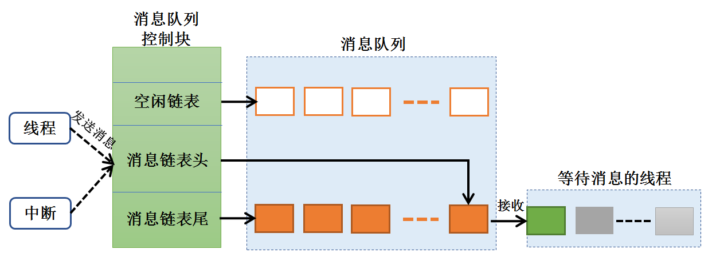
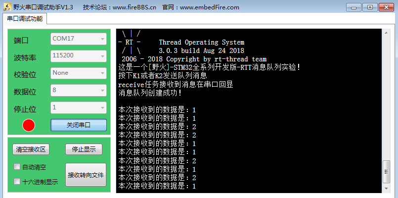

.. vim: syntax=rst

消息队列
=====

同学们，回想一下，在我们裸机的编程中，我们是怎么样用全局的一个数组的呢？

消息队列的基本概念
~~~~~~~~~

队列又称消息队列，是一种常用于线程间通信的数据结构，队列可以在线程与线程间、中断和线程间传送信息，实现了线程接收来自其他线程或中断的不固定长度的消息，并根据不同的接口选择传递消息是否存放在线程自己的空间。线程能够从队列里面读取消息，当队列中的消息是空时，挂起读取线程，用户还可以指定挂起的线程时间ti
meout；当队列中有新消息时，挂起的读取线程被唤醒并处理新消息，消息队列是一种异步的通信方式。

通过消息队列服务，线程或中断服务例程可以将一条或多条消息放入消息队列中。同样，一个或多个线程可以从消息队列中获得消息。当有多个消息发送到消息队列时，通常是将先进入消息队列的消息先传给线程，也就是说，线程先得到的是最先进入消息队列的消息，即先进先出原则(FIFO)。同时RT-
Thread中的消息队列支持优先级，也就是说在所有等待消息的线程中优先级最高的会先获得消息。

用户在处理业务时，消息队列提供了异步处理机制，允许将一个消息放入队列，但并不立即处理它，同时队列还能起到缓冲消息作用。

RT-Thread中使用队列数据结构实现线程异步通信工作，具有如下特性：

-  消息支持先进先出方式排队与优先级排队方式，支持异步读写工作方式。

-  读队列支持超时机制。

-  支持发送紧急消息，这里的紧急消息是往队列头发送消息。

-  可以允许不同长度（不超过队列节点最大值）的任意类型消息。

-  一个线程能够从任意一个消息队列接收和发送消息。

-  多个线程能够从同一个消息队列接收和发送消息。

-  当队列使用结束后，需要通过删除队列操作释放内存函数回收。

消息队列的运作机制
~~~~~~~~~

创建消息队列时先创建一个消息队列对象控制块，然后给消息队列分配一块内存空间，组织成空闲消息链表，这块内存的大小等于[消息大小+消息头（用于链表连接）]与消息队列容量的乘积，接着再初始化消息队列，此时消息队列为空。

RT-Thread操作系统的消息队列对象由多个元素组成，当消息队列被创建时，它就被分配了消息队列控制块：消息队列名称、内存缓冲区、消息大小以及队列长度等。同时每个消息队列对象中包含着多个消息框，每个消息框可以存放一条消息；消息队列中的第一个和最后一个消息框被分别称为消息链表头和消息链表尾，对应于消息
队列控制块中的msg_queue_head和msg_queue_tail；有些消息框可能是空的，它们通过msg_queue_free形成一个空闲消息框链表。所有消息队列中的消息框总数即是消息队列的长度，这个长度可在消息队列创建时指定。

线程或者中断服务程序都可以给消息队列发送消息。当发送消息时，消息队列对象先从空闲消息链表上取下一个空闲消息块，把线程或者中断服务程序发送的消息内容复制到消息块上，然后把该消息块挂到消息队列的尾部。当且仅当空闲消息链表上有可用的空闲消息块时，发送者才能成功发送消息；当空闲消息链表上无可用消息块，说明消
息队列已满，此时，发送消息的的线程或者中断程序会收到一个错误码（-RT_EFULL）。

发送紧急消息的过程与发送消息几乎一样，唯一的不同是，当发送紧急消息时，从空闲消息链表上取下来的消息块不是挂到消息队列的队尾，而是挂到队首，这样，接收者就能够优先接收到紧急消息，从而及时进行消息处理。

读取消息时，根据msg_queue_head找到最先入队列中的消息节点进行读取。根据消息队列控制块中的entry判断队列是否有消息读取，对全部空闲（entry为0）队列进行读消息操作会引起线程挂起。

当消息队列不再被使用时，应该删除它以释放系统资源，一旦操作完成，消息队列将被永久性的删除。

队列的运作过程具体见图 18‑1。

图 18‑1队列读写数据操作示意图

消息队列的阻塞机制
~~~~~~~~~

我们使用的消息队列一般不是属于某个线程的队列，在很多时候，我们创建的队列，是每个线程都可以去对他进行读写操作的，但是为了保护每个线程对它进行读写操作的过程，我们必须要有阻塞机制，在某个线程对它读写操作的时候，必须保证该线程能正常完成读写操作，而不受后来的线程干扰，凡事都有先来后到嘛！

那么，如何实现这个先来后到的机制呢，很简单，因为RT-Thread已经为我们做好了，我们直接使用就好了，每个对消息队列读写的函数，都有这种机制，我称之为阻塞机制。假设有一个线程A对某个队列进行读操作的时候（也就是我们所说的出队），发现它没有消息，那么此时线程A有3个选择：第一个选择，线程A扭头就走，
既然队列没有消息，那我也不等了，干其它事情去，这样子线程A不会进入阻塞态；第二个选择，线程A还是在这里等等吧，可能过一会队列就有消息，此时线程A会进入阻塞状态，在等待着消息的道来，而线程A的等待时间就由我们自己定义，比如设置1000个tick的等待，在这1000个tick到来之前线程A都是处于阻塞态
，当阻塞的这段时间线程A等到了队列的消息，那么线程A就会从阻塞态变成就绪态，如果此时线程A比当前运行的线程优先级还高，那么，线程A就会得到消息并且运行；假如1000个tick都过去了，队列还没消息，那线程A就不等了，从阻塞态中唤醒，返回一个没等到消息的错误代码，然后继续执行线程A的其他代码；第三个选
择，线程A死等，不等到消息就不走了，这样子线程A就会进入阻塞态，直到完成读取队列的消息。

而在发送消息操作的时候，为了保护数据，当且仅当空闲消息链表上有可用的空闲消息块时，发送者才能成功发送消息；当空闲消息链表上无可用消息块，说明消息队列已满，此时，发送消息的的线程或者中断程序会收到一个错误码（-RT_EFULL），发送消息并不带有阻塞机制的，因为发送消息的环境可能是在中断中，不允许有阻
塞的情况。

消息队列的应用场景
~~~~~~~~~

消息队列可以应用于发送不定长消息的场合，包括线程与线程间的消息交换，以及在中断服务函数中给线程发送消息（中断服务例程不可能接收消息）。

消息队列控制块
~~~~~~~

消息队列控制块包含了每个消息队列的信息，如消息队列名称、内存缓冲区、消息大小以及队列长度等，是很重要的一个内核对象控制块，具体见代码清单 18‑1。

.. code-block:: c
    :caption: 代码清单 18‑1消息队列控制块
    :linenos:

    struct rt_messagequeue {
        struct rt_ipc_object parent;                   (1)    

        void                *msg_pool;                 (2)   

        rt_uint16_t          msg_size;                 (3)    
        rt_uint16_t          max_msgs;                 (4)    

        rt_uint16_t          entry;                    (5)    

        void                *msg_queue_head;           (6)    
        void                *msg_queue_tail;           (7)     
        void                *msg_queue_free;           (8)   
    };
    typedef struct rt_messagequeue *rt_mq_t;

代码清单 18‑1\ **(1)**\ ：消息队列属于内核对象，会在自身结构体里面包含一个内核对象类型的成员，通过这个成员可以将消息队列挂到系统对象容器里面。

代码清单 18‑1\ **(2)**\ ：存放消息的消息池开始地址。

代码清单 18‑1\ **(3)**\ ：每条消息大小，消息队列中也就是节点的大小，单位为字节。

代码清单 18‑1\ **(4)**\ ：能够容纳的最大消息数量。

代码清单 18‑1\ **(5)**\ ：队列中的消息索引，记录消息队列的消息个数。

代码清单 18‑1\ **(6)**\ ：链表头指针，指向即将读取数据的节点。

代码清单 18‑1\ **(7)**\ ：链表尾指针，指向允许写入数据的节点

代码清单 18‑1\ **(8)**\ ：指向队列的空闲节点的指针。

常用消息队列的函数讲解
~~~~~~~~~~~

使用队列模块的典型流程如下：

-  创建消息队列rt_mq_create。

-  写队列操作函数rt_mq_send。

-  读队列操作函数rt_mq_recv。

-  删除队列rt_mq_delete。

消息队列创建函数rt_mq_create()
^^^^^^^^^^^^^^^^^^^^^^

消息队列创建函数，顾名思义，就是创建一个队列，与线程一样，都是需要先创建才能使用的东西，RT-Thread肯定不知道我们需要什么样的队列，所以，我们需要怎么样的队列我们就自己创建就行了，比如队列的长度，队列句柄，节点的大小这些信息都是我们自己定义的，RT-
Thread提供给我们这个创建函数，爱怎么搞都是我们自己来自定义的，创建队列的函数源码具体见代码清单 18‑2。

.. code-block:: c
    :caption: 代码清单 18‑2消息队列创建函数rt_mq_create()源码
    :linenos:

    rt_mq_t rt_mq_create(const char *name,
                        rt_size_t   msg_size,
                        rt_size_t   max_msgs,
                        rt_uint8_t  flag)
    {
        struct rt_messagequeue *mq;
        struct rt_mq_message *head;
        register rt_base_t temp;

        RT_DEBUG_NOT_IN_INTERRUPT;

        /* 分配消息队列对象 */				    	(1)
        mq = (rt_mq_t)rt_object_allocate(RT_Object_Class_MessageQueue, name);
        if (mq == RT_NULL)								
            return mq;

        /* 设置parent */
        mq->parent.parent.flag = flag;				(2)

        /* 初始化消息队列内核对象 */
        rt_ipc_object_init(&(mq->parent));			(3)

        /* 初始化消息队列 */

        /* 获得正确的消息队列大小 */
        mq->msg_size = RT_ALIGN(msg_size, RT_ALIGN_SIZE);	(4)
        mq->max_msgs = max_msgs;

        /* 分配消息内存池 */
        mq->msg_pool = RT_KERNEL_MALLOC((mq->msg_size +
                                sizeof(struct rt_mq_message)) * mq->max_msgs);
        if (mq->msg_pool == RT_NULL) {				(5)
            rt_mq_delete(mq);

            return RT_NULL;
        }

        /* 初始化消息队列头尾链表 */
        mq->msg_queue_head = RT_NULL;				(6)
        mq->msg_queue_tail = RT_NULL;

        /* 初始化消息队列空闲链表 */
        mq->msg_queue_free = RT_NULL;
        for (temp = 0; temp < mq->max_msgs; temp ++) {		(7)
            head = (struct rt_mq_message *)((rt_uint8_t *)mq->msg_pool +
                temp * (mq->msg_size + sizeof(struct rt_mq_message)));
            head->next = mq->msg_queue_free;
            mq->msg_queue_free = head;
        }

        /* 消息队列的个数为0（清零）*/
        mq->entry = 0;						(8)

        return mq;
    }
    RTM_EXPORT(rt_mq_create);

代码清单 18‑2\ **(1)**\ ：分配消息队列对象，调用rt_object_allocate此函数将从对象系统分配对象，为创建的消息队列分配一个消息队列的对象，并且命名对象名称， 在系统中，对象的名称必须是唯一的。

代码清单 18‑2\ **(2)**\ ：设置消息队列的阻塞唤醒模式，创建的消息队列由于指定的flag不同，而有不同的意义： 使用RT_IPC_FLAG_PRIO优先级flag创建的IPC对象，在多个线程等待消息队列资源时，将由优先级高的线程优先获得资源。而使用RT_IPC_FLAG_FIFO先进先
出flag创建的IPC对象，在多个线程等待消息队列资源时，将按照先来先得的顺序获得资源。RT_IPC_FLAG_PRIO与RT_IPC_FLAG_FIFO均在rtdef.h中有定义。

代码清单 18‑2\ **(3)**\ ：初始化消息队列内核对象。此处会初始化一个链表，用于记录访问此队列而阻塞的线程，通过这个链表，可以找到对应的阻塞线程的控制块，从而能恢复线程。

代码清单 18‑2\ **(4)**\ ：设置消息队列的节点大小与消息队列的最大容量，节点大小要按RT_ALIGN_SIZE字节对齐，消息队列的容量由用户自己定义。

代码清单 18‑2\ **(5)**\ ：给此消息队列分配内存。这块内存的大小为[消息大小+消息头大小]与消息队列容量的乘积，每个消息节点中都有一个消息头，用于链表链接，指向下一个消息节点，作为消息的排序。

代码清单 18‑2\ **(6)**\ ：初始化消息队列头尾链表。

代码清单 18‑2\ **(7)**\ ：将所有的消息队列的节点连接起来，形成空闲链表。

代码清单 18‑2\ **(8)**\ ：消息队列的个数为0（清零）。

在创建消息队列的时候，是需要用户自己定义消息队列的句柄的，但是注意了，定义了队列的句柄并不等于创建了队列，创建队列必须是调用rt_mq_create()函数进行创建，否则，以后根据队列句柄使用队列的其它函数的时候会发生错误，在创建队列的时候是会返回创建的情况的，如果创建成功则返回消息队列句柄，如果是
返回RT_NULL，则表示失败，消息队列创建函数rt_mq_create()使用实例具体见代码清单 18‑3高亮部分。

.. code-block:: c
    :caption: 代码清单 18‑3消息队列创建函数rt_mq_create()实例
    :emphasize-lines: 1-5
    :linenos:

    /* 创建一个消息队列 */
    test_mq = rt_mq_create("test_mq",	/* 消息队列名字 */
                        40,     	/* 消息的最大长度 */
                        20,    		/* 消息队列的最大容量 */
                        RT_IPC_FLAG_FIFO);/* 队列模式 FIFO(0x00)*/
    if (test_mq != RT_NULL)
        rt_kprintf("消息队列创建成功！\n\n");

消息队列删除函数rt_mq_delete()
^^^^^^^^^^^^^^^^^^^^^^

队列删除函数是根据消息队列句柄直接删除的，删除之后这个消息队列的所有信息都会被系统回收清空，而且不能再次使用这个消息队列了，但是需要注意的是，如果某个消息队列没有被创建，那也是无法被删除的，动脑子想想都知道，没创建的东西就不存在，怎么可能被删除。删除消息队列的时候会把所有由于访问此消息队列而进入阻塞
态的线程都从阻塞链表中删除，mq是rt_mq_delete传入的参数，是消息队列句柄，表示的是要删除哪个想队列，其函数源码具体见代码清单 18‑4。

.. code-block:: c
    :caption: 代码清单 18‑4消息队列删除函数rt_mq_delete()源码
    :linenos:

    rt_err_t rt_mq_delete(rt_mq_t mq)
    {
        RT_DEBUG_NOT_IN_INTERRUPT;

        /* 检查消息队列 */
        RT_ASSERT(mq != RT_NULL);				(1)

        /* 恢复所有因为访问此队列而阻塞的线程 */
        rt_ipc_list_resume_all(&(mq->parent.suspend_thread)); (2)

    #if defined(RT_USING_MODULE) && defined(RT_USING_SLAB)
        /*  消息队列对象属于应用程序模块 ，此处不使用 */
        if (mq->parent.parent.flag & RT_OBJECT_FLAG_MODULE)
            rt_module_free(mq->parent.parent.module_id, mq->msg_pool);
        else
    #endif

            /* 释放消息队列内存 */
            RT_KERNEL_FREE(mq->msg_pool);			(3)

        /* 删除消息队列对象 */
        rt_object_delete(&(mq->parent.parent));		(4)

        return RT_EOK;
    }

代码清单 18‑4\ **(1)**\ ：检测消息队列是否被创建了，如果是则可以进行删除操作。

代码清单 18‑4\ **(2)**\
：调用rt_ipc_list_resume_all()函数将所有因为访问此队列的而阻塞的线程从阻塞态中恢复过来，线程得到队列返回的错误代码。在实际情况一般不这样子使用，在删除的时候，应先确认所有的线程都无需再次访问此队列，并且此时没有线程被此队列阻塞，才进行删除操作。

代码清单 18‑4\ **(3)**\ ：删除了消息队列，那肯定要把消息队列的内存释放出来，毕竟嵌入式设备的内存是很珍贵的。

代码清单 18‑4\ **(4)**\ ：删除消息队列对象并且释放消息队列内核对象的内存，释放内核对象内存在rt_object_delete()函数中实现。

消息队列删除函数rt_mq_delete()的使用也是很简单的，只需传入要删除的消息队列的句柄即可，调用这个函数时，系统将删除这个消息队列。如果删除该消息队列时，有线程正在等待消息，那么删除操作会先唤醒等待在消息队列量上的线程（等待线程的返回值是-RT_ERROR），具体见代码清单
18‑5高亮部分。

.. code-block:: c
    :caption: 代码清单 18‑5消息队列删除函数rt_mq_delete()实例
    :emphasize-lines: 6-8
    :linenos:

    /* 定义消息队列控制块 */
    static rt_mq_t test_mq = RT_NULL;

    rt_err_t uwRet = RT_EOK;

    uwRet = rt_mq_delete(test_mq);
    if (RT_EOK == uwRet)
        rt_kprintf("消息队列删除成功！\n\n");

消息队列发送消息函数rt_mq_send()
^^^^^^^^^^^^^^^^^^^^^^

线程或者中断服务程序都可以给消息队列发送消息。当发送消息时，消息队列对象先从空闲消息链表上取下一个空闲消息块，把线程或者中断服务程序发送的消息内容复制到消息块上，然后把该消息块挂到消息队列的尾部。当且仅当空闲消息链表上有可用的空闲消息块时，发送者才能成功发送消息；当空闲消息链表上无可用消息块，说明消
息队列已满，此时，发送消息的的线程或者中断程序会收到一个错误码（-RT_EFULL），消息队列发送消息函数rt_mq_send()源码具体见代码清单 18‑6。

.. code-block:: c
    :caption: 代码清单 18‑6消息队列发送消息函数rt_mq_send()源码
    :linenos:

    rt_err_t rt_mq_send(rt_mq_t mq, void *buffer, rt_size_t size)	(1)
    {
        register rt_ubase_t temp;
        struct rt_mq_message *msg;

        RT_ASSERT(mq != RT_NULL);					(2)
        RT_ASSERT(buffer != RT_NULL);
        RT_ASSERT(size != 0);

        /* 判断消息的大小*/	
        if (size > mq->msg_size)					(3)
            return -RT_ERROR;

        RT_OBJECT_HOOK_CALL(rt_object_put_hook, (&(mq->parent.parent))); 

        /* 关中断 */
        temp = rt_hw_interrupt_disable();				

        /* 获取一个空闲链表，必须有一个空闲链表项*/
        msg = (struct rt_mq_message *)mq->msg_queue_free;		(4)	
        /* 消息队列满 */
        if (msg == RT_NULL) {
            /* 开中断 */
            rt_hw_interrupt_enable(temp);

            return -RT_EFULL;
        }
        /* 移动空闲链表指针 */
        mq->msg_queue_free = msg->next;				(5)

        /* 开中断 */
        rt_hw_interrupt_enable(temp);

        /* 这个消息是新的链表尾部，其下一个指针为RT_NULL /
        msg->next = RT_NULL; 
        /* 拷贝数据 */
        rt_memcpy(msg + 1, buffer, size);				(6)

        /* 关中断 */
        temp = rt_hw_interrupt_disable();
        /* 将消息挂载到消息队列尾部 */
        if (mq->msg_queue_tail != RT_NULL) {			(7)
            /* 如果已经存在消息队列尾部链表 */
            ((struct rt_mq_message *)mq->msg_queue_tail)->next = msg;
        }

        /* 设置新的消息队列尾部链表指针 */
        mq->msg_queue_tail = msg;					(8)
        /*  如果头部链表是空的，设置头部链表指针 */
        if (mq->msg_queue_head == RT_NULL)				(9)
            mq->msg_queue_head = msg;

        /* 增加消息数量记录 */
        mq->entry ++;						(10)
                        
        /* 恢复挂起线程 */
        if (!rt_list_isempty(&mq->parent.suspend_thread)) {		(11)
            rt_ipc_list_resume(&(mq->parent.suspend_thread));

            /* 开中断 */
            rt_hw_interrupt_enable(temp);

            rt_schedule();						(12)
        
            return RT_EOK;
        }

        /* 开中断 */
        rt_hw_interrupt_enable(temp);

        return RT_EOK;
    }
    RTM_EXPORT(rt_mq_send);

代码清单 18‑6\ **(1)**\ ：在发送消息的时候需要传递一些参数：rt_mq_t mq是已经创建的消息队列句柄；void \*buffer是即将发送消息的存储地址；rt_size_t size是即将发送消息的大小。

代码清单 18‑6\ **(2)**\ ：检测传递进来的参数，如果这些参数之中有一个是无效的，都无法发送消息。

代码清单 18‑6\ **(3)**\ ：判断消息的大小，其大小不能超过创建时候设置的消息队列的大小mq->msg_size，用户可以自定义大小的，如果mq->msg_size不够，可以在创建时候设置大一些。

代码清单 18‑6\ **(4)**\ ：获取一个空闲链表指针，必须有一个空闲链表节点用于存放要发送的消息。如果消息队列已经满了，则无法发送消息。

代码清单 18‑6\ **(5)**\ ：移动空闲链表指针。

代码清单 18‑6\ **(6)**\ ：拷贝数据，将即将发送的数据拷贝到空闲链表的节点中，因为空闲节点有消息头，所以其真正存放消息的地址是msg + 1。

代码清单 18‑6\ **(7)**\ ：将空闲队列的消息挂载到消息队列尾部，如果此时消息队列已经有消息，也就是尾部链表不为空，那么就直接将发送的消息挂载到尾部链表后面。

代码清单 18‑6\ **(8)**\ ：重置消息队列尾链表指针，指向当前发送的消息，无论当前消息队列中尾链表是否有消息，都需要重置尾链表指针的指向。

代码清单 18‑6\ **(9)**\ ：如果连头链表是空的，就需要设置头部链表指针指向当前要发送的消息，也就是指向消息自身。

代码清单 18‑6\ **(10)**\ ：记录当前消息队列的消息个数，自加1。

代码清单 18‑6\ **(11)**\ ：恢复挂起线程。如果当前有线程因为访问队列而进入阻塞，现在有消息了则可以将该线程从阻塞中恢复。

代码清单 18‑6\ **(12)**\ ：发起一次线程调度。

发送消息时，发送者需指定发送到的消息队列的对象句柄（即指向消息队列控制块的指针），并且指定发送的消息内容以及消息大小，在发送一个普通消息之后，空闲消息链表上的消息被转移到了消息队列尾链表上，消息队列发送消息函数rt_mq_send()的实例具体见代码清单 18‑7高亮部分。

.. code-block:: c
    :caption: 代码清单 18‑7消息队列发送消息函数rt_mq_send()实例
    :emphasize-lines: 8-11,17-20
    :linenos:

    static void send_thread_entry(void* parameter)
    {
        rt_err_t uwRet = RT_EOK;
        uint32_t send_data1 = 1;
        uint32_t send_data2 = 2;
        while (1) {/* K1 被按下 */
            if ( Key_Scan(KEY1_GPIO_PORT,KEY1_GPIO_PIN) == KEY_ON ) { 
                /* 将数据写入（发送）到队列中，等待时间为 0  */
                uwRet = rt_mq_send(test_mq,	/* 写入（发送）队列的ID(句柄) */
                                &send_data1, /* 写入（发送）的数据 */
                                sizeof(send_data1)); /* 数据的长度 */
                if (RT_EOK != uwRet) {
                    rt_kprintf("数据不能发送到消息队列！错误代码: %lx\n",uwRet);
                }
            }/* K1 被按下 */
            if ( Key_Scan(KEY2_GPIO_PORT,KEY2_GPIO_PIN) == KEY_ON ) { 
                /* 将数据写入（发送）到队列中，等待时间为 0  */
                uwRet = rt_mq_send(test_mq,	/* 写入（发送）队列的ID(句柄) */
                                    &send_data2, /* 写入（发送）的数据 */
                                    sizeof(send_data2)); /* 数据的长度 */
                if (RT_EOK != uwRet) {
                    rt_kprintf("数据不能发送到消息队列！错误代码: %lx\n",uwRet);
                }
            }
            rt_thread_delay(20);
        }
    }

消息队列接收消息函数rt_mq_recv()
^^^^^^^^^^^^^^^^^^^^^^

当消息队列中有消息时，接收线程才能接收到消息，接收消息是有阻塞机制的，用户可以自定义等待时间，RT-Thread的接收消息过程是：接收一个消息后消息队列的头链表消息被转移到了空闲消息链表中，其源码实现具体见代码清单 18‑8。

.. code-block:: c
    :caption: 代码清单 18‑8消息队列接收消息函数rt_mq_recv()源码
    :linenos:

    rt_err_t rt_mq_recv(rt_mq_t    mq,				(1)
                        void      *buffer,				(2)
                        rt_size_t  size,				(3)
                        rt_int32_t timeout)				(4)
    {
        struct rt_thread *thread;
        register rt_ubase_t temp;
        struct rt_mq_message *msg;
        rt_uint32_t tick_delta;

        RT_ASSERT(mq != RT_NULL);
        RT_ASSERT(buffer != RT_NULL);
        RT_ASSERT(size != 0);					(5)

        
        tick_delta = 0;
        /* 获取当前的线程 */
        thread = rt_thread_self();					(6)
        RT_OBJECT_HOOK_CALL(rt_object_trytake_hook, (&(mq->parent.parent)));

        /* 关中断 */
        temp = rt_hw_interrupt_disable();

        /* 非阻塞情况 */
        if (mq->entry == 0 && timeout == 0) {			(7)
            rt_hw_interrupt_enable(temp);

            return -RT_ETIMEOUT;
        }

        /* 消息队列为空 */
        while (mq->entry == 0) {					(8)
            RT_DEBUG_IN_THREAD_CONTEXT;

            /* 重置线程中的错误号 */
            thread->error = RT_EOK;				(9)

            /* 不等待 */
            if (timeout == 0) {					
                /* 开中断 */
                rt_hw_interrupt_enable(temp);

                thread->error = -RT_ETIMEOUT;

                return -RT_ETIMEOUT;
            }

            /* 挂起当前线程 */
            rt_ipc_list_suspend(&(mq->parent.suspend_thread),	(10)
                                thread,
                                mq->parent.parent.flag);

            /* 有等待时间，启动线程计时器 */
            if (timeout > 0) {					(11)
                /* 获取systick定时器时间 */
                tick_delta = rt_tick_get();

                RT_DEBUG_LOG(RT_DEBUG_IPC, ("set thread:%s to timer list\n",
                                            thread->name));

                /* 重置线程计时器的超时并启动它 */
                rt_timer_control(&(thread->thread_timer),		(12)
                                RT_TIMER_CTRL_SET_TIME,
                                &timeout);
                rt_timer_start(&(thread->thread_timer));
            }

            /* 开中断 */
            rt_hw_interrupt_enable(temp);

            /* 发起线程调度 */
            rt_schedule();						(13)

            
            if (thread->error != RT_EOK) {
                /* 返回错误 */
                return thread->error;
            }

            /* 关中断 */
            temp = rt_hw_interrupt_disable();

            /* 如果它不是永远等待，然后重新计算超时滴答 */
            if (timeout > 0) {					
                tick_delta = rt_tick_get() - tick_delta;
                timeout -= tick_delta;
                if (timeout < 0)
                    timeout = 0;
            }
        }

        /* 获取消息 */
        msg = (struct rt_mq_message *)mq->msg_queue_head;		(14)

        /* 移动消息队列头链表指针 */
        mq->msg_queue_head = msg->next;				(15)
        /* 到达队列尾部，设置为NULL  */
        if (mq->msg_queue_tail == msg)				(16)
            mq->msg_queue_tail = RT_NULL;
    
        /* 记录消息个数，自减一 */	
        mq->entry --;						(17)
        
        /* 开中断 */
        rt_hw_interrupt_enable(temp);
    
        /* 拷贝消息到指定存储地址 */
        rt_memcpy(buffer, msg + 1, size > mq->msg_size ? mq->msg_size : size); (18)
    
        /* 关中断 */
        temp = rt_hw_interrupt_disable();
        /*移到空闲链表 */
        msg->next = (struct rt_mq_message *)mq->msg_queue_free;	(19)
        mq->msg_queue_free = msg;
        /* 开中断 */
        rt_hw_interrupt_enable(temp);
    
        RT_OBJECT_HOOK_CALL(rt_object_take_hook, (&(mq->parent.parent)));
    
        return RT_EOK;
    }
    RTM_EXPORT(rt_mq_recv);

代码清单 18‑8\ **(1)**\ ：消息队列对象的句柄。

代码清单 18‑8\ **(2)**\ ：buffer是用于接收消息的数据存储地址，必须在接收之前就定义了，确保地址有效。

代码清单 18‑8\ **(3)**\ ：消息大小。

代码清单 18‑8\ **(4)**\ ：指定超时时间。

代码清单 18‑8\ **(5)**\ ：检测传递进来的参数是否有效，有效才进行消息队列的数据读取。

代码清单 18‑8\ **(6)**\ ：获取当前运行的线程。

代码清单 18‑8\ **(7)**\ ：如果当前消息队列中没有消息并且设置了不等待，则立即返回错误代码。

代码清单 18‑8\ **(8)**\ ：如果消息队列为空，但是用户设置了等待时间，则进入循环中。

代码清单 18‑8\ **(9)**\ ：重置线程中的错误码。

代码清单 18‑8\ **(10)**\ ：挂起当前线程，因为当前线程是由于消息队列为空，并且用户设置了超时时间，直接将当前线程挂起，进入阻塞状态。

代码清单 18‑8\ **(11)**\ ：用户有设置等待时间，需要启动线程计时器，并且调用rt_tick_get()函数获取当前系统systick时间。

代码清单 18‑8\ **(12)**\ ：重置线程计时器的超时并启动它，调用rt_timer_control()函数改变当前线程阻塞时间，阻塞的时间根据用户自定义的timeout设置，并且调用rt_timer_start()函数开始定时。

代码清单 18‑8\ **(13)**\ ：发起一次线程调度。当前线程都已经挂起了，需要进行线程切换。

代码清单 18‑8\ **(14)**\ ：如果当前消息队列中有消息，那么获取消息队列的线程可以直接从消息队列的msg_queue_head链表获取到消息，并不会进入阻塞态中。

代码清单 18‑8\ **(15)**\ ：移动消息队列头链表指针。重置消息队列的msg_queue_head指向当前消息的下一个消息。因为当前的消息被取走了，下一个消息才是可获取的有效消息。

代码清单 18‑8\ **(16)**\ ：如果到达队列尾部，则将消息队列的msg_queue_tail设置为NULL。

代码清单 18‑8\ **(17)**\ ：记录当前消息队列中消息的个数，entry减一，消息就是获取了一个就少一个。

代码清单 18‑8\ **(18)**\ ：拷贝消息到指定存储地址buffer，拷贝消息的大小为size，其大小最大不能超过创建消息队列时候已经定义的消息大小msg_size。

代码清单 18‑8\ **(19)**\ ：获取一个消息后，消息队列上的头链表消息被转移到空闲消息链表中，相当消息的删除操作，这样子可以保证消息队列的循环利用，而不会导致头链表指针移动到队列尾部时没有可用的消息节点。

根据这些函数源码，我们能很轻松对它进行使用操作，下面让我们来进行队列接收操作吧，这个函数用于读取指定队列中的数据，并将获取的数据存储到buffer指定的地址。要读取的数据的地址和大小为size，由用户定义，具体使用实例见代码清单 18‑9高亮部分。

.. code-block:: c
    :caption: 代码清单 18‑9消息队列接收消息函数rt_mq_recv()实例
    :emphasize-lines: 2-5
    :linenos:

    /* 队列读取（接收），等待时间为一直等待 */
    uwRet = rt_mq_recv(test_mq,	/* 读取（接收）队列的ID(句柄) */
                    &r_queue,	/* 读取（接收）的数据保存位置 */
                    sizeof(r_queue), /* 读取（接收）的数据的长度 */
                    RT_WAITING_FOREVER); /* 等待时间：一直等 */
    if (RT_EOK == uwRet)
    {
        rt_kprintf("本次接收到的数据是：%d\n",r_queue);
    } else
    {
        rt_kprintf("数据接收出错,错误代码: 0x%lx\n",uwRet);
    }

消息队列使用注意事项
~~~~~~~~~~

在使用RT-Thread提供的消息队列函数的时候，需要了解以下几点：

1. 使用rt_mq_recv()、rt_mq_send()、rt_mq_delete()等这些函数之前应先创建需消息队列，并根据队列句柄进行操作。

2. 队列读取采用的是先进先出（FIFO）模式，会首先读取出首先存储在队列中的数据。当然也有例外，RT-Thread给我们提供了另一个函数，可以发送紧急消息的，那么读取的时候就会读取到紧急消息的数据。

3. 必须要我们定义一个存储读取出来的数据的地方，并且把存储数据的起始地址传递给 rt_mq_recv()函数，否则，将发生地址非法的错误。

4. 接收消息队列中的消息是拷贝的方式，读取消息时候定义的地址必须保证能存放下即将读取消息的大小。

消息队列实验
~~~~~~

消息队列实验是在RT-Thread中创建了两个线程，一个是发送消息线程，一个是获取消息线程，两个线程独立运行，发送消息线程是通过检测按键的按下情况来发送消息，假如发送消息不成功，就把返回的错误情代码在串口打印出来，另一个线程是获取消息线程，在消息队列没有消息之前一直等待消息，一旦获取到消息就把消息打
印在串口调试助手里，具体见代码清单 18‑10高亮部分。

注意：在使用消息队列时候请确保在rtconfig.h中打开RT_USING_MESSAGEQUEUE这个宏定义。

.. code-block:: c
    :caption: 代码清单 18‑10消息队列实验
    :emphasize-lines: 34-35,65-70,107-153
    :linenos:

    /**
    *********************************************************************
    * @file    main.c
    * @author  fire
    * @version V1.0
    * @date    2018-xx-xx
    * @brief   RT-Thread 3.0 + STM32 消息队列
    *********************************************************************
    * @attention
    *
    * 实验平台:基于野火STM32全系列（M3/4/7）开发板
    * 论坛    :http://www.firebbs.cn
    * 淘宝    :https://fire-stm32.taobao.com
    *
    **********************************************************************
    */

    /*
    *************************************************************************
    *                             包含的头文件
    *************************************************************************
    */
    #include "board.h"
    #include "rtthread.h"

    /*
    *************************************************************************
    *                               变量
    *************************************************************************
    */
    /* 定义线程控制块 */
    static rt_thread_t receive_thread = RT_NULL;
    static rt_thread_t send_thread = RT_NULL;
    /* 定义消息队列控制块 */
    static rt_mq_t test_mq = RT_NULL;
    /*
    *************************************************************************
    *                             函数声明
    *************************************************************************
    */
    static void receive_thread_entry(void* parameter);
    static void send_thread_entry(void* parameter);

    /*
    *************************************************************************
    *                             main 函数
    *************************************************************************
    */
    /**
    * @brief  主函数
    * @param  无
    * @retval 无
    */
    int main(void)
    {
        /*
        * 开发板硬件初始化，RTT系统初始化已经在main函数之前完成，
        * 即在component.c文件中的rtthread_startup()函数中完成了。
        * 所以在main函数中，只需要创建线程和启动线程即可。
        */
        rt_kprintf("这是一个[野火]-STM32全系列开发板RTT消息队列实验！\n");
        rt_kprintf("按下K1或者K2发送队列消息\n");
        rt_kprintf("receive线程接收到消息在串口回显\n");
        /* 创建一个消息队列 */
        test_mq = rt_mq_create("test_mq",/* 消息队列名字 */
                            40,     /* 消息的最大长度 */
                            20,    /* 消息队列的最大容量 */
                            RT_IPC_FLAG_FIFO);/* 队列模式 FIFO(0x00)*/
        if (test_mq != RT_NULL)
            rt_kprintf("消息队列创建成功！\n\n");

        receive_thread =                          /* 线程控制块指针 */
            rt_thread_create( "receive",              /* 线程名字 */
                            receive_thread_entry,   /* 线程入口函数 */
                            RT_NULL,             /* 线程入口函数参数 */
                            512,                 /* 线程栈大小 */
                            3,                   /* 线程的优先级 */
                            20);                 /* 线程时间片 */

        /* 启动线程，开启调度 */
        if (receive_thread != RT_NULL)
            rt_thread_startup(receive_thread);
        else
            return -1;

        send_thread =                          /* 线程控制块指针 */
            rt_thread_create( "send",              /* 线程名字 */
                            send_thread_entry,   /* 线程入口函数 */
                            RT_NULL,             /* 线程入口函数参数 */
                            512,                 /* 线程栈大小 */
                            2,                   /* 线程的优先级 */
                            20);                 /* 线程时间片 */

        /* 启动线程，开启调度 */
        if (send_thread != RT_NULL)
            rt_thread_startup(send_thread);
        else
            return -1;
    }
    
    /*
    ****************************************************************
    *                             线程定义
    *****************************************************************
    */
    
    static void receive_thread_entry(void* parameter)
    {
        rt_err_t uwRet = RT_EOK;
        uint32_t r_queue;
        /* 线程都是一个无限循环，不能返回 */
        while (1) {
            /* 队列读取（接收），等待时间为一直等待 */
            uwRet = rt_mq_recv(test_mq,	/* 读取（接收）队列的ID(句柄) */
                                &r_queue,	/* 读取（接收）的数据保存位置 */
                                sizeof(r_queue), /* 读取（接收）的数据的长度 */
                                RT_WAITING_FOREVER); /* 等待时间：一直等 */
            if (RT_EOK == uwRet) {
                rt_kprintf("本次接收到的数据是：%d\n",r_queue);
            } else {
                rt_kprintf("数据接收出错,错误代码: 0x%lx\n",uwRet);
            }
            rt_thread_delay(200);
        }
    }
    
    static void send_thread_entry(void* parameter)
    {
        rt_err_t uwRet = RT_EOK;
        uint32_t send_data1 = 1;
        uint32_t send_data2 = 2;
        while (1) { /* K1 被按下 *
            if ( Key_Scan(KEY1_GPIO_PORT,KEY1_GPIO_PIN) == KEY_ON ) {/
                /* 将数据写入（发送）到队列中，等待时间为 0  */
                uwRet = rt_mq_send(test_mq,/* 写入（发送）队列的ID(句柄) */
                                &send_data1,/* 写入（发送）的数据 */
                                sizeof(send_data1)); /* 数据的长度 */
                if (RT_EOK != uwRet) {
                    rt_kprintf("数据不能发送到消息队列！错误代码: %lx\n",uwRet);
                }
            }/* K2 被按下 */
            if ( Key_Scan(KEY2_GPIO_PORT,KEY2_GPIO_PIN) == KEY_ON ) { 
                /* 将数据写入（发送）到队列中，等待时间为 0  */
                uwRet = rt_mq_send(test_mq,	/* 写入（发送）队列的ID(句柄) */
                                    &send_data2,	/* 写入（发送）的数据 */
                                    sizeof(send_data2));	/* 数据的长度 */
                if (RT_EOK != uwRet) {
                    rt_kprintf("数据不能发送到消息队列！错误代码: %lx\n",uwRet);
                }
            }
            rt_thread_delay(20);
        }
    }
    /***************************END OF FILE*************************/

实验现象
~~~~

将程序编译好，用USB线连接电脑和开发板的USB接口（对应丝印为USB转串口），用DAP仿真器把配套程序下载到野火STM32开发板（具体型号根据你买的板子而定，每个型号的板子都配套有对应的程序），在电脑上打开串口调试助手，然后复位开发板就可以在调试助手中看到rt_kprintf的打印信息，按下开发版
的K1按键发送消息1，按下K2按键发送消息2；我们按下K1试试，在串口调试助手中可以看到接收到消息1，我们按下K2试试，在串口调试助手中可以看到接收到消息2，具体见图 18‑2。

图 18‑2消息队列实验现象

