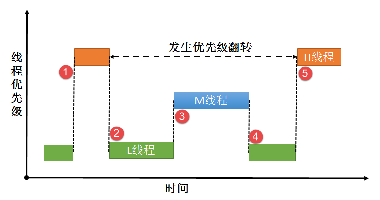
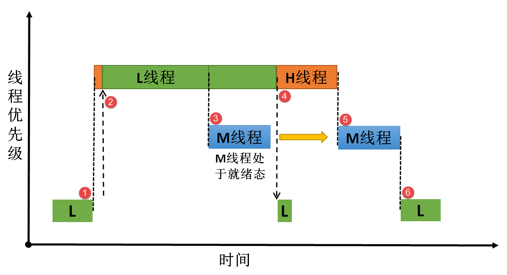
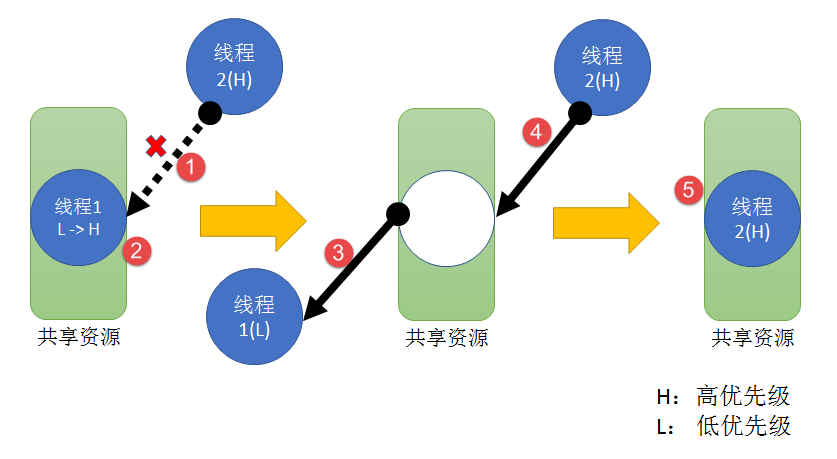
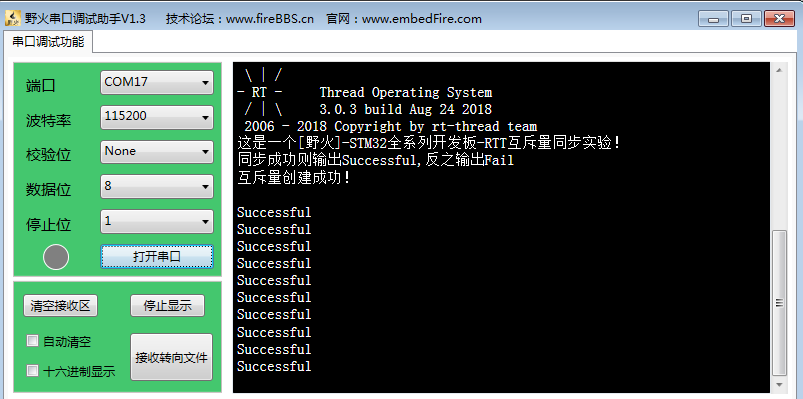

.. vim: syntax=rst

互斥量
---------------------

互斥量的基本概念
~~~~~~~~~~~~~~~~~~~~~

互斥量又称互斥型信号量，是一种特殊的二值信号量，它和信号量不同的是，它支持互斥量所有权、递归访问以及防止优先级翻转的特性，用于实现对临界资源的独占式处理。任意时刻互斥量的状态只有两种，开锁或闭锁。当互斥量被线程持有时，该互斥量处于闭锁状态，这个线程获得互斥量的所有权。当该线程释放这个互斥量时，该互斥
量处于开锁状态，线程失去该互斥量的所有权。当一个线程持有互斥量时，其他线程将不能再对该互斥量进行开锁或持有。持有该互斥量的线程也能够再次获得这个锁而不被挂起，这就是递归访问，这个特性与一般的二值信号量有很大的不同，在信号量中，由于已经不存在可用的信号量，线程递归获取信号量时会发生主动挂起（最终形成死
锁）。

如果想要用于实现同步（线程之间或者线程与中断之间），二值信号量或许是更好的选择，虽然互斥量也可以用于线程与线程、线程与中断的同步，但是互斥量更多的是用于保护资源的互锁。

用于互锁的互斥量可以充当保护资源的令牌。当一个线程希望访问某个资源时，它必须先获取令牌。当线程使用完资源后，必须还回令牌，以便其它线程可以访问该资源。是不是很熟悉，在我们的二值信号量里面也是一样的，用于保护临界资源，保证多线程的访问井然有序。当线程获取到信号量的时候才能开始使用被保护的资源，使用完就
释放信号量，下一个线程才能获取到信号量从而可用使用被保护的资源。但是信号量会导致的另一个潜在问题，那就是线程优先级翻转（具体会在下文讲解）。而RT-Thread提供的互斥量通过优先级继承算法，可用降低优先级翻转问题产生的影响，所以，用于临界资源的保护一般建议使用互斥量。

互斥量的优先级继承机制
~~~~~~~~~~~

在RT-Thread操作系统中为了降低优先级翻转问题利用了优先级继承算法。优先级继承算法是指，暂时提高某个占有某种资源的低优先级线程的优先级，使之与在所有等待该资源的线程中优先级最高那个线程的优先级相等，而当这个低优先级线程执行完毕释放该资源时，优先级重新回到初始设定值。因此，继承优先级的线程避免了
系统资源被任何中间优先级的线程抢占。

互斥量与二值信号量最大的不同是：互斥量具有优先级继承机制，而信号量没有。也就是说，某个临界资源受到一个互斥量保护，如果这个资源正在被一个低优先级线程使用，那么此时的互斥量是闭锁状态，也代表了没有线程能申请到这个互斥量，如果此时一个高优先级线程想要对这个资源进行访问，去申请这个互斥量，那么高优先级线程
会因为申请不到互斥量而进入阻塞态，那么系统会将现在持有该互斥量的线程的优先级临时提升到与高优先级线程的优先级相同，这个优先级提升的过程叫做优先级继承。这个优先级继承机制确保高优先级线程进入阻塞状态的时间尽可能短，以及将已经出现的“优先级翻转”危害降低到最小。

没有理解？没问题，结合过程示意图再说一遍。我们知道线程的优先级在创建的时候就已经是设置好的，高优先级的线程可以打断低优先级的线程，抢占CPU的使用权。但是在很多场合中，某些资源只有一个，当低优先级线程正在占用该资源的时候，即便高优先级线程也只能乖乖的等待低优先级线程使用完该资源后释放资源。这里高优先
级线程无法运行而低优先级线程可以运行的现象称为“优先级翻转”。

为什么说优先级翻转在操作系统中是危害很大？因为在我们一开始创造这个系统的时候，我们就已经设置好了线程的优先级了，越重要的线程优先级越高。但是发生优先级翻转，对我们操作系统是致命的危害，会导致系统的高优先级线程阻塞时间过长。

举个例子，现在有3个线程分别为H线程（High）、M线程（Middle）、L线程（Low），3个线程的优先级顺序为H线程>M线程>L线程。正常运行的时候H线程可以打断M线程与L线程，M线程可以打断L线程，假设系统中有一个资源被保护了，此时该资源被L线程正在使用中，某一刻，H线程需要使用该资源，但是L
线程还没使用完，H线程则因为申请不到资源而进入阻塞态，L线程继续使用该资源，此时已经出现了“优先级翻转”现象，高优先级线程在等着低优先级的线程执行，如果在L线程执行的时候刚好M线程被唤醒了，由于M线程优先级比L线程优先级高，那么会打断L线程，抢占了CPU的使用权，直到M线程执行完，再把CUP使用权归
还给L线程，L线程继续执行，等到执行完毕之后释放该资源，H线程此时才从阻塞态解除，使用该资源。这个过程，本来是最高优先级的H线程，在等待了更低优先级的L线程与M线程，其阻塞的时间是M线程运行时间+L线程运行时间，这只是只有3个线程的系统，假如很多个这样子的线程打断最低优先级的线程，那这个系统最高优先
级线程岂不是崩溃了，这个现象是绝对不允许出现的，高优先级的线程必须能及时响应。所以，没有优先级继承的情况下，使用资源保护，其危害极大，具体见图 20‑1。

|mutex002|

图 20‑1优先级翻转图解

图 20‑1\ **(1)**\ ：L线程正在使用某临界资源， H线程被唤醒，执行H线程。但L线程并未执行完毕，此时临界资源还未释放。

图 20‑1\ **(2)**\ ：这个时刻H线程也要对该临界资源进行访问，但 L线程还未释放资源，由于保护机制，H线程进入阻塞态，L线程得以继续运行，此时已经发生了优先级翻转现象。

图 20‑1\ **(3)**\ ：某个时刻M线程被唤醒，由于M线程的优先级高于L线程， M线程抢占了CPU的使用权，M线程开始运行，此时L线程尚未执行完，临界资源还没被释放。

图 20‑1\ **(4)**\ ：M线程运行结束，归还CPU使用权，L线程继续运行。

图 20‑1\ **(5)**\ ：L线程运行结束，释放临界资源，H线程得以对资源进行访问，H线程开始运行。

在这过程中，H线程的等待时间过长，这对系统来说这是很致命的，所以这种情况不允许出现，而互斥量就是用来降低优先级翻转的产生的危害。

假如有优先级继承呢？那么，在H线程申请该资源的时候，由于申请不到资源会进入阻塞态，那么系统就会把当前正在使用资源的L线程的优先级临时提高到与H线程优先级相同，此时M线程被唤醒了，因为它的优先级比H线程低，所以无法打断L线程，因为此时L线程的优先级被临时提升到H，所以当L线程使用完该资源了，进行释放，
那么此时H线程优先级最高，将接着抢占CPU的使用权， H线程的阻塞时间仅仅是L线程的执行时间，此时的优先级的危害降到了最低，看！这就是优先级继承的优势，具体见图 20‑2。

|mutex003|

图 20‑2优先级继承

图 20‑2\ **(1)**\ ：L线程正在使用某临界资源，L线程正在使用某临界资源， H线程被唤醒，执行H线程。但L线程并未执行完毕，此时临界资源还未释放。

图 20‑2\ **(2)**\ ：某一时刻H线程也要对该资源进行访问，由于保护机制，H线程进入阻塞态。此时发生优先级继承，系统将L线程的优先级暂时提升到与H线程优先级相同，L线程继续执行。

图 20‑2\ **(3)**\ ：在某一时刻M线程被唤醒，由于此时M线程的优先级暂时低于L线程，所以M线程仅在就绪态，而无法获得CPU使用权。

图 20‑2\ **(4)**\ ：L线程运行完毕，H线程获得对资源的访问权，H线程从阻塞态变成运行态，此时L线程的优先级会变回原来的优先级。

图 20‑2\ **(5)**\ ：当H线程运行完毕，M线程得到CPU使用权，开始执行。

图 20‑2\ **(6)**\ ：系统正常运行，按照设定好的优先级运行。

但是使用互斥量的时候一定需要注意：在获得互斥量后，请尽快释放互斥量，同时需要注意的是在线程持有互斥量的这段时间，不得更改线程的优先级。

互斥量的应用场景
~~~~~~~~

互斥量的使用比较单一，因为它是信号量的一种，并且它是以锁的形式存在。在初始化的时候，互斥量处于开锁的状态，而被线程持有的时候则立刻转为闭锁的状态。互斥量更适合于：

-  线程可能会多次获取互斥量的情况下。这样可以避免同一线程多次递归持有而造成死锁的问题；

-  可能会引起优先级翻转的情况；

多线程环境下往往存在多个线程竞争同一临界资源的应用场景，互斥量可被用于对临界资源的保护从而实现独占式访问。另外，互斥量可以降低信号量存在的优先级翻转问题带来的影响。

比如有两个线程需要对串口进行发送数据，其硬件资源只有一个，那么两个线程肯定不能同时发送啦，不然导致数据错误，那么，就可以用互斥量对串口资源进行保护，当一个线程正在使用串口的时候，另一个线程则无法使用串口，等到线程使用串口完毕之后，另外一个线程才能获得串口的使用权。

另外需要注意的是互斥量不能在中断服务函数中使用。

互斥量的运作机制
~~~~~~~~

多线程环境下会存在多个线程访问同一临界资源的场景，该资源会被线程独占处理。其他线程在资源被占用的情况下不允许对该临界资源进行访问，这个时候就需要用到RT-Thread的互斥量来进行资源保护，那么互斥量是怎样来避免这种冲突？

用互斥量处理不同线程对临界资源的同步访问时，线程想要获得互斥量才能进行资源访问，如果一旦有线程成功获得了互斥量，则互斥量立即变为闭锁状态，此时其他线程会因为获取不到互斥量而不能访问这个资源，线程会根据用户自定义的等待时间进行等待，直到互斥量被持有的线程释放后，其他线程才能获取互斥量从而得以访问该临界
资源，此时互斥量再次上锁，如此一来就可以确保每个时刻只有一个线程正在访问这个临界资源，保证了临界资源操作的安全性。

|mutex004|

图 20‑3互斥量运作机制

图 20‑3\ **(1)**\ ：因为互斥量具有优先级继承机制，一般选择使用互斥量对资源进行保护，如果资源被占用的时候，无论是什么优先级的线程想要使用该资源都会被阻塞。

图 20‑3\ **(2)**\ ：假如正在使用该资源的线程1比阻塞中的线程2的优先级还低，那么线程1将被系统临时提升到与高优先级线程2相等的优先级（线程1的优先级从L 变成H）。

图 20‑3\ **(3)**\ ：当线程1使用完资源之后，释放互斥量，此时线程1的优先级会从H变回原来的L。

图 20‑3\ **(4)-(5)**\ ：线程2此时可以获得互斥量，然后进行资源的访问，当线程2访问了资源的时候，该互斥量的状态又为闭锁状态，其他线程无法获取互斥量。

互斥量控制块
~~~~~~

上面说的互斥量是不是很有用？在我们操作系统中，如果不会使用的话会就会遇到很多麻烦的问题，如果使用得好的话，这种上操作系统的开发简直就跟喝水一样简单，但是喝水也能呛死人的，凡事还是要小心谨慎，特别是使用操作系统的时候。说到互斥量的使用就不得不说一下互斥量的控制块了，互斥量控制块与线程控制类似，每一个互
斥量都有自己的互斥量控制块，互斥量控制块中包含了互斥量的所有信息，比如互斥量的一些状态信息，使用情况等，具体见代码清单 20‑1。

代码清单 20‑1互斥量控制块

1 struct rt_mutex {

2 struct rt_ipc_object parent; **(1)**

3

4 rt_uint16_t value; **(2)**

5

6 rt_uint8_t original_priority; **(3)**

7 rt_uint8_t hold; **(4)**

8

9 struct rt_thread \*owner; **(5)**

10 };

11 typedef struct rt_mutex \*rt_mutex_t;

代码清单 20‑1\ **(1)**\ ：互斥量属于内核对象，也会在自身结构体里面包含一个内核对象类型的成员，通过这个成员可以将互斥量挂到系统对象容器里面。互斥量从rt_ipc_object中派生，由IPC容器管理。

代码清单 20‑1\ **(2)**\ ：互斥量的值。初始状态下互斥量的值为1，因此，如果值大于0，表示可以使用互斥量。

代码清单 20‑1\ **(3)**\ ：持有互斥量线程的原始优先级，用来做优先级继承的保存。

代码清单 20‑1\ **(4)**\ ：持有互斥量的线程的持有次数，用于记录线程递归调用了多少次获取互斥量。

代码清单 20‑1\ **(5)**\ ：当前持有互斥量的线程。

信号量函数接口讲解
~~~~~~~~~

互斥量创建函数rt_mutex_create()
^^^^^^^^^^^^^^^^^^^^^^^^

互斥量的创建很简单，因为互斥量是用于保护临界资源的，它就只有两种状态，要么是闭锁，要么是开锁，创建的时候需要我们自己定义互斥量句柄，以后对互斥量的操作也是通过这互斥量句柄进行操作的，RT-Thread官方给我们提供了一个创建函数rt_mutex_create()，

我们可以调用rt_mutex_create函数创建一个互斥量，它的名字由name所指定。创建成功返回指向互斥量的互斥量句柄，否则返回RT_NULL，具体见代码清单 20‑2。

代码清单 20‑2互斥量创建函数rt_mutex_create()源码

1 rt_mutex_t rt_mutex_create(const char \*name, rt_uint8_t flag)

2 {

3 struct rt_mutex \*mutex;

4

5 RT_DEBUG_NOT_IN_INTERRUPT;

6

7 /\* 分配对象 \*/

8 mutex = (rt_mutex_t)rt_object_allocate(RT_Object_Class_Mutex, name);

9 if (mutex == RT_NULL) **(1)**

10 return mutex;

11

12 /\* 初始化IPC对象 \*/

13 rt_ipc_object_init(&(mutex->parent)); **(2)**

14

15 mutex->value = 1; **(3)**

16 mutex->owner = RT_NULL; **(4)**

17 mutex->original_priority = 0xFF; **(5)**

18 mutex->hold = 0; **(6)**

19

20 /\* 设置互斥量的等待模式 \*/

21 mutex->parent.parent.flag = flag; **(7)**

22

23 return mutex; **(8)**

24 }

25 RTM_EXPORT(rt_mutex_create);

代码清单 20‑2\ **(1)**\ ：分配互斥量对象，调用rt_object_allocate此函数将从对象系统分配对象，为创建的互斥量分配一个互斥量的对象，并且命名对象名称，在系统中，对象的名称必须是唯一的。

代码清单 20‑2\ **(2)**\ ：初始化互斥量内核对象。调用rt_ipc_object_init会初始化一个链表用于记录访问此互斥量而阻塞的线程。

代码清单 20‑2\ **(3)**\ ：将互斥量的值初始化为1，

代码清单 20‑2\ **(4)**\ ：初始化持有互斥量线程为RT_NULL，因为现在是创建互斥量，肯定没有线程持有该互斥量。

代码清单 20‑2\ **(5)**\ ：持有互斥量线程的原始优先级默认为0xFF，在获取的时候这个值就会被重置为获取线程的优先级。

代码清单 20‑2\ **(6)**\ ：持有互斥量的线程的持有次数为0。

代码清单 20‑2\ **(7)**\ ：设置互斥量的阻塞唤醒模式，创建的互斥量由于指定的flag不同，而有不同的意义： 使用RT_IPC_FLAG_PRIO优先级flag创建的IPC对象，在多个线程等待资源时，将由优先级高的线程优先获得资源。而使用RT_IPC_FLAG_FIFO先进先出flag创
建的IPC对象，在多个线程等待资源时，将按照先来先得的顺序获得资源。RT_IPC_FLAG_PRIO与RT_IPC_FLAG_FIFO均在rtdef.h中有定义。

代码清单 20‑2\ **(8)**\ ：返回互斥量句柄。

理解了创建互斥量的源码，用起来就会很简单了，在创建互斥的时候需要我们自己定义互斥量的句柄，也就是互斥量控制块指针，具体见代码清单 20‑3加粗部分。

代码清单 20‑3互斥量创建函数rt_mutex_create()实例

1 /\* 定义互斥量控制块 \*/

**2 static rt_mutex_t test_mux = RT_NULL;**

**3 /\* 创建一个互斥量 \*/**

**4 test_mux = rt_mutex_create("test_mux",RT_IPC_FLAG_PRIO);**

5

6 if (test_mux != RT_NULL)

7 rt_kprintf("互斥量创建成功！\n\n");

互斥量删除函数rt_mutex_delete()
^^^^^^^^^^^^^^^^^^^^^^^^

互斥量删除函数是根据互斥量句柄（mutex）直接删除的，删除之后这个互斥量的所有信息都会被系统回收清空，而且不能再次使用这个互斥量。但是需要注意的是，如果互斥量没有被创建，那是无法被删除的，动脑子想想都知道，没创建的东西就不存在，怎么可能被删除。删除互斥量的时候会把所有阻塞在互斥量的线程唤醒，被唤醒
的线程则会得到一个错误码-RT_ERROR； mutex是rt_sem_delete()传入的参数，是互斥量句柄，表示的是要删除哪个互斥量，其函数源码见代码清单 20‑4。

代码清单 20‑4互斥量删除函数rt_mutex_delete()源码

1 rt_err_t rt_mutex_delete(rt_mutex_t mutex)

2 {

3 RT_DEBUG_NOT_IN_INTERRUPT;

4

5 RT_ASSERT(mutex != RT_NULL); **(1)**

6

7 /\* 解除所有挂起线程 \*/

8 rt_ipc_list_resume_all(&(mutex->parent.suspend_thread)); **(2)**

9

10 /\* 删除互斥量对象 \*/

11 rt_object_delete(&(mutex->parent.parent)); **(3)**

12

13 return RT_EOK;

14 }

15 RTM_EXPORT(rt_mutex_delete);

代码清单 20‑4\ **(1)**\ ：检查互斥量是否被创建了，如果是则可以进行删除操作。

代码清单 20‑4\ **(2)**\
：调用rt_ipc_list_resume_all()函数将所有因为访问此互斥量的而阻塞的线程从阻塞态中恢复过来，线程将得到互斥量返回的错误代码，在实际情况一般不这样子使用，在删除的时候，应先确认所有的线程都无需再次访问此互斥量，并且此时没有线程被此互斥量阻塞，才进行删除操作。

代码清单 20‑4\ **(3)**\ ：删除互斥量对象并且释放互斥量内核对象的内存，释放内核对象内存在rt_object_delete()函数中实现。

当删除一个互斥量时，所有等待此互斥量的线程都将被唤醒，等待线程获得的返回值是-RT_ERROR。然后系统将该互斥量从内核对象管理器链表中删除并释放互斥量占用的内存空间，互斥量删除函数rt_mutex_delete()使用实例具体见代码清单 20‑5加粗部分。

代码清单 20‑5互斥量删除函数rt_mutex_delete()实例

1 /\* 定义消息队列控制块 \*/

2 static rt_mutex_t test_mutex = RT_NULL;

3

4 rt_err_t uwRet = RT_EOK;

5

**6 uwRet = rt_mutex_delete(test_mutex);**

7 if (RT_EOK == uwRet)

8 rt_kprintf("互斥量删除成功！\n\n");

互斥量释放函数rt_mutex_release()
^^^^^^^^^^^^^^^^^^^^^^^^^

线程想要访问某个资源的时候，需要先获取互斥量，然后进行资源访问，在线程使用完该资源的时候，必须要及时归还互斥量，这样别的线程才能对资源进行访问。在前面的讲解中，我们知道，当互斥量有效的时候，线程才能获取互斥量，那么，是什么函数使得信号量变得有效呢？RT-
Thread给我们提供了互斥量释放函数rt_mutex_release()，线程可以调用rt_mutex_release()函数进行释放互斥量，表示我已经用完了，别人可以申请使用。

使用该函数接口时，只有已持有互斥量所有权的线程才能释放它，每释放一次该互斥量，它的持有计数就减1。当该互斥量的持有计数为零时（即持有线程已经释放所有的持有操作），互斥量则变为开锁状态，等待在该互斥量上的线程将被唤醒。如果线程的优先级被互斥量的优先级翻转机制临时提升，那么当互斥量被释放后，线程的优先级
将恢复为原本设定的优先级，具体见代码清单 20‑6。

代码清单 20‑6互斥量释放函数rt_mutex_release()源码

1 rt_err_t rt_mutex_release(rt_mutex_t mutex) **(1)**

2 {

3 register rt_base_t temp;

4 struct rt_thread \*thread;

5 rt_bool_t need_schedule;

6

7 need_schedule = RT_FALSE;

8

9 /*只有持有的线程可以释放互斥量，因为需要测试互斥量的所有权 \*/

10 RT_DEBUG_IN_THREAD_CONTEXT;

11

12 /\* 获取当前线程 \*/

13 thread = rt_thread_self(); **(2)**

14

15 /\* 关中断 \*/

16 temp = rt_hw_interrupt_disable();

17

18 RT_DEBUG_LOG(RT_DEBUG_IPC,

19 ("mutex_release:current thread %s, mutex value: %d, hold: %d\n",

20 thread->name, mutex->value, mutex->hold));

21

22 RT_OBJECT_HOOK_CALL(rt_object_put_hook, (&(mutex->parent.parent)));

23

24 /\* 互斥量只能被持有者释放 \*/

25 if (thread != mutex->owner) { **(3)**

26 thread->error = -RT_ERROR;

27

28 /\* 开中断 \*/

29 rt_hw_interrupt_enable(temp);

30

31 return -RT_ERROR;

32 }

33

34 /\* 减少持有量 \*/

35 mutex->hold --; **(4)**

36 /\* 如果没有持有量了 \*/

37 if (mutex->hold == 0) { **(5)**

38 /\* 将持有者线程更改为原始优先级 \*/

39 if (mutex->original_priority != mutex->owner->current_priority) {

40 rt_thread_control(mutex->owner,

41 RT_THREAD_CTRL_CHANGE_PRIORITY,

42 &(mutex->original_priority)); **(6)**

43 }

44

45 /\* 唤醒阻塞线程 \*/

46 if (!rt_list_isempty(&mutex->parent.suspend_thread)) { **(7)**

47 /\* 获取阻塞线程 \*/

48 thread = rt_list_entry(mutex->parent.suspend_thread.next,

49 struct rt_thread,

50 tlist); **(8)**

51

52 RT_DEBUG_LOG(RT_DEBUG_IPC, ("mutex_release: resume thread: %s\n",

53 thread->name));

54

55 /\* 设置新的持有者线程与其优先级 \*/

56 mutex->owner = thread; **(9)**

57 mutex->original_priority = thread->current_priority; **(10)**

58 mutex->hold ++; **(11)**

59

60 /\* 恢复线程 \*/

61 rt_ipc_list_resume(&(mutex->parent.suspend_thread)); **(12)**

62

63 need_schedule = RT_TRUE;

64 } else {

65 /\* 记录增加value的值 \*/

66 mutex->value ++; **(13)**

67

68 /\* 清除互斥量信息 \*/

69 mutex->owner = RT_NULL; **(14)**

70 mutex->original_priority = 0xff; **(15)**

71 }

72 }

73

74 /\* 开中断 \*/

75 rt_hw_interrupt_enable(temp);

76

77 /\* 执行一次线程调度 \*/

78 if (need_schedule == RT_TRUE)

79 rt_schedule(); **(16)**

80

81 return RT_EOK;

82 }

83 RTM_EXPORT(rt_mutex_release);

代码清单 20‑6\ **(1)**\ ：根据传递进来的互斥量句柄释放互斥量。

代码清单 20‑6\ **(2)**\ ：获取当前线程。只有已持有互斥量所有权的线程才能释放它，不然的话，会出现问题，就像被盗版一样，每个人都可以做到根本不知道哪个是真的哪个是假的，这样子互斥量就无法保证资源访问是绝对安全的。

代码清单 20‑6\ **(3)**\ ：判断当前线程与互斥量持有者是不是同一个线程，只有互斥量持有者才能释放互斥量，如果不是则返回错误代码-RT_ERROR。

代码清单 20‑6\ **(4)**\ ：如果当前线程是该互斥量的持有者，那么互斥量可以被释放，将持有量减一。

代码清单 20‑6\ **(5)**\ ：如果线程释放了互斥量，则会进行\ **(5)-(15)**\ 操作。

代码清单 20‑6\ **(6)**\ ：如果当前线程初始设置的优先级与互斥量保存的优先级不一样，那么则要恢复线程初始化设定的优先级，调用rt_thread_control函数重置线程的优先级。

代码清单 20‑6\ **(7)**\ ：如果有由于获取不到互斥量而进入阻塞的线程，那么此时互斥量为开锁状态就需要将这些线程唤醒，执行\ **(8)-(12)** 操作。

代码清单 20‑6\ **(8)**\ ：获取当前被阻塞的线程，。

代码清单 20‑6\ **(9)**\ ：设置互斥量持有者为从阻塞中恢复的新线程，将mutex->owner执行新线程的线程控制块。

代码清单 20‑6\ **(10)**\ ：保存新持有互斥量线程的优先级。

代码清单 20‑6\ **(11)**\ ：持有互斥量次数加一。

代码清单 20‑6\ **(12)**\ ：恢复被阻塞的线程，并且需要进行一次线程调度，然后执行 **(16)**\ ，进行线程调度。

代码清单 20‑6\ **(13)**\ ：如果释放了信号量，但此时没有线程被阻塞的话，将互斥量的值加一，表示此时互斥量处于开锁状态，其他线程可以获取互斥量。

代码清单 20‑6\ **(14)**\ ：清除互斥量信息，恢复互斥量的初始状态，因为没有线程持有互斥量。

代码清单 20‑6\ **(15)**\ ：持有互斥量的线程优先级恢复默认0xff。

代码清单 20‑6\ **(16)**\ ：进行一次线程调度。

使用该函数接口时，只有已经拥有互斥量控制权的线程才能释放它，每释放一次该互斥量，它的持有计数就减1。当该互斥量的持有计数为零时（即持有线程已经释放所有的持有操作），它变为可用，等待在该信号量上的线程将被唤醒。如果线程的运行优先级被互斥量提升，那么当互斥量被释放后，线程恢复为持有互斥量前的优先级。学习
是一个循序渐进的过程，我们学习了互斥量释放过程的源码，那么，接下来就是要学会怎么去使用这个互斥量释放函数rt_mutex_release()，具体见代码清单 20‑7加粗部分。

代码清单 20‑7互斥量释放函数rt_mutex_release()实例

1 /\* 定义消息队列控制块 \*/

**2 static rt_mutex_t test_mutex = RT_NULL;**

3

4 rt_err_t uwRet = RT_EOK;

5

**6 uwRet = rt_mutex_release(test_mutex);**

7 if (RT_EOK == uwRet)

8 rt_kprintf("互斥量释放成功！\n\n");

互斥量获取函数rt_mutex_take()
^^^^^^^^^^^^^^^^^^^^^^

释放互斥量对应的是获取互斥量，我们知道，当互斥量处于开锁的状态，线程才能获取互斥量成功，当线程持有了某个互斥量的时候，其它线程就无法获取这个互斥量，需要等到持有互斥量的线程进行释放后，其他线程才能获取成功，线程通过互斥量rt_mutex_take()函数获取互斥量的所有权。线程对互斥量的所有权是独占
的，任意时刻互斥量只能被一个线程持有，如果互斥量处于开锁状态，那么获取该互斥量的线程将成功获得该互斥量，并拥有互斥量的使用权；如果互斥量处于闭锁状态，获取该互斥量的线程将无法获得互斥量，线程将被挂起，直到持有互斥量线程释放它，而如果线程本身就持有互斥量，再去获取这个互斥量却不会被挂起，只是将该互斥量
的持有值加1，下面一起来看看互斥量获取函数rt_mutex_take()，具体见代码清单 20‑8。

代码清单 20‑8互斥量获取函数rt_mutex_take()源码

1 rt_err_t rt_mutex_take(rt_mutex_t mutex, **(1)**

2 rt_int32_t time) **(2)**

3 {

4 register rt_base_t temp;

5 struct rt_thread \*thread;

6

7 /\* 即使time = 0，也不得在中断中使用此功能 \*/

8 RT_DEBUG_IN_THREAD_CONTEXT;

9

10 RT_ASSERT(mutex != RT_NULL); **(3)**

11

12 /\* 获取当前线程 \*/

13 thread = rt_thread_self(); **(4)**

14

15 /\* 关中断 \*/

16 temp = rt_hw_interrupt_disable(); **(5)**

17

18 RT_OBJECT_HOOK_CALL(rt_object_trytake_hook, (&(mutex->parent.parent)));

19

20 RT_DEBUG_LOG(RT_DEBUG_IPC,

21 ("mutex_take: current thread %s, mutex value: %d, hold: %d\n",

22 thread->name, mutex->value, mutex->hold));

23

24 /\* 设置线程错误码 \*/

25 thread->error = RT_EOK;

26

27 if (mutex->owner == thread) {

28 /\* 如果是同一个线程 \*/

29 mutex->hold ++; **(6)**

30 } else {

31 \__again:

32 /\*

33 \* 初始状态下互斥量的值为1。 因此，如果该值大于0，则表示可以使用互斥量。

34 \*/

35 if (mutex->value > 0) { **(7)**

36 /\* 互斥量可用 \*/

37 mutex->value --;

38

39 /\* 记录申请互斥量的线程与它的初始化优先级 \*/

40 mutex->owner = thread; **(8)**

41 mutex->original_priority = thread->current_priority; **(9)**

42 mutex->hold ++; **(10)**

43 } else {

44 /\* 如果不等待，返回超时错误代码*/

45 if (time == 0) { **(11)**

46 /\* 设置线程错误码 \*/

47 thread->error = -RT_ETIMEOUT;

48

49 /\* 开中断 \*/

50 rt_hw_interrupt_enable(temp);

51

52 return -RT_ETIMEOUT;

53 } else { **(12)**

54 /\* 互斥量不可用, 挂起线程 \*/

55 RT_DEBUG_LOG(RT_DEBUG_IPC, ("mutex_take: suspend thread: %s\n",

56 thread->name));

57

58 /\* 判断申请互斥量线程与持有互斥量线程的优先级关系 \*/

59 if (thread->current_priority < mutex->owner->current_priority) {

60 /\* 改变持有互斥量的线程优先级 \*/ **(13)**

61 rt_thread_control(mutex->owner,

62 RT_THREAD_CTRL_CHANGE_PRIORITY,

63 &thread->current_priority); **(14)**

64 }

65

66 /\* 挂起当前线程 \*/

67 rt_ipc_list_suspend(&(mutex->parent.suspend_thread),

68 thread,

69 mutex->parent.parent.flag); **(15)**

70

71 /\* 有等待时间，开始计时 \*/

72 if (time > 0) { **(16)**

73 RT_DEBUG_LOG(RT_DEBUG_IPC,

74 ("mutex_take: start the timer of thread:%s\n",

75 thread->name));

76

77 /\* 重置线程计时器的超时时间并启动它 \*/

78 rt_timer_control(&(thread->thread_timer),

79 RT_TIMER_CTRL_SET_TIME,

80 &time); **(17)**

81 rt_timer_start(&(thread->thread_timer)); **(18)**

82 }

83

84 /\* 开中断 \*/

85 rt_hw_interrupt_enable(temp);

86

87 /\* 发起线程调度 \*/

88 rt_schedule(); **(19)**

89

90 if (thread->error != RT_EOK) {

91 /*再试一次 \*/

92 if (thread->error == -RT_EINTR) goto \__again; **(20)**

93

94 /\* 返回错误代码 \*/

95 return thread->error;

96 } else {

97 /\* 获取信号量成功 \*/

98 /\* 关中断*/

99 temp = rt_hw_interrupt_disable(); **(21)**

100 }

101 }

102 }

103 }

104

105 /\* 开中断 \*/

106 rt_hw_interrupt_enable(temp);

107

108 RT_OBJECT_HOOK_CALL(rt_object_take_hook, (&(mutex->parent.parent)));

109

110 return RT_EOK;

111 }

112 RTM_EXPORT(rt_mutex_take);

代码清单 20‑8\ **(1)**\ ：mutex是互斥量对象句柄，在使用获取信号量之前必须先创建互斥量。

代码清单 20‑8\ **(2)**\ ：time是指定等待的时间。

代码清单 20‑8\ **(3)**\ ：判断互斥量是否有效。必须是已经创建的互斥量才能进行获取操作。

代码清单 20‑8\ **(4)**\ ：获取当前线程。系统要知道是哪个线程获取互斥量。

代码清单 20‑8\ **(5)**\ ：关中断，防止下面的操作被打断。

代码清单 20‑8\ **(6)**\ ：如果持有互斥量的线程与当前获取互斥量的线程是同一个线程的话，则不会发生阻塞，将互斥量的持有次数加一，此处是互斥量的递归调用，不会造成死锁。如果不是同一个线程的话则执行\ **(7)-(21)** 操作。

代码清单 20‑8\ **(7)**\ ：如果线程能获取到互斥量，则执行\ **(7)-(10)** 操作。初始状态下互斥量value的值为1。
因此，如果该值大于0，则表示此互斥量处于开锁状态，线程可以获取互斥量。当获取到互斥量的时候，value的值会减一，表示超时互斥量处于闭锁状态，其他线程无法获取互斥量。

代码清单 20‑8\ **(8)**\ ：记录当前获取到互斥量的线程信息，重置owner指向当前线程。

代码清单 20‑8\ **(9)**\ ：记录当前获取到互斥量的线程的优先级信息，original_priority设置为当前线程的优先级。

代码清单 20‑8\ **(10)**\ ：互斥量的持有次数加一。

代码清单 20‑8\ **(11)**\ ：如果没有申请到互斥量，执行\ **(11)-(21)** 操作。如果不设置等待时间，则直接返回错误码。

代码清单 20‑8\ **(12)**\ ：如果没有申请到，但是设置了等待时间，那么可以根据等待时间将线程挂起。

代码清单 20‑8\ **(13)**\ ：判断当前线程与持有互斥量线程的优先级关系，如果当前线程优先级比持有互斥量线程优先级高，这时候已经发生了优先级翻转了，因为互斥量的原因，高优先级的线程（当前线程）被阻塞着，所以，需要进行优先级继承操作。

代码清单 20‑8\ **(14)**\ ：发生优先级翻转，需要暂时改变持有互斥量的线程优先级，将其优先级暂时提高到当前线程的优先级。

代码清单 20‑8\ **(15)**\ ：挂起当前线程，进行等待。

代码清单 20‑8\ **(16)**\ ：有等待时间，开始计时。

代码清单 20‑8\ **(17)**\ ：重置线程计时器的超时时间。

代码清单 20‑8\ **(18)**\ ：启动定时器。

代码清单 20‑8\ **(19)**\ ：发起线程调度。

代码清单 20‑8\ **(20)**\ ：回到__again。

代码清单 20‑8\ **(21)**\ ：获取信号量成功。

下面来学习一下任何使用互斥量获取函数rt_mutex_take()，实例具体见代码清单 20‑9加粗部分。

代码清单 20‑9互斥量获取函数rt_mutex_take()实例

1 /\* 定义消息队列控制块 \*/

**2 static rt_mutex_t test_mutex = RT_NULL;**

3

4 rt_err_t uwRet = RT_EOK;

5

**6 rt_mutex_take(test_mux, /\* 获取互斥量 \*/**

**7 RT_WAITING_FOREVER); /\* 等待时间：一直等 \*/**

8 if (RT_EOK == uwRet)

9 rt_kprintf("互斥量获取成功！\n\n");

互斥量使用注意事项
~~~~~~~~~

使用互斥量时候需要注意几点：

1. 两个线程不能对同时持有同一个互斥量。如果某线程对已被持有的互斥量进行获取，则该线程会被挂起，直到持有该互斥量的线程将互斥量释放成功，其他线程才能申请这个互斥量。

2. 互斥量不能在中断服务程序中使用。

3. RT-Thread作为实时操作系统需要保证线程调度的实时性，尽量避免线程的长时间阻塞，因此在获得互斥量之后，应该尽快释放互斥量。

4. 持有互斥量的过程中，不得再调用rt_thread_control()等函数接口更改持有互斥量线程的优先级。

   7. ..
      rubric:: 互斥量实验 :name: 互斥量实验

互斥量同步实验是在RT-Thread中创建了两个线程，一个是申请互斥量线程，一个是释放互斥量线程，两个线程独立运行，申请互斥量线程是一直在等待互斥量线程的释放互斥量，其等待时间是RT_WAITING_FOREVER，一直在等待，等到获取到互斥量之后，进行处理完它又马上释放互斥量。

释放互斥量线程模拟占用互斥量，延时的时间接收线程无法获得互斥量，等到线程使用互斥量完毕，然后进行互斥量的释放，接收线程获得互斥量，然后形成两个线程间的同步，若是线程正常同步，则在串口打印出信息，具体见代码清单 20‑10加粗部分。

代码清单 20‑10互斥量实验

1 /*\*

2 \\*

3 \* @file main.c

4 \* @author fire

5 \* @version V1.0

6 \* @date 2018-xx-xx

7 \* @brief RT-Thread 3.0 + STM32 互斥量同步

8 \\*

9 \* @attention

10 \*

11 \* 实验平台:基于野火STM32全系列（M3/4/7）开发板

12 \* 论坛 :http://www.firebbs.cn

13 \* 淘宝 :https://fire-stm32.taobao.com

14 \*

15 \\*

16 \*/

17

18 /\*

19 \\*

20 \* 包含的头文件

21 \\*

22 \*/

23 #include "board.h"

24 #include "rtthread.h"

25

26

27 /\*

28 \\*

29 \* 变量

30 \\*

31 \*/

**32 /\* 定义线程控制块 \*/**

**33 static rt_thread_t receive_thread = RT_NULL;**

**34 static rt_thread_t send_thread = RT_NULL;**

35 /\* 定义互斥量控制块 \*/

36 static rt_mutex_t test_mux = RT_NULL;

37

38 /\* 全局变量声明 \/

39 /\*

40 \* 当我们在写应用程序的时候，可能需要用到一些全局变量。

41 \*/

42 uint8_t ucValue [ 2 ] = { 0x00, 0x00 };

43 /\*

44 \\*

45 \* 函数声明

46 \\*

47 \*/

48 static void receive_thread_entry(void\* parameter);

49 static void send_thread_entry(void\* parameter);

50

51 /\*

52 \\*

53 \* main 函数

54 \\*

55 \*/

56 /*\*

57 \* @brief 主函数

58 \* @param 无

59 \* @retval 无

60 \*/

61 int main(void)

62 {

63 /\*

64 \* 开发板硬件初始化，RTT系统初始化已经在main函数之前完成，

65 \* 即在component.c文件中的rtthread_startup()函数中完成了。

66 \* 所以在main函数中，只需要创建线程和启动线程即可。

67 \*/

68 rt_kprintf("这是一个[野火]-STM32F103-霸道-RTT互斥量同步实验！\n");

69 rt_kprintf("同步成功则输出Successful,反之输出Fail\n");

70 /\* 创建一个互斥量 \*/

71 test_mux = rt_mutex_create("test_mux",RT_IPC_FLAG_PRIO);

72

73 if (test_mux != RT_NULL)

74 rt_kprintf("互斥量创建成功！\n\n");

75

76 receive_thread = /\* 线程控制块指针 \*/

77 rt_thread_create( "receive", /\* 线程名字 \*/

78 receive_thread_entry, /\* 线程入口函数 \*/

79 RT_NULL, /\* 线程入口函数参数 \*/

80 512, /\* 线程栈大小 \*/

81 3, /\* 线程的优先级 \*/

82 20); /\* 线程时间片 \*/

83

84 /\* 启动线程，开启调度 \*/

85 if (receive_thread != RT_NULL)

86 rt_thread_startup(receive_thread);

87 else

88 return -1;

89

90 send_thread = /\* 线程控制块指针 \*/

91 rt_thread_create( "send", /\* 线程名字 \*/

92 send_thread_entry, /\* 线程入口函数 \*/

93 RT_NULL, /\* 线程入口函数参数 \*/

94 512, /\* 线程栈大小 \*/

95 2, /\* 线程的优先级 \*/

96 20); /\* 线程时间片 \*/

97

98 /\* 启动线程，开启调度 \*/

99 if (send_thread != RT_NULL)

100 rt_thread_startup(send_thread);

101 else

102 return -1;

103 }

104

105 /\*

106 \\*

107 \* 线程定义

108 \\*

109 \*/

110

**111 static void receive_thread_entry(void\* parameter)**

**112 {**

**113 /\* 线程都是一个无限循环，不能返回 \*/**

**114 while (1) {**

**115 rt_mutex_take(test_mux, /\* 获取互斥量 \*/**

**116 RT_WAITING_FOREVER); /\* 等待时间：一直等 \*/**

**117 if ( ucValue [ 0 ] == ucValue [ 1 ] ) {**

**118 rt_kprintf ( "Successful\n" );**

**119 } else {**

**120 rt_kprintf ( "Fail\n" );**

**121 }**

**122 rt_mutex_release( test_mux ); //释放互斥量**

**123**

**124 rt_thread_delay ( 1000 ); //每1s读一次**

**125 }**

**126 }**

127

128

129

**130 static void send_thread_entry(void\* parameter)**

**131 {**

**132 /\* 线程都是一个无限循环，不能返回 \*/**

**133 while (1) {**

**134 rt_mutex_take(test_mux, /\* 获取互斥量 \*/**

**135 RT_WAITING_FOREVER); /\* 等待时间：一直等 \*/**

**136 ucValue [ 0 ] ++;**

**137 rt_thread_delay ( 100 ); /\* 延时100ms \*/**

**138 ucValue [ 1 ] ++;**

**139 rt_mutex_release(test_mux); //释放互斥号量**

**140 rt_thread_yield(); //放弃剩余时间片，进行一次线程切换**

**141 }**

**142 }**

143 /END OF FILE/

实验现象
~~~~

将程序编译好，用USB线连接电脑和开发板的USB接口（对应丝印为USB转串口），用DAP仿真器把配套程序下载到野火STM32开发板（具体型号根据你买的板子而定，每个型号的板子都配套有对应的程序），在电脑上打开串口调试助手，然后复位开发板就可以在调试助手中看到rt_kprintf的打印信息，它里面输出
了信息表明线程正在运行中，当输出信息为Successful的时候，则表面两个线程同步成功，具体见图 20‑4。

|mutex005|

图 20‑4互斥量实验现象

