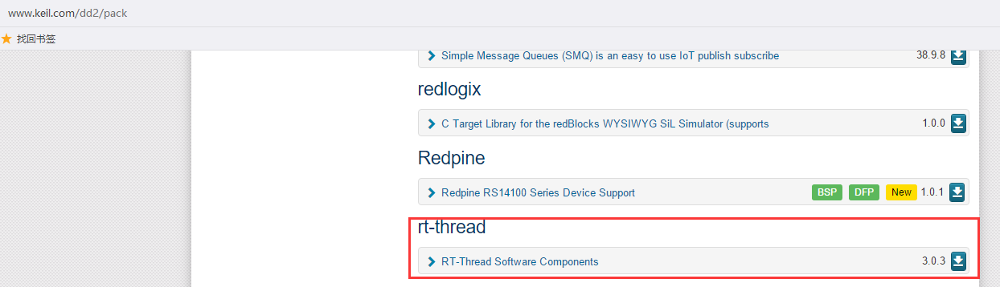
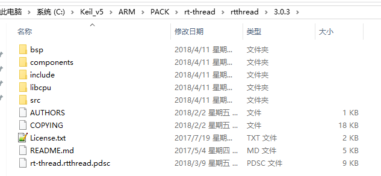
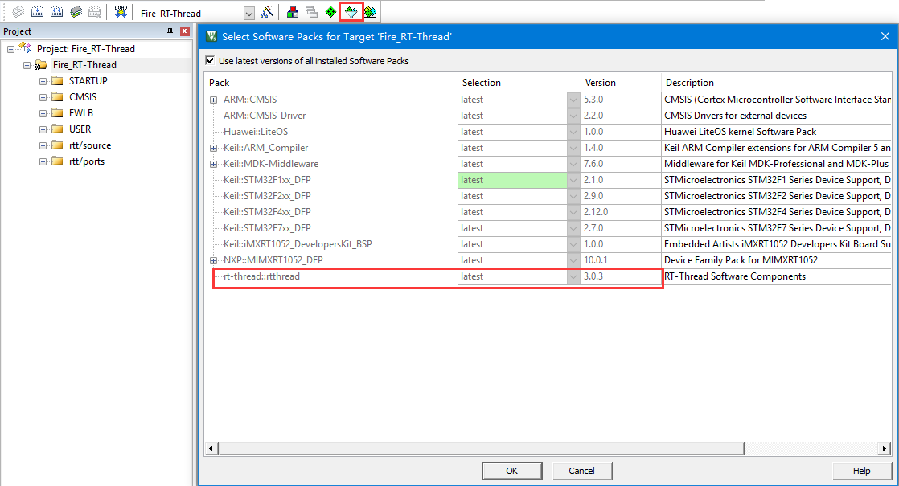
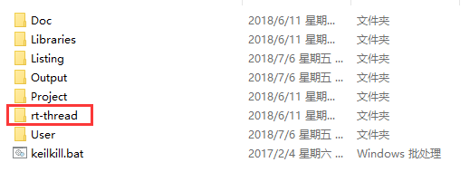
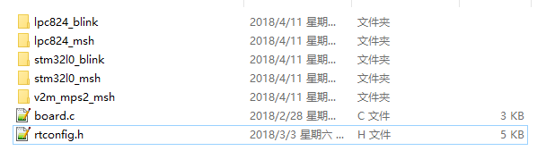
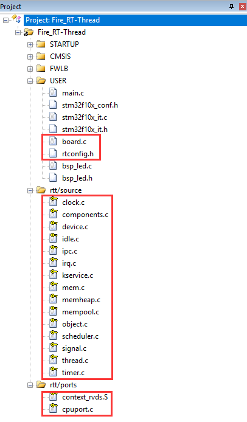
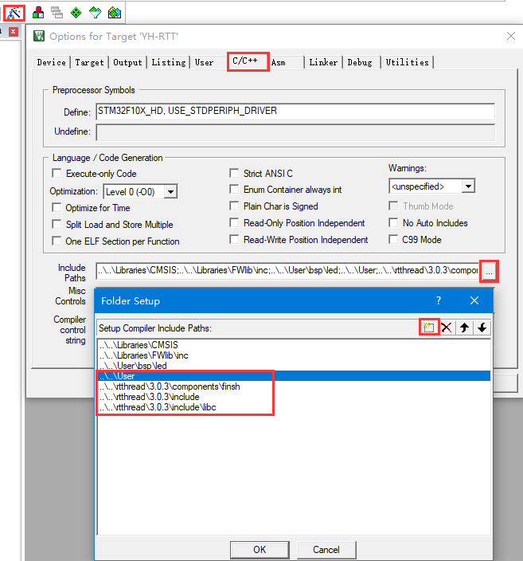
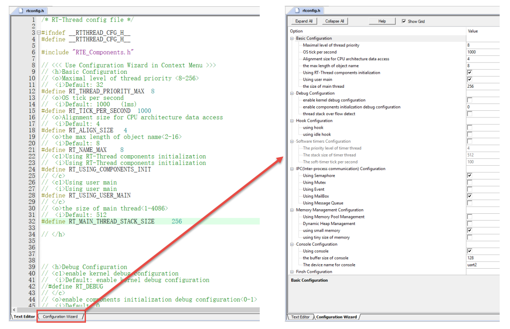
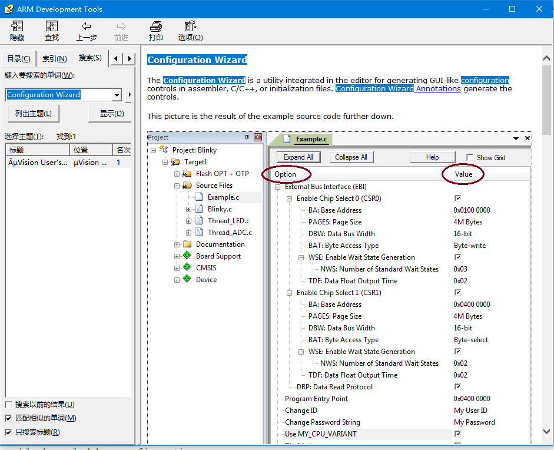

.. vim: syntax=rst

移植RT-Thread到STM32
=====================

本章开始，先新建一个基于野火STM32全系列（包含M3/4/7）开发板的的RT-Thread的工程模板，让RT-Thread先跑起来。以后所有的RT-
Thread相关的例程我们都在此模板上修改和添加代码，不用再反反复复地新建。在本书配套的例程中，每一章的例程对野火STM32的每一个板子都会有一个对应的例程，但是区别都很小，如果有区别的地方我会在教程里面详细指出，如果没有特别备注那么都是一样的。

获取STM32的裸机工程模板
~~~~~~~~~~~~~~~~~~~~~~~~~~~~~~~~~~~~~~~~~~

STM32的裸机工程模板我们直接使用野火STM32开发板配套的固件库例程即可。这里我们选取比较简单的例
程—“GPIO输出—使用固件库点亮LED”作为裸机工程模板。该裸机工程模板均可以在对应板子的A盘/程序源码
/固件库例程的目录下获取到，下面以野火F103-霸道板子的光盘目录为例，具体见图 13‑1。

.. image:: media/porting_to_stm32/portin002.png
    :align: center
    :alt: 图 13‑1 STM32裸机工程模板在光盘资料中的位置

图 13‑1 STM32裸机工程模板在光盘资料中的位置

下载RT-Thread Nano 源码
~~~~~~~~~~~~~~~~~~~~~~~~~~~~~~~~~~~~~~~~~~~~~~~~~~~~~~~~~

Nano是Master的精简版，去掉了一些组件和各种开发板的BSP，保留了OS的核心功能，但足够我们使用。版本已经更新到了3.0.3版本，与Master的版本号一致。

RT-Thread Master的源码可从RT-Thread GitHub仓库地址：\ https://github.com/RT-Thread/rt-thread\ 下载到，Nano就是从里面扣出来的。RT-
Thread官方并没有将抠出来的Nano放到他们的官方网站，而是作为一个Package放在了KEIL网站—\ http://www.keil.com/dd2/pack/\ 中，供用户下载，具体见图 13‑2，目前的版本号是3.0.3，如果以后更新到更高的版本则以最新的版本为准。

图 13‑2 RT-Thread Nano Package

安装RT-Thread Package
~~~~~~~~~~~~~~~~~~~~~~~~~~~~~~~~~~~~~~~~~~~~~~~~~~~~~~~~~

下载下来之后是一个以exe为后缀的文件，点击安装即可，安装目录与你的KEIL安装目录一样，安装成功之后，
可以在KEIL的PACK目录下找到刚刚安装的Package的所有的文件，具体见图 13‑3。

图 13‑3 RT-Thread Nano Package 安装文件

这样安装成功之后，就可以在KEIL里面的软件包管理器中将RT-Thread Nano 直接添加到工程里面，具体见图 13‑4。

图 13‑4从KEIL的软件包管理器中选择RT-Thread Nano Package

往裸机工程添加RT-Thread源码
~~~~~~~~~~~~~~~~~~~~~~~~~~~~~~~~~~~~~~~~~~~~~~~~~~~~~~

拷贝RT-Thread Package到裸机工程根目录
-----------------------------------------

使用这种方法打包的RT-Thread 工程，拷贝到一台没有安装RT-Thread Package的电脑上面是使用不了的，
会提示找不到RT-Thread的源文件。鉴于RT-Thread Package容量很小，我们直接将安装在KEIL PACK 目
录下的整个RT-Thread文件夹拷贝到我们的STM32裸机工程里面，让整个RT-Thread Package 跟随我们的
工程一起发布，具体见图 13‑5。

图 13‑5 拷贝RT-Thread Package到裸机工程

图 13‑5中RT-Thread文件夹下就是RT-Thread Nano 的所有东西，该文件夹下的具体内容见表格 13‑1。

表格 13‑1 RT-dhread 文件夹内容组成

============== ==================== ======================
文件夹         文件夹               描述
============== ==================== ======================
rtthread/3.0.3 bsp                  板级支持包
\              components/finsh     RT-Thread组件
\              include              头文件
\              include/libc         头文件
\              libcpu/arm/cortex-m0 与处理器相关的接口文件
\              libcpu/arm/cortex-m3 与处理器相关的接口文件
\              libcpu/arm/cortex-m4 与处理器相关的接口文件
\              libcpu/arm/cortex-m7 与处理器相关的接口文件
\              src                  RT-Thread内核源码
============== ==================== ======================

拷贝rtconfig.h文件到user文件夹
----------------------------------

将RT-Thread/3.0.3/bsp文件夹下面的rtconfig.h配套文件拷贝到工程根目录下面的user文件夹，等下我们需要对这个文件进行修改。

用户可以通过修改这个RT-Thread内核的配置头文件来裁剪RT-Thread的功能，所以我们把它拷贝一份放在user这个文件夹下面。user，见名之义我们就可以知道里面存放的文件都是用户自己编写的。

拷贝board.c文件到user文件夹
--------------------------------

将RT-Thread/3.0.3/bsp文件夹下面的board.c配套文件拷贝到工程根目录下面的user文件夹，等下我们需要对这个board.c进行修改。

RT-Thread文件夹内容简介
-------------------------

接下来我们对RT-Thread文件夹下面的内容做个简单的介绍，好让我们能够更顺心地使用RT-Thread。

bsp文件夹简介
^^^^^^^^^^^^^^

bsp文件夹里面存放的是板级支持包，即board support package的英文缩写。RT-Thread为了推广自己，
会给各种半导体厂商的评估板写好驱动程序，这些驱动程序就放在bsp这个目录下，我们这里用的是nano版本，
只有几款开发板的驱动，具体见图13‑6，如果是Master版本，则存放了非常多的开发板的驱动，具体见
图 13‑7。bsp文件夹下面的board.c这是RT-Thread用来初始化开发板硬件的相关函数。rtconfig.h是
RT-Thread功能的配置头文件，里面定义了很多宏，通过这些宏定义，我们可以裁剪RT-Thread的功能。
用户在使用RT-Thread的时候，用户只需要修改board.c和rtconfig.h这两个文件的内容即可，其它文件
我们不需要改动。如果为了减小工程的大小，bsp文件夹下面除了board.c和rtconfig.h这两个文件要保
留外，其它的统统可以删除。

图 13‑6 RT-Thread Nano bsp 文件夹内容

图 13‑7 RT-Thread Master 文件夹内容（以后会更多）

components文件夹简介
^^^^^^^^^^^^^^^^^^^^^^^^^^^^^^

在RT-Thread看来，除了内核，其它第三方加进来的软件都是组件，比如gui、fatfs、lwip和finsh等。那么这些组件就放在components这个文件夹内，目前nano版本只放了finsh，其它的都被删除了，master版本则放了非常多的组件。finsh是RT-
Thread组件里面最具特色的，它通过串口打印的方式来输出各种信息，方便我们调试程序。

include文件夹简介
^^^^^^^^^^^^^^^^^^^^^^^^

include目录下面存放的是RT-Thread内核的头文件，是内核不可分割的一部分。

libcpu文件夹简介
^^^^^^^^^^^^^^^^^^^^

RT-Thread是一个软件，单片机是一个硬件，RT-
Thread要想运行在一个单片机上面，它们就必须关联在一起，那么怎么关联？还是得通过写代码来关联，这部分关联的文件叫接口文件，通常由汇编和C联合编写。这些接口文件都是跟硬件密切相关的，不同的硬件接口文件是不一样的，但都大同小异。编写这些接口文件的过程我们就叫移植，移植的过程通常由RT-
Thread和mcu原厂的人来负责，移植好的这些接口文件就放在libcpu这个文件夹的目录下。RT-Thread nano目
前在libcpu目录下只放了cortex-m0、m3、m4和m7内核的单片机的接口文件，只要是使用了这些内核的mcu都可
以使用里面的接口文件。通常网络上出现的叫“移植某某某RTOS到某某某MCU”的教程，其实准确来说，不能够叫
移植，应该叫使用官方的移植，因为这些跟硬件相关的接口文件，RTOS官方都已经写好了，我们只是使用而已。
我们本章讲的移植也是使用RT-Thread官方的移植，关于这些底层的移植文件我们已经在第一部分“从0到1教你
写RT-Thread内核”有非常详细的讲解，这里我们直接使用即可。

src文件夹简介
^^^^^^^^^^^^^^

src目录下面存放的是RT-Thread内核的源文件，是内核的核心，我们在第一部分“从0到1教你写RT-Thread内核”里面讲解的就是这里面内容。

添加RT-Thread源码到工程组文件夹
-----------------------------------

在上一步我们只是将RT-Thread的源码放到了本地工程目录下，还没有添加到开发环境里面的组文件夹里面。

新建rtt/source和rtt/ports组
^^^^^^^^^^^^^^^^^^^^^^^^^^^^^^^^^^^^^^^^^^^^

接下来我们在开发环境里面新建rtt/source和rtt/ports两个组文件夹，其中rtt/source用于存放src文件夹的内容，rtt/ports用于存放libcpu/arm/cortex-m？文件夹的内容，“？”表示3、4或者7，具体选择哪个得看你使用的是野火哪个型号的STM32开发板，具体
见表格 13‑2。

表格 13‑2 野火STM32开发板型号对应RT-Thread的接口文件

=================== ============= ===========================
野火STM32开发板型号 具体芯片型号  RT-Thread不同内核的接口文件
=================== ============= ===========================
MINI                STM32F103RCT6 libcpu/arm/cortex-m3
指南者              STM32F103VET6 libcpu/arm/cortex-m3
霸道                STM32F103ZET6 libcpu/arm/cortex-m3
霸天虎              STM32F407ZGT6 libcpu/arm/cortex-m4
F429-挑战者         STM32F429IGT6 libcpu/arm/cortex-m4
F767-挑战者         STM32F767IGT6 libcpu/arm/cortex-m7
H743-挑战者         STM32H743IIT6 libcpu/arm/cortex-m7
=================== ============= ===========================

bsp里面的rtconfig.h和board.c添加到user组文件夹下，其中rtconfig.h用于配置RT-Thread的功能，
board.c用于存放硬件相关的初始化函数。源码添加完毕之后，具体见图 13‑8。

指定RT-Thread头文件的路径
^^^^^^^^^^^^^^^^^^^^^^^^^^^^^^^^

RT-Thread的源码已经添加到开发环境的组文件夹下面，编译的时候需要为这些源文件指定头文件的路径，不然编译会报错。RT-Thread的源码里面只有RT-Thread\3.0.3\components\finsh、RT-Thread\3.0.3\include和RT-
Thread\3.0.3\include\libc这三个文件夹下面有头文件，只需要将这三个头文件的路径在开发环境里面指定即可。同时我们还将RT-Thread\3.0.3\bsp里面的rtconfig.h这个头文件拷贝到了工程根目录下的user文件夹下，所以user的路径也要加到开发环境里面。RT-
Thread头文件的路径添加完成后的效果具体见图 13‑9。

图 13‑9 在开发环境中指定RT-Thread 的头文件的路径

修改rtconfig.h
~~~~~~~~~~~~~~~~~~~~~~~~~~~~~~~~~~~~

rtconfig.h是直接从RT-Thread/3.0.3/bsp文件夹下面拷贝过来的，该头文件对裁剪整个RT-Thread所需的功能的宏均做了定义，有些宏定义被使能，有些宏定义被失能，一开始我们只需要配置最简单的功能即可。要想随心所欲的配置RT-
Thread的功能，我们必须对这些宏定义的功能有所掌握，下面我们先简单的介绍下这些宏定义的含义，然后再对这些宏定义进行修改。

rtconfig.h文件内容讲解
-------------------------

.. code-block:: c
    :caption: 代码清单 13‑1 rtconfig.h文件内容
    :linenos:

    /* RT-Thread config file */

    #ifndef __RTTHREAD_CFG_H__
    #define __RTTHREAD_CFG_H__

    #include "RTE_Components.h"                                (1)

    // <<< Use Configuration Wizard in Context Menu >>>        (2)
    // <h>Basic Configuration                                  (3)
    // <o>Maximal level of thread priority <8-256>
    //	<i>Default: 32
    #define RT_THREAD_PRIORITY_MAX  8                          (3)-1
    // <o>OS tick per second
    //  <i>Default: 1000   (1ms)
    #define RT_TICK_PER_SECOND	100                            (3)-2
    // <o>Alignment size for CPU architecture data access
    //	<i>Default: 4
    #define RT_ALIGN_SIZE   4                                  (3)-3
    // <o>the max length of object name<2-16>
    //	<i>Default: 8
    #define RT_NAME_MAX	   8                                   (3)-4
    // <c1>Using RT-Thread components initialization
    //  <i>Using RT-Thread components initialization
    #define RT_USING_COMPONENTS_INIT                           (3)-5
    // </c>
    // <c1>Using user main
    //  <i>Using user main
    #define RT_USING_USER_MAIN                                 (3)-6
    // </c>
    // <o>the size of main thread<1-4086>
    //	<i>Default: 512
    #define RT_MAIN_THREAD_STACK_SIZE     256                  (3)-7

    // </h>

    // <h>Debug Configuration                                  (4)
    // <c1>enable kernel debug configuration
    //  <i>Default: enable kernel debug configuration
    //#define RT_DEBUG
    // </c>
    // <o>enable components initialization debug configuration<0-1>
    //  <i>Default: 0
    #define RT_DEBUG_INIT 0
    // <c1>thread stack over flow detect
    //  <i> Diable Thread stack over flow detect
    //#define RT_USING_OVERFLOW_CHECK
    // </c>
    // </h>

    // <h>Hook Configuration                                    (5)
    // <c1>using hook
    //  <i>using hook
    //#define RT_USING_HOOK
    // </c>
    // <c1>using idle hook
    //  <i>using idle hook
    //#define RT_USING_IDLE_HOOK
    // </c>
    // </h>

    // <e>Software timers Configuration                        (6)
    // <i> Enables user timers
    #define RT_USING_TIMER_SOFT         0
    #if RT_USING_TIMER_SOFT == 0
    #undef RT_USING_TIMER_SOFT
    #endif
    // <o>The priority level of timer thread <0-31>
    //  <i>Default: 4
    #define RT_TIMER_THREAD_PRIO		4
    // <o>The stack size of timer thread <0-8192>
    //  <i>Default: 512
    #define RT_TIMER_THREAD_STACK_SIZE	512
    // <o>The soft-timer tick per second <0-1000>
    //  <i>Default: 100
    #define RT_TIMER_TICK_PER_SECOND	100
    // </e>

    // <h>IPC(Inter-process communication) Configuration    (7)
    // <c1>Using Semaphore
    //  <i>Using Semaphore
    #define RT_USING_SEMAPHORE                              (7)-1
    // </c>
    // <c1>Using Mutex
    //  <i>Using Mutex
    //#define RT_USING_MUTEX                                (7)-2
    // </c>
    // <c1>Using Event
    //  <i>Using Event
    //#define RT_USING_EVENT                                (7)-3
    // </c>
    // <c1>Using MailBox
    //  <i>Using MailBox
    #define RT_USING_MAILBOX                                (7)-5
    // </c>
    // <c1>Using Message Queue
    //  <i>Using Message Queue
    //#define RT_USING_MESSAGEQUEUE                         (7)-5
    // </c>
    // </h>

    // <h>Memory Management Configuration                   (8)
    // <c1>Using Memory Pool Management
    //  <i>Using Memory Pool Management
    //#define RT_USING_MEMPOOL                              (8)-1
    // </c>
    // <c1>Dynamic Heap Management
    //  <i>Dynamic Heap Management
    //#define RT_USING_HEAP                                 (8)-2
    // </c>
    // <c1>using small memory
    //  <i>using small memory
    #define RT_USING_SMALL_MEM                              (8)-3
    // </c>
    // <c1>using tiny size of memory
    //  <i>using tiny size of memory
    //#define RT_USING_TINY_SIZE                            (8)-4
    // </c>
    // </h>

    // <h>Console Configuration                             (9)
    // <c1>Using console
    //  <i>Using console
    #define RT_USING_CONSOLE
    // </c>
    // <o>the buffer size of console <1-1024>
    //  <i>the buffer size of console
    //  <i>Default: 128  (128Byte)
    #define RT_CONSOLEBUF_SIZE          128
    // <s>The device name for console
    //  <i>The device name for console
    //  <i>Default: uart1
    #define RT_CONSOLE_DEVICE_NAME      "uart2"
    // </h>

    #if defined(RTE_FINSH_USING_MSH)                        (10)
    #define RT_USING_FINSH
    #define FINSH_USING_MSH
    #define FINSH_USING_MSH_ONLY
    // <h>Finsh Configuration
    // <o>the priority of finsh thread <1-7>
    //  <i>the priority of finsh thread
    //  <i>Default: 6
    #define __FINSH_THREAD_PRIORITY     5
    #define FINSH_THREAD_PRIORITY       (RT_THREAD_PRIORITY_MAX / 8 * __FINSH_THREAD_PRIORITY + 1)
    // <o>the stack of finsh thread <1-4096>
    //  <i>the stack of finsh thread
    //  <i>Default: 4096  (4096Byte)
    #define FINSH_THREAD_STACK_SIZE     512
    // <o>the history lines of finsh thread <1-32>
    //  <i>the history lines of finsh thread
    //  <i>Default: 5
    #define FINSH_HISTORY_LINES	        1
    // <c1>Using symbol table in finsh shell
    //  <i>Using symbol table in finsh shell
    #define FINSH_USING_SYMTAB
    // </c>
    // </h>
    #endif

    #if defined(RTE_USING_DEVICE)                          (11)
    #define RT_USING_DEVICE
    #endif

    // <<< end of configuration section >>>                (12)

    #endif

代码清单 13‑1\ **(1)** ：头文件RTE_Components.h是在MDK中添加RT-Thead Package时由MDK自动生成的，
目前我们没有使用MDK中自带的RT-Thread的Package，所以这个头文件不存在，如果包含了该头文件，编译的时
候会报错，等下修改rtconfig.h的时候需要注释掉该头文件。

代码清单 13‑1\ **(2)** ：\ **Use Configuration Wizard in Context Menu：**\ 在上下文中使用
配置向导来配置rtconfig.h中的宏定义。接下来代码中夹杂的“<h> </h>”、“<o>”“<i>”、“<c1> </c>”和“<e>
</e>”这些符号是MDK自带的配置向导控制符号，使用这些符号控制的代码可以生成一个对应的图形界面的配置
向导，rtconfig.h对应的配置向导具体见图 13‑10。有关配置向导的语法，可在MDK的帮助文档里面找到，
在搜索栏输入Configuration Wizard 即可搜索到，具体见图
13‑11。具体每一个符号的语法我们这里不做细讲，有兴趣的可以深究下。 对于我个人，还是倾向于直接修
改rtconfig.h中的源码，而不是通过这个配置向导来修改，就好比一个老烟枪抽烟的时候你要给他加个过滤
嘴，那是不可能的，这辈子都是不可能的。

图 13‑10 rtconfig.h对应的配置向导

图 13‑11 Configuration Wizard

代码清单 13‑1\ **(3)** ：RT-Thread的基本配置，要想RT-Thread准确无误的跑起来，这些基本配置必须得有且正确。

代码清单 13‑1\ **(3)-1** ：RT_THREAD_PRIORITY_MAX这个宏表示RT-Thread支持多少个优先级，
取值范围为8~~~256，默认为32。

代码清单 13‑1\ **(3)-2**\ ：RT_TICK_PER_SECOND 表示操作系统每秒钟有多少个tick，tick即是操
作系统的时钟周期，默认为1000，即操作系统的时钟周期tick等于1ms。

代码清单 13‑1\ **(3)-3**\ ：RT_ALIGN_SIZE这个宏表示CPU处理的数据需要多少个字节对齐，默认为4个字节。

代码清单 13‑1\ **(3)-4**\ ：RT_NAME_MAX这个宏表示内核对象名字的最大长度，取值范围为2~~~16，默认为8。

代码清单 13‑1\ **(3)-5**\ ：使用RT-Thread组件初始化，默认使能。

代码清单 13‑1\ **(3)-6**\ ：使用用户main函数，默认打开。

代码清单 13‑1\ **(3)-7**\ ：main线程栈大小，取值范围为1~~~4086，单位为字节，默认为512。

代码清单 13‑1\ **(4)**\ ：调试配置。包括了内核调试配置，组件调试配置和线程栈溢出检测，目前全部关闭。

代码清单 13‑1\ **(5)**\ ：钩子函数配置，目前全部关闭。

代码清单 13‑1\ **(6)**\ ：软件定时器配置，目前关闭，不使用软件定时器。

代码清单 13‑1\ **(7)**\ ：内部通信配置，包括信号量、互斥量、事件、邮箱和消息队列，根据需要配置。

代码清单 13‑1\ **(8)**\ ：内存管理配置。

代码清单 13‑1\ **(8)-1**\ ：RT_USING_MEMPOOL这个宏用于表示是否使用内存池，目前关闭，不使用内存池。

代码清单 13‑1\ **(8)-2**\ ：RT_USING_HEAP这个宏用于表示是否堆，目前关闭，不使用堆。

代码清单 13‑1\ **(8)-3**\ ：RT_USING_SMALL_MEM这个宏用于表示是否使用小内存，目前使能。

代码清单 13‑1\ **(8)-4**\ ：RT_USING_TINY_SIZE这个宏用于表示是否使用极小内存，目前关闭，不使用。

代码清单 13‑1\ **(9)**\ ：控制台配置。控制台即是rt_kprintf()函数调试输出的设备，通常使用串口。

代码清单 13‑1\ **(10)**\ ：FINSH配置。

代码清单 13‑1\ **(11)**\ ：设备配置。

代码清单 13‑1\ **(12)**\ ：rtconfig.h配置结束。

rtconfig.h文件修改
-----------------------

rtconfig.h头文件的内容修改的不多，具体是：注释掉头文件RTE_Components.h、修改了
RT_THREAD_PRIORITY_MAX、RT_TICK_PER_SECOND和RT_MAIN_THREAD_STACK_SIZE这三个宏
的大小，具体见代码清单 13‑2的高亮部分。

.. code-block:: c
    :caption: 代码清单 13‑2 rtconfig.h文件修改
    :emphasize-lines: 6,12,15,32
    :linenos:

    /* RT-Thread config file */

    #ifndef __RTTHREAD_CFG_H__
    #define __RTTHREAD_CFG_H__

    //#include "RTE_Components.h"

    // <<< Use Configuration Wizard in Context Menu >>>
    // <h>Basic Configuration
    // <o>Maximal level of thread priority <8-256>
    //	<i>Default: 32
    #define RT_THREAD_PRIORITY_MAX  8
    // <o>OS tick per second
    //  <i>Default: 1000   (1ms)
    #define RT_TICK_PER_SECOND	1000
    // <o>Alignment size for CPU architecture data access
    //	<i>Default: 4
    #define RT_ALIGN_SIZE   4
    // <o>the max length of object name<2-16>
    //	<i>Default: 8
    #define RT_NAME_MAX	   8
    // <c1>Using RT-Thread components initialization
    //  <i>Using RT-Thread components initialization
    #define RT_USING_COMPONENTS_INIT
    // </c>
    // <c1>Using user main
    //  <i>Using user main
    #define RT_USING_USER_MAIN
    // </c>
    // <o>the size of main thread<1-4086>
    //	<i>Default: 512
    #define RT_MAIN_THREAD_STACK_SIZE     512

    // </h>

    // <h>Debug Configuration
    // <c1>enable kernel debug configuration
    //  <i>Default: enable kernel debug configuration
    //#define RT_DEBUG
    // </c>
    // <o>enable components initialization debug configuration<0-1>
    //  <i>Default: 0
    #define RT_DEBUG_INIT 0
    // <c1>thread stack over flow detect
    //  <i> Diable Thread stack over flow detect
    //#define RT_USING_OVERFLOW_CHECK
    // </c>
    // </h>

    // <h>Hook Configuration
    // <c1>using hook
    //  <i>using hook
    //#define RT_USING_HOOK
    // </c>
    // <c1>using idle hook
    //  <i>using idle hook
    //#define RT_USING_IDLE_HOOK
    // </c>
    // </h>

    // <e>Software timers Configuration
    // <i> Enables user timers
    #define RT_USING_TIMER_SOFT         0
    #if RT_USING_TIMER_SOFT == 0
    #undef RT_USING_TIMER_SOFT
    #endif
    // <o>The priority level of timer thread <0-31>
    //  <i>Default: 4
    #define RT_TIMER_THREAD_PRIO		4
    // <o>The stack size of timer thread <0-8192>
    //  <i>Default: 512
    #define RT_TIMER_THREAD_STACK_SIZE	512
    // <o>The soft-timer tick per second <0-1000>
    //  <i>Default: 100
    #define RT_TIMER_TICK_PER_SECOND	100
    // </e>

    // <h>IPC(Inter-process communication) Configuration
    // <c1>Using Semaphore
    //  <i>Using Semaphore
    #define RT_USING_SEMAPHORE
    // </c>
    // <c1>Using Mutex
    //  <i>Using Mutex
    //#define RT_USING_MUTEX
    // </c>
    // <c1>Using Event
    //  <i>Using Event
    //#define RT_USING_EVENT
    // </c>
    // <c1>Using MailBox
    //  <i>Using MailBox
    #define RT_USING_MAILBOX
    // </c>
    // <c1>Using Message Queue
    //  <i>Using Message Queue
    //#define RT_USING_MESSAGEQUEUE
    // </c>
    // </h>

    // <h>Memory Management Configuration
    // <c1>Using Memory Pool Management
    //  <i>Using Memory Pool Management
    //#define RT_USING_MEMPOOL
    // </c>
    // <c1>Dynamic Heap Management
    //  <i>Dynamic Heap Management
    #define RT_USING_HEAP
    // </c>
    // <c1>using small memory
    //  <i>using small memory
    #define RT_USING_SMALL_MEM
    // </c>
    // <c1>using tiny size of memory
    //  <i>using tiny size of memory
    //#define RT_USING_TINY_SIZE
    // </c>
    // </h>

    // <h>Console Configuration
    // <c1>Using console
    //  <i>Using console
    #define RT_USING_CONSOLE
    // </c>
    // <o>the buffer size of console <1-1024>
    //  <i>the buffer size of console
    //  <i>Default: 128  (128Byte)
    #define RT_CONSOLEBUF_SIZE          128
    // <s>The device name for console
    //  <i>The device name for console
    //  <i>Default: uart1
    #define RT_CONSOLE_DEVICE_NAME      "uart2"
    // </h>

    #if defined(RTE_FINSH_USING_MSH)
    #define RT_USING_FINSH
    #define FINSH_USING_MSH
    #define FINSH_USING_MSH_ONLY
    // <h>Finsh Configuration
    // <o>the priority of finsh thread <1-7>
    //  <i>the priority of finsh thread
    //  <i>Default: 6
    #define __FINSH_THREAD_PRIORITY     5
    #define FINSH_THREAD_PRIORITY       (RT_THREAD_PRIORITY_MAX / 8 * __FINSH_THREAD_PRIORITY + 1)
    // <o>the stack of finsh thread <1-4096>
    //  <i>the stack of finsh thread
    //  <i>Default: 4096  (4096Byte)
    #define FINSH_THREAD_STACK_SIZE     512
    // <o>the history lines of finsh thread <1-32>
    //  <i>the history lines of finsh thread
    //  <i>Default: 5
    #define FINSH_HISTORY_LINES	        1
    // <c1>Using symbol table in finsh shell
    //  <i>Using symbol table in finsh shell
    #define FINSH_USING_SYMTAB
    // </c>
    // </h>
    #endif

    #if defined(RTE_USING_DEVICE)
    #define RT_USING_DEVICE
    #endif

    // <<< end of configuration section >>>

    #endif

修改board.c
~~~~~~~~~~~~~~~~~~~~~~~~~~~

board.c文件内容讲解
-----------------------

board.c是直接从RT-Thread/3.0.3/bsp文件夹下面拷贝过来的，里面存放的是与硬件相关的初始化函数，
整个 board.c中的内容具体见代码清单 13‑3。

.. code-block:: c
    :caption: 代码清单 13‑3 board.c文件内容
    :linenos:

    /* RT-Thread相关头文件 */ (1)
    #include <rthw.h>
    #include <rtthread.h>

    /*========================== (2)开始 ==============================*/

    #define _SCB_BASE       (0xE000E010UL)
    #define _SYSTICK_CTRL   (*(rt_uint32_t *)(_SCB_BASE + 0x0))
    #define _SYSTICK_LOAD   (*(rt_uint32_t *)(_SCB_BASE + 0x4))
    #define _SYSTICK_VAL    (*(rt_uint32_t *)(_SCB_BASE + 0x8))
    #define _SYSTICK_CALIB  (*(rt_uint32_t *)(_SCB_BASE + 0xC))
    #define _SYSTICK_PRI    (*(rt_uint8_t  *)(0xE000ED23UL))

    /* 外部时钟和函数声明 */
    extern void SystemCoreClockUpdate(void);
    extern uint32_t SystemCoreClock;
    /* 系统定时器SysTick初始化 */
    static uint32_t _SysTick_Config(rt_uint32_t ticks)
    {
        if ((ticks - 1) > 0xFFFFFF)
        {
            return 1;
        }

        _SYSTICK_LOAD = ticks - 1;
        _SYSTICK_PRI = 0xFF;
        _SYSTICK_VAL  = 0;
        _SYSTICK_CTRL = 0x07;

        return 0;
    }
    /*========================== (2)结束 ===========================*/

    #if defined(RT_USING_USER_MAIN) && defined(RT_USING_HEAP)       (3)
    #define RT_HEAP_SIZE 1024
    /* 从内部SRAM里面分配一部分静态内存来作为rtt的堆空间，这里配置为4KB */
    static uint32_t rt_heap[RT_HEAP_SIZE];
    RT_WEAK void *rt_heap_begin_get(void)
    {
        return rt_heap;
    }

    RT_WEAK void *rt_heap_end_get(void)
    {
        return rt_heap + RT_HEAP_SIZE;
    }
    #endif

    /**
    * @brief  开发板硬件初始化函数
    * @param  无
    * @retval 无
    *
    * @attention
    * RTT把开发板相关的初始化函数统一放到board.c文件中实现，
    * 当然，你想把这些函数统一放到main.c文件也是可以的。
    */
    void rt_hw_board_init()                                         (4)
    {
        /* 更新系统时钟 */
        SystemCoreClockUpdate();                                   (4)-1

        /* SysTick初始化 */
        _SysTick_Config(SystemCoreClock / RT_TICK_PER_SECOND);     (4)-2

        /* 硬件BSP初始化统统放在这里，比如LED，串口，LCD等 */      (4)-3

        /* 调用组件初始化函数 (use INIT_BOARD_EXPORT()) */
    #ifdef RT_USING_COMPONENTS_INIT
        rt_components_board_init();                                (4)-4
    #endif

    #if defined(RT_USING_CONSOLE) && defined(RT_USING_DEVICE)
        rt_console_set_device(RT_CONSOLE_DEVICE_NAME);             (4)-5
    #endif

    #if defined(RT_USING_USER_MAIN) && defined(RT_USING_HEAP)
        rt_system_heap_init(rt_heap_begin_get(), rt_heap_end_get());(4)-6
    #endif
    }

    /**
    * @brief  SysTick中断服务函数
    * @param  无
    * @retval 无
    *
    * @attention
    * SysTick中断服务函数在固件库文件stm32f10x_it.c中也定义了，而现在
    * 在board.c中又定义一次，那么编译的时候会出现重复定义的错误，解决
    * 方法是可以把stm32f10x_it.c中的注释或者删除即可。
    */
    void SysTick_Handler(void)                                      (5)
    {
        /* 进入中断 */
        rt_interrupt_enter();

        /* 更新时基 */
        rt_tick_increase();

        /* 离开中断 */
        rt_interrupt_leave();
    }

代码清单 13‑3\ **(1)**\ ：RT-Thread相关头文件，rthw.h是处理器相关，rtthread与内核相关。

代码清单 13‑3\ **(2)**\ ：SysTick相关的寄存器定义和初始化函数，这个是跟处理器相关的，等下我们直接
使用固件库函数，可以把这部分注释掉，也可以保留，看个人喜好。

代码清单 13‑3\ **(3)**\ ：RT-Thread堆配置，如果同时定义了RT_USING_USER_MAIN和 RT_USING_HEAP这两
个宏，表示RT-Thread里面创建内核对象时使用动态内存分配方案。堆可以是内部的SRAM也可以是外部的SRAM或
SDRAM，目前的方法是从内部SRAM里面分配一部分静态内存来作为堆空间，这里配置为4KB。rt_heap_begin_get()
和rt_heap_end_get()这两个函数表示堆的起始地址和结束地址。这两个函数前面的宏RT_WEAK的原型是关键字
__weak，表示若定义，即其它地方定义了rt_heap_begin_get()和rt_heap_end_get()这两个函数实体，
被__weak修饰的函数就会被覆盖。

RT_USING_USER_MAIN和RT_USING_HEAP这两个宏在rtconfig.h中定义，RT_USING_USER_MAIN默认使能，通过使能或者失能RT_USING_HEAP这个宏来选择使用静态或者动态内存。无论是使用静态还是动态内存方案，使用的都是内部的SRAM，区别是使用的内存是
在程序编译的时候分配还是在运行的时候分配。

rt_hw_board_init()函数
^^^^^^^^^^^^^^^^^^^^^^^^^^^^^^^^^^^^^

代码清单 13‑3\ **(4)**\ ：RT-Thread启动的时候会调用一个名为rt_hw_board_init()的函数，从函数名称
我们可以知道它是用来初始化开发板硬件的，比如时钟，比如串口等，具体初始化什么由用户选择。当这些硬件
初始化好之后，RT-Thread才继续往下启动。至于RT-Thread是哪个文件里面的哪个函数会调
用rt_hw_board_init()，我们在本章先不细讲，留到接下来的“RT-Thread的启动流程”章节再深究，这里我们
只需要知道我们用户要自己编写一个rt_hw_board_init()的函数供RT-Thread启动的时候调用即可。

代码清单 13‑3\ **(4)-1**\ ：更新系统时钟，如果硬件已经能够跑起来都表示系统时钟是没有问题的，该函数一般由固件库提供。

代码清单 13‑3\ **(4)-2**\ ：初始化系统定时器SysTick，SysTick给操作系统提供时基，1个时基我们称之
为一个tick，tick是操作系统最小的时间单位。RT_TICK_PER_SECOND是一个在rtconfig.h中定义的宏，用于
配置SysTick每秒中断多少次，这里配置为1000，即1秒钟内SysTick会中断1000次，即中断周期为1ms。 这部
分功能等下我们会用固件库函数SysTick_Config()来代替。

代码清单 13‑3\ **(4)-3**\ ：硬件BSP初始化统统放在这里，比如LED，串口，LCD等。目前我们暂时没有初始化任何开发板的硬件。

代码清单 13‑3\ **(4)-4**\ ：这部分是RT-Thread为开发板组件提供的一个初始化函数，该函数在
components.c里面实现，由rtconfig.h里面的宏RT_USING_COMPONENTS_INIT决定是否调用，默认是开启。

代码清单 13‑3\ **(4)-5**\ ：rt_console_set_device()是RT-
Thread提供的一个控制台设置函数，它将指定rt_kprintf()函数的输出内容具体从什么设备打印出来。该函数在kservice.c里面实现，由rtconfig.h里面的RT_USING_CONSOLE和RT_USING_DEVICE这两个宏决定是否调用，目前我们暂时不用。

代码清单 13‑3\ **(4)-6**\ ：rt_system_heap_init()是RT-Thread提供的一个内存初始化函数，只有在使用RT-
Thread提供的动态内存分配函数时才需要使用到。该函数在mem.c里面实现，由rtconfig.h里面的RT_USING_HEAP和RT_USING_USER_MAIN这两个决定是否调用，目前我们暂时不用。

SysTick_Handler()函数
^^^^^^^^^^^^^^^^^^^^^^^^^^^^^^^^^^^^^^^^^^^^^^^^^

代码清单 13‑3\ **(5)**\ ：SysTick中断服务函数是一个非常重要的函数，RT-Thread所有跟时间相关的事
情都在里面处理，具体实现见代码清单 13‑4。

.. code-block:: c
    :caption: 代码清单 13‑4 SysTick_Handler()函数
    :linenos:

    /**
    * @brief  SysTick中断服务函数
    * @param  无
    * @retval 无
    *
    * @attention
    * SysTick中断服务函数在固件库文件stm32f10x_it.c中也定义了，而现在
    * 在board.c中又定义一次，那么编译的时候会出现重复定义的错误，解决
    * 方法是可以把stm32f10x_it.c中的注释或者删除即可。
    */
    void SysTick_Handler(void)
    {
        /* 进入中断 */
        rt_interrupt_enter();                 (1)

        /* 更新时基 */
        rt_tick_increase();                   (2)

        /* 离开中断 */
        rt_interrupt_leave();                 (3)
    }

代码清单 13‑4 **(1)**\ ：进入中断，对中断计数器rt_interrupt_nest加1操作。

代码清单 13‑4\ **(2)**\ ：rt_tick_increase()用于更新时基，实现时间片，扫描系统定时器。

代码清单 13‑4\ **(3)** ：退出中断，对中断计数器rt_interrupt_nest减1操作。

board.c文件修改
------------------

board.c文件内容修改的并不多，具体见代码清单 13‑5的高亮部分。

.. code-block:: c
    :caption: 代码清单 13‑5 board.c文件修改
    :emphasize-lines: 2,8-38,66-74
    :linenos:

    /* 开发板硬件相关头文件 */
    #include "board.h"

    /* RT-Thread相关头文件 */
    #include <rthw.h>
    #include <rtthread.h>

    #if 0
    /*========================================================*/ 修改(2)
    /* 内核外设NVIC相关的寄存器定义 */
    #define _SCB_BASE       (0xE000E010UL)
    #define _SYSTICK_CTRL   (*(rt_uint32_t *)(_SCB_BASE + 0x0))
    #define _SYSTICK_LOAD   (*(rt_uint32_t *)(_SCB_BASE + 0x4))
    #define _SYSTICK_VAL    (*(rt_uint32_t *)(_SCB_BASE + 0x8))
    #define _SYSTICK_CALIB  (*(rt_uint32_t *)(_SCB_BASE + 0xC))
    #define _SYSTICK_PRI    (*(rt_uint8_t  *)(0xE000ED23UL))

    /* 外部时钟和函数声明 */
    extern void SystemCoreClockUpdate(void);
    extern uint32_t SystemCoreClock;

    /* 系统定时器SysTick初始化 */
    static uint32_t _SysTick_Config(rt_uint32_t ticks)
    {
        if ((ticks - 1) > 0xFFFFFF)
        {
            return 1;
        }

        _SYSTICK_LOAD = ticks - 1;
        _SYSTICK_PRI = 0xFF;
        _SYSTICK_VAL  = 0;
        _SYSTICK_CTRL = 0x07;

        return 0;
    }
    /*=====================================================*/
    #endif

    #if defined(RT_USING_USER_MAIN) && defined(RT_USING_HEAP)
    #define RT_HEAP_SIZE 1024
    /* 从内部SRAM里面分配一部分静态内存来作为rtt的堆空间，这里配置为4KB */
    static uint32_t rt_heap[RT_HEAP_SIZE];
    RT_WEAK void *rt_heap_begin_get(void)
    {
        return rt_heap;
    }

    RT_WEAK void *rt_heap_end_get(void)
    {
        return rt_heap + RT_HEAP_SIZE;
    }
    #endif

    /**
    * @brief  开发板硬件初始化函数
    * @param  无
    * @retval 无
    *
    * @attention
    * RTT把开发板相关的初始化函数统一放到board.c文件中实现，
    * 当然，你想把这些函数统一放到main.c文件也是可以的。
    */
    void rt_hw_board_init()
    {
    #if 0                                                       修改(3)
        /* 更新系统时钟 */
        SystemCoreClockUpdate();

        /* SysTick初始化 */
        _SysTick_Config(SystemCoreClock / RT_TICK_PER_SECOND);
    #endif
        /* 初始化SysTick */
        SysTick_Config( SystemCoreClock / RT_TICK_PER_SECOND );

        /* 硬件BSP初始化统统放在这里，比如LED，串口，LCD等 */

        /* 调用组件初始化函数 (use INIT_BOARD_EXPORT()) */
    #ifdef RT_USING_COMPONENTS_INIT
        rt_components_board_init();
    #endif

    #if defined(RT_USING_CONSOLE) && defined(RT_USING_DEVICE)
        rt_console_set_device(RT_CONSOLE_DEVICE_NAME);
    #endif

    #if defined(RT_USING_USER_MAIN) && defined(RT_USING_HEAP)
        rt_system_heap_init(rt_heap_begin_get(), rt_heap_end_get());
    #endif
    }

    /**
    * @brief  SysTick中断服务函数
    * @param  无
    * @retval 无
    *
    * @attention
    * SysTick中断服务函数在固件库文件stm32f10x_it.c中也定义了，而现在
    * 在board.c中又定义一次，那么编译的时候会出现重复定义的错误，解决
    * 方法是可以把stm32f10x_it.c中的注释或者删除即可。
    */
    void SysTick_Handler(void)
    {
        /* 进入中断 */
        rt_interrupt_enter();

        /* 更新时基 */
        rt_tick_increase();

        /* 离开中断 */
        rt_interrupt_leave();
    }

代码清单 13‑5\ **修改(1)**\ ：在user目录下新建一个board.h头文件，用来包含固件库和BSP相关的
头文件和存放board.c里面的函数声明，具体见代码清单 13‑6。

.. code-block:: c
    :caption: 代码清单 13‑6 board.h文件内容
    :linenos:

    #ifndef __BOARD_H__
    #define __BOARD_H__

    /*
    *************************************************************************
    *                             包含的头文件
    *************************************************************************
    */
    /* STM32 固件库头文件 */
    #include "stm32f10x.h"

    /* 开发板硬件bsp头文件 */
    #include "bsp_led.h"
    #include "bsp_usart.h"
    #include "bsp_key.h"
    /*
    *************************************************************************
    *                               函数声明
    *************************************************************************
    */
    void rt_hw_board_init(void);
    void SysTick_Handler(void);

    #endif /* __BOARD_H__ */

代码清单 13‑5\ **修改(2)**\ ：SysTick相关的寄存器和初始化函数统统屏蔽掉，将由固件库文件core_cm3/4/7里面的替代。

代码清单 13‑5\ **修改(3)**\ ：SysTick初始化函数由固件库文件core_cm3/4/7里面的SysTick_Config()函数替代。

如果使用的是HAL库（目前野火只在STM32 M7系列中使用HAL库），则必须添加系统时钟初始化函数，这个函数在
我们利用STM32CubeMX代码生成工具配置工程时会自动给我们生成，我们只需添加到rt_hw_board_init()函数进
行初始化即可，具体见代码清单 13‑7高亮部分。

.. code-block:: c
    :caption: 代码清单 13‑7修改使用HAL库的board.c文件
    :emphasize-lines: 34-38,102-157
    :linenos:

    /* 开发板硬件相关头文件 */
    #include "board.h"

    /* RT-Thread相关头文件 */
    #include <rthw.h>
    #include <rtthread.h>

    #if defined(RT_USING_USER_MAIN) && defined(RT_USING_HEAP)
    #define RT_HEAP_SIZE 1024
    /* 从内部SRAM里面分配一部分静态内存来作为rtt的堆空间，这里配置为4KB */
    static uint32_t rt_heap[RT_HEAP_SIZE];
    RT_WEAK void *rt_heap_begin_get(void)
    {
        return rt_heap;
    }

    RT_WEAK void *rt_heap_end_get(void)
    {
        return rt_heap + RT_HEAP_SIZE;
    }
    #endif

    /**
    * @brief  开发板硬件初始化函数
    * @param  无
    * @retval 无
    *
    * @attention
    * RTT把开发板相关的初始化函数统一放到board.c文件中实现，
    * 当然，你想把这些函数统一放到main.c文件也是可以的。
    */
    void rt_hw_board_init()
    {
        /* 系统时钟初始化成400MHz*/		                                    	(1)
        SystemClock_Config();

        /* 初始化SysTick */
        HAL_SYSTICK_Config( HAL_RCC_GetSysClockFreq() / RT_TICK_PER_SECOND );   (2)

        /* 硬件BSP初始化统统放在这里，比如LED，串口，LCD等 */

        /* 调用组件初始化函数 (use INIT_BOARD_EXPORT()) */
        #ifdef RT_USING_COMPONENTS_INIT
            rt_components_board_init();
        #endif

        #if defined(RT_USING_CONSOLE) && defined(RT_USING_DEVICE)
            rt_console_set_device(RT_CONSOLE_DEVICE_NAME);
        #endif

        #if defined(RT_USING_USER_MAIN) && defined(RT_USING_HEAP)
            rt_system_heap_init(rt_heap_begin_get(), rt_heap_end_get());
        #endif
    }

    /**
    * @brief  SysTick中断服务函数
    * @param  无
    * @retval 无
    *
    * @attention
    * SysTick中断服务函数在固件库文件stm32f10x_it.c中也定义了，而现在
    * 在board.c中又定义一次，那么编译的时候会出现重复定义的错误，解决
    * 方法是可以把stm32f10x_it.c中的注释或者删除即可。
    */
    void SysTick_Handler(void)
    {
        /* 进入中断 */
        rt_interrupt_enter();

        /* 更新时基 */
        rt_tick_increase();

        /* 离开中断 */
        rt_interrupt_leave();
    }

    /**
    * @brief  System Clock 配置
    *         system Clock 配置如下:
        *            System Clock source  = PLL (HSE)
        *            SYSCLK(Hz)           = 400000000 (CPU Clock)
        *            HCLK(Hz)             = 200000000 (AXI and AHBs Clock)
        *            AHB Prescaler        = 2
        *            D1 APB3 Prescaler    = 2 (APB3 Clock  100MHz)
        *            D2 APB1 Prescaler    = 2 (APB1 Clock  100MHz)
        *            D2 APB2 Prescaler    = 2 (APB2 Clock  100MHz)
        *            D3 APB4 Prescaler    = 2 (APB4 Clock  100MHz)
        *            HSE Frequency(Hz)    = 25000000
        *            PLL_M                = 5
        *            PLL_N                = 160
        *            PLL_P                = 2
        *            PLL_Q                = 4
        *            PLL_R                = 2
        *            VDD(V)               = 3.3
        *            Flash Latency(WS)    = 4
    * @param  None
    * @retval None
    */
    static void SystemClock_Config(void)			(3)
    {
    RCC_ClkInitTypeDef RCC_ClkInitStruct;
    RCC_OscInitTypeDef RCC_OscInitStruct;
    HAL_StatusTypeDef ret = HAL_OK;

    /*使能供电配置更新 */
    MODIFY_REG(PWR->CR3, PWR_CR3_SCUEN, 0);

    /* 当器件的时钟频率低于最大系统频率时，电压调节可以优化功耗，
            关于系统频率的电压调节值的更新可以参考产品数据手册。  */
    __HAL_PWR_VOLTAGESCALING_CONFIG(PWR_REGULATOR_VOLTAGE_SCALE1);

    while(!__HAL_PWR_GET_FLAG(PWR_FLAG_VOSRDY)) {}

    /* 启用HSE振荡器并使用HSE作为源激活PLL */
    RCC_OscInitStruct.OscillatorType = RCC_OSCILLATORTYPE_HSE;
    RCC_OscInitStruct.HSEState = RCC_HSE_ON;
    RCC_OscInitStruct.HSIState = RCC_HSI_OFF;
    RCC_OscInitStruct.CSIState = RCC_CSI_OFF;
    RCC_OscInitStruct.PLL.PLLState = RCC_PLL_ON;
    RCC_OscInitStruct.PLL.PLLSource = RCC_PLLSOURCE_HSE;

    RCC_OscInitStruct.PLL.PLLM = 5;
    RCC_OscInitStruct.PLL.PLLN = 160;
    RCC_OscInitStruct.PLL.PLLP = 2;
    RCC_OscInitStruct.PLL.PLLR = 2;
    RCC_OscInitStruct.PLL.PLLQ = 4;

    RCC_OscInitStruct.PLL.PLLVCOSEL = RCC_PLL1VCOWIDE;
    RCC_OscInitStruct.PLL.PLLRGE = RCC_PLL1VCIRANGE_2;
    ret = HAL_RCC_OscConfig(&RCC_OscInitStruct);
    if(ret != HAL_OK)
    {

        while(1) { ; }
    }

        /* 选择PLL作为系统时钟源并配置总线时钟分频器 */
    RCC_ClkInitStruct.ClockType = (RCC_CLOCKTYPE_SYSCLK  | \
                                    RCC_CLOCKTYPE_HCLK    | \
                                    RCC_CLOCKTYPE_D1PCLK1 | \
                                    RCC_CLOCKTYPE_PCLK1   | \
                                    RCC_CLOCKTYPE_PCLK2   | \
                                    RCC_CLOCKTYPE_D3PCLK1);
    RCC_ClkInitStruct.SYSCLKSource = RCC_SYSCLKSOURCE_PLLCLK;
    RCC_ClkInitStruct.SYSCLKDivider = RCC_SYSCLK_DIV1;
    RCC_ClkInitStruct.AHBCLKDivider = RCC_HCLK_DIV2;
    RCC_ClkInitStruct.APB3CLKDivider = RCC_APB3_DIV2;
    RCC_ClkInitStruct.APB1CLKDivider = RCC_APB1_DIV2;
    RCC_ClkInitStruct.APB2CLKDivider = RCC_APB2_DIV2;
    RCC_ClkInitStruct.APB4CLKDivider = RCC_APB4_DIV2;
    ret = HAL_RCC_ClockConfig(&RCC_ClkInitStruct, FLASH_LATENCY_4);
    if(ret != HAL_OK)
    {
        while(1) { ; }
    }
    }

    /****************************END OF FILE***************************/

代码清单 13‑7\ **(1)**\ ：添加系统时钟初始化函数在\ **(3)** 实现，为内部调用函数。

代码清单 13‑7\ **(2)**\ ：初始化系统时钟之后，需要对SysTick进行初始化，因为系统时钟初始化函数会
在最后将SysTick的时钟也进行初始化为HAL库中默认的时钟，不满足我们系统的要求，所以我们只能使用
HAL_SYSTICK_Config将SysTick重新初始化，根据我们的RT_TICK_PER_SECOND宏定义进行配置。保证系统正常运行。

添加core_delay.c和core_delay.h文件
~~~~~~~~~~~~~~~~~~~~~~~~~~~~~~~~~~~~~~~~~~~~

只有在使用HAL库时才需要添加core_delay.c和core_delay.h文件。野火只在其M7系列的开发板使用了HAL，M4和M3使用的是标准库，不需要添加。

在ST的Cortex-M7内核系列的单片机中，就不再支持标准库而是推出了HAL库，目前，野火只在STM32 M7系列中使用HAL库。

HAL是意思是Hardware Abstraction Layer，即硬件抽象层。用一句话概括就是现在这个库与标准库相比，与底
层硬件的相关性大大地降低，程序可移植性大大提高，电工写程序更easy，可以像计算机的码农那样写代码。对于
小白来说，Coding的门槛虽然降低了，但是HAL带来的占用内存大，编译慢是很多老手不喜欢的，特别是我，我就
很不喜欢，编译一次7分钟，简直是要了我的老命。鉴于HAL的优缺点，我个人观点是比较适合ST Cortex-M7内核
系列这种大内存，高性能的MCU，虽然Cortex-M3/M4也有HAL库，但是还是使用标准库比较好。

HAL库驱动中，由于某些外设的驱动需要使用超时判断（比如I2C、SPI、SDIO等），需要精确延时（精度为1ms），
使用的是SysTick，但是在操作系统里面，我们需要使用SysTick来提供系统时基，那么就冲突了，怎么办？我们
采取的做法是重写HAL库里面延时相关的函数，只有三个：HAL_InitTick()、HAL_GetTick()和HAL_Delay()，
这三个函数在HAL库中都是弱定义函数（函数开头带__weak关键字），弱定义的意思是只要用户重写这三个函数，
原来HAL库里面的就会无效。

在Cortex-M内核里面有一个外设叫DWT(Data Watchpoint and Trace)， 该外设有一个32位的寄存器叫CYCCNT，
它是一个向上的计数器， 记录的是内核时钟运行的个数，最长能记录的时间为： 10.74s = 2的32次方/400000000
(CYCNNT从0开始计数到溢出，最长的延时时间与内核的频率有关，假设内核频率为400M，内核时钟跳一次的时间
大概为1/400M=2.5ns)，当CYCCNT溢出之后，会清0重新开始向上计数。这种延时方案不仅精确，而且还不占用单
片机的外设资源，非常方便。所以HAL库里面刚刚讲到的需要重写的三个函数我们都基于CYCCNT的方案来实现，具
体的实现见代码清单 13‑8和代码清单13‑9的高亮部分，其中core_delay.c和core_delay.h这两个文件我们已经
写好，放在user文件夹下即可，具体的使用方法看注释。

.. code-block:: c
    :caption: 代码清单 13‑8 core_delay.c文件内容
    :emphasize-lines: 53-62,80-83
    :linenos:

    /**
    ******************************************************************
    * @file    core_delay.c
    * @author  fire
    * @version V1.0
    * @date    2018-xx-xx
    * @brief   使用内核寄存器精确延时
    ******************************************************************
    * @attention
    *
    * 实验平台:野火 STM32H743开发板
    * 论坛    :http://www.firebbs.cn
    * 淘宝    :https://fire-stm32.taobao.com
    *
    ******************************************************************
    */

    #include "./delay/core_delay.h"

    /*
    **********************************************************************
    *         时间戳相关寄存器定义
    **********************************************************************
    */
    /*
    在Cortex-M里面有一个外设叫DWT(Data Watchpoint and Trace)，
    该外设有一个32位的寄存器叫CYCCNT，它是一个向上的计数器，
    记录的是内核时钟运行的个数，最长能记录的时间为：
    10.74s=2的32次方/400000000
    (假设内核频率为400M，内核跳一次的时间大概为1/400M=2.5ns)
    当CYCCNT溢出之后，会清0重新开始向上计数。
    使能CYCCNT计数的操作步骤：
    1、先使能DWT外设，这个由另外内核调试寄存器DEMCR的位24控制，写1使能
    2、使能CYCCNT寄存器之前，先清0
    3、使能CYCCNT寄存器，这个由DWT_CTRL(代码上宏定义为DWT_CR)的位0控制，写1使能
    */

    #define  DWT_CR      *(__IO uint32_t *)0xE0001000
    #define  DWT_CYCCNT  *(__IO uint32_t *)0xE0001004
    #define  DEM_CR      *(__IO uint32_t *)0xE000EDFC

    #define  DEM_CR_TRCENA                   (1 << 24)
    #define  DWT_CR_CYCCNTENA                (1 <<  0)

    /**
    * @brief  初始化时间戳
    * @param  无
    * @retval 无
    * @note   使用延时函数前，必须调用本函数
    */
    HAL_StatusTypeDef HAL_InitTick(uint32_t TickPriority)    (1)
    {
        /* 使能DWT外设 */
        DEM_CR |= (uint32_t)DEM_CR_TRCENA;
        /* DWT CYCCNT寄存器计数清0 */
        DWT_CYCCNT = (uint32_t)0u;

        /* 使能Cortex-M DWT CYCCNT寄存器 */
        DWT_CR |= (uint32_t)DWT_CR_CYCCNTENA;

        return HAL_OK;
    }

    /**
    * @brief  读取当前时间戳
    * @param  无
    * @retval 当前时间戳，即DWT_CYCCNT寄存器的值
    */
    uint32_t CPU_TS_TmrRd(void)
    {
    return ((uint32_t)DWT_CYCCNT);
    }

    /**
    * @brief  读取当前时间戳
    * @param  无
    * @retval 当前时间戳，即DWT_CYCCNT寄存器的值
    */
    uint32_t HAL_GetTick(void)                              (2)
    {
    return ((uint32_t)DWT_CYCCNT/SysClockFreq*1000);
    }

    /**
    * @brief  采用CPU的内部计数实现精确延时，32位计数器
    * @param  us : 延迟长度，单位1 us
    * @retval 无
    * @note   使用本函数前必须先调用CPU_TS_TmrInit函数使能计数器，
                或使能宏CPU_TS_INIT_IN_DELAY_FUNCTION
                最大延时值为8秒，即8*1000*1000
    */
    void CPU_TS_Tmr_Delay_US(uint32_t us)
    {
    uint32_t ticks;
    uint32_t told,tnow,tcnt=0;

    /* 在函数内部初始化时间戳寄存器， */
    #if (CPU_TS_INIT_IN_DELAY_FUNCTION)
    /* 初始化时间戳并清零 */
    HAL_InitTick(5);
    #endif

    ticks = us * (GET_CPU_ClkFreq() / 1000000);  /* 需要的节拍数 */
    tcnt = 0;
    told = (uint32_t)CPU_TS_TmrRd();         /* 刚进入时的计数器值 */

    while(1)
    {
        tnow = (uint32_t)CPU_TS_TmrRd();
        if(tnow != told)
        {
            /* 32位计数器是递增计数器 */
        if(tnow > told)
        {
            tcnt += tnow - told;
        }
        /* 重新装载 */
        else
        {
            tcnt += UINT32_MAX - told + tnow;
        }

        told = tnow;

        /*时间超过/等于要延迟的时间,则退出 */
        if(tcnt >= ticks)break;
        }
    }
    }

/*******************************END OF FILE**********************/

.. code-block:: c
    :caption: 代码清单 13‑9 core_delay.h文件内容
    :emphasize-lines: 24
    :linenos:

    #ifndef __CORE_DELAY_H
    #define __CORE_DELAY_H

    #include "stm32h7xx.h"

    /* 获取内核时钟频率 */
    #define GET_CPU_ClkFreq()       HAL_RCC_GetSysClockFreq()
    #define SysClockFreq            (400000000)
    /* 为方便使用，在延时函数内部调用CPU_TS_TmrInit函数初始化时间戳寄存器，
    这样每次调用函数都会初始化一遍。
    把本宏值设置为0，然后在main函数刚运行时调用CPU_TS_TmrInit可避免每次都初始化 */

    #define CPU_TS_INIT_IN_DELAY_FUNCTION   0

    /*******************************************************************************
    * 函数声明
    ******************************************************************************/
    uint32_t CPU_TS_TmrRd(void);
    HAL_StatusTypeDef HAL_InitTick(uint32_t TickPriority);

    //使用以下函数前必须先调用CPU_TS_TmrInit函数使能计数器，或使能宏CPU_TS_INIT_IN_DELAY_FUNCTION
    //最大延时值为8秒
    void CPU_TS_Tmr_Delay_US(uint32_t us);
    #define HAL_Delay(ms)     CPU_TS_Tmr_Delay_US(ms*1000)        (3)
    #define CPU_TS_Tmr_Delay_S(s)       CPU_TS_Tmr_Delay_MS(s*1000)

    #endif /* __CORE_DELAY_H */

代码清单 13‑8\ **(1)**\ ：重写HAL_InitTick()函数。

代码清单 13‑8\ **(2)**\ ：重写HAL_GetTick ()函数。

代码清单 13‑9\ **(3)**\ ：重写HAL_Delay ()函数。

修改main.c
~~~~~~~~~~~~~~~~~~~~~~~~

我们将原来裸机工程里面main.c的文件内容全部删除，新增如下内容，具体见代码清单 13‑10。

.. code-block:: c
    :caption: 代码清单 13‑10 main.c文件内容
    :linenos:

    /**
    *********************************************************************
    * @file    main.c
    * @author  fire
    * @version V1.0
    * @date    2018-xx-xx
    * @brief   RT-Thread 3.0 + STM32 工程模版
    *********************************************************************
    * @attention
    *
    * 实验平台:野火 F103-霸道 STM32 开发板
    * 论坛    :http://www.firebbs.cn
    * 淘宝    :https://fire-stm32.taobao.com
    *
    **********************************************************************
    */
    /*
    *************************************************************************
    *                             包含的头文件
    *************************************************************************
    */
    #include "board.h"
    #include "rtthread.h"

    /*
    *************************************************************************
    *                               变量
    *************************************************************************
    */

    /*
    *************************************************************************
    *                             函数声明
    *************************************************************************
    */

    /*
    *************************************************************************
    *                             main 函数
    *************************************************************************
    */
    /**
    * @brief  主函数
    * @param  无
    * @retval 无
    */
    int main(void)
    {
        /* 暂时没有在main线程里面创建任务应用线程 */
    }

    /********************************END OF FILE****************************/

下载验证
~~~~~~~~~~~~

将程序编译好，用DAP仿真器把程序下载到野火STM32开发板（具体型号根据你买的板子而定，每个型号的板子都配套有对应的程序），一看，啥现象都没有，一脸懵逼，我说，你急个肾，目前我们还没有在main线程里面创建应用线程，但是系统是已经跑起来了，只有默认的空闲线程和main线程。要想看现象，得自己在ma
in创建里面应用线程，如果创建线程，请看下一章“创建线程”。

