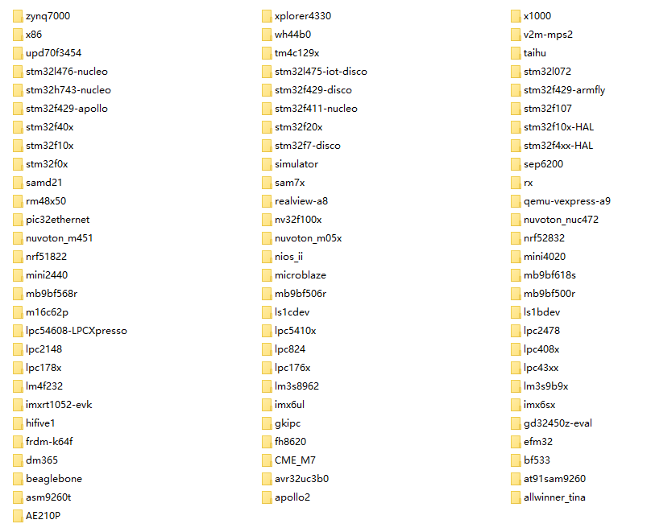

.. vim: syntax=rst

移植RT-Thread到STM32
-----------------

本章开始，先新建一个基于野火STM32全系列（包含M3/4/7）开发板的的RT-Thread的工程模板，让RT-Thread先跑起来。以后所有的RT-
Thread相关的例程我们都在此模板上修改和添加代码，不用再反反复复地新建。在本书配套的例程中，每一章的例程对野火STM32的每一个板子都会有一个对应的例程，但是区别都很小，如果有区别的地方我会在教程里面详细指出，如果没有特别备注那么都是一样的。

获取STM32的裸机工程模板
~~~~~~~~~~~~~~

STM32的裸机工程模板我们直接使用野火STM32开发板配套的固件库例程即可。这里我们选取比较简单的例程—“GPIO输出—使用固件库点亮LED”作为裸机工程模板。该裸机工程模板均可以在对应板子的A盘/程序源码/固件库例程的目录下获取到，下面以野火F103-霸道板子的光盘目录为例，具体见图 13‑1。

|portin002|

图 13‑1 STM32裸机工程模板在光盘资料中的位置

下载RT-Thread Nano 源码
~~~~~~~~~~~~~~~~~~~

Nano是Master的精简版，去掉了一些组件和各种开发板的BSP，保留了OS的核心功能，但足够我们使用。版本已经更新到了3.0.3版本，与Master的版本号一致。

RT-Thread Master的源码可从RT-Thread GitHub仓库地址：\ https://github.com/RT-Thread/rt-thread\ 下载到，Nano就是从里面扣出来的。RT-
Thread官方并没有将抠出来的Nano放到他们的官方网站，而是作为一个Package放在了KEIL网站—\ http://www.keil.com/dd2/pack/\ 中，供用户下载，具体见图 13‑2，目前的版本号是3.0.3，如果以后更新到更高的版本则以最新的版本为准。

|portin003|

图 13‑2 RT-Thread Nano Package

安装RT-Thread Package
~~~~~~~~~~~~~~~~~~~

下载下来之后是一个以exe为后缀的文件，点击安装即可，安装目录与你的KEIL安装目录一样，安装成功之后，可以在KEIL的PACK目录下找到刚刚安装的Package的所有的文件，具体见图 13‑3。

|portin004|

图 13‑3 RT-Thread Nano Package 安装文件

这样安装成功之后，就可以在KEIL里面的软件包管理器中将RT-Thread Nano 直接添加到工程里面，具体见图 13‑4。

|portin005|

图 13‑4从KEIL的软件包管理器中选择RT-Thread Nano Package

往裸机工程添加RT-Thread源码
~~~~~~~~~~~~~~~~~~

拷贝RT-Thread Package到裸机工程根目录
^^^^^^^^^^^^^^^^^^^^^^^^^^^

使用这种方法打包的RT-Thread 工程，拷贝到一台没有安装RT-Thread Package的电脑上面是使用不了的，会提示找不到RT-Thread的源文件。鉴于RT-Thread Package容量很小，我们直接将安装在KEIL PACK 目录下的整个RT-
Thread文件夹拷贝到我们的STM32裸机工程里面，让整个RT-Thread Package 跟随我们的工程一起发布，具体见图 13‑5。

|portin006|

图 13‑5 拷贝RT-Thread Package到裸机工程

图 13‑5中RT-Thread文件夹下就是RT-Thread Nano 的所有东西，该文件夹下的具体内容见表格 13‑1。

表格 13‑1 RT-dhread 文件夹内容组成

============== ==================== ======================
文件夹         文件夹               描述
============== ==================== ======================
rtthread/3.0.3 bsp                  板级支持包
\              components/finsh     RT-Thread组件
\              include              头文件
\              include/libc
\              libcpu/arm/cortex-m0 与处理器相关的接口文件
\              libcpu/arm/cortex-m3
\              libcpu/arm/cortex-m4
\              libcpu/arm/cortex-m7
\              src                  RT-Thread内核源码
============== ==================== ======================

拷贝rtconfig.h文件到user文件夹
^^^^^^^^^^^^^^^^^^^^^^

将RT-Thread/3.0.3/bsp文件夹下面的rtconfig.h配套文件拷贝到工程根目录下面的user文件夹，等下我们需要对这个文件进行修改。

用户可以通过修改这个RT-Thread内核的配置头文件来裁剪RT-Thread的功能，所以我们把它拷贝一份放在user这个文件夹下面。user，见名之义我们就可以知道里面存放的文件都是用户自己编写的。

拷贝board.c文件到user文件夹
^^^^^^^^^^^^^^^^^^^

将RT-Thread/3.0.3/bsp文件夹下面的board.c配套文件拷贝到工程根目录下面的user文件夹，等下我们需要对这个board.c进行修改。

RT-Thread文件夹内容简介
^^^^^^^^^^^^^^^^

接下来我们对RT-Thread文件夹下面的内容做个简单的介绍，好让我们能够更顺心地使用RT-Thread。

bsp文件夹简介
''''''''

bsp文件夹里面存放的是板级支持包，即board support package的英文缩写。RT-Thread为了推广自己，会给各种半导体厂商的评估板写好驱动程序，这些驱动程序就放在bsp这个目录下，我们这里用的是nano版本，只有几款开发板的驱动，具体见图
13‑6，如果是Master版本，则存放了非常多的开发板的驱动，具体见图 13‑7。bsp文件夹下面的board.c这是RT-Thread用来初始化开发板硬件的相关函数。rtconfig.h是RT-Thread功能的配置头文件，里面定义了很多宏，通过这些宏定义，我们可以裁剪RT-
Thread的功能。用户在使用RT-Thread的时候，用户只需要修改board.c和rtconfig.h这两个文件的内容即可，其它文件我们不需要改动。如果为了减小工程的大小，bsp文件夹下面除了board.c和rtconfig.h这两个文件要保留外，其它的统统可以删除。

|portin007|

图 13‑6 RT-Thread Nano bsp 文件夹内容

|portin008|

图 13‑7 RT-Thread Master 文件夹内容（以后会更多）

components文件夹简介
'''''''''''''''

在RT-Thread看来，除了内核，其它第三方加进来的软件都是组件，比如gui、fatfs、lwip和finsh等。那么这些组件就放在components这个文件夹内，目前nano版本只放了finsh，其它的都被删除了，master版本则放了非常多的组件。finsh是RT-
Thread组件里面最具特色的，它通过串口打印的方式来输出各种信息，方便我们调试程序。

include文件夹简介
''''''''''''

include目录下面存放的是RT-Thread内核的头文件，是内核不可分割的一部分。

libcpu文件夹简介
'''''''''''

RT-Thread是一个软件，单片机是一个硬件，RT-
Thread要想运行在一个单片机上面，它们就必须关联在一起，那么怎么关联？还是得通过写代码来关联，这部分关联的文件叫接口文件，通常由汇编和C联合编写。这些接口文件都是跟硬件密切相关的，不同的硬件接口文件是不一样的，但都大同小异。编写这些接口文件的过程我们就叫移植，移植的过程通常由RT-
Thread和mcu原厂的人来负责，移植好的这些接口文件就放在libcpu这个文件夹的目录下。RT-Thread nano目前在libcpu目录下只放了cortex-m0、m3、m4和m7内核的单片机的接口文件，只要是使用了这些内核的mcu都可以使用里面的接口文件。通常网络上出现的叫“移植某某某RT
OS到某某某MCU”的教程，其实准确来说，不能够叫移植，应该叫使用官方的移植，因为这些跟硬件相关的接口文件，RTOS官方都已经写好了，我们只是使用而已。我们本章讲的移植也是使用RT-Thread官方的移植，关于这些底层的移植文件我们已经在第一部分“从0到1教你写RT-
Thread内核”有非常详细的讲解，这里我们直接使用即可。

src文件夹简介
''''''''

src目录下面存放的是RT-Thread内核的源文件，是内核的核心，我们在第一部分“从0到1教你写RT-Thread内核”里面讲解的就是这里面内容。

添加RT-Thread源码到工程组文件夹
^^^^^^^^^^^^^^^^^^^^

在上一步我们只是将RT-Thread的源码放到了本地工程目录下，还没有添加到开发环境里面的组文件夹里面。

新建rtt/source和rtt/ports组
'''''''''''''''''''''''

接下来我们在开发环境里面新建rtt/source和rtt/ports两个组文件夹，其中rtt/source用于存放src文件夹的内容，rtt/ports用于存放libcpu/arm/cortex-m？文件夹的内容，“？”表示3、4或者7，具体选择哪个得看你使用的是野火哪个型号的STM32开发板，具体
见表格 13‑2。

表格 13‑2 野火STM32开发板型号对应RT-Thread的接口文件

=================== ============= ===========================
野火STM32开发板型号 具体芯片型号  RT-Thread不同内核的接口文件
=================== ============= ===========================
MINI                STM32F103RCT6 libcpu/arm/cortex-m3
指南者              STM32F103VET6
霸道                STM32F103ZET6
霸天虎              STM32F407ZGT6 libcpu/arm/cortex-m4
F429-挑战者         STM32F429IGT6
F767-挑战者         STM32F767IGT6 libcpu/arm/cortex-m7
H743-挑战者         STM32H743IIT6
=================== ============= ===========================

bsp里面的rtconfig.h和board.c添加到user组文件夹下，其中rtconfig.h用于配置RT-Thread的功能，board.c用于存放硬件相关的初始化函数。源码添加完毕之后，具体见图 13‑8。

|portin009|

图 13‑8 添加RT-Thread源码到工程组文件夹

指定RT-Thread头文件的路径
'''''''''''''''''

RT-Thread的源码已经添加到开发环境的组文件夹下面，编译的时候需要为这些源文件指定头文件的路径，不然编译会报错。RT-Thread的源码里面只有RT-Thread\3.0.3\components\finsh、RT-Thread\3.0.3\include和RT-
Thread\3.0.3\include\libc这三个文件夹下面有头文件，只需要将这三个头文件的路径在开发环境里面指定即可。同时我们还将RT-Thread\3.0.3\bsp里面的rtconfig.h这个头文件拷贝到了工程根目录下的user文件夹下，所以user的路径也要加到开发环境里面。RT-
Thread头文件的路径添加完成后的效果具体见图 13‑9。

|portin010|

图 13‑9 在开发环境中指定RT-Thread 的头文件的路径

修改rtconfig.h
~~~~~~~~~~~~

rtconfig.h是直接从RT-Thread/3.0.3/bsp文件夹下面拷贝过来的，该头文件对裁剪整个RT-Thread所需的功能的宏均做了定义，有些宏定义被使能，有些宏定义被失能，一开始我们只需要配置最简单的功能即可。要想随心所欲的配置RT-
Thread的功能，我们必须对这些宏定义的功能有所掌握，下面我们先简单的介绍下这些宏定义的含义，然后再对这些宏定义进行修改。

rtconfig.h文件内容讲解
^^^^^^^^^^^^^^^^

代码清单 13‑1 rtconfig.h文件内容

1 /\* RT-Thread config file \*/

2

3 #ifndef \__RTTHREAD_CFG_H_\_

4 #define \__RTTHREAD_CFG_H_\_

5

6 #include "RTE_Components.h" **(1)**

7

8 // <<< Use Configuration Wizard in Context Menu >>> **(2)**

9 // <h>Basic Configuration **(3)**

10 // <o>Maximal level of thread priority <8-256>

11 // <i>Default: 32

12 #define RT_THREAD_PRIORITY_MAX 8 **(3)-①**

13 // <o>OS tick per second

14 // <i>Default: 1000 (1ms)

15 #define RT_TICK_PER_SECOND 100 **(3)-②**

16 // <o>Alignment size for CPU architecture data access

17 // <i>Default: 4

18 #define RT_ALIGN_SIZE 4 **(3)-③**

19 // <o>the max length of object name<2-16>

20 // <i>Default: 8

21 #define RT_NAME_MAX 8 **(3)-④**

22 // <c1>Using RT-Thread components initialization

23 // <i>Using RT-Thread components initialization

24 #define RT_USING_COMPONENTS_INIT **(3)-⑤**

25 // </c>

26 // <c1>Using user main

27 // <i>Using user main

28 #define RT_USING_USER_MAIN **(3)-⑥**

29 // </c>

30 // <o>the size of main thread<1-4086>

31 // <i>Default: 512

32 #define RT_MAIN_THREAD_STACK_SIZE 256 **(3)-⑦**

33

34 // </h>

35

36

37

38

39 // <h>Debug Configuration **(4)**

40 // <c1>enable kernel debug configuration

41 // <i>Default: enable kernel debug configuration

42 //#define RT_DEBUG

43 // </c>

44 // <o>enable components initialization debug configuration<0-1>

45 // <i>Default: 0

46 #define RT_DEBUG_INIT 0

47 // <c1>thread stack over flow detect

48 // <i> Diable Thread stack over flow detect

49 //#define RT_USING_OVERFLOW_CHECK

50 // </c>

51 // </h>

52

53

54

55

56 // <h>Hook Configuration **(5)**

57 // <c1>using hook

58 // <i>using hook

59 //#define RT_USING_HOOK

60 // </c>

61 // <c1>using idle hook

62 // <i>using idle hook

63 //#define RT_USING_IDLE_HOOK

64 // </c>

65 // </h>

66

67

68

69

70 // <e>Software timers Configuration **(6)**

71 // <i> Enables user timers

72 #define RT_USING_TIMER_SOFT 0

73 #if RT_USING_TIMER_SOFT == 0

74 #undef RT_USING_TIMER_SOFT

75 #endif

76 // <o>The priority level of timer thread <0-31>

77 // <i>Default: 4

78 #define RT_TIMER_THREAD_PRIO 4

79 // <o>The stack size of timer thread <0-8192>

80 // <i>Default: 512

81 #define RT_TIMER_THREAD_STACK_SIZE 512

82 // <o>The soft-timer tick per second <0-1000>

83 // <i>Default: 100

84 #define RT_TIMER_TICK_PER_SECOND 100

85 // </e>

86

87

88

89

90 // <h>IPC(Inter-process communication) Configuration **(7)**

91 // <c1>Using Semaphore

92 // <i>Using Semaphore

93 #define RT_USING_SEMAPHORE **(7)-①**

94 // </c>

95 // <c1>Using Mutex

96 // <i>Using Mutex

97 //#define RT_USING_MUTEX **(7)-②**

98 // </c>

99 // <c1>Using Event

100 // <i>Using Event

101 //#define RT_USING_EVENT **(7)-③**

102 // </c>

103 // <c1>Using MailBox

104 // <i>Using MailBox

105 #define RT_USING_MAILBOX **(7)-④**

106 // </c>

107 // <c1>Using Message Queue

108 // <i>Using Message Queue

109 //#define RT_USING_MESSAGEQUEUE **(7)-⑤**

110 // </c>

111 // </h>

112

113

114

115

116

117 // <h>Memory Management Configuration **(8)**

118 // <c1>Using Memory Pool Management

119 // <i>Using Memory Pool Management

120 //#define RT_USING_MEMPOOL **(8)-①**

121 // </c>

122 // <c1>Dynamic Heap Management

123 // <i>Dynamic Heap Management

124 //#define RT_USING_HEAP **(8)-②**

125 // </c>

126 // <c1>using small memory

127 // <i>using small memory

128 #define RT_USING_SMALL_MEM **(8)-③**

129 // </c>

130 // <c1>using tiny size of memory

131 // <i>using tiny size of memory

132 //#define RT_USING_TINY_SIZE **(8)-④**

133 // </c>

134 // </h>

135

136

137

138

139 // <h>Console Configuration **(9)**

140 // <c1>Using console

141 // <i>Using console

142 #define RT_USING_CONSOLE

143 // </c>

144 // <o>the buffer size of console <1-1024>

145 // <i>the buffer size of console

146 // <i>Default: 128 (128Byte)

147 #define RT_CONSOLEBUF_SIZE 128

148 // <s>The device name for console

149 // <i>The device name for console

150 // <i>Default: uart1

151 #define RT_CONSOLE_DEVICE_NAME "uart2"

152 // </h>

153

154

155

156

157 #if defined(RTE_FINSH_USING_MSH) **(10)**

158 #define RT_USING_FINSH

159 #define FINSH_USING_MSH

160 #define FINSH_USING_MSH_ONLY

161 // <h>Finsh Configuration

162 // <o>the priority of finsh thread <1-7>

163 // <i>the priority of finsh thread

164 // <i>Default: 6

165 #define \__FINSH_THREAD_PRIORITY 5

166 #define FINSH_THREAD_PRIORITY (RT_THREAD_PRIORITY_MAX / 8 \* \__FINSH_THREAD_PRIORITY + 1)

167 // <o>the stack of finsh thread <1-4096>

168 // <i>the stack of finsh thread

169 // <i>Default: 4096 (4096Byte)

170 #define FINSH_THREAD_STACK_SIZE 512

171 // <o>the history lines of finsh thread <1-32>

172 // <i>the history lines of finsh thread

173 // <i>Default: 5

174 #define FINSH_HISTORY_LINES 1

175 // <c1>Using symbol table in finsh shell

176 // <i>Using symbol table in finsh shell

177 #define FINSH_USING_SYMTAB

178 // </c>

179 // </h>

180 #endif

181

182

183

184

185

186 #if defined(RTE_USING_DEVICE) **(11)**

187 #define RT_USING_DEVICE

188 #endif

189

190 // <<< end of configuration section >>> **(12)**

191

192 #endif

193

代码清单 13‑1\ **(1)** ：头文件RTE_Components.h是在MDK中添加RT-Thead Package时由MDK自动生成的，目前我们没有使用MDK中自带的RT-
Thread的Package，所以这个头文件不存在，如果包含了该头文件，编译的时候会报错，等下修改rtconfig.h的时候需要注释掉该头文件。

代码清单 13‑1\ **(2)** ：\ **Use Configuration Wizard in Context Menu：**\ 在上下文中使用配置向导来配置rtconfig.h中的宏定义。接下来代码中夹杂的“<h> </h>”、“<o>”“<i>”、“<c1> </c>”和“<e>
</e>”这些符号是MDK自带的配置向导控制符号，使用这些符号控制的代码可以生成一个对应的图形界面的配置向导，rtconfig.h对应的配置向导具体见图 13‑10。有关配置向导的语法，可在MDK的帮助文档里面找到，在搜索栏输入Configuration Wizard 即可搜索到，具体见图
13‑11。具体每一个符号的语法我们这里不做细讲，有兴趣的可以深究下。 对于我个人，还是倾向于直接修改rtconfig.h中的源码，而不是通过这个配置向导来修改，就好比一个老烟枪抽烟的时候你要给他加个过滤嘴，那是不可能的，这辈子都是不可能的。

|portin011|

图 13‑10 rtconfig.h对应的配置向导

|portin012|

图 13‑11 Configuration Wizard

代码清单 13‑1\ **(3)** ：RT-Thread的基本配置，要想RT-Thread准确无误的跑起来，这些基本配置必须得有且正确。

代码清单 13‑1\ **(3)-①** ：RT_THREAD_PRIORITY_MAX这个宏表示RT-Thread支持多少个优先级，取值范围为8~256，默认为32。

代码清单 13‑1\ **(3)-②**\ ：RT_TICK_PER_SECOND 表示操作系统每秒钟有多少个tick，tick即是操作系统的时钟周期，默认为1000，即操作系统的时钟周期tick等于1ms。

代码清单 13‑1\ **(3)-③**\ ：RT_ALIGN_SIZE这个宏表示CPU处理的数据需要多少个字节对齐，默认为4个字节。

代码清单 13‑1\ **(3)-④**\ ：RT_NAME_MAX这个宏表示内核对象名字的最大长度，取值范围为2~16，默认为8。

代码清单 13‑1\ **(3)-⑤**\ ：使用RT-Thread组件初始化，默认使能。

代码清单 13‑1\ **(3)-⑥**\ ：使用用户main函数，默认打开。

代码清单 13‑1\ **(3)-⑦**\ ：main线程栈大小，取值范围为1~4086，单位为字节，默认为512。

代码清单 13‑1\ **(4)**\ ：调试配置。包括了内核调试配置，组件调试配置和线程栈溢出检测，目前全部关闭。

代码清单 13‑1\ **(5)**\ ：钩子函数配置，目前全部关闭。

代码清单 13‑1\ **(6)**\ ：软件定时器配置，目前关闭，不使用软件定时器。

代码清单 13‑1\ **(7)**\ ：内部通信配置，包括信号量、互斥量、事件、邮箱和消息队列，根据需要配置。

代码清单 13‑1\ **(8)**\ ：内存管理配置。

代码清单 13‑1\ **(8)-①**\ ：RT_USING_MEMPOOL这个宏用于表示是否使用内存池，目前关闭，不使用内存池。

代码清单 13‑1\ **(8)-②**\ ：RT_USING_HEAP这个宏用于表示是否堆，目前关闭，不使用堆。

代码清单 13‑1\ **(8)-③**\ ：RT_USING_SMALL_MEM这个宏用于表示是否使用小内存，目前使能。

代码清单 13‑1\ **(8)-④**\ ：RT_USING_TINY_SIZE这个宏用于表示是否使用极小内存，目前关闭，不使用。

代码清单 13‑1\ **(9)**\ ：控制台配置。控制台即是rt_kprintf()函数调试输出的设备，通常使用串口。

代码清单 13‑1\ **(10)**\ ：FINSH配置。

代码清单 13‑1\ **(11)**\ ：设备配置。

代码清单 13‑1\ **(12)**\ ：rtconfig.h配置结束。

rtconfig.h文件修改
^^^^^^^^^^^^^^

rtconfig.h头文件的内容修改的不多，具体是：注释掉头文件RTE_Components.h、修改了RT_THREAD_PRIORITY_MAX、RT_TICK_PER_SECOND和RT_MAIN_THREAD_STACK_SIZE这三个宏的大小，具体见代码清单 13‑2的加粗部分。

代码清单 13‑2 rtconfig.h文件修改

1 /\* RT-Thread config file \*/

2

3 #ifndef \__RTTHREAD_CFG_H_\_

4 #define \__RTTHREAD_CFG_H_\_

5

**6 // #include "RTE_Components.h"**

7

8 // <<< Use Configuration Wizard in Context Menu >>>

9 // <h>Basic Configuration

10 // <o>Maximal level of thread priority <8-256>

11 // <i>Default: 32

**12 #define RT_THREAD_PRIORITY_MAX 32**

13 // <o>OS tick per second

14 // <i>Default: 1000 (1ms)

**15 #define RT_TICK_PER_SECOND 1000**

16 // <o>Alignment size for CPU architecture data access

17 // <i>Default: 4

18 #define RT_ALIGN_SIZE 4

19 // <o>the max length of object name<2-16>

20 // <i>Default: 8

21 #define RT_NAME_MAX 8

22 // <c1>Using RT-Thread components initialization

23 // <i>Using RT-Thread components initialization

24 #define RT_USING_COMPONENTS_INIT

25 // </c>

26 // <c1>Using user main

27 // <i>Using user main

28 #define RT_USING_USER_MAIN

29 // </c>

30 // <o>the size of main thread<1-4086>

31 // <i>Default: 512

**32 #define RT_MAIN_THREAD_STACK_SIZE 512**

33

34 // </h>

35

36

37

38

39 // <h>Debug Configuration

40 // <c1>enable kernel debug configuration

41 // <i>Default: enable kernel debug configuration

42 //#define RT_DEBUG

43 // </c>

44 // <o>enable components initialization debug configuration<0-1>

45 // <i>Default: 0

46 #define RT_DEBUG_INIT 0

47 // <c1>thread stack over flow detect

48 // <i> Diable Thread stack over flow detect

49 //#define RT_USING_OVERFLOW_CHECK

50 // </c>

51 // </h>

52

53

54

55

56 // <h>Hook Configuration

57 // <c1>using hook

58 // <i>using hook

59 //#define RT_USING_HOOK

60 // </c>

61 // <c1>using idle hook

62 // <i>using idle hook

63 //#define RT_USING_IDLE_HOOK

64 // </c>

65 // </h>

66

67

68

69

70 // <e>Software timers Configuration

71 // <i> Enables user timers

72 #define RT_USING_TIMER_SOFT 0

73 #if RT_USING_TIMER_SOFT == 0

74 #undef RT_USING_TIMER_SOFT

75 #endif

76 // <o>The priority level of timer thread <0-31>

77 // <i>Default: 4

78 #define RT_TIMER_THREAD_PRIO 4

79 // <o>The stack size of timer thread <0-8192>

80 // <i>Default: 512

81 #define RT_TIMER_THREAD_STACK_SIZE 512

82 // <o>The soft-timer tick per second <0-1000>

83 // <i>Default: 100

84 #define RT_TIMER_TICK_PER_SECOND 100

85 // </e>

86

87

88

89

90 // <h>IPC(Inter-process communication) Configuration

91 // <c1>Using Semaphore

92 // <i>Using Semaphore

93 #define RT_USING_SEMAPHORE

94 // </c>

95 // <c1>Using Mutex

96 // <i>Using Mutex

97 //#define RT_USING_MUTEX

98 // </c>

99 // <c1>Using Event

100 // <i>Using Event

101 //#define RT_USING_EVENT

102 // </c>

103 // <c1>Using MailBox

104 // <i>Using MailBox

105 #define RT_USING_MAILBOX

106 // </c>

107 // <c1>Using Message Queue

108 // <i>Using Message Queue

109 //#define RT_USING_MESSAGEQUEUE

110 // </c>

111 // </h>

112

113

114

115

116

117 // <h>Memory Management Configuration

118 // <c1>Using Memory Pool Management

119 // <i>Using Memory Pool Management

120 //#define RT_USING_MEMPOOL

121 // </c>

122 // <c1>Dynamic Heap Management

123 // <i>Dynamic Heap Management

124 //#define RT_USING_HEAP

125 // </c>

126 // <c1>using small memory

127 // <i>using small memory

128 #define RT_USING_SMALL_MEM

129 // </c>

130 // <c1>using tiny size of memory

131 // <i>using tiny size of memory

132 //#define RT_USING_TINY_SIZE

133 // </c>

134 // </h>

135

136

137

138

139 // <h>Console Configuration

140 // <c1>Using console

141 // <i>Using console

142 #define RT_USING_CONSOLE

143 // </c>

144 // <o>the buffer size of console <1-1024>

145 // <i>the buffer size of console

146 // <i>Default: 128 (128Byte)

147 #define RT_CONSOLEBUF_SIZE 128

148 // <s>The device name for console

149 // <i>The device name for console

150 // <i>Default: uart1

151 #define RT_CONSOLE_DEVICE_NAME "uart2"

152 // </h>

153

154

155

156

157 #if defined(RTE_FINSH_USING_MSH)

158 #define RT_USING_FINSH

159 #define FINSH_USING_MSH

160 #define FINSH_USING_MSH_ONLY

161 // <h>Finsh Configuration

162 // <o>the priority of finsh thread <1-7>

163 // <i>the priority of finsh thread

164 // <i>Default: 6

165 #define \__FINSH_THREAD_PRIORITY 5

166 #define FINSH_THREAD_PRIORITY (RT_THREAD_PRIORITY_MAX / 8 \* \__FINSH_THREAD_PRIORITY + 1)

167 // <o>the stack of finsh thread <1-4096>

168 // <i>the stack of finsh thread

169 // <i>Default: 4096 (4096Byte)

170 #define FINSH_THREAD_STACK_SIZE 512

171 // <o>the history lines of finsh thread <1-32>

172 // <i>the history lines of finsh thread

173 // <i>Default: 5

174 #define FINSH_HISTORY_LINES 1

175 // <c1>Using symbol table in finsh shell

176 // <i>Using symbol table in finsh shell

177 #define FINSH_USING_SYMTAB

178 // </c>

179 // </h>

180 #endif

181

182

183

184

185

186 #if defined(RTE_USING_DEVICE)

187 #define RT_USING_DEVICE

188 #endif

189

190 // <<< end of configuration section >>>

191

192 #endif

修改board.c
~~~~~~~~~

board.c文件内容讲解
^^^^^^^^^^^^^

board.c是直接从RT-Thread/3.0.3/bsp文件夹下面拷贝过来的，里面存放的是与硬件相关的初始化函数，整个 board.c中的内容具体见代码清单 13‑3。

代码清单 13‑3 board.c文件内容

1 /\* RT-Thread相关头文件 \*/ **(1)**

2 #include <rthw.h>

3 #include <rtthread.h>

4 /*==========================**(2)开始**\ ==============================*/

5 /\* 内核外设NVIC相关的寄存器定义 \*/

6 #define \_SCB_BASE (0xE000E010UL)

7 #define \_SYSTICK_CTRL (*(rt_uint32_t \*)(_SCB_BASE + 0x0))

8 #define \_SYSTICK_LOAD (*(rt_uint32_t \*)(_SCB_BASE + 0x4))

9 #define \_SYSTICK_VAL (*(rt_uint32_t \*)(_SCB_BASE + 0x8))

10 #define \_SYSTICK_CALIB (*(rt_uint32_t \*)(_SCB_BASE + 0xC))

11 #define \_SYSTICK_PRI (*(rt_uint8_t \*)(0xE000ED23UL))

12

13 /\* 外部时钟和函数声明 \*/

14 extern void SystemCoreClockUpdate(void);

15 extern uint32_t SystemCoreClock;

16

17 /\* 系统定时器SysTick初始化 \*/

18 static uint32_t \_SysTick_Config(rt_uint32_t ticks)

19 {

20 if ((ticks - 1) > 0xFFFFFF)

21 {

22 return 1;

23 }

24

25 \_SYSTICK_LOAD = ticks - 1;

26 \_SYSTICK_PRI = 0xFF;

27 \_SYSTICK_VAL = 0;

28 \_SYSTICK_CTRL = 0x07;

29

30 return 0;

31 }

32 /*==========================**(2)结束**\ ===========================*/

33

34

35 #if defined(RT_USING_USER_MAIN) && defined(RT_USING_HEAP) **(3)**

36 #define RT_HEAP_SIZE 1024

37 /\* 从内部SRAM里面分配一部分静态内存来作为rtt的堆空间，这里配置为4KB \*/

38 static uint32_t rt_heap[RT_HEAP_SIZE];

39 RT_WEAK void \*rt_heap_begin_get(void)

40 {

41 return rt_heap;

42 }

43

44 RT_WEAK void \*rt_heap_end_get(void)

45 {

46 return rt_heap + RT_HEAP_SIZE;

47 }

48 #endif

49

50 /*\*

51 \* @brief 开发板硬件初始化函数

52 \* @param 无

53 \* @retval 无

54 \*

55 \* @attention

56 \* RTT把开发板相关的初始化函数统一放到board.c文件中实现，

57 \* 当然，你想把这些函数统一放到main.c文件也是可以的。

58 \*/

59 void rt_hw_board_init() **(4)**

60 {

61 /\* 更新系统时钟 \*/

62 SystemCoreClockUpdate(); **(4)-①**

63

64 /\* SysTick初始化 \*/

65 \_SysTick_Config(SystemCoreClock / RT_TICK_PER_SECOND); **(4)-②**

66

67 /\* 硬件BSP初始化统统放在这里，比如LED，串口，LCD等 \*/ **(4)-③**

68

69 /\* 调用组件初始化函数 (use INIT_BOARD_EXPORT()) \*/

70 #ifdef RT_USING_COMPONENTS_INIT

71 rt_components_board_init(); **(4)-④**

72 #endif

73

74 #if defined(RT_USING_CONSOLE) && defined(RT_USING_DEVICE)

75 rt_console_set_device(RT_CONSOLE_DEVICE_NAME); **(4)-⑤**

76 #endif

77

78 #if defined(RT_USING_USER_MAIN) && defined(RT_USING_HEAP)

79 rt_system_heap_init(rt_heap_begin_get(), rt_heap_end_get());\ **(4)-⑥**

80 #endif

81 }

82

83 /*\*

84 \* @brief SysTick中断服务函数

85 \* @param 无

86 \* @retval 无

87 \*

88 \* @attention

89 \* SysTick中断服务函数在固件库文件stm32f10x_it.c中也定义了，而现在

90 \* 在board.c中又定义一次，那么编译的时候会出现重复定义的错误，解决

91 \* 方法是可以把stm32f10x_it.c中的注释或者删除即可。

92 \*/

93 void SysTick_Handler(void) **(5)**

94 {

95 /\* 进入中断 \*/

96 rt_interrupt_enter();

97

98 /\* 更新时基 \*/

99 rt_tick_increase();

100

101 /\* 离开中断 \*/

102 rt_interrupt_leave();

103 }

104

代码清单 13‑3\ **(1)**\ ：RT-Thread相关头文件，rthw.h是处理器相关，rtthread与内核相关。

代码清单 13‑3\ **(2)**\ ：SysTick相关的寄存器定义和初始化函数，这个是跟处理器相关的，等下我们直接使用固件库函数，可以把这部分注释掉，也可以保留，看个人喜好。

代码清单 13‑3\ **(3)**\ ：RT-Thread堆配置，如果同时定义了RT_USING_USER_MAIN和 RT_USING_HEAP这两个宏，表示RT-Thread里面创建内核对象时使用动态内存分配方案。堆可以是内部的SRAM也可以是外部的SRAM或SDRAM，目前的方法是从内部SR
AM里面分配一部分静态内存来作为堆空间，这里配置为4KB。rt_heap_begin_get()和rt_heap_end_get()这两个函数表示堆的起始地址和结束地址。这两个函数前面的宏RT_WEAK的原型是关键字__weak，表示若定义，即其它地方定义了rt_heap_begin_get()和r
t_heap_end_get()这两个函数实体，被__weak修饰的函数就会被覆盖。

RT_USING_USER_MAIN和RT_USING_HEAP这两个宏在rtconfig.h中定义，RT_USING_USER_MAIN默认使能，通过使能或者失能RT_USING_HEAP这个宏来选择使用静态或者动态内存。无论是使用静态还是动态内存方案，使用的都是内部的SRAM，区别是使用的内存是
在程序编译的时候分配还是在运行的时候分配。

rt_hw_board_init()函数
''''''''''''''''''''

代码清单 13‑3\ **(4)**\ ：RT-Thread启动的时候会调用一个名为rt_hw_board_init()的函数，从函数名称我们可以知道它是用来初始化开发板硬件的，比如时钟，比如串口等，具体初始化什么由用户选择。当这些硬件初始化好之后，RT-Thread才继续往下启动。至于RT-
Thread是哪个文件里面的哪个函数会调用rt_hw_board_init()，我们在本章先不细讲，留到接下来的“RT-Thread的启动流程”章节再深究，这里我们只需要知道我们用户要自己编写一个rt_hw_board_init()的函数供RT-Thread启动的时候调用即可。

代码清单 13‑3\ **(4)-①**\ ：更新系统时钟，如果硬件已经能够跑起来都表示系统时钟是没有问题的，该函数一般由固件库提供。

代码清单 13‑3\ **(4)-②**\ ：初始化系统定时器SysTick，SysTick给操作系统提供时基，1个时基我们称之为一个tick，tick是操作系统最小的时间单位。RT_TICK_PER_SECOND是一个在rtconfig.h中定义的宏，用于配置SysTick每秒中断多少次，这里配置
为1000，即1秒钟内SysTick会中断1000次，即中断周期为1ms。 这部分功能等下我们会用固件库函数SysTick_Config()来代替。

代码清单 13‑3\ **(4)-③**\ ：硬件BSP初始化统统放在这里，比如LED，串口，LCD等。目前我们暂时没有初始化任何开发板的硬件。

代码清单 13‑3\ **(4)-④**\ ：这部分是RT-Thread为开发板组件提供的一个初始化函数，该函数在components.c里面实现，由rtconfig.h里面的宏RT_USING_COMPONENTS_INIT决定是否调用，默认是开启。

代码清单 13‑3\ **(4)-⑤**\ ：rt_console_set_device()是RT-
Thread提供的一个控制台设置函数，它将指定rt_kprintf()函数的输出内容具体从什么设备打印出来。该函数在kservice.c里面实现，由rtconfig.h里面的RT_USING_CONSOLE和RT_USING_DEVICE这两个宏决定是否调用，目前我们暂时不用。

代码清单 13‑3\ **(4)-⑥**\ ：rt_system_heap_init()是RT-Thread提供的一个内存初始化函数，只有在使用RT-
Thread提供的动态内存分配函数时才需要使用到。该函数在mem.c里面实现，由rtconfig.h里面的RT_USING_HEAP和RT_USING_USER_MAIN这两个决定是否调用，目前我们暂时不用。

SysTick_Handler()函数
'''''''''''''''''''

代码清单 13‑3\ **(5)**\ ：SysTick中断服务函数是一个非常重要的函数，RT-Thread所有跟时间相关的事情都在里面处理，具体实现见代码清单 13‑4。

代码清单 13‑4 SysTick_Handler()函数

1 /*\*

2 \* @brief SysTick中断服务函数

3 \* @param 无

4 \* @retval 无

5 \*

6 \* @attention

7 \* SysTick中断服务函数在固件库文件stm32f10x_it.c中也定义了，而现在

8 \* 在board.c中又定义一次，那么编译的时候会出现重复定义的错误，解决

9 \* 方法是可以把stm32f10x_it.c中的注释或者删除即可。

10 \*/

11 void SysTick_Handler(void)

12 {

13 /\* 进入中断 \*/

14 rt_interrupt_enter(); **(1)**

15

16 /\* 更新时基 \*/

17 rt_tick_increase(); **(2)**

18

19 /\* 离开中断 \*/

20 rt_interrupt_leave(); **(3)**

21 }

代码清单 13‑4 **(1)**\ ：进入中断，对中断计数器rt_interrupt_nest加1操作。

代码清单 13‑4\ **(2)**\ ：rt_tick_increase()用于更新时基，实现时间片，扫描系统定时器。

代码清单 13‑4\ **(3)** ：退出中断，对中断计数器rt_interrupt_nest减1操作。

board.c文件修改
^^^^^^^^^^^

board.c文件内容修改的并不多，具体见代码清单 13‑5的加粗部分。

代码清单 13‑5 board.c文件修改

1 /\* 开发板硬件相关头文件 \*/

**2 #include "board.h"** **修改(1)**

3

4 /\* RT-Thread相关头文件 \*/

5 #include <rthw.h>

6 #include <rtthread.h>

7

8 #if 0

**9 /*========================================================*/ 修改(2)**

**10 /\* 内核外设NVIC相关的寄存器定义 \*/**

**11 #define \_SCB_BASE (0xE000E010UL)**

**12 #define \_SYSTICK_CTRL (*(rt_uint32_t \*)(_SCB_BASE + 0x0))**

**13 #define \_SYSTICK_LOAD (*(rt_uint32_t \*)(_SCB_BASE + 0x4))**

**14 #define \_SYSTICK_VAL (*(rt_uint32_t \*)(_SCB_BASE + 0x8))**

**15 #define \_SYSTICK_CALIB (*(rt_uint32_t \*)(_SCB_BASE + 0xC))**

**16 #define \_SYSTICK_PRI (*(rt_uint8_t \*)(0xE000ED23UL))**

**17**

**18 /\* 外部时钟和函数声明 \*/**

**19 extern void SystemCoreClockUpdate(void);**

**20 extern uint32_t SystemCoreClock;**

**21**

**22 /\* 系统定时器SysTick初始化 \*/**

**23 static uint32_t \_SysTick_Config(rt_uint32_t ticks)**

**24 {**

**25 if ((ticks - 1) > 0xFFFFFF)**

**26 {**

**27 return 1;**

**28 }**

**29**

**30 \_SYSTICK_LOAD = ticks - 1;**

**31 \_SYSTICK_PRI = 0xFF;**

**32 \_SYSTICK_VAL = 0;**

**33 \_SYSTICK_CTRL = 0x07;**

**34**

**35 return 0;**

**36 }**

**37 /*=====================================================*/**

**38 #endif**

39

40 #if defined(RT_USING_USER_MAIN) && defined(RT_USING_HEAP)

41 #define RT_HEAP_SIZE 1024

42 /\* 从内部SRAM里面分配一部分静态内存来作为rtt的堆空间，这里配置为4KB \*/

43 static uint32_t rt_heap[RT_HEAP_SIZE];

44 RT_WEAK void \*rt_heap_begin_get(void)

45 {

46 return rt_heap;

47 }

48

49 RT_WEAK void \*rt_heap_end_get(void)

50 {

51 return rt_heap + RT_HEAP_SIZE;

52 }

53 #endif

54

55 /*\*

56 \* @brief 开发板硬件初始化函数

57 \* @param 无

58 \* @retval 无

59 \*

60 \* @attention

61 \* RTT把开发板相关的初始化函数统一放到board.c文件中实现，

62 \* 当然，你想把这些函数统一放到main.c文件也是可以的。

63 \*/

64 void rt_hw_board_init()

65 {

**66 #if 0 修改(3)**

**67 /\* 更新系统时钟 \*/**

**68 SystemCoreClockUpdate();**

**69**

**70 /\* SysTick初始化 \*/**

**71 \_SysTick_Config(SystemCoreClock / RT_TICK_PER_SECOND);**

**72 #endif**

**73 /\* 初始化SysTick \*/**

**74 SysTick_Config( SystemCoreClock / RT_TICK_PER_SECOND );**

75

76 /\* 硬件BSP初始化统统放在这里，比如LED，串口，LCD等 \*/

77

78 /\* 调用组件初始化函数 (use INIT_BOARD_EXPORT()) \*/

79 #ifdef RT_USING_COMPONENTS_INIT

80 rt_components_board_init();

81 #endif

82

83 #if defined(RT_USING_CONSOLE) && defined(RT_USING_DEVICE)

84 rt_console_set_device(RT_CONSOLE_DEVICE_NAME);

85 #endif

86

87 #if defined(RT_USING_USER_MAIN) && defined(RT_USING_HEAP)

88 rt_system_heap_init(rt_heap_begin_get(), rt_heap_end_get());

89 #endif

90 }

91

92 /*\*

93 \* @brief SysTick中断服务函数

94 \* @param 无

95 \* @retval 无

96 \*

97 \* @attention

98 \* SysTick中断服务函数在固件库文件stm32f10x_it.c中也定义了，而现在

99 \* 在board.c中又定义一次，那么编译的时候会出现重复定义的错误，解决

100 \* 方法是可以把stm32f10x_it.c中的注释或者删除即可。

101 \*/

102 void SysTick_Handler(void)

103 {

104 /\* 进入中断 \*/

105 rt_interrupt_enter();

106

107 /\* 更新时基 \*/

108 rt_tick_increase();

109

110 /\* 离开中断 \*/

111 rt_interrupt_leave();

112 }

113

代码清单 13‑5\ **修改(1)**\ ：在user目录下新建一个board.h头文件，用来包含固件库和BSP相关的头文件和存放board.c里面的函数声明，具体见代码清单 13‑6。

代码清单 13‑6 board.h文件内容

1 #ifndef \__BOARD_H_\_

2 #define \__BOARD_H_\_

3

4 /\*

5 \\*

6 \* 包含的头文件

7 \\*

8 \*/

9 /\* STM32 固件库头文件 \*/

10 #include "stm32f10x.h"

11

12 /\* 开发板硬件bsp头文件 \*/

13 #include "bsp_led.h"

14

15 /\*

16 \\*

17 \* 函数声明

18 \\*

19 \*/

20 void rt_hw_board_init(void);

21 void SysTick_Handler(void);

22

23

24 #endif /\* \__BOARD_H_\_ \*/

代码清单 13‑5\ **修改(2)**\ ：SysTick相关的寄存器和初始化函数统统屏蔽掉，将由固件库文件core_cm3/4/7里面的替代。

代码清单 13‑5\ **修改(3)**\ ：SysTick初始化函数由固件库文件core_cm3/4/7里面的SysTick_Config()函数替代。

如果使用的是HAL库（目前野火只在STM32 M7系列中使用HAL库），则必须添加系统时钟初始化函数，这个函数在我们利用STM32CubeMX代码生成工具配置工程时会自动给我们生成，我们只需添加到rt_hw_board_init()函数进行初始化即可，具体见代码清单 13‑7加粗部分。

代码清单 13‑7修改使用HAL库的board.c文件

1 /\* 开发板硬件相关头文件 \*/

2 #include "board.h"

3

4 /\* RT-Thread相关头文件 \*/

5 #include <rthw.h>

6 #include <rtthread.h>

7

8

9 #if defined(RT_USING_USER_MAIN) && defined(RT_USING_HEAP)

10 #define RT_HEAP_SIZE 1024

11 /\* 从内部SRAM里面分配一部分静态内存来作为rtt的堆空间，这里配置为4KB \*/

12 static uint32_t rt_heap[RT_HEAP_SIZE];

13 RT_WEAK void \*rt_heap_begin_get(void)

14 {

15 return rt_heap;

16 }

17

18 RT_WEAK void \*rt_heap_end_get(void)

19 {

20 return rt_heap + RT_HEAP_SIZE;

21 }

22 #endif

23

24 /*\*

25 \* @brief 开发板硬件初始化函数

26 \* @param 无

27 \* @retval 无

28 \*

29 \* @attention

30 \* RTT把开发板相关的初始化函数统一放到board.c文件中实现，

31 \* 当然，你想把这些函数统一放到main.c文件也是可以的。

32 \*/

33 void rt_hw_board_init()

34 {

**35 /\* 系统时钟初始化成72MHz \*/**

**36 SystemClock_Config(); (1)**

37

**38 /\* 初始化SysTick \*/**

**39 HAL_SYSTICK_Config( HAL_RCC_GetSysClockFreq()/RT_TICK_PER_SECOND); (2)**

40

41 /\* 硬件BSP初始化统统放在这里，比如LED，串口，LCD等 \*/

42

43

44 /\* 调用组件初始化函数 (use INIT_BOARD_EXPORT()) \*/

45 #ifdef RT_USING_COMPONENTS_INIT

46 rt_components_board_init();

47 #endif

48

49 #if defined(RT_USING_CONSOLE) && defined(RT_USING_DEVICE)

50 rt_console_set_device(RT_CONSOLE_DEVICE_NAME);

51 #endif

52

53 #if defined(RT_USING_USER_MAIN) && defined(RT_USING_HEAP)

54 rt_system_heap_init(rt_heap_begin_get(), rt_heap_end_get());

55 #endif

56 }

57

58 /*\*

59 \* @brief SysTick中断服务函数

60 \* @param 无

61 \* @retval 无

62 \*

63 \* @attention

64 \* SysTick中断服务函数在固件库文件stm32f10x_it.c中也定义了，而现在

65 \* 在board.c中又定义一次，那么编译的时候会出现重复定义的错误，解决

66 \* 方法是可以把stm32f10x_it.c中的注释或者删除即可。

67 \*/

68 void SysTick_Handler(void)

69 {

70 /\* 进入中断 \*/

71 rt_interrupt_enter();

72

73 /\* 更新时基 \*/

74 rt_tick_increase();

75

76 /\* 离开中断 \*/

77 rt_interrupt_leave();

78 }

79

80

81

82

83 /*\*

84 \* @brief System Clock 配置

85 \* system Clock 配置如下:

86 \* System Clock source = PLL (HSE)

87 \* SYSCLK(Hz) = 400000000 (CPU Clock)

88 \* HCLK(Hz) = 200000000 (AXI and AHBs Clock)

89 \* AHB Prescaler = 2

90 \* D1 APB3 Prescaler = 2 (APB3 Clock 100MHz)

91 \* D2 APB1 Prescaler = 2 (APB1 Clock 100MHz)

92 \* D2 APB2 Prescaler = 2 (APB2 Clock 100MHz)

93 \* D3 APB4 Prescaler = 2 (APB4 Clock 100MHz)

94 \* HSE Frequency(Hz) = 25000000

95 \* PLL_M = 5

96 \* PLL_N = 160

97 \* PLL_P = 2

98 \* PLL_Q = 4

99 \* PLL_R = 2

100 \* VDD(V) = 3.3

101 \* Flash Latency(WS) = 4

102 \* @param None

103 \* @retval None

104 \*/

**105 static void SystemClock_Config(void) (3)**

106 {

107 RCC_ClkInitTypeDef RCC_ClkInitStruct;

108 RCC_OscInitTypeDef RCC_OscInitStruct;

109 HAL_StatusTypeDef ret = HAL_OK;

110

111 /*使能供电配置更新 \*/

112 MODIFY_REG(PWR->CR3, PWR_CR3_SCUEN, 0);

113

114 /\* 当器件的时钟频率低于最大系统频率时，电压调节可以优化功耗，

115 关于系统频率的电压调节值的更新可以参考产品数据手册。 \*/

116 \__HAL_PWR_VOLTAGESCALING_CONFIG(PWR_REGULATOR_VOLTAGE_SCALE1);

117

118 while (!__HAL_PWR_GET_FLAG(PWR_FLAG_VOSRDY)) {}

119

120 /\* 启用HSE振荡器并使用HSE作为源激活PLL \*/

121 RCC_OscInitStruct.OscillatorType = RCC_OSCILLATORTYPE_HSE;

122 RCC_OscInitStruct.HSEState = RCC_HSE_ON;

123 RCC_OscInitStruct.HSIState = RCC_HSI_OFF;

124 RCC_OscInitStruct.CSIState = RCC_CSI_OFF;

125 RCC_OscInitStruct.PLL.PLLState = RCC_PLL_ON;

126 RCC_OscInitStruct.PLL.PLLSource = RCC_PLLSOURCE_HSE;

127

128 RCC_OscInitStruct.PLL.PLLM = 5;

129 RCC_OscInitStruct.PLL.PLLN = 160;

130 RCC_OscInitStruct.PLL.PLLP = 2;

131 RCC_OscInitStruct.PLL.PLLR = 2;

132 RCC_OscInitStruct.PLL.PLLQ = 4;

133

134 RCC_OscInitStruct.PLL.PLLVCOSEL = RCC_PLL1VCOWIDE;

135 RCC_OscInitStruct.PLL.PLLRGE = RCC_PLL1VCIRANGE_2;

136 ret = HAL_RCC_OscConfig(&RCC_OscInitStruct);

137 if (ret != HAL_OK) {

138

139 while (1) {

140 ;

141 }

142 }

143

144 /\* 选择PLL作为系统时钟源并配置总线时钟分频器 \*/

145 RCC_ClkInitStruct.ClockType = (RCC_CLOCKTYPE_SYSCLK \| \\

146 RCC_CLOCKTYPE_HCLK \| \\

147 RCC_CLOCKTYPE_D1PCLK1 \| \\

148 RCC_CLOCKTYPE_PCLK1 \| \\

149 RCC_CLOCKTYPE_PCLK2 \| \\

150 RCC_CLOCKTYPE_D3PCLK1);

151 RCC_ClkInitStruct.SYSCLKSource = RCC_SYSCLKSOURCE_PLLCLK;

152 RCC_ClkInitStruct.SYSCLKDivider = RCC_SYSCLK_DIV1;

153 RCC_ClkInitStruct.AHBCLKDivider = RCC_HCLK_DIV2;

154 RCC_ClkInitStruct.APB3CLKDivider = RCC_APB3_DIV2;

155 RCC_ClkInitStruct.APB1CLKDivider = RCC_APB1_DIV2;

156 RCC_ClkInitStruct.APB2CLKDivider = RCC_APB2_DIV2;

157 RCC_ClkInitStruct.APB4CLKDivider = RCC_APB4_DIV2;

158 ret = HAL_RCC_ClockConfig(&RCC_ClkInitStruct, FLASH_LATENCY_4);

159 if (ret != HAL_OK) {

160 while (1) {

161 ;

162 }

163 }

164 }

165

166 /END OF FILE/

167

代码清单 13‑7\ **(1)**\ ：添加系统时钟初始化函数在\ **(3)** 实现，为内部调用函数。

代码清单 13‑7\ **(2)**\ ：初始化系统时钟之后，需要对SysTick进行初始化，因为系统时钟初始化函数会在最后将SysTick的时钟也进行初始化为HAL库中默认的时钟，不满足我们系统的要求，所以我们只能使用HAL_SYSTICK_Config将SysTick重新初始化，根据我们的RT_
TICK_PER_SECOND宏定义进行配置。保证系统正常运行。

添加core_delay.c和core_delay.h文件
~~~~~~~~~~~~~~~~~~~~~~~~~~~~~

只有在使用HAL库时才需要添加core_delay.c和core_delay.h文件。野火只在其M7系列的开发板使用了HAL，M4和M3使用的是标准库，不需要添加。

在ST的Cortex-M7内核系列的单片机中，就不再支持标准库而是推出了HAL库，目前，野火只在STM32 M7系列中使用HAL库。

HAL是意思是Hardware Abstraction Layer，即硬件抽象层。用一句话概括就是现在这个库与标准库相比，与底层硬件的相关性大大地降低，程序可移植性大大提高，电工写程序更easy，可以像计算机的码农那样写代码。对于小白来说，Coding的门槛虽然降低了，但是HAL带来的占用内存大，编
译慢是很多老手不喜欢的，特别是我，我就很不喜欢，编译一次7分钟，简直是要了我的老命。鉴于HAL的优缺点，我个人观点是比较适合ST Cortex-M7内核系列这种大内存，高性能的MCU，虽然Cortex-M3/M4也有HAL库，但是还是使用标准库比较好。

HAL库驱动中，由于某些外设的驱动需要使用超时判断（比如I2C、SPI、SDIO等），需要精确延时（精度为1ms），使用的是SysTick，但是在操作系统里面，我们需要使用SysTick来提供系统时基，那么就冲突了，怎么办？我们采取的做法是重写HAL库里面延时相关的函数，只有三个：HAL_InitT
ick()、HAL_GetTick()和HAL_Delay()，这三个函数在HAL库中都是弱定义函数（函数开头带__weak关键字），弱定义的意思是只要用户重写这三个函数，原来HAL库里面的就会无效。

在Cortex-M内核里面有一个外设叫DWT(Data Watchpoint and Trace)， 该外设有一个32位的寄存器叫CYCCNT，它是一个向上的计数器， 记录的是内核时钟运行的个数，最长能记录的时间为： 10.74s = 2的32次方/400000000
(CYCNNT从0开始计数到溢出，最长的延时时间与内核的频率有关，假设内核频率为400M，内核时钟跳一次的时间大概为1/400M=2.5ns)
，当CYCCNT溢出之后，会清0重新开始向上计数。这种延时方案不仅精确，而且还不占用单片机的外设资源，非常方便。所以HAL库里面刚刚讲到的需要重写的三个函数我们都基于CYCCNT的方案来实现，具体的实现见代码清单 13‑8和代码清单
13‑9的加粗部分，其中core_delay.c和core_delay.h这两个文件我们已经写好，放在user文件夹下即可，具体的使用方法看注释。

代码清单 13‑8 core_delay.c文件内容

1 /*\*

2 \\*

3 \* @file core_delay.c

4 \* @author fire

5 \* @version V1.0

6 \* @date 2018-xx-xx

7 \* @brief 使用内核寄存器精确延时

8 \\*

9 \* @attention

10 \*

11 \* 实验平台:野火 STM32H743开发板

12 \* 论坛 :http://www.firebbs.cn

13 \* 淘宝 :https://fire-stm32.taobao.com

14 \*

15 \\*

16 \*/

17

18 #include "./delay/core_delay.h"

19

20

21 /\*

22 \\*

23 \* 时间戳相关寄存器定义

24 \\*

25 \*/

26 /\*

27 在Cortex-M里面有一个外设叫DWT(Data Watchpoint and Trace)，

28 该外设有一个32位的寄存器叫CYCCNT，它是一个向上的计数器，

29 记录的是内核时钟运行的个数，最长能记录的时间为：

30 10.74s=2的32次方/400000000

31 (假设内核频率为400M，内核跳一次的时间大概为1/400M=2.5ns)

32 当CYCCNT溢出之后，会清0重新开始向上计数。

33 使能CYCCNT计数的操作步骤：

34 1、先使能DWT外设，这个由另外内核调试寄存器DEMCR的位24控制，写1使能

35 2、使能CYCCNT寄存器之前，先清0

36 3、使能CYCCNT寄存器，这个由DWT_CTRL(代码上宏定义为DWT_CR)的位0控制，写1使能

37 \*/

38

39

40 #define DWT_CR \*(__IO uint32_t \*)0xE0001000

41 #define DWT_CYCCNT \*(__IO uint32_t \*)0xE0001004

42 #define DEM_CR \*(__IO uint32_t \*)0xE000EDFC

43

44

45 #define DEM_CR_TRCENA (1 << 24)

46 #define DWT_CR_CYCCNTENA (1 << 0)

47

48

49 /*\*

50 \* @brief 初始化时间戳

51 \* @param 无

52 \* @retval 无

53 \* @note 使用延时函数前，必须调用本函数

54 \*/

**55 HAL_StatusTypeDef HAL_InitTick(uint32_t TickPriority) (1)**

**56 {**

**57 /\* 使能DWT外设 \*/**

**58 DEM_CR \|= (uint32_t)DEM_CR_TRCENA;**

**59**

**60 /\* DWT CYCCNT寄存器计数清0 \*/**

**61 DWT_CYCCNT = (uint32_t)0u;**

**62**

**63 /\* 使能Cortex-M DWT CYCCNT寄存器 \*/**

**64 DWT_CR \|= (uint32_t)DWT_CR_CYCCNTENA;**

**65**

**66 return HAL_OK;**

**67 }**

68

69 /*\*

70 \* @brief 读取当前时间戳

71 \* @param 无

72 \* @retval 当前时间戳，即DWT_CYCCNT寄存器的值

73 \*/

74 uint32_t CPU_TS_TmrRd(void)

75 {

76 return ((uint32_t)DWT_CYCCNT);

77 }

78

79 /*\*

80 \* @brief 读取当前时间戳

81 \* @param 无

82 \* @retval 当前时间戳，即DWT_CYCCNT寄存器的值

83 \*/

**84 uint32_t HAL_GetTick(void) (2)**

**85 {**

**86 return ((uint32_t)DWT_CYCCNT*1000/SysClockFreq);**

**87 }**

88

89

90 /*\*

91 \* @brief 采用CPU的内部计数实现精确延时，32位计数器

92 \* @param us : 延迟长度，单位1 us

93 \* @retval 无

94 \* @note 使用本函数前必须先调用CPU_TS_TmrInit函数使能计数器，

95 或使能宏CPU_TS_INIT_IN_DELAY_FUNCTION

96 最大延时值为8秒，即8*1000*1000

97 \*/

98 void CPU_TS_Tmr_Delay_US(uint32_t us)

99 {

100 uint32_t ticks;

101 uint32_t told,tnow,tcnt=0;

102

103 /\* 在函数内部初始化时间戳寄存器， \*/

104 #if (CPU_TS_INIT_IN_DELAY_FUNCTION)

105 /\* 初始化时间戳并清零 \*/

106 HAL_InitTick(5);

107 #endif

108

109 ticks = us \* (GET_CPU_ClkFreq() / 1000000); /\* 需要的节拍数 \*/

110 tcnt = 0;

111 told = (uint32_t)CPU_TS_TmrRd(); /\* 刚进入时的计数器值 \*/

112

113 while (1) {

114 tnow = (uint32_t)CPU_TS_TmrRd();

115 if (tnow != told) {

116 /\* 32位计数器是递增计数器 \*/

117 if (tnow > told) {

118 tcnt += tnow - told;

119 }

120 /\* 重新装载 \*/

121 else {

122 tcnt += UINT32_MAX - told + tnow;

123 }

124

125 told = tnow;

126

127 /*时间超过/等于要延迟的时间,则退出 \*/

128 if (tcnt >= ticks)break;

129 }

130 }

131 }

132

133 /END OF FILE/

134

代码清单 13‑9 core_delay.h文件内容

1 #ifndef \__CORE_DELAY_H

2 #define \__CORE_DELAY_H

3

4 #include "stm32h7xx.h"

5

6 /\* 获取内核时钟频率，系统时钟为72M \*/

7 #define GET_CPU_ClkFreq() HAL_RCC_GetSysClockFreq()

8 #define SysClockFreq (72000000)

9 /\* 为方便使用，在延时函数内部调用CPU_TS_TmrInit函数初始化时间戳寄存器，

10 这样每次调用函数都会初始化一遍。

11 把本宏值设置为0，然后在main函数刚运行时调用CPU_TS_TmrInit可避免每次都初始化 \*/

12

13 #define CPU_TS_INIT_IN_DELAY_FUNCTION 0

14

15

16 /\*

17 \* 函数声明

18 \/

19 uint32_t CPU_TS_TmrRd(void);

20 HAL_StatusTypeDef HAL_InitTick(uint32_t TickPriority);

21 //使用以下函数前必须先调用CPU_TS_TmrInit函数使能计数器，或使能宏

22 CPU_TS_INIT_IN_DELAY_FUNCTION

23 //最大延时值为8秒

24 void CPU_TS_Tmr_Delay_US(uint32_t us);

**25 #define HAL_Delay(ms) CPU_TS_Tmr_Delay_US(ms*1000) (3)**

26 #define CPU_TS_Tmr_Delay_S(s) CPU_TS_Tmr_Delay_MS(s*1000)

27

28

29 #endif /\* \__CORE_DELAY_H \*/

30

代码清单 13‑8\ **(1)**\ ：重写HAL_InitTick()函数。

代码清单 13‑8\ **(2)**\ ：重写HAL_GetTick ()函数。

代码清单 13‑9\ **(3)**\ ：重写HAL_Delay ()函数。

修改main.c
~~~~~~~~

我们将原来裸机工程里面main.c的文件内容全部删除，新增如下内容，具体见代码清单 13‑10。

代码清单 13‑10 main.c文件内容

1 /*\*

2 \\*

3 \* @file main.c

4 \* @author fire

5 \* @version V1.0

6 \* @date 2018-xx-xx

7 \* @brief RT-Thread 3.0 + STM32 工程模版

8 \\*

9 \* @attention

10 \*

11 \* 实验平台:基于野火STM32全系列（M3/4/7）开发板

12 \* 论坛 :http://www.firebbs.cn

13 \* 淘宝 :https://fire-stm32.taobao.com

14 \*

15 \\*

16 \*/

17

18 /\*

19 \\*

20 \* 包含的头文件

21 \\*

22 \*/

23 #include "board.h"

24 #include "rtthread.h"

25

26

27 /\*

28 \\*

29 \* 变量

30 \\*

31 \*/

32

33

34 /\*

35 \\*

36 \* 函数声明

37 \\*

38 \*/

39

40

41

42 /\*

43 \\*

44 \* main 函数

45 \\*

46 \*/

47 /*\*

48 \* @brief 主函数

49 \* @param 无

50 \* @retval 无

51 \*/

52 int main(void)

53 {

54 /\* 暂时没有在main线程里面创建线程应用线程 \*/

55 }

56

57

58 /END OF FILE/

下载验证
~~~~

将程序编译好，用DAP仿真器把程序下载到野火STM32开发板（具体型号根据你买的板子而定，每个型号的板子都配套有对应的程序），一看，啥现象都没有，一脸懵逼，我说，你急个肾，目前我们还没有在main线程里面创建应用线程，但是系统是已经跑起来了，只有默认的空闲线程和main线程。要想看现象，得自己在ma
in创建里面应用线程，如果创建线程，请看下一章“创建线程”。

.. |portin002| image:: media/porting_to_stm32/portin002.png
   :width: 4.00649in
   :height: 2.36077in
.. |portin003| image:: media/porting_to_stm32/portin003.png
   :width: 5.76806in
   :height: 1.65965in
.. |portin004| image:: media/porting_to_stm32/portin004.png
   :width: 4.79826in
   :height: 2.22086in
.. |portin005| image:: media/porting_to_stm32/portin005.png
   :width: 5.76806in
   :height: 3.12103in
.. |portin006| image:: media/porting_to_stm32/portin006.png
   :width: 4.05844in
   :height: 1.48575in
.. |portin007| image:: media/porting_to_stm32/portin007.png
   :width: 5.76806in
   :height: 1.60291in

.. |portin009| image:: media/porting_to_stm32/portin009.png
   :width: 2.11255in
   :height: 3.61111in
.. |portin010| image:: media/porting_to_stm32/portin010.png
   :width: 3.94509in
   :height: 4.22727in
.. |portin011| image:: media/porting_to_stm32/portin011.png
   :width: 5.21013in
   :height: 3.36126in
.. |portin012| image:: media/porting_to_stm32/portin012.png
   :width: 4.22699in
   :height: 3.43199in
