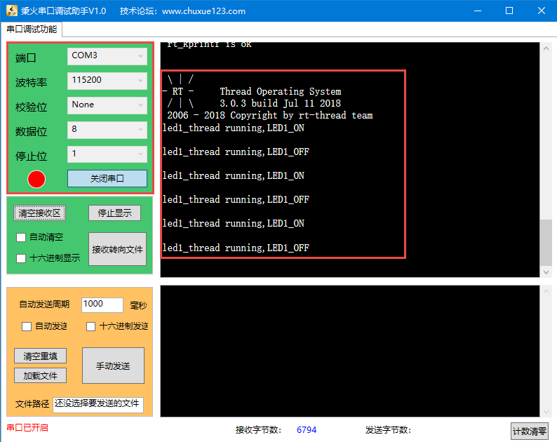

.. vim: syntax=rst

重映射串口到rt_kprintf函数
==============================

在RT-Thread中，有一个打印函数rt_kprintf()供用户使用，方便在调试的时候输出各种信息。如果要想使用rt_kprintf()，则必须将控制台重映射到rt_kprintf()，这个控制台可以是串口、CAN、USB、以太网等输出设备，用的最多的就是串口，接下来我们讲解下如何将串口重定向到
rt_kprintf()。

rt_kprintf()函数定义
~~~~~~~~~~~~~~~~~~~~~~~~

rt_kprintf()函数在kservice.c中实现，是属于内核服务类的函数，具体实现见 代码清单:rt_kprintf-1_。

.. code-block:: c
    :caption: 代码清单:rt_kprintf-1 rt_kprintf()函数定义
    :name: 代码清单:rt_kprintf-1
    :linenos:

    /*
    * @brief 这个函数用于向控制台打印特定格式的字符串
    *
    * @param fmt 指定的格式
    */

    void rt_kprintf(const char *fmt, ...)
    {
    va_list args;
    rt_size_t length;
    static char rt_log_buf[RT_CONSOLEBUF_SIZE];                           (1)

    va_start(args, fmt);

    /* rt_vsnprintf的返回值length表示按照fmt指定的格式写入到rt_log_buf的字符长度 */
    length = rt_vsnprintf(rt_log_buf, sizeof(rt_log_buf) - 1, fmt, args); (2)
    /* 如果length超过RT_CONSOLEBUF_SIZE，则进行截短即最多只能输出RT_CONSOLEBUF_SIZE个字符 */
    if (length > RT_CONSOLEBUF_SIZE - 1)
        length = RT_CONSOLEBUF_SIZE - 1;

    /* 使用设备驱动 */
    #ifdef RT_USING_DEVICE                                                 (3)
        if (_console_device == RT_NULL)
        {
            rt_hw_console_output(rt_log_buf);
        }
        else
        {
            rt_uint16_t old_flag = _console_device->open_flag;

            _console_device->open_flag |= RT_DEVICE_FLAG_STREAM;
            rt_device_write(_console_device, 0, rt_log_buf, length);
            _console_device->open_flag = old_flag;
        }
    #else
        /* 没有使用设备驱动则由rt_hw_console_output函数处理，该函数需要用户自己实现 */
        rt_hw_console_output(rt_log_buf);                                 (4)
    #endif
        va_end(args);
    }

-   代码清单:rt_kprintf-1_ **(1)**\ ：先定义一个字符缓冲区，大小由rt_config.h中的宏RT_CONSOLEBUF_SIZE定义，默认为128。

-   代码清单:rt_kprintf-1_ **(2)**\ ：调用rt_vsnprintf函数，将要输出的字符按照fmt指定的
    格式打印到预先定义好的rt_log_buf缓冲区，然后我们将缓冲区的内容输出到控制台就
    行了，接下来就是选择使用什么控制台。

-   代码清单:rt_kprintf-1_ **(3)**\ ：如果使用设备驱动，则通过设备驱动函数将rt_log_buf
    缓冲区的内容输出到控制台。如果设备控制台打开失败则由rt_hw_console_output函数
    处理，这个函数需要用户单独实现。

-   代码清单:rt_kprintf-1_ **(4)**\ ：不使用设备驱动，rt_log_buf缓冲区的内容则
    由rt_hw_console_output()函数处理，这个函数需要用户单独实现。

自定义rt_hw_console_output函数
~~~~~~~~~~~~~~~~~~~~~~~~~~~~~~~~~~

目前，我们不使用RT-Thread的设备驱动，那通过rt_kprintf输出的内容则由
rt_hw_console_output函数处理，这个函数需要用户单独实现。其实，实现
这个函数也很简单，只需要通过一个控制台将rt_log_buf缓冲区的内容发送出
去即可，这个控制台可以是USB、串口、CAN等，使用的最多的控制台则是串口。
这里我们只讲解如何将串口控制台重映射到rt_kprintf函数，rt_hw_console_output函数
在board.c实现，具体见 代码清单:rt_kprintf-2_。

.. code-block:: c
    :caption: 代码清单:rt_kprintf-2 重映射串口控制台到rt_kprintf函数
    :name: 代码清单:rt_kprintf-2
    :linenos:

    /**
    * @brief  重映射串口DEBUG_USARTx到rt_kprintf()函数
    *   Note：DEBUG_USARTx是在bsp_usart.h中定义的宏，默认使用串口1
    * @param  str：要输出到串口的字符串
    * @retval 无
    *
    * @attention
    *
    */
    void rt_hw_console_output(const char *str)
    {
        /* 进入临界段 */
        rt_enter_critical();

        /* 直到字符串结束 */
        while (*str!='\0')
        {
            /* 换行 */
            if (*str=='\n')
            {
                USART_SendData(DEBUG_USARTx, '\r');
                while (USART_GetFlagStatus(DEBUG_USARTx, USART_FLAG_TXE) == RESET);
            }

            USART_SendData(DEBUG_USARTx, *str++);
            while (USART_GetFlagStatus(DEBUG_USARTx, USART_FLAG_TXE) == RESET);
        }

        /* 退出临界段 */
        rt_exit_critical();
    }

如果我们使用的是HAL库，rt_hw_console_output函数就需要做不一样的修改，使用HAL库的串口发送函数接口，具体见 代码清单:rt_kprintf-3_ 高亮部分。

.. code-block:: c
    :caption: 代码清单:rt_kprintf-3重映射串口控制台到rt_kprintf函数
    :emphasize-lines: 21,23
    :name: 代码清单:rt_kprintf-3
    :linenos:

    /**
    * @brief  重映射串口DEBUG_USARTx到rt_kprintf()函数
    *   Note：DEBUG_USARTx是在bsp_usart.h中定义的宏，默认使用串口1
    * @param  str：要输出到串口的字符串
    * @retval 无
    *
    * @attention
    *
    */
    void rt_hw_console_output(const char *str)
    {
        /* 进入临界段 */
        rt_enter_critical();

        /* 直到字符串结束 */
        while (*str!='\0')
        {
            /* 换行 */
            if (*str=='\n')
            {
    		    HAL_UART_Transmit( &UartHandle,(uint8_t *)'\r',1,1000);
            }
            HAL_UART_Transmit( &UartHandle,(uint8_t *)(str++),1,1000);
        }

        /* 退出临界段 */
        rt_exit_critical();
    }

测试rt_kprintf函数
~~~~~~~~~~~~~~~~~~~~~~

硬件初始化
---------------

rt_kprintf函数输出的控制台使用的是开发板上的串口（野火STM32全系列的开发板都板载了USB转串口，然后通过跳帽默认接到了STM32的串口1），所以需要先要将裸机的串口驱动添加到工程并在开发环境中指定串口驱动头文件的编译路径，然后在board.c的rt_hw_board_init()函数中
对串口初始化，具体见 代码清单:rt_kprintf-4_ 的高亮部分。

.. code-block:: c
    :caption: 代码清单:rt_kprintf-4 在rt_hw_board_init中添加串口初始化代码
    :emphasize-lines: 11-12
    :name: 代码清单:rt_kprintf-4
    :linenos:

    void rt_hw_board_init()
    {
        /* 初始化SysTick */
        SysTick_Config( SystemCoreClock / RT_TICK_PER_SECOND );

        /* 硬件BSP初始化统统放在这里，比如LED，串口，LCD等 */

        /* 初始化开发板的LED */
        LED_GPIO_Config();

        /* 初始化开发板的串口 */
        USART_Config();

        /* 调用组件初始化函数 (use INIT_BOARD_EXPORT()) */
        #ifdef RT_USING_COMPONENTS_INIT
            rt_components_board_init();
        #endif

        #if defined(RT_USING_CONSOLE) && defined(RT_USING_DEVICE)
            rt_console_set_device(RT_CONSOLE_DEVICE_NAME);
        #endif

        #if defined(RT_USING_USER_MAIN) && defined(RT_USING_HEAP)
            rt_system_heap_init(rt_heap_begin_get(), rt_heap_end_get());
        #endif
    }

编写rt_kprintf测试代码
--------------------------

当rt_kprintf函数对应的输出控制台初始化好之后（在rt_hw_board_init()完成），
系统接下来会调用函数rt_show_version()来打印RT-Thread的版本号，该函数在
kservice.c中实现，具体见 代码清单:rt_kprintf-5_。

.. code-block:: c
    :caption: 代码清单:rt_kprintf-5 rt_show_version函数实现
    :name: 代码清单:rt_kprintf-5
    :linenos:

    void rt_show_version(void)
    {
        rt_kprintf("\n \\ | /\n");
        rt_kprintf("- RT -     Thread Operating System\n");
        rt_kprintf(" / | \\     %d.%d.%d build %s\n",
                RT_VERSION, RT_SUBVERSION, RT_REVISION, __DATE__);
        rt_kprintf(" 2006 - 2018 Copyright by rt-thread team\n");
    }

我们也可以在线程中用rt_kprintf打印一些辅助信息，具体见 代码清单:rt_kprintf-6_ 的高亮部分。

.. code-block:: c
    :caption: 代码清单:rt_kprintf-6 使用rt_kprintf在线程中打印调试信息
    :emphasize-lines: 7,11
    :name: 代码清单:rt_kprintf-6
    :linenos:

    static void led1_thread_entry(void* parameter)
    {
        while (1)
        {
            LED1_ON;
            rt_thread_delay(500);   /* 延时500个tick */
            rt_kprintf("led1_thread running,LED1_ON\r\n");

            LED1_OFF;
            rt_thread_delay(500);   /* 延时500个tick */
            rt_kprintf("led1_thread running,LED1_OFF\r\n");
        }
    }

下载验证
--------------

将程序编译好，用USB线连接电脑和开发板的USB接口（对应丝印为USB转串口），用DAP仿真器把程序下载到野火STM32开
发板（具体型号根据你买的板子而定，每个型号的板子都配套有对应的程序），在电脑上打开串口调试助手，然后复位开
发板就可以在调试助手中看到rt_kprintf的打印信息，具体见图 rt_kprintf打印信息实验现象_。

