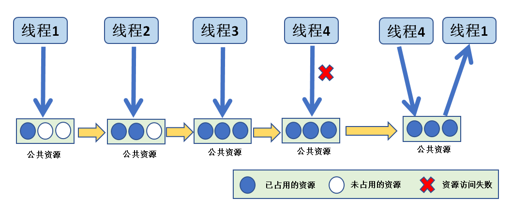
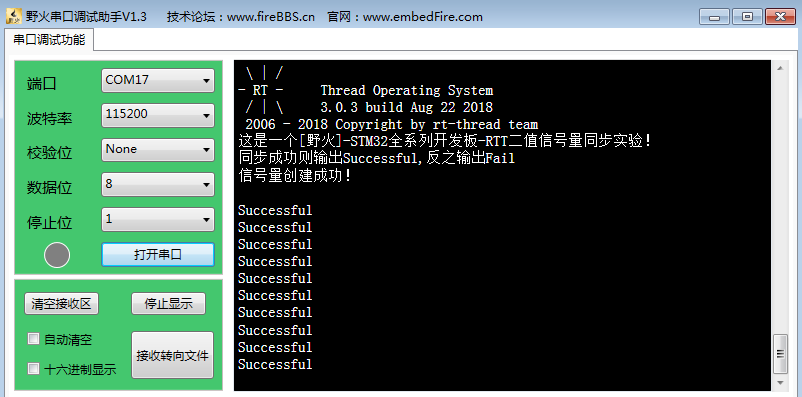
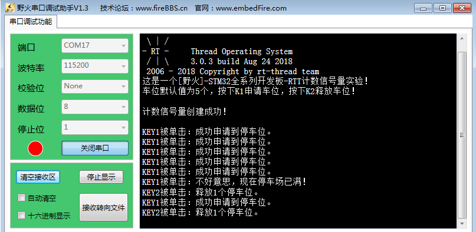

.. vim: syntax=rst

信号量
===========

同志们，回想一下，你是否在裸机编程中这样使用过一个变量：用于标记某个事件是否发生，或者标志一下某个东西是否正在被使用，如果是被占用了的或者没发生，我们就不对它进行操作。

信号量基本概念
~~~~~~~~~~~~~~~~~~~~~~~~~~~~~~~~~~~~~~~~~~~

信号量（Semaphore）是一种实现线程间通信的机制，实现线程之间同步或临界资源的互斥访问，常用于协助一组相互竞争的线程来访问临界资源。在多线程系统中，各线程之间需要同步或互斥实现临界资源的保护，信号量功能可以为用户提供这方面的支持。

通常一个信号量的计数值用于对应有效的资源数，表示剩下的可被占用的互斥资源数。其值的含义分两种情况：

-  0：表示没有积累下来的release释放信号量操作，且有可能有在此信号量上阻塞的线程。

-  正值，表示有一个或多个release释放信号量操作。

以同步为目的的信号量和以互斥为目的的信号量在使用有如下不同：

-  用作互斥时，信号量创建后可用信号量个数应该是满的，
   线程在需要使用临界资源时，先获取信号量，使其变空，这样其他线程需要使用临界资源时就会因为无法获取信号量而进入阻塞，从而保证了临界资源的安全。但是这样子有一个缺点就是有可能产生优先级翻转，优先级翻转的危害具体会在互斥量章节中详细讲解。

-  用作同步时，信号量在创建后被置为空，线程1取信号量而阻塞，线程2在某种条件发生后，释放信号量，于是线
   程1得以进入就绪态，如果线程1的优先级是最高的，那么就会立即切换线程，从而达到了两个线程间的同步。
   同样的，在中断服务函数中释放信号量，也能达到线程与中断间的同步。

在操作系统中，我们使用信号量的目的是为了给临界资源建立一个标志，信号量表示了该临界资源被占用情况。这样，当一个线程在访问临界资源的时候，就会先对这个资源信息进行查询，从而在了解资源被占用的情况之后，再做处理，从而使得临界资源得到有效的保护。

还记得我们经常说的中断要快进快出吗，在裸机开发中我们经常是在中断中做一个标记，然后在退出的时候进行轮
询处理，这个就是类似我们使用信号量进行同步的，当标记发生了，我们再做其他事情。在 RT-Thread我们用信号
量用于同步，线程与线程的同步，中断与线程的同步，可以大大提高效率。

信号量还有计数型信号量，计数型信号量允许多个线程对其进行操作，但限制了线程的数量。比如有一个停车场，里面只有100个车位，那么能停的车只有100辆，也相当于我们的信号量有100个，假如一开始停车场的车位还有100个，那么每进去一辆车就要消耗一个停车位，车位的数量就要减一，对应的，我们的信号量在使用之
后也需要减一，当停车场停满了100辆车的时候，此时的停车位为0，再来的车就不能停进去了，否则将造成事故，也相当于我们的信号量为0，后面的线程对这个停车场资源的访问也无法进行，当有车从停车场离开的时候，车位又空余出来了，那么，后面的车就能停进去了，在我们信号量的操作也是一样的，当我们释放了这个资源，后
面的线程才能对这个资源进行访问。

二值信号量的应用场景
~~~~~~~~~~~~~~~~~~~~~

在嵌入式操作系统中二值信号量是线程间、线程与中断间同步的重要手段。为什么叫二值信号量呢？因为信号量资
源被获取了，信号量值就是 0，信号量资源被释放，信号量值就是 1，把这种只有 0和 1 两种情况的信号量称之为二值信号量。

在线程系统中，我们经常会使用这个二值信号量，比如，某个线程需要等待一个标记，那么线程可以在轮询中查询这个标记有没有被置位，这样子做，就会很消耗CPU资源，其实根本不需要在轮询中查询这个标记，只需要使用二值信号量即可，当二值信号量没有的时候，线程进入阻塞态等待二值信号量到来即可，当得到了这个信号量（标
记）之后，在进行线程的处理即可，这样子么就不会消耗太多资源了，而且实时响应也是最快的。

再比如某个线程使用信号量在等中断的标记的发生，在这之前线程已经进入了阻塞态，在等待着中断的发生，当在中断发生之后，释放一个信号量，也就是我们常说的标记，当它退出中断之后，操作系统进行线程的调度，如果这个线程能够运行，系统就会把等待这个线程运行起来，这样子就大大提高了我们的效率。

二值信号量在线程与线程中同步的应用场景：假设我们有一个温湿度的传感器，假设是1s采集一次数据，那么我们让他在液晶屏中显示数据出来，这个周期也是要1s一次的，如果液晶屏刷新的周期是100ms更新一次，那么此时的温湿度的数据还没更新，液晶屏根本无需刷新，只需要在1s后温湿度数据更新的时候刷新即可，否则C
PU就是白白做了多次的无效数据更新，CPU的资源就被刷新数据这个线程占用了大半，造成CPU资源浪费，如果液晶屏刷新的周期是10s更新一次，那么温湿度的数据都变化了10次，液晶屏才来更新数据，那拿这个产品有啥用，根本就是不准确的，所以，还是需要同步协调工作，在温湿度采集完毕之后，进行液晶屏数据的刷新，
这样子，才是最准确的，并且不会浪费CPU的资源。

同理，二值信号量在线程与中断同步的应用场景：我们在串口接收中，我们不知道啥时候有数据发送过来，有一个线程是做接收这些数据处理，总不能在线程中每时每刻都在线程查询有没有数据到来，那样会浪费CPU资源，所以在这种情况下使用二值信号量是很好的办法，当没有数据到来的时候，线程就进入阻塞态，不参与线程的调度，
等到数据到来了，释放一个二值信号量，线程就立即从阻塞态中解除，进入就绪态，然后运行的时候处理数据，这样子系统的资源就会很好的被利用起来。

二值信号量的运作机制
~~~~~~~~~~~~~~~~~~~~~

创建二值信号量，为创建的信号量对象分配内存，并把可用信号量初始化为用户自定义的个数， 二值信号量的最大可用信号量个数为1。

信号量获取，从创建的信号量资源中获取一个信号量，获取成功返回正确。否则线程会等待其它线程释放该信号量，超时时间由用户设定。当线程获取信号量失败时，线程将进入阻塞态，系统将线程挂到该信号量的阻塞列表中。

在二值信号量无效的时候，假如此时有线程获取该信号量的话，那么线程将进入阻塞状态，具体见图 19‑1。

图 19‑1信号量无效时候获取

假如某个时间中断/线程释放了信号量，其过程具体见图 19‑2，那么，由于获取无效信号量而进入阻塞态的线程
将获得信号量并且恢复为就绪态，其过程具体见图 19‑3。

图 19‑2中断、线程释放信号量

图 19‑3二值信号量运作机制

计数型信号量的运作机制
~~~~~~~~~~~~~~~~~~~~~~

计数型信号量与二值信号量其实都是差不多的，一样用于资源保护，不过计数信号量则允许多个线程获取信号量访问共享资源，但会限制线程的最大数目。访问的线程数达到信号量可支持的最大数目时，会阻塞其他试图获取该信号量的线程，直到有线程释放了信号量。这就是计数型信号量的运作机制，虽然计数信号量允许多个线程访问同一
个资源，但是也有限定，比如某个资源限定只能有3个线程访问，那么第4个线程访问的时候，会因为获取不到信号
量而进入阻塞，等到有线程（比如线程1）释放掉该资源的时候，第4个线程才能获取到信号量从而进行资源的访问，
其运作的机制具体见图 19‑4。

图 19‑4计数信号量运作示意图

信号量控制块
~~~~~~~~~~~~~~~~

说到信号量的使用就不得不说一下信号量的控制块了，信号量控制块与线程控制类似，每一个信号量都有自己的信
号量控制块，信号量控制块中包含了信号量的所有信息，比如信号量的一些状态信息，使用情况等，具体见代码清单 19‑1。

.. code-block:: c
    :caption: 代码清单 19‑1信号量控制块
    :linenos:

    struct rt_semaphore {
        struct rt_ipc_object parent; /**< 继承自ipc_object类*/

        rt_uint16_t          value; /**< 信号量的值，最大为65535 */
    };
    typedef struct rt_semaphore *rt_sem_t;

信号量属于内核对象，也会在自身结构体里面包含一个内核对象类型的成员，通过这个成员可以将信号量挂到系统对象容器里面。rt_semaphore对象从rt_ipc_object中派生，由IPC容器管理。

常用信号量函数接口讲解
~~~~~~~~~~~~~~~~~~~~~~

在RT-Thread中，无论是二值信号量还是计数信号量，都是由我们自己创建的，二值信号量的最大计数值为1，并且都是使用RT-Thread的同一个释放与获取函数，所以在将信号量当二值信号量使用的时候要注意：用完信号量及时释放，并且不要调用多次信号量释放函数。

信号量创建函数rt_sem_create()
^^^^^^^^^^^^^^^^^^^^^^^^^^^^^^^^^^^^

二值信号量的创建很简单，因为创建的是二值的信号量，所以该信号量的容量只有一个，其可用信号量个数要么是0，
要么是1，而计数信号量则可以由用户决定在创建的时候初始化多少个可用信号量，其源码具体见代码清单 19‑2。

.. code-block:: c
    :caption: 代码清单 19‑2信号量创建函数rt_sem_create()源码
    :linenos:

    rt_sem_t rt_sem_create(const char *name,			(1)
                        rt_uint32_t value,			(2)
                        rt_uint8_t flag)	    	        (3)
    {
        rt_sem_t sem;

        RT_DEBUG_NOT_IN_INTERRUPT;

        /* 分配内核对象 */
        sem = (rt_sem_t)rt_object_allocate(RT_Object_Class_Semaphore, name);
        if (sem == RT_NULL)					(4)
            return sem;

        /* 初始化信号量对象 */
        rt_ipc_object_init(&(sem->parent));	    	        (5)

        /* 设置可用信号量的值 */
        sem->value = value;					(6)

        /* 设置信号量模式 */
        sem->parent.parent.flag = flag;				(7)

        return sem;						(8)
    }

代码清单 19‑2\ **(1)**\ ：信号量名称。

代码清单 19‑2\ **(2)**\ ：可用信号量初始值。

代码清单 19‑2\ **(3)**\ ：信号量标志。

代码清单 19‑2\ **(4)**\ ：分配消息队列对象，调用rt_object_allocate此函数将从对象系统分配对象，
为创建的消息队列分配一个消息队列的对象，并且命名对象名称， 在系统中，对象的名称必须是唯一的。

代码清单 19‑2\ **(5)**\ ：初始化信号量对象。此处会初始化一个链表用于记录访问此信号量而阻塞的线程。

代码清单 19‑2\ **(6)**\ ：设置可用信号量的初始值。表示在创建成功的时候有多少个信号量可用，如果创建
的是二值信号量，其取值范围为[0,1]，如果是计数信号量，其取值范围为[0,65535]。

代码清单 19‑2\ **(7)**\ ：设置信号量的阻塞唤醒模式，创建的信号量由于指定的flag不同，而有不同的
意义： 使用RT_IPC_FLAG_PRIO优先级flag创建的IPC对象，在多个线程等待信号量资源时，将由优先级高的
线程优先获得资源。而使用RT_IPC_FLAG_FIFO先进先出flag创建的IPC对象，在多个线程等信号量待资源时，
将按照先来先得的顺序获得资源。RT_IPC_FLAG_PRIO与RT_IPC_FLAG_FIFO均在rtdef.h中有定义。

代码清单 19‑2\ **(8)**\ ：创建成功返回信号量句柄。

通过上面的信号量创建的学习，在创建信号量的时候，我们只需要传入我们的信号量名称、初始化的值和阻塞唤醒发生即可。在创建信号量的时候，是需要用户自己定义信号量的句柄的，但是注意了，定义了信号量的句柄并不等于创建了信号量，创建信号量必须是调用rt\_
sem_create()函数进行创建，需要注意的是：二值信号量可用个数的取值范围是0~1，计数信号量可用个数的取值
范围是0~65535，用户可以根据需求选择。信号量创建的实例具体见代码清单 19‑3高亮部分。

.. code-block:: c
    :caption: 代码清单 19‑3信号量创建函数rt_sem_create()实例
    :emphasize-lines: 4-6
    :linenos:

    /* 定义信号量控制块 */
    static rt_sem_t test_sem = RT_NULL;
    /* 创建一个信号量 */
    test_sem = rt_sem_create("test_sem",/* 信号量名字 */
                            1,     /* 信号量初始值，默认有一个信号量 */
                            RT_IPC_FLAG_FIFO); /* 信号量模式 FIFO(0x00)*/
    if (test_sem != RT_NULL)
        rt_kprintf("信号量创建成功！\n\n");

信号量删除函数rt_sem_delete()
^^^^^^^^^^^^^^^^^^^^^^^^^^^^^^^^^^^^^^^^^^^^

信号量删除函数是根据信号量句柄直接删除的，删除之后这个信号量的所有信息都会被系统回收，并且用户无法再次使用这个信号量。但是需要注意的是，如果某个信号量没有被创建，那是无法被删除的，动脑子想想都知道，没创建的东西就不存在，怎么可能被删除，删除信号量的时候会把所有由于访问此信号量而阻塞的线程从阻塞链表中
删除，并且返回一个错误代码。 sem是rt_sem_delete()传入的参数，是信号量句柄，表示的是要删除哪个信号量，其函数源码见代码清单 19‑4

.. code-block:: c
    :caption: 代码清单 19‑4信号量删除函数rt_sem_delete()源码
    :linenos:

    rt_err_t rt_sem_delete(rt_sem_t sem)
    {
        RT_DEBUG_NOT_IN_INTERRUPT;

        RT_ASSERT(sem != RT_NULL);					(1)

        /* 恢复所有阻塞在此信号量的线程 */
        rt_ipc_list_resume_all(&(sem->parent.suspend_thread));  	(2)

        /* 删除信号量对象 */
        rt_object_delete(&(sem->parent.parent));			(3)

        return RT_EOK;
    }
    RTM_EXPORT(rt_sem_delete);

代码清单 19‑4\ **(1)**\ ：检查信号量是否被创建了，如果是则可以进行删除操作。

代码清单 19‑4\ **(2)**\
：调用rt_ipc_list_resume_all()函数将所有因为访问此信号量的而阻塞的线程从阻塞态中恢复过来，线程得到信号量返回的错误代码，在实际情况一般不这样子使用，在删除的时候，应先确认所有的线程都无需再次访问此信号量，并且此时没有线程被此信号量阻塞，才进行删除操作。

代码清单 19‑4\ **(3)**\ ：删除信号量对象并且释放信号量内核对象的内存，释放内核对象内存在rt_object_delete()函数中实现。

调用这个函数时，系统将删除这个信号量。如果删除该信号量时，有线程正在等待该信号量，那么删除操作会先唤
醒等待在该信号量上的线程（等待线程的返回值是-RT_ERROR），信号量删除的实例代码，具体见加代码清单 19‑5粗部分。

.. code-block:: c
    :caption: 代码清单 19‑5信号量删除函数rt_sem_delete()实例
    :emphasize-lines: 6
    :linenos:

    /* 定义信号量控制块 */
    static rt_sem_t test_sem = RT_NULL;

    rt_err_t uwRet = RT_EOK;

    uwRet = rt_sem_delete(test_sem);
    if (RT_EOK == uwRet)
        rt_kprintf("信号量删除成功！\n\n");

信号量释放函数rt_sem_release()
^^^^^^^^^^^^^^^^^^^^^^^^^^^^^^^^^^^^^^^^^^^^^^

在前面的讲解中，我们知道，当信号量有效的时候，线程才能获取信号量，那么，是什么函数使得信号量变得有效？其实有两个方式，一个是在创建的时候进行初始化，将它可用的信号量个数设置一个初始值；在二进制信号量中，该初始值的范围是0~1，假如初始值为1个可用的信号量的话，被申请一次就变得无效了，那就需要我们释放
信号量，RT-Thread提供了信号量释放函数rt_sem_release()，每调用一次该函数就释放一个信号量。但是
有个问题，能不能一直释放呢 ？很显然，这是不能的，无论是你的信号量是用作二值信号量还是计数信号量，
都要注意可用信号量的范围，当用作二值信号量的时候，必须确保其可用值在0~1范围内，所以使用二值信号
量的时候要在使用完毕应及时释放信号量；而用作计数信号量的话，其范围是0~65535，不允许超过释放65535
个信号量，这代表我们不能一直调用rt_sem_release()函数来释放信号量。下面我们一起来看看信号量释放函数
rt_sem_release()的源码，具体见代码清单
19‑6。

.. code-block:: c
    :caption: 代码清单 19‑6信号量释放函数rt_sem_release()源码
    :linenos:

    rt_err_t rt_sem_release(rt_sem_t sem)	        	(1)
    {
        register rt_base_t temp;
        register rt_bool_t need_schedule;

        RT_OBJECT_HOOK_CALL(rt_object_put_hook, (&(sem->parent.parent)));

        need_schedule = RT_FALSE;			        (2)

        /* 关中断 */
        temp = rt_hw_interrupt_disable();

        RT_DEBUG_LOG(RT_DEBUG_IPC,("thread %s releases sem:%s, which value is: %d\n",
                                    rt_thread_self()->name,
                                    ((struct rt_object *)sem)->name,
                                    sem->value));

        if (!rt_list_isempty(&sem->parent.suspend_thread)) {
            /* 恢复阻塞线程 */
            rt_ipc_list_resume(&(sem->parent.suspend_thread));	(3)
            need_schedule = RT_TRUE;				(4)
        } else
            sem->value ++; /* 记录可用信号量个数 */	         (5)

        /* 开中断 */
        rt_hw_interrupt_enable(temp);

        /* 如果需要调度，则发起一次线程调度 */
        if (need_schedule == RT_TRUE)				(6)
            rt_schedule();

        return RT_EOK;
    }
    RTM_EXPORT(rt_sem_release);

代码清单 19‑6\ **(1)**\ ：根据信号量句柄（sem）释放信号量。

代码清单 19‑6\ **(2)**\ ：定义一个记录是否需要进行系统调度的变量need_schedule，默认为不需要调度。

代码清单 19‑6\ **(3)**\ ：恢复阻塞线程。如果当前有线程等待这个信号量时，那么现在进行信号量释放的
时候，将唤醒等待在该信号量线程队列中的第一个线程，由它获取信号量，并且将其从阻塞中恢复。恢复的过
程是：将线程从阻塞列表中删除，添加到就绪列表中。

代码清单 19‑6\ **(4)**\ ：恢复线程需要进行线程调度，所以此变量应该为真（RT_TRUE）。

代码清单 19‑6\ **(5)**\ ：如果当前没有线程因为访问此信号量而进入阻塞，则不需要恢复线程，将该信号量的可用个数加一即可。此处应注意信号量的范围。

代码清单 19‑6\ **(6)**\ ：如果需要进行调度，则调用rt_schedule()函数进行一次线程切换。

当线程完成资源的访问后，应尽快释放它持有的信号量，使得其他线程能获得该信号量，我们学习了信号量
释放过程，那用起来简直就是异常爽快，循序渐进，学习了再去使用，这简直就是享受的过程，下面一起来看
看怎么使用信号量释放函数rt_sem_release()，具体见代码清单 19‑7高亮部分。

补充：在中断中一样可以这样子调用信号量释放函数rt_sem_release()，因为这个函数是非阻塞的。

.. code-block:: c
    :caption: 代码清单 19‑7信号量释放函数rt_sem_release()实例
    :emphasize-lines: 7-10
    :linenos:

    static void send_thread_entry(void* parameter)
    {
        rt_err_t uwRet = RT_EOK;
        /* 线程都是一个无限循环，不能返回 */
        while (1) { //如果KEY2被单击
            if ( Key_Scan(KEY2_GPIO_PORT,KEY2_GPIO_PIN) == KEY_ON ) {
                /* 释放一个计数信号量 */
                uwRet = rt_sem_release(test_sem);
                if ( RT_EOK == uwRet )
                    rt_kprintf ( "KEY2被单击：释放1个停车位。\r\n" );
                else
                    rt_kprintf ( "KEY2被单击：但已无车位可以释放！\r\n" );
            }
            rt_thread_delay(20);     //每20ms扫描一次
        }
    }

信号量获取函数rt_sem_take()
^^^^^^^^^^^^^^^^^^^^^^^^^^^^^^^^^^^^^^^^

与释放信号量对应的是获取信号量，我们知道，当信号量有效的时候，线程才能获取信号量，当线程获取了某个信号量的时候，该信号量的有效值就会减一，也就是说该信号量的可用个数就减一，当它减到0的时候，线程就无法再获取了，并且获取的线程会进入阻塞态（假如使用了等待时间的话）。在二进制信号量中，该初始值的范围是0
~1，假如初始值为1个可用的信号量的话，被获取一次就变得无效了，那么此时另外一个线程获取该信号量的时候，
就会无法获取成功，该线程便会进入阻塞态。每调用一次rt_sem_take()函数获取信号量的时候，信号量的可用个
数便减少一个，直至为0的时候，线程就无法成功获取信号量了，具体见代码清单 19‑8。

.. code-block:: c
    :caption: 代码清单 19‑8信号量获取函数rt_sem_take()源码
    :linenos:

    rt_err_t rt_sem_take(rt_sem_t sem, rt_int32_t time)		(1)
    {
        register rt_base_t temp;
        struct rt_thread *thread;

        RT_ASSERT(sem != RT_NULL);			        (2)

        RT_OBJECT_HOOK_CALL(rt_object_trytake_hook, (&(sem->parent.parent)));

        /* 关中断 */
        temp = rt_hw_interrupt_disable();

        RT_DEBUG_LOG(RT_DEBUG_IPC, ("thread %s take sem:%s, which value is: %d\n",
                                    rt_thread_self()->name,
                                    ((struct rt_object *)sem)->name,
                                    sem->value));

        if (sem->value > 0) {					(3)
            /* 有可用信号量 */
            sem->value --;

            /* 关中断 */
            rt_hw_interrupt_enable(temp);
        } else {
            /* 不等待，返回超时错误 */
            if (time == 0) {					(4)
                rt_hw_interrupt_enable(temp);

                return -RT_ETIMEOUT;
            } else {
                /*当前上下文检查 */
                RT_DEBUG_IN_THREAD_CONTEXT;

                /* 信号不可用，挂起当前线程 */
                /* 获取当前线程 */
                thread = rt_thread_self();		        (5)

                /* 设在线程错误代码 */
                thread->error = RT_EOK;

                RT_DEBUG_LOG(RT_DEBUG_IPC, ("sem take: suspend thread - %s\n",
                                            thread->name));

                /* 挂起线程 */
                rt_ipc_list_suspend(&(sem->parent.suspend_thread),(6)
                                    thread,
                                    sem->parent.parent.flag);

                /* 有等待时间，开始计时 */
                if (time > 0) {					(7)
                    RT_DEBUG_LOG(RT_DEBUG_IPC, ("set thread:%s to timer list\n",
                                                thread->name));

                    /* 设置线程超时时间，并且启动定时器 */
                    rt_timer_control(&(thread->thread_timer),	(8)
                                    RT_TIMER_CTRL_SET_TIME,
                                    &time);
                    rt_timer_start(&(thread->thread_timer));    (9)
                }

                /* 开中断 */
                rt_hw_interrupt_enable(temp);

                /* 发起线程调度 */
                rt_schedule();					(10)

                if (thread->error != RT_EOK) {
                    return thread->error;
                }
            }
        }

        RT_OBJECT_HOOK_CALL(rt_object_take_hook, (&(sem->parent.parent)));

        return RT_EOK;						(11)
    }
    RTM_EXPORT(rt_sem_take);

代码清单 19‑8\ **(1)**\ ：sem 信号量对象的句柄；time 指定的等待时间，单位是操作系统时钟节拍（tick）。

代码清单 19‑8\ **(2)**\ ：检查信号量是否有效，如果有效则进行获取操作。

代码清单 19‑8\ **(3)**\ ：如果当前有可用的信号量，那么线程获取信号量成功，信号量可用个数减一，然后直接跳到\ **(11)** 返回成功。

代码清单 19‑8\ **(4)**\ ：\ **(4)~(10)**\ 都是表示当前没有可用信号量，此时无法获取到信号量，
如果用户设定的等待时间为0，那么线程获取信号量不成功，直接返回错误码-RT_ETIMEOUT。

代码清单 19‑8\ **(5)**\ ：如果用户设置了等待时间，那么在获取不到信号量的情况下，可以将获取信号量
的线程挂起，进行等待，这首先获取到当前线程，调用rt_thread_self()函数就是为了得到当前线程控制块。

代码清单 19‑8\ **(6)**\ ：将线程挂起，rt_ipc_list_suspend()此函数将线程挂起到指定列表。
IPC对象（rt_ipc_object）结构体中包含一个挂起列表，此处将当前线程挂起到信号量的挂起列表中。

代码清单 19‑8\ **(7)**\ ：如果有等待时间，那么需要计时，在时间到的时候恢复线程。

代码清单 19‑8\ **(8)**\ ：调用rt_timer_control()函数设置当前线程的挂起的时间，时间time由用户设定。

代码清单 19‑8\ **(9)**\ ：启动定时器开始计时。

代码清单 19‑8\ **(10)**\ ：发起一次线程调度，因为当前线程已经被挂起了吗，需要进行线程的切换。

线程通过获取信号量来获得信号量资源，当信号量值大于零时，线程将获得信号量，并且相应的信号量值都会减1；如果信号量的值等于零，那么说明当前信号量资源不可用，获取该信号量的线程将根据time参数的情况选择直接返回、或挂起等待一段时间、或永久等待，直到其他线程或中断释放该信号量。如果在参数time指定的时
间内依然得不到信号量，线程将超时返回，返回值是-RT_ETIMEOUT，其使用实例具体见代码清单 19‑9高亮部分。

.. code-block:: c
    :caption: 代码清单 19‑9信号量获取函数rt_sem_take()实例
    :emphasize-lines: 1-5
    :linenos:

    rt_sem_take(test_sem,			/* 获取信号量 */
            RT_WAITING_FOREVER); 	/* 等待时间：一直等 */

    uwRet = rt_sem_take(test_sem, 		/* 获取一个计数信号量 */
                        0); 		/* 等待时间：0 */
    if ( RT_EOK == uwRet )
        rt_kprintf( "获取信号量成功\r\n" );

信号量实验
~~~~~~~~~~~~~~~

二值信号量同步实验
^^^^^^^^^^^^^^^^^^^^^^^^^

信号量同步实验是在RT-Thread中创建了两个线程，一个是获取信号量线程，一个是释放互斥量线程，两个线程独立运行，获取信号量线程是一直在等待信号量，其等待时间是RT_WAITING_FOREVER，等到获取到信号量之后，线程处理完毕时它又马上释放信号量。

释放互斥量线程利用延时模拟占用信号量，延时的这段时间，获取线程无法获得信号量，等到释放线程使用完信号
量，然后释放信号量，此时释放信号量会唤醒获取线程，获取线程开始运行，然后形成两个线程间的同步，若是线
程正常同步，则在串口打印出信息，具体见代码清单 19‑10高亮部分。

.. code-block:: c
    :caption: 代码清单 19‑10二值信号量同步实验
    :emphasize-lines: 34-35,41,69-72,111-140
    :linenos:

    /**
    *********************************************************************
    * @file    main.c
    * @author  fire
    * @version V1.0
    * @date    2018-xx-xx
    * @brief   RT-Thread 3.0 + STM32 信号量同步
    *********************************************************************
    * @attention
    *
    * 实验平台:基于野火STM32全系列（M3/4/7）开发板
    * 论坛    :http://www.firebbs.cn
    * 淘宝    :https://fire-stm32.taobao.com
    *
    **********************************************************************
    */

    /*
    *************************************************************************
    *                             包含的头文件
    *************************************************************************
    */
    #include "board.h"
    #include "rtthread.h"

    /*
    ******************************************************************
    *                               变量
    ******************************************************************
    */
    /* 定义线程控制块 */
    static rt_thread_t receive_thread = RT_NULL;
    static rt_thread_t send_thread = RT_NULL;
    /* 定义信号量控制块 */
    static rt_sem_t test_sem = RT_NULL;

    /************************* 全局变量声明 ****************************/
    /*
    * 当我们在写应用程序的时候，可能需要用到一些全局变量。
    */
    uint8_t ucValue [ 2 ] = { 0x00, 0x00 };
    /*
    *************************************************************************
    *                             函数声明
    *************************************************************************
    */
    static void receive_thread_entry(void* parameter);
    static void send_thread_entry(void* parameter);

    /*
    *************************************************************************
    *                             main 函数
    *************************************************************************
    */
    /**
    * @brief  主函数
    * @param  无
    * @retval 无
    */
    int main(void)
    {
        /*
        * 开发板硬件初始化，RTT系统初始化已经在main函数之前完成，
        * 即在component.c文件中的rtthread_startup()函数中完成了。
        * 所以在main函数中，只需要创建线程和启动线程即可。
        */
        rt_kprintf("这是一个[野火]- STM32全系列开发板RTT二值信号量同步实验！\n");
        rt_kprintf("同步成功则输出Successful,反之输出Fail\n");
        /* 创建一个信号量 */
        test_sem = rt_sem_create("test_sem",/* 信号量名字 */
                                1,     /* 信号量初始值，默认有一个信号量 */
                                RT_IPC_FLAG_FIFO); /* 信号量模式 FIFO(0x00)*/
        if (test_sem != RT_NULL)
            rt_kprintf("信号量创建成功！\n\n");

        receive_thread =                          /* 线程控制块指针 */
            rt_thread_create( "receive",            /* 线程名字 */
                            receive_thread_entry, /* 线程入口函数 */
                            RT_NULL,             /* 线程入口函数参数 */
                            512,                 /* 线程栈大小 */
                            3,                   /* 线程的优先级 */
                            20);                 /* 线程时间片 */

        /* 启动线程，开启调度 */
        if (receive_thread != RT_NULL)
            rt_thread_startup(receive_thread);
        else
            return -1;

        send_thread =                          /* 线程控制块指针 */
            rt_thread_create( "send",              /* 线程名字 */
                            send_thread_entry,   /* 线程入口函数 */
                            RT_NULL,             /* 线程入口函数参数 */
                            512,                 /* 线程栈大小 */
                            2,                   /* 线程的优先级 */
                            20);                 /* 线程时间片 */

        /* 启动线程，开启调度 */
        if (send_thread != RT_NULL)
            rt_thread_startup(send_thread);
        else
            return -1;
    }

    /*
    *******************************************************
    *                             线程定义
    ******************************************************
    */

    static void receive_thread_entry(void* parameter)
    {
        /* 线程都是一个无限循环，不能返回 */
        while (1) {
            rt_sem_take(test_sem,		/* 获取信号量 */
                        RT_WAITING_FOREVER); /* 等待时间：一直等 */
            if ( ucValue [ 0 ] == ucValue [ 1 ] ) {
                rt_kprintf ( "Successful\n" );
            } else {
                rt_kprintf ( "Fail\n" );
            }
            rt_sem_release(	test_sem	);   //释放二值信号量

            rt_thread_delay ( 1000 );	  	//每1s读一次
        }
    }

    static void send_thread_entry(void* parameter)
    {
        /* 线程都是一个无限循环，不能返回 */
        while (1) {
            rt_sem_take(test_sem,	/* 获取信号量 */
                        RT_WAITING_FOREVER); /* 等待时间：一直等 */
            ucValue [ 0 ] ++;
            rt_thread_delay ( 100 );        /* 延时100ms */
            ucValue [ 1 ] ++;
            rt_sem_release(test_sem);	 //释放二值信号量
            rt_thread_yield();  		//放弃剩余时间片，进行一次线程切换
        }
    }
    /***********************END OF FILE****************************/

计数信号量实验
^^^^^^^^^^^^^^^^

计数型信号量实验是模拟停车场工作运行。在创建信号量的时候初始化5个可用的信号量，并且创建了两个线程：一个是获取信号量线程，一个是释放信号量线程，两个线程独立运行，获取信号量线程是通过按下K1按键进行信号量的获取，模拟停车场停车操作，其等待时间是0，在串口调试助手输出相应信息。

释放信号量线程则是信号量的释放，释放信号量线程也是通过按下K2按键进行信号量的释放，模拟停车场取车操作，
在串口调试助手输出相应信息，实验源码具体见代码清单 19‑11高亮部分。

.. code-block:: c
    :caption: 代码清单 19‑11计数信号量实验
    :emphasize-lines: 34-35,68-71,110-143
    :linenos:

    /**
    *********************************************************************
    * @file    main.c
    * @author  fire
    * @version V1.0
    * @date    2018-xx-xx
    * @brief   RT-Thread 3.0 + STM32 计数信号量
    *********************************************************************
    * @attention
    *
    * 实验平台:基于野火STM32全系列（M3/4/7）开发板
    * 论坛    :http://www.firebbs.cn
    * 淘宝    :https://fire-stm32.taobao.com
    *
    **********************************************************************
    */

    /*
    *************************************************************************
    *                             包含的头文件
    *************************************************************************
    */
    #include "board.h"
    #include "rtthread.h"

    /*
    ******************************************************************
    *                               变量
    ******************************************************************
    */
    /* 定义线程控制块 */
    static rt_thread_t receive_thread = RT_NULL;
    static rt_thread_t send_thread = RT_NULL;
    /* 定义消息队列控制块 */
    static rt_sem_t test_sem = RT_NULL;

    /************************* 全局变量声明 ****************************/
    /*
    * 当我们在写应用程序的时候，可能需要用到一些全局变量。
    */
    /*
    *************************************************************************
    *                             函数声明
    *************************************************************************
    */
    static void receive_thread_entry(void* parameter);
    static void send_thread_entry(void* parameter);

    /*
    *************************************************************************
    *                             main 函数
    *************************************************************************
    */
    /**
    * @brief  主函数
    * @param  无
    * @retval 无
    */
    int main(void)
    {
        /*
        * 开发板硬件初始化，RTT系统初始化已经在main函数之前完成，
        * 即在component.c文件中的rtthread_startup()函数中完成了。
        * 所以在main函数中，只需要创建线程和启动线程即可。
        */
        rt_kprintf("这是一个[野火]-STM32F103-霸道-RTT计数信号量实验！\n");
        rt_kprintf("车位默认值为5个，按下K1申请车位，按下K2释放车位！\n\n");
        /* 创建一个信号量 */
        test_sem = rt_sem_create("test_sem",/* 计数信号量名字 */
                                5,     /* 信号量初始值，默认有5个信号量 */
                                RT_IPC_FLAG_FIFO); /* 信号量模式 FIFO(0x00)*/
        if (test_sem != RT_NULL)
            rt_kprintf("计数信号量创建成功！\n\n");

        receive_thread =                          /* 线程控制块指针 */
            rt_thread_create( "receive",              /* 线程名字 */
                            receive_thread_entry,   /* 线程入口函数 */
                            RT_NULL,             /* 线程入口函数参数 */
                            512,                 /* 线程栈大小 */
                            3,                   /* 线程的优先级 */
                            20);                 /* 线程时间片 */

        /* 启动线程，开启调度 */
        if (receive_thread != RT_NULL)
            rt_thread_startup(receive_thread);
        else
            return -1;

        send_thread =                          /* 线程控制块指针 */
            rt_thread_create( "send",              /* 线程名字 */
                            send_thread_entry,   /* 线程入口函数 */
                            RT_NULL,             /* 线程入口函数参数 */
                            512,                 /* 线程栈大小 */
                            2,                   /* 线程的优先级 */
                            20);                 /* 线程时间片 */

        /* 启动线程，开启调度 */
        if (send_thread != RT_NULL)
            rt_thread_startup(send_thread);
        else
            return -1;
    }

    /*
    ***************************************************************
    *                             线程定义
    ****************************************************************
    */

    static void receive_thread_entry(void* parameter)
    {
        rt_err_t uwRet = RT_EOK;
        /* 线程都是一个无限循环，不能返回 */
        while (1) {//如果KEY2被单击
            if ( Key_Scan(KEY1_GPIO_PORT,KEY1_GPIO_PIN) == KEY_ON ) {
                /* 获取一个计数信号量 */
                uwRet = rt_sem_take(test_sem,
                                    0); 	/* 等待时间：0 */
                if ( RT_EOK == uwRet )
                    rt_kprintf( "KEY1被单击：成功申请到停车位。\r\n" );
                else
                    rt_kprintf( "KEY1被单击：不好意思，现在停车场已满！\r\n" );
            }
            rt_thread_delay(20);     //每20ms扫描一次
        }
    }

    static void send_thread_entry(void* parameter)
    {
        rt_err_t uwRet = RT_EOK;
        /* 线程都是一个无限循环，不能返回 */
        while (1) {//如果KEY2被单击
            if ( Key_Scan(KEY2_GPIO_PORT,KEY2_GPIO_PIN) == KEY_ON ) {
                /* 释放一个计数信号量 */
                uwRet = rt_sem_release(test_sem);
                if ( RT_EOK == uwRet )
                    rt_kprintf ( "KEY2被单击：释放1个停车位。\r\n" );
                else
                    rt_kprintf ( "KEY2被单击：但已无车位可以释放！\r\n" );
            }
            rt_thread_delay(20);     //每20ms扫描一次
        }
    }
    /****************************END OF FILE****************************/

实验现象
~~~~~~~~~~~~~~

二值信号量同步实验现象
^^^^^^^^^^^^^^^^^^^^^^^

将程序编译好，用USB线连接电脑和开发板的USB接口（对应丝印为USB转串口），用DAP仿真器把配套程序下载到野火STM32开发板（具体型号根据你买的板子而定，每个型号的板子都配套有对应的程序），在电脑上打开串口调试助手，然后复位开发板就可以在调试助手中看到rt_kprintf的打印信息，它里面输出
了信息表明线程正在运行中，当输出信息为Successful的时候，则表面两个线程同步成功，具体见图 19‑5。

图 19‑5二值信号量同步实验现象

计数信号量实验现象
^^^^^^^^^^^^^^^^^^^^

将程序编译好，用USB线连接电脑和开发板的USB接口（对应丝印为USB转串口），用DAP仿真器把配套程序下载到野火STM32开发板（具体型号根据你买的板子而定，每个型号的板子都配套有对应的程序），在电脑上打开串口调试助手，然后复位开发板就可以在调试助手中看到rt_kprintf的打印信息，按下开发版
的K1按键获取信号量，按下K2按键释放信号量；我们按下K1与K2试试，在串口调试助手中可以看到运行结果，具体见图 19‑6。

图 19‑6计数信号量实验现象

