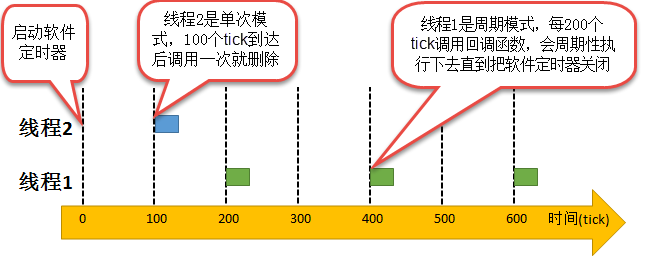
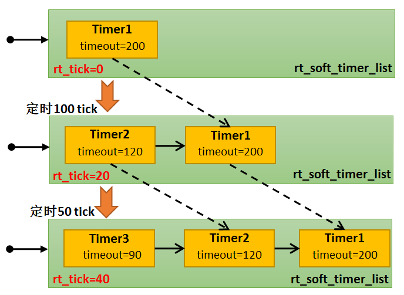
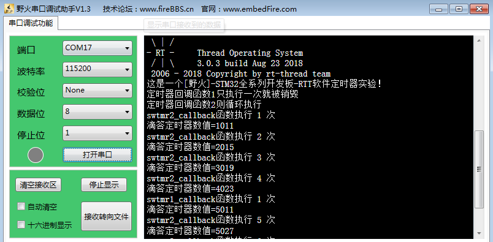

.. vim: syntax=rst

软件定时器
-------------------

软件定时器的基本概念
~~~~~~~~~~~~~~~~~~~~~~~~~~~~

定时器，是指从指定的时刻开始，经过一个指定时间，然后触发一个超时事件，用户可以自定义定时器的周期与频率。类似生活中的闹钟，我们可以设置闹钟每天什么时候响，还能设置响的次数，是响一次还是每天都响。

定时器有硬件定时器和软件定时器之分：

硬件定时器是芯片本身提供的定时功能。一般是由外部晶振提供给芯片输入时钟，芯片向软件模块提供一组配置寄存器，接受控制输入，到达设定时间值后芯片中断控制器产生时钟中断。硬件定时器的精度一般很高，可以达到纳秒级别，并且是中断触发方式。

软件定时器，软件定时器是由操作系统提供的一类系统接口，它构建在硬件定时器基础之上，使系统能够提供不受硬件定时器资源限制的定时器服务，它实现的功能与硬件定时器也是类似的。

使用硬件定时器时，每次在定时时间到达之后就会自动触发一个中断，用户在中断中处理信息；而使用软件定时器时，需要我们在创建软件定时器时指定时间到达后要调用的函数（也称超时函数/回调函数，为了统一，下文均用超时函数描述），在超时函数中处理信息。

软件定时器在被创建之后，当经过设定的时钟计数值后会触发用户定义的超时函数。定时精度与系统时钟的周期有关。一般系统利用SysTick作为软件定时器的基础时钟，超时函数类似硬件的中断服务函数，所以，超时函数也要快进快出，而且超时函数中不能有任何阻塞线程运行的情况，比如rt_thread_delay()以
及其它能阻塞线程运行的函数，两次触发超时函数的时间间隔Tick叫定时器的定时周期。

RT-Thread操作系统提供软件定时器功能，软件定时器的使用相当于扩展了定时器的数量，允许创建更多的定时业务。RT-Thread软件定时器功能上支持：

-  静态裁剪：能通过宏关闭软件定时器功能。

-  软件定时器创建。

-  软件定时器启动。

-  软件定时器停止。

-  软件定时器删除。

RT-Thread提供的软件定时器支持单次模式和周期模式，单次模式和周期模式的定时时间到之后都会调用定时器的超时函数，用户可以在超时函数中加入要执行的工程代码。

单次模式：当用户创建了定时器并启动了定时器后，定时时间到了，只执行一次超时函数之后就将该定时器删除，不再重新执行。

周期模式：这个定时器会按照设置的定时时间循环执行超时函数，直到用户将定时器删除，具体见图 22‑1。

|softwa002|

图 22‑1软件定时器的单次模式与周期模式

注意：在RT-Thread中创建定时器API接口可以选择软件定时器与硬件定时器，但是硬件定时器超时函数的上下文环境中断，而软件定时器超时函数的上下文是线程。下文所说的定时器均为软件定时器工作模式，RT-Thread中在rtdef.h中定义了相关的宏定义来选择定时器的工作模式：

-  RT_TIMER_FLAG_HARD_TIMER 为硬件定时器。

-  RT_TIMER_FLAG_SOFT_TIMER为软件定时器。

   2. ..
      rubric:: 软件定时器的应用场景 :name: 软件定时器的应用场景

在很多应用中，我们需要一些定时器线程，硬件定时器受硬件的限制，数量上不足以满足用户的实际需求，无法提供更多的定时器，那么可以采用软件定时器来完成，由软件定时器代替硬件定时器线程。但需要注意的是软件定时器的精度是无法和硬件定时器相比的，因为在软件定时器的定时过程中是极有可能被其它的线程所打断，因为软件
定时器的线程优先级是RT_TIMER_THREAD_PRIO，默认为4。所以，软件定时器更适用于对时间精度要求不高的线程，一些辅助型的线程。

软件定时器的精度
~~~~~~~~

在操作系统中，通常软件定时器以系统节拍周期为计时单位。系统节拍是系统的心跳节拍，表示系统时钟的频率，就类似人的心跳，1s能跳动多少下，系统节拍配置为RT_TICK_PER_SECOND，该宏在rtconfig.h中有定义，默认是1000。那么系统的时钟节拍周期就为1ms（1s跳动1000下，每一下就
为1ms）。软件定时器的所定时数值必须是这个节拍周期的整数倍，例如节拍周期是10ms，那么上层软件定时器定时数值只能是10ms，20ms，100ms等，而不能取值为15ms。由于节拍定义了系统中定时器能够分辨的精确度，系统可以根据实际系统CPU的处理能力和实时性需求设置合适的数值，系统节拍周期的值越
小，精度越高，但是系统开销也将越大，因为在1秒中系统进入时钟中断的次数也就越多。

软件定时器的运作机制
~~~~~~~~~~

软件定时器是系统资源，在创建定时器的时候会分配一块内存空间。当用户创建并启动一个软件定时器时， RT-Thread会根据当前系统rt_tick时间及用户设置的定时确定该定时器唤醒时间timeout，并将该定时器控制块挂入软件定时器列表rt_soft_timer_list。

在RT-Thread定时器模块中维护着两个重要的全局变量：

-  rt_tick，它是一个32位无符号的变量，用于记录当前系统经过的tick时间，当硬件定时器中断来临时，它将自动增加1。

-  软件定时器列表rt_soft_timer_list。系统新创建并激活的定时器都会以超时时间升序的方式插入到rt_soft_timer_list列表中。系统在定时器线程中扫描rt_soft_timer_list中的第一个定时器，看是否已超时，若已经超时了则调用软件定时器超时函数。
  否则出软件定时器线程，因为定时时间是升序插入软件定时器列表的，列表中第一个定时器的定时时间都还没到的话，那后面的定时器定时时间自然没到。

例如：系统当前时间rt_tick值为0，在当前系统中已经创建并启动了1个定时器Timer1；系统继续运行，当系统的时间rt_tick为20的时候，用户创建并且启动一个定时时间为100的定时器Timer2，此时Timer2的溢出时间timeout就为定时时间+系统当前时间（100+20=120），然后
将Timer2按timeout升序插入软件定时器列表中；假设当前系统时间rt_tick为40的时候，用户创建并且启动了一个定时时间为50的定时器Timer3，那么此时Timer3的溢出时间timeout就为40+50=90，同样安装timeout的数值升序插入软件定时器列表中，在定时器链表中插入过程
具体见图 22‑2。同理创建并且启动在已有的两个定时器中间的定时器也是一样的，具体见图 22‑3。

|softwa003|

图 22‑2定时器链表示意图1

|softwa004|

图 22‑3定时器链表示意图2

那么系统如何处理软件定时器列表？系统在不断运行，而rt_tick随着SysTick的触发一直在增长（每一次硬件定时器中断来临，rt_tick变量会加1），在软件定时器线程中扫描rt_soft_timer_list，比较当前系统时间rt_tick是否大于或等于timeout，若是则表示超时，定时器线程
调用对应定时器的超时函数，否则退出软件定时器线程 。以图 22‑3为例，讲解软件定时器调用超时函数的过程，在创建定Timer1并且启动后，假如系统经过了50个tick， rt_tick从0增长到50，与Timer1的timeout值相等， 这时会触发与Timer1对应的超时函数，从而转到超时函数中执
行用户代码，同时将Timer1从rt_timer_list删除。同理，在rt_tick=40的时候创建的Timer3，在经过130个tick后（此时系统时间rt_tick是40，130个tick就是系统时间rt_tick为170的时候），与Timer3定时器对应的超时函数会被触发，接着将Timer3
从rt_timer_list删除。

   使用软件定时器时候要注意以下几点：

-  软件定时器的超时函数中应快进快出，绝对不允许使用任何可能引软件定时器起线程挂起或者阻塞的API接口，在超时函数中也绝对不允许出现死循环。

-  软件定时器使用了系统的一个队列和一个线程资源，软件定时器线程的优先级默认为RT_TIMER_THREAD_PRIO。

-  创建单次软件定时器，该定时器超时执行完超时函数后，系统会自动删除该软件定时器，并回收资源。

-  定时器线程的堆栈大小默认为RT_TIMER_THREAD_STACK_SIZE，512个字节。

   5. ..
      rubric:: 定时器超时函数 :name: 定时器超时函数

定时器最主要的目的是在经过指定的定时时间后，系统能够自动执行用户设定的动作，也就是超时函数。该函数在创建定时器的时候需要用户自己定义，并且编写对应的执行代码。

在RT-Thread实时操作系统中，定时器超时函数存在着两种情况：

-  超时函数在（系统时钟）中断上下文环境中执行（硬件定时器）；

-  超时函数在线程的上下文环境中执行（软件定时器）。

如果超时函数是在中断上下文环境中执行，显然对于超时函数的要求与中断服务例程的要求相同：执行时间应该尽量短，执行时不应导致当前上下文挂起、等待。例如在中断上下文中执行的超时函数它不应该试图去申请动态内存、释放动态内存等，也不允许调用rt_thread_delay()等导致上下文挂起的API接口，其具体
的实现过程见代码清单 22‑1加粗部分。因为定时器超时函数包括软硬件定时器，所以此处仅对硬件定时器做简单两个介绍，本章节主要讲解软件定时器的实现。

代码清单 22‑1硬件定时器超时在systick的isr中的实现

1 void rt_tick_increase(void)

2 {

3 struct rt_thread \*thread;

4

**5 /\* 系统时间全局变量自加 \*/**

**6 ++ rt_tick;**

7

8 /\* 检查时间片 \*/

9 thread = rt_thread_self();

10

11 -- thread->remaining_tick;

12 if (thread->remaining_tick == 0) {

13 /\* 更改为初始化的时间 \*/

14 thread->remaining_tick = thread->init_tick;

15

16 /\* 强制切换 \*/

17 rt_thread_yield();

18 }

19

**20 /\* 检查定时器时间 \*/**

**21 rt_timer_check(); (1)**

22 }

代码清单 22‑1\ **(1)**\ ：rt_timer_check()是具体的检查定时器是否超时的函数。在第一部分的第11章有详细讲解此函数的实现过程，这里就不再赘述，具体见代码清单 11‑13。

而软件定时器的超时函数在线程上下文中执行，则不会有这个限制，但是通常也要求超时函数执行时间应该足够短，不允许在超时函数中有阻塞的情况出现，更不允许有死循环，也不应该影响到其他定时器执行超时函数或本定时器的下一次超时回调。软件定时器的超时函数在线程中执行，下面一起来看看软件定时器超时函数是怎么样实现的
。

我们知道，在RT-Thread启动的时候，会创建几个必要的线程，有main_thread_entry线程、rt_thread_idle_entry线程、rt_thread_timer_entry线程。rt_thread_timer_entry是定时器线程，用于扫描软件定时器列表中是否有超时的定时器，
然后执行其对应的超时函数，具体见代码清单 22‑2。

代码清单 22‑2 rt_thread_timer_entry线程

1 /\* system timer thread entry \*/

2 static void rt_thread_timer_entry(void \*parameter)

3 {

4 rt_tick_t next_timeout;

5

6 while (1) {

7 /\* 获取软件定时器列表中下一个定时器的到达时间 \*/

8 next_timeout = rt_timer_list_next_timeout(rt_soft_timer_list); **(1)**

9 if (next_timeout == RT_TICK_MAX) {

10 /\* 如果没有软件定时器，则挂起线程自身 \*/

11 rt_thread_suspend(rt_thread_self()); **(2)**

12 rt_schedule();

13 } else {

14 rt_tick_t current_tick;

15

16 /\* 获取当前系统时间 \*/

17 current_tick = rt_tick_get(); **(3)**

18

19 if ((next_timeout - current_tick) < RT_TICK_MAX / 2) {**(4)**

20 /\* 计算下一个定时器溢出时间与当前时间的间隔 \*/

21 next_timeout = next_timeout - current_tick; **(5)**

22 rt_thread_delay(next_timeout); **(6)**

23 }

24 }

25

26 /\* 检查软件定时器列表 \*/

27 rt_soft_timer_check(); **(7)**

28 }

29 }

30 #endif

代码清单 22‑2\ **(1)**\ ：rt_thread_timer_entry是一个线程，所以也是需要死循环的，线程在运行的时候扫描软件定时器列表获取下一个定时器定时到达的时间。

代码清单 22‑2\ **(2)**\ ：如果此时软件定时器列表中没有软件定时器，就把线程自身挂起。因为软件定时器线程的运行是会占用CPU的，当没有开启软件定时器的时候就不要经常进入线程扫描，直接挂起线程即可。挂起自身之后要发起一次线程调度，让出CPU。

代码清单 22‑2\ **(3)**\ ：如果启动了软件定时器，那么就获取当前系统时间current_tick。

代码清单 22‑2\ **(4)**\ ：下一个定时器溢出时间与系统当前时间比较，如果时间还没到，执行 **(5) (6)** 。

代码清单 22‑2\ **(5)**\ ：计算还有多长时间到达下一个定时器溢出的时间，记录在next_timeout中。

代码清单 22‑2\ **(6)**\ ：将定时器线程延时next_timeout，这样子做就不需要经常进入定时器线程查找定时器，直到下一个定时器需要唤醒的时候才进来处理，这样子大大提高CPU的利用率，这也是软件定时器为什么不够精确的原因，线程在唤醒的时候不一定能得到CPU的使用权。

代码清单 22‑2\ **(7)**\ ：软件定时器扫描函数rt_soft_timer_check()，其实现过程具体见代码清单 22‑3。

代码清单 22‑3软件定时器扫描函数rt_soft_timer_check()

1 void rt_soft_timer_check(void)

2 {

3 rt_tick_t current_tick;

4 rt_list_t \*n;

5 struct rt_timer \*t;

6

7 RT_DEBUG_LOG(RT_DEBUG_TIMER, ("software timer check enter\n"));

8

9 current_tick = rt_tick_get();

10

11 /*锁定调度程序*/

12 rt_enter_critical();

13

14 for (n = rt_soft_timer_list[RT_TIMER_SKIP_LIST_LEVEL - 1].next;

15 n != &(rt_soft_timer_list[RT_TIMER_SKIP_LIST_LEVEL - 1]);) {

16 t = rt_list_entry(n, struct rt_timer, row[RT_TIMER_SKIP_LIST_LEVEL - 1]);

17

18 /\*

19 \* 判断是超时

20 \*

21 \*/

22 if ((current_tick - t->timeout_tick) < RT_TICK_MAX / 2) {**(1)**

23 RT_OBJECT_HOOK_CALL(rt_timer_timeout_hook, (t));

24

25 /\* 移动节点到下一个 \*/

26 n = n->next;

27

28 /\* 首先从定时器列表中删除定时器 \*/

29 \_rt_timer_remove(t); **(2)**

30

31 /\* 执行超时功能时不锁定调度程序 \*/

32 rt_exit_critical();

33 /\* 调用超时函数 \*/

34 t->timeout_func(t->parameter); **(3)**

35

36 /\* 重新获取当前系统时间tick \*/

37 current_tick = rt_tick_get(); **(4)**

38

39 RT_DEBUG_LOG(RT_DEBUG_TIMER, ("current tick: %d\n", current_tick));

40

41 /\* 锁定调度程序 \*/

42 rt_enter_critical();

43

44 if ((t->parent.flag & RT_TIMER_FLAG_PERIODIC) &&

45 (t->parent.flag & RT_TIMER_FLAG_ACTIVATED)) { **(5)**

46 /\* 开始，设置定时器状态为可用 \*/

47 t->parent.flag &= ~RT_TIMER_FLAG_ACTIVATED;

48 rt_timer_start(t);

49 } else {

50 /\* 停止，设置定时器状态为不可用 \*/

51 t->parent.flag &= ~RT_TIMER_FLAG_ACTIVATED; **(6)**

52 }

53 } else break; /\* 不再检查了 \*/ **(7)**

54 }

55

56 /\* 解锁调度程序 \*/

57 rt_exit_critical();

58

59 RT_DEBUG_LOG(RT_DEBUG_TIMER, ("software timer check leave\n"));

60 }

代码清单 22‑3\ **(1)**\ ：判断是系统时间是否到达定时器溢出时间。

代码清单 22‑3\ **(2)**\ ：如果到达了定时器溢出时间，首先移动软件定时器列表的表头指针，指向下一个定时器，然后从软件定时器列表中删除当前时间溢出的定时器。

代码清单 22‑3\ **(3)**\ ：执行定时器的超时函数。

代码清单 22‑3\ **(4)**\ ：重新获取当前系统时间current_tick。

代码清单 22‑3\ **(5)**\ ：如果这个定时器是周期定时器的话，那么需要根据初始设置的定时时间重新加入定时器链表中，设置定时器状态为可用，然后调用启动定时器函数rt_timer_start将定时器重新添加到软件定时器列表中去，插入定时器列表会按定时器溢出时间timeout进行排序。

代码清单 22‑3\ **(6)**\ ：如果软件定时器是单次模式的话，则将软件定时器设置为不可用状态。

代码清单 22‑3\ **(7)**\ ：退出。

软件定时器的使用
~~~~~~~~

由于在第一部分：第11章 中已经详细讲解了定时器的函数接口与实现过程，现在不再赘述。直接讲解如何使用软件定时器。

软件定时器的创建函数
^^^^^^^^^^

RT-Thread给我们提供的只是一些基础函数，使用任何一个内核的资源都需要我们自己去创建，就像线程、信号量等这些RT-Thread的资源，所以，使用软件定时器也是需要我们自己去创建的，下面来看看软件定时器创建函数rt_timer_create()的源码，具体见代码清单 22‑4。

代码清单 22‑4软件定时器的创建函数rt_timer_create()源码

1 rt_timer_t rt_timer_create(const char \*name, **(1)**

2 void (*timeout)(void \*parameter), **(2)**

3 void \*parameter, **(3)**

4 rt_tick_t time, **(4)**

5 rt_uint8_t flag) **(5)**

6 {

7 struct rt_timer \*timer;

8

9 /\* 分配定时器对象 \*/

10 timer = (struct rt_timer \*)rt_object_allocate(RT_Object_Class_Timer, name);

11 if (timer == RT_NULL) { **(6)**

12 return RT_NULL;

13 }

14

15 \_rt_timer_init(timer, timeout, parameter, time, flag); **(7)**

16

17 return timer; **(8)**

18 }

代码清单 22‑4\ **(1)**\ ：定时器的名称，由用户自定义。

代码清单 22‑4\ **(2)**\ ：定时器超时函数指针（当定时器超时时，系统会调用这个指针指向的函数），函数主体由用户自己实现。

代码清单 22‑4\ **(3)**\ ：定时器超时函数的入口参数（当定时器超时时，调用超时函数会把这个参数做为入口参数传递给超时函数）。

代码清单 22‑4\ **(4)**\ ：定时器的超时时间，单位是tick。

代码清单 22‑4\ **(5)**\ ：定时器创建时的参数，支持的值具体见代码清单 22‑5（可以用“或”关系取多个值，但是需要注意的是互斥关系的不能共用，同一个定时器不能是无效的又是可用的，不能既是硬件定时器的同时又是软件定时器），当指定的flag为RT_IMER_FLAG_HARD_TIMER
时，如果定时器超时，定时器的超时函数将在中断中被调用；当指定的flag为RT_TIMER_FLAG_SOFT_TIMER时，如果定时器超时，定时器的超时函数将在线程中被调用。

代码清单 22‑5定时器创建时的参数（在rtdef.h文件中定义）

1 #define RT_TIMER_FLAG_DEACTIVATED 0x0 /**< 计时器是无效的 \*/

2 #define RT_TIMER_FLAG_ACTIVATED 0x1 /**< 定时器是可用的 \*/

3 #define RT_TIMER_FLAG_ONE_SHOT 0x0 /**< 单次定时器 \*/

4 #define RT_TIMER_FLAG_PERIODIC 0x2 /**< 周期定时器 \*/

5

6 #define RT_TIMER_FLAG_HARD_TIMER 0x0 /**<硬定时器，定时器的超时函数将

7 在tick isr中调用。*/

8 #define RT_TIMER_FLAG_SOFT_TIMER 0x4 /**<软定时器，定时器的超时函数将

9 在定时器线程中调用。*/

代码清单 22‑4\ **(6)**\ ：分配软件定时器对象，调用rt_object_allocate此函数将从对象系统分配对象，为创建的软件定时器分配一个软件定时器的对象，并且命名对象名称，在系统中，对象的名称必须是唯一的。

代码清单 22‑4\ **(7)**\ ：调用_rt_timer_init初始化函数进行定时器的初始化，在第一部分中详细讲解过，此处不再赘述，具体见代码清单 11‑6。

代码清单 22‑4\ **(8)**\ ：如果定时器创建成功，则返回定时器的句柄，如果创建失败，会返回RT_NULL（通常会由于系统内存不够用而返回RT_NULL）。

软件定时器的创建函数使用起来是很简单的，软件定时器的超时函数需要自己实现，软件定时器的工作模式以及定时器的定时时间按需选择即可，具体见代码清单 22‑6加粗部分。

代码清单 22‑6软件定时器的创建函数rt_timer_create()实例

1 /\* 创建一个软件定时器 \*/

**2 swtmr1 = rt_timer_create("swtmr1_callback", /\* 软件定时器的名称 \*/**

**3 swtmr1_callback,/\* 软件定时器的超时函数 \*/**

**4 0, /\* 定时器超时函数的入口参数 \*/**

**5 5000, /\* 软件定时器的超时时间(周期超时时间) \*/**

**6 RT_TIMER_FLAG_ONE_SHOT \| RT_TIMER_FLAG_SOFT_TIMER);**

**7 /*一次模式 软件定时器模式*/**

8 /\* 启动定时器 \*/

9 if (swtmr1 != RT_NULL)

10 rt_timer_start(swtmr1);

11

12 /\* 创建一个软件定时器 \*/

**13 swtmr2 = rt_timer_create("swtmr2_callback", /\* 软件定时器的名称 \*/**

**14 swtmr2_callback, /\* 软件定时器的超时函数 \*/**

**15 0, /\* 定时器超时函数的入口参数 \*/**

**16 1000, /\* 软件定时器的超时时间(周期超时时间) \*/**

**17 RT_TIMER_FLAG_PERIODIC \| RT_TIMER_FLAG_SOFT_TIMER);**

**18 /\* 软件定时器模式 周期模式 \*/**

19 /\* 启动定时器 \*/

20 if (swtmr2 != RT_NULL)

21 rt_timer_start(swtmr2);

软件定时器的其他相关函数均在第一部分的第11章 中详细介绍了，现在就不再赘述，因为这些函数的实现都是一样的，只不过在第一部分中使用的是硬件定时器资源，在systick中断服务函数中实现定时器的扫描是否超时，而现在使用的是软件定时器资源，在定时器线程中扫描是否超时，原理都是一样的。

软件定时器实验
~~~~~~~

软件定时器实验是在RT-Thread中创建了两个软件定时器，其中一个软件定时器是单次模式，5000个tick调用一次超时函数，另一个软件定时器是周期模式，1000个tick调用一次超时函数，在超时函数中输出相关信息，具体见代码清单 22‑7加粗部分。

代码清单 22‑7软件定时器实验

1 /*\*

2 \\*

3 \* @file main.c

4 \* @author fire

5 \* @version V1.0

6 \* @date 2018-xx-xx

7 \* @brief RT-Thread 3.0 + STM32 软件定时器

8 \\*

9 \* @attention

10 \*

11 \* 实验平台:基于野火STM32全系列（M3/4/7）开发板

12 \* 论坛 :http://www.firebbs.cn

13 \* 淘宝 :https://fire-stm32.taobao.com

14 \*

15 \\*

16 \*/

17

18 /\*

19 \\*

20 \* 包含的头文件

21 \\*

22 \*/

23 #include "board.h"

24 #include "rtthread.h"

25

26

27 /\*

28 \\*

29 \* 变量

30 \\*

31 \*/

32 /\* 定义线软件定时器制块 \*/

**33 static rt_timer_t swtmr1 = RT_NULL;**

**34 static rt_timer_t swtmr2 = RT_NULL;**

35 /\* 全局变量声明 \/

36 /\*

37 \* 当我们在写应用程序的时候，可能需要用到一些全局变量。

38 \*/

39 static uint32_t TmrCb_Count1 = 0;

40 static uint32_t TmrCb_Count2 = 0;

41

42 /\*

43 \\*

44 \* 函数声明

45 \\*

46 \*/

**47 static void swtmr1_callback(void\* parameter);**

**48 static void swtmr2_callback(void\* parameter);**

49

50 /\*

51 \\*

52 \* main 函数

53 \\*

54 \*/

55 /*\*

56 \* @brief 主函数

57 \* @param 无

58 \* @retval 无

59 \*/

60 int main(void)

61 {

62

63 /\*

64 \* 开发板硬件初始化，RTT系统初始化已经在main函数之前完成，

65 \* 即在component.c文件中的rtthread_startup()函数中完成了。

66 \* 所以在main函数中，只需要创建线程和启动线程即可。

67 \*/

68 rt_kprintf("这是一个[野火]- STM32全系列开发板-RTT软件定时器实验！\n");

69 rt_kprintf("定时器超时函数1只执行一次就被销毁\n");

70 rt_kprintf("定时器超时函数2则循环执行\n");

**71 /\* 创建一个软件定时器 \*/**

**72 swtmr1 = rt_timer_create("swtmr1_callback", /\* 软件定时器的名称 \*/**

**73 swtmr1_callback,/\* 软件定时器的超时函数 \*/**

**74 0, /\* 定时器超时函数的入口参数 \*/**

**75 5000, /\* 软件定时器的超时时间(周期超时时间) \*/**

**76 RT_TIMER_FLAG_ONE_SHOT \| RT_TIMER_FLAG_SOFT_TIMER);**

**77 /\* 软件定时器模式 一次模式 \*/**

**78 /\* 启动定时器 \*/**

**79 if (swtmr1 != RT_NULL)**

**80 rt_timer_start(swtmr1);**

**81**

**82 /\* 创建一个软件定时器 \*/**

**83 swtmr2 = rt_timer_create("swtmr2_callback", /\* 软件定时器的名称 \*/**

**84 swtmr2_callback,/\* 软件定时器的超时函数 \*/**

**85 0, /\* 定时器超时函数的入口参数 \*/**

**86 1000, /\* 软件定时器的超时时间(周期超时时间) \*/**

**87 RT_TIMER_FLAG_PERIODIC \| RT_TIMER_FLAG_SOFT_TIMER);**

**88 /\* 软件定时器模式 周期模式 \*/**

**89 /\* 启动定时器 \*/**

**90 if (swtmr2 != RT_NULL)**

**91 rt_timer_start(swtmr2);**

92 }

93

94 /\*

95 \\*

96 \* 线程定义

97 \\*

98 \*/

99

**100 static void swtmr1_callback(void\* parameter)**

**101 {**

**102 uint32_t tick_num1;**

**103**

**104 TmrCb_Count1++; /\* 每调用一次加一 \*/**

**105**

**106 tick_num1 = (uint32_t)rt_tick_get(); /\* 获取滴答定时器的计数值 \*/**

**107**

**108 rt_kprintf("swtmr1_callback函数执行 %d 次\n", TmrCb_Count1);**

**109 rt_kprintf("滴答定时器数值=%d\n", tick_num1);**

**110 }**

111

**112 static void swtmr2_callback(void\* parameter)**

**113 {**

**114 uint32_t tick_num2;**

**115**

**116 TmrCb_Count2++; /\* 每调用一次加一 \*/**

**117**

**118 tick_num2 = (uint32_t)rt_tick_get(); /\* 获取滴答定时器的计数值 \*/**

**119**

**120 rt_kprintf("swtmr2_callback函数执行 %d 次\n", TmrCb_Count2);**

**121**

**122 rt_kprintf("滴答定时器数值=%d\n", tick_num2);**

**123 }**

124

125

126

127

128 /END OF FILE/

129

实验现象
~~~~

程序编译好，用USB线连接电脑和开发板的USB接口（对应丝印为USB转串口），用DAP仿真器把配套程序下载到野火STM32开发板（具体型号根据你买的板子而定，每个型号的板子都配套有对应的程序），在电脑上打开串口调试助手，然后复位开发板就可以在调试助手中看到rt_kprintf的打印信息，在串口调试助
手中可以看到运行结果我们可以看到，每1000个tick时候软件定时器就会触发一次超时函数，当5000个tick到来的时候，触发软件定时器单次模式的超时函数，之后便不会再次调用了，具体见图 22‑4。

|softwa005|

图 22‑4软件定时器实验现象

.. |softwa004| image:: media/software_timer/softwa004.png
   :width: 5.64422in
   :height: 2.7684in

