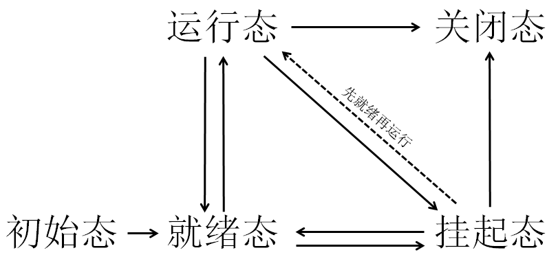
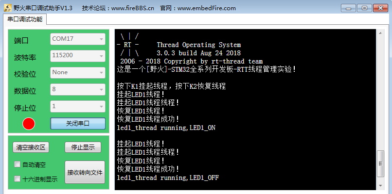

.. vim: syntax=rst

线程管理
-----------------

线程的基本概念
~~~~~~~

从系统的角度看，线程是竞争系统资源的最小运行单元。RT-Thread是一个支持多线程的操作系统。在RT-Thread中，线程可以使用或等待CPU、使用内存空间等系统资源，并独立于其它线程运行。

简而言之： RT-Thread的线程可认为是一系列独立线程的集合。每个线程在自己的环境中运行。在任何时刻，只有一个线程得到运行，RT-
Thread调度器决定运行哪个线程。调度器会不断启动、停止每一个线程，宏观看上去所有的线程都在同时在执行。作为线程，不需要对调度器的活动有所了解，在线程切入切出时保存上下文环境（寄存器值、堆栈内容）是调度器主要的职责。为了实现这点，每个RT-
Thread线程都需要有自己的堆栈。当线程切出时，它的执行环境会被保存在该线程的堆栈中，这样当线程再次运行时，就能从堆栈中正确的恢复上次的运行环境。

RT-Thread的线程模块可以给用户提供多个线程，实现了线程之间的切换和通信，帮助用户管理业务程序流程。这样用户可以将更多的精力投入到业务功能的实现中。

RT-Thread中的线程是抢占式调度机制，同时支持时间片轮转调度方式。

高优先级的线程可打断低优先级线程，低优先级线程必须在高优先级线程阻塞或结束后才能得到调度。

线程调度器的基本概念
~~~~~~~~~~

RT-Thread中提供的线程调度器是基于优先级的全抢占式调度：在系统中除了中断处理函数、调度器上锁部分的代码和禁止中断的代码是不可抢占的之外，系统的其他部分都是可以抢占的，包括线程调度器自身。系统总共支持256个优先级(0 ～
255，数值越小的优先级越高，0为最高优先级，255分配给空闲线程使用，一般用户不使用。在一些资源比较紧张的系统中，可以根据实际情况选择只支持8个或32个优先级的系统配置)。在系统中，当有比当前线程优先级更高的线程就绪时，当前线程将立刻被换出，高优先级线程抢占处理器运行。

一个操作系统如果只是具备了高优先级线程能够“立即”获得处理器并得到执行的特点，那么它仍然不算是实时操作系统。因为这个查找最高优先级线程的过程决定了调度时间是否具有确定性，例如一个包含n个就绪线程的系统中，如果仅仅从头找到尾，那么这个时间将直接和n相关，而下一个就绪线程抉择时间的长短将会极大的影响系统
的实时性。当所有就绪线程都链接在它们对应的优先级队列中时，抉择过程就将演变为在优先级数组中寻找具有最高优先级线程的非空链表。RT-Thread内核中采用了基于位图的优先级算法（时间复杂度O(1)，即与就绪线程的多少无关），通过位图的定位快速的获得优先级最高的线程，具体见10.1.1 1小节。

RT-Thread内核中也允许创建相同优先级的线程。相同优先级的线程采用时间片轮转方式进行调度（也就是通常说的分时调度器），时间片轮转调度仅在当前系统中无更高优先级就绪线程存在的情况下才有效。因为RT-Thread调度器的实现是采用优先级链表的方式，所以系统中的总线程数不受限制，只和系统所能提供的内
存资源相关。为了保证系统的实时性，系统尽最大可能地保证高优先级的线程得以运行。线程调度的原则是一旦线程状态发生了改变，并且当前运行的线程优先级小于优先级队列组中线程最高优先级时，立刻进行线程切换（除非当前系统处于中断处理程序中或禁止线程切换的状态）。

线程状态的概念
~~~~~~~

RT-Thread系统中的每一线程都有多种运行状态。系统初始化完成后，创建的线程就可以在系统中竞争一定的资源，由内核进行调度。

线程状态通常分为以下四种：

-  初始态（RT_THREAD_INIT）：创建线程的时候会将线程的状态设置为初始态。

-  就绪态（RT_THREAD_READY）：该线程在就绪列表中，就绪的线程已经具备执行的能力，只等待CPU。

-  运行态（RT_THREAD_RUNNING）：该线程正在执行，此时它占用处理器。

-  挂起态（RT_THREAD_SUSPEND）：如果线程当前正在等待某个时序或外部中断，我们就说这个线程处于挂起状态，该线程不在就绪列表中。包含线程被挂起、线程被延时、线程正在等待信号量、读写队列或者等待读写事件等。

-  关闭态（RT_THREAD_CLOSE）：该线程运行结束，等待系统回收资源。

线程状态迁移
~~~~~~

RT-Thread系统中的每一个线程都有多种运行状态，他们之间的转换关系是怎么样的呢？从运行态线程变成阻塞态，或者从阻塞态变成就绪态，这些线程状态是怎么迁移的呢，下面就让我们一起了解线程状态迁移吧，具体见

|thread002|

图 17‑1线程状态迁移图

初始态→就绪态：线程创建后进入初始态（RT_THREAD_INIT），在线程启动的时候（调用rt_thread_startup()函数）会将初始态转变为就绪态，表明线程已启动，线程可以进行调度。

就绪态（RT_THREAD_READY）→运行态：发生线程切换时，就绪列表中最高优先级的线程被执行，从而进入运行态（RT_THREAD_RUNNING）。

运行态（RT_THREAD_RUNNING）→挂起态：正在运行的线程发生阻塞（挂起、延时、读信号量等待）时，该线程会从就绪列表中删除，线程状态由运行态变成挂起态，然后发生线程切换，运行就绪列表中最高优先级线程。

挂起态（RT_THREAD_SUSPEND）→就绪态（阻塞态→运行态）：阻塞的线程被恢复后（线程恢复、延时时间超时、读信号量超时或读到信号量等），此时被恢复的线程会被加入就绪列表，从而由挂起态变成就绪态；此时如果被恢复线程的优先级高于正在运行线程的优先级，则会发生线程切换，将该线程由就绪态变成运行态
。

就绪态（RT_THREAD_READY）→挂起态：线程也有可能在就绪态时被挂起，此时线程状态会由就绪态转变为挂起态，该线程从就绪列表中删除，不会参与线程调度，直到该线程被恢复。

运行态（RT_THREAD_RUNNING）→就绪态：有更高优先级线程创建或者恢复后，会发生线程调度，此刻就绪列表中最高优先级线程变为运行态，那么原先运行的线程由运行态变为就绪态，依然在就绪列表中。

挂起态→关闭态（RT_THREAD_CLOSE）：处于挂起的线程被调用删除接口，线程状态由挂起态变为关闭态。

运行态→关闭态：运行状态的线程，如果运行结束会在线程最后部分执行rt_thread_exit()函数而更改为关闭状态（RT_THREAD_CLOSE）。

常用的线程函数讲解
~~~~~~~~~

相信大家通过第一部分章节的学习，对线程创建以及线程调度的实现已经掌握了，下面就补充一些RT-Thread提供给我们对线程操作的一些常用函数。

线程挂起函数rt_thread_suspend()
^^^^^^^^^^^^^^^^^^^^^^^^^

挂起指定线程。被挂起的线程绝不会得到处理器的使用权，不管该线程具有什么优先级。

线程挂起可以由多种方法实现：线程调用rt_thread_delay()、rt_thread_suspend()等函数接口可以使得线程主动挂起，放弃CPU使用权，当线程调用rt_sem_take()，rt_mb_recv()等函数时，资源不可使用也会导致调用线程被动挂起。

当线程已经是挂起态的时候无法调用rt_thread_suspend()函数，已经是挂起态的线程调用rt_thread_suspend()将返回错误代码，挂起的线程想要恢复可以调用rt_thread_resume()函数。线程挂起是我们经常使用的一个函数，下面一起看看线程挂起的源码，了解其工作过程，具
体见代码清单 17‑1。

代码清单 17‑1线程挂起函数rt_thread_suspend()源码

1 rt_err_t rt_thread_suspend(rt_thread_t thread)

2 {

3 register rt_base_t temp;

4

5 /\* 线程检查 \*/

6 RT_ASSERT(thread != RT_NULL); **(1)**

7

8 RT_DEBUG_LOG(RT_DEBUG_THREAD, ("thread suspend: %s\n", thread->name));

9

10 if ((thread->stat & RT_THREAD_STAT_MASK) != RT_THREAD_READY) {**(2)**

11 RT_DEBUG_LOG(RT_DEBUG_THREAD, ("thread suspend: thread disorder, 0x%2x\n",

12 thread->stat));

13

14 return -RT_ERROR;

15 }

16

17 /\* 关中断 \*/

18 temp = rt_hw_interrupt_disable();

19

20 /\* 改变状态 \*/

21 thread->stat = RT_THREAD_SUSPEND \| (thread->stat &

22 ~RT_THREAD_STAT_MASK); **(3)**

23 rt_schedule_remove_thread(thread);

24 /\* 停止线程计时器 \*/

25 rt_timer_stop(&(thread->thread_timer)); **(4)**

26

27 /\* 开中断 \*/

28 rt_hw_interrupt_enable(temp);

29

30 RT_OBJECT_HOOK_CALL(rt_thread_suspend_hook, (thread));

31 return RT_EOK;

32 }

代码清单 17‑1\ **(1)**\ ：判断线程是否有效，如果是没被创建的线程，那么无法挂起。

代码清单 17‑1\ **(2)**\ ：判断要挂起线程的状态，如果是已经挂起了，会返回错误码，用户可以在恢复线程后再挂起。

代码清单 17‑1\ **(3)**\ ：将线程的状态变为挂起态。

代码清单 17‑1\ **(4)**\ ：停止线程计时器。

注：通常不应该使用这个函数来挂起线程本身，如果确实需要采用rt_thread_suspend函数挂起当前线程，需要在调用rt_thread_suspend()函数后立刻调用rt_schedule()函数进行手动的线程上下文切换。

线程的挂起与恢复函数在很多时候都是很有用的，比如我们想暂停某个线程运行一段时间，但是我们又需要在其恢复的时候继续工作，那么删除线程是不可能的，因为删除了线程的话，线程的所有的信息都是不可能恢复的了，删除是完完全全删除了，里面的资源都被系统释放掉，但是挂起线程就不会这样子，调用挂起线程函数，仅仅是将线
程进入阻塞态，其内部的资源都会保留下来，同时也不会参与线程的调度，当调用恢复函数的时候，整个线程立即从阻塞态进入就绪态，参与线程的调度，如果该线程的优先级是当前就绪态优先级最高的线程，那么立即会按照挂起前的线程状态继续执行该线程，从而达到我们需要的效果，注意，是继续执行，也就是说，暂停线程之前是什么
状态，都会被系统保留下来，在恢复的瞬间，继续执行。这个线程函数的使用方法是很简单的，只需把线程控制块传递进来即可，rt_thread_suspend()会根据线程控制块的信息将对应的线程挂起，具体见代码清单 17‑2加粗部分。

代码清单 17‑2线程挂起函数rt_thread_suspend()实例

1 rt_kprintf("挂起LED1线程！\n");

**2 uwRet = rt_thread_suspend(led1_thread);/\* 挂起LED1线程 \*/**

3 if (RT_EOK == uwRet)

4 {

5 rt_kprintf("挂起LED1线程成功！\n");

6 } else

7 {

8 rt_kprintf("挂起LED1线程失败！失败代码：0x%lx\n",uwRet);

9 }

线程恢复函数rt_thread_resume()
^^^^^^^^^^^^^^^^^^^^^^^^

既然有线程的挂起，那么当然一样有恢复，不然线程怎么恢复呢，线程恢复就是让挂起的线程重新进入就绪状态，恢复的线程会保留挂起前的状态信息，在恢复的时候根据挂起时的状态继续运行。如果被恢复线程在所有就绪态线程中，位于最高优先级链表的第一位，那么系统将进行线程上下文的切换。下面一起看看线程恢复函数rt_th
read_resume()的源码，具体见代码清单 17‑3。

代码清单 17‑3线程恢复函数rt_thread_resume()源码

1 rt_err_t rt_thread_resume(rt_thread_t thread)

2 {

3 register rt_base_t temp;

4

5 /\* 线程检查 \*/

6 RT_ASSERT(thread != RT_NULL);

7

8 RT_DEBUG_LOG(RT_DEBUG_THREAD, ("thread resume: %s\n", thread->name));

9

10 if ((thread->stat & RT_THREAD_STAT_MASK) != RT_THREAD_SUSPEND) {**(1)**

11 RT_DEBUG_LOG(RT_DEBUG_THREAD, ("thread resume: thread disorder, %d\n",

12 thread->stat));

13

14 return -RT_ERROR;

15 }

16

17 /\* 关中断 \*/

18 temp = rt_hw_interrupt_disable();

19

20 /\* 从列表删除 \*/

21 rt_list_remove(&(thread->tlist)); **(2)**

22

23 rt_timer_stop(&thread->thread_timer);

24

25 /\* 开中断 \*/

26 rt_hw_interrupt_enable(temp);

27

28 /\* 加入就绪列表 \*/

29 rt_schedule_insert_thread(thread); **(3)**

30

31 RT_OBJECT_HOOK_CALL(rt_thread_resume_hook, (thread));

32 return RT_EOK;

33 }

代码清单 17‑3\ **(1)**\ ：判断线程是否有效，如果是没被创建的线程，那么无法恢复。并且检查当前线程是否已经挂起，要恢复的线程当然是必须是挂起态的，如果不是挂起态的根本不需要进行恢复。

代码清单 17‑3\ **(2)**\ ：将线程从挂起列表中删除。

代码清单 17‑3\ **(3)**\ ：将恢复的线程加入就绪列表，但是此时线程能不能立即运行是根据其优先级决定的，如果该线程的优先级在就绪列表中最高，那么是可以立即运行的。

线程的恢复是十分简单的，简单来说就是将线程状态从挂起列表移到就绪列表中，当线程的优先级为最高的时候，就发起线程切换。下面来看看线程恢复函数rt_thread_resume()的使用实例，具体见代码清单 17‑4加粗部分。

代码清单 17‑4线程恢复函数rt_thread_resume()实例

1 rt_kprintf("恢复LED1线程！\n");

**2 uwRet = rt_thread_resume(led1_thread);/\* 恢复LED1线程！ \*/**

3 if (RT_EOK == uwRet)

4 {

5 rt_kprintf("恢复LED1线程成功！\n");

6 } else

7 {

8 rt_kprintf("恢复LED1线程失败！失败代码：0x%lx\n",uwRet);

9 }

10 }

线程的设计要点
~~~~~~~

作为一个嵌入式开发人员，要对自己设计的嵌入式系统要了如指掌，线程的优先级信息，线程与中断的处理，线程的运行时间、逻辑、状态等都要知道，才能设计出好的系统，所以，在设计的时候需要根据需求制定框架。在设计之初就应该考虑下面几点因素：线程运行的上下文环境、线程的执行时间合理设计。

RT-Thread中程序运行的上下文包括：

-  中断服务函数。

-  普通线程。

-  空闲线程。

1. 中断服务函数：

中断服务函数是一种需要特别注意的上下文环境，它运行在非线程的执行环境下（一般为芯片的一种特殊运行模式（也被称作特权模式）），在这个上下文环境中不能使用挂起当前线程的操作，不允许调用任何会阻塞运行的API函数接口。另外需要注意的是，中断服务程序最好保持精简短小，快进快出，一般在中断服务函数中只做标记事
件的发生，让对应线程去执行相关处理，因为中断服务函数的优先级高于任何优先级的线程，如果中断处理时间过长，将会导致整个系统的线程无法正常运行。所以在设计的时候必须考虑中断的频率、中断的处理时间等重要因素，以便配合对应中断处理线程的工作。

2. 线程：

线程看似没有什么限制程序执行的因素，似乎所有的操作都可以执行。但是做为一个优先级明确的实时系统，如果一个线程中的程序出现了死循环操作（此处的死循环是指没有不带阻塞机制的线程循环体），那么比这个线程优先级低的线程都将无法执行，当然也包括了空闲线程，因为死循环的时候，线程不会主动让出CPU，低优先级的线
程是不可能得到CPU的使用权的，而高优先级的线程就可以抢占CPU。这个情况在实时操作系统中是必须注意的一点，所以在线程中不允许出现死循环。如果一个线程只有就绪态而无阻塞态，势必会影响到其他低优先级线程的执行，所以在进行线程设计时，就应该保证线程在不活跃的时候，线程可以进入阻塞态以交出CPU使用权，这
就需要我们自己明确知道什么情况下让线程进入阻塞态，保证低优先级线程可以正常运行。在实际设计中，一般会将紧急的处理事件的线程优先级设置得高一些。

3. 空闲线程：

空闲线程（idle线程）是RT-Thread系统中没有其他工作进行时自动进入的系统线程。用户可以通过空闲线程钩子方式，在空闲线程上钩入自己的功能函数。通常这个空闲线程钩子能够完成一些额外的特殊功能，例如系统运行状态的指示，系统省电模式等。除了空闲线程钩子，RT-
Thread系统还把空闲线程用于一些其他的功能，比如当系统删除一个线程或一个动态线程运行结束时，会先行更改线程状态为非调度状态，然后挂入一个待回收队列中，真正的系统资源回收工作在空闲线程完成，空闲线程是唯一不允许出现阻塞情况的线程，因为RT-Thread需要保证系统用于都有一个可运行的线程。

对于空闲线程钩子上挂接的空闲钩子函数，它应该满足以下的条件：

-  不会挂起空闲线程；

-  不应该陷入死循环，需要留出部分时间用于系统处理系统资源回收。

线程的执行时间：

线程的执行时间一般是指两个方面，一是线程从开始到结束的时间，二是线程的周期。

在系统设计的时候这两个时间候我们都需要考虑，例如，对于事件A对应的服务线程Ta，系统要求的实时响应指标是10ms，而Ta的最大运行时间是1ms，那么10ms就是线程Ta的周期了，1ms则是线程的运行时间，简单来说线程Ta在10ms内完成对事件A的响应即可。此时，系统中还存在着以50ms为周期的另一线
程Tb，它每次运行的最大时间长度是100us。在这种情况下，即使把线程Tb的优先级抬到比Ta更高的位置，对系统的实时性指标也没什么影响，因为即使在Ta的运行过程中，Tb抢占了Ta的资源，等到Tb执行完毕，消耗的时间也只不过是100us，还是在事件A规定的响应时间内(10ms)，Ta能够安全完成对事件
A的响应。但是假如系统中还存在线程Tc，其运行时间为20ms，假如将Tc的优先级设置比Ta更高，那么在Ta运行的时候，突然间被Tc打断，等到Tc执行完毕，那Ta已经错过对事件A（10ms）的响应了，这是不允许的。所以在我们设计的时候，必须考虑线程的时间，一般来说处理时间更短的线程优先级应设置更高一些
。

线程管理实验
~~~~~~

线程管理实验是将线程常用的函数进行一次实验，在野火STM32开发板上进行该试验，通过创建两个线程，一个是LED线程，另一个是按键线程，LED线程是显示线程运行的状态，而按键线程是通过检测按键的按下与否来进行对LED线程的挂起与恢复，具体见代码清单 17‑5加粗部分。

代码清单 17‑5线程管理实验源码

1 /*\*

2 \\*

3 \* @file main.c

4 \* @author fire

5 \* @version V1.0

6 \* @date 2018-xx-xx

7 \* @brief RT-Thread 3.0 + STM32 线程管理

8 \\*

9 \* @attention

10 \*

11 \* 实验平台:基于野火STM32全系列（M3/4/7）开发板

12 \* 论坛 :http://www.firebbs.cn

13 \* 淘宝 :https://fire-stm32.taobao.com

14 \*

15 \\*

16 \*/

17

18 /\*

19 \\*

20 \* 包含的头文件

21 \\*

22 \*/

23 #include "board.h"

24 #include "rtthread.h"

25

26

27 /\*

28 \\*

29 \* 变量

30 \\*

31 \*/

32 /\* 定义线程控制块 \*/

33 static rt_thread_t led1_thread = RT_NULL;

34 static rt_thread_t key_thread = RT_NULL;

35 /\*

36 \\*

37 \* 函数声明

38 \\*

39 \*/

**40 static void led1_thread_entry(void\* parameter);**

**41 static void key_thread_entry(void\* parameter);**

42

43 /\*

44 \\*

45 \* main 函数

46 \\*

47 \*/

48 /*\*

49 \* @brief 主函数

50 \* @param 无

51 \* @retval 无

52 \*/

53 int main(void)

54 {

55 /\*

56 \* 开发板硬件初始化，RTT系统初始化已经在main函数之前完成，

57 \* 即在component.c文件中的rtthread_startup()函数中完成了。

58 \* 所以在main函数中，只需要创建线程和启动线程即可。

59 \*/

**60 rt_kprintf("这是一个[野火]-STM32全系列开发板RTT线程管理实验！\n\n");**

**61 rt_kprintf("按下K1挂起线程，按下K2恢复线程\n");**

**62 led1_thread = /\* 线程控制块指针 \*/**

**63 rt_thread_create( "led1", /\* 线程名字 \*/**

**64 led1_thread_entry, /\* 线程入口函数 \*/**

**65 RT_NULL, /\* 线程入口函数参数 \*/**

**66 512, /\* 线程栈大小 \*/**

**67 3, /\* 线程的优先级 \*/**

**68 20); /\* 线程时间片 \*/**

**69**

**70 /\* 启动线程，开启调度 \*/**

**71 if (led1_thread != RT_NULL)**

**72 rt_thread_startup(led1_thread);**

**73 else**

**74 return -1;**

**75**

**76 key_thread = /\* 线程控制块指针 \*/**

**77 rt_thread_create( "key", /\* 线程名字 \*/**

**78 key_thread_entry, /\* 线程入口函数 \*/**

**79 RT_NULL, /\* 线程入口函数参数 \*/**

**80 512, /\* 线程栈大小 \*/**

**81 2, /\* 线程的优先级 \*/**

**82 20); /\* 线程时间片 \*/**

**83**

**84 /\* 启动线程，开启调度 \*/**

**85 if (key_thread != RT_NULL)**

**86 rt_thread_startup(key_thread);**

**87 else**

**88 return -1;**

89 }

90

91 /\*

92 \\*

93 \* 线程定义

94 \\*

95 \*/

96

**97 static void led1_thread_entry(void\* parameter)**

**98 {**

**99**

**100 while (1) {**

**101 LED1_ON;**

**102 rt_thread_delay(500); /\* 延时500个tick \*/**

**103 rt_kprintf("led1_thread running,LED1_ON\r\n");**

**104**

**105 LED1_OFF;**

**106 rt_thread_delay(500); /\* 延时500个tick \*/**

**107 rt_kprintf("led1_thread running,LED1_OFF\r\n");**

**108 }**

**109 }**

110

**111 static void key_thread_entry(void\* parameter)**

**112 {**

**113 rt_err_t uwRet = RT_EOK;**

**114 while (1) {/\* K1 被按下 \*/**

**115 if ( Key_Scan(KEY1_GPIO_PORT,KEY1_GPIO_PIN) == KEY_ON ) {**

**116 rt_kprintf("挂起LED1线程！\n");**

**117 uwRet = rt_thread_suspend(led1_thread);/\* 挂起LED1线程 \*/**

**118 if (RT_EOK == uwRet) {**

**119 rt_kprintf("挂起LED1线程成功！\n");**

**120 } else {**

**121 rt_kprintf("挂起LED1线程失败！失败代码：0x%lx\n",uwRet);**

**122 }**

**123 }/\* K2 被按下 \*/**

**124 if ( Key_Scan(KEY2_GPIO_PORT,KEY2_GPIO_PIN) == KEY_ON ) {**

**125 rt_kprintf("恢复LED1线程！\n");**

**126 uwRet = rt_thread_resume(led1_thread);/\* 恢复LED1线程！ \*/**

**127 if (RT_EOK == uwRet) {**

**128 rt_kprintf("恢复LED1线程成功！\n");**

**129 } else {**

**130 rt_kprintf("恢复LED1线程失败！失败代码：0x%lx\n",uwRet);**

**131 }**

**132 }**

**133 rt_thread_delay(20);**

**134 }**

**135 }**

136 /END OF FILE/

实验现象
~~~~

将程序编译好，用USB线连接电脑和开发板的USB接口（对应丝印为USB转串口），用DAP仿真器把配套程序下载到野火STM32开发板（具体型号根据你买的板子而定，每个型号的板子都配套有对应的程序），在电脑上打开串口调试助手，然后复位开发板就可以在调试助手中看到rt_kprintf的打印信息，在开发板可
以看到，LED在闪烁，按下开发版的K1按键挂起线程，按下K2按键恢复线程；我们按下K1试试，可以看到开发板上的灯也不闪烁了，同时在串口调试助手也输出了相应的信息，说明线程已经被挂起，我们按下K2试试，可以看到开发板上的灯也恢复闪烁了，同时在串口调试助手也输出了相应的信息，说明线程已经被恢复，具体见图
17‑2。

注意：由于RT-
Thread中挂起线程函数不允许将已经在阻塞态的线程进行操作，而我们的实验中LED线程的延时函数会将线程挂起进入阻塞态，所以，在挂起的时候可能会挂起失败，多尝试几次即可。我们一般调用挂起函数是在线程就绪或者运行的时候将其挂起，而不是在挂起态再将线程挂起，本实验仅为演示与介绍如何使用RT-
Thread的挂起与恢复函数。

|thread003|

图 17‑2线程管理实验现象

