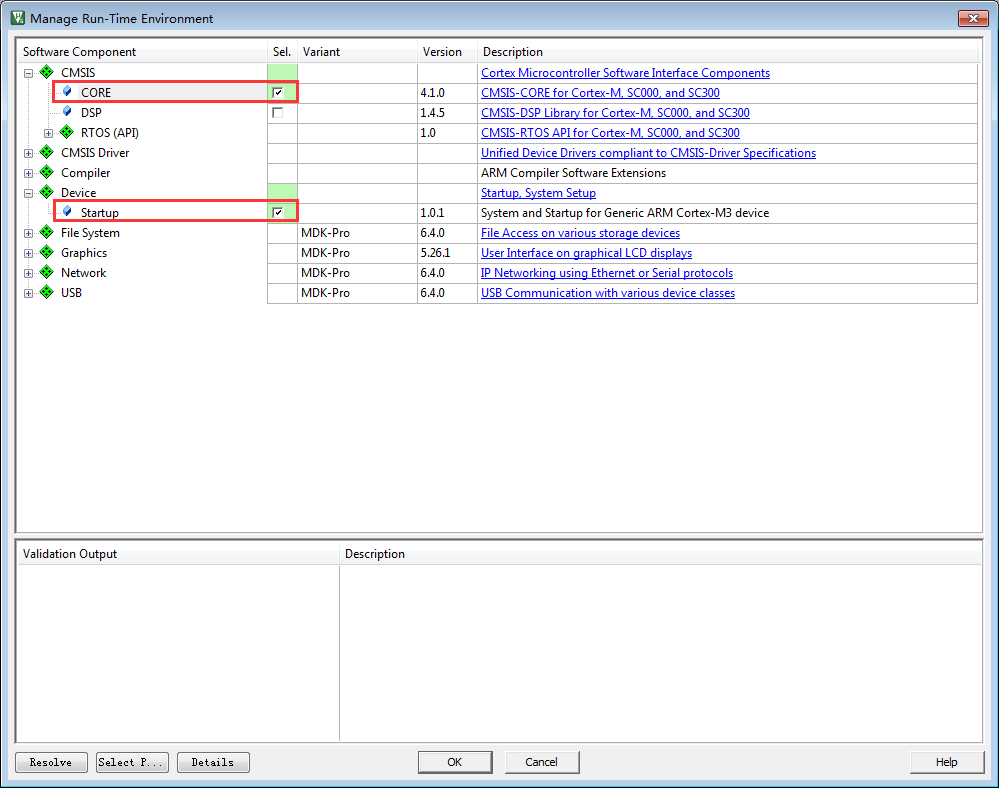
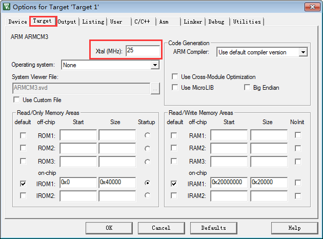

.. vim: syntax=rst

新建RT-Thread工程—软件仿真
------------------

在开始写RT-Thread内核之前，我们先新建一个RT-Thread的工程，Device选择Cortex-M3（Cortex-M4或Cortex-M7）内核的处理器，调试方式选择软件仿真，然后我们再开始一步一步地教大家把RT-Thread内核从0到1写出来，让大家彻底搞懂RT-
Thread的内部实现和设计的哲学思想。最后我们再把RT-Thread移植到野火STM32开发板上，到了最后的移植其实已经非常简单，只需要换一下启动文件和添加bsp驱动就行。

新建本地工程文件夹
~~~~~~~~~

在开始新建工程之前，我们先在本地电脑端新建一个文件夹用于存放工程。文件夹名字我们取为“新建RT-Thread工程—软件仿真”（名字可以随意取），然后再在该文件夹下面新建各个文件夹和文件，有关这些文件夹的包含关系和作用具体见表格 4‑1。

表格 4‑1工程文件夹根目录下的文件夹的作用

============== ==================== ============================================================================================================================
文件夹名称     文件夹               文件夹作用
============== ==================== ============================================================================================================================
Doc            -                    用于存放对整个工程的说明文件，如readme.txt。通常情况下，我们都要对整个工程实现的功能，如何编译，如何使用等做一个简要的说明。
Project        -                    用于存放新建的工程文件。
rtthread/3.0.3 bsp                  存放板级支持包，暂时为空。
\              components/finsh     存放RT-Thread组件，暂时未空。
\              include              存放头文件，暂时为空。
\              include/libc
\              libcpu/arm/cortex-m0 存放与处理器相关的接口文件，暂时为空。
\              libcpu/arm/cortex-m3
\              libcpu/arm/cortex-m4
\              libcpu/arm/cortex-m7
\              src                  存放RT-Thread内核源码，暂时为空。
User                                存放main.c和其它的用户编写的程序，main.c第一次使用需要用户自行新建。
============== ==================== ============================================================================================================================

使用KEIL新建工程
~~~~~~~~~~

开发环境我们使用KEIL5，版本为5.23，高于或者低于5.23都行，只要是版本5就行。

New Progect
^^^^^^^^^^^

首先打开KEIL5软件，新建一个工程，工程文件放在目录Project下面，名称命名为Fire_RT-Thread，其中Fire表示野火的意思，当然你也可以换成其它名称，但是必须是英文，不能是中文，切记。

Select Device For Target
^^^^^^^^^^^^^^^^^^^^^^^^

当命名好工程名称，点击确定之后会弹出Select Device for Target的选项框，让我们选择处理器，这里我们选择ARMCM3（ARMCM4或ARMCM7），具体见图 4‑1（图 4‑2或图 4‑3）。

|creati002|

图 4‑1 Select Device（ARMCM3） For Target

|creati003|

图 4‑2 Select Device（ARMCM4） For Target

|creati004|

图 4‑3 Select Device（ARMCM7） For Target

Manage Run-Time Environment
^^^^^^^^^^^^^^^^^^^^^^^^^^^

选择好处理器，点击OK按钮后会弹出Manage Run-Time Environment选项框。这里我们在CMSIS栏选中CORE和Device栏选中Startup这两个文件即可，具体见图 4‑4。

|creati005|

图 4‑4Manage Run-Time Environment

点击OK，关闭Manage Run-Time Environment选项框之后，刚刚我们选择的CORE和Startup这两个文件就会添加到我们的工程组里面，具体见图 4‑5。

|creati006|

图 4‑5CORE（即system）和Startup文件

其实这两个文件刚开始都是存放在KEIL的安装目录下，当我们配置Manage Run-Time Environment选项框之后，软件就会把选中好的文件从KEIL的安装目录拷贝到我们的工程目录：Project\RTE\Device\ARMCM3（ARMCM4或ARMCM7）下面。其中startup_A
RMCM3.s（startup_ARMCM4.s或startup_ARMCM7.s）是汇编编写的启动文件，system_ARMCM3.c（startup_ARMCM4.c或startup_ARMCM7.c）是C语言编写的跟时钟相关的文件。更加具体的可直接阅读这两个文件的源码。只要是Cortex-M3
（ARMCM4或ARMCM7）内核的单片机，这两个文件都适用。

在KEIL工程里面新建文件组
~~~~~~~~~~~~~~

在工程里面添加user、rtt/ports、rtt/source和doc这几个文件组，用于管理文件，具体见图 4‑6。

|creati007|

图 4‑6新添加的文件组

对于新手，这里有个问题就是如何添加文件组？具体的方法为鼠标右键Target1，在弹出的选项里面选择Add Group…即可，具体见图 4‑7，需要多少个组就鼠标右击多少次Target1。

|creati008|

图 4‑7 如何添加组

在KEIL工程里面添加文件
~~~~~~~~~~~~~

在工程里面添加好组之后，我们需要把本地工程里面新建好的文件添加到工程里面。具体为把readme.txt文件添加到doc组，main.c添加到user组，至于RT-Thread相关的文件我们还没有编写，那么RT-Thread相关的组就暂时为空，具体见图 4‑8。

|creati009|

图 4‑8往组里面添加好的文件

对于新手，这里有个问题就是如何将本地工程里面的文件添加到工程组里里面？具体的方法为鼠标左键双击相应的组，在弹出的文件选择框中找到要添加的文件，默认的文件类型是C文件，如果要添加的是文本或者汇编文件，那么此时将看不到，这个时候就需要把文件类型选择为All Files，最后点击Add按钮即可，具体见图
4‑9。

|creati010|

图 4‑9如何往组里面添加文件

编写main函数
^^^^^^^^

一个工程如果没有main函数是编译不成功的，会出错。因为系统在开始执行的时候先执行启动文件里面的复位程序，复位程序里面会调用C库函数__main，__main的作用是初始化好系统变量，如全局变量，只读的，可读可写的等等。__main最后会调用__rtentry，再由__rtentry调用main函数
，从而由汇编跳入到C的世界，这里面的main函数就需要我们手动编写，如果没有编写main函数，就会出现main函数没有定义的错误，具体见图 4‑10。

|creati011|

图 4‑10没定义main函数的错误

main函数我们写在main.c文件里面，因为是刚刚新建工程，所以main函数暂时为空，具体见代码清单 4‑1。

代码清单 4‑1main函数

1 /\*

2 \\*

3 \* main函数

4 \\*

5 \*/

6 int main(void)

7 {

8 for (;;)

9 {

10 /\* 啥事不干 \*/

11 }

12 }

调试配置
~~~~

设置软件仿真
^^^^^^

最后，我们再配置下调试相关的配置即可。为了方便，我们全部代码都用软件仿真，即不需要开发板也不需要仿真器，只需要一个KEIL软件即可，有关软件仿真的配置具体见图 4‑11。

|creati012|

图 4‑11软件仿真的配置

修改时钟大小
^^^^^^

在时钟相关文件system_ARMCM3.c（system_ARMCM4.c或system_ARMCM7.c）的开头，有一段代码定义了系统时钟的大小为25M，具体见代码清单 4‑2。在软件仿真的时候，确保时间的准确性，代码里面的系统时钟跟软件仿真的时钟必须一致，所以Options for
Target->Target的时钟应该由默认的12M改成25M，具体见图 4‑12。

代码清单 4‑2 时钟相关宏定义

1 #define \__HSI ( 8000000UL)

2 #define \__XTAL ( 5000000UL)

3

4 #define \__SYSTEM_CLOCK (5*__XTAL) /\* 5*5000000 = 25M*/

|creati013|

图 4‑12 软件仿真时钟配置

添加头文件路径
^^^^^^^

在C/C++选项卡里面指定工程头文件的路径，不然编译会出错，头文件路径的具体指定方法见图 4‑13。

|creati014|

图 4‑13 指定头文件的路径

至此，一个完整的基于Cortex-M3（Cortex-M4或Cortex-M7）内核的RT-Thread软件仿真的工程就建立完毕。

.. |creati002| image:: media/creating_project/creati002.png
   :width: 3.56944in
   :height: 2.70022in

.. |creati008| image:: media/creating_project/creati008.png
   :width: 3.38194in
   :height: 1.91584in

