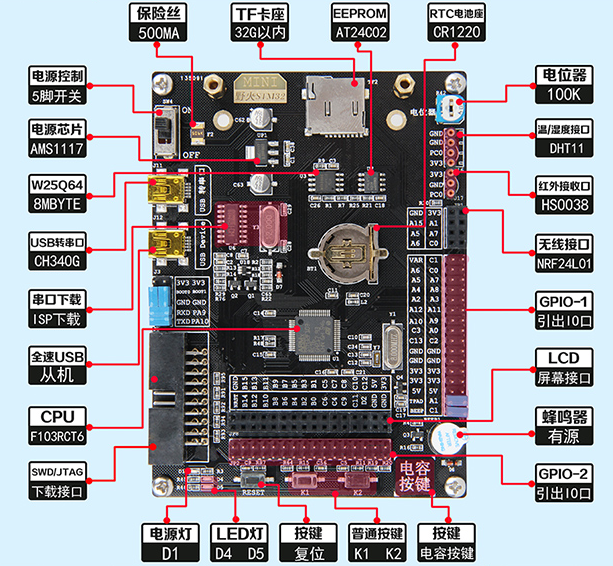
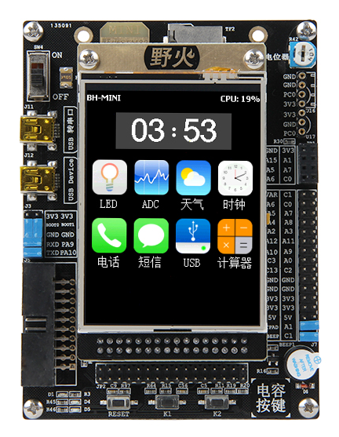
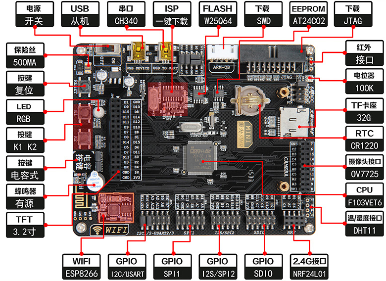
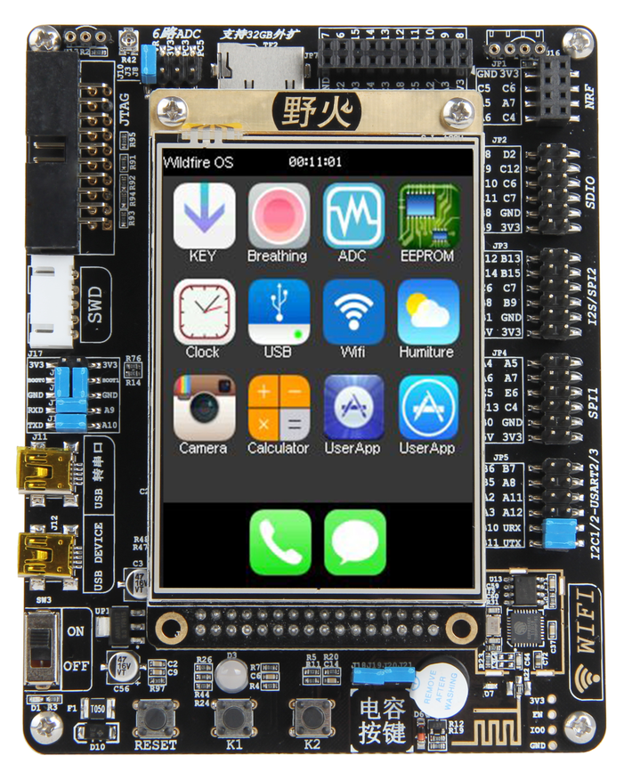
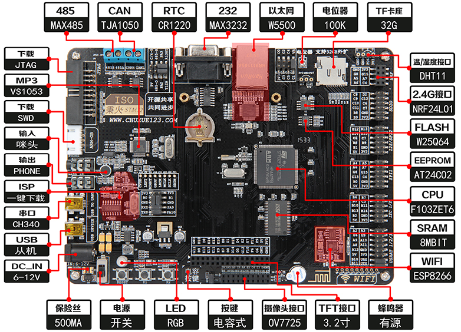
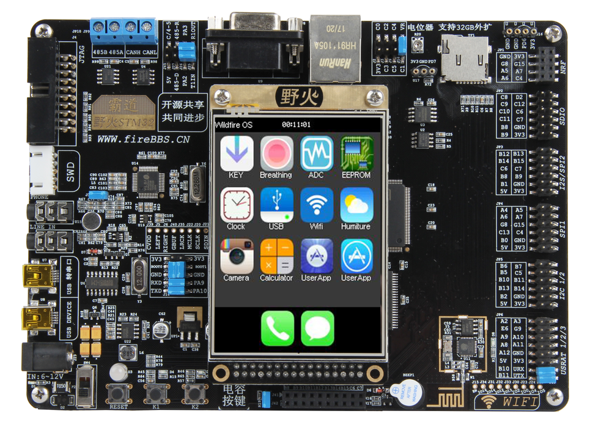
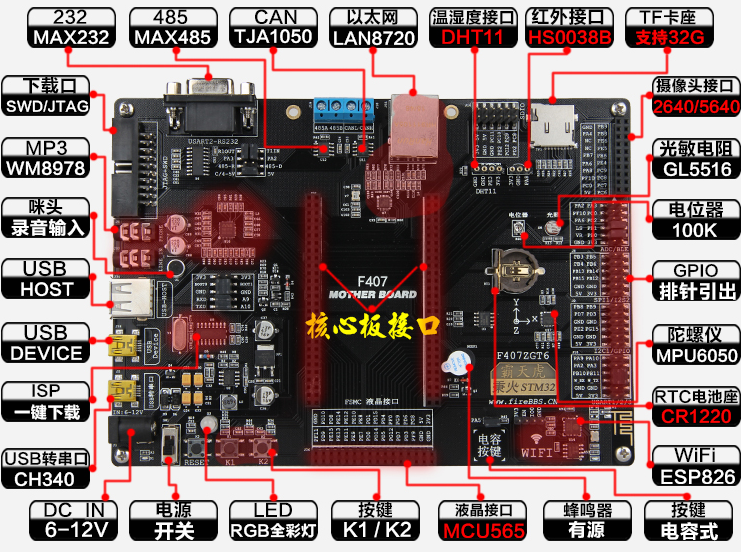
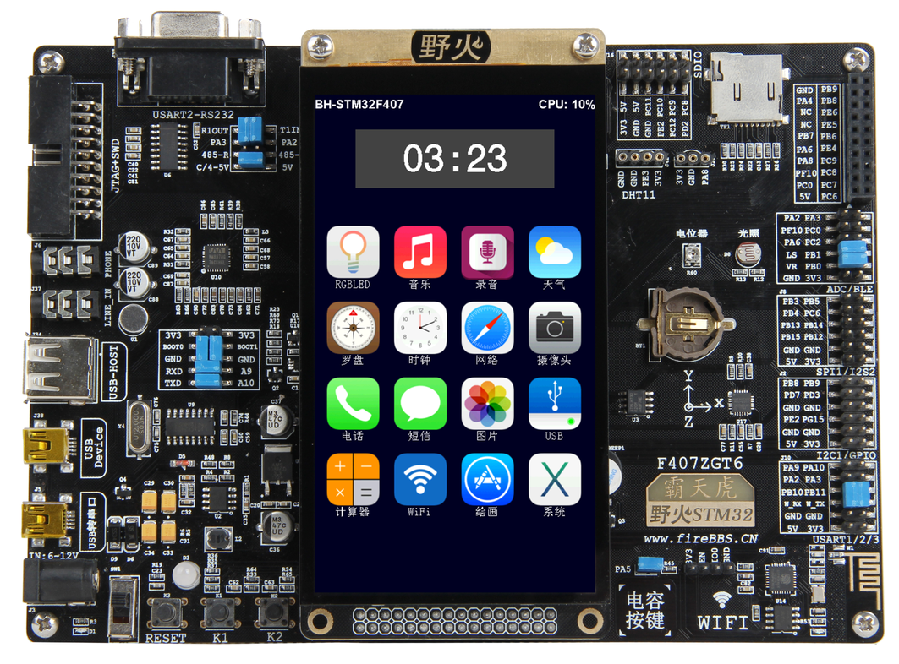
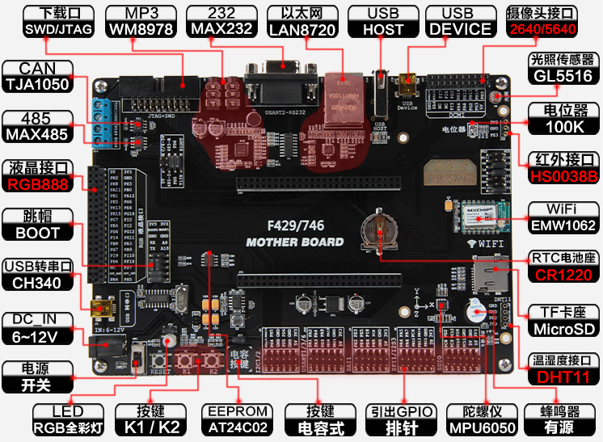
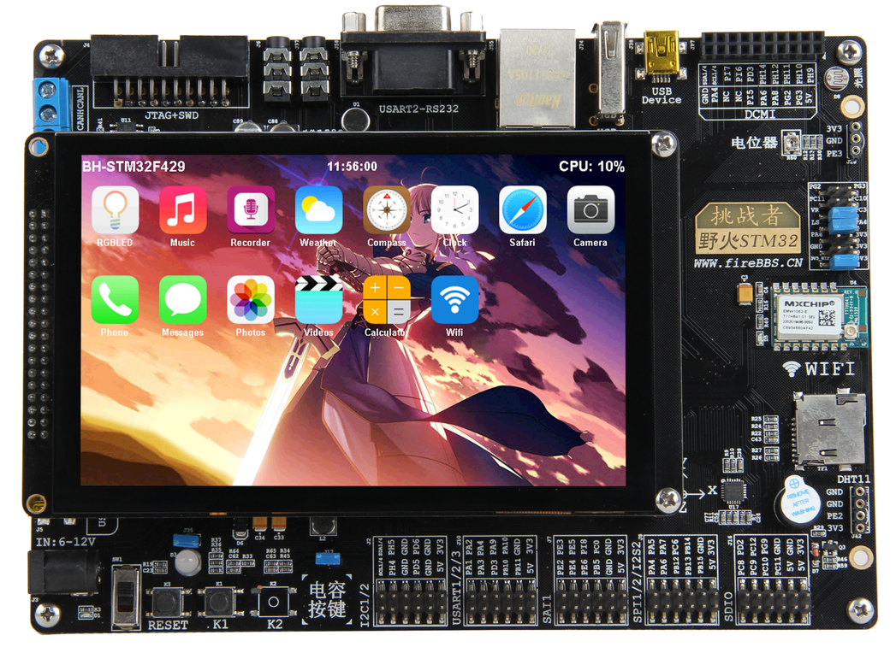

.. vim: syntax=rst

前言
------------------

关于本书
~~~~~~~~~~~

本书是野火嵌入式教学丛书“RTOS内核实现与应用开发实战指南的”RT-Thread版本，其中机械工业出版社出版的《FreeRTOS内核实现与应用开发实战指南—基于STM32》是该书的姐妹篇。因为两本书均是写RTOS的书籍，只是针对的RTOS对象不一样，所以书中凡是涉及到RTOS抽象层的理论部分均会有
很多相同的地方，具体的不同就体现为这两个RTOS的实现原理和代码层面上。

本书分为两个部分，第一部分为“从0到1叫你写RT-
Thread内核”，该部分的章节名字与其姐妹篇《FreeRTOS内核实现与应用开发实战指南—基于STM32》的章节名字基本类似，均采取循序渐进，层层叠加的方式来编排章节的序号和名字，但是在具体的内容上是不一样的，因为针对的RTOS不一样。其中“新建RT-
Thread工程—软件仿真”和“裸机系统与多任务系统”这两章属于理论的抽象层，不具体针对哪一个RTOS，所以基本一样。

本书第二部分为“RT-Thread内核应用开发”，主要讲解RT-Thread内核组件的源码实和API的使用，同样在章节命名和排序上也与该书的姐妹篇《FreeRTOS内核实现与应用开发实战指南—基于STM32》类似。对于什么是任务、阻塞延时和信号量的应用等这些RTOS的共同抽象层的理论讲解也基本类似，
但是具体涉及到这两个RTOS的原理实现和代码讲解的时候是完全不一样的，往往这部分的知识点才是读者要真正关心的内容。

我把这两本书归为姐妹篇是因为两书的编写风格、内容框架和章节命名与排序基本一致，语言阐述也类似，且涉及到RTOS抽象层的理论部分均相同，但不同的是凡是涉及到RTOS的实现原理、内核源码的讲解和上层API使用时，均是不一样的，而且这些内容才是本书的重点部分，是读者朋友关心和学习的核心。两本书又无法合并在
一起讲解，所以分为姐妹篇两本书。

如果读者已经学习了其中一本书，再学习另外一本的话，那么涉及到RTOS抽象层的理论部分可跳过，只需把精力放在RTOS内核的实现和源码API的应用方面。因为现有的RTOS，在理论层基本都是想通的，但在具体的码实现上又各有不同且各有特点，所以两书可以作为互补学习，只要掌握了其中一本的知识，再学习另外一本定
会得心应手，如有神助。

如何学习本书
~~~~~~

本书是首本系统讲解RT-Thread的中文书籍，共分为两个部分，第一部分为“从0到1教你写RT-Thread内核”，即重点讲解RT-Thread的原理实现，从0开始，不断迭代，教你怎么把RT-
Thread的内核写出来，让你彻底学会线程是如何定义的，系统是如何调度的（包括底层的汇编代码讲解），多优先级是如何实现的等等操作系统最深层次的知识。当你拿到本书开始学习的时候你一定会惊讶，原来RTOS的学习并没有那么复杂，反而是那么的有趣，原来自己也可以写RTOS，成就感立马爆棚。

当第一部分知识你彻底掌握好之后，再切换到其它RTOS的学习，那简直就是易如反掌，纵观现在市面上流行的几种RTOS，它们的内核的实现基本都差不多，只需要深入研究其中一种即可，没有必要每一种RTOS都深入的研究源码，如果你时间允许，看看那也无所谓。第二部分是“RT-
Thread内核应用开发”，重点讲解RT-Thread的移植，内核每个组件的应用，比起第一部分，这部分内容掌握起来比较容易。

全书内容循序渐进，不断迭代，前一章都是后一章的基础，必须从头开始阅读，不能进行跳跃式的阅读。在学习的时候务必做到两点：一是不能一味地看书，要把代码和书本结合起来学习，一边看书，一边调试代码。看书倒是很简单，那如何调试代码？即单步执行每一条程序，看看程序的执行流程和执行的效果与自己大脑所想是不是一样；
二是在每学完一章之后，必须将配套的例程重写一遍（切记不要复制，哪怕是一个分号，但可以抄），做到举一反三，确保真正理解。在自己写的时候肯定会错漏百出，这个时候要珍惜这些错误，好好调试，这是你提高编程能力的最好的机会。记住，程序不是一气呵成写出来的，而是一步一步调试出来的。

本书的参考资料
~~~~~~~

1. RT-Thread 官方源代码

2. RT-Thread_manual.zh.pdf（电子版）

3. 《STM32库开发实战指南》（电子版）

本书的编写风格
~~~~~~~

本书第一部分以RT-Thread Nano 3.0.3官方源码为蓝本，抽丝剥茧，不断迭代，教你怎么从0开始把RT-Thread内核写出来。书中涉及到的数据类型，变量名称、函数名称，文件名称，文件存放的位置都完全按照RT-Thread官方的方式来实现，当你学完这本书之后可以无缝地切换到原版的RT-
Thread的使用。要注意的是，在实现的过程中，某些函数我会去掉一些形参和一些冗余的代码，只保留核心的功能，但这并不会影响我们学习。

本书第二部分主要讲RT-Thread的移植和内核组件的使用，不会再去深入讲解源码，着重讲应用，如果对第一部分不感兴趣的朋友，可以跳过第一部分，直接进入第二部分的学习，两者之间没有必然的联系。

本书的配套硬件
~~~~~~~

本书支持野火STM32开发板全套系列，具体型号见表格 1‑1，具体图片见图 1‑1、图 1‑3、图 1‑5、图 1‑7和图
1‑9。其中野火挑战者有三个型号，分别为F429、F767和H743，它们共用同一个底板，只是核心板不一样。学习的时候如果配套这些硬件平台做实验，学习必会达到事半功倍的效果，可以省去中间硬件不一样时移植遇到的各种问题。

表格 1‑1 野火STM32开发板型号汇总

========== ========= ==== ===== =====
型号       区别
========== ========= ==== ===== =====
-          内核      引脚 RAM   ROM MINI       Cortex-M3 64   48KB  256KB 指南者     Cortex-M3 100  64KB  512KB 霸道       Cortex-M3 144  64KB  512KB 霸天虎
  Cortex-M4 144  192KB 1MB 挑战者F429 Cortex-M4 176  256KB 1MB 挑战者F767 Cortex-M7 176  512KB 1MB 挑战者H7   Cortex-M7 176  1MB   2MB ========== ========= ====
  ===== =====

|forewo002|

图 1‑1 野火【MINI】STM32F103RCT6 开发板

|forewo003|

图 1‑2 野火【MINI】STM32F103RCT6 开发板 带液晶效果图

|forewo004|

图 1‑3 野火【指南者】STM32F103VET6 开发板

|forewo005|

图 1‑4 野火【指南者】STM32F103VET6 开发板带液晶效果图

|forewo006|

图 1‑5 野火【霸道】STM32F103ZET6 开发板

|forewo007|

图 1‑6 野火【霸道】STM32F103ZET6 开发板带液晶显示效果图

|forewo008|

图 1‑7 野火【霸天虎】STM32F407ZGT6 开发板

|forewo009|

图 1‑8 野火【霸天虎】STM32F407ZGT6 开发板带液晶显示效果图

|forewo010|

图 1‑9 野火【挑战者】F429/F767/H743开发板

|forewo011|

图 1‑10 野火【挑战者】F429/F767/H74开发板 带液晶效果图

本书的技术论坛
~~~~~~~

如果在学习过程中遇到问题，可以到野火电子论坛：\ `www.firebbs.cn发帖交流 <http://www.firebbs.cn发帖交流>`__ ，开源共享，共同进步。

鉴于水平有限，本书难免有纰漏，热心的读者也可把勘误发到论坛好让我们改进做得更好，祝您学习愉快，RT-Thread的世界，野火与您同行。

