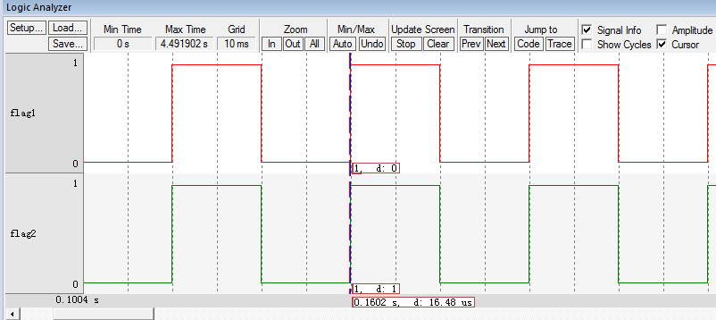

.. vim: syntax=rst

空闲线程与阻塞延时的实现
=========================

在上一章节中，线程体内的延时使用的是软件延时，即还是让CPU空等来达到延时的效果。使用RTOS的很大优势就是榨干CPU的性能，永远不能让它闲着，线程如果需要延时也就不能再让CPU空等来实现延时的效果。RTOS中的延时叫阻塞延时，即线程需要延时的时候，线程会放弃CPU的使用权，CPU可以去干其它的事情
，当线程延时时间到，重新获取CPU使用权，线程继续运行，这样就充分地利用了CPU的资源，而不是干等着。

当线程需要延时，进入阻塞状态，那CPU又去干什么事情了？如果没有其它线程可以运行，RTOS都会为CPU创建一个空闲线程，这个时候CPU就运行空闲线程。在RT-
Thread中，空闲线程是系统在初始化的时候创建的优先级最低的线程，空闲线程主体主要是做一些系统内存的清理工作。但是为了简单起见，我们本章实现的空闲线程只是对一个全局变量进行计数。鉴于空闲线程的这种特性，在实际应用中，当系统进入空闲线程的时候，可在空闲线程中让单片机进入休眠或者低功耗等操作。

实现空闲线程
~~~~~~~~~~~~~~~

定义空闲线程的栈
------------------

空闲线程的栈在idle.c（idle.c第一次使用需要自行在文件夹rtthread\3.0.3\src中新建并添加到工
程的rtt/source组）文件中定义，具体见 代码清单:空闲与阻塞-1_。

.. code-block:: c
    :caption: 代码清单:空闲与阻塞-1 定义空闲线程的栈
    :name: 代码清单:空闲与阻塞-1
    :linenos:

    #include <rtthread.h>
    #include <rthw.h>

    #define IDLE_THREAD_STACK_SIZE      512

    ALIGN(RT_ALIGN_SIZE)
    static rt_uint8_t rt_thread_stack[IDLE_THREAD_STACK_SIZE];

-   代码清单:空闲与阻塞-1_ （1）：空闲线程的栈是一个定义好的数组，大小由IDLE_THREAD_STACK_SIZE这个宏控制，默认为512，即128个字。

定义空闲线程的线程控制块
-------------------------

线程控制块是每一个线程必须的，空闲线程的的线程控制块在idle.c中定义，是一个全局变量，具体见 代码清单:空闲与阻塞-2_。

.. code-block:: c
    :caption: 代码清单:空闲与阻塞-2 定义空闲线程的线程控制块
    :name: 代码清单:空闲与阻塞-2
    :linenos:

    /* 空闲线程的线程控制块 */
    struct rt_thread idle;

定义空闲线程函数
-------------------

在RT-Thread中空闲线程函数主要是做一些系统内存的清理工作，但是为了简单起见，我们本章实现的空闲线程
只是对一个全局变量rt_idletask_ctr进行计数，rt_idletask_ctr在idle.c中定义，默认初始值为0。空闲
线程函数在idle.c定义，具体实现见 代码清单:空闲与阻塞-3_。

.. code-block:: c
    :caption: 代码清单:空闲与阻塞-3 空闲线程函数
    :name: 代码清单:空闲与阻塞-3
    :linenos:

    rt_ubase_t  rt_idletask_ctr = 0;

    void rt_thread_idle_entry(void *parameter)
    {
        parameter = parameter;
        while (1)
        {
            rt_idletask_ctr ++;
        }
    }

空闲线程初始化
----------------

当定义好空闲线程的栈，线程控制块和函数主体之后，我们需要空闲线程初始化函数将这三者联系在一起，
这样空闲线程才能够被系统调度，空闲线程初始化函数在idle.c定义，具体实现见 代码清单:空闲与阻塞-4_。

.. code-block:: c
    :caption: 代码清单:空闲与阻塞-4 空闲线程初始化
    :name: 代码清单:空闲与阻塞-4
    :linenos:

    void rt_thread_idle_init(void)
    {

        /* 初始化线程 */                                  (1)
        rt_thread_init(&idle,
                    "idle",
                    rt_thread_idle_entry,
                    RT_NULL,
                    &rt_thread_stack[0],
                    sizeof(rt_thread_stack));

        /* 将线程插入到就绪列表 */                        (2)
        rt_list_insert_before( &(rt_thread_priority_table[RT_THREAD_PRIORITY_MAX-1]),&(idle.tlist) );
    }

-   代码清单:空闲与阻塞-4_ **(1)** ：创建空闲线程。

-   代码清单:空闲与阻塞-4_ **(2)** ：将空闲线程插入到就绪列表的末尾。在下一章我们会支持优先级，空闲线程默认的优先级是最低的，即排在就绪列表的最后面。

实现阻塞延时
~~~~~~~~~~~~~~~

阻塞延时的阻塞是指线程调用该延时函数后，线程会被剥离CPU使用权，然后进入阻塞状态，直到延时结束，线程重新获取CPU使用权
才可以继续运行。在线程阻塞的这段时间，CPU可以去执行其它的线程，如果其它的线程也在延时状态，那么CPU就将运行空闲线程。
阻塞延时函数在thread.c中定义，具体代码实现见 代码清单:空闲与阻塞-5_。

.. code-block:: c
    :caption: 代码清单:空闲与阻塞-5 阻塞延时代码
    :name: 代码清单:空闲与阻塞-5
    :linenos:

    void rt_thread_delay(rt_tick_t tick)
    {
        struct rt_thread *thread;

        /* 获取当前线程的线程控制块 */
        thread = rt_current_thread;                  (1)

        /* 设置延时时间 */
        thread->remaining_tick = tick;               (2)

        /* 进行系统调度 */
        rt_schedule();                               (3)
    }

-   代码清单:空闲与阻塞-5_ **(1)** ：获取当前线程的线程控制块。rt_current_thread是一个在scheduler.c
    定义的全局变量，用于指向当前正在运行的线程的线程控制块。

-   代码清单:空闲与阻塞-5_ **(2)** ：remaining_tick是线程控制块的一个成员，用于记录线程需要延时的时间，
    单位为SysTick的中断周期。比如我们本书当中SysTick的中断周期为10ms，调用rt_thread_delay(2)
    则完成2*10ms的延时。线程的定义具体见 代码清单:空闲与阻塞-6_。

.. code-block:: c
    :caption: 代码清单:空闲与阻塞-6 remaining_tick定义
    :emphasize-lines: 15
    :name: 代码清单:空闲与阻塞-6
    :linenos:

    struct rt_thread
    {
        /* rt 对象 */
        char        name[RT_NAME_MAX];    /* 对象的名字 */
        rt_uint8_t  type;                 /* 对象类型 */
        rt_uint8_t  flags;                /* 对象的状态 */
        rt_list_t   list;                 /* 对象的列表节点 */
        rt_list_t   tlist;                /* 线程链表节点 */
        void        *sp;	              /* 线程栈指针 */
        void        *entry;	              /* 线程入口地址 */
        void        *parameter;	          /* 线程形参 */
        void        *stack_addr;          /* 线程起始地址 */
        rt_uint32_t stack_size;           /* 线程栈大小，单位为字节 */

        rt_ubase_t  remaining_tick;       /* 用于实现阻塞延时 */
    };

-   代码清单:空闲与阻塞-5_ **(3)**\ ：系统调度。这个时候的系统调度与上一章节的不一样，具体见 代码清单:空闲与阻塞-7_，
    其中高亮部分为上一章节的代码，现已用条件编译屏蔽掉。

.. code-block:: c
    :caption: 代码清单:空闲与阻塞-7 系统调度
    :emphasize-lines: 12
    :name: 代码清单:空闲与阻塞-7
    :linenos:

    extern struct rt_thread idle;
    extern struct rt_thread rt_flag1_thread;
    extern struct rt_thread rt_flag2_thread;

    /* 系统调度 */
    void rt_schedule(void)
    {
        struct rt_thread *to_thread;
        struct rt_thread *from_thread;

    #if 0
        /* 两个线程轮流切换 */
        if( rt_current_thread == rt_list_entry( rt_thread_priority_table[0].next,
                                                struct rt_thread,
                                                tlist) )
        {
            from_thread = rt_current_thread;
            to_thread = rt_list_entry( rt_thread_priority_table[1].next,
                                    struct rt_thread,
                                    tlist);
        rt_current_thread = to_thread;
        }
        else
        {
            from_thread = rt_current_thread;
            to_thread = rt_list_entry( rt_thread_priority_table[0].next,
                                    struct rt_thread,
                                    tlist);
        rt_current_thread = to_thread;
        }
    #else

        /* 如果当前线程是空闲线程，那么就去尝试执行线程1或者线程2，
        看看他们的延时时间是否结束，如果线程的延时时间均没有到期，
        那就返回继续执行空闲线程 */
        if( rt_current_thread == &idle )                            (1)
        {
            if(rt_flag1_thread.remaining_tick == 0)
            {
                from_thread = rt_current_thread;
                to_thread = &rt_flag1_thread;
                rt_current_thread = to_thread;
            }
            else if(rt_flag2_thread.remaining_tick == 0)
            {
                from_thread = rt_current_thread;
                to_thread = &rt_flag2_thread;
                rt_current_thread = to_thread;
            }
            else
            {
                return;		/* 线程延时均没有到期则返回，继续执行空闲线程 */
            }
        }
        else /* 当前线程不是空闲线程则会执行到这里 */              (2)
        {
            /*如果当前线程是线程1或者线程2的话，检查下另外一个线程,如果另外的线程不在延时中，就切换到该线程
            否则，判断下当前线程是否应该进入延时状态，如果是的话，就切换到空闲线程。否则就不进行任何切换 */
            if(rt_current_thread == &rt_flag1_thread)
            {
                if(rt_flag2_thread.remaining_tick == 0)
                {
                    from_thread = rt_current_thread;
                    to_thread = &rt_flag2_thread;
                    rt_current_thread = to_thread;
                }
                else if(rt_current_thread->remaining_tick != 0)
                {
                    from_thread = rt_current_thread;
                    to_thread = &idle;
                    rt_current_thread = to_thread;
                }
                else
                {
                    return;		/* 返回，不进行切换，因为两个线程都处于延时中 */
                }
            }
            else if(rt_current_thread == &rt_flag2_thread)
            {
                if(rt_flag1_thread.remaining_tick == 0)
                {
                    from_thread = rt_current_thread;
                    to_thread = &rt_flag1_thread;
                    rt_current_thread = to_thread;
                }
                else if(rt_current_thread->remaining_tick != 0)
                {
                    from_thread = rt_current_thread;
                    to_thread = &idle;
                    rt_current_thread = to_thread;
                }
                else
                {
                    return;		/* 返回，不进行切换，因为两个线程都处于延时中 */
                }
            }
        }
    #endif
        /* 产生上下文切换 */
        rt_hw_context_switch((rt_uint32_t)&from_thread->sp,(rt_uint32_t)&to_thread->sp);
    }

-   代码清单:空闲与阻塞-7_ **(1)** ：如果当前线程是空闲线程，那么就去尝试执行线程1或者线程2，看看他们的延时时
间是否结束，如果线程的延时时间均没有到期，那就返回继续执行空闲线程。

-   代码清单:空闲与阻塞-7_ **(2)** ：如果当前线程是线程1或者线程2的话，检查下另外一个线程，如果另外的线程不在
延时中，就切换到该线程。否则，判断下当前线程是否应该进入延时状态，如果是的话，就切换到空闲线程，否则
就不进行任何切换 。

-   代码清单:空闲与阻塞-7_ **(3)** ：系统调度，实现线程的切换。

SysTick_Handler中断服务函数
~~~~~~~~~~~~~~~~~~~~~~~~~~~~~~~~~~~~~~~~~~~~~~~~~~~

在系统调度函数rt_schedule()中，会判断每个线程的线程控制块中的延时成员remaining_tick的值是否为0，
如果为0就要将对应的线程就绪，如果不为0就继续延时。如果一个线程要延时，一开始remaining_tick肯定不为0，
当remaining_tick变为0的时候表示延时结束，那
么remaining_tick是以什么周期在递减？在哪里递减？在RT-Thread中，这个周期由SysTick中断提供，
操作系统里面的最小的时间单位就是SysTick的中断周期，我们称之为一个tick，SysTick中断服务函数我们
放在main.c中实现，具体见 代码清单:空闲与阻塞-8_。

.. code-block:: c
    :caption: 代码清单:空闲与阻塞-8 SysTick_Handler中断服务函数
    :name: 代码清单:空闲与阻塞-8
    :linenos:

    /* 关中断 */
    rt_hw_interrupt_disable();                                   (1)

    /* SysTick中断频率设置 */
    SysTick_Config( SystemCoreClock / RT_TICK_PER_SECOND );      (2)

    void SysTick_Handler(void)                                   (3)
    {
        /* 进入中断 */
        rt_interrupt_enter();                                    (3)-1
        /* 时基更新 */
        rt_tick_increase();                                      (3)-2
        /* 离开中断 */
        rt_interrupt_leave();                                    (3)-3
    }

-   代码清单:空闲与阻塞-8_ **(1)**\ ：关中断。在程序开始的时候把中断关闭是一个好习惯，等系统初始化完毕，
线程创建完毕，启动系统调度的时候会重新打开中断。如果一开始不关闭中断的话，接下来SysTick初始化完成，
然后再初始化系统和创建线程，如果系统初始化和线程创建的时间大于SysTick的中断周期的
话，那么就会出现系统或者线程都还没有准备好的情况下就先执行了SysTick中断服务函数，进行了系统调度，
显然，这是不科学的。

-   代码清单:空闲与阻塞-8_ **(2)**\ ：初始化SysTick，调用固件库函数SysTick_Config来实现，配置中断周期为10ms，
中断优先级为最低（无论中断优先级分组怎么分都是最低，因为这里把表示SysTick中断优先级的四个位全部配置
为1，即15，在Cortex-M内核中，优先级数值越大，逻辑优先级越低），RT_TICK_PER_SECOND是一个在
rtconfig.h中定义的宏，目前等于100。

.. code-block:: c
    :caption: 代码清单:空闲与阻塞-9 SysTick初始化函数（在core_cm3.h中定义）
    :name: 代码清单:空闲与阻塞-9
    :linenos:

    __STATIC_INLINE uint32_t SysTick_Config(uint32_t ticks)
    {
        /* 非法的重装载寄存器值 */
        if ((ticks - 1UL) > SysTick_LOAD_RELOAD_Msk)
        {
            return (1UL);
        }
        /* 设置重装载寄存器的值 */
        SysTick->LOAD = (uint32_t)(ticks - 1UL);
        /* 设置SysTick的中断优先级 */
        NVIC_SetPriority (SysTick_IRQn, (1UL << __NVIC_PRIO_BITS) - 1UL);
        /* 加载SysTick计数器值 */
        SysTick->VAL = 0UL;
        /* 设置系统定时器的时钟源为AHBCLK
        使能SysTick 定时器中断
        使能SysTick 定时器 */
        SysTick->CTRL = SysTick_CTRL_CLKSOURCE_Msk |
                        SysTick_CTRL_TICKINT_Msk |
                        SysTick_CTRL_ENABLE_Msk;
        return (0UL);
    }

-   代码清单:空闲与阻塞-8_ **(3)-2**\ ：更新系统时基，该函数
在clock.c（clock.c第一次使用需要自行在文件夹rtthread\3.0.3\src中新建并添加到工程的rtt/source组）
中实现，具体见 代码清单:空闲与阻塞-10_。

系统时基更新函数
------------------

.. code-block:: c
    :caption: 代码清单:空闲与阻塞-10 时基更新函数
    :name: 代码清单:空闲与阻塞-10
    :linenos:

    #include <rtthread.h>
    #include <rthw.h>

    static rt_tick_t rt_tick = 0; /* 系统时基计数器 */                   (1)
    extern rt_list_t rt_thread_priority_table[RT_THREAD_PRIORITY_MAX];

    void rt_tick_increase(void)
    {
        rt_ubase_t i;
        struct rt_thread *thread;
        rt_tick ++;                                                     (2)

        /* 扫描就绪列表中所有线程的remaining_tick，如果不为0，则减1 */
        for(i=0; i<RT_THREAD_PRIORITY_MAX; i++)                         (3)
        {
            thread = rt_list_entry( rt_thread_priority_table[i].next,
                                    struct rt_thread,
                                    tlist);
            if(thread->remaining_tick > 0)
            {
                thread->remaining_tick --;
            }
        }

        /* 系统调度 */
        rt_schedule();                                                  (4)
    }

-   代码清单:空闲与阻塞-10_ **(1)** ：系统时基计数器，是一个全局变量，用来记录产生了多少次SysTick中断。

-   代码清单:空闲与阻塞-10_ **(2)** ：系统时基计数器加一操作。

-   代码清单:空闲与阻塞-10_ **(3)** ：扫描就绪列表中所有线程的remaining_tick，如果不为0，则减1。

-   代码清单:空闲与阻塞-10_ **(4)** ：进行系统调度。

-   代码清单:空闲与阻塞-8_ **(3)-1和3** ：进入中断和离开中断，这两个函数
在irq.c（irq.c第一次使用需要自行在文件夹rtthread\3.0.3\src中新建并添加到工程的rtt/source组）
中实现，具体见 代码清单:空闲与阻塞-11_。

.. code-block:: c
    :caption: 代码清单:空闲与阻塞-11 进入中断和离开中断函数
    :name: 代码清单:空闲与阻塞-11
    :linenos:

    #include <rtthread.h>
    #include <rthw.h>

    /* 中断计数器 */
    volatile rt_uint8_t rt_interrupt_nest;              (1)

    /**
    * 当BSP文件的中断服务函数进入时会调用该函数
    *
    * @note 请不要在应用程序中调用该函数
    *
    * @see rt_interrupt_leave
    */
    void rt_interrupt_enter(void)                      (2)
    {
        rt_base_t level;

        /* 关中断 */
        level = rt_hw_interrupt_disable();

        /* 中断计数器++ */
        rt_interrupt_nest ++;

        /* 开中断 */
        rt_hw_interrupt_enable(level);
    }

    /**
    * 当BSP文件的中断服务函数离开时会调用该函数
    *
    * @note 请不要在应用程序中调用该函数
    *
    * @see rt_interrupt_enter
    */
    void rt_interrupt_leave(void)                    (3)
    {
        rt_base_t level;

        /* 关中断 */
        level = rt_hw_interrupt_disable();

        /* 中断计数器-- */
        rt_interrupt_nest --;

        /* 开中断 */
        rt_hw_interrupt_enable(level);
    }

-   代码清单:空闲与阻塞-11_ **(1)** ：中断计数器，是一个全局变量，用了记录中断嵌套次数。

-   代码清单:空闲与阻塞-11_ **(2)** ：进入中断函数，中断计数器rt_interrupt_nest加一操作。
    当BSP文件的中断服务函数进入时会调用该函数，应用程序不能调用，切记。

-   代码清单:空闲与阻塞-11_ **(3)** ：离开中断函数，中断计数器rt_interrupt_nest减一操作。
    当BSP文件的中断服务函数离开时会调用该函数，应用程序不能调用，切记。

main函数
~~~~~~~~~~~~~~~

main函数和线程代码变动不大，具体见 代码清单:空闲与阻塞-12_，有变动部分代码已高亮。

.. code-block:: c
    :caption: 代码清单:空闲与阻塞-12 main函数
    :emphasize-lines: 7,8,54-58,63-64,116,118,138,140,145-154
    :name: 代码清单:空闲与阻塞-12
    :linenos:

    /*
    *************************************************************************
    *                             包含的头文件
    *************************************************************************
    */
    #include <rtthread.h>
    #include <rthw.h>                                            (1)
    #include "ARMCM4.h"
    /*
    *************************************************************************
    *                              全局变量
    *************************************************************************
    */
    rt_uint8_t flag1;
    rt_uint8_t flag2;
    extern rt_list_t rt_thread_priority_table[RT_THREAD_PRIORITY_MAX];
    /*
    *************************************************************************
    *                      线程控制块 & STACK & 线程声明
    *************************************************************************
    */
    /* 定义线程控制块 */
    struct rt_thread rt_flag1_thread;
    struct rt_thread rt_flag2_thread;

    ALIGN(RT_ALIGN_SIZE)
    /* 定义线程栈 */
    rt_uint8_t rt_flag1_thread_stack[512];
    rt_uint8_t rt_flag2_thread_stack[512];

    /* 线程声明 */
    void flag1_thread_entry(void *p_arg);
    void flag2_thread_entry(void *p_arg);
    /*
    *************************************************************************
    *                               函数声明
    *************************************************************************
    */
    void delay(uint32_t count);

    /************************************************************************
    * @brief  main函数
    * @param  无
    * @retval 无
    *
    * @attention
    ***********************************************************************
    */
    int main(void)
    {
        /* 硬件初始化 */
        /* 将硬件相关的初始化放在这里，如果是软件仿真则没有相关初始化代码 */

        /* 关中断 */
        rt_hw_interrupt_disable();                               (2)

        /* SysTick中断频率设置 */
        SysTick_Config( SystemCoreClock / RT_TICK_PER_SECOND );  (3)

        /* 调度器初始化 */
        rt_system_scheduler_init();

        /* 初始化空闲线程 */
        rt_thread_idle_init();	                                 (4)

        /* 初始化线程 */
        rt_thread_init( &rt_flag1_thread,                 /* 线程控制块 */
                        "rt_flag1_thread",                /* 线程名字，字符串形式 */
                        flag1_thread_entry,               /* 线程入口地址 */
                        RT_NULL,                          /* 线程形参 */
                        &rt_flag1_thread_stack[0],        /* 线程栈起始地址 */
                        sizeof(rt_flag1_thread_stack) );  /* 线程栈大小，单位为字节 */
        /* 将线程插入到就绪列表 */
        rt_list_insert_before( &(rt_thread_priority_table[0]),&(rt_flag1_thread.tlist) );

        /* 初始化线程 */
        rt_thread_init( &rt_flag2_thread,                 /* 线程控制块 */
                        "rt_flag2_thread",                /* 线程名字，字符串形式 */
                        flag2_thread_entry,               /* 线程入口地址 */
                        RT_NULL,                          /* 线程形参 */
                        &rt_flag2_thread_stack[0],        /* 线程栈起始地址 */
                        sizeof(rt_flag2_thread_stack) );  /* 线程栈大小，单位为字节 */
        /* 将线程插入到就绪列表 */
        rt_list_insert_before( &(rt_thread_priority_table[1]),&(rt_flag2_thread.tlist) );

        /* 启动系统调度器 */
        rt_system_scheduler_start();
    }

    /*
    *************************************************************************
    *                               函数实现
    *************************************************************************
    */
    /* 软件延时 */
    void delay (uint32_t count)
    {
        for(; count!=0; count--);
    }

    /* 线程1 */
    void flag1_thread_entry( void *p_arg )
    {
        for( ;; )
        {
    #if 0
            flag1 = 1;
            delay( 100 );
            flag1 = 0;
            delay( 100 );

            /* 线程切换，这里是手动切换 */
            rt_schedule();
    #else
            flag1 = 1;
            rt_thread_delay(2); 		                    (5)
            flag1 = 0;
            rt_thread_delay(2);
    #endif
        }
    }

    /* 线程2 */
    void flag2_thread_entry( void *p_arg )
    {
        for( ;; )
        {
    #if 0
            flag2 = 1;
            delay( 100 );
            flag2 = 0;
            delay( 100 );

            /* 线程切换，这里是手动切换 */
            rt_schedule();
    #else
            flag2 = 1;
            rt_thread_delay(2); 		                    (6)
            flag2 = 0;
            rt_thread_delay(2);
    #endif
        }
    }

    void SysTick_Handler(void) 		                            (7)
    {
        /* 进入中断 */
        rt_interrupt_enter();

        rt_tick_increase();

        /* 离开中断 */
        rt_interrupt_leave();
    }

-   代码清单:空闲与阻塞-12_ **(1)**\ ：新包含的两个头文件。

-   代码清单:空闲与阻塞-12_ **(2)**\ ：关中断。

-   代码清单:空闲与阻塞-12_ **(3)**\ ：初始化SysTick。

-   代码清单:空闲与阻塞-12_ **(4)**\ ：创建空闲线程。

-   代码清单:空闲与阻塞-12_ **(5)**\ 和\ **(6)**\ ：延时函数均由原来的软件延时替代为阻塞延时，
    延时时间均为2个SysTick中断周期，即20ms。

-   代码清单:空闲与阻塞-12_ **(7)**\ ：SysTick中断服务函数。

实验现象
~~~~~~~~~~

进入软件调试，全速运行程序，从逻辑分析仪中可以看到两个线程的波形是完全同步，就好像CPU在同时干两件事情，具体仿真的波形图见 实验现象1_ 和 实验现象2_ 。

.. image:: media/idle_thread/idleth003.png
   :align: center
   :name: 实验现象2
   :alt: 实验现象2

从 实验现象1_ 和 实验现象2_ 可以看出，flag1和flag2的高电平的时间为(0.1802-0.1602)s，刚好等于阻塞延时的20ms，
所以实验现象跟代码要实现的功能是一致的。

