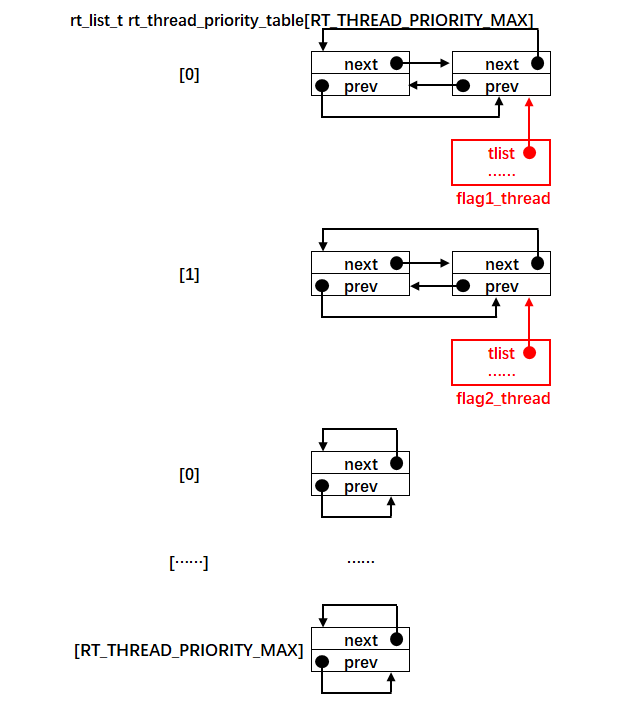
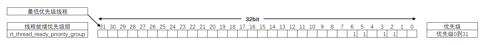
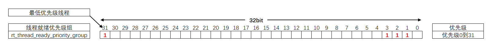
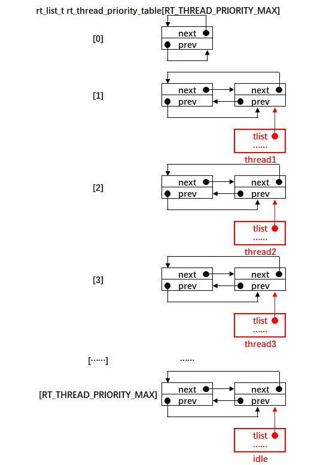
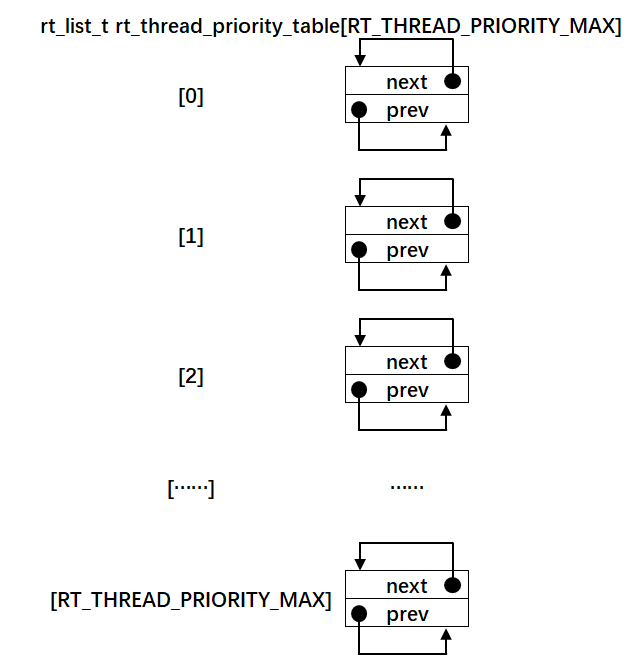
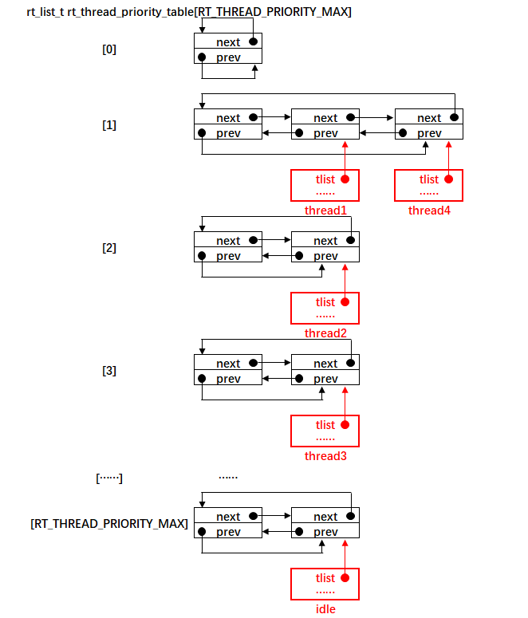

.. vim: syntax=rst

支持多优先级
=====

在本章之前，RT-Thread还没有支持多优先级，只支持两个线程互相切换，从本章开始，线程中我们开始加入优先级的功能。在RT-Thread中，数字优先级越小，逻辑优先级越高。

就绪列表
~~~~

RT-Thread要支持多优先级，需要靠就绪列表的支持，从代码上看，就绪列表由两个在scheduler.c文件定义的全局变量组成，一个是线程就绪优先级组rt_thread_ready_priority_group，另一个是线程优先级表rt_thread_priority_table[RT_THREA
D_PRIORITY_MAX]，接下来我们将详细讲解这两个变量是如何帮系统实现多优先级的。

线程就绪优先级组
---------

在本章以前，我们将创建好的两个线程手动插入到线程优先级表（之前我们一直将线程优先级表称为就绪列表，其实不具体区分，这种叫法也没有错）rt_thread_priority_table[RT_THREAD_PRIORITY_MAX]的索引0和索引1所在的链表，并没有考虑线程的优先级，具体见图
10‑1。线程优先级表的索引对应的是线程的优先级，从本章开始，线程将支持优先级，线程启动的时候将根据优先级来决定插入到线程优先级表的位置。

图 10‑1 将线程插入到线程优先级表（不考虑优先级）

为了快速的找到线程在线程优先级表的插入和移除的位置，RT-Thread专门设计了一个线程就绪优先级组。从代码上看，线程就绪优先级组就是一个32位的整形数，每一个位对应一个优先级。一个就绪优先级组最多只能表示32个优先级，如果优先级超过32个怎么办，则可以定义一个线程就绪优先级数组，每一个数组成员都可
以表示32个优先级，具体支持到少由系统的RAM的大小决定，这里我们只讲解支持到32个优先级的情况。线程就绪优先级组在scheduler.c文件中定义，具体见代码清单 10‑1。

.. code-block:: c
    :caption: 代码清单 10‑1 线程就绪优先级组
    :linenos:

    /* 线程就绪优先级组 */
    rt_uint32_t rt_thread_ready_priority_group;

那么线程就绪优先级组是如何帮助系统快速地找到线程在线程优先级表的插入和移除的位置？线程就绪优先级组的每一个位对应一个优先级，位0对应优先级0，位1对应优先级1，以此类推。比如，当优先级为10的线程已经准备好，那么就将线程就绪优先级组的位10置1，表示线程已经就绪，然后根据10这个索引值，在线程优先级
表10（rt_thread_priority_table[10]）的这个位置插入线程。有关线程就绪优先级组的位号与线程优先级对应的关系具体见图 10‑2。

图 10‑2线程就绪优先级组的位号与线程优先级对应的关系

寻找优先级最高的线程
^^^^^^^^^^

RT-Thread是一个根据优先级来调度的抢占式实时操作系统，即在每个系统周期到来时，调度器都会扫描就绪列表，选取优先级最高的线程去执行。假设目前系统中，创建了优先级分别为1、2和3的线程1、线程2和线程3，再加上系统默认创建的空闲线程，那么此时线程就绪优先级组的位设置情况和线程优先级表的链表挂载情
况就如图 10‑3和图 10‑4所示那样。

图 10‑3 线程就绪优先级组的位设置情况（有四个线程就绪时）

图 10‑4 线程优先级表的链表挂载情况（有4个线程就绪时）

在下一个系统周期来临时，调度器需要选取优先级最高的线程去运行，从图 10‑3我们一眼就可以看出线程就绪优先级组从右往左开始数，第一个置1的位是位1，即表示此时就绪的线程当中，优先级最高的是线程1，然后调度器从线程优先级表的索引1下取出线程1的线程控制块，从而切换到线程1。但是，单片机没有眼睛，并不能
跟人一样一眼就从线程就绪优先级组中看到那个第一个置1的位，怎么办？RT-Thread kservice.c文件中，有一个专门的函数__rt_ffs，用来寻找32位整形数第一个（从低位开始）置1的位号，具体实现见代码清单 10‑2。

.. code-block:: c
    :caption: 代码清单 10‑2 \__rt_ffs函数实现
    :linenos: 

    /**
    * 该函数用于从一个32位的数中寻找第一个被置1的位（从低位开始），
    * 然后返回该位的索引（即位号） 
    *
    * @return 返回第一个置1位的索引号。如果全为0，则返回0。 
    */
    int __rt_ffs(int value)
    {
        /* 如果值为0，则直接返回0 */
        if (value == 0) return 0;                                (1)

        /* 检查 bits [07:00] 
        这里加1的原因是避免当第一个置1的位是位0时
        返回的索引号与值都为0时返回的索引号重复 */
        if (value & 0xff)                                        (2)
            return __lowest_bit_bitmap[value & 0xff] + 1;

        /* 检查 bits [15:08] */
        if (value & 0xff00)                                      (3)
            return __lowest_bit_bitmap[(value & 0xff00) >> 8] + 9;

        /* 检查 bits [23:16] */
        if (value & 0xff0000)                                    (4)
            return __lowest_bit_bitmap[(value & 0xff0000) >> 16] + 17;

        /* 检查 bits [31:24] */                                  (5)
        return __lowest_bit_bitmap[(value & 0xff000000) >> 24] + 25;
    }

代码清单 10‑2\ **(1)**\ ：如果值为0，则直接返回0。

代码清单 10‑2\ **(2)**\ ：检查 bits [07:00]，然后通过__lowest_bit_bitmap[value & 0xff] +
1返回第一个置1的位号，这里加1的原因是避免当第一个置1的位是位0时返回的索引号与值都为0时返回的索引号重复，返回1表示优先级为0就绪，使用这个索引号的时候再减1即可。现在我们在具体分析下__lowest_bit_bitmap[]这个数组，该数组在kservice.c中定义，具体见代码清单
10‑3。

.. code-block:: c
    :caption: 代码清单 10‑3数组__lowest_bit_bitmap[]定义
    :linenos: 

    /* 
    * __lowest_bit_bitmap[] 数组的解析
    * 将一个8位整形数的取值范围0~255作为数组的索引，索引值第一个出现1(从最低位开始)的位号作为该数组索引下的成员值。
    * 举例：十进制数10的二进制为：0000 1010,从最低位开始，第一个出现1的位号为bit1，则有__lowest_bit_bitmap[10]=1
    * 注意：只需要找到第一个出现1的位号即可
    */
    const rt_uint8_t __lowest_bit_bitmap[] =
    {
        /* 00 */ 0, 0, 1, 0, 2, 0, 1, 0, 3, 0, 1, 0, 2, 0, 1, 0,
        /* 10 */ 4, 0, 1, 0, 2, 0, 1, 0, 3, 0, 1, 0, 2, 0, 1, 0,
        /* 20 */ 5, 0, 1, 0, 2, 0, 1, 0, 3, 0, 1, 0, 2, 0, 1, 0,
        /* 30 */ 4, 0, 1, 0, 2, 0, 1, 0, 3, 0, 1, 0, 2, 0, 1, 0,
        /* 40 */ 6, 0, 1, 0, 2, 0, 1, 0, 3, 0, 1, 0, 2, 0, 1, 0,
        /* 50 */ 4, 0, 1, 0, 2, 0, 1, 0, 3, 0, 1, 0, 2, 0, 1, 0,
        /* 60 */ 5, 0, 1, 0, 2, 0, 1, 0, 3, 0, 1, 0, 2, 0, 1, 0,
        /* 70 */ 4, 0, 1, 0, 2, 0, 1, 0, 3, 0, 1, 0, 2, 0, 1, 0,
        /* 80 */ 7, 0, 1, 0, 2, 0, 1, 0, 3, 0, 1, 0, 2, 0, 1, 0,
        /* 90 */ 4, 0, 1, 0, 2, 0, 1, 0, 3, 0, 1, 0, 2, 0, 1, 0,
        /* A0 */ 5, 0, 1, 0, 2, 0, 1, 0, 3, 0, 1, 0, 2, 0, 1, 0,
        /* B0 */ 4, 0, 1, 0, 2, 0, 1, 0, 3, 0, 1, 0, 2, 0, 1, 0,
        /* C0 */ 6, 0, 1, 0, 2, 0, 1, 0, 3, 0, 1, 0, 2, 0, 1, 0,
        /* D0 */ 4, 0, 1, 0, 2, 0, 1, 0, 3, 0, 1, 0, 2, 0, 1, 0,
        /* E0 */ 5, 0, 1, 0, 2, 0, 1, 0, 3, 0, 1, 0, 2, 0, 1, 0,
        /* F0 */ 4, 0, 1, 0, 2, 0, 1, 0, 3, 0, 1, 0, 2, 0, 1, 0
    };

代码清单 10‑3：要从一个8位整形数中从低位开始找出第一个置1的位，常规的方法是从低位开始一位一位的判断，优点是逻辑简单好理解，缺点是耗时，这里采取一种空间换时间的方法，即：将8位整形数的取值范围0~255作为数组__lowest_bit_bitmap[]的索引，
索引值第一个出现1(从最低位开始)的位号作为该数组索引下的成员值。 举例：十进制数10的二进制为：0000 1010，从最低位开始， 第一个出现1的位号为bit1，则有__lowest_bit_bitmap[10]=1。 注意：只需要找到第一个出现1的位号即可。

代码清单 10‑2\ **(3)、(4)、(5)**\ ：依次检查剩下的位，原理同\ **(2)** 。

线程优先级表
------

线程优先级表就是我们本章之前讲的就绪列表，因为本章为了讲解方便将就绪列表分为了线程就绪优先级组和线程优先级表，除了本章，往后我们说到的就绪列表就是线程优先级表。线程优先级表是一个在scheduler.c中定义的全局数组，具体见代码清单 10‑4

.. code-block:: c
    :caption: 代码清单 10‑4 线程优先级表定义
    :linenos: 

    /* 线程优先级表 */
    rt_list_t rt_thread_priority_table[RT_THREAD_PRIORITY_MAX];

线程优先级表的数据类型为rt_list，每个索引号对应线程的优先级，该索引下维护着一条双向链表，当线程就绪时，线程就会根据优先级插入到对应索引的链表，同一个优先级的线程都会被插入到同一条链表中（当同一个优先级下有多个线程时，需要时间片的支持，目前本章暂时不支持时间片，后面的章节再讲解）。一个空的就绪
列表和一个有4个线程就绪的就绪列表示意图具体见图 10‑5和。

图 10‑5 空的就绪列表

图 10‑6 有5个线程就绪的就绪列表（其中优先级1下有两个线程）

将线程插入到线程优先级表和移除分别由scheduler.c的rt_schedule_insert_thread()和rt_schedule_remove_thread()这两个函数实现，它们的具体定义见代码清单 10‑5和代码清单 10‑6。

调度器插入线程
^^^^^^

.. code-block:: c
    :caption: 代码清单 10‑5 调度器插入线程
    :linenos: 

    void rt_schedule_insert_thread(struct rt_thread *thread)
    {
        register rt_base_t temp;

        /* 关中断 */
        temp = rt_hw_interrupt_disable();

        /* 改变线程状态 */
        thread->stat = RT_THREAD_READY;

        /* 将线程插入就绪列表 */
        rt_list_insert_before(&(rt_thread_priority_table[thread->current_priority]),
                            &(thread->tlist));

        /* 设置线程就绪优先级组中对应的位 */
        rt_thread_ready_priority_group |= thread->number_mask;

        /* 开中断 */
        rt_hw_interrupt_enable(temp);
    }

调度器删除线程
^^^^^

.. code-block:: c
    :caption: 代码清单 10‑6 调度器删除线程
    :linenos: 

    void rt_schedule_remove_thread(struct rt_thread *thread)
    {
        register rt_base_t temp;

        /* 关中断 */
        temp = rt_hw_interrupt_disable();
        
        /* 将线程从就绪列表删除 */
        rt_list_remove(&(thread->tlist));
        
        if (rt_list_isempty(&(rt_thread_priority_table[thread->current_priority])))
        {
            rt_thread_ready_priority_group &= ~thread->number_mask;
        }

        /* 开中断 */
        rt_hw_interrupt_enable(temp);
    }

修改代码，支持多优先级
~~~~~~~~~~~

接下来我们在上一章的代码上，继续迭代修改，从而实现多优先级。

修改线程控制块
-------

在线程控制块中增加与优先级相关的成员，具体见高亮部分，其中还增加了错误码和线程状态成员，具体见代码清单 10‑7。

.. code-block:: c
    :caption: 代码清单 10‑7 修改线程控制块代码
    :emphasize-lines: 19-24
    :linenos: 

    struct rt_thread
    {
        /* rt 对象 */
        char        name[RT_NAME_MAX];    /* 对象的名字 */
        rt_uint8_t  type;                 /* 对象类型 */
        rt_uint8_t  flags;                /* 对象的状态 */
        rt_list_t   list;                 /* 对象的列表节点 */
        
        rt_list_t   tlist;                /* 线程链表节点 */
        
        void        *sp;	              /* 线程栈指针 */
        void        *entry;	              /* 线程入口地址 */
        void        *parameter;	          /* 线程形参 */	
        void        *stack_addr;          /* 线程起始地址 */
        rt_uint32_t stack_size;           /* 线程栈大小，单位为字节 */
        
        rt_ubase_t  remaining_tick;       /* 用于实现阻塞延时 */
        
        rt_uint8_t  current_priority;     /* 当前优先级 */        (1)
        rt_uint8_t  init_priority;        /* 初始优先级 */        (2)
        rt_uint32_t number_mask;          /* 当前优先级掩码 */    (3)
        
        rt_err_t    error;                /* 错误码 */            (4)
        rt_uint8_t  stat;                 /* 线程的状态 */        (5)
    };

代码清单 10‑7\ **(1)** ：当前优先级。

代码清单 10‑7\ **(2)** ：初始优先级。

代码清单 10‑7\ **(3)** ：当前优先级掩码，即线程就绪优先级组的索引。

代码清单 10‑7\ **(4)** ：错误码，具体取值在rtdef.h中定义，具体见代码清单 10‑8。

.. code-block:: c
    :caption: 代码清单 10‑8 RT-Thread 错误码重定义
    :linenos: 

    /* RT-Thread 错误码重定义 */
    #define RT_EOK                          0               /* 没有错误 */
    #define RT_ERROR                        1               /* 一个常规错误 */
    #define RT_ETIMEOUT                     2               /* 超时 */
    #define RT_EFULL                        3               /* 资源已满 */
    #define RT_EEMPTY                       4               /* 资源为空 */
    #define RT_ENOMEM                       5               /* 没有内存 */
    #define RT_ENOSYS                       6               /* No system */
    #define RT_EBUSY                        7               /* 忙*/
    #define RT_EIO                          8               /* IO错误 */
    #define RT_EINTR                        9               /* 中断系统调用 */
    #define RT_EINVAL                       10              /* 无效形参 */

代码清单 10‑7\ **(5)** ：线程的状态，具体取值在rtdef.h中定义，具体见代码清单 10‑8。

.. code-block:: c
    :caption: 代码清单 10‑9 线程状态定义
    :linenos: 

    /*
    * 线程状态定义
    */
    #define RT_THREAD_INIT                  0x00                /* 初始态 */
    #define RT_THREAD_READY                 0x01                /* 就绪态 */
    #define RT_THREAD_SUSPEND               0x02                /* 挂起态 */
    #define RT_THREAD_RUNNING               0x03                /* 运行态 */
    #define RT_THREAD_BLOCK                 RT_THREAD_SUSPEND   /* 阻塞态 */
    #define RT_THREAD_CLOSE                 0x04                /* 关闭态 */
    #define RT_THREAD_STAT_MASK             0x0f

    #define RT_THREAD_STAT_SIGNAL           0x10
    #define RT_THREAD_STAT_SIGNAL_READY     (RT_THREAD_STAT_SIGNAL | RT_THREAD_READY)
    #define RT_THREAD_STAT_SIGNAL_SUSPEND   0x20
    #define RT_THREAD_STAT_SIGNAL_MASK      0xf0

修改调度器初始化函数rt_system_scheduler_init()
------------------------------------
.. code-block:: c
    :caption: 代码清单 10‑10 系统调度器初始化
    :linenos: 

    /* 初始化系统调度器 */
    void rt_system_scheduler_init(void)
    {	
    #if 0
        register rt_base_t offset;	

        
        /* 线程就绪列表初始化 */
        for (offset = 0; offset < RT_THREAD_PRIORITY_MAX; offset ++)
        {
                rt_list_init(&rt_thread_priority_table[offset]);
        }
        
        /* 初始化当前线程控制块指针 */
        rt_current_thread = RT_NULL;
    #else
        register rt_base_t offset;	

        
        /* 线程优先级表初始化 */                                        (1)
        for (offset = 0; offset < RT_THREAD_PRIORITY_MAX; offset ++)
        {
                rt_list_init(&rt_thread_priority_table[offset]);
        }
        
        /* 初始化当前优先级为空闲线程的优先级 */
        rt_current_priority = RT_THREAD_PRIORITY_MAX - 1;               (2)
        
        /* 初始化当前线程控制块指针 */
        rt_current_thread = RT_NULL;                                    (3)
        
        /* 初始化线程就绪优先级组 */
        rt_thread_ready_priority_group = 0;                             (4)
    #endif      
    }

代码清单 10‑10\ **(1)**\ ：线程优先级表初始化。

代码清单 10‑10\ **(2)**\ ：初始化当前优先级为空闲线程的优先级，rt_current_priority是在scheduler.c中定义的全局变量，表示当前运行线程的优先级。

代码清单 10‑10\ **(3)**\ ：初始化当前线程控制块指针为0，rt_current_thread是在scheduler.c中定义的全局指针，表示指向当前正在运行的线程的线程控制块。

代码清单 10‑10\ **(4)**\ ：初始化线程就绪优先级组为0，即还没有一个线程就绪。

修改线程初始化函数rt_thread_init()
-------------------------

在线程初始化函数中添加优先级形参，在函数中初始化线程控制块中优先级、错误码和线程状态成员，具体见代码清单 10‑11高亮部分。

.. code-block:: c
    :caption: 代码清单 10‑11线程初始化函数rt_thread_init()
    :emphasize-lines: 7,25-31
    :linenos: 

    rt_err_t rt_thread_init(struct rt_thread *thread,
                            const char       *name,
                            void (*entry)(void *parameter),
                            void             *parameter,
                            void             *stack_start,
                            rt_uint32_t       stack_size,
                            rt_uint8_t        priority)
    {
        /* 线程对象初始化 */
        /* 线程结构体开头部分的成员就是rt_object_t类型 */
        rt_object_init((rt_object_t)thread, RT_Object_Class_Thread, name);
        rt_list_init(&(thread->tlist));
        
        thread->entry = (void *)entry;
        thread->parameter = parameter;

        thread->stack_addr = stack_start;
        thread->stack_size = stack_size;
        
        /* 初始化线程栈，并返回线程栈指针 */
        thread->sp = (void *)rt_hw_stack_init( thread->entry, 
                                            thread->parameter,
                                            (void *)((char *)thread->stack_addr + thread->stack_size - 4) );
        
        thread->init_priority    = priority;
        thread->current_priority = priority;
        thread->number_mask = 0;
        
        /* 错误码和状态 */
        thread->error = RT_EOK;
        thread->stat  = RT_THREAD_INIT;
        
        return RT_EOK;
    }

添加线程启动函数rt_thread_startup()
---------------------------

在本章之前，创建好线程之后会调用函数rt_list_insert_before()将线程插入到线程优先级表，本章开始我们另外独立添加一个函数rt_thread_startup()来实现该功能，该函数在thread.c中定义，具体实现见代码清单 10‑12。

.. code-block:: c
    :caption: 代码清单 10‑12 线程启动函数rt_thread_startup()
    :linenos: 

    /**
    * 启动一个线程并将其放到系统的就绪列表中
    * 
    * @param thread 待启动的线程
    *
    * @return 操作状态, RT_EOK on OK, -RT_ERROR on error
    */
    rt_err_t rt_thread_startup(rt_thread_t thread)
    {
        /* 设置当前优先级为初始优先级 */
        thread->current_priority = thread->init_priority;         (1)
        thread->number_mask = 1L << thread->current_priority;     (2)  
        
        /* 改变线程的状态为挂起状态 */
        thread->stat = RT_THREAD_SUSPEND;                         (3)
        /* 然后恢复线程 */
        rt_thread_resume(thread);                                 (4)
        
        if (rt_thread_self() != RT_NULL)                          (5)
        {
            /* 系统调度 */
            rt_schedule();                                        (6)
        }

        return RT_EOK;
    }

代码清单 10‑12\ **(1)**\ ：设置当前优先级为初始优先级。

代码清单 10‑12\ **(2)**\ ：根据优先级计算线程就绪优先级组的掩码值。

代码清单 10‑12\ **(3)**\ ：设置线程的状态为挂起态，等下会恢复。

代码清单 10‑12\ **(4)**\ ：恢复线程，即将线程插入到就绪列表，由单独的rt_thread_resume()函数来实现，该函数在thread.c中定义，具体实现见代码清单 10‑13。

.. code-block:: c
    :caption: 代码清单 10‑13 线程恢复函数rt_thread_resume()
    :linenos: 

    /**
    * 该函数用于恢复一个线程然后将其放到就绪列表
    *
    * @param thread 需要被恢复的线程
    *
    * @return 操作状态, RT_EOK on OK, -RT_ERROR on error
    */
    rt_err_t rt_thread_resume(rt_thread_t thread)
    {
        register rt_base_t temp;
        
        /* 将被恢复的线程必须在挂起态，否则返回错误码 */
        if ((thread->stat & RT_THREAD_STAT_MASK) != RT_THREAD_SUSPEND)
        {
            return -RT_ERROR;
        }

        /* 关中断 */
        temp = rt_hw_interrupt_disable();

        /* 从挂起队列移除 */
        rt_list_remove(&(thread->tlist));

        /* 开中断 */
        rt_hw_interrupt_enable(temp);

        /* 插入就绪列表 */
        rt_schedule_insert_thread(thread);

        return RT_EOK;
    }

代码清单 10‑12\ **(5)**\ ：rt_thread_self()是一个在thread.c中定义的函数，具体见代码清单
10‑14。用于返回全局指针rt_current_thread，该指针指向当前正在运行的线程的线程控制块，在系统没有启动之前，rt_current_thread的值为RT_NULL，是在代码清单 10‑10调度器初始化函数中初始化的，所以不会执行系统调度。

.. code-block:: c
    :caption: 代码清单 10‑14 rt_thread_self()函数
    :linenos: 

    rt_thread_t rt_thread_self(void)
    {
        return rt_current_thread;
    }

代码清单 10‑12\ **(6)**\ ：系统调度，暂时不会执行，因为系统还没有启动，rt_current_thread的值还是RT_NULL。系统调度函数接下来也需要修改。

修改空闲线程初始化函数rt_thread_idle_init()
--------------------------------

修改空闲线程初始化函数，将原先的将线程插入到就绪列表的部分代码修改为rt_thread_startup()代替，具体见的高亮部分代码清单 10‑15。

.. code-block:: c
    :caption: 代码清单 10‑15 空闲线程初始化函数rt_thread_idle_init()
    :emphasize-lines: 13-15
    :linenos: 

    void rt_thread_idle_init(void)
    {
        
        /* 初始化线程 */
        rt_thread_init(&idle,
                    "idle",
                    rt_thread_idle_entry,
                    RT_NULL,
                    &rt_thread_stack[0],
                    sizeof(rt_thread_stack),
                    RT_THREAD_PRIORITY_MAX-1);
        
        /* 将线程插入到就绪列表 */
        //rt_list_insert_before( &(rt_thread_priority_table[RT_THREAD_PRIORITY_MAX-1]),&(idle.tlist) );
        rt_thread_startup(&idle);
    }

修改启动系统调度器函数rt_system_scheduler_start()
--------------------------------------

修改系统调度器函数rt_system_scheduler_start()，不再是手动指定第一个需要运行的线程，而是根据优先级来决定第一个运行的线程，具体修改见代码清单 10‑16的高亮部分。

.. code-block:: c
    :caption: 代码清单 10‑16 系统调度器函数rt_system_scheduler_start()
    :emphasize-lines: 18-34
    :linenos: 

    /* 启动系统调度器 */
    void rt_system_scheduler_start(void)
    {
    #if 0
        register struct rt_thread *to_thread;	

        /* 手动指定第一个运行的线程 */
        to_thread = rt_list_entry(rt_thread_priority_table[0].next,
                                struct rt_thread,
                                tlist);
        rt_current_thread = to_thread;
                                                            
        /* 切换到第一个线程，该函数在context_rvds.S中实现，在rthw.h声明，
        用于实现第一次线程切换。当一个汇编函数在C文件中调用的时候，
        如果有形参，则执行的时候会将形参传人到CPU寄存器r0。*/
        rt_hw_context_switch_to((rt_uint32_t)&to_thread->sp);
    #else
        register struct rt_thread *to_thread;
        register rt_ubase_t highest_ready_priority;
                                
        /* 获取就绪的最高优先级 */                                   (1)
        highest_ready_priority = __rt_ffs(rt_thread_ready_priority_group) - 1;
                                
        /* 获取将要运行线程的线程控制块 */                           (2)
        to_thread = rt_list_entry(rt_thread_priority_table[highest_ready_priority].next,
                                struct rt_thread,
                                tlist);

        rt_current_thread = to_thread;                               (3)

        /* 切换到新的线程 */
        rt_hw_context_switch_to((rt_uint32_t)&to_thread->sp);        (4)

        /* 永远不会返回 */                                           (5)                        
    #endif                              
    }

代码清单 10‑12\ **(1)**\ ：从线程就绪优先级组中获取到就绪的最高优先级。

代码清单 10‑12\ **(2)**\ ：根据就绪的最高优先级从线程优先级表中获取到线程控制块。

代码清单 10‑12\ **(3)**\ ：更新全局指针rt_current_thread的值。

代码清单 10‑12\ **(4)**\ ：切换到新的线程。

代码清单 10‑12\ **(5)**\ ：永远不会返回，以后将在线程之间不断切换。

修改系统调度函数rt_schedule ()
----------------------

系统调度函数rt_schedule()将不再像本章之前的那样，在三个线程之间轮流切换，而是需要根据优先级来实现，即系统选择就绪线程当中优先级最高的来运行，具体修改见代码清单 10‑17的高亮部分。

.. code-block:: c
    :caption: 代码清单 10‑17 系统调度函数rt_schedule ()
    :emphasize-lines: 75-108
    :linenos: 

    void rt_schedule(void)
    {
    #if 0
        struct rt_thread *to_thread;
        struct rt_thread *from_thread;

        /* 如果当前线程是空闲线程，那么就去尝试执行线程1或者线程2，
        看看他们的延时时间是否结束，如果线程的延时时间均没有到期，
        那就返回继续执行空闲线程 */
        if ( rt_current_thread == &idle )
        {
            if (rt_flag1_thread.remaining_tick == 0)
            {
                from_thread = rt_current_thread;
                to_thread = &rt_flag1_thread;
                rt_current_thread = to_thread;
            }
            else if (rt_flag2_thread.remaining_tick == 0)
            {
                from_thread = rt_current_thread;
                to_thread = &rt_flag2_thread;
                rt_current_thread = to_thread;
            }
            else
            {
                return;		/* 线程延时均没有到期则返回，继续执行空闲线程 */
            }
        }
        else
        {
            /*如果当前线程是线程1或者线程2的话，
            检查下另外一个线程,如果另外的线程不在延时中，
            就切换到该线程。否则，判断下当前线程是否应该进入延时状态，
            如果是的话，就切换到空闲线程。否则就不进行任何切换 */
            if (rt_current_thread == &rt_flag1_thread)
            {
                if (rt_flag2_thread.remaining_tick == 0)
                {
                    from_thread = rt_current_thread;
                    to_thread = &rt_flag2_thread;
                    rt_current_thread = to_thread;
                }
                else if (rt_current_thread->remaining_tick != 0)
                {
                    from_thread = rt_current_thread;
                    to_thread = &idle;
                    rt_current_thread = to_thread;
                }
                else
                {
                    return;	/* 返回，不进行切换，因为两个线程都处于延时中 */
                }
            }
            else if (rt_current_thread == &rt_flag2_thread)
            {
                if (rt_flag1_thread.remaining_tick == 0)
                {
                    from_thread = rt_current_thread;
                    to_thread = &rt_flag1_thread;
                    rt_current_thread = to_thread;
                }
                else if (rt_current_thread->remaining_tick != 0)
                {
                    from_thread = rt_current_thread;
                    to_thread = &idle;
                    rt_current_thread = to_thread;
                }
                else
                {
                    return;	/* 返回，不进行切换，因为两个线程都处于延时中 */
                }
            }
        }
    #else
        rt_base_t level;
        register rt_ubase_t highest_ready_priority;
        struct rt_thread *to_thread;
        struct rt_thread *from_thread;

        /* 关中断 */
        level = rt_hw_interrupt_disable();

        /* 获取就绪的最高优先级 */                          (1)
        highest_ready_priority = __rt_ffs(rt_thread_ready_priority_group) - 1;
        /* 获取就绪的最高优先级对应的线程控制块 */             (2)
        to_thread = rt_list_entry(rt_thread_priority_table[highest_ready_priority].next,
                                    struct rt_thread,
                                    tlist);

        /* 如果目标线程不是当前线程，则要进行线程切换 */
        if (to_thread != rt_current_thread)              (3)
        {
            rt_current_priority = (rt_uint8_t)highest_ready_priority;
            from_thread         = rt_current_thread;
            rt_current_thread   = to_thread;

            rt_hw_context_switch((rt_uint32_t)&from_thread->sp,
                                (rt_uint32_t)&to_thread->sp);

            /* 开中断 */
            rt_hw_interrupt_enable(level);
    
        }
        else
        {
            /* 开中断 */
            rt_hw_interrupt_enable(level);
        }
    #endif
    
        /* 产生上下文切换 */
        rt_hw_context_switch((rt_uint32_t)&from_thread->sp,(rt_uint32_t)&to_thread->sp);
    }

代码清单 10‑17\ **(1)**\ ：从线程就绪优先级组中获取到就绪的最高优先级。

代码清单 10‑17\ **(2)**\ ：获取就绪的最高优先级对应的线程控制块，并存在to_thread中。

代码清单 10‑17\ **(3)**\ ：如果to_thread不是当前线程，则要进行线程切换，否则则开启中断退出继续执行当前线程。

修改阻塞延时函数rt_thread_delay()
-------------------------

修改阻塞延时函数rt_thread_delay()，具体修改见代码清单 10‑18的高亮部分。

.. code-block:: c
    :caption: 代码清单 10‑18 阻塞延时函数rt_thread_delay()
    :emphasize-lines: 12-29
    :linenos: 

    void rt_thread_delay(rt_tick_t tick)
    {
    #if 0
        struct rt_thread *thread;    
        
        thread = rt_current_thread;
        thread->remaining_tick = tick;
        
        /* 进行任务调度 */
        rt_schedule();
    #else
        register rt_base_t temp;
        struct rt_thread *thread;
        
        /* 失能中断 */
        temp = rt_hw_interrupt_disable();
        
        thread = rt_current_thread;
        thread->remaining_tick = tick;
        
        /* 改变线程状态 */
        thread->stat = RT_THREAD_SUSPEND;                        (1)
        rt_thread_ready_priority_group &= ~thread->number_mask;  (2)

        /* 使能中断 */
        rt_hw_interrupt_enable(temp);
        
        /* 进行系统调度 */
        rt_schedule();
    #endif
    }

代码清单 10‑18\ **(1)**\ ：将线程的状态改为挂起，接下来将进入延时，暂时放弃CPU的使用权。

代码清单 10‑18\ **(2)**\ ：根据优先级将线程就绪优先级组中对应的位清零。严格来说，还需要将线程从线程优先级表中移除，但是鉴于我们目前的时基更新函数rt_tick_increase()还是需要通过扫描线程优先级表中来判断线程的延时时间是否到期，所以不能讲线程从就绪列表移除。当我们在接下
来的“定时器”章节中，会有一个全新的延时方法，到时候延时的时候除了根据优先级将线程就绪优先级组中对应的位清零外，还需要线程从线程优先级表中移除。

修改时基更新函数rt_tick_increase()
--------------------------

修改时基更新函数rt_tick_increase()，具体修改见代码清单 10‑19的高亮部分。

.. code-block:: c
    :caption: 代码清单 10‑19 时基更新函数rt_tick_increase()
    :emphasize-lines: 28-32
    :linenos: 

    void rt_tick_increase(void)
    {
        rt_ubase_t i;
        struct rt_thread *thread;
        rt_tick ++;
    #if 0
        /* 扫描就绪列表中所有线程的remaining_tick，如果不为0，则减1 */
        for(i=0; i<RT_THREAD_PRIORITY_MAX; i++)
        {
            thread = rt_list_entry( rt_thread_priority_table[i].next,
                                    struct rt_thread,
                                    tlist);
            if(thread->remaining_tick > 0)
            {
                thread->remaining_tick --;
            }
        }
    #else
        /* 扫描就绪列表中所有线程的remaining_tick，如果不为0，则减1 */
        for(i=0; i<RT_THREAD_PRIORITY_MAX; i++)
        {
            thread = rt_list_entry( rt_thread_priority_table[i].next,
                                    struct rt_thread,
                                    tlist);
            if(thread->remaining_tick > 0)
            {
                thread->remaining_tick --;
                if(thread->remaining_tick == 0)
                {
                    //rt_schedule_insert_thread(thread);
                    rt_thread_ready_priority_group |= thread->number_mask; (1)
                }
            }
        }
    #endif    
        /* 任务调度 */
        rt_schedule();
    }

代码清单 10‑19\ **(1)**\ ：如果线程的延时时间remaining_tick递减为0，则表示延时时间结束，需要将线程插入到线程优先级表，即简单的根据优先级将线程就绪优先级组中对应的位置1即可。因为在阻塞延时函数中，我们是通过清除线程就绪优先级组中对应的位来让线程挂起的，并没有将线程从线
程优先级表里面移除，所以这里将rt_schedule_insert_thread(thread);注释掉。

main函数
~~~~~~

本章main函数与上一章基本一致，修改不大，具体修改见代码清单 10‑20的高亮部分。

.. code-block:: c
    :caption: 代码清单 10‑20 main函数
    :emphasize-lines: 25-28,37-40
    :linenos: 

    int main(void)
    {	
        /* 硬件初始化 */
        /* 将硬件相关的初始化放在这里，如果是软件仿真则没有相关初始化代码 */
        
        /* 关中断 */
        rt_hw_interrupt_disable();
        
        /* SysTick中断频率设置 */
        SysTick_Config( SystemCoreClock / RT_TICK_PER_SECOND );
        
        /* 调度器初始化 */
        rt_system_scheduler_init();

        /* 初始化空闲线程 */    
        rt_thread_idle_init();	
        
        /* 初始化线程 */
        rt_thread_init( &rt_flag1_thread,                 /* 线程控制块 */
                        "rt_flag1_thread",                /* 线程名字，字符串形式 */
                        flag1_thread_entry,               /* 线程入口地址 */
                        RT_NULL,                          /* 线程形参 */
                        &rt_flag1_thread_stack[0],        /* 线程栈起始地址 */
                        sizeof(rt_flag1_thread_stack),    /* 线程栈大小，单位为字节 */
                        2);                               /* 优先级 */  (1)
        /* 将线程插入到就绪列表 */                                      (2)
        //rt_list_insert_before( &(rt_thread_priority_table[0]),&(rt_flag1_thread.tlist) );
        rt_thread_startup(&rt_flag1_thread);
        
        /* 初始化线程 */
        rt_thread_init( &rt_flag2_thread,                 /* 线程控制块 */
                        "rt_flag2_thread",                /* 线程名字，字符串形式 */
                        flag2_thread_entry,               /* 线程入口地址 */
                        RT_NULL,                          /* 线程形参 */
                        &rt_flag2_thread_stack[0],        /* 线程栈起始地址 */
                        sizeof(rt_flag2_thread_stack),    /* 线程栈大小，单位为字节 */
                        3);                               /* 优先级 */  (3)
        /* 将线程插入到就绪列表 */                                      (4)
        //rt_list_insert_before( &(rt_thread_priority_table[1]),&(rt_flag2_thread.tlist) );
        rt_thread_startup(&rt_flag2_thread);
        
        /* 启动系统调度器 */
        rt_system_scheduler_start(); 
    }

    /*
    *************************************************************************
    *                               函数实现
    *************************************************************************
    */
    /* 软件延时 */
    void delay (uint32_t count)
    {
        for(; count!=0; count--);
    }

    /* 线程1 */
    void flag1_thread_entry( void *p_arg )
    {
        for( ;; )
        {
            flag1 = 1;
            rt_thread_delay(2); 		
            flag1 = 0;
            rt_thread_delay(2);       
        }
    }

    /* 线程2 */
    void flag2_thread_entry( void *p_arg )
    {
        for( ;; )
        {
            flag2 = 1;
            rt_thread_delay(2); 		
            flag2 = 0;
            rt_thread_delay(2);        
        }
    }

    void SysTick_Handler(void)
    {
        /* 进入中断 */
        rt_interrupt_enter();

        /* 更新时基 */
        rt_tick_increase();

        /* 离开中断 */
        rt_interrupt_leave();
    }

代码清单 10‑20\ **(1)**\ ：设置线程1的优先级为2，数字优先级越高，逻辑优先级越低。

代码清单 10‑20\ **(2)**\ ：启动线程，即将线程插入到就绪列表，但是还不会运行，因为系统还没有启动。

代码清单 10‑20\ **(3)**\ ：设置线程1的优先级为3，数字优先级越高，逻辑优先级越低。

代码清单 10‑20\ **(4)**\ ：启动线程，即将线程插入到就绪列表，但是还不会运行，因为系统还没有启动。

实验现象
~~~~

进入软件调试，全速运行程序，从逻辑分析仪中可以看到两个线程的波形是完全同步，就好像CPU在同时干两件事情，具体仿真的波形图见图 10‑7和图 10‑8。

.. image:: media/multi_priority/multip008.png
   :align: center
   :alt: 图 10‑7 实验现象1

图 10‑7 实验现象1

.. image:: media/multi_priority/multip009.png
   :align: center
   :alt: 图 10‑8 实验现象2

图 10‑8 实验现象2

从图 9‑1和图 9‑2可以看出，flag1和flag2的高电平的时间为(0.1802-0.1602)s，刚好等于阻塞延时的20ms，所以实验现象跟代码要实现的功能是一致的。。

