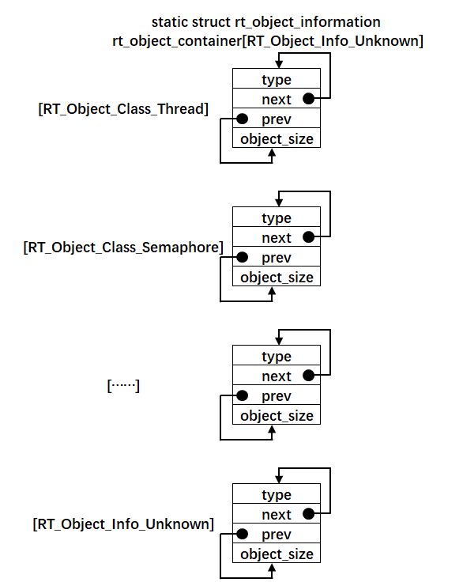
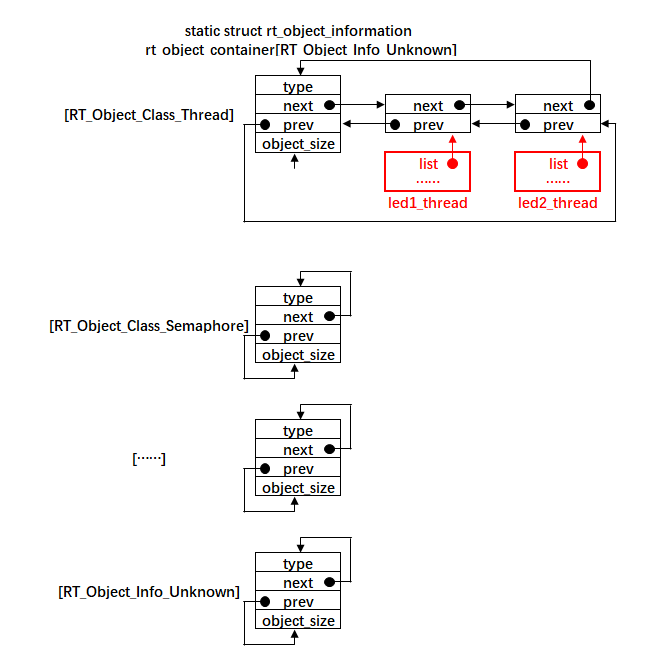

.. vim: syntax=rst

对象容器的实现
===============

什么是对象
~~~~~~~~~~~~

在RT-Thread中，所有的数据结构都称之为对象。

对象枚举定义
------------------------

其中线程，信号量，互斥量、事件、邮箱、消息队列、内存堆、内存池、设备和定时器在rtdef.h中有明显的枚举定
义，即为每个对象打上了一个数字标签，具体见 代码清单:对象容器-1_。

.. code-block:: c
    :caption: 代码清单:对象容器-1 对象类型枚举定义
    :name: 代码清单:对象容器-1 
    :linenos:

    enum rt_object_class_type
    {
        RT_Object_Class_Thread = 0,       /* 对象是线程 */
        RT_Object_Class_Semaphore,        /* 对象是信号量 */
        RT_Object_Class_Mutex,            /* 对象是互斥量 */
        RT_Object_Class_Event,            /* 对象是事件 */
        RT_Object_Class_MailBox,          /* 对象是邮箱 */
        RT_Object_Class_MessageQueue,     /* 对象是消息队列 */
        RT_Object_Class_MemHeap,          /* 对象是内存堆 */
        RT_Object_Class_MemPool,          /* 对象是内存池 */
        RT_Object_Class_Device,           /* 对象是设备 */
        RT_Object_Class_Timer,            /* 对象是定时器 */
        RT_Object_Class_Module,           /* 对象是模块 */
        RT_Object_Class_Unknown,          /* 对象未知 */
        RT_Object_Class_Static = 0x80     /* 对象是静态对象 */
    };

对象数据类型定义
------------------------

在rtt中，为了方便管理这些对象，专门定义了一个对象类型数据结构，具体见 代码清单:对象容器-2_。

.. code-block:: c
    :caption: 代码清单:对象容器-2 对象数据类型定义
    :name: 代码清单:对象容器-2
    :linenos:

    struct rt_object
    {
        char name[RT_NAME_MAX];   (1) /* 内核对象的名字 */
        rt_uint8_t type;          (2) /* 内核对象的类型 */
        rt_uint8_t flag;          (3) /* 内核对象的状态 */
        rt_list_t list;           (4) /* 内核对象的列表节点 */
    };
    typedef struct rt_object *rt_object_t; (5) /*内核对象数据类型重定义*/

-   代码清单:对象容器-2_ **(1)** ：对象名字，字符串形式，方便调试，最大长度由rt_config.h中的宏RT_NAMA_MAX决定，默认定义为8。

-   代码清单:对象容器-2_ **(2)** ：对象的类型，RT-Thread为每一个对象都打上了数字标签，
    取值由rt_object_class_type 枚举类型限定，具体见代码清单:对象容器-1。

-   代码清单:对象容器-2_ **(3)** ：对象的状态。

-   代码清单:对象容器-2_ **(4)** ：对象的列表节点，每个对象都可以通过自己的列表节点list将自己挂到容器列表中，什么是容器接下来会讲解到。

-   代码清单:对象容器-2_ **(5)** ：对象数据类型，RT-Thread中会为每一个新的结构体用typedef重定义一个指针类型的数据结构。

在线程控制块中添加对象成员
----------------------------

在RT-Thread中，每个对象都会有对应的一个结构体，这个结构体叫做该对象的控制块。如线程会有一个线程控制块，
定时器会有一个定时器控制块，信号量会有信号量控制块等。这些控制块的开头都会包含一个内核对象结构体，
或者直接将对象结构体的成员放在对象控制块结构体的开头。其中线程控制块的开头放置的就是对象结
构体的成员，具体见 代码清单:对象容器-3_ 开头的高亮部分代码。这里我们只讲解往线程控制块里面添加对象结构体成员，
其它内核对象的都是直接在其开头使用struct rt_object 直接定义一个内核对象变量。

.. code-block:: c
    :caption: 代码清单:对象容器-3 在线程控制块中添加对象成员
    :emphasize-lines: 4-7
    :name: 代码清单:对象容器-3
    :linenos:

    struct rt_thread
    {
        /* rt 对象 */
        char        name[RT_NAME_MAX];    /* 对象的名字 */
        rt_uint8_t  type;                 /* 对象类型 */
        rt_uint8_t  flags;                /* 对象的状态 */
        rt_list_t   list;                 /* 对象的列表节点 */
        rt_list_t   tlist;                /* 线程链表节点 */
        void        *sp;	              /* 线程栈指针 */
        void        *entry;	              /* 线程入口地址 */
        void        *parameter;	          /* 线程形参 */
        void        *stack_addr;          /* 线程起始地址 */
        rt_uint32_t stack_size;           /* 线程栈大小，单位为字节 */
    };

什么是容器
~~~~~~~~~~~~

在rtt中，每当用户创建一个对象，如线程，就会将这个对象放到一个叫做容器的地方，这样做的目的是为了方便管理，这时用户会
问，管理什么？在RT-Thread的组件finsh的使用中，就需要使用到容器，通过扫描容器的内核对象来获取各个内核对象的状态，然
后输出调试信息。目前，我们只需要知道所有创建的对象都会被放到容器中即可。

那什么是容器，从代码上看，容器就是一个数组，是一个全局变量，数据类型为struct rt_object_information，
在object.c中定义，具体见 代码清单:对象容器-4_，示意图具体见 对象容器示意图_。

容器的定义
------------

.. code-block:: c
    :caption: 代码清单:对象容器-4 rtt容器的定义
    :name: 代码清单:对象容器-4
    :linenos:

    static struct rt_object_information                      (1)
    rt_object_container[RT_Object_Info_Unknown] =            (2)
    {
        /* 初始化对象容器 - 线程 */                            (3)-1
        {
            RT_Object_Class_Thread,                          (3)-2
            _OBJ_CONTAINER_LIST_INIT(RT_Object_Info_Thread),                             (1)
            sizeof(struct rt_thread)                         (3)-3
        },

    #ifdef RT_USING_SEMAPHORE                                (4)
        /* 初始化对象容器 - 信号量 */
        {
            RT_Object_Class_Semaphore,
            _OBJ_CONTAINER_LIST_INIT(RT_Object_Info_Semaphore),
            sizeof(struct rt_semaphore)
        },
    #endif

    #ifdef RT_USING_MUTEX                                    (5)
        /* 初始化对象容器 - 互斥量 */
        {
            RT_Object_Class_Mutex,
            _OBJ_CONTAINER_LIST_INIT(RT_Object_Info_Mutex),
            sizeof(struct rt_mutex)
        },
    #endif

    #ifdef RT_USING_EVENT                                    (6)
        /* 初始化对象容器 - 事件 */
        {
            RT_Object_Class_Event,
            _OBJ_CONTAINER_LIST_INIT(RT_Object_Info_Event),
            sizeof(struct rt_event)
        },
    #endif

    #ifdef RT_USING_MAILBOX                                  (7)
        /* 初始化对象容器 - 邮箱 */
        {
            RT_Object_Class_MailBox,
            _OBJ_CONTAINER_LIST_INIT(RT_Object_Info_MailBox),
            sizeof(struct rt_mailbox)
        },
    #endif

    #ifdef RT_USING_MESSAGEQUEUE                             (8)
        /* 初始化对象容器 - 消息队列 */
        {
            RT_Object_Class_MessageQueue,
            _OBJ_CONTAINER_LIST_INIT(RT_Object_Info_MessageQueue),
            sizeof(struct rt_messagequeue)
        },
    #endif

    #ifdef RT_USING_MEMHEAP                                  (9)
        /* 初始化对象容器 - 内存堆 */
        {
            RT_Object_Class_MemHeap,
            _OBJ_CONTAINER_LIST_INIT(RT_Object_Info_MemHeap),
            sizeof(struct rt_memheap)
        },
    #endif

    #ifdef RT_USING_MEMPOOL                                  (10)
        /* 初始化对象容器 - 内存池 */
        {
            RT_Object_Class_MemPool,
            _OBJ_CONTAINER_LIST_INIT(RT_Object_Info_MemPool),
            sizeof(struct rt_mempool)
        },
    #endif

    #ifdef RT_USING_DEVICE                                   (11)
        /* 初始化对象容器 - 设备 */
        {
            RT_Object_Class_Device,
            _OBJ_CONTAINER_LIST_INIT(RT_Object_Info_Device), sizeof(struct rt_device)},
    #endif
        /* 初始化对象容器 - 定时器 */                          (12)
        /*
        {
            RT_Object_Class_Timer,
            _OBJ_CONTAINER_LIST_INIT(RT_Object_Info_Timer),
            sizeof(struct rt_timer)
        },
        */
    #ifdef RT_USING_MODULE                                   (13)
        /* 初始化对象容器 - 模块 */
        {
            RT_Object_Class_Module,
            _OBJ_CONTAINER_LIST_INIT(RT_Object_Info_Module),
            sizeof(struct rt_module)
        },
    #endif

-   代码清单:对象容器-4_ **(1)**\ ：容器是一个全部变量的数组，数据类型为struct rt_object_information，
    这是一个结构体类型，包含对象的三个信息，分别为对象类型、对象列表节点头和对象的大小，在rtdef.h中定义，
    具体实现见 代码清单:对象容器-5_。

.. code-block:: c
    :caption: 代码清单:对象容器-5 内核对象信息结构体定义
    :name: 代码清单:对象容器-5
    :linenos:

    struct rt_object_information
    {
        enum rt_object_class_type type;//  (1) /* 对象类型 */
        rt_list_t object_list;//           (2) /* 对象列表节点头 */
        rt_size_t object_size;//           (3) /* 对象大小 */
    };

-   代码清单:对象容器-5_ **(1)** ：对象的类型，取值只能是rt_object_class_type枚举类型，
    具体取值见 代码清单:对象容器-1_。

-   代码清单:对象容器-5_ **(2)** ：对象列表节点头，每当对象创建时，对象就会通过他们控制块里面
    的list节点将自己挂到对象容器中的对应列表，同一类型的对象是挂到对象容器中同一个对象列表的，容器数组的小标对应的就是对象的类型。

-   代码清单:对象容器-5_ **(3)** ：对象的大小，可直接通过sizeof(对象控制块类型)获取。

-   代码清单:对象容器-4_ **(2)** ：容器的大小由RT_Object_Info_Unknown决定，RT_Object_Info_Unknown是
    一个枚举类型的变量，在rt_object_info_type这个枚举结构体里面定义，具体见 代码清单:对象容器-6_。

.. code-block:: c
    :caption: 代码清单:对象容器-6 对象容器数组的下标定义
    :name: 代码清单:对象容器-6
    :linenos:

    /*
    * 对象容器数组的下标定义，决定容器的大小
    */
    enum rt_object_info_type
    {
        RT_Object_Info_Thread = 0,             /* 对象是线程 */
    #ifdef RT_USING_SEMAPHORE
        RT_Object_Info_Semaphore,              /* 对象是信号量 */
    #endif
    #ifdef RT_USING_MUTEX
        RT_Object_Info_Mutex,                  /* 对象是互斥量 */
    #endif
    #ifdef RT_USING_EVENT
        RT_Object_Info_Event,                  /* 对象是事件 */
    #endif
    #ifdef RT_USING_MAILBOX
        RT_Object_Info_MailBox,                /* 对象是邮箱 */
    #endif
    #ifdef RT_USING_MESSAGEQUEUE
        RT_Object_Info_MessageQueue,           /* 对象是消息队列 */
    #endif
    #ifdef RT_USING_MEMHEAP
        RT_Object_Info_MemHeap,                /* 对象是内存堆 */
    #endif
    #ifdef RT_USING_MEMPOOL
        RT_Object_Info_MemPool,                /* 对象是内存池 */
    #endif
    #ifdef RT_USING_DEVICE
        RT_Object_Info_Device,                 /* 对象是设备 */
    #endif
        RT_Object_Info_Timer,                  /* 对象是定时器 */
    #ifdef RT_USING_MODULE
        RT_Object_Info_Module,                 /* 对象是模块 */
    #endif
        RT_Object_Info_Unknown,                /* 对象未知 */
    };

从 代码清单:对象容器-6_ 可以看出RT_Object_Info_Unknown位于枚举结构体的最后，它的具体取值由前面的成员多少决定，
前面的成员是否有效都是通过宏定义来决定的，只有当在rtconfig.h中定义了相应的宏，对应的枚举成员才会有效，
默认在这些宏都没有定义的情况下只有RT_Object_Info_Thread和RT_Object_Info_Timer有效，
此时RT_Object_Info_Unknown的值等于2。当这些宏全部有效，RT_Object_Info_Unknown的值等于11，
即容器的大小为12，此时是最大。C语言知识：如果枚举类型的成员值没有具体指定，那么后一个值是在前一个成
员值的基础上加1。

-   代码清单:对象容器-4_ **(3)**\ ：初始化对象容器—线程，线程是rtt里面最基本的对象，是必须存在的，
跟其它的对象不一样，没有通过宏定义来选择，接下来下面的信号量、邮箱都通过对应的宏定义来控
制是否初始化，即只有在创建了相应的对象后，才在对象容器里面初始化。

-   代码清单:对象容器-4_ **(3)-1**\ ：初始化对象类型为线程。

-   代码清单:对象容器-4_ **(3)-2**\ ：初始化对象列表节点头里面的next和prev两个节点指针分别指向自身，
具体见图 8-1。_OBJ_CONTAINER_LIST_INIT()是一个带参宏，用于初始化一个节点list，在object.c中定义，
具体见 代码清单:对象容器-7_。

.. code-block:: c
    :caption: 代码清单:对象容器-7 _OBJ_CONTAINER_LIST_INIT()宏定义
    :name: 代码清单:对象容器-7
    :linenos:

    #define _OBJ_CONTAINER_LIST_INIT(c) \
    {&(rt_object_container[c].object_list), &(rt_object_container[c].object_list)}

-   代码清单:对象容器-4_ **(3)-3**\ ：获取线程对象的大小，即整个线程控制块的大小。

-   代码清单:对象容器-4_ **(4)**\ ：初始化对象容器—信号量，由宏RT_USING_SEMAPHORE决定。

-   代码清单:对象容器-4_ **(5)**\ ：初始化对象容器—互斥量，由宏RT_USING_MUTEX决定。

-   代码清单:对象容器-4_ **(6)**\ ：初始化对象容器—事件，由宏RT_USING_EVENT决定。

-   代码清单:对象容器-4_ **(7)**\ ：初始化对象容器—邮箱，由宏RT_USING_MAILBOX决定。

-   代码清单:对象容器-4_ **(8)**\ ：初始化对象容器—消息队列，由宏RT_USING_MESSAGEQUEUE决定。

-   代码清单:对象容器-4_ **(9)**\ ：初始化对象容器—内存堆，由宏RT_USING_MEMHEAP决定。

-   代码清单:对象容器-4_ **(10)**\ ：初始化对象容器—内存池，由宏RT_USING_MEMPOOL决定。

-   代码清单:对象容器-4_ **(11)**\ ：初始化对象容器—设备，由宏RT_USING_DEVICE决定。

-   代码清单:对象容器-4_ **(12)**\ ：初始化对象容器—定时器，每个线程在创建的时候都会自带一个定时器，
    但是目前我们还没有在线程中加入定时器，所以这部分初始化我们先注释掉，等加入定时器的时候再释放。

-   代码清单:对象容器-4_ **(13)**\ ：初始化对象容器—模块，由宏RT_USING_MODULE决定。

容器的接口实现
~~~~~~~~~~~~~~

容器接口相关的函数均在object.c中实现。

获取指定类型的对象信息
-------------------------

从容器中获取指定类型的对象的信息由函数rt_object_get_information()实现，具体定义见 代码清单:对象容器-8_。

.. code-block:: c
    :caption: 代码清单:对象容器-8 rt_object_get_information()函数定义
    :name: 代码清单:对象容器-8
    :linenos:

    struct rt_object_information *rt_object_get_information(enum rt_object_class_type type)
    {
        int index;

        for (index = 0; index < RT_Object_Info_Unknown; index ++)
            if (rt_object_container[index].type == type) return &rt_object_container[index];

        return RT_NULL;
    }

我们知道，容器在定义的时候，大小是被固定的，由RT_Object_Info_Unknown这个枚举值决定，但容器里面的成员是
否初始化就不一定了，其中线程和定时器这两个对象默认会被初始化，剩下的其它对象由对应的宏决
定。rt_object_get_information()会遍历整个容器对象，如果对象的
类型等于我们指定的类型，那么就返回该容器成员的地址，地址的类型为struct rt_object_information。

对象初始化
------------------------

每创建一个对象，都需要先将其初始化，主要分成两个部分的工作，首先将对象控制块里面与对象相关的成员初始化，
然后将该对象插入到对象容器中，具体的代码实现见 代码清单:对象容器-9_。

.. code-block:: c
    :caption: 代码清单:对象容器-9 对象初始化rt_object_init()函数定义
    :name: 代码清单:对象容器-9
    :linenos:

    /**
    * 该函数将初始化对象并将对象添加到对象容器中
    *
    * @param object 要初始化的对象
    * @param type 对象的类型
    * @param name 对象的名字，在整个系统中，对象的名字必须是唯一的
    */
    void rt_object_init(struct rt_object         *object,           (1)
                        enum rt_object_class_type type,             (2)
                        const char               *name)             (3)
    {
        register rt_base_t temp;
        struct rt_object_information *information;

        /* 获取对象信息，即从容器里拿到对应对象列表头指针 */
        information = rt_object_get_information(type);              (4)

        /* 设置对象类型为静态 */
        object->type = type | RT_Object_Class_Static;               (5)

        /* 拷贝名字 */
        rt_strncpy(object->name, name, RT_NAME_MAX);                (6)

        /* 关中断 */
        temp = rt_hw_interrupt_disable();                           (7)

    /* 将对象插入到容器的对应列表中，不同类型的对象所在的列表不一样 */
        rt_list_insert_after(&(information->object_list), &(object->list)); (8)

        /* 使能中断 */
        rt_hw_interrupt_enable(temp);                               (9)
    }

-   代码清单:对象容器-9_ **(1)** ：要初始化的对象。我们知道每个对象的控制块开头的成员都是对象信息相关的成员，
    比如一个线程控制块，它的开头前面4个成员都是与对象信息相关的，在调用rt_object_init()函数的时候，
    只需将线程控制块强制类型转化为structrt_object作为第一个形参即可。

-   代码清单:对象容器-9_ **(2)** ：对象的类型，是一个数字化的枚举值，具体见代码清单:对象容器-1。

-   代码清单:对象容器-9_ **(3)** ：对象的名字，字符串形式，在整个系统中，对象的名字必须是唯一的。

-   代码清单:对象容器-9_ **(4)** ：获取对象信息，即从容器里拿到对应对象列表头指针。容器是一个定义好的全局数组，可以直接操作。

-   代码清单:对象容器-9_ **(5)** ：设置对象类型为静态。

-   代码清单:对象容器-9_ **(6)** ：拷贝名字。rt_strncpy()是字符串拷贝函数，
    在kservice.c（kservice.c第一次使用需要在rtthread\3.0.3\src下新建，然后添加到工程rtt/source组中）
    中定义，在rtthread.h声明，具体代码实现见代码清单8-10。

.. code-block:: c
    :caption: 代码清单:对象容器-10 rt_strncpy()函数定义
    :name: 代码清单:对象容器-10
    :linenos:

    /**
    * 该函数将指定个数的字符串从一个地方拷贝到另外一个地方
    *
    * @param dst 字符串拷贝的目的地
    * @param src 字符串从哪里拷贝
    * @param n 要拷贝的最大长度
    *
    * @return the result
    */
    char *rt_strncpy(char *dst, const char *src, rt_ubase_t n)
    {
        if (n != 0)
        {
            char *d = dst;
            const char *s = src;

            do
            {
                if ((*d++ = *s++) == 0)
                {
                    /* NUL pad the remaining n-1 bytes */
                    while (--n != 0)
                        *d++ = 0;
                    break;
                }
            } while (--n != 0);
        }

        return (dst);
    }

-   代码清单:对象容器-9_ **(7)** ：关中断，接下来链表的操作不希望被中断。

-   代码清单:对象容器-9_ **(8)** ：将对象插入到容器的对应列表中，不同类型的对象所在的列表不一样。比如创建了两个线程，他们在容器列表中的示意图具体见 图:在容器中插入两个线程_。

-   代码清单:对象容器-9_ **(9)** ：使能中断。

调用对象初始化函数
--------------------

对象初始化函数在线程初始化函数里面被调用，具体见 代码清单:对象容器-11_ 的高亮部分。如果创建了两个线程，
在线程初始化之后，线程通过自身的list节点将自身挂到容器的对象列表中，在容器中的示意图具体见 图:在容器中插入两个线程_。

.. code-block:: c
    :caption: 代码清单:对象容器-11 在线程初始化中添加对象初始化功能
    :emphasize-lines: 8-10
    :name: 代码清单:对象容器-11
    :linenos:

    rt_err_t rt_thread_init(struct rt_thread *thread,
                            const char       *name,
                            void (*entry)(void *parameter),
                            void             *parameter,
                            void             *stack_start,
                            rt_uint32_t       stack_size)
    {
        /* 线程对象初始化 */
        /* 线程结构体开头部分的成员就是rt_object_t类型 */
        rt_object_init((rt_object_t)thread, RT_Object_Class_Thread, name);
        rt_list_init(&(thread->tlist));

        thread->entry = (void *)entry;
        thread->parameter = parameter;

        thread->stack_addr = stack_start;
        thread->stack_size = stack_size;

        /* 初始化线程栈，并返回线程栈指针 */
        thread->sp = (void *)rt_hw_stack_init( thread->entry,
                                            thread->parameter,
                                            (void *)((char *)thread->stack_addr + thread->stack_size - 4) );

        return RT_EOK;
    }

实验现象
~~~~~~~~

本章没有实验，充分理解本章内容即可。

