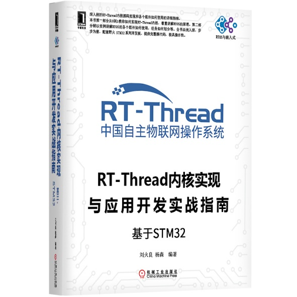

.. vim: syntax=rst

推荐序
-------------

RT-Thread从2006年走来，已经经过了十多个年头。早年就和野火相识于网络，
记得那个时候野火还没那么火（才开始做开发板），RT-Thread也还只是国内一个
小众的RTOS。直至2018年年中，野火过来上海才有缘相见，互道年轻 。

在2017年底，欣闻野火有著RT-Thread书籍的计划，非常欣喜、感谢。这将是RT-Thread的首本书籍，在RT-Thread的基础生态推广上有着举足轻重的作用！不仅如此，作为RT-Thread的官方合作伙伴，野火也在其全系列的STM32开发板上适配了RT-Thread例程并配套了手把手的教程。

野火的这本书籍，第一部分先从0到1的方式，从最底层的汇编开始，一步一步构造出一个RT-Thread操作系统内核，向大家揭示了任务如何定义、任务如何切换，也讲解了任务的延时如何实现，讲解了如何支持多优先级，讲解了如何实现定时器和讲解如何实现时间片等RT-
Thread操作系统的核心知识点；第二部分，则讲解RT-Thread内核设施的应用，使得大家学习RT-Thread不再困难，使用RT-Thread不再困难。

整本书由浅入深，层层叠加，与初学者的入门路径完全吻合，是学习RT-Thread物联网操作系统的不二之选书籍。同时整本书也兼顾深度，对于要了解操作系统内核原理的使用者，也非常值得一看。

RT-Thread 创始人

本书电子版和配套的实验源码均可到野火电子 / RT-Thread / 芯片之家 公众号下载。

野火电子公众号

.. image:: media/recommendation/recomm005.jpeg
   :align: center
   :alt: 野火电子公众号

RT-Thread公众号

芯片之家公众号

**《RT-Thread内核实现与应用开发实战指南—基于STM32》**

**野火STM32固件库和GUI书籍**

