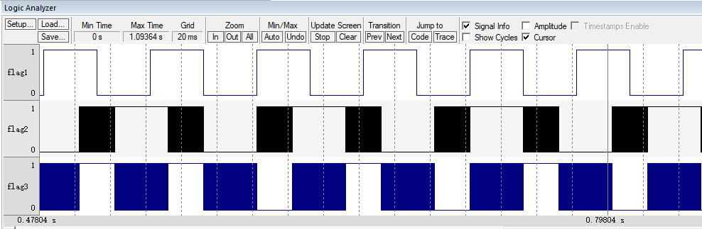
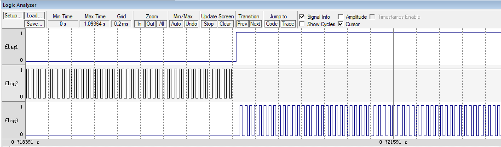

.. vim: syntax=rst

支持时间片
======

在RT-Thread中，当同一个优先级下有两个或两个以上线程的时候，线程支持时间片功能，即我们可以指定线程持续运行一次的时间，单位为tick。假如有两个线程分别为线程2和线程3，他们的优先级都为3，线程2的时间片为2，线程3的时间片为3。当执行到优先级为3的线程时，会先执行线程2，直到线程2的时间片
耗完，然后再执行线程3，具体的实验波形图看本章最后的实验现象即可。

实现时间片
~~~~~

在线程控制块中添加时间片相关成员
----------------

在线程控制块中添加时间片相关的成员，init_tick表示初始时间片，remaining_tick表示还剩下多少时间片，具体见代码清单 12‑1的高亮部分。

.. code-block:: c
    :caption: 代码清单 12‑1 在线程控制块中添加时间片相关成员
    :emphasize-lines: 17-18
    :linenos:

    struct rt_thread
    {
        /* rt 对象 */
        char        name[RT_NAME_MAX];    /* 对象的名字 */
        rt_uint8_t  type;                 /* 对象类型 */
        rt_uint8_t  flags;                /* 对象的状态 */
        rt_list_t   list;                 /* 对象的列表节点 */
        
        rt_list_t   tlist;                /* 线程链表节点 */
        
        void        *sp;	              /* 线程栈指针 */
        void        *entry;	              /* 线程入口地址 */
        void        *parameter;	          /* 线程形参 */	
        void        *stack_addr;          /* 线程起始地址 */
        rt_uint32_t stack_size;           /* 线程栈大小，单位为字节 */
        
        rt_ubase_t  init_tick;            /* 初始时间片 */
        rt_ubase_t  remaining_tick;       /* 剩余时间片 */ 
        
        rt_uint8_t  current_priority;     /* 当前优先级 */
        rt_uint8_t  init_priority;        /* 初始优先级 */
        rt_uint32_t number_mask;          /* 当前优先级掩码 */
        
        rt_err_t    error;                /* 错误码 */
        rt_uint8_t  stat;                 /* 线程的状态 */
        
        struct rt_timer thread_timer;     /* 内置的线程定时器 */    
    };

修改线程初始化函数
---------

在线程初始化函数rt_thread_init中添加时间片相关形参，并将线程控制块中与时间片相关的成员初始化好，具体见代码清单 12‑2的高亮部分。

.. code-block:: c
    :caption: 代码清单 12‑2 修改线程初始化函数
    :emphasize-lines: 8,34-36
    :linenos:

    rt_err_t rt_thread_init(struct rt_thread *thread,
                            const char       *name,
                            void (*entry)(void *parameter),
                            void             *parameter,
                            void             *stack_start,
                            rt_uint32_t       stack_size,
                            rt_uint8_t        priority,
                            rt_uint32_t       tick)
    {
        /* 线程对象初始化 */
        /* 线程结构体开头部分的成员就是rt_object_t类型 */
        rt_object_init((rt_object_t)thread, RT_Object_Class_Thread, name);
        rt_list_init(&(thread->tlist));
        
        thread->entry = (void *)entry;
        thread->parameter = parameter;

        thread->stack_addr = stack_start;
        thread->stack_size = stack_size;
        
        /* 初始化线程栈，并返回线程栈指针 */
        thread->sp = (void *)rt_hw_stack_init( thread->entry, 
                                            thread->parameter,
                                            (void *)((char *)thread->stack_addr + thread->stack_size - 4) );
        
        thread->init_priority    = priority;
        thread->current_priority = priority;
        thread->number_mask = 0;
        
        /* 错误码和状态 */
        thread->error = RT_EOK;
        thread->stat  = RT_THREAD_INIT;
        
        /* 时间片相关 */
        thread->init_tick      = tick;
        thread->remaining_tick = tick;
        
        /* 初始化线程定时器 */
        rt_timer_init(&(thread->thread_timer),     /* 静态定时器对象 */
                    thread->name,                /* 定时器的名字，直接使用的是线程的名字 */
                    rt_thread_timeout,           /* 超时函数 */
                    thread,                      /* 超时函数形参 */
                    0,                           /* 延时时间 */
                    RT_TIMER_FLAG_ONE_SHOT);     /* 定时器的标志 */
        
        return RT_EOK;
    }

修改空闲线程初始化函数
^^^^^^

在空闲线。程初始化函数中指定空闲线程的时间片，通常很少线程的优先级会与空闲线程的优先级一样，时间片我们可以随便设置，这里我们示意性的设置为2，具体见代码清单 12‑3的高亮部分。

.. code-block:: c
    :caption: 代码清单 12‑3 修改空闲线程初始化函数
    :emphasize-lines: 12
    :linenos:

    void rt_thread_idle_init(void)
    {
        
        /* 初始化线程 */
        rt_thread_init(&idle,
                    "idle",
                    rt_thread_idle_entry,
                    RT_NULL,
                    &rt_thread_stack[0],
                    sizeof(rt_thread_stack),
                    RT_THREAD_PRIORITY_MAX-1,
                    2);/* 时间片 */
        
        /* 启动空闲线程 */
        rt_thread_startup(&idle);
    }

修改系统时基更新函数
----------

在系统时基更新函数中添加与时间片相关的代码，具体见代码清单 12‑4的高亮部分。

.. code-block:: c
    :caption: 代码清单 12‑4 修改系统时基更新函数
    :emphasize-lines: 9-23
    :linenos:

    void rt_tick_increase(void)
    {
        struct rt_thread *thread;    
        
        
        /* 系统时基计数器加1操作,rt_tick是一个全局变量 */
        ++ rt_tick;

        /* 获取当前线程线程控制块 */
        thread = rt_thread_self();                          (1)

        /* 时间片递减 */
        -- thread->remaining_tick;                          (2)
        
        /* 如果时间片用完，则重置时间片，然后让出处理器 */
        if (thread->remaining_tick == 0)                    (3)
        {
            /* 重置时间片 */
            thread->remaining_tick = thread->init_tick;     (4)

            /* 让出处理器 */
            rt_thread_yield();                              (5)
        }
        
        /* 扫描系统定时器列表 */
        rt_timer_check();
    }

代码清单 12‑4\ **(1)**\ ：获取当前线程线程控制块。

代码清单 12‑4\ **(2)**\ ：递减当前线程的时间片。

代码清单 12‑4\ **(3)**\ ：如果时间片用完，则重置时间片，然后让出处理器，具体是否真正的要让出处理器还要看当前线程下是否有两个以上的线程。

代码清单 12‑4\ **(4)**\ ：如果时间片耗完，则重置时间片。

代码清单 12‑4\ **(5)**\ ：调用rt_thread_yield让出处理器，该函数在thread.c中定义，具体实现见代码清单 12‑5。

.. code-block:: c
    :caption: 代码清单 12‑5 rt_thread_yield函数定义
    :linenos:

    /**
    * 该函数将让当前线程让出处理器，调度器选择最高优先级的线程运行。当前让出处理器之后，
    * 当前线程还是在就绪态。
    *
    * @return RT_EOK
    */
    rt_err_t rt_thread_yield(void)
    {
        register rt_base_t level;
        struct rt_thread *thread;

        /* 关中断 */
        level = rt_hw_interrupt_disable();

        /* 获取当前线程的线程控制块 */
        thread = rt_current_thread;                                         (1)
        
        /* 如果线程在就绪态，且同一个优先级下不止一个线程 */
        if ((thread->stat & RT_THREAD_STAT_MASK) == RT_THREAD_READY &&      (2)
            thread->tlist.next != thread->tlist.prev)
        {
            /* 将时间片耗完的线程从就绪列表移除 */
            rt_list_remove(&(thread->tlist));                               (3)
            
            /* 将线程插入到该优先级下的链表的尾部 */                        (4)
            rt_list_insert_before(&(rt_thread_priority_table[thread->current_priority]),
                                &(thread->tlist));

            /* 开中断 */
            rt_hw_interrupt_enable(level);                                  (5)

            /* 执行调度 */
            rt_schedule();

            return RT_EOK;
        }

        /* 开中断 */
        rt_hw_interrupt_enable(level);

        return RT_EOK;
    }

代码清单 12‑5\ **(1)**\ ：获取当前线程线程控制块。

代码清单 12‑5\ **(2)**\ ：如果线程在就绪态，且同一个优先级下不止一个线程，则执行if里面的代码，否则函数返回。

代码清单 12‑5\ **(3)**\ ：将时间片耗完的线程从就绪列表移除。

代码清单 12‑5\ **(4)**\ ：将时间片耗完的线程插入到该优先级下的链表的尾部，把机会让给下一个线程。

代码清单 12‑5\ **(5)**\ ：执行调度。

修改main.c文件
~~~~~~~~~~

main.c文件的修改内容具体见代码清单 12‑6的高亮部分。

.. code-block:: c
    :caption: 代码清单 12‑6 main.c文件内容
    :emphasize-lines: 86-87,98-99,111-112,137,139,149-150,152-153,162-163,166,167
    :linenos:

    /*
    *************************************************************************
    *                             包含的头文件
    *************************************************************************
    */

    #include <rtthread.h>
    #include <rthw.h>
    #include "ARMCM3.h"

    /*
    *************************************************************************
    *                              全局变量
    *************************************************************************
    */
    rt_uint8_t flag1;
    rt_uint8_t flag2;
    rt_uint8_t flag3;

    extern rt_list_t rt_thread_priority_table[RT_THREAD_PRIORITY_MAX];

    /*
    *************************************************************************
    *                      线程控制块 & STACK & 线程声明
    *************************************************************************
    */

    /* 定义线程控制块 */
    struct rt_thread rt_flag1_thread;
    struct rt_thread rt_flag2_thread;
    struct rt_thread rt_flag3_thread;

    ALIGN(RT_ALIGN_SIZE)
    /* 定义线程栈 */
    rt_uint8_t rt_flag1_thread_stack[512];
    rt_uint8_t rt_flag2_thread_stack[512];
    rt_uint8_t rt_flag3_thread_stack[512];

    /* 线程声明 */
    void flag1_thread_entry(void *p_arg);
    void flag2_thread_entry(void *p_arg);
    void flag3_thread_entry(void *p_arg);

    /*
    *************************************************************************
    *                               函数声明
    *************************************************************************
    */
    void delay(uint32_t count);

    /************************************************************************
    * @brief  main函数
    * @param  无
    * @retval 无
    *
    * @attention
    *********************************************************************** 
    */
    int main(void)
    {	
        /* 硬件初始化 */
        /* 将硬件相关的初始化放在这里，如果是软件仿真则没有相关初始化代码 */
        
        /* 关中断 */
        rt_hw_interrupt_disable();
        
        /* SysTick中断频率设置 */
        SysTick_Config( SystemCoreClock / RT_TICK_PER_SECOND );
        
        /* 系统定时器列表初始化 */
        rt_system_timer_init();
        
        /* 调度器初始化 */
        rt_system_scheduler_init();

        /* 初始化空闲线程 */    
        rt_thread_idle_init();	
        
        /* 初始化线程 */
        rt_thread_init( &rt_flag1_thread,                 /* 线程控制块 */
                        "rt_flag1_thread",                /* 线程名字，字符串形式 */
                        flag1_thread_entry,               /* 线程入口地址 */
                        RT_NULL,                          /* 线程形参 */
                        &rt_flag1_thread_stack[0],        /* 线程栈起始地址 */
                        sizeof(rt_flag1_thread_stack),    /* 线程栈大小，单位为字节 */
                        2,                                /* 优先级 */
                        4);                               /* 时间片 */
        /* 将线程插入到就绪列表 */
        rt_thread_startup(&rt_flag1_thread);
        
        /* 初始化线程 */
        rt_thread_init( &rt_flag2_thread,                 /* 线程控制块 */
                        "rt_flag2_thread",                /* 线程名字，字符串形式 */
                        flag2_thread_entry,               /* 线程入口地址 */
                        RT_NULL,                          /* 线程形参 */
                        &rt_flag2_thread_stack[0],        /* 线程栈起始地址 */
                        sizeof(rt_flag2_thread_stack),    /* 线程栈大小，单位为字节 */
                        3,                                /* 优先级 */
                        2);                               /* 时间片 */
        /* 将线程插入到就绪列表 */
        rt_thread_startup(&rt_flag2_thread);
                        
                        
        /* 初始化线程 */
        rt_thread_init( &rt_flag3_thread,                 /* 线程控制块 */
                        "rt_flag3_thread",                /* 线程名字，字符串形式 */
                        flag3_thread_entry,               /* 线程入口地址 */
                        RT_NULL,                          /* 线程形参 */
                        &rt_flag3_thread_stack[0],        /* 线程栈起始地址 */
                        sizeof(rt_flag3_thread_stack),    /* 线程栈大小，单位为字节 */
                        3,                                /* 优先级 */
                        3);                               /* 时间片 */
        /* 将线程插入到就绪列表 */
        rt_thread_startup(&rt_flag3_thread);                    
        
        /* 启动系统调度器 */
        rt_system_scheduler_start(); 
    }

    /*
    *************************************************************************
    *                               函数实现
    *************************************************************************
    */
    /* 软件延时 */
    void delay (uint32_t count)
    {
        for(; count!=0; count--);
    }

    /* 线程1 */
    void flag1_thread_entry( void *p_arg )
    {
        for( ;; )
        {
            flag1 = 1;
            rt_thread_delay(3);               (阻塞延时)		
            flag1 = 0;
            rt_thread_delay(3);       
        }
    }

    /* 线程2 */
    void flag2_thread_entry( void *p_arg )
    {
        for( ;; )
        {
            flag2 = 1;
            //rt_thread_delay(2);
            delay( 100 );                    (软件延时) 		
            flag2 = 0;
            //rt_thread_delay(2);
            delay( 100 );        
        }
    }

    /* 线程3 */
    void flag3_thread_entry( void *p_arg )
    {
        for( ;; )
        {
            flag3 = 1;
            //rt_thread_delay(3);
            delay( 100 );                     (软件延时)		
            flag3 = 0;
            //rt_thread_delay(3);
            delay( 100 );        
        }
    }

    void SysTick_Handler(void)
    {
        /* 进入中断 */
        rt_interrupt_enter();

        /* 更新时基 */
        rt_tick_increase();

        /* 离开中断 */
        rt_interrupt_leave();
    }

代码清单 12‑6\ **(优先级)**\ ：线程1的优先级修改为2，线程2和线程3的优先级修改为3。

代码清单 12‑6\ **(时间片)**\ ：线程1的时间片设置为4（可是与线程1同优先级的线程没有，这里设置了时间片也没有什么鸟用，不信等下看实验现象），线程2和线程3的时间片设置为3。

代码清单 12‑6\ **(阻塞延时)**\ ：设置线程1高低电平的时间为3个tick，且延时要使用阻塞延时。

代码清单 12‑6\ **(软件延时)**\ ：将线程2和线程3的延时改成软件延时，因为这两个线程的优先级是相同的，当他们的时间片耗完的时候让出处理器进行系统调度，不会一直的占有CPU，所以可以使用软件延时，但是线程1却不可以，因为与线程1同优先级的线程没有，时间片功能不起作用，当时间片耗完的时候不
会让出CPU，会一直的占有CPU，所以不能使用软件延时。

实验现象
~~~~

进入软件调试，全速运行程序，逻辑分析仪中的仿真波形图具体见图 12‑1。

图 12‑1 实验现象

从图 12‑1中可以看出线程1运行一个周期的时间为6个tick，与线程1初始化时设置的4个时间片不符，说明同一个优先级下只有一个线程时时间片不起作用。线程2和线程3运行一个周期的时间分别为2个tick和3个tick，且线程2运行的时候线程3是不运行的，从而说明我们的时间片功能起作用了，搞定。图
12‑1线程2和线程3运行的波形图现在是太密集了，一团黑，看不出代码的执行效果，我们将波形图放大之后，可以在线程要求的时间片内flag2和flag3进行了很多很多次的翻转，具体见图 12‑2。

图 12‑2 实验现象2

