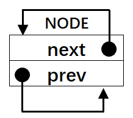

.. vim: syntax=rst

线程的定义与线程切换的实现
-------------

本章目标
~~~~

本章是我们真正从从0到1写RT-Thread的第一章，属于基础中的基础，必须要学会创建线程，并重点掌握线程是如何切换的。因为线程的切换是由汇编代码来完成的，所以代码看起来比较难懂，但是我会尽力把代码讲得透彻。如果本章内容学不会，后面的内容根本无从下手。

在这章中，我们会创建两个线程，并让这两个线程不断地切换，线程的主体都是让一个变量按照一定的频率翻转，通过KEIL的软件仿真功能，在逻辑分析仪中观察变量的波形变化，最终的波形图具体见图 6‑1。

|switch002|

图 6‑1 线程轮流切换波形图

其实，图 6‑1的波形图的效果，并不是真正的多线程系统中线程切换的效果图，这个效果其实可以完全由裸机代码来实现，具体见代码清单 6‑1。

代码清单 6‑1 裸机系统中两个变量轮流翻转

1 /\* flag 必须定义成全局变量才能添加到逻辑分析仪里面观察波形

2 \* 在逻辑分析仪中要设置以 bit 的模式才能看到波形，不能用默认的模拟量

3 \*/

4 uint32_t flag1;

5 uint32_t flag2;

6

7

8 /\* 软件延时，不必纠结具体的时间 \*/

9 void delay( uint32_t count )

10 {

11 for (; count!=0; count--);

12 }

13

14 int main(void)

15 {

16 /\* 无限循环，顺序执行 \*/

17 for (;;) {

18 flag1 = 1;

19 delay( 100 );

20 flag1 = 0;

21 delay( 100 );

22

23 flag2 = 1;

24 delay( 100 );

25 flag2 = 0;

26 delay( 100 );

27 }

28 }

在多线程系统中，两个线程不断切换的效果图应该像图 6‑2所示那样，即两个变量的波形是完全一样的，就好像CPU在同时干两件事一样，这才是多线程的意义。虽然两者的波形图一样，但是，代码的实现方式是完全不一样的，由原来的顺序执行变成了线程的主动切换，这是根本区别。这章只是开始，我们先掌握好线程是如何切换，
在后面章节中，我们会陆续的完善功能代码，加入系统调度，实现真正的多线程。千里之行，始于本章节，不要急。

|switch003|

图 6‑2 多线程系统线程切换波形图

什么是线程
~~~~~

在裸机系统中，系统的主体就是main函数里面顺序执行的无限循环，这个无限循环里面CPU按照顺序完成各种事情。在多线程系统中，我们根据功能的不同，把整个系统分割成一个个独立的且无法返回的函数，这个函数我们称为线程。线程的大概形式具体见代码清单 6‑2。

代码清单 6‑2 多线程系统中线程的形式

1 void thread_entry (void \*parg)

2 {

3 /\* 线程主体，无限循环且不能返回 \*/

4 for (;;) {

5 /\* 线程主体代码 \*/

6 }

7 }

创建线程
~~~~

定义线程栈
^^^^^

我们先回想下，在一个裸机系统中，如果有全局变量，有子函数调用，有中断发生。那么系统在运行的时候，全局变量放在哪里，子函数调用时，局部变量放在哪里，中断发生时，函数返回地址发哪里。如果只是单纯的裸机编程，它们放哪里我们不用管，但是如果要写一个RTOS，这些种种环境参数，我们必须弄清楚他们是如何存储的。
在裸机系统中，他们统统放在一个叫栈的地方，栈是单片机RAM里面一段连续的内存空间，栈的大小一般在启动文件或者链接脚本里面指定，最后由C库函数_main进行初始化。

但是，在多线程系统中，每个线程都是独立的，互不干扰的，所以要为每个线程都分配独立的栈空间，这个栈空间通常是一个预先定义好的全局数组，也可以是动态分配的一段内存空间，但它们都存在于RAM中。

本章我们要实现两个变量按照一定的频率轮流的翻转，每个变量对应一个线程，那么就需要定义两个线程栈，具体见代码清单 6‑3。在多线程系统中，有多少个线程就需要定义多少个线程栈。

代码清单 6‑3定义线程栈

1 ALIGN(RT_ALIGN_SIZE) **(2)**

2 /\* 定义线程栈 \*/

3 rt_uint8_t rt_flag1_thread_stack[512]; **(1)**

4 rt_uint8_t rt_flag2_thread_stack[512];

代码清单 6‑3 **(1)**\ ：线程栈其实就是一个预先定义好的全局数据，数据类型为 rt_uint8_t，大小我们设置为512。在RT-Thread中，凡是涉及到数据类型的地方，RT-Thread都会将标准的C数据类型用typedef
重新取一个类型名，以“rt”前缀开头。这些经过重定义的数据类型放在rtdef.h（rtdef.h第一次使用需要在include文件夹下面新建然后添加到工程rtt/source这个组文件）这个头文件，具体见代码清单 6‑4。代码清单
6‑4中除了rt_uint8_t外，其它数据类型重定义是本章后面内容需要使用到，这里统一贴出来，后面将不再赘述。

代码清单 6‑4 rtdef.h 中的数据类型

1 #ifndef \__RT_DEF_H_\_

2 #define \__RT_DEF_H_\_

3

4 /\*

5 \\*

6 \* 数据类型

7 \\*

8 \*/

9 /\* RT-Thread 基础数据类型重定义 \*/

10 typedef signed char rt_int8_t;

11 typedef signed short rt_int16_t;

12 typedef signed long rt_int32_t;

**13 typedef unsigned char rt_uint8_t;**

14 typedef unsigned short rt_uint16_t;

15 typedef unsigned long rt_uint32_t;

16 typedef int rt_bool_t;

17

18 /\* 32bit CPU \*/

19 typedef long rt_base_t;

20 typedef unsigned long rt_ubase_t;

21

22 typedef rt_base_t rt_err_t;

23 typedef rt_uint32_t rt_time_t;

24 typedef rt_uint32_t rt_tick_t;

25 typedef rt_base_t rt_flag_t;

26 typedef rt_ubase_t rt_size_t;

27 typedef rt_ubase_t rt_dev_t;

28 typedef rt_base_t rt_off_t;

29

30 /\* 布尔数据类型重定义 \*/

31 #define RT_TRUE 1

32 #define RT_FALSE 0

33

34 #ifdef \__CC_ARM

35 #define rt_inline static \__inline

**36 #define ALIGN(n) \__attribute__((aligned(n)))**

37

38 #elif defined (__IAR_SYSTEMS_ICC__)

39 #define rt_inline static inline

**40 #define ALIGN(n) PRAGMA(data_alignment=n)**

41

42 #elif defined (__GNUC__)

43 #define rt_inline static \__inline

**44 #define ALIGN(n) \__attribute__((aligned(n)))**

45 #else

46 #error not supported tool chain

47 #endif

48

49

50 #define RT_ALIGN(size, align) (((size) + (align) - 1) & ~((align) - 1))

51 #define RT_ALIGN_DOWN(size, align) ((size) & ~((align) - 1))

52

53

54 #define RT_NULL (0)

55

56 #endif /\* \__RT_DEF_H_\_ \*/

代码清单 6‑3 **(2)**\ ：设置变量需要多少个字节对齐，对在它下面的变量起作用。ALIGN是一个带参宏，在rtdef.h中定义，具体见代码清单
6‑4。RT_ALIGN_SIZE是一个在rtconfig.h（rtconfig.h第一次使用需要在User文件夹下面新建然后添加到工程user这个组文件）中定义的宏，默认为4，表示4个字节对齐，具体见代码清单 6‑5。

代码清单 6‑5 RT_ALIGN_SIZE 宏定义

1 #ifndef \__RTTHREAD_CFG_H_\_

2 #define \__RTTHREAD_CFG_H_\_

3

4 #define RT_ALIGN_SIZE 4 /\* 多少个字节对齐 \*/

5

6

7 #endif /\* \__RTTHREAD_CFG_H_\_ \*/

定义线程函数
^^^^^^

线程是一个独立的函数，函数主体无限循环且不能返回。本章我们在main.c中定义的两个线程具体见代码清单 6‑6。

代码清单 6‑6线程函数

1 /\* 软件延时 \*/

2 void delay (uint32_t count)

3 {

4 for (; count!=0; count--);

5 }

6

7 /\* 线程1 \*/

8 void flag1_thread_entry( void \*p_arg ) **(1)**

9 {

10 for ( ;; )

11 {

12 flag1 = 1;

13 delay( 100 );

14 flag1 = 0;

15 delay( 100 );

16 }

17 }

18

19 /\* 线程2 \*/

20 void flag2_thread_entry( void \*p_arg ) **(2)**

21 {

22 for ( ;; )

23 {

24 flag2 = 1;

25 delay( 100 );

26 flag2 = 0;

27 delay( 100 );

28 }

29 }

代码清单 6‑6 **(1)**\ 、\ **(2)**\ ：正如我们所说的那样，线程是一个独立的、无限循环且不能返回的函数。

定义线程控制块
^^^^^^^

在裸机系统中，程序的主体是CPU按照顺序执行的。而在多线程系统中，线程的执行是由系统调度的。系统为了顺利的调度线程，为每个线程都额外定义了一个线程控制块，这个线程控制块就相当于线程的身份证，里面存有线程的所有信息，比如线程的栈指针，线程名称，线程的形参等。有了这个线程控制块之后，以后系统对线程的全部
操作都可以通过这个线程控制块来实现。定义一个线程控制块需要一个新的数据类型，该数据类型在rtdef.h这个头文件中声明，具体的声明见代码清单 6‑7，使用它可以为每个线程都定义一个线程控制块实体。

代码清单 6‑7线程控制块类型声明

1 struct rt_thread **(1)**

2 {

3 void \*sp; /\* 线程栈指针 \*/

4 void \*entry; /\* 线程入口地址 \*/

5 void \*parameter; /\* 线程形参 \*/

6 void \*stack_addr; /\* 线程栈起始地址 \*/

7 rt_uint32_t stack_size; /\* 线程栈大小，单位为字节 \*/

8 };

9 typedef struct rt_thread \*rt_thread_t; **(2)**

代码清单 6‑7 **(1)**\ ：目前线程控制块结构体里面的成员还比较少，往后我们会慢慢在里面添加成员。

代码清单 6‑7 **(2)**\ ：在RT-Thread中，都会给新声明的数据结构重新定义一个指针。往后如果要定义线程控制块变量就使用struct rt_thread xxx的形式，定义线程控制块指针就使用rt_thread_t xxx的形式。

在本章实验中，我们在main.c文件中为两个线程定义的线程控制块，具体见代码清单 6‑8。

代码清单 6‑8 线程控制块定义

1 /\* 定义线程控制块 \*/

2 struct rt_thread rt_flag1_thread;

3 struct rt_thread rt_flag2_thread;

实现线程创建函数
^^^^^^^^

线程的栈，线程的函数实体，线程的控制块最终需要联系起来才能由系统进行统一调度。那么这个联系的工作就由线程初始化函数rt_thread_init()来实现，该函数在thread.c（thread.c第一次使用需要自行在文件夹rtthread/3.0.3/src中新建并添加到工程的rtt/source组
）中定义，在rtthread.h中声明，所有跟线程相关的函数都在这个文件定义。rt_thread_init()函数的实现见代码清单 6‑9。

代码清单 6‑9 rt_thread_init()函数

1 rt_err_t rt_thread_init(struct rt_thread \*thread, **(1)**

2 void (*entry)(void \*parameter), **(2)**

3 void \*parameter, **(3)**

4 void \*stack_start, **(4)**

5 rt_uint32_t stack_size) **(5)**

6 {

7 rt_list_init(&(thread->tlist)); **(6)**

8

9 thread->entry = (void \*)entry; **(7)**

10 thread->parameter = parameter; **(8)**

11

12 thread->stack_addr = stack_start; **(9)**

13 thread->stack_size = stack_size; **(10)**

14

15 /\* 初始化线程栈，并返回线程栈指针 \*/ **(11)**

16 thread->sp =

17 (void \*)rt_hw_stack_init( thread->entry,

18 thread->parameter,

19 (void \*)((char \*)thread->stack_addr + thread->stack_size - 4) );

20

21 return RT_EOK; **(12)**

22 }

代码清单 6‑9： rt_thread_init函数遵循RT-Thread中的函数命名规则，以小写的rt开头，表示这是一个外部函数，可以由用户调用，以_rt开头的函数表示内部函数，只能由RT-Thread内部使用。紧接着是文件名，表示该函数放在哪个文件，最后是函数功能名称。

代码清单 6‑9 **(1)**\ ：thread是线程控制块指针。

代码清单 6‑9 **(2)**\ ：entry 是线程函数名， 表示线程的入口。

代码清单 6‑9 **(3)**\ ：parameter是线程形参，用于传递线程参数。

代码清单 6‑9 **(4)**\ ：stack_start 用于指向线程栈的起始地址。

代码清单 6‑9 **(5)**\ ：stack_size表示线程栈的大小，单位为字节。

实现链表相关函数
''''''''

代码清单 6‑9 **(6)**\ ：初始化线程链表节点，往后我们要把线程插入到各种链表中，就是通过这个节点来实现的，它就好像是线程控制块里面的一个钩子，可以把线程控制块挂在各种链表中。在初始化之前我们需要在线程控制块中添加一个线程链表节点，具体见代码清单 6‑10的加粗部分代码。

代码清单 6‑10 在线程控制块中添加线程链表节点

1 struct rt_thread

2 {

3 void \*sp; /\* 线程栈指针 \*/

4 void \*entry; /\* 线程入口地址 \*/

5 void \*parameter; /\* 线程形参 \*/

6 void \*stack_addr; /\* 线程栈起始地址 \*/

7 rt_uint32_t stack_size; /\* 线程栈大小，单位为字节 \*/

8

**9 rt_list_t tlist; /\* 线程链表节点 \*/ (1)**

10 };

代码清单 6‑10\ **(1)**\ ：线程链表节点tlist的数据类型是是 rt_list_t，该数据类型在rtdef.h中定义，具体见代码清单 6‑11。

定义链表节点数据类型

代码清单 6‑11双向链表节点数据类型rt_list_t定义

1 struct rt_list_node

2 {

3 struct rt_list_node \*next; /\* 指向后一个节点 \*/

4 struct rt_list_node \*prev; /\* 指向前一个节点 \*/

5 };

6 typedef struct rt_list_node rt_list_t;

rt_list_t 类型的节点里面有两个rt_list_t类型的节点指针next和prev，分别用来指向链表中的下一个节点和上一个节点。由rt_list_t类型的节点构成的双向链表示意图具体见图 6‑3。

|switch004|

图 6‑3 rt_list_t类型的节点构成的双向链表

现在我们详细讲解下双向链表的相关操作，这些函数均在rtservice.h中实现，rtservice.h第一次使用需要自行在rtthread/3.0.3/include文件夹下新建，然后添加到工程的rtt/source组中。

初始化链表节点

rt_list_t类型的节点的初始化，就是将节点里面的next和prev这两个节点指针指向节点本身，具体的代码实现见代码清单 6‑12，具体的示意图见图 6‑4。

代码清单 6‑12 初始化rt_list_t类型的链表节点

1 rt_inline void rt_list_init(rt_list_t \*l)

2 {

3 l->next = l->prev = l;

4 }

|switch005|

图 6‑4 rt_list_t类型的链表节点初始化完成示意图

在双向链表表头后面插入一个节点

在双向链表头部插入一个节点，具体代码实现见代码清单 6‑13，主要处理分为4步，插入前和插入后的示意图具体见图 6‑5。

代码清单 6‑13 在双向链表表头后面插入一个节点

1 /\* 在双向链表头部插入一个节点 \*/

2 rt_inline void rt_list_insert_after(rt_list_t \*l, rt_list_t \*n)

3 {

4 l->next->prev = n; /\* 第 ① 步 \*/

5 n->next = l->next; /\* 第 ② 步 \*/

6

7 l->next = n; /\* 第 ③ 步 \*/

8 n->prev = l; /\* 第 ④ 步 \*/

9 }

|switch006|

图 6‑5 在双向链表头部插入一个节点处理过程示意图

在双向链表表头前面插入一个节点

在双向链表尾部插入一个节点，具体代码实现见代码清单 6‑14，主要处理分为4步，插入前和插入后的示意图具体见图 6‑6。

代码清单 6‑14 在双向链表表头前面插入一个节点

1 rt_inline void rt_list_insert_before(rt_list_t \*l, rt_list_t \*n)

2 {

3 l->prev->next = n; /\* 第 ① 步 \*/

4 n->prev = l->prev; /\* 第 ② 步 \*/

5

6 l->prev = n; /\* 第 ③ 步 \*/

7 n->next = l; /\* 第 ④ 步 \*/

8 }

|switch007|

图 6‑6 在双向链表尾部插入一个节点处理过程示意图

从双向链表删除一个节点

从双向链表删除一个节点，具体代码实现见代码清单 6‑15，主要处理分为3步，删除前和删除后的示意图具体见图 6‑7。

代码清单 6‑15 从双向链表删除一个节点

1 rt_inline void rt_list_remove(rt_list_t \*n)

2 {

3 n->next->prev = n->prev; /\* 第 ① 步 \*/

4 n->prev->next = n->next; /\* 第 ② 步 \*/

5

6 n->next = n->prev = n; /\* 第 ③ 步 \*/

7 }

|switch008|

图 6‑7 从双向链表删除一个节点

代码清单 6‑9 **(7)**\ ：将线程入口保存到线程控制块的entry成员中。

代码清单 6‑9 **(8)**\ ：将线程入口形参保存到线程控制块的parameter成员中。

代码清单 6‑9 **(9)**\ ：将线程栈起始地址保存到线程控制块的stack_start成员中。

代码清单 6‑9 **(10)**\ ：将线程栈起大小保存到线程控制块的stack_size成员中。

代码清单 6‑9 **(11)**\ ：初始化线程栈，并返回线程栈顶指针。rt_hw_stack_init()用来初始化线程栈，当线程第一次运行的时候，加载到CPU寄存器的参数就放在线程栈里面，该函数在cpuport.c中实现，具体见代码清单
6‑16。cpuport.c第一次使用需要自行在rtthread/3.0.3/ libcpu/arm/cortex-m3 (cortex-m4或cortex-m7)文件夹下新建，然后添加到工程的rtt/ports组中。

rt_hw_stack_init()函数
''''''''''''''''''''

代码清单 6‑16 rt_hw_stack_init()函数

1 rt_uint8_t \*rt_hw_stack_init(void \*tentry, **(1)**

2 void \*parameter, **(2)**

3 rt_uint8_t \*stack_addr) **(3)**

4 {

5

6

7 struct stack_frame \*stack_frame; **(4)**

8 rt_uint8_t \*stk;

9 unsigned long i;

10

11

12 /\* 获取栈顶指针

13 rt_hw_stack_init 在调用的时候，传给stack_addr的是(栈顶指针-4)*/

14 stk = stack_addr + sizeof(rt_uint32_t); **(5)**

15

16 /\* 让stk指针向下8字节对齐 \*/

17 stk = (rt_uint8_t \*)RT_ALIGN_DOWN((rt_uint32_t)stk, 8); **(6)**

18

19 /\* stk指针继续向下移动sizeof(struct stack_frame)个偏移 \*/

20 stk -= sizeof(struct stack_frame); **(7)**

21

22 /\* 将stk指针强制转化为stack_frame类型后存到stack_frame \*/

23 stack_frame = (struct stack_frame \*)stk; **(8)**

24

25 /\* 以stack_frame为起始地址，将栈空间里面的sizeof(struct stack_frame)

26 个内存初始化为0xdeadbeef \*/

27 for (i = 0; i < sizeof(struct stack_frame) / sizeof(rt_uint32_t); i ++) **(9)**

28 {

29 ((rt_uint32_t \*)stack_frame)[i] = 0xdeadbeef;

30 }

31

32 /\* 初始化异常发生时自动保存的寄存器 \*/ **(10)**

33 stack_frame->exception_stack_frame.r0 = (unsigned long)parameter; /\* r0 : argument \*/

34 stack_frame->exception_stack_frame.r1 = 0; /\* r1 \*/

35 stack_frame->exception_stack_frame.r2 = 0; /\* r2 \*/

36 stack_frame->exception_stack_frame.r3 = 0; /\* r3 \*/

37 stack_frame->exception_stack_frame.r12 = 0; /\* r12 \*/

38 stack_frame->exception_stack_frame.lr = 0; /\* lr：暂时初始化为0 \*/

39 stack_frame->exception_stack_frame.pc = (unsigned long)tentry; /\* entry point, pc \*/

40 stack_frame->exception_stack_frame.psr = 0x01000000L; /\* PSR \*/

41

42

43 /\* 返回线程栈指针 \*/

44 return stk; **(11)**

45 }

代码清单 6‑16\ **(1)**\ ：线程入口。

代码清单 6‑16\ **(2)**\ ：线程形参。

代码清单 6‑16\ **(3)**\ ：线程栈顶地址-4，在该函数调用的时候传进来的是线程栈的栈顶地址-4。

代码清单 6‑16\ **(4)**\ ：定义一个struct stack_frame类型的结构体指针stack_frame，该结构体类型在cpuport.c中定义，具体见代码清单 6‑17。

代码清单 6‑17 struct stack_frame类型结构体定义

1 struct exception_stack_frame

2 {

3 /\* 异常发生时，自动加载到CPU寄存器的内容 \*/

4 rt_uint32_t r0;

5 rt_uint32_t r1;

6 rt_uint32_t r2;

7 rt_uint32_t r3;

8 rt_uint32_t r12;

9 rt_uint32_t lr;

10 rt_uint32_t pc;

11 rt_uint32_t psr;

12 };

13

14 struct stack_frame

15 {

16 /\* 异常发生时，需手动加载到CPU寄存器的内容 \*/

17 rt_uint32_t r4;

18 rt_uint32_t r5;

19 rt_uint32_t r6;

20 rt_uint32_t r7;

21 rt_uint32_t r8;

22 rt_uint32_t r9;

23 rt_uint32_t r10;

24 rt_uint32_t r11;

25

26 struct exception_stack_frame exception_stack_frame;

27 };

代码清单 6‑16\ **(5)**\ ：获取栈顶指针，将栈顶指针传给指针stk。rt_hw_stack_init()函数 在rt_thread_init ()函数中调用的时候传给形参stack_addr的值是栈顶指针减去4，所以现在
加上sizeof(rt_uint32_t)刚好与减掉的4相互抵消，即传递给stk的是栈顶指针。

代码清单 6‑16\ **(6)**\ ：让stk这个指针向下8个字节对齐，确保stk是8字节对齐的地址。在Cortex-M3（Cortex-M4或Cortex-M7）内核的单片机中，因为总线宽度是32位的，通常只要栈保持4字节对齐就行，可这样为啥要8字节？难道有哪些操作是64位的？确实有，那就是浮
点运算，所以要8字节对齐（但是目前我们都还没有涉及到浮点运算，只是为了后续兼容浮点运行的考虑）。如果栈顶指针是8字节对齐的，在进行向下8字节对齐的时候，指针不会移动，如果不是8字节对齐的，在做向下8字节对齐的时候，就会空出几个字节，不会使用，比如当stk是33，明显不能整除8，进行向下8字节对齐就是
32，那么就会空出一个字节不使用。

代码清单 6‑16\ **(7)**\ ：stk指针继续向下移动sizeof(struct stack_frame)个偏移，即16个字的大小。如果栈顶指针一开始都是8字节对齐的，那么stk现在在线程栈里面的指向具体见图 6‑8。

|switch009|

图 6‑8 stk指针指向

代码清单 6‑16\ **(8)**\ ：将stk指针强制转化为stack_frame类型后存到指针变量stack_frame 中，这个时候stack_frame在线程栈里面的指向具体见图 6‑9。

|switch010|

图 6‑9 stack_frame指针指向

代码清单 6‑16\ **(9)**\ ：以stack_frame为起始地址，将栈空间里面的sizeof(struct stack_frame)个内存初始化为0xdeadbeef ，这个时候栈空间的内容分布具体见图 6‑10。

|switch011|

图 6‑10 栈空间内容分布

代码清单 6‑16\ **(10)**\ ：线程第一次运行的时候，加载到CPU寄存器的环境参数我们要预先初始化好。从栈顶开始，初始化的顺序固定，首先是异常发生时自动保存的8个寄存器，即xPSR、R15、R14、R12、R3、R2、R1和R0。其中xPSR寄存器的位24必须是1，R15
PC指针必须存的是线程的入口地址，R0必须是线程形参，剩下的R14、R12、R3、R2和R1我们初始化为0。

|switch012|

图 6‑11 栈空间内容分布

剩下的是8个需要手动加载到CPU寄存器的参数，即R4~R11，默认初始化为0xdeadbeaf，具体见图 6‑11。

代码清单 6‑16\ **(11)**\ ：返回线程栈指针stk，这个时候stk指向剩余栈的栈顶。

代码清单 6‑9 **(12)**\ ：线程初始化成功，返回错误码RT_EOK。RT-Thread的错误码在rtdef.h中定义，具体见代码清单 6‑18。

代码清单 6‑18 错误码宏定义

1 /\*

2 \\*

3 \* 错误码定义

4 \\*

5 \*/

6 /\* RT-Thread 错误码重定义 \*/

7 #define RT_EOK 0 /**< There is no error \*/

8 #define RT_ERROR 1 /**< A generic error happens \*/

9 #define RT_ETIMEOUT 2 /**< Timed out \*/

10 #define RT_EFULL 3 /**< The resource is full \*/

11 #define RT_EEMPTY 4 /**< The resource is empty \*/

12 #define RT_ENOMEM 5 /**< No memory \*/

13 #define RT_ENOSYS 6 /**< No system \*/

14 #define RT_EBUSY 7 /**< Busy \*/

15 #define RT_EIO 8 /**< IO error \*/

16 #define RT_EINTR 9 /**< Interrupted system call \*/

17 #define RT_EINVAL 10 /**< Invalid argument \*/

在本章实验中，我们在main函数中创建两个flag相关的线程，具体见代码清单 6‑19。

代码清单 6‑19 初始化线程

1 int main(void)

2 {

3 /\* 硬件初始化 \*/

4 /\* 将硬件相关的初始化放在这里，如果是软件仿真则没有相关初始化代码 \*/

5

6

7 /\* 初始化线程 \*/

8 rt_thread_init( &rt_flag1_thread, /\* 线程控制块 \*/

9 flag1_thread_entry, /\* 线程入口地址 \*/

10 RT_NULL, /\* 线程形参 \*/

11 &rt_flag1_thread_stack[0], /\* 线程栈起始地址 \*/

12 sizeof(rt_flag1_thread_stack) ); /\* 线程栈大小，单位为字节 \*/

13

14 /\* 初始化线程 \*/

15 rt_thread_init( &rt_flag2_thread, /\* 线程控制块 \*/

16 flag2_thread_entry, /\* 线程入口地址 \*/

17 RT_NULL, /\* 线程形参 \*/

18 &rt_flag2_thread_stack[0], /\* 线程栈起始地址 \*/

19 sizeof(rt_flag2_thread_stack) ); /\* 线程栈大小，单位为字节 \*/

实现就绪列表
~~~~~~

定义就绪列表
^^^^^^

线程创建好之后，我们需要把线程添加到就绪列表里面，表示线程已经就绪，系统随时可以调度。就绪列表在scheduler.c中定义（scheduler.c第一次使用需要在rtthread\3.0.3\src目录下新建，然后添加到工程的rtt/source组中），具体见代码清单 6‑20。

代码清单 6‑20 定义就绪列表

1 /\* 线程就绪列表 \*/

2 rt_list_t rt_thread_priority_table[RT_THREAD_PRIORITY_MAX]; **(1)**

代码清单 6‑20\ **(1)**\ ：就绪列表实际上就是一个rt_list_t类型的数组，数组的大小由决定最大线程优先级的宏RT_THREAD_PRIORITY_MAX决定，RT_THREAD_PRIORITY_MAX在rtconfig.h中默认定义为32。数组的下标对应了线程的优先级，同一优先
级的线程统一插入到就绪列表的同一条链表中。一个空的就绪列表具体见图 6‑12。

|switch013|

图 6‑12 空的就绪列表

将线程插入到就绪列表
^^^^^^^^^^

线程控制块里面有一个tlist成员，数据类型为rt_list_t，我们将线程插入到就绪列表里面，就是通过将线程控制块的tlist这个节点插入到就绪列表中来实现的。如果把就绪列表比作是晾衣杆，线程是衣服，那tlist就是晾衣架，每个线程都自带晾衣架，就是为了把自己挂在各种不同的链表中。

在本章实验中，我们在线程创建好之后，紧跟着将线程插入到就绪列表，具体实现见代码清单 6‑21的加粗部分。

代码清单 6‑21 将线程插入到就绪列表

1 /\* 初始化线程 \*/

2 rt_thread_init( &rt_flag1_thread, /\* 线程控制块 \*/

3 flag1_thread_entry, /\* 线程入口地址 \*/

4 RT_NULL, /\* 线程形参 \*/

5 &rt_flag1_thread_stack[0], /\* 线程栈起始地址 \*/

6 sizeof(rt_flag1_thread_stack) ); /\* 线程栈大小，单位为字节 \*/

**7 /\* 将线程插入到就绪列表 \*/**

**8 rt_list_insert_before( &(rt_thread_priority_table[0]),&(rt_flag1_thread.tlist) );**

9

10 /\* 初始化线程 \*/

11 rt_thread_init( &rt_flag2_thread, /\* 线程控制块 \*/

12 flag2_thread_entry, /\* 线程入口地址 \*/

13 RT_NULL, /\* 线程形参 \*/

14 &rt_flag2_thread_stack[0], /\* 线程栈起始地址 \*/

15 sizeof(rt_flag2_thread_stack) ); /\* 线程栈大小，单位为字节 \*/

**16 /\* 将线程插入到就绪列表 \*/**

**17 rt_list_insert_before( &(rt_thread_priority_table[1]),&(rt_flag2_thread.tlist) );**

就绪列表的下标对应的是线程的优先级，但是目前我们的线程还不支持优先级，有关支持多优先级的知识点我们后面会讲到，所以flag1和flag2线程在插入到就绪列表的时候，可以随便选择插入的位置。在代码清单
6‑21中，我们选择将flag1线程插入到就绪列表下标为0的链表中，flag2线程插入到就绪列表下标为1的链表中，具体的示意图见图 6‑13。

|switch014|

图 6‑13 线程插入到就绪列表示意图

实现调度器
~~~~~

调度器是操作系统的核心，其主要功能就是实现线程的切换，即从就绪列表里面找到优先级最高的线程，然后去执行该线程。从代码上来看，调度器无非也就是由几个全局变量和一些可以实现线程切换的函数组成，全部都在scheduler.c文件中实现。

调度器初始化
^^^^^^

调度器在使用之前必须先初始化，具体见代码清单 6‑22。

代码清单 6‑22 调度器初始化函数

1 /\* 初始化系统调度器 \*/

2 void rt_system_scheduler_init(void)

3 {

4 register rt_base_t offset; **(1)**

5

6

7 /\* 线程就绪列表初始化 \*/

8 for (offset = 0; offset < RT_THREAD_PRIORITY_MAX; offset ++) **(2)**

9 {

10 rt_list_init(&rt_thread_priority_table[offset]);

11 }

12

13 /\* 初始化当前线程控制块指针 \*/

14 rt_current_thread = RT_NULL; **(3)**

15 }

代码清单 6‑22\ **(1)**\ ：定义一个局部变量，用C语言关键词register修饰，防止被编译器优化。

代码清单 6‑22\ **(2)**\ ：初始化线程就绪列表，初始化完后，整个就绪列表为空，具体见图 6‑14。

|switch015|

图 6‑14 空的线程就绪列表

代码清单 6‑22\ **(3)**\ ：初始化当前线程控制块指针为空。rt_current_thread是在scheduler.c中定义的一个struct rt_thread类型的全局指针，用于指向当前正在运行的线程的线程控制块。

在本章实验中，我们把调度器初始化放在硬件初始化之后，线程创建之前，具体见代码清单 6‑23的加粗部分。

代码清单 6‑23 调度器初始化

1 int main(void)

2 {

3 /\* 硬件初始化 \*/

4 /\* 将硬件相关的初始化放在这里，如果是软件仿真则没有相关初始化代码 \*/

5

**6 /\* 调度器初始化 \*/**

**7 rt_system_scheduler_init();**

8

9

10 /\* 初始化线程 \*/

11 rt_thread_init( &rt_flag1_thread, /\* 线程控制块 \*/

12 flag1_thread_entry, /\* 线程入口地址 \*/

13 RT_NULL, /\* 线程形参 \*/

14 &rt_flag1_thread_stack[0], /\* 线程栈起始地址 \*/

15 sizeof(rt_flag1_thread_stack) ); /\* 线程栈大小，单位为字节 \*/

16 /\* 将线程插入到就绪列表 \*/

17 rt_list_insert_before( &(rt_thread_priority_table[0]),&(rt_flag1_thread.tlist) );

18

19 /\* 初始化线程 \*/

20 rt_thread_init( &rt_flag2_thread, /\* 线程控制块 \*/

21 flag2_thread_entry, /\* 线程入口地址 \*/

22 RT_NULL, /\* 线程形参 \*/

23 &rt_flag2_thread_stack[0], /\* 线程栈起始地址 \*/

24 sizeof(rt_flag2_thread_stack) ); /\* 线程栈大小，单位为字节 \*/

25 /\* 将线程插入到就绪列表 \*/

26 rt_list_insert_before( &(rt_thread_priority_table[1]),&(rt_flag2_thread.tlist) );

27 }

启动调度器
^^^^^

调度器启动由函数rt_system_scheduler_start()来完成，具体实现见代码清单 6‑24。

代码清单 6‑24 启动调度器函数

1 /\* 启动系统调度器 \*/

2 void rt_system_scheduler_start(void)

3 {

4 register struct rt_thread \*to_thread;

5

6

7 /\* 手动指定第一个运行的线程 \*/ **(1)**

8 to_thread = rt_list_entry(rt_thread_priority_table[0].next,

9 struct rt_thread,

10 tlist);

11 rt_current_thread = to_thread; **(2)**

12

13 /\* 切换到第一个线程，该函数在context_rvds.S中实现，

14 在rthw.h声明，用于实现第一次线程切换。

15 当一个汇编函数在C文件中调用的时候，如果有形参，

16 则执行的时候会将形参传人到CPU寄存器r0。*/

17 rt_hw_context_switch_to((rt_uint32_t)&to_thread->sp); **(3)**

18 }

代码清单 6‑24 **(1)**\ ：调度器在启动的时候会从就绪列表中取出优先级最高的线程的线程控制块，然后切换到该线程。但是目前我们的线程还不支持优先级，那么就手动指定第一个运行的线程为就绪列表下标为0这条链表里面挂着的线程。rt_list_entry()是一个已知一个结构体里面的成员的地址，反
推出该结构体的首地址的宏，在scheduler.c开头定义，具体实现见代码清单 6‑25。

代码清单 6‑25 rt_list_entry宏定义

1 /\* 已知一个结构体里面的成员的地址，反推出该结构体的首地址 \*/

2 #define rt_container_of(ptr, type, member) \\ **(2)**

3 ((type \*)((char \*)(ptr) - (unsigned long)(&((type \*)0)->member)))

4

5 #define rt_list_entry(node, type, member) \\ **(1)**

6 rt_container_of(node, type, member)

代码清单 6‑25\ **(1)**\ ：node表示一个节点的地址，type表示该节点所在的结构体的类型，member表示该节点在该结构体中的成员名称。

代码清单 6‑25\ **(2)**\ ：rt_container_of()的实现算法具体见图 6‑15。

|switch016|

图 6‑15 已知type类型的结构体f_struct中tlist成员的地址为ptr，推算出f_struct的起始地址f_struct_ptr的示意图

图 6‑15中，我们知道了一个节点tlist的地址ptr，现在要推算出该节点所在的type
类型的结构体的起始地址f_struct_ptr。我们可以将ptr的值减去图中灰色部分的偏移的大小就可以得到f_struct_ptr的地址，现在的关键是如何计算出灰色部分的偏移大小。这里采取的做法是将0地址强制类型类型转换为type，即(type
\*)0，然后通过指针访问结构体成员的方式获取到偏移的大小，即(&((type \*)0)->member)，最后即可算出f_struct_ptr = ptr - (&((type \*)0)->member)。

代码清单 6‑24 **(2)**\ ：将获取到的第一个要运行的线程控制块指针传到全局变量rt_current_thread中。

第一次线程切换
^^^^^^^

rt_hw_context_switch_to() 函数
''''''''''''''''''''''''''''

代码清单 6‑24 **(3)**\ ：第一次切换到新的线程，该函数在context_rvds.s中实现（context_rvds.S文件第一次使用需要在rtthread\3.0.3\libcpu\arm\cortex-m3(cortex-m4或者cortex-m7)中新建，然后添加到工程rtt/p
orts组中），在rthw.h声明，用于实现第一次线程切换。 当一个汇编函数在C文件中调用的时候，如果有一个形参，则执行的时候会将这个形参传入到CPU寄存器r0，如果有两个形参，第二个则传入到r1。rt_hw_context_switch_to()的具体实现见代码清单
6‑26。context_rvds.s文件中涉及到的ARM 汇编指令具体参考表格 6‑1。

表格 6‑1 ARM常用汇编指令讲解

============= ===========================================================================================================================================================================================================
指令名称      作用
============= ===========================================================================================================================================================================================================
EQU           给数字常量取一个符号名，相当于C语言中的define
AREA          汇编一个新的代码段或者数据段
SPACE         分配内存空间
PRESERVE8     当前文件栈需按照8字节对齐
EXPORT        声明一个标号具有全局属性，可被外部的文件使用
DCD           以字为单位分配内存，要求4字节对齐，并要求初始化这些内存
PROC          定义子程序，与ENDP成对使用，表示子程序结束
WEAK          弱定义，如果外部文件声明了一个标号，则优先使用外部文件定义的标号，如果外部文件没有定义也不出错。要注意的是：这个不是ARM的指令，是编译器的，这里放在一起只是为了方便。
IMPORT        声明标号来自外部文件，跟C语言中的EXTERN关键字类似
B             跳转到一个标号
ALIGN         编译器对指令或者数据的存放地址进行对齐，一般需要跟一个立即数，缺省表示4字节对齐。要注意的是：这个不是ARM的指令，是编译器的，这里放在一起只是为了方便。
END           到达文件的末尾，文件结束
IF,ELSE,ENDIF 汇编条件分支语句，跟C语言的if else类似
\
MRS           加载特殊功能寄存器的值到通用寄存器
MSR           存储通用寄存器的值到特殊功能寄存器
CBZ           比较，如果结果为 0 就转移
CBNZ          比较，如果结果非 0 就转移
LDR           从存储器中加载字到一个寄存器中
LDR[伪指令]   加载一个立即数或者一个地址值到一个寄存器。举例：LDR Rd, = label，如果label是立即数，那Rd等于立即数，如果label是一个标识符，比如指针，那存到Rd的就是label这个标识符的地址
LDRH          从存储器中加载半字到一个寄存器中
LDRB          从存储器中加载字节到一个寄存器中
STR           把一个寄存器按字存储到存储器中
STRH          把一个寄存器存器的低半字存储到存储器中
STRB          把一个寄存器的低字节存储到存储器中
LDMIA         加载多个字，并且在加载后自增基址寄存器
STMIA         存储多个字，并且在存储后自增基址寄存器
ORR           按位或
BX            直接跳转到由寄存器给定的地址
BL            跳转到 标号对应的地址，并且把跳转前的下条指令地址保存到 LR
BLX           跳转到由寄存器REG给出的的地址，并根据 REG 的 LSB 切换处理器状态，还要把转移前的下条指令地址保存到 LR。ARM(LSB=0)，Thumb(LSB=1)。Cortex-M3 只在 Thumb 中运行，就必须保证 reg 的 LSB=1，否则一个 fault 打过来
============= ===========================================================================================================================================================================================================

代码清单 6‑26 rt_hw_context_switch_to() 函数

1 ;\*

2 ; 全局变量 **(4)**

3 ;\*

4 IMPORT rt_thread_switch_interrupt_flag

5 IMPORT rt_interrupt_from_thread

6 IMPORT rt_interrupt_to_thread

7

8 ;\*

9 ; 常量 **(5)**

10 ;\*

11 ;------------------------------------------------------------------------

12 ;有关内核外设寄存器定义可参考官方文档：STM32F10xxx Cortex-M3 programming manual

13 ;系统控制块外设SCB地址范围：0xE000ED00-0xE000ED3F

14 ;------------------------------------------------------------------------

15 SCB_VTOR EQU 0xE000ED08 ; 向量表偏移寄存器

16 NVIC_INT_CTRL EQU 0xE000ED04 ; 中断控制状态寄存器

17 NVIC_SYSPRI2 EQU 0xE000ED20 ; 系统优先级寄存器(2)

18 NVIC_PENDSV_PRI EQU 0x00FF0000 ; PendSV 优先级值 (lowest)

19 NVIC_PENDSVSET EQU 0x10000000 ; 触发PendSV exception的值

20

21 ;\*

22 ; 代码产生指令 **(1)**

23 ;\*

24

25 AREA \|.text|, CODE, READONLY, ALIGN=2

26 THUMB

27 REQUIRE8

28 PRESERVE8

29

30 ;/\*

31 ; \*----------------------------------------------------------------------

32 ; \* 函数原型：void rt_hw_context_switch_to(rt_uint32 to);

33 ; \* r0 --> to

34 ; \* 该函数用于开启第一次线程切换

35 ; \*----------------------------------------------------------------------

36 ; \*/

37

38

39 rt_hw_context_switch_to PROC **(6)**

40

41 ; 导出rt_hw_context_switch_to，让其具有全局属性，可以在C文件调用

42 EXPORT rt_hw_context_switch_to **(7)**

43

44 ; 设置rt_interrupt_to_thread的值 **(8)**

45 ;将rt_interrupt_to_thread的地址加载到r1

46 LDR r1, =rt_interrupt_to_thread **(8)-①**

47 ;将r0的值存储到rt_interrupt_to_thread **(8)-②**

48 STR r0, [r1]

49

50 ; 设置rt_interrupt_from_thread的值为0，表示启动第一次线程切换 **(9)**

51 ;将rt_interrupt_from_thread的地址加载到r1

52 LDR r1, =rt_interrupt_from_thread **(9)-①**

53 ;配置r0等于0

54 MOV r0, #0x0 **(9)-②**

55 ;将r0的值存储到rt_interrupt_from_thread

56 STR r0, [r1] **(9)-③**

57

58 ; 设置中断标志位rt_thread_switch_interrupt_flag的值为1 **(10)**

59 ;将rt_thread_switch_interrupt_flag的地址加载到r1

60 LDR r1, =rt_thread_switch_interrupt_flag **(10)-①**

61 ;配置r0等于1

62 MOV r0, #1 **(10)-②**

63 ;将r0的值存储到rt_thread_switch_interrupt_flag

64 STR r0, [r1] **(10)-③**

65

66 ; 设置 PendSV 异常的优先级 **(11)**

67 LDR r0, =NVIC_SYSPRI2

68 LDR r1, =NVIC_PENDSV_PRI

69 LDR.W r2, [r0,#0x00] ; 读

70 ORR r1,r1,r2 ; 改

71 STR r1, [r0] ; 写

72

73 ; 触发 PendSV 异常 (产生上下文切换) **(12)**

74 LDR r0, =NVIC_INT_CTRL

75 LDR r1, =NVIC_PENDSVSET

76 STR r1, [r0]

77

78 ; 开中断

79 CPSIE F **(13)**

80 CPSIE I

81

82 ; 永远不会到达这里

83 ENDP **(14)**

84

85 ALIGN 4 **(3)**

86

   87 END **(2)**

代码清单 6‑26 **(1)**\
：汇编代码产生指令，当我们新建一个汇编文件写代码时，必须包含类似的指令。AERA表示汇编一个新的数据段或者代码段，.text表示段名字，如果段名不是以字母开头，而是以其它符号开头则需要在段名两边加上‘|’，CODE表示为代码，READONLY表示只读，ALIGN=2，表示当前文件指令要2\
:sup:`2`\ 字节对齐。THUMB表示THUMB指令代码，REQUIRE8和PRESERVE8均表示当前文件的栈按照8字节对齐。

代码清单 6‑26 **(2)**\ ：汇编文件结束，每个汇编文件都需要一个END。

代码清单 6‑26 **(3)**\ ：当前文件指令代码要求4字节对齐，不然会有警告。

代码清单 6‑26 **(4)**\ ：使用IMPORT关键字导入一些全局变量，这三个全局变量在cpuport.c中定义，具体见代码清单 6‑27，每个变量的含义具体看注释。

代码清单 6‑27 汇编文件导入的三个全局变量定义

1 /\* 用于存储上一个线程的栈的sp的指针 \*/

2 rt_uint32_t rt_interrupt_from_thread;

3

4 /\* 用于存储下一个将要运行的线程的栈的sp的指针 \*/

5 rt_uint32_t rt_interrupt_to_thread;

6

7 /\* PendSV中断服务函数执行标志 \*/

8 rt_uint32_t rt_thread_switch_interrupt_flag;

代码清单 6‑26 **(5)**\ ：定义了一些常量，这些都是内核里面的寄存器，等下触发PendSV异常会用到。有关内核外设寄存器定义可参考官方文档：STM32F10xxx Cortex-M3 programming manual—4 Core
peripherals，无论是M3/4/7内核均可以参考该文档。

代码清单 6‑26 **(6)**\ ：PROC用于定义子程序，与ENDP成对使用，表示rt_hw_context_switch_to()函数开始。

代码清单 6‑26 **(7)**\ ：使用EXPORT关键字导出rt_hw_context_switch_to，让其具有全局属性，可以在C文件调用（但也要先在rthw.h中声明）。

代码清单 6‑26 **(8)**\ ：设置rt_interrupt_to_thread的值。

代码清单 6‑26 **(8)-①**\ ：将rt_interrupt_to_thread的地址加载到r1。

代码清单 6‑26 **(8)-②**\ ：将r0的值存储到rt_interrupt_to_thread，r0存的是下一个将要运行的线程的sp的地址，由rt_hw_context_switch_to((rt_uint32_t)&to_thread->sp)调用的时候传到r0。

代码清单 6‑26 **(9)**\ ：设置rt_interrupt_from_thread的值为0，表示启动第一次线程切换。

代码清单 6‑26 **(9)-①**\ ：将rt_interrupt_from_thread的地址加载到r1。

代码清单 6‑26 **(9)-②**\ ：配置r0等于0。

代码清单 6‑26 **(9)-③**\ ：将r0的值存储到rt_interrupt_from_thread。

代码清单 6‑26 **(10)**\ ：设置中断标志位rt_thread_switch_interrupt_flag的值为1，当执行了PendSVC Handler时，rt_thread_switch_interrupt_flag的值会被清0。

代码清单 6‑26 **(10)-①**\ ：将rt_thread_switch_interrupt_flag的地址加载到r1。

代码清单 6‑26 **(10)-②**\ ：配置r0等于1。

代码清单 6‑26 **(10)-③**\ ：将r0的值存储到rt_thread_switch_interrupt_flag。

代码清单 6‑26 **(11)**\ ：设置 PendSV 异常的优先级为最低。

代码清单 6‑26 **(12)**\ ：触发 PendSV 异常 (产生上下文切换)。如果前面关了，还要等中断打开才能去执行PendSV中断服务函数。

代码清单 6‑26 **(13)**\ ：开中断。

代码清单 6‑26 **(14)**\ ：rt_hw_context_switch_to()程序结束，与PROC成对使用。

PendSV_Handler()函数
''''''''''''''''''

PendSV_Handler()函数是真正实现线程上下文切换的地方，具体实现见代码清单 6‑28。

代码清单 6‑28 PendSV_Handler()函数

1 ;/\*

2 ; \*----------------------------------------------------------------------

3 ; \* void PendSV_Handler(void);

4 ; \* r0 --> switch from thread stack

5 ; \* r1 --> switch to thread stack

6 ; \* psr, pc, lr, r12, r3, r2, r1, r0 are pushed into [from] stack

7 ; \*----------------------------------------------------------------------

8 ; \*/

9

10 PendSV_Handler PROC

11 EXPORT PendSV_Handler

12

13 ; 失能中断，为了保护上下文切换不被中断 **(1)**

14 MRS r2, PRIMASK

15 CPSID I

16

17 ; 获取中断标志位，看看是否为0 **(2)**

18 ; 加载rt_thread_switch_interrupt_flag的地址到r0

19 LDR r0, =rt_thread_switch_interrupt_flag **(2)-①**

20 ; 加载rt_thread_switch_interrupt_flag的值到r1

21 LDR r1, [r0] **(2)-②**

22 ; 判断r1是否为0，为0则跳转到pendsv_exit

23 CBZ r1, pendsv_exit **(2)-③**

24

25 ; r1不为0则清0 **(3)**

26 MOV r1, #0x00

27 ; 将r1的值存储到rt_thread_switch_interrupt_flag，即清0

28 STR r1, [r0]

29 ; 判断rt_interrupt_from_thread的值是否为0 **(4)**

30 ; 加载rt_interrupt_from_thread的地址到r0

31 LDR r0, =rt_interrupt_from_thread **(4)-①**

32 ; 加载rt_interrupt_from_thread的值到r1

33 LDR r1, [r0] **(4)-②**

34 ; 判断r1是否为0，为0则跳转到switch_to_thread

35 ; 第一次线程切换时rt_interrupt_from_thread肯定为0，则跳转到switch_to_thread

36 CBZ r1, switch_to_thread **(4)-③**

37

38 ; ========================== 上文保存 ======================== **(6)**

39 ; 当进入PendSVC Handler时，上一个线程运行的环境即：

40 ; xPSR，PC（线程入口地址），R14，R12，R3，R2，R1，R0（线程的形参）

41 ; 这些CPU寄存器的值会自动保存到线程的栈中，剩下的r4~r11需要手动保存

42 ; 获取线程栈指针到r1

43 MRS r1, psp **(6)-①**

44 ;将CPU寄存器r4~r11的值存储到r1指向的地址(每操作一次地址将递减一次)

45 STMFD r1!, {r4 - r11} **(6)-②**

46 ; 加载r0指向值到r0，即r0=rt_interrupt_from_thread

47 LDR r0, [r0] **(6)-③**

48 ; 将r1的值存储到r0，即更新线程栈sp

49 STR r1, [r0] **(6)-④**

50

51 ; ========================== 下文切换 ========================== **(5)**

52 switch_to_thread

53 ; 加载rt_interrupt_to_thread的地址到r1

; rt_interrupt_to_thread是一个全局变量，里面存的是线程栈指针SP的指针

54 LDR r1, =rt_interrupt_to_thread **(5)-①**

55 ; 加载rt_interrupt_to_thread的值到r1，即sp指针的指针

56 LDR r1, [r1] **(5)-②**

57 ; 加载rt_interrupt_to_thread的值到r1，即sp

58 LDR r1, [r1] **(5)-③**

59

60 ;将线程栈指针r1(操作之前先递减)指向的内容加载到CPU寄存器r4~r11

61 LDMFD r1!, {r4 - r11} **(5)-④**

62 ;将线程栈指针更新到PSP

63 MSR psp, r1 **(5)-⑤**

64

65 pendsv_exit

66 ; 恢复中断

67 MSR PRIMASK, r2 **(7)**

68

69 ; 确保异常返回使用的栈指针是PSP，即LR寄存器的位2要为1

70 ORR lr, lr, #0x04 **(8)**

71 ; 异常返回，这个时候栈中的剩下内容将会自动加载到CPU寄存器：

72 ; xPSR，PC（线程入口地址），R14，R12，R3，R2，R1，R0（线程的形参）

73 ; 同时PSP的值也将更新，即指向线程栈的栈顶

74 BX lr **(9)**

75

76 ; PendSV_Handler 子程序结束

77 ENDP **(10)**

代码清单 6‑28 **(1)**\ ：失能中断，为了保护上下文切换不被中断。

代码清单 6‑28 **(2)**\ ：获取中断标志位rt_thread_switch_interrupt_flag是否为0，如果为0则退出PendSV Handler，如果不为0则继续往下执行。

代码清单 6‑28 **(2)-①**\ ：加载rt_thread_switch_interrupt_flag的地址到r0。

代码清单 6‑28 **(2)-②**\ ：加载rt_thread_switch_interrupt_flag的值到r1。

代码清单 6‑28 **(2)-③**\ ：判断r1是否为0，为0则跳转到pendsv_exit，退出PendSV Handler函数。

代码清单 6‑28 **(3)**\ ：中断标志位rt_thread_switch_interrupt_flag清0。

代码清单 6‑28 **(4)**\ ：判断rt_interrupt_from_thread的值是否为0，如果为0则表示第一次线程切换，不用做上文保存的工作，直接跳转到switch_to_thread执行下文切换即可。如果不为0则需要先保存上文，然后再切换到下文。

代码清单 6‑28 **(4)-①**\ ：加载rt_interrupt_from_thread的地址到r0。

代码清单 6‑28 **(4)-②**\ ：加载rt_interrupt_from_thread的值到r1。

代码清单 6‑28 **(4)-③**\ ：判断r1是否为0，为0则跳转到switch_to_thread， 第一次线程切换时rt_interrupt_from_thread肯定为0，则跳转到switch_to_thread。

代码清单 6‑28 **(5)** ：下文切换。下文切换实际上就是把接下来要运行的线程栈里面的内容加载到CPU寄存器，更改PC指针和PSP指针，从而实现程序的跳转。

代码清单 6‑28 **(5)-①**\ ：加载rt_interrupt_to_thread的地址到r1，rt_interrupt_to_thread是一个全局变量，里面存的是线程栈指针SP的指针。

代码清单 6‑28 **(5)-②**\ ：加载rt_interrupt_to_thread的值到r1，即sp的指针。

代码清单 6‑28 **(5)-③**\ ：加载rt_interrupt_to_thread的值到r1，即sp。

代码清单 6‑28 **(5)-④**\ ：将线程栈指针r1(操作之前先递减)指向的内容加载到CPU寄存器r4~r11。

代码清单 6‑28 **(5)-⑤**\ ：将线程栈指针更新到PSP。

代码清单 6‑28 **(6)** ：rt_interrupt_from_thread的值不为0则表示不是第一次线程切换，需要先保存上文。当进入PendSVC
Handler时，上一个线程运行的环境即：xPSR，PC（线程入口地址），R14，R12，R3，R2，R1，R0（线程的形参）这些CPU寄存器的值会自动保存到线程的栈中，并更新PSP的值，剩下的r4~r11需要手动保存。

代码清单 6‑28 **(6)-①** ：获取线程栈指针到r1。

代码清单 6‑28 **(6)-②** ：将CPU寄存器r4~r11的值存储到r1指向的地址(每操作一次地址将递减一次)。

代码清单 6‑28 **(6)-③**\ ：加载r0指向值到r0，即r0=rt_interrupt_from_thread。

代码清单 6‑28 **(6)-④**\ ：将r1的值存储到r0，即更新线程栈sp。

代码清单 6‑28 **(7)**\ ：上下文切换完成，恢复中断。

代码清单 6‑28 **(8)**\ ：确保异常返回使用的栈指针是PSP，即LR寄存器的位2要为1。

代码清单 6‑28 **(9)**\ ：异常返回，这个时候接下来将要运行的线程栈中的剩下内容将会自动加载到CPU寄存器：xPSR，PC（线程入口地址），R14，R12，R3，R2，R1，R0（线程的形参）同时PSP的值也将更新，即指向线程栈的栈顶。

代码清单 6‑28 **(10)**\ ：上下文切换完成，恢复中断。

系统调度
^^^^

系统调度就是在就绪列表中寻找优先级最高的就绪线程，然后去执行该线程。但是目前我们还不支持优先级，仅实现两个线程轮流切换，系统调度函数rt_schedule具体实现见代码清单 6‑29。

rt_schedule()函数
'''''''''''''''

代码清单 6‑29 rt_schedule()函数

1 /\* 系统调度 \*/

2 void rt_schedule(void)

3 {

4 struct rt_thread \*to_thread;

5 struct rt_thread \*from_thread;

6

7

8 /\* 两个线程轮流切换 \*/

**(1)**

9 if ( rt_current_thread == rt_list_entry( rt_thread_priority_table[0].next,

10 struct rt_thread,

11 tlist) )

12 {

13 from_thread = rt_current_thread;

14 to_thread = rt_list_entry( rt_thread_priority_table[1].next,

15 struct rt_thread,

16 tlist);

17 rt_current_thread = to_thread;

18 }

19 else **(2)**

20 {

21 from_thread = rt_current_thread;

22 to_thread = rt_list_entry( rt_thread_priority_table[0].next,

23 struct rt_thread,

24 tlist);

25 rt_current_thread = to_thread;

26 }

27 **(3)**

28 /\* 产生上下文切换 \*/

29 rt_hw_context_switch((rt_uint32_t)&from_thread->sp,(rt_uint32_t)&to_thread->sp);

30 }

代码清单 6‑29\ **(1)**\ ：如果当前线程为线程1，则把下一个要运行的线程改为线程2。

代码清单 6‑29\ **(2)**\ ：如果当前线程为线程2，则把下一个要运行的线程改为线程1。

rt_hw_contex_switch()函数
'''''''''''''''''''''''

代码清单 6‑29\ **(3)**\ ：产生上下文切换。rt_hw_contex_switch()函数用于产生上下文切换，在context_rvds.S中实现，在rthw.h声明。
当一个汇编函数在C文件中调用的时候，如果有两个个形参，则执行的时候会将这个形参传传入到CPU寄存器r0、r1。rt_hw_context_switch()具体实现见代码清单 6‑30。

代码清单 6‑30 rt_hw_context_switch()函数

1 ;/\*

2 ; \*----------------------------------------------------------------------

3 ; \* void rt_hw_context_switch(rt_uint32 from, rt_uint32 to);

4 ; \* r0 --> from

5 ; \* r1 --> to

6 ; \*----------------------------------------------------------------------

7 ; \*/

8 rt_hw_context_switch PROC

9 EXPORT rt_hw_context_switch

10

11 ; 设置中断标志位rt_thread_switch_interrupt_flag为1 **(1)**

12 ; 加载rt_thread_switch_interrupt_flag的地址到r2

13 LDR r2, =rt_thread_switch_interrupt_flag **(1)-①**

14 ; 加载rt_thread_switch_interrupt_flag的值到r3

15 LDR r3, [r2] **(1)-②**

16 ;r3与1比较，相等则执行BEQ指令，否则不执行

17 CMP r3, #1 **(1)-③**

18 BEQ \_reswitch

19 ; 设置r3的值为1

20 MOV r3, #1 **(1)-④**

21 ; 将r3的值存储到rt_thread_switch_interrupt_flag，即置1

22 STR r3, [r2] **(1)-⑤**

23

24 ; 设置rt_interrupt_from_thread的值 **(2)**

25 ; 加载rt_interrupt_from_thread的地址到r2

26 LDR r2, =rt_interrupt_from_thread **(2)-①**

27 ; 存储r0的值到rt_interrupt_from_thread，即上一个线程栈指针sp的指针

28 STR r0, [r2] **(2)-②**

29

30 \_reswitch

31 ; 设置rt_interrupt_to_thread的值 **(3)**

32 ; 加载rt_interrupt_from_thread的地址到r2

33 LDR r2, =rt_interrupt_to_thread **(3)-①**

34 ; 存储r1的值到rt_interrupt_from_thread，即下一个线程栈指针sp的指针

35 STR r1, [r2] **(3)-②**

36

37 ; 触发PendSV异常，实现上下文切换 **(4)**

38 LDR r0, =NVIC_INT_CTRL

39 LDR r1, =NVIC_PENDSVSET

40 STR r1, [r0]

41 ; 子程序返回

42 BX LR **(5)**

43 ; 子程序结束

44 ENDP **(6)**

代码清单 6‑30\ **(1)**\ ：设置中断标志位rt_thread_switch_interrupt_flag为1。

代码清单 6‑30\ **(1)-①**\ ：加载rt_thread_switch_interrupt_flag的地址到r2。

代码清单 6‑30\ **(1)-②**\ ：加载rt_thread_switch_interrupt_flag的值到r3。

代码清单 6‑30\ **(1)-③**\ ：r3与1比较，相等则执行BEQ指令，否则不执行。

代码清单 6‑30\ **(1)-④**\ ：设置r3的值为1。

代码清单 6‑30\ **(1)-⑤**\ ：将r3的值加载到rt_thread_switch_interrupt_flag，即置1。

代码清单 6‑30\ **(2)**\ ：设置rt_interrupt_from_thread的值。

代码清单 6‑30\ **(2)-①**\ ：加载rt_interrupt_from_thread的地址到r2。

代码清单 6‑30\ **(2)-②**\ ：存储r0的值到rt_interrupt_from_thread，即上一个线程栈指针sp的指针。r0存储的是函数调用rt_hw_context_switch((rt_uint32_t)&from_thread->sp,(rt_uint32_t)&to_th
read->sp)时的第一个形参，即上一个线程栈指针sp的指针。

代码清单 6‑30\ **(3)**\ ：设置rt_interrupt_to_thread的值

代码清单 6‑30\ **(3)-①**\ ：加载rt_interrupt_from_thread的地址到r2

代码清单 6‑30\ **(3)-②**\ ：存储r1的值到rt_interrupt_from_thread，即下一个线程栈指针sp的指针。r1存储的是函数调用rt_hw_context_switch((rt_uint32_t)&from_thread->sp,(rt_uint32_t)&to_th
read->sp)时的第二个形参，即下一个线程栈指针sp的指针。

代码清单 6‑30\ **(4)**\ ：触发PendSV异常，在PendSV Handler里面实现上下文切换。

代码清单 6‑30\ **(5)**\ ：子程序返回，返回到调用rt_hw_context_switch_to()函数的地方。

代码清单 6‑30\ **(6)**\ ：汇编程序结束。

main函数
~~~~~~

线程的创建，就绪列表的实现，调度器的实现均已经讲完，现在我们把全部的测试代码都放到main.c里面，具体见代码清单 6‑31。

代码清单 6‑31 main.c代码

1 /*\*

2 \\*

3 \* @file main.c

4 \* @author fire

5 \* @version V1.0

6 \* @date 2018-xx-xx

7 \* @brief 《RT-Thread内核实现与应用开发实战指南》书籍例程

8 \* 新建RT-Thread工程—软件仿真

9 \\*

10 \* @attention

11 \*

12 \* 实验平台:野火 STM32 系列 开发板

13 \*

14 \* 官网 :www.embedfire.com

15 \* 论坛 :http://www.firebbs.cn

16 \* 淘宝 :https://fire-stm32.taobao.com

17 \*

18 \\*

19 \*/

20

21

22 /\*

23 \\*

24 \* 包含的头文件

25 \\*

26 \*/

27

28 #include <rtthread.h>

29 #include "ARMCM3.h"

30

31

32 /\*

33 \\*

34 \* 全局变量

35 \\*

36 \*/

37 rt_uint8_t flag1;

38 rt_uint8_t flag2;

39

40 extern rt_list_t rt_thread_priority_table[RT_THREAD_PRIORITY_MAX];

41

42 /\*

43 \\*

44 \* 线程控制块 & STACK & 线程声明

45 \\*

46 \*/

47

48

49 /\* 定义线程控制块 \*/

50 struct rt_thread rt_flag1_thread;

51 struct rt_thread rt_flag2_thread;

52

53 ALIGN(RT_ALIGN_SIZE)

54 /\* 定义线程栈 \*/

55 rt_uint8_t rt_flag1_thread_stack[512];

56 rt_uint8_t rt_flag2_thread_stack[512];

57

58 /\* 线程声明 \*/

59 void flag1_thread_entry(void \*p_arg);

60 void flag2_thread_entry(void \*p_arg);

61

62 /\*

63 \\*

64 \* 函数声明

65 \\*

66 \*/

67 void delay(uint32_t count);

68

69 /\*

70 \* @brief main函数

71 \* @param 无

72 \* @retval 无

73 \*

74 \* @attention

75 \\*

76 \*/

77 int main(void)

78 {

79 /\* 硬件初始化 \*/

80 /\* 将硬件相关的初始化放在这里，如果是软件仿真则没有相关初始化代码 \*/

81

82 /\* 调度器初始化 \*/

83 rt_system_scheduler_init();

84

85

86 /\* 初始化线程 \*/

87 rt_thread_init( &rt_flag1_thread, /\* 线程控制块 \*/

88 flag1_thread_entry, /\* 线程入口地址 \*/

89 RT_NULL, /\* 线程形参 \*/

90 &rt_flag1_thread_stack[0], /\* 线程栈起始地址 \*/

91 sizeof(rt_flag1_thread_stack) ); /\* 线程栈大小，单位为字节 \*/

92 /\* 将线程插入就绪列表 \*/

93 rt_list_insert_before( &(rt_thread_priority_table[0]),&(rt_flag1_thread.tlist) );

94

95 /\* 初始化线程 \*/

96 rt_thread_init( &rt_flag2_thread, /\* 线程控制块 \*/

97 flag2_thread_entry, /\* 线程入口地址 \*/

98 RT_NULL, /\* 线程形参 \*/

99 &rt_flag2_thread_stack[0], /\* 线程栈起始地址 \*/

100 sizeof(rt_flag2_thread_stack) ); /\* 线程栈大小，单位为字节 \*/

101 /\* 将线程插入就绪列表 \*/

102 rt_list_insert_before( &(rt_thread_priority_table[1]),&(rt_flag2_thread.tlist) );

103

104 /\* 启动系统调度器 \*/

105 rt_system_scheduler_start();

106 }

107

108 /\*

109 \\*

110 \* 函数实现

111 \\*

112 \*/

113 /\* 软件延时 \*/

114 void delay (uint32_t count)

115 {

116 for (; count!=0; count--);

117 }

118

119 /\* 线程1 \*/

120 void flag1_thread_entry( void \*p_arg )

121 {

122 for ( ;; )

123 {

124 flag1 = 1;

125 delay( 100 );

126 flag1 = 0;

127 delay( 100 );

128

129 /\* 线程切换，这里是手动切换 \*/

130 rt_schedule(); **(注意)**

131 }

132 }

133

134 /\* 线程2 \*/

135 void flag2_thread_entry( void \*p_arg )

136 {

137 for ( ;; )

138 {

139 flag2 = 1;

140 delay( 100 );

141 flag2 = 0;

142 delay( 100 );

143

144 /\* 线程切换，这里是手动切换 \*/

145 rt_schedule(); **(注意)**

146 }

147 }

148

代码清单 6‑31中的每个局部的代码均已经讲解过，剩下的看代码注释即可。

代码清单 6‑31\ **(注意)**\ ：因为目前还不支持优先级，每个线程执行完毕之后都主动调用系统调度函数rt_schedule()来实现线程的切换。

实验现象
~~~~

本章代码讲解完毕，接下来是软件调试仿真，具体过程见图 6‑16、图 6‑17、图 6‑18、图 6‑19和图 6‑20。

|switch017|

图 6‑16 点击Debug按钮，进入调试界面

|switch018|

图 6‑17 点击逻辑分析仪按钮，调出逻辑分析仪

|switch019|

图 6‑18 将要观察的变量添加到逻辑分析仪

|switch020|

图 6‑19 将变量设置为Bit模式，默认是Analog

|switch021|

图 6‑20 点击全速运行按钮，即可看到波形，Zoom栏的In Out All可放大和缩小波形

至此，本章讲解完毕。但是，只是把本章的内容看完，然后再仿真看看波形是远远不够的，应该是把当前线程控制块指针rt_current_thread、就绪列表rt_thread_priority_table、每个线程的控制块、线程的入口函数和线程的栈这些变量统统添加到观察窗口，然后单步执行程序，看看这些变量
是怎么变化的。特别是线程切换时，CPU寄存器、线程栈和PSP这些是怎么变化的，让机器执行代码的过程在自己的脑子里面过一遍。图 6‑21就是我在仿真调试时的观察窗口。

|switch022|

图 6‑21 软件调试仿真时的Watch窗口

.. |switch002| image:: media/switching_thread/switch002.png
   :width: 4.76119in
   :height: 1.35109in

.. |switch006| image:: media/switching_thread/switch006.png
   :width: 4.66258in
   :height: 2.38363in
.. |switch007| image:: media/switching_thread/switch007.png
   :width: 4.43056in
   :height: 1.8035in

