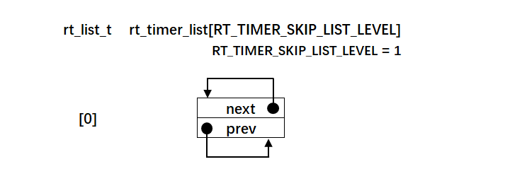

.. vim: syntax=rst

定时器的实现
------

在本章之前，为了实现线程的阻塞延时，在线程控制块中内置了一个延时变量remaining_tick。每当线程需要延时的时候，就初始化remaining_tick需要延时的时间，然后将线程挂起，这里的挂起只是将线程在线程就绪优先级组中对应的位清0，并不会将线程从线程优先级表（即就绪列表）中删除。当每次时
基中断（SysTick中断）来临时，就扫描就绪列表中的每个线程的remaining_tick，如果remaining_tick大于0则递减一次，然后判断remaining_tick是否为0，如果为0则表示延时时间到，将该线程就绪（即将线程在线程就绪优先级组中对应的位置位），然后等待系统下一次调度。这
种延时的缺点是，在每个时基中断中需要对所有线程都扫描一遍，费时，优点是容易理解。之所以先这样讲解是为了慢慢地过度到RT-Thread定时器的讲解。

在RT-Thread中，每个线程都内置一个定时器，当线程需要延时的时候，则先将线程挂起，然后内置的定时器就会启动，并且将定时器插入到一个全局的系统定时器列表rt_timer_list，这个全局的系统定时器列表维护着一条双向链表，每个节点代表了正在延时的线程的定时器，节点按照延时时间大小做升序排列。当
每次时基中断（SysTick中断）来临时，就扫描系统定时器列表的第一个定时器，看看延时时间是否到，如果到则让该定时器对应的线程就绪，如果延时时间不到，则退出扫描，因为定时器节点是按照延时时间升序排列的，第一个定时器延时时间不到期的话，那后面的定时器延时时间自然不到期。比起第一种方法，这种方法就大大缩
短了寻找延时到期的线程的时间。

实现定时器
~~~~~

接下来具体讲解下RT-Thread定时器的实现，彻底掀开定时器这层朦胧的面纱，要知道这部分功能的有些细节方面可是花了我好些功夫才完全看明白。

系统定时器列表
^^^^^^^

在RT-Thread中，定义了一个全局的系统定时器列表，当线程需要延时时，就先把线程挂起，然后线程内置的定时器将线程挂起到这个系统定时器列表中，系统定时器列表维护着一条双向链表，节点按照定时器的延时时间的大小做升序排列。该系统定时器在timer.c
（timer.c第一次使用需要在rtthread\3.0.3\src目录下新建，然后添加到工程的rtt/source组中）中定义，具体实现见代码清单 11‑1。

代码清单 11‑1系统定时器列表

1 /\* 硬件定时器列表 \*/

2 static rt_list_t rt_timer_list[RT_TIMER_SKIP_LIST_LEVEL]; **(1)**

代码清单 11‑1\ **(1)**\ ：系统定时器列表是一个rt_list 类型的数组，数组的大小由在rtdef.h中定义的宏RT_TIMER_SKIP_LIST_LEVEL决定，默认定义为1，即数组只有一个成员。

系统定时器列表初始化
^^^^^^^^^^

系统定时器列表初始化由函数rt_system_timer_init()来完成，在初始化调度器前需要先初始化系统定时器列表。该函数在timer.c中定义，具体实现见代码清单 11‑2。

代码清单 11‑2 系统定时器列表初始化

1 void rt_system_timer_init(void)

2 {

3 int i;

4

5 for (i = 0; i < sizeof(rt_timer_list) / sizeof(rt_timer_list[0]); i++) **(1)**

6 {

7 rt_list_init(rt_timer_list + i); **(2)**

8 }

9 }

代码清单 11‑2\ **(1)**\ ：系统定时器列表是一个rt_list 节点类型的数组，rt_timer_list里面的成员就是一个双向链表的根节点，有多少个成员就初始化多少个根节点，目前只有一个，所以该for循环只执行一次。

代码清单 11‑2\ **(2)**\ ：初始化节点，即初始化节点的next和prev这两个指针指向节点本身。初始化好的系统定时器列表的示意图具体见图 11‑1。

|timer002|

图 11‑1 初始化好的系统定时器列表

定义定时器结构体
^^^^^^^^

定时器统一由一个定时器结构体来管理，该结构体在rtdef.h中定义，具体实现见代码清单 11‑3。

代码清单 11‑3定时器结构体

1 /*\*

2 \* 定时器结构体

3 \*/

4 struct rt_timer

5 {

6 struct rt_object parent; /\* 从 rt_object 继承 \*/\ **(1)**

7

8 rt_list_t row[RT_TIMER_SKIP_LIST_LEVEL]; /\* 节点 \*/ **(2)**

9

10 void (*timeout_func)(void \*parameter); /\* 超时函数 \*/ **(3)**

11 void \*parameter; /\* 超时函数形参 \*/ **(4)**

12

13 rt_tick_t init_tick; /\* 定时器实际需要延时的时间 \*/ **(5)**

14 rt_tick_t timeout_tick; /\* 定时器实际超时时的系统节拍数 \*/ **(6)**

15 };

16 typedef struct rt_timer \*rt_timer_t; **(7)**

代码清单 11‑3\ **(1)**\ ：定时器也属于内核对象，也会在自身结构体里面包含一个内核对象类型的成员，通过这个成员可以将定时器挂到系统对象容器里面。

代码清单 11‑3\ **(2)**\ ：定时器自身的节点，通过该节点可以实现将定时器插入到系统定时器列表。RT_TIMER_SKIP_LIST_LEVEL在rtdef.h中定义，默认为0。

代码清单 11‑3 **(3)**\ ：定时器超时函数，当定时器延时到期时，会调用相应的超时函数，该函数接下来会讲解。

代码清单 11‑3 **(4)**\ ：定时器超时函数形参。

代码清单 11‑3 **(5)**\ ：定时器实际需要延时的时间，单位为tick。

代码清单 11‑3 **(6)**\ ：定时器实际超时时的系统节拍数。这个如何理解？我们知道系统定义了一个全局的系统时基计数器rt_tick（在clock.c中定义），每产生一次系统时基中断（即SysTick中断）时，rt_tick计数加一。假设线程要延时10个tick，即init_tick等于10
，此时rt_tick等于2，那么timeout_tick就等于10加2等于12，当rt_tick递增到12的时候，线程延时到期，这个就是timeout_tick的实际含义。

在线程控制块中内置定时器
^^^^^^^^^^^^

每个线程都会内置一个定时器，具体是在线程控制块中添加一个定时器成员，具体实现见代码清单 11‑4的加粗部分。

代码清单 11‑4在线程控制块中内置定时器

1 struct rt_thread

2 {

3 /\* rt 对象 \*/

4 char name[RT_NAME_MAX]; /\* 对象的名字 \*/

5 rt_uint8_t type; /\* 对象类型 \*/

6 rt_uint8_t flags; /\* 对象的状态 \*/

7 rt_list_t list; /\* 对象的列表节点 \*/

8

9 rt_list_t tlist; /\* 线程链表节点 \*/

10

11 void \*sp; /\* 线程栈指针 \*/

12 void \*entry; /\* 线程入口地址 \*/

13 void \*parameter; /\* 线程形参 \*/

14 void \*stack_addr; /\* 线程起始地址 \*/

15 rt_uint32_t stack_size; /\* 线程栈大小，单位为字节 \*/

16

17 rt_ubase_t remaining_tick; /\* 用于实现阻塞延时 \*/

18

19 rt_uint8_t current_priority; /\* 当前优先级 \*/

20 rt_uint8_t init_priority; /\* 初始优先级 \*/

21 rt_uint32_t number_mask; /\* 当前优先级掩码 \*/

22

23 rt_err_t error; /\* 错误码 \*/

24 rt_uint8_t stat; /\* 线程的状态 \*/

25

**26 struct rt_timer thread_timer; /\* 内置的线程定时器 \*/**

27 };

定时器初始化函数
^^^^^^^^

定时器初始化函数rt_timer_init在timer.c中定义，具体实现见代码清单 11‑5。

代码清单 11‑5 rt_timer_init函数

1 /*\*

2 \* 该函数用于初始化一个定时器，通常该函数用于初始化一个静态的定时器

3 \*

4 \* @param timer 静态定时器对象

5 \* @param name 定时器的名字

6 \* @param timeout 超时函数

7 \* @param parameter 超时函数形参

8 \* @param time 定时器的超时时间

9 \* @param flag 定时器的标志

10 \*/

11 void rt_timer_init(rt_timer_t timer,

12 const char \*name,

13 void (*timeout)(void \*parameter),

14 void \*parameter,

15 rt_tick_t time,

16 rt_uint8_t flag)

17 {

18 /\* 定时器对象初始化 \*/

19 rt_object_init((rt_object_t)timer, RT_Object_Class_Timer, name); **(1)**

20

21 /\* 定时器初始化 \*/

22 \_rt_timer_init(timer, timeout, parameter, time, flag); **(2)**

23 }

代码清单 11‑5\ **(1)**\ ：定时器对象初始化，即将定时器插入到系统对象容器列表。有关对象相关的知识点请参考“对象容器的实现”章节。

代码清单 11‑5\ **(2)**\ ：定时器初始化函数rt_timer_init将定时器具体的初始化由封装在了一个内部函数_rt_timer_init（函数开头的“_rt”表示该函数是一个内部函数）中，该函数在timer.c中定义，具体实现见代码清单 11‑6。

代码清单 11‑6 \_rt_timer_init函数

1 static void \_rt_timer_init(rt_timer_t timer, **(1)**

2 void (*timeout)(void \*parameter), **(2)**

3 void \*parameter, **(3)**

4 rt_tick_t time, **(4)**

5 rt_uint8_t flag) **(5)**

6 {

7 int i;

8

9 /\* 设置标志 \*/

10 timer->parent.flag = flag; **(6)**

11

12 /\* 先设置为非激活态 \*/

13 timer->parent.flag &= ~RT_TIMER_FLAG_ACTIVATED; **(7)**

14

15 timer->timeout_func = timeout; **(8)**

16 timer->parameter = parameter; **(9)**

17

18 /\* 初始化定时器实际超时时的系统节拍数 \*/

19 timer->timeout_tick = 0; **(10)**

20 /\* 初始化定时器需要超时的节拍数 \*/

21 timer->init_tick = time; **(11)**

22

23 /\* 初始化定时器的内置节点 \*/

24 for (i = 0; i < RT_TIMER_SKIP_LIST_LEVEL; i++) **(12)**

25 {

26 rt_list_init(&(timer->row[i]));

27 }

28 }

代码清单 11‑6\ **(1)**\ ：定时器控制块指针。

代码清单 11‑6\ **(2)**\ ：定时器超时函数。

代码清单 11‑6\ **(3)**\ ：定时器超时函数形参。

代码清单 11‑6\ **(4)**\ ：定时器实际需要延时的时间。

代码清单 11‑6\ **(5)**\ ：设置定时器的标志，取值在rtdef.h中定义，具体见代码清单 11‑7。

代码清单 11‑7 定时器状态宏定义

1 #define RT_TIMER_FLAG_DEACTIVATED 0x0 /\* 定时器没有激活 \*/

2 #define RT_TIMER_FLAG_ACTIVATED 0x1 /\* 定时器已经激活 \*/

3 #define RT_TIMER_FLAG_ONE_SHOT 0x0 /\* 单次定时 \*/

4 #define RT_TIMER_FLAG_PERIODIC 0x2 /\* 周期定时 \*/

5

6 #define RT_TIMER_FLAG_HARD_TIMER 0x0 /\* 硬件定时器，定时器回调函数在 tick isr中调用 \*/

7

8 #define RT_TIMER_FLAG_SOFT_TIMER 0x4 /\* 软件定时器，定时器回调函数在定时器线程中调用 \*/

代码清单 11‑6\ **(6)**\ ：设置标志。

代码清单 11‑6\ **(7)**\ ：初始时设置为非激活态。

代码清单 11‑6\ **(8)**\ ： 设置超时函数，超时函数接下来会讲。

代码清单 11‑6\ **(9)**\ ： 定时器超时函数形参。

代码清单 11‑6\ **(10)**\ ：初始化定时器实际超时时的系统节拍数。

代码清单 11‑6\ **(11)**\ ：初始化定时器需要超时的节拍数。

代码清单 11‑6\ **(12)**\ ：初始化定时器的内置节点，即将节点的next和prev这两个指针指向节点本身。当启动定时器的时候，定时器就通过该节点将自身插入到系统定时器列表rt_timer_list中。

定时器删除函数
^^^^^^^

定时器删除函数_rt_timer_remove在timer.c中定义，实现算法是将定时器自身的节点从系统定时器列表rt_timer_list脱离即可，具体实现见代码清单 11‑8。

代码清单 11‑8 \_rt_timer_remove函数定义

1 rt_inline void \_rt_timer_remove(rt_timer_t timer)

2 {

3 int i;

4

5 for (i = 0; i < RT_TIMER_SKIP_LIST_LEVEL; i++)

6 {

7 rt_list_remove(&timer->row[i]);

8 }

9 }

定时器停止函数
^^^^^^^

定时器停止函数rt_timer_stop在timer.c中定义，实现的算法也很简单，主要分成两步，先将定时器从系统定时器列表删除，然后改变定时器的状态为非active即可，具体代码实现见代码清单 11‑9。

代码清单 11‑9 rt_timer_stop 函数定义

1 /*\*

2 \* 该函数将停止一个定时器

3 \*

4 \* @param timer 将要被停止的定时器

5 \*

6 \* @return 操作状态, RT_EOK on OK, -RT_ERROR on error

7 \*/

8 rt_err_t rt_timer_stop(rt_timer_t timer)

9 {

10 register rt_base_t level;

11

12 /\* 只有active的定时器才能被停止，否则退出返回错误码 \*/

13 if (!(timer->parent.flag & RT_TIMER_FLAG_ACTIVATED))

14 return -RT_ERROR;

15

16 /\* 关中断 \*/

17 level = rt_hw_interrupt_disable();

18

19 /\* 将定时器从定时器列表删除 \*/

20 \_rt_timer_remove(timer);

21

22 /\* 开中断 \*/

23 rt_hw_interrupt_enable(level);

24

25 /\* 改变定时器的状态为非active \*/

26 timer->parent.flag &= ~RT_TIMER_FLAG_ACTIVATED;

27

28 return RT_EOK;

29 }

定时器控制函数
^^^^^^^

定时器控制函数rt_timer_control在timer.c中定义，具体实现算法是根据不同的形参来设置定时器的状态和初始时间值，具体代码实现见代码清单 11‑10。

代码清单 11‑10 rt_timer_control函数定义

1 /*\*

2 \* 该函数将获取或者设置定时器的一些选项

3 \*

4 \* @param timer 将要被设置或者获取的定时器

5 \* @param cmd 控制命令

6 \* @param arg 形参

7 \*

8 \* @return RT_EOK

9 \*/ **(1) (2) (3)**

10 rt_err_t rt_timer_control(rt_timer_t timer, int cmd, void \*arg)

11 {

12 switch (cmd)

13 {

14 case RT_TIMER_CTRL_GET_TIME: **(4)**

15 \*(rt_tick_t \*)arg = timer->init_tick;

16 break;

17

18 case RT_TIMER_CTRL_SET_TIME: **(5)**

19 timer->init_tick = \*(rt_tick_t \*)arg;

20 break;

21

22 case RT_TIMER_CTRL_SET_ONESHOT:

23 timer->parent.flag &= ~RT_TIMER_FLAG_PERIODIC; **(6)**

24 break;

25

26 case RT_TIMER_CTRL_SET_PERIODIC:

27 timer->parent.flag \|= RT_TIMER_FLAG_PERIODIC; **(7)**

28 break;

29 }

30

31 return RT_EOK;

32 }

代码清单 11‑10 **(1)**\ ：timer表示要控制的定时器。

代码清单 11‑10 **(2)**\ ：cmd表示控制命令，取值在rtdef.h中定义，具体见代码清单 11‑11。

代码清单 11‑11 定时器控制命令宏定义

1 #define RT_TIMER_CTRL_SET_TIME 0x0 /\* 设置定时器定时时间 \*/

2 #define RT_TIMER_CTRL_GET_TIME 0x1 /\* 获取定时器定时时间 \*/

3 #define RT_TIMER_CTRL_SET_ONESHOT 0x2 /\* 修改定时器为一次定时 \*/

4 #define RT_TIMER_CTRL_SET_PERIODIC 0x3 /\* 修改定时器为周期定时 \*/

代码清单 11‑10 **(3)**\ ：控制定时器的形参，参数取值的含义根据第二个形参cmd来决定。

代码清单 11‑10 **(4)**\ ：获取定时器延时的初始时间。

代码清单 11‑10 **(5)**\ ：重置定时器的延时时间。

代码清单 11‑10 **(6)**\ ：设置定时器为一次延时，即延时到期之后定时器就停止了。

代码清单 11‑10 **(7)**\ ：设置定时器为周期延时，即延时到期之后又重新启动定时器。

定时器启动函数
^^^^^^^

定时器启动函数rt_timer_start在timer.c中定义，核心实现算法是将定时器按照延时时间做升序排列插入到系统定时器列表rt_timer_list中，具体代码实现见代码清单 11‑12。

代码清单 11‑12 rt_timer_start函数定义

1 /*\*

2 \* 启动定时器

3 \*

4 \* @param timer 将要启动的定时器

5 \*

6 \* @return 操作状态, RT_EOK on OK, -RT_ERROR on error

7 \*/

8 rt_err_t rt_timer_start(rt_timer_t timer)

9 {

10 unsigned int row_lvl = 0;

11 rt_list_t \*timer_list;

12 register rt_base_t level;

13 rt_list_t \*row_head[RT_TIMER_SKIP_LIST_LEVEL];

14 unsigned int tst_nr;

15 static unsigned int random_nr;

16

17

18 /\* 关中断 \*/

19 level = rt_hw_interrupt_disable(); **(1)**

20

21 /\* 将定时器从系统定时器列表移除 \*/

22 \_rt_timer_remove(timer);

23

24 /\* 改变定时器的状态为非active \*/

25 timer->parent.flag &= ~RT_TIMER_FLAG_ACTIVATED;

26

27 /\* 开中断 \*/

28 rt_hw_interrupt_enable(level);

29

30 /\* 获取 timeout tick,

31 最大的timeout tick 不能大于 RT_TICK_MAX/2 \*/

32 timer->timeout_tick = rt_tick_get() + timer->init_tick; **(2)**

33

34 /\* 关中断 \*/

35 level = rt_hw_interrupt_disable();

36

37

38 /\* 将定时器插入到定时器列表 \*/

39 /\* 获取系统定时器列表根节点地址，rt_timer_list是一个全局变量 \*/

40 timer_list = rt_timer_list; **(3)**

41

42

43 /\* 获取系统定时器列表第一条链表根节点地址 \*/

44 row_head[0] = &timer_list[0]; **(4)**

45

46 /\* 因为RT_TIMER_SKIP_LIST_LEVEL等于1，这个循环只会执行一次 \*/

47 for (row_lvl = 0; row_lvl < RT_TIMER_SKIP_LIST_LEVEL; row_lvl++) **(5)**

48 {

49 /\* 当系统定时器列表rt_timer_list为空时，该循环不执行 \*/ **(6)**

50 for (; row_head[row_lvl] != timer_list[row_lvl].prev; row_head[row_lvl] = row_head[row_lvl]->next)

51 {

52 struct rt_timer \*t;

53

54 /\* 获取定时器列表节点地址 \*/

55 rt_list_t \*p = row_head[row_lvl]->next; **(6)-①**

56

57 /\* 根据节点地址获取父结构的指针 \*/ **(6)-②**

58 t = rt_list_entry(p, /\* 节点地址 \*/

59 struct rt_timer, /\* 节点所在父结构的数据类型 \*/

60 row[row_lvl]); /\* 节点在父结构中叫什么，即名字 \*/

61

62 /\* 两个定时器的超时时间相同，则继续在定时器列表中寻找下一个节点 \*/

63 if ((t->timeout_tick - timer->timeout_tick) == 0) **(6)-③**

64 {

65 continue;

66 }

67 /\* \*/

68 else if ((t->timeout_tick - timer->timeout_tick) < RT_TICK_MAX / 2)

69 {

70 break;

71 }

72

73 }

74 /\* 条件不会成真，不会被执行 \*/

75 if (row_lvl != RT_TIMER_SKIP_LIST_LEVEL - 1)

76 {

77 row_head[row_lvl + 1] = row_head[row_lvl] + 1;

78 }

79 }

80

81 /\* random_nr是一个静态变量，用于记录启动了多少个定时器 \*/

82 random_nr++;

83 tst_nr = random_nr;

84

85 /\* 将定时器插入到系统定时器列表 \*/ **(7)**

86 rt_list_insert_after(row_head[RT_TIMER_SKIP_LIST_LEVEL - 1], /\* 双向列表根节点地址 \*/

87 &(timer->row[RT_TIMER_SKIP_LIST_LEVEL - 1])); /\* 要被插入的节点的地址 \*/

88

89 /\* RT_TIMER_SKIP_LIST_LEVEL 等于1，该for循环永远不会执行 \*/

90 for (row_lvl = 2; row_lvl <= RT_TIMER_SKIP_LIST_LEVEL; row_lvl++)

91 {

92 if (!(tst_nr & RT_TIMER_SKIP_LIST_MASK))

93 rt_list_insert_after(row_head[RT_TIMER_SKIP_LIST_LEVEL - row_lvl],

94 &(timer->row[RT_TIMER_SKIP_LIST_LEVEL - row_lvl]));

95 else

96 break;

97

98 tst_nr >>= (RT_TIMER_SKIP_LIST_MASK + 1) >> 1;

99 }

100

101 /\* 设置定时器标志位为激活态 \*/

102 timer->parent.flag \|= RT_TIMER_FLAG_ACTIVATED; **(8)**

103

104 /\* 开中断 \*/

105 rt_hw_interrupt_enable(level);

106

107 return -RT_EOK;

108 }

在阅读代码清单 11‑12的内容时，配套一个初始化好的空的系统定时器列表示意图会更好理解，该图具体见。

|timer003|

图 11‑2 一个初始化好的空的系统定时器列表示意图

代码清单 11‑12\ **(1)**\ ：关中断，进入临界段，启动定时器之前先将定时器从系统定时器列表删除，状态改为非active。

代码清单 11‑12\ **(2)**\ ：计算定时器超时结束时的系统时基节拍计数器的值，当系统时基节拍计数器rt_tick的值等于timeout_tick时，表示定时器延时到期。在RT-
Thread中，timeout_tick的值要求不能大于RT_TICK_MAX/2，RT_TICK_MAX是在rtdef.h中定义的宏，具体为32位整形的最大值0xffffffff。

代码清单 11‑12\ **(3)**\ ：获取系统定时器列表rt_timer_list的根节点地址，rt_timer_list是一个全局变量。

代码清单 11‑12\ **(4)**\ ：获取系统定时器列表第一条链表根节点地址。

代码清单 11‑12\ **(5)**\ ：因为RT_TIMER_SKIP_LIST_LEVEL等于1，这个for循环只会执行一次，即只有一条定时器双向链表。首先row_lvl等于0，因为RT_TIMER_SKIP_LIST_LEVEL等于1，所以row_lvl <
RT_TIMER_SKIP_LIST_LEVEL条件成立，for循环体会被执行，当执行完for函数体时，执行row_lvl++变成1，再执行判断row_lvl < RT_TIMER_SKIP_LIST_LEVEL，此时两者相等，条件不成立，则跳出for循环，只执行一次。

代码清单 11‑12\ **(6)**\ ：当系统定时器列表rt_timer_list为空时，该循环体不执行。rt_timer_list为空是什么样，具体见图 11‑2，用代码表示就是row_head[row_lvl] = timer_list[row_lvl].prev（此时row_lvl等于0）
。现在我们假设有三个定时器需要插入到系统定时器列表rt_timer_list，定时器1的timeout_tick等于4，定时器2的timeout_tick等于2，定时器3的timeout_tick等于3，插入的顺序为定时器1先插入，然后是定时器2，再然后是定时器3。接下来我们看看这三个定时器是如何插
入到系统定时器列表的。

插入定时器1（timeout_tick=4）
''''''''''''''''''''''

当启动定时器1之前，系统定时器列表为空，代码清单 11‑12\ **(6)** 跳过不执行，紧接着执行到代码清单 11‑12\ **(7)**\ ，定时器1作为第一个节点插入到系统定时器列表，示意图具体见图 11‑3。

|timer004|

图 11‑3 定时器1插入到系统定时器列表（timeouttick = 4）

定时器1插入到系统定时器之后，会执行到代码清单 11‑12\ **(8)** 将定时器的状态改变为非active态，至此，定时器1顺利完成插入。

插入定时器2（timeout_tick=2）
''''''''''''''''''''''

此时要插入定时器2，定时器启动函数rt_timer_start会重新被调用，代码清单 11‑12\ **(1) ~(5)** 的执行过程与定时器1插入时是一样的，有区别的是代码清单 11‑12\ **(6)**\ 部分。此时系统定时器列表里面有定时器1，所以不为空，该for循环体会被执行。

代码清单 11‑12\ **(6)-①**\ ：获取定时器列表节点地址，此时p的值等于定时器1里面row[0]的地址。

代码清单 11‑12\ **(6)-②**\ ：根据节点地址p获取父结构的指针，即根据row[0]的地址获取到row[0]所在定时器的地址，即定时器1的地址。

代码清单 11‑12\ **(6)-③**\ ：比较两个定时器的timeout_tick值，如果相等则继续与下一个节点的定时器比较。定时器1的timeout_tick等于4，定时器2的timeout_tick等于2，4减2等于2，小于RT_TICK_MAX /
2，则跳出（break）当前的for循环，当前for循环里面的row_head[row_lvl] = row_head[row_lvl]->next语句不会被执行，即row_head[row_lvl=0]存的还是系统定时器列表rt_timer_list的根节点。然后执行代码清单 11‑12\
**(7)**\ ，将定时器2插入到系统定时器列表根节点的后面，即定时器1节点的前面，实现了按照timeout_tick的大小做升序排列，示意图具体见图 11‑4。

|timer005|

图 11‑4 定时器2插入到系统定时器列表（timeouttick = 2）

插入定时器3（timeout_tick=3）
''''''''''''''''''''''

此时要插入定时器3，定时器启动函数rt_timer_start会重新被调用，代码清单 11‑12\ **(1) ~(5)** 的执行过程与定时器1和2插入时是一样的，有区别的是代码清单 11‑12\ **(6)**\
部分。此时系统定时器列表里面有定时器1和定时器2，所以不为空，该for循环体会被执行。

代码清单 11‑12\ **(6)-①**\ ：获取定时器列表节点地址，此时p的值等于定时器2里面row[0]的地址。

代码清单 11‑12\ **(6)-②**\ ：根据节点地址p获取父结构的指针，即根据row[0]的地址获取到row[0]所在定时器的地址，即定时器2的地址。

代码清单 11‑12\ **(6)-③**\ ：比较两个定时器的timeout_tick值，如果相等则继续与下一个节点的定时器比较。定时器2的timeout_tick等于2，定时器3的timeout_tick等于3，2减3等于-1，-1的补码为0xfffffffe，大于RT_TICK_MAX /
2，表示定时器3应该插入到定时器2之后，但是定时器2之后还有节点，需要继续比较，则继续执行for循环：执行 row_head[row_lvl] = row_head[row_lvl]->next语句，得到row_head[row_lvl=0]等于定时器2里面row[0]的地址，重新执行代码代码清单
11‑12\ **(6)-①~③**\ ：

代码清单 11‑12\ **(6)-①**\ ：获取定时器列表节点地址，此时p的值等于定时器1里面row[0]的地址。

代码清单 11‑12\ **(6)-②**\ ：根据节点地址p获取父结构的指针，即根据row[0]的地址获取到row[0]所在定时器的地址，即定时器1的地址。

代码清单 11‑12\ **(6)-③**\ ：比较两个定时器的timeout_tick值，如果相等则继续与下一个节点的定时器比较。定时器1的timeout_tick等于4，定时器3的timeout_tick等于3，4减3等于1，1小于RT_TICK_MAX /
2，则跳出当前的for循环，表示定时器3应该插入到定时器1之前，要插入的位置找到。然后执行代码清单 11‑12\ **(7)**\ ，将定时器3插入到定时器2后面，实现了按照timeout_tick的大小做升序排列，示意图具体见图 11‑5。

|timer006|

图 11‑5定时器3插入到系统定时器列表（timeouttick =3）

定时器扫描函数
^^^^^^^

定时器扫描函数rt_timer_check在timer.c中定义，用于扫描系统定时器列表，查询定时器的延时是否到期，如果到期则让对应的线程就绪，具体实现见代码清单 11‑13。

代码清单 11‑13rt_timer_check函数定义

1 /*\*

2 \* 该函数用于扫描系统定时器列表，当有超时事件发生时

3 \* 就调用对应的超时函数

4 \*

5 \* @note 该函数在操作系统定时器中断中被调用

6 \*/

7 void rt_timer_check(void)

8 {

9 struct rt_timer \*t;

10 rt_tick_t current_tick;

11 register rt_base_t level;

12

13 /\* 获取系统时基计数器rt_tick的值 \*/

14 current_tick = rt_tick_get(); **(1)**

15

16 /\* 关中断 \*/

17 level = rt_hw_interrupt_disable(); **(2)**

18

19 /\* 系统定时器列表不为空，则扫描定时器列表 \*/ **(3)**

20 while (!rt_list_isempty(&rt_timer_list[RT_TIMER_SKIP_LIST_LEVEL - 1]))

21 {

22 /\* 获取第一个节点定时器的地址 \*/ **(4)**

23 t = rt_list_entry(rt_timer_list[RT_TIMER_SKIP_LIST_LEVEL - 1].next,

24 struct rt_timer,

25 row[RT_TIMER_SKIP_LIST_LEVEL - 1]);

26

27 if ((current_tick - t->timeout_tick) < RT_TICK_MAX / 2) **(5)**

28 {

29 /\* 先将定时器从系统定时器列表移除 \*/

30 \_rt_timer_remove(t); **(6)**

31

32 /\* 调用超时函数 \*/

33 t->timeout_func(t->parameter); **(7)**

34

35 /\* 重新获取 rt_tick \*/

36 current_tick = rt_tick_get(); **(8)**

37

38 /\* 周期定时器 \*/ **(9)**

39 if ((t->parent.flag & RT_TIMER_FLAG_PERIODIC) &&

40 (t->parent.flag & RT_TIMER_FLAG_ACTIVATED))

41 {

42 /\* 启动定时器 \*/

43 t->parent.flag &= ~RT_TIMER_FLAG_ACTIVATED;

44 rt_timer_start(t);

45 }

46 /\* 单次定时器 \*/ **(10)**

47 else

48 {

49 /\* 停止定时器 \*/

50 t->parent.flag &= ~RT_TIMER_FLAG_ACTIVATED;

51 }

52 }

53 else

54 break; **(11)**

55 }

56

57 /\* 开中断 \*/

58 rt_hw_interrupt_enable(level); **(12)**

59 }

代码清单 11‑13\ **(1)**\ ：获取系统时基计数器rt_tick的值，rt_tick是一个在clock.c中定义全局变量，用于记录系统启动至今经过了多少个tick。

代码清单 11‑13\ **(2)**\ ：关中断，接下来扫描系统时基列表rt_timer_list的过程不能被中断。

代码清单 11‑13\ **(3)**\ ：系统定时器列表不为空，则扫描整个定时器列表，如果列表的第一个节点的定时器延时不到期，则退出，因为列表中的定时器节点是按照延时时间做升序排列的，第一个延时不到期，则后面的肯定不到期。

代码清单 11‑13\ **(4)**\ ：获取第一个节点定时器的地址。

代码清单 11‑13\ **(5)**\ ：定时器超时时间到。

代码清单 11‑13\ **(6)**\ ：将定时器从系统定时器列表rt_timer_list移除，表示延时时间到。

代码清单 11‑13\ **(7)**\ ：调用超时函数rt_thread_timeout，将线程就绪。该函数在thread.c中定义，具体实现见代码清单 11‑14。

代码清单 11‑14 rt_thread_timeout函数定义

1 /*\*

2 \* 线程超时函数

3 \* 当线程延时到期或者等待的资源可用或者超时时，该函数会被调用

4 \*

5 \* @param parameter 超时函数的形参

6 \*/

7 void rt_thread_timeout(void \*parameter)

8 {

9 struct rt_thread \*thread;

10

11 thread = (struct rt_thread \*)parameter;

12

13 /\* 设置错误码为超时 \*/ **(1)**

14 thread->error = -RT_ETIMEOUT;

15

16 /\* 将线程从挂起列表中删除 \*/ **(2)**

17 rt_list_remove(&(thread->tlist));

18

19 /\* 将线程插入到就绪列表 \*/ **(3)**

20 rt_schedule_insert_thread(thread);

21

22 /\* 系统调度 \*/ **(4)**

23 rt_schedule();

24 }

代码清单 11‑14\ **(1)**\ ：设置线程错误码为超时。

代码清单 11‑14\ **(2)**\ ：将线程从挂起列表中删除，前提是线程在等待某些资源而被挂起到挂起列表，如果只是延时到期，则这个只是空操作。

代码清单 11‑14\ **(3)**\ ：将线程就绪。

代码清单 11‑14\ **(4)**\ ：因为有新的线程就绪，需要执行系统调度。

代码清单 11‑13\ **(8)**\ ：重新获取系统时基计数器rt_tick的值。

代码清单 11‑13\ **(9)**\ ：如果定时器是周期定时器则重新启动定时器。

代码清单 11‑13\ **(10)**\ ：如果定时器为单次定时器则停止定时器。

代码清单 11‑13\ **(11)**\ ：第一个节点定时器延时没有到期，则跳出while循环，因为链表中的定时器节点是按照延时的时间做升序排列的，第一个定时器延时不到期，则后面的肯定不到期，不用再继续扫描。

代码清单 11‑13\ **(12)**\ ：系统定时器列表扫描完成，开中断。

修改代码，支持定时器
~~~~~~~~~~

修改线程初始化函数
^^^^^^^^^

在线程初始化函数中，需要将自身内置的定时器初始化好，具体见代码清单 11‑15的加粗部分。

代码清单 11‑15 修改线程初始化函数

1 rt_err_t rt_thread_init( struct rt_thread \*thread,

2 const char \*name,

3 void (*entry)(void \*parameter),

4 void \*parameter,

5 void \*stack_start,

6 rt_uint32_t stack_size,

7 rt_uint8_t priority)

8 {

9 /\* 线程对象初始化 \*/

10 /\* 线程结构体开头部分的成员就是rt_object_t类型 \*/

11 rt_object_init((rt_object_t)thread, RT_Object_Class_Thread, name);

12 rt_list_init(&(thread->tlist));

13

14 thread->entry = (void \*)entry;

15 thread->parameter = parameter;

16

17 thread->stack_addr = stack_start;

18 thread->stack_size = stack_size;

19

20 /\* 初始化线程栈，并返回线程栈指针 \*/

21 thread->sp = (void \*)rt_hw_stack_init( thread->entry,

22 thread->parameter,

23 (void \*)((char \*)thread->stack_addr + thread->stack_size - 4) );

24

25 thread->init_priority = priority;

26 thread->current_priority = priority;

27 thread->number_mask = 0;

28

29 /\* 错误码和状态 \*/

30 thread->error = RT_EOK;

31 thread->stat = RT_THREAD_INIT;

32

**33 /\* 初始化线程定时器 \*/**

**34 rt_timer_init(&(thread->thread_timer), /\* 静态定时器对象 \*/**

**35 thread->name, /\* 定时器的名字，直接使用的是线程的名字 \*/**

**36 rt_thread_timeout, /\* 超时函数 \*/**

**37 thread, /\* 超时函数形参 \*/**

**38 0, /\* 延时时间 \*/**

**39 RT_TIMER_FLAG_ONE_SHOT); /\* 定时器的标志 \*/**

40

41 return RT_EOK;

42 }

修改线程延时函数
^^^^^^^^

线程延时函数rt_thread_delay具体修改见代码清单 11‑16的加粗部分，整个函数的实体由rt_thread_sleep代替。

代码清单 11‑16 修改线程延时函数

1 #if 0

2 void rt_thread_delay(rt_tick_t tick)

3 {

4 register rt_base_t temp;

5 struct rt_thread \*thread;

6

7 /\* 失能中断 \*/

8 temp = rt_hw_interrupt_disable();

9

10 thread = rt_current_thread;

11 thread->remaining_tick = tick;

12

13 /\* 改变线程状态 \*/

14 thread->stat = RT_THREAD_SUSPEND;

15 rt_thread_ready_priority_group &= ~thread->number_mask;

16

17 /\* 使能中断 \*/

18 rt_hw_interrupt_enable(temp);

19

20 /\* 进行系统调度 \*/

21 rt_schedule();

22 }

23 #else

**24 rt_err_t rt_thread_delay(rt_tick_t tick)**

**25 {**

**26 return rt_thread_sleep(tick); (1)**

**27 }**

28 #endif

代码清单 11‑16\ **(1)**\ ：rt_thread_sleep函数在thread.c定义，具体实现见代码清单 11‑17。

代码清单 11‑17 rt_thread_sleep函数定义

1 /*\*

2 \* 该函数将让当前线程睡眠一段时间，单位为tick

3 \*

4 \* @param tick 睡眠时间，单位为tick

5 \*

6 \* @return RT_EOK

7 \*/

8 rt_err_t rt_thread_sleep(rt_tick_t tick)

9 {

10 register rt_base_t temp;

11 struct rt_thread \*thread;

12

13 /\* 关中断 \*/

14 temp = rt_hw_interrupt_disable(); **(1)**

15

16 /\* 获取当前线程的线程控制块 \*/

17 thread = rt_current_thread; **(2)**

18

19 /\* 挂起线程 \*/

20 rt_thread_suspend(thread); **(3)**

21

22 /\* 设置线程定时器的超时时间 \*/

23 rt_timer_control(&(thread->thread_timer), RT_TIMER_CTRL_SET_TIME, &tick); **(4)**

24

25 /\* 启动定时器 \*/

26 rt_timer_start(&(thread->thread_timer)); **(5)**

27

28 /\* 开中断 \*/

29 rt_hw_interrupt_enable(temp); **(6)**

30

31 /\* 执行系统调度 \*/

32 rt_schedule(); **(7)**

33

34 return RT_EOK;

35 }

代码清单 11‑17\ **(1)**\ ：关中断。

代码清单 11‑17\ **(2)**\ ：获取当前线程的线程控制块，rt_current_thread是一个全局的线程控制块指针，用于指向当前正在运行的线程控制块。

代码清单 11‑17\ **(3)**\ ：在启动定时器之前，先把线程挂起来，线程挂起函数rt_thread_suspend在thread.c实现，具体实现见代码清单 11‑18。

代码清单 11‑18 rt_thread_suspend函数定义

1 /*\*

2 \* 该函数用于挂起指定的线程

3 \* @param thread 要被挂起的线程

4 \*

5 \* @return 操作状态, RT_EOK on OK, -RT_ERROR on error

6 \*

7 \* @note 如果挂起的是线程自身，在调用该函数后，

8 \* 必须调用rt_schedule()进行系统调度

9 \*

10 \*/

11 rt_err_t rt_thread_suspend(rt_thread_t thread)

12 {

13 register rt_base_t temp;

14

15

16 /\* 只有就绪的线程才能被挂起，否则退出返回错误码 \*/ **(1)**

17 if ((thread->stat & RT_THREAD_STAT_MASK) != RT_THREAD_READY)

18 {

19 return -RT_ERROR;

20 }

21

22 /\* 关中断 \*/

23 temp = rt_hw_interrupt_disable(); **(2)**

24

25 /\* 改变线程状态 \*/

26 thread->stat = RT_THREAD_SUSPEND; **(3)**

27 /\* 将线程从就绪列表删除 \*/

28 rt_schedule_remove_thread(thread); **(4)**

29

30 /\* 停止线程定时器 \*/

31 rt_timer_stop(&(thread->thread_timer)); **(5)**

32

33 /\* 开中断 \*/

34 rt_hw_interrupt_enable(temp); **(6)**

35

36 return RT_EOK;

37 }

代码清单 11‑18\ **(1)**\ ：只有就绪的线程才能被挂起，否则退出返回错误码。

代码清单 11‑18\ **(2)**\ ：关中断。

代码清单 11‑18\ **(3)**\ ：将线程的状态改为挂起态。

代码清单 11‑18\ **(4)**\ ：将线程从就绪列表删除，这里面包含了两个动作，一是将线程从线程优先级表里面删除，二是将线程在线程就绪优先级组中对应的位清零。

代码清单 11‑18\ **(5)**\ ：停止定时器。

代码清单 11‑18\ **(6)**\ ：开中断。

代码清单 11‑17\ **(4)**\ ：设置定时器的超时时间。

代码清单 11‑17\ **(5)**\ ：启动定时器。

代码清单 11‑17\ **(6)**\ ：开中断。

代码清单 11‑17\ **(7)**\ ：执行系统调度，因为当前线程要进入延时，接下来需要寻找就绪线程中优先级最高的线程来执行。

修改系统时基更新函数
^^^^^^^^^^

系统时基更新函数rt_thread_delay具体修改见代码清单 11‑19的加粗部分，整个函数的实体由rt_timer_check()代替。

代码清单 11‑19 修改系统时基更新函数

1 #if 0

2 void rt_tick_increase(void)

3 {

4 rt_ubase_t i;

5 struct rt_thread \*thread;

6 rt_tick ++;

7

8 /\* 扫描就绪列表中所有线程的remaining_tick，如果不为0，则减1 \*/

9 for (i=0; i<RT_THREAD_PRIORITY_MAX; i++)

10 {

11 thread = rt_list_entry( rt_thread_priority_table[i].next,

12 struct rt_thread,

13 tlist);

14 if (thread->remaining_tick > 0)

15 {

16 thread->remaining_tick --;

17 if (thread->remaining_tick == 0)

18 {

19 //rt_schedule_insert_thread(thread);

20 rt_thread_ready_priority_group \|= thread->number_mask;

21 }

22 }

23 }

24

25 /\* 线程调度 \*/

26 rt_schedule();

27 }

28

29 #else

**30 void rt_tick_increase(void)**

**31 {**

**32 /\* 系统时基计数器加1操作,rt_tick是一个全局变量 \*/**

**33 ++ rt_tick; (1)**

**34**

**35 /\* 扫描系统定时器列表 \*/**

**36 rt_timer_check(); (2)**

**37 }**

38 #endif

代码清单 11‑19\ **(1)**\ ：系统时基计数器加1操作，rt_tick是一个在clock.c中定义的全局变量，用于记录系统启动至今经过了多少个tick。

代码清单 11‑19\ **(2)**\ ：扫描系统定时器列表rt_timer_list，检查是否有定时器延时到期，如果有则将定时器从系统定时器列表删除，并将对应的线程就绪，然后执行系统调度。

修改main.c文件
^^^^^^^^^^

为了演示定时器的插入，我们新增加了一个线程3，在启动调度器初始化前，我们新增了定时器初始化rt_system_timer_init()，这两个改动具体见的代码清单 11‑20加粗部分。

代码清单 11‑20 main.c文件内容

1 /\*

2 \\*

3 \* 包含的头文件

4 \\*

5 \*/

6

7 #include <rtthread.h>

8 #include <rthw.h>

9 #include "ARMCM3.h"

10

11

12 /\*

13 \\*

14 \* 全局变量

15 \\*

16 \*/

17 rt_uint8_t flag1;

18 rt_uint8_t flag2;

**19 rt_uint8_t flag3;**

20

21 extern rt_list_t rt_thread_priority_table[RT_THREAD_PRIORITY_MAX];

22

23 /\*

24 \\*

25 \* 线程控制块 & STACK & 线程声明

26 \\*

27 \*/

28

29

30 /\* 定义线程控制块 \*/

31 struct rt_thread rt_flag1_thread;

32 struct rt_thread rt_flag2_thread;

**33 struct rt_thread rt_flag3_thread;**

34

35 ALIGN(RT_ALIGN_SIZE)

36 /\* 定义线程栈 \*/

37 rt_uint8_t rt_flag1_thread_stack[512];

38 rt_uint8_t rt_flag2_thread_stack[512];

**39 rt_uint8_t rt_flag3_thread_stack[512];**

40

41 /\* 线程声明 \*/

42 void flag1_thread_entry(void \*p_arg);

43 void flag2_thread_entry(void \*p_arg);

**44 void flag3_thread_entry(void \*p_arg);**

45

46 /\*

47 \\*

48 \* 函数声明

49 \\*

50 \*/

51 void delay(uint32_t count);

52

53 /\*

54 \* @brief main函数

55 \* @param 无

56 \* @retval 无

57 \*

58 \* @attention

59 \\*

60 \*/

61 int main(void)

62 {

63 /\* 硬件初始化 \*/

64 /\* 将硬件相关的初始化放在这里，如果是软件仿真则没有相关初始化代码 \*/

65

66 /\* 关中断 \*/

67 rt_hw_interrupt_disable();

68

69 /\* SysTick中断频率设置 \*/

70 SysTick_Config( SystemCoreClock / RT_TICK_PER_SECOND );

71

**72 /\* 系统定时器列表初始化 \*/**

**73 rt_system_timer_init();**

74

75 /\* 调度器初始化 \*/

76 rt_system_scheduler_init();

77

78 /\* 初始化空闲线程 \*/

79 rt_thread_idle_init();

80

81 /\* 初始化线程 \*/

82 rt_thread_init( &rt_flag1_thread, /\* 线程控制块 \*/

83 "rt_flag1_thread", /\* 线程名字，字符串形式 \*/

84 flag1_thread_entry, /\* 线程入口地址 \*/

85 RT_NULL, /\* 线程形参 \*/

86 &rt_flag1_thread_stack[0], /\* 线程栈起始地址 \*/

87 sizeof(rt_flag1_thread_stack), /\* 线程栈大小，单位为字节 \*/

88 2); /\* 优先级 \*/

89 /\* 将线程插入到就绪列表 \*/

90 rt_thread_startup(&rt_flag1_thread);

91

92 /\* 初始化线程 \*/

93 rt_thread_init( &rt_flag2_thread, /\* 线程控制块 \*/

94 "rt_flag2_thread", /\* 线程名字，字符串形式 \*/

95 flag2_thread_entry, /\* 线程入口地址 \*/

96 RT_NULL, /\* 线程形参 \*/

97 &rt_flag2_thread_stack[0], /\* 线程栈起始地址 \*/

98 sizeof(rt_flag2_thread_stack), /\* 线程栈大小，单位为字节 \*/

99 3); /\* 优先级 \*/

100 /\* 将线程插入到就绪列表 \*/

101 rt_thread_startup(&rt_flag2_thread);

102

103

**104 /\* 初始化线程 \*/**

**105 rt_thread_init( &rt_flag3_thread, /\* 线程控制块 \*/**

**106 "rt_flag3_thread", /\* 线程名字，字符串形式 \*/**

**107 flag3_thread_entry, /\* 线程入口地址 \*/**

**108 RT_NULL, /\* 线程形参 \*/**

**109 &rt_flag3_thread_stack[0], /\* 线程栈起始地址 \*/**

**110 sizeof(rt_flag3_thread_stack), /\* 线程栈大小，单位为字节 \*/**

**111 4); /\* 优先级 \*/**

**112 /\* 将线程插入到就绪列表 \*/**

**113 rt_thread_startup(&rt_flag3_thread);**

114

115 /\* 启动系统调度器 \*/

116 rt_system_scheduler_start();

117 }

118

119 /\*

120 \\*

121 \* 函数实现

122 \\*

123 \*/

124 /\* 软件延时 \*/

125 void delay (uint32_t count)

126 {

127 for (; count!=0; count--);

128 }

129

130 /\* 线程1 \*/

131 void flag1_thread_entry( void \*p_arg )

132 {

133 for ( ;; )

134 {

135 flag1 = 1;

136 rt_thread_delay(4);

137 flag1 = 0;

138 rt_thread_delay(4);

139 }

140 }

141

142 /\* 线程2 \*/

143 void flag2_thread_entry( void \*p_arg )

144 {

145 for ( ;; )

146 {

147 flag2 = 1;

148 rt_thread_delay(2);

149 flag2 = 0;

150 rt_thread_delay(2);

151 }

152 }

153

**154 /\* 线程3 \*/**

**155 void flag3_thread_entry( void \*p_arg )**

**156 {**

**157 for ( ;; )**

**158 {**

**159 flag3 = 1;**

**160 rt_thread_delay(3);**

**161 flag3 = 0;**

**162 rt_thread_delay(3);**

**163 }**

**164 }**

165

166

167 void SysTick_Handler(void)

168 {

169 /\* 进入中断 \*/

170 rt_interrupt_enter();

171

172 /\* 更新时基 \*/

173 rt_tick_increase();

174

175 /\* 离开中断 \*/

176 rt_interrupt_leave();

177 }

实验现象
~~~~

进入软件调试，全速运行程序，逻辑分析仪中的仿真波形图具体见图 11‑6。

|timer007|

图 11‑6 实验现象

从图 11‑6中可以看出线程1、线程2和线程3的高低电平的延时时间分别为4、2和3个tick，与代码控制的完全一致，说明我们的定时器起作用了，搞定。

